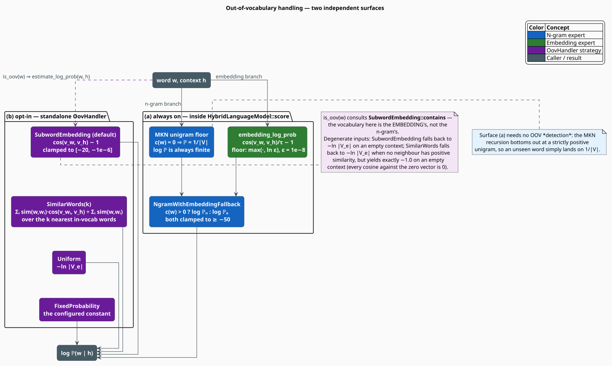

# Out-of-Vocabulary Handling

No corpus contains every word. Proper nouns, neologisms, typos, code identifiers, and inflections
the tokenizer never saw all arrive at query time as **out-of-vocabulary** (OOV) tokens, and a model
that assigns them probability zero is a model that rejects the sentences containing them. This
document is the complete account of how libgrammstein keeps an OOV word's probability strictly
positive — and, more usefully, *informative*.

There are **two independent surfaces**, and the distinction matters:

1. **Always on** — the floor built into `HybridLanguageModel::score` and, beneath it, into the MKN
   recursion itself. You get this for free; it needs no configuration and no OOV *detection*.
2. **Opt-in** — the standalone [`OovHandler`](../../../src/hybrid/oov.rs), a separate utility with
   four selectable strategies. **`HybridLanguageModel` never calls it.** A caller wires it up
   explicitly, or does not use it at all.

> **Scope.** Source of truth: [`src/hybrid/oov.rs`](../../../src/hybrid/oov.rs) and the
> `embedding_log_prob` / `score_with_fallback` methods of
> [`src/hybrid/model.rs`](../../../src/hybrid/model.rs). The n-gram side's own floor lives in
> [`src/ngram/smoothing/kneser_ney.rs`](../../../src/ngram/smoothing/kneser_ney.rs). See also
> [Interpolation](interpolation.md) for how $`\mathbb{P}_e`$ is defined, and
> [Subword Embeddings](../embedding/overview.md) for why an OOV word has a vector at all.

## Notation

Every symbol is defined before it is used in a formula.

| Symbol | Meaning |
|---|---|
| $`w`$ | the candidate word — possibly OOV |
| $`h`$ | the context (history); $`\lvert h \rvert`$ its length in words |
| $`V`$ | the **n-gram** vocabulary; $`\lvert V \rvert`$ its size |
| $`V_e`$ | the **embedding** vocabulary; $`\lvert V_e \rvert`$ its size |
| $`c(w)`$ | the raw unigram count of $`w`$ in the n-gram model |
| $`v_w`$ | the word vector of $`w`$ (subword-composed; defined for *every* string) |
| $`v_h`$ | the context vector — the mean of the context words' vectors |
| $`\cos(a,b)`$ | cosine similarity, $`\in [-1, 1]`$ |
| $`\tau`$ | the temperature (`HybridConfig::temperature`, default $`1.0`$) |
| $`\varepsilon`$ | the embedding floor (`HybridConfig::embedding_smoothing`, default $`10^{-8}`$) |
| $`k`$ | the neighbour count of the `SimilarWords` strategy |
| $`w_i`$ | the $`i`$-th nearest in-vocabulary neighbour of $`w`$ |
| $`\sigma_i`$ | $`\cos(v_w, v_{w_i})`$ — the similarity of $`w`$ to that neighbour |

**Acronyms.** *OOV* — Out-Of-Vocabulary; *MKN* — Modified Kneser-Ney.

## Two vocabularies, not one

Before anything else: **"in vocabulary" is ambiguous in a hybrid model**, because there are two
vocabularies and they are not the same set.

| Test | Consults | Used by |
|---|---|---|
| `NgramModel::in_vocabulary(w)` | $`c(w) > 0`$ — the **n-gram** trie | `NgramWithEmbeddingFallback` |
| `OovHandler::is_oov(w)` | `SubwordEmbedding::contains(w)` — the **embedding** vocabulary | the standalone handler |

The embedding vocabulary is filtered by `min_count` during embedding training; the n-gram vocabulary
by `min_word_freq` during n-gram training. A word can easily be in one and not the other. Whenever
this document writes $`\lvert V \rvert`$ it means the n-gram's; $`\lvert V_e \rvert`$ is the
embedding's.



## Surface (a): the always-on floor

### Layer 1 — the n-gram expert never returns zero

The MKN recursion shortens the history one word at a time and therefore always terminates at the
unigram base case, whose unseen branch returns the **uniform floor**:

```math
\mathbb{P}_n(w \mid h) \;\xrightarrow[\text{backoff}]{}\; \mathbb{P}_n(w) = \frac{1}{\lvert V \rvert} > 0
\qquad\text{whenever } c(w) = 0 \tag{O1}
```

This is `NgramModel::oov_log_prob()` $`= -\log \lvert V \rvert`$. It requires no OOV detection at
all: an unknown word simply *falls* to $`(\mathrm{O1})`$ by taking the same code path every other
word takes. It guarantees a finite $`\log \mathbb{P}`$ (see
[the finiteness guarantee](../ngram/query-api.md#the-finiteness-guarantee)) — but it is
*uninformative*: every unknown word receives the same number, so the model cannot prefer *fastly*
over *qxzzy*.

### Layer 2 — the embedding expert supplies the information

Distinguishing those two is exactly what the embedding is for. Because a
[subword embedding](../embedding/overview.md) composes a word's vector from its **character
n-grams**, *every* string — seen or unseen — has a vector, and *fastly* lands near *fast* and
*quickly* while *qxzzy* lands nowhere in particular. `HybridLanguageModel::embedding_log_prob`
turns that geometry into a score:

```math
\log \mathbb{P}_e(w \mid h) =
\begin{cases}
-\log \lvert V_e \rvert & \lvert h \rvert = 0 \\[4pt]
\max\!\left(\dfrac{\cos(v_w, v_h)}{\tau} - 1,\ \log \varepsilon\right) & \text{otherwise}
\end{cases} \tag{O2}
```

### Layer 3 — the strategy decides how much to trust each

The four `InterpolationStrategy` variants ([Interpolation](interpolation.md)) all blend
$`(\mathrm{O1})`$ and $`(\mathrm{O2})`$; one of them treats OOV as an explicit switch:

```math
\texttt{NgramWithEmbeddingFallback}:\quad
\log \mathbb{P}(w \mid h) = \begin{cases}
\max\bigl(\log \mathbb{P}_n(w \mid h),\ -50\bigr) & c(w) > 0 \\[2pt]
\max\bigl(\log \mathbb{P}_e(w \mid h),\ -50\bigr) & c(w) = 0
\end{cases} \tag{O3}
```

Note the test is $`c(w) > 0`$ — the **n-gram** unigram count, queried through `ngram.count(&[word])`.
Under the other three strategies both experts are always evaluated and mixed, so the embedding's OOV
signal is present in the score at every context, not merely on unknown words.

## Surface (b): the standalone `OovHandler`

```rust
pub struct OovHandler<'a> {
    embedding: &'a SubwordEmbedding, // borrowed, not owned
    strategy: OovStrategy,
    vocab_size: usize,               // captured from embedding.vocab_size() at construction
}
```

`OovHandler::new(embedding, strategy)` **borrows** the embedding — it is a lightweight view, cheap to
construct per call site. It exposes exactly two methods: `is_oov(word)` and
`estimate_log_prob(word, context)`. It has no knowledge of the n-gram model whatsoever.

> **It is not wired into the hybrid model.** Nothing in `HybridLanguageModel` constructs or consults
> an `OovHandler`; the hybrid's OOV behavior is entirely surface (a). `OovHandler` is for callers who
> want to make the OOV decision *themselves* — a corrector that must price an unknown candidate, or a
> pipeline that wants `FixedProbability` semantics the hybrid does not offer. Use it deliberately.

### The four strategies

```rust
pub enum OovStrategy {
    SubwordEmbedding,                     // default
    FixedProbability { log_prob: f64 },
    Uniform,
    SimilarWords { k: usize },
}
```

#### `SubwordEmbedding` (the default)

Score the OOV word's subword-composed vector against the context vector:

```math
\texttt{estimate}(w, h) =
\begin{cases}
-\log \lvert V_e \rvert & \lvert h \rvert = 0 \\[4pt]
\operatorname{clamp}\bigl(\cos(v_w, v_h) - 1,\ -20,\ -10^{-6}\bigr) & \text{otherwise}
\end{cases} \tag{O4}
```

This is $`(\mathrm{O2})`$ with $`\tau`$ fixed at $`1`$ and a different clamp. **The two agree
exactly** when `temperature = 1.0` (the default) and neither clamp binds — the handler and the
hybrid's built-in embedding branch compute the same number by different code.

#### `Uniform`

```math
\texttt{estimate}(w, h) = -\log \lvert V_e \rvert \tag{O5}
```

The embedding analogue of $`(\mathrm{O1})`$: every OOV word gets the same score. Cheap, safe,
uninformative — a sane baseline when the embedding is untrustworthy.

#### `FixedProbability { log_prob }`

Returns the configured constant verbatim, ignoring both $`w`$ and $`h`$. Use it to pin a known
OOV penalty calibrated on held-out data, or to make OOV cost a tunable knob in a larger search.

#### `SimilarWords { k }`

The most elaborate: rather than asking how well $`w`$ fits the context directly, ask how well
$`w`$'s **$`k`$ nearest in-vocabulary neighbours** fit it, and average their context-fit weighted by
how similar each is to $`w`$:

```math
\bar{s} = \frac{\displaystyle\sum_{i=1}^{k} \sigma_i \cdot \cos(v_{w_i}, v_h)}{\displaystyle\sum_{i=1}^{k} \sigma_i},
\qquad \sigma_i = \cos(v_w, v_{w_i}),\quad \text{summing only over } \sigma_i > 0 \tag{O6}
```

```math
\texttt{estimate}(w, h) =
\begin{cases}
-\log \lvert V_e \rvert & \text{no neighbours, or every } \sigma_i \le 0 \\[4pt]
\operatorname{clamp}\bigl(\bar{s} - 1,\ -20,\ -10^{-6}\bigr) & \text{otherwise}
\end{cases} \tag{O7}
```

The intuition: an OOV word is *priced by proxy*. If *fastly*'s neighbours are *quickly*, *rapidly*,
and *fast*, and those words fit the context well, then *fastly* probably does too — even though its
own vector, assembled purely from subwords, is noisier than a trained one.

> **Degenerate input.** With an **empty context** the context vector is the zero vector, every
> $`\cos(v_{w_i}, v_h)`$ is defined to be $`0`$ (the cosine routine returns $`0`$ when either norm
> vanishes), so $`\bar{s} = 0`$ and $`(\mathrm{O7})`$ returns exactly $`-1.0`$ — *not* the uniform
> fallback. Only a total absence of positively-similar neighbours reaches $`-\log \lvert V_e \rvert`$.

### The algorithm, literately

The following mirrors [`OovHandler::estimate_log_prob`](../../../src/hybrid/oov.rs). `⟨…⟩` names a
refinement expanded below; `▸` marks a side-comment. All operators are ASCII.

```
function estimate_log_prob(w, h):
    match strategy:
        SubwordEmbedding      -> ⟨estimate from subwords⟩          ▸ (O4)
        FixedProbability{lp}  -> return lp                         ▸ verbatim, ignores w and h
        Uniform               -> return -ln(vocab_size)            ▸ (O5)
        SimilarWords{k}       -> ⟨estimate from similar⟩           ▸ (O6), (O7)

⟨estimate from subwords⟩ ≡
    v_w <- embedding.word_vector(w)                  ▸ ALWAYS defined — composed from subwords
    if h is empty: return -ln(vocab_size)
    v_h <- embedding.sentence_vector(h)              ▸ mean of the context words' vectors
    s   <- cosine(v_w, v_h)                          ▸ 0.0 if either vector has zero norm
    return clamp(s - 1.0, -20.0, -1e-6)

⟨estimate from similar⟩ ≡
    neighbours <- embedding.most_similar(w, k)       ▸ FULL scan of the embedding vocabulary
    if neighbours is empty: return -ln(vocab_size)
    weighted_sum <- 0 ; weight_total <- 0
    for (w_i, sigma_i) in neighbours:
        if sigma_i <= 0: continue                    ▸ negatively-similar neighbours are ignored
        v_i <- embedding.word_vector(w_i)
        v_h <- zeros(dim) if h is empty else embedding.sentence_vector(h)   ▸ see note below
        weighted_sum <- weighted_sum + sigma_i * cosine(v_i, v_h)
        weight_total <- weight_total + sigma_i
    if weight_total <= 0: return -ln(vocab_size)     ▸ no usable neighbour
    return clamp(weighted_sum / weight_total - 1.0, -20.0, -1e-6)
```

> **Performance caveat (as shipped).** The context vector $`v_h`$ is rebuilt **inside** the neighbour
> loop, so `SimilarWords { k }` recomputes it $`k`$ times per call even though it is invariant.
> Hoisting it above the loop would be a free win; it is noted here because the cost is real, not
> because the result is wrong.

## The two embedding estimators, side by side

The hybrid's built-in embedding branch and the handler's default strategy are near-twins. The
differences are worth knowing before you swap one for the other:

| | `HybridLanguageModel::embedding_log_prob` | `OovHandler` `SubwordEmbedding` |
|---|---|---|
| Formula | $`\cos(v_w, v_h)/\tau - 1`$ | $`\cos(v_w, v_h) - 1`$ |
| Temperature | configurable $`\tau`$ | fixed at $`1`$ |
| Lower clamp | $`\log \varepsilon \approx -18.42`$ | $`-20`$ |
| Upper clamp | none | $`-10^{-6}`$ (forces $`\mathbb{P} < 1`$) |
| Empty context | $`-\log \lvert V_e \rvert`$ | $`-\log \lvert V_e \rvert`$ |
| Applied to | **every** word (then interpolated) | only when the caller decides |

## Calibration: these are scores, not probabilities

Be clear-eyed about what $`(\mathrm{O2})`$ and $`(\mathrm{O4})`$ return. Since
$`\cos \in [-1, 1]`$, at the default $`\tau = 1`$:

```math
\cos(v_w, v_h) - 1 \;\in\; [-2,\ 0]
\qquad\Longrightarrow\qquad
\mathbb{P}_e \in [e^{-2},\ 1] \approx [0.135,\ 1] \tag{O8}
```

Two consequences follow immediately, and neither is a bug:

- **The lower clamps never bind at $`\tau = 1`$.** Both $`-20`$ and $`\log \varepsilon`$ sit far
  below the reachable minimum of $`-2`$. They are guards against a *small* temperature, not against
  the default one.
- **A small $`\tau`$ can push $`\log \mathbb{P}_e`$ above zero**, i.e. $`\mathbb{P}_e > 1`$. With
  $`\tau = 0.5`$ and $`\cos = 0.9`$, $`(\mathrm{O2})`$ yields $`+0.8`$.

Neither breaks anything, because $`\mathbb{P}_e`$ is deliberately **unnormalized**: the true softmax
denominator $`\sum_{w'} \exp(\cos(v_{w'}, v_h)/\tau)`$ would cost a full vocabulary scan per query.
As [Interpolation](interpolation.md#the-embedding-probability) puts it, the embedding side supplies
*ranking* and *OOV coverage*; the n-gram side supplies *calibration*. If you need a calibrated OOV
probability rather than a comparable score, use `FixedProbability` with a constant fitted on held-out
data.

## Complexity

Let $`d`$ be the embedding dimension, $`s`$ the subword count of a word, and $`\lvert V_e \rvert`$
the embedding vocabulary size.

| Strategy | Cost | Note |
|---|---|---|
| `FixedProbability` | $`O(1)`$ | returns a constant |
| `Uniform` | $`O(1)`$ | one logarithm |
| `SubwordEmbedding` | $`O\bigl((1 + \lvert h \rvert)\,s\,d\bigr)`$ | one word vector + the context vector |
| `SimilarWords { k }` | $`O\bigl(\lvert V_e \rvert\,d \;+\; k\,\lvert h \rvert\,s\,d\bigr)`$ | **full vocabulary scan** in `most_similar`, then $`k`$ context rebuilds |

`SimilarWords` is one to three orders of magnitude more expensive than the others and does not scale
to per-token scoring of a large corpus. Reserve it for reranking a short candidate list.

## Usage

```rust
use libgrammstein::hybrid::{OovHandler, OovStrategy};

// The handler BORROWS a trained SubwordEmbedding.
let handler = OovHandler::new(&embedding, OovStrategy::SubwordEmbedding);

// Detection and estimation are separate steps — you decide when to call which.
if handler.is_oov("fastly") {
    let log_p = handler.estimate_log_prob("fastly", &["he", "ran", "very"]);
    println!("OOV estimate = {log_p:.4}");  // finite, informative, in [-2, -1e-6]
}

// Price OOV words at a constant calibrated on held-out data.
let fixed = OovHandler::new(&embedding, OovStrategy::FixedProbability { log_prob: -12.0 });
assert_eq!(fixed.estimate_log_prob("anything", &["at", "all"]), -12.0);

// Proxy pricing via the 10 nearest in-vocabulary neighbours (expensive — see Complexity).
let proxy = OovHandler::new(&embedding, OovStrategy::SimilarWords { k: 10 });
let log_p = proxy.estimate_log_prob("fastly", &["he", "ran", "very"]);
println!("proxy estimate = {log_p:.4}");
```

The hybrid model needs no such wiring — its OOV floor is already on:

```rust
use libgrammstein::hybrid::{HybridConfig, HybridLanguageModel, InterpolationStrategy};

// Defer to the embedding on exactly those words the n-gram has never seen.
let hybrid = HybridLanguageModel::new(
    ngram,
    embedding,
    HybridConfig {
        strategy: InterpolationStrategy::NgramWithEmbeddingFallback,
        ..Default::default()
    },
);

let log_p = hybrid.score("fastly", &["he", "ran", "very"]);  // (O3): c(w) = 0 -> embedding
assert!(log_p.is_finite());
```

## Choosing a strategy

| Situation | Use |
|---|---|
| You are already using `HybridLanguageModel` | nothing — surface (a) is on; pick a strategy in [Interpolation](interpolation.md) |
| Score unknown words in a pipeline with no n-gram model | `OovStrategy::SubwordEmbedding` |
| OOV cost must be a single tunable, reproducible number | `OovStrategy::FixedProbability` |
| The embedding is weak or untrained | `OovStrategy::Uniform` |
| Reranking a short candidate list; accuracy over speed | `OovStrategy::SimilarWords { k }` |

The deepest lever, though, is not a strategy at all: **reduce the OOV rate**. Lower `min_count` when
training the embedding, lower `min_word_freq` when training the n-gram, and make sure the two
tokenizers agree. Monitor `PerplexityResult::oov_rate`
([`src/scoring/perplexity.rs`](../../../src/scoring/perplexity.rs)) — a perplexity is only
comparable to another at a comparable OOV rate.

## References

1. P. Bojanowski, E. Grave, A. Joulin & T. Mikolov (2017). *Enriching word vectors with subword
   information* (FastText). TACL 5, 135–146.
   [doi:10.1162/tacl_a_00051](https://doi.org/10.1162/tacl_a_00051)
2. S. F. Chen & J. Goodman (1999). *An empirical study of smoothing techniques for language
   modeling.* Computer Speech & Language 13(4), 359–393.
   [doi:10.1006/csla.1999.0128](https://doi.org/10.1006/csla.1999.0128)
3. R. Sennrich, B. Haddow & A. Birch (2016). *Neural machine translation of rare words with subword
   units* (BPE). ACL 2016, 1715–1725.
   [doi:10.18653/v1/P16-1162](https://doi.org/10.18653/v1/P16-1162)
4. G. E. Hinton (2002). *Training products of experts by minimizing contrastive divergence.* Neural
   Computation 14(8), 1771–1800.
   [doi:10.1162/089976602760128018](https://doi.org/10.1162/089976602760128018)

## See also

- [Hybrid Overview](overview.md) — the architecture the always-on floor lives in
- [Interpolation](interpolation.md) — the four fusion strategies, and $`\mathbb{P}_e`$ in full
- [Subword Embeddings](../embedding/overview.md) — why an unseen word has a vector at all
- [Modified Kneser-Ney](../ngram/modified-kneser-ney.md) — where the $`1/\lvert V \rvert`$ floor comes from
- [Query API](../ngram/query-api.md#the-finiteness-guarantee) — the finiteness guarantee
