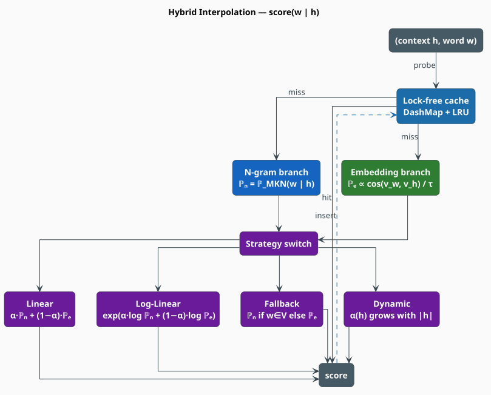

# Hybrid Language Model

The **hybrid model** is a *product of two experts*: a Modified Kneser-Ney n-gram model that knows
exactly what it has seen, and a subword embedding model that can guess about what it has not. Neither
is sufficient alone — the n-gram collapses on unseen words, the embedding is blind to word order —
but their errors are largely **independent**, so a weighted combination is more robust than either.
This document is the architecture: the struct, the scoring path, the cache, persistence, and the
concurrency story. The *mathematics* of the four fusion rules is the subject of its sibling,
[Interpolation](interpolation.md).

> **Scope.** Source of truth: [`src/hybrid/mod.rs`](../../../src/hybrid/mod.rs) and
> [`src/hybrid/model.rs`](../../../src/hybrid/model.rs). Fusion strategies:
> [Interpolation](interpolation.md). Unknown words: [OOV Handling](oov-handling.md). The two experts:
> [Modified Kneser-Ney](../ngram/modified-kneser-ney.md) and
> [Subword Embeddings](../embedding/overview.md).

## Notation

Every symbol is defined before it is used in a formula.

| Symbol | Meaning |
|---|---|
| $`w`$ | the candidate word being scored |
| $`h`$ | the context (history) preceding $`w`$; $`\lvert h \rvert`$ its length in words |
| $`\mathbb{P}_n(w \mid h)`$ | the **n-gram** expert's probability, $`\mathbb{P}_{\mathrm{MKN}}`$ |
| $`\mathbb{P}_e(w \mid h)`$ | the **embedding** expert's (unnormalized) probability |
| $`\alpha`$ | the n-gram mixing weight, $`\alpha \in [0,1]`$ |
| $`\tau`$ | the temperature (`HybridConfig::temperature`) |
| $`\varepsilon`$ | the embedding probability floor (`HybridConfig::embedding_smoothing`) |
| $`V`$ | the n-gram vocabulary; $`V_e`$ the embedding vocabulary |
| $`m`$ | the number of tokens in a sentence |
| $`n`$ | the n-gram model's order |
| $`\mathrm{PP}`$ | perplexity |

**Acronyms.** *MKN* — Modified Kneser-Ney; *OOV* — Out-Of-Vocabulary; *LRU* — Least Recently Used.

## Why two experts

The two components fail in **complementary** ways, which is the entire justification for the design:

| Model | Strong when | Weak when | Failure mode |
|---|---|---|---|
| N-gram (MKN) | the exact local context was seen in training | the word or context is unseen | falls back to the uniform $`1/\lvert V \rvert`$ floor — correct, but uninformative |
| Subword embedding | the word is semantically near known words | precise word order matters | *the cat sat* and *sat cat the* have the same bag of subwords |

An n-gram model cannot tell you that *fastly* resembles *quickly*; an embedding model cannot tell
you that *of the* is a thousand times more likely than *the of*. Fusing them recovers both signals.
Because the errors are near-independent, the combination is a genuine ensemble rather than a
compromise.



## Architecture

```rust
pub struct HybridLanguageModel<D>
where
    D: MappedDictionary<Value = NgramEntry> + Send + Sync,
{
    ngram: NgramModel<D>,       // the statistical expert
    embedding: SubwordEmbedding, // the semantic expert
    config: HybridConfig,        // strategy + cache size + tau + epsilon
    #[serde(skip, default = "default_cache")]
    cache: ScoreCache,           // memoized scores; NOT serialized
}
```

The model **owns** both experts. It is generic over the n-gram's dictionary backend `D` (see
[Trie Storage](../ngram/trie-storage.md)) but not over the embedding, which is always a
[`SubwordEmbedding`](../embedding/overview.md).

### Construction

Both experts must be trained **before** the hybrid is assembled — the hybrid has no trainer of its
own, it is purely a scoring composition.

| Constructor | Arity | Config |
|---|---|---|
| `HybridLanguageModel::new(ngram, embedding, config)` | **3** | explicit `HybridConfig` |
| `HybridLanguageModel::with_defaults(ngram, embedding)` | **2** | `HybridConfig::default()` |

```rust
use libgrammstein::hybrid::{HybridConfig, HybridLanguageModel, InterpolationStrategy};

// Explicit configuration…
let config = HybridConfig {
    strategy: InterpolationStrategy::LogLinear { alpha: 0.7 },
    ..Default::default()
};
let hybrid = HybridLanguageModel::new(ngram, embedding, config);

// …or the shipped defaults (Linear { alpha: 0.8 }, 50k-entry cache).
// let hybrid = HybridLanguageModel::with_defaults(ngram, embedding);
```

### Configuration

```rust
pub struct HybridConfig {
    pub strategy: InterpolationStrategy, // default: Linear { alpha: 0.8 }
    pub cache_size: usize,               // default: 50_000
    pub embedding_smoothing: f64,        // default: 1e-8  — the epsilon floor
    pub temperature: f64,                // default: 1.0   — the tau scaling
}
```

## The scoring path

`score(word, context)` returns a **log**-probability and is the primitive every other method is
built on. It performs four steps: probe the cache; evaluate both experts; fuse them according to the
configured strategy; memoize.

```math
\begin{array}{lr}
\displaystyle \texttt{score}(w, h) \;=\;
\begin{cases}
\alpha\,\mathbb{P}_n + (1-\alpha)\,\mathbb{P}_e & \text{Linear} \\[2pt]
\alpha \log \mathbb{P}_n + (1-\alpha) \log \mathbb{P}_e & \text{LogLinear} \\[2pt]
\log \mathbb{P}_n \ \text{ if } c(w) > 0, \ \text{else } \log \mathbb{P}_e & \text{NgramWithEmbeddingFallback} \\[2pt]
\alpha(h)\,\mathbb{P}_n + (1-\alpha(h))\,\mathbb{P}_e & \text{Dynamic}
\end{cases} & \text{(HM1)}
\end{array}
```

taking the logarithm of the Linear and Dynamic branches. The four strategies, their trade-offs, and
the derivation of $`\mathbb{P}_e`$ from cosine similarity are given in
[Interpolation](interpolation.md); the `InterpolationStrategy` variants are `Linear { alpha }`,
`LogLinear { alpha }`, `NgramWithEmbeddingFallback`, and
`Dynamic { base_alpha, alpha_per_context, max_alpha }`.

**The clamp.** Before fusion, both experts' log-probabilities are floored at $`-50`$:

```math
\begin{array}{lr}
\displaystyle \widetilde{\log \mathbb{P}} = \max\bigl(\log \mathbb{P},\ -50\bigr) & \text{(HM2)}
\end{array}
```

so that one expert returning a catastrophically small value cannot annihilate the score. (The n-gram
expert already guarantees finiteness on its own — see
[the finiteness guarantee](../ngram/query-api.md#the-finiteness-guarantee) — so $`(\mathrm{HM2})`$
is belt-and-braces, and it matters most for the embedding branch.) The Linear branch additionally
floors the *fused* probability at `f64::MIN_POSITIVE` before taking its logarithm, so the result is
finite by construction.

### Derived scorers

| Method | Returns | Definition |
|---|---|---|
| `score(w, h)` | `f64` | $`(\mathrm{HM1})`$ — the primitive |
| `sentence_log_prob(words)` | `f64` | $`(\mathrm{HM3})`$ below |
| `perplexity(words)` | `f64` | $`(\mathrm{HM4})`$ below |
| `predict_next(context, candidates)` | `Option<(String, f64)>` | $`\arg\max`$ over the candidate slice |

`sentence_log_prob` slides an $`(n-1)`$-word window (the n-gram expert's order governs the context
width, even under a strategy that leans on the embedding) and sums:

```math
\begin{array}{lr}
\displaystyle \log \mathbb{P}(w_1 \dots w_m) = \sum_{i=1}^{m} \texttt{score}\bigl(w_i,\ w_{\max(1,\,i-n+1)} \dots w_{i-1}\bigr) & \text{(HM3)}
\end{array}
```

```math
\begin{array}{lr}
\displaystyle \mathrm{PP}(w_1 \dots w_m) = \exp\!\left(-\frac{1}{m}\log \mathbb{P}(w_1 \dots w_m)\right) & \text{(HM4)}
\end{array}
```

An empty word slice yields $`0.0`$ from `sentence_log_prob` (the log of the empty product) and
`f64::INFINITY` from `perplexity` — there is no branching factor to report.

`predict_next` is a **linear scan** over the candidates you supply, not a search over the
vocabulary: it scores each candidate and returns the best. It is a ranking helper, not a decoder.
For actual generation see [Text Generation](../generation/text-generation.md).

## Engineering

### The lock-free score cache

Scoring the same $`(w, h)`$ pair twice is common — beam search and lattice rescoring do it
constantly — and each miss costs an MKN recursion *plus* an embedding composition. `ScoreCache` is
built so that the hot path never blocks:

```rust
struct ScoreCache {
    entries: DashMap<u64, f64>,        // lock-free concurrent get/insert
    access_order: Mutex<VecDeque<u64>>, // the ONLY lock — insertion order, for LRU eviction
    max_entries: usize,                 // config.cache_size, default 50_000
    num_entries: AtomicUsize,           // fast size check
}
```

- The key is a `DefaultHasher` digest of $`(w, h)`$ — the word, the context **length**, and each
  context word are all folded in, so $`(\texttt{fox}, [\texttt{the}, \texttt{quick}])`$ and
  $`(\texttt{fox}, [\texttt{quick}, \texttt{the}])`$ hash differently.
- A **get** is a lock-free `DashMap` probe.
- An **insert** is lock-free too, except that it pushes the key onto the LRU deque — the one place a
  `Mutex` is taken, and only briefly.
- Eviction happens **only** when the entry count exceeds `max_entries`, popping the oldest key.

The consequence: many threads may call `score` concurrently on one model with essentially no
contention. `HybridLanguageModel<D>` is `Send + Sync` whenever `D` is, and both experts are immutable
after training, so nothing else needs synchronizing. `clear_cache()` empties it.

> **The cache is not serialized.** It is marked `#[serde(skip)]` and reconstructed *empty* on load
> (`default_cache`). A restored model therefore answers identically but re-warms from cold — scores
> are a pure function of the two experts, so a stale cache could never be a correctness problem, only
> a missed optimization.

### Persistence

All persistence is gated on the `serde-extras` feature. Two formats, chosen by whether the n-gram
backend is itself serde-serializable:

| Method | Requires | Notes |
|---|---|---|
| `save` / `load` | `D: Serialize + DeserializeOwned` | whole model, backend included (bincode) |
| `save_portable` / `load_portable` | `D: IterableDictionary` | backend-agnostic; `load_portable` takes a **dictionary factory** |

[`PortableHybridModel`](../../../src/hybrid/model.rs) bundles a
[`PortableNgramModel`](../../../src/ngram/model.rs), the (already-serializable) `SubwordEmbedding`,
and the `HybridConfig`. Loading it rebuilds the n-gram trie through the supplied closure, which is
how one file can be materialized into whichever backend the consumer wants:

```rust
use libgrammstein::hybrid::HybridLanguageModel;
use libgrammstein::ngram::NgramEntry;
use libdictenstein::dynamic_dawg::char::DynamicDawgChar;

hybrid.save_portable("hybrid.bin")?;

let restored: HybridLanguageModel<DynamicDawgChar<NgramEntry>> =
    HybridLanguageModel::load_portable("hybrid.bin", DynamicDawgChar::new)?;
# Ok::<(), libgrammstein::Error>(())
```

Two aliases name the common backend choices:
[`SerializableHybridModel`](../../../src/hybrid/mod.rs) (`DynamicDawgChar` — supports `save`/`load`)
and [`PathMapHybridModel`](../../../src/hybrid/mod.rs) (`PathMapDictionary` — for the lling-llang
shared lattice; portable format only).

### Complexity

Let $`n`$ be the n-gram order, $`\ell`$ the encoded key length, $`d`$ the embedding dimension, and
$`s`$ the number of subwords in a word.

| Operation | Cost | Dominated by |
|---|---|---|
| `score` (cache hit) | $`O(1)`$ | one `DashMap` probe |
| `score` (miss) | $`O(n\,\ell \;+\; \lvert h \rvert\,s\,d)`$ | MKN backoff **+** the context vector |
| `sentence_log_prob` | $`m \times`$ `score` | one `score` per token |
| `predict_next` | $`k \times`$ `score` | linear in the $`k`$ candidates given |

The embedding term usually dominates a miss: composing the context vector means building a word
vector for each of the $`\lvert h \rvert`$ context words, and each of those sums $`s`$ bucket rows of
width $`d`$. This is exactly why the cache exists.

## Usage

```rust
use libgrammstein::hybrid::{HybridConfig, HybridLanguageModel, InterpolationStrategy};

// `ngram` and `embedding` were trained beforehand — see the ngram and embedding docs.
let hybrid = HybridLanguageModel::new(
    ngram,
    embedding,
    HybridConfig {
        strategy: InterpolationStrategy::Dynamic {
            base_alpha: 0.7,        // trust the n-gram a little, with no context…
            alpha_per_context: 0.05, // …and more with every context word available…
            max_alpha: 0.95,         // …up to this ceiling.
        },
        ..Default::default()
    },
);

// A single word in context (log-probability, always finite).
let log_p = hybrid.score("fox", &["the", "quick", "brown"]);

// A whole sentence, and its perplexity.
let log_p_sent = hybrid.sentence_log_prob(&["the", "quick", "brown", "fox"]);
let ppl = hybrid.perplexity(&["the", "quick", "brown", "fox"]);

// Rank a candidate set (e.g. a corrector's proposals).
let best = hybrid.predict_next(&["the", "quick", "brown"], &["fox", "dog", "cat"]);

// Introspection.
println!("order={} strategy={:?}", hybrid.ngram_model().order(), hybrid.config().strategy);
println!("log P={log_p:.3} sentence={log_p_sent:.3} ppl={ppl:.2} best={best:?}");
```

## Choosing a strategy

| Scenario | Strategy | Weight |
|---|---|---|
| General purpose, both experts reliable | `Linear` | $`\alpha \approx 0.8`$ |
| Experts on different score scales | `LogLinear` | $`\alpha \approx 0.6`$–$`0.8`$ |
| Large, high-quality n-gram corpus | `NgramWithEmbeddingFallback` | — |
| High OOV rate, mixed vocabulary | `Dynamic` | $`\alpha_0 = 0.7`$, $`\alpha_{\max} = 0.95`$ |

See [Interpolation](interpolation.md) for the derivations and
[Hybrid Training](../../training/hybrid.md) for grid-searching $`\alpha`$ against development-set
perplexity.

## References

1. F. Jelinek & R. L. Mercer (1980). *Interpolated estimation of Markov source parameters from
   sparse data.* In *Pattern Recognition in Practice*, 381–397. North-Holland.
2. G. E. Hinton (2002). *Training products of experts by minimizing contrastive divergence.* Neural
   Computation 14(8), 1771–1800.
   [doi:10.1162/089976602760128018](https://doi.org/10.1162/089976602760128018)
3. P. Bojanowski, E. Grave, A. Joulin & T. Mikolov (2017). *Enriching word vectors with subword
   information* (FastText). TACL 5, 135–146.
   [doi:10.1162/tacl_a_00051](https://doi.org/10.1162/tacl_a_00051)
4. S. F. Chen & J. Goodman (1999). *An empirical study of smoothing techniques for language
   modeling.* Computer Speech & Language 13(4), 359–393.
   [doi:10.1006/csla.1999.0128](https://doi.org/10.1006/csla.1999.0128)

## See also

- [Interpolation](interpolation.md) — the four fusion strategies, in full
- [OOV Handling](oov-handling.md) — what happens when the word was never seen
- [Modified Kneser-Ney](../ngram/modified-kneser-ney.md) — the n-gram expert
- [Subword Embeddings](../embedding/overview.md) — the semantic expert
- [Hybrid Training](../../training/hybrid.md) — tuning $`\alpha`$ and the temperature
- [Hybrid API reference](../../api/hybrid.md) — the complete method surface
