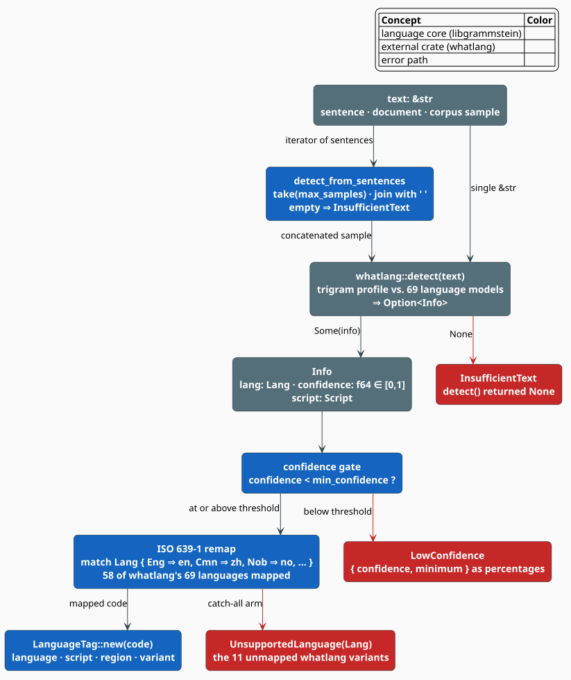
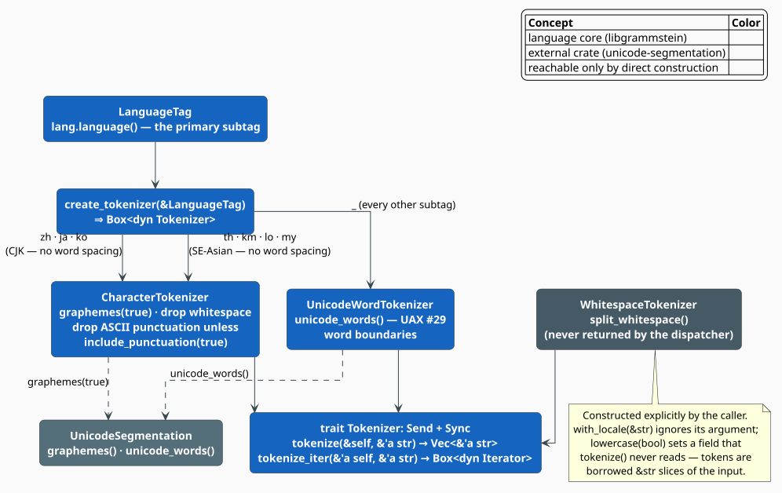
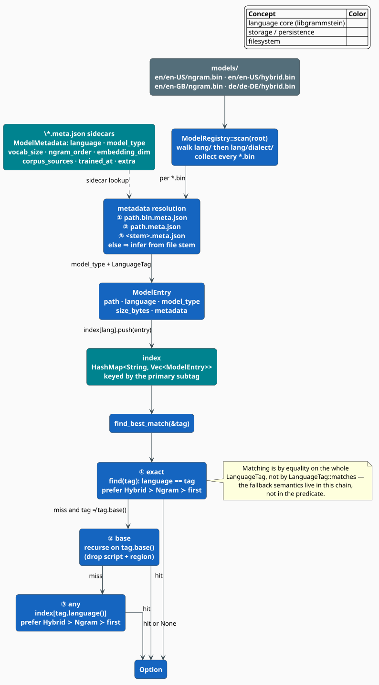

# Language: Detection, Tags, Tokenization, and the Model Registry

The **language** module is libgrammstein's answer to a question every multilingual corpus
raises before a single n-gram is counted: *which language is this text, and how do I cut it
into tokens?* It bundles four small, orthogonal pieces — a **detector** (`whatlang`-backed), a
**BCP 47 tag** type, a **language-aware tokenizer** family, and a **model registry** that
locates trained models on disk by language. This document explains each piece, the theory
behind the detector and the tokenizer dispatch, and the exact feature gate that decides whether
the module exists at all.

> **Scope.** Source of truth: [`src/language/mod.rs`](../../../src/language/mod.rs),
> [`detection.rs`](../../../src/language/detection.rs),
> [`tag.rs`](../../../src/language/tag.rs),
> [`tokenizer.rs`](../../../src/language/tokenizer.rs), and
> [`registry.rs`](../../../src/language/registry.rs). For the corpus readers that consume these
> tokenizers see [Corpus Overview](../corpus/overview.md); for the CLI that drives the registry
> see the [CLI README](../../cli/README.md).

## Feature gate: the module lives behind `cli`, not behind `language-full`

This is the module's most surprising property, and getting it wrong costs an afternoon, so it
is stated first and precisely. In [`src/lib.rs`](../../../src/lib.rs):

```rust
#[cfg(feature = "cli")]
pub mod language;
```

The module is gated on **`cli`** — it has no feature of its own. The separate `language-full`
feature in `Cargo.toml` is a **dependency-only** alias:

```toml
language-full = ["dep:whatlang", "dep:unic-langid"]
```

It enables the two optional crates the module needs, but it does **not** enable
`pub mod language`. Consequently:

| You build with | `whatlang` + `unic-langid` compiled? | `libgrammstein::language` reachable? |
|---|---|---|
| `--features cli` | yes (`cli` enables both) | **yes** |
| `--features language-full` | yes | **no** — the `cfg` on the module is unsatisfied |
| `--features cli,language-full` | yes | **yes** |
| default | no | no |

`language-full` also gates **no code inside the module**: there is not one
`#[cfg(feature = "language-full")]` in `src/`. The CJK and Southeast-Asian tokenizer arms
described [below](#dispatch-create_tokenizer) are unconditional once `cli` is on. So
`language-full` today buys you the dependencies and nothing else; it is only useful to a
downstream crate that wants `whatlang`/`unic-langid` in the dependency graph without dragging
in the whole CLI stack (`clap`, `indicatif`, `rustyline`, `zstd`, …).

> **Honest note.** The repository's feature table describes `language-full` as "the full
> `whatlang` language set". That is the *intent*; the *implementation* is the dependency alias
> above. Enabling it does not widen the set of languages the detector recognises, because the
> language set is fixed by the `match` in `detect_language` (58 arms — see
> [below](#the-iso-639-1-remap-and-its-11-blind-spots)), not by a `cfg`.

## Notation

Every symbol is defined before use.

| Symbol | Meaning |
|---|---|
| $`t`$ | the input text passed to the detector |
| $`\ell`$ | a language, i.e. a variant of `whatlang`'s `Lang` enum |
| $`c(t)`$ | `whatlang`'s **confidence** that $`t`$ is in the language it reports, $`c(t) \in [0,1]`$ |
| $`\theta`$ | the caller's `min_confidence` threshold, $`\theta \in [0,1]`$ |
| $`\mathcal{L}_{\mathrm{wl}}`$ | the set of languages `whatlang` can report, $`\lvert \mathcal{L}_{\mathrm{wl}} \rvert = 69`$ |
| $`\mathcal{L}_{\mathrm{lg}}`$ | the subset libgrammstein maps to ISO 639-1, $`\lvert \mathcal{L}_{\mathrm{lg}} \rvert = 58`$ |
| $`g`$ | a **grapheme cluster** (a user-perceived character, per UAX #29) |

**Acronyms.** *BCP 47* — IETF Best Current Practice 47, the language-tag standard;
*ISO 639-1* — the two-letter language-code standard; *ISO 15924* — the four-letter script-code
standard; *ISO 3166-1 alpha-2* — the two-letter region-code standard; *UAX #29* — Unicode
Standard Annex 29, "Unicode Text Segmentation"; *CJK* — Chinese/Japanese/Korean.

## Detection

### Why trigrams, and why a confidence gate

Language identification from raw text is a classification problem over character
$`n`$-gram profiles. `whatlang` [[1]](#references) implements the classic Cavnar–Trenkle
approach [[2]](#references): it holds a **trigram profile** per language and scores the input
against each, combining that with a cheap script-detection prefilter (a text in Hangul cannot
be Portuguese). It returns an `Info` carrying the winning `Lang`, the detected `Script`, and a
**confidence** $`c(t)`$.

Confidence matters because the score gap between the top two candidates collapses on short
input: "hi" is a valid word in English, Hindi transliteration, and several other languages.
libgrammstein therefore never trusts a bare detection — it demands
$`c(t) \geq \theta`$ and otherwise fails loudly:

```math
\begin{array}{lr}
\displaystyle \mathrm{detect}(t, \theta) =
\begin{cases}
\texttt{Err(InsufficientText)} & \text{if } \texttt{whatlang::detect}(t) = \texttt{None} \\
\texttt{Err(LowConfidence)}    & \text{if } c(t) < \theta \\
\texttt{Err(UnsupportedLanguage)} & \text{if } \ell \notin \mathcal{L}_{\mathrm{lg}} \\
\texttt{Ok(LanguageTag)}       & \text{otherwise}
\end{cases} & \text{(L1)}
\end{array}
```



*Figure 1 — `detect_language`: the confidence gate and the ISO 639-1 remap, with each of the
three `LanguageDetectionError` variants on its own edge.*

### The API

```rust
pub fn detect_language(
    text: &str,
    min_confidence: f64,
) -> Result<LanguageTag, LanguageDetectionError>;

pub fn detect_from_sentences<'a, I>(
    sentences: I,
    max_samples: usize,
    min_confidence: f64,
) -> Result<LanguageTag, LanguageDetectionError>
where
    I: Iterator<Item = &'a str>;
```

`detect_from_sentences` is the corpus-facing entry point: it takes the first `max_samples`
sentences, joins them with a single space, and delegates to `detect_language`. More text means
a sharper trigram profile and a higher $`c(t)`$ — the reason the function exists at all. An
empty join short-circuits to `InsufficientText`.

The error type carries the numbers a caller needs to act:

```rust
#[derive(Error, Debug)]
pub enum LanguageDetectionError {
    #[error("Insufficient text for language detection")]
    InsufficientText,

    #[error("Unsupported language detected: {0:?}")]
    UnsupportedLanguage(Lang),

    #[error("Low confidence detection: {confidence:.2}% (minimum: {minimum:.2}%)")]
    LowConfidence { confidence: f64, minimum: f64 },
}
```

Note the unit change: `LowConfidence` stores **percentages** (the constructor multiplies both
$`c(t)`$ and $`\theta`$ by $`100`$), while the `min_confidence` *argument* is a fraction in
$`[0,1]`$. Passing `0.8` means "80 %", and a rejection at $`c(t) = 0.42`$ reports
`42.00% (minimum: 80.00%)`.

### The ISO 639-1 remap, and its 11 blind spots

`whatlang` speaks ISO 639-3 (`Lang::Eng`, `Lang::Cmn`); libgrammstein's model directories and
`LanguageTag`s speak ISO 639-1 (`en`, `zh`). `detect_language` bridges them with an explicit
`match`. The table is exhaustive by construction — a catch-all arm turns anything unmapped into
`UnsupportedLanguage(other)`:

```rust
let language_code = match info.lang() {
    Lang::Eng => "en",
    Lang::Cmn => "zh",   // Mandarin
    Lang::Nob => "no",   // Norwegian Bokmål
    // …55 further arms…
    other => return Err(LanguageDetectionError::UnsupportedLanguage(other)),
};
```

The counts are exact and worth internalising: `whatlang` 0.16 exposes
$`\lvert \mathcal{L}_{\mathrm{wl}} \rvert = 69`$ languages; the `match` maps
$`\lvert \mathcal{L}_{\mathrm{lg}} \rvert = 58`$ of them. So

```math
\begin{array}{lr}
\displaystyle \lvert \mathcal{L}_{\mathrm{wl}} \setminus \mathcal{L}_{\mathrm{lg}} \rvert = 69 - 58 = 11 & \text{(L2)}
\end{array}
```

languages are detected perfectly well by `whatlang` and then **rejected** by libgrammstein.
A text in one of those 11 does not fall back to a neighbour or to `und` — it returns
`Err(UnsupportedLanguage)`, and the caller must decide. The mapped set covers the 32 major
European languages, 10 East/Southeast Asian, 11 South Asian, Arabic and Hebrew, Azerbaijani
and Uzbek, and Amharic.

Two mappings deserve a footnote because they are lossy on purpose:

- `Lang::Cmn` (Mandarin) becomes `zh`, discarding the Simplified/Traditional distinction. The
  `Script` that `whatlang` also returns *could* recover it (`Hans` vs `Hant`) but is not
  consulted; a caller who needs it should build the tag with
  `LanguageTag::with_script("zh", "Hans")`.
- `Lang::Nob` (Bokmål) becomes `no`, the macrolanguage, rather than `nb`. Nynorsk is not in the
  mapped set.

## Language tags

`LanguageTag` is the module's lingua franca: a BCP 47 [[3]](#references) identifier with four
optional layers.

```rust
pub struct LanguageTag {
    language: String,          // ISO 639-1 / 639-3, lowercased
    script:   Option<String>,  // ISO 15924, Title-cased
    region:   Option<String>,  // ISO 3166-1 alpha-2, UPPERCASED
    variant:  Option<String>,  // never populated by parse() — see below
}
```

Construction normalises case, so `LanguageTag::with_region("EN", "us")` and
`"en-US".parse()` agree:

| Constructor | Result of `to_string()` |
|---|---|
| `LanguageTag::new("EN")` | `en` |
| `LanguageTag::with_region("en", "us")` | `en-US` |
| `LanguageTag::with_script("zh", "HANS")` | `zh-Hans` |
| `"zh-Hans".parse::<LanguageTag>()?` | `zh-Hans` |

Parsing delegates to `unic-langid`, so the full BCP 47 grammar is honoured on input. One
caveat is visible in the struct: `parse` always sets `variant: None`, because the simple
`unic-langid` API used here does not surface variant subtags. `LanguageTag::variant()` therefore
returns `None` for a parsed tag even when the input string carried a variant; only `Display`
would echo one, and only if a caller had populated the field directly (no public constructor
does). Treat `variant` as reserved.

### Matching and paths

Two methods give the type its utility:

- **`matches(&self, other) -> bool`** — fallback-aware comparison. `self` matches `other` when
  they are equal, or when they share a primary language and `other` leaves script and region
  unspecified. So `en-US` matches `en`, but `en-US` does not match `en-GB`. Formally, with
  $`\pi`$ for the primary subtag and $`\sigma, \rho`$ for script and region:

```math
\begin{array}{lr}
\displaystyle \mathrm{matches}(a, b) \iff
\pi_a = \pi_b \;\wedge\;
\bigl(\sigma_b = \bot \vee \sigma_a = \sigma_b\bigr) \;\wedge\;
\bigl(\rho_b = \bot \vee \rho_a = \rho_b\bigr) & \text{(L3)}
\end{array}
```

- **`to_path(&self) -> String`** — the on-disk layout rule. A bare tag maps to one directory
  level, a qualified tag to two: `en` becomes `en`, and `en-US` becomes `en/en-US`. This is
  exactly the tree `ModelRegistry::scan` walks.

A companion constant and helper cover corpus acquisition:
`WIKIPEDIA_URLS` is a 15-entry table of well-known Wikipedia dump URLs, and
`wikipedia_dump_url(lang)` returns the table entry when present, otherwise **synthesising**
`https://dumps.wikimedia.org/{lang}wiki/latest/{lang}wiki-latest-pages-articles.xml.bz2`. The
synthesised URL is not validated — an unknown code yields a plausible-looking URL that 404s at
download time.

## Tokenization

### The trait

```rust
pub trait Tokenizer: Send + Sync {
    fn tokenize<'a>(&self, text: &'a str) -> Vec<&'a str>;
    fn tokenize_iter<'a>(&'a self, text: &'a str) -> Box<dyn Iterator<Item = &'a str> + 'a>;
}
```

Both methods return **borrowed** `&'a str` slices of the input — no allocation per token, and
the lifetime ties tokens to the source buffer. `Send + Sync` lets one boxed tokenizer be shared
across the rayon workers that drive corpus ingestion. The consequence of borrowing is a
limitation, discussed under `WhitespaceTokenizer` below: a tokenizer physically *cannot*
case-fold, because a lowercased token is a new `String`, not a slice of the input.

### The three implementations

| Type | Segmentation | Intended for | Re-exported? |
|---|---|---|---|
| `WhitespaceTokenizer` | `str::split_whitespace` | Western text, fastest path | yes |
| `UnicodeWordTokenizer` | `unicode_words()` (UAX #29) | default for word-delimited scripts | **no** |
| `CharacterTokenizer` | `graphemes(true)`, filtered | CJK and Southeast Asian scripts | yes |

`UnicodeWordTokenizer` is `pub` inside a **private** module and is absent from the `pub use` in
`mod.rs`, so it cannot be named from outside the crate:

```rust
pub use tokenizer::{create_tokenizer, CharacterTokenizer, Tokenizer, WhitespaceTokenizer};
```

You still *get* one — `create_tokenizer` returns it boxed as `dyn Tokenizer` for every
non-CJK language — you simply cannot write its type. That is fine for the intended
`Box<dyn Tokenizer>` usage and worth knowing before you try `let t: UnicodeWordTokenizer = …`.

**Why UAX #29 rather than splitting on spaces.** `unicode_words()` implements the Unicode word
-boundary algorithm [[4]](#references), which strips punctuation and handles apostrophes,
hyphens, and non-breaking spaces the way a linguist would. `"Hello, world! How are you?"`
yields five tokens (`Hello`, `world`, `How`, `are`, `you`) rather than the five
*punctuation-contaminated* ones (`Hello,`, `world!`, …) that `split_whitespace` produces. For
n-gram counting, that difference is the difference between `world` and `world!` being distinct
vocabulary entries.

**Why graphemes for CJK.** Chinese, Japanese, Korean, Thai, Khmer, Lao, and Burmese do not
delimit words with spaces. Word segmentation for them is a *learned* task (dictionary or CRF
based); libgrammstein does not attempt it. Instead `CharacterTokenizer` falls back to the
sound and cheap approximation: **one token per grapheme cluster**, filtering whitespace and
(by default) ASCII punctuation. Character n-grams over CJK are a well-established baseline —
a character bigram model over Chinese is roughly as informative as a word unigram model,
because the mean word length is close to $`2`$ characters.

The filter is exactly:

```math
\begin{array}{lr}
\displaystyle \mathrm{keep}(g) \iff \neg\,\mathrm{is\_whitespace}(g_0) \;\wedge\;
\bigl(\texttt{include\_punctuation} \vee \neg\,\mathrm{is\_ascii\_punctuation}(g_0)\bigr) & \text{(L4)}
\end{array}
```

where $`g_0`$ is the first `char` of the grapheme cluster $`g`$. Note it is
`is_ascii_punctuation`: CJK punctuation (`、`, `。`, `！`) is **not** ASCII and therefore
survives the default filter. If you want it gone, you must strip it upstream.

### Dispatch: `create_tokenizer`

```rust
pub fn create_tokenizer(lang: &LanguageTag) -> Box<dyn Tokenizer> {
    match lang.language() {
        "zh" | "ja" | "ko"        => Box::new(CharacterTokenizer::new()),
        "th" | "km" | "lo" | "my" => Box::new(CharacterTokenizer::new()),
        _                         => Box::new(UnicodeWordTokenizer::new()),
    }
}
```



*Figure 2 — the dispatcher keys on the primary subtag only; script and region are ignored.*

Three facts follow from reading it literally, and all three are load-bearing:

1. **Dispatch ignores script and region.** `zh-Hans`, `zh-Hant`, and `zh-TW` all take the CJK
   arm because only `lang.language()` is consulted.
2. **`WhitespaceTokenizer` is never selected.** It exists for callers who want the fastest
   possible split and accept punctuation-contaminated tokens; the dispatcher always prefers
   UAX #29.
3. **`lo` is in the dispatch table but not in the detector's map.** `detect_language` has no
   `Lang::Lao` arm, so a Lao `LanguageTag` can only arrive from a hand-written tag or a parsed
   string — never from detection.

### The `lowercase` flag does nothing

`WhitespaceTokenizer` exposes a builder:

```rust
pub fn lowercase(mut self, lowercase: bool) -> Self { self.lowercase = lowercase; self }
```

The field is stored and **never read**. `tokenize` is `text.split_whitespace().collect()`, with
no branch on `self.lowercase`. This is not an oversight so much as a type-level impossibility:
the trait returns `Vec<&'a str>` borrowed from the input, and a case-folded token is by
definition a fresh allocation. Case-fold **before** tokenizing (`text.to_lowercase()`, then
tokenize the owned `String`) or after (map to `String`). Likewise `with_locale(&str)` discards
its argument — its doc-comment says as much ("currently unused but reserved for future").

## The model registry

Trained models live in a two-level tree keyed by [`LanguageTag::to_path`](#matching-and-paths):

```text
models/
    en/
        en-US/
            ngram.bin
            ngram.bin.meta.json
            hybrid.bin
        en-GB/
            ngram.bin
    de/
        de-DE/
            hybrid.bin
```

`ModelRegistry::scan(root)` walks it and builds a `HashMap<String, Vec<ModelEntry>>` keyed by
the **primary subtag**. A missing `root` is not an error — it yields an empty registry, so a
first run on a fresh machine behaves sanely.



*Figure 3 — indexing on the left, resolution on the right.*

For each `*.bin` the scanner resolves metadata by trying three sidecar paths in order —
`model.bin.meta.json`, then `model.meta.json`, then `<stem>.meta.json` — and, failing all
three, **infers** the model type from the file stem (`hybrid` ⇒ `Hybrid`, `embedding`/`embed`
⇒ `Embedding`, anything else ⇒ `Ngram`). Metadata, when present, wins over the inference and
also supplies the authoritative `LanguageTag`.

```rust
pub struct ModelEntry {
    pub path: PathBuf,
    pub language: LanguageTag,
    pub model_type: ModelType,          // Ngram | Embedding | Hybrid
    pub size_bytes: u64,
    pub metadata: Option<ModelMetadata>,
}
```

> **API note.** `mod.rs` re-exports only `ModelEntry` and `ModelRegistry`. `ModelType` and
> `ModelMetadata` are `pub` in the private `registry` module, so you can *read*
> `entry.model_type` and `entry.metadata` but cannot name their types in a signature. If you
> need to, match on the value or add the re-export.

### Resolution: `find_best_match`

The lookup is a three-step chain, and each step prefers **Hybrid ≻ Ngram ≻ whatever is left**:

1. **Exact.** `find(tag)` keeps entries whose `language` is *equal* to `tag`.
2. **Base.** If that missed and `tag` is qualified, recurse on `tag.base()` — the tag with
   script and region stripped.
3. **Any.** Otherwise take any entry filed under the primary subtag.

Step 3 is what makes `en-AU` resolve to an `en-GB` model rather than to nothing. Note that the
chain, not `LanguageTag::matches`, implements the fallback: `find` compares with `==`. The
`matches` predicate of $`(\mathrm{L3})`$ is available to callers but is not used by the
registry.

`ModelMetadata` itself is a plain serde record — `language`, `model_type`, `corpus_sources`,
`trained_at` (`chrono::DateTime<Utc>`), `vocab_size`, `ngram_order`, `embedding_dim`, and a
free-form `extra: HashMap<String, String>` — with `save`/`load` writing and reading
`{model_path}.meta.json`.

## Usage

```rust
use libgrammstein::language::{
    create_tokenizer, detect_language, LanguageTag, ModelRegistry,
};

// 1. Identify the language, demanding 80 % confidence.
let text = "El rápido zorro marrón salta sobre el perro perezoso.";
let tag: LanguageTag = detect_language(text, 0.8)?;
assert_eq!(tag.language(), "es");

// 2. Tokenize with the right segmenter for that language.
let tokenizer = create_tokenizer(&tag);
let tokens = tokenizer.tokenize(text);
assert_eq!(tokens[0], "El");          // UAX #29: punctuation dropped

// 3. Find the best model we have on disk for it.
let registry = ModelRegistry::scan(std::path::Path::new("models"))?;
if let Some(entry) = registry.find_best_match(&tag) {
    println!("{} model at {}", entry.model_type, entry.path.display());
}
# Ok::<(), Box<dyn std::error::Error>>(())
```

Detecting from a corpus sample rather than one sentence, and handling the three failure modes
separately:

```rust
use libgrammstein::language::{detect_from_sentences, LanguageDetectionError};

let sentences = ["The quick brown fox.", "It jumped over the lazy dog."];
match detect_from_sentences(sentences.into_iter(), 32, 0.9) {
    Ok(tag) => println!("detected {tag}"),
    Err(LanguageDetectionError::LowConfidence { confidence, minimum }) => {
        eprintln!("ambiguous: {confidence:.2}% < {minimum:.2}% — sample more sentences");
    }
    Err(LanguageDetectionError::InsufficientText) => eprintln!("empty or too short"),
    Err(LanguageDetectionError::UnsupportedLanguage(lang)) => {
        eprintln!("{lang:?} is one of the 11 whatlang languages we do not map");
    }
}
```

## Choosing a confidence threshold

$`\theta`$ trades false accepts against false rejects, and the right value depends on how much
text you can afford to sample:

| Sample | Suggested $`\theta`$ | Rationale |
|---|---|---|
| A single short sentence | $`0.5`$–$`0.7`$ | trigram evidence is thin; a high bar rejects almost everything |
| A paragraph | $`0.8`$ | the value used throughout the module's own tests |
| A document or corpus sample | $`0.9`$+ | with $`10^3`$+ characters the top candidate should dominate |

When detection fails, prefer sampling **more sentences** (`detect_from_sentences` with a larger
`max_samples`) over lowering $`\theta`$: raising the evidence is strictly better than lowering
the standard of proof.

## References

1. S. Greyblake. *whatlang-rs: natural language detection for Rust.*
   [github.com/greyblake/whatlang-rs](https://github.com/greyblake/whatlang-rs). Version 0.16
   recognises 69 languages via trigram profiles and script detection.
2. W. B. Cavnar & J. M. Trenkle (1994). *N-gram-based text categorization.* In *Proceedings of
   SDAIR-94*, 161–175. The trigram-profile method underlying most classical language ID.
3. A. Phillips & M. Davis (2009). *Tags for Identifying Languages.* IETF BCP 47 / RFC 5646.
   [doi:10.17487/RFC5646](https://doi.org/10.17487/RFC5646)
4. M. Davis & C. Chapman (eds.). *Unicode Standard Annex #29: Unicode Text Segmentation.*
   [unicode.org/reports/tr29](https://www.unicode.org/reports/tr29/) — the word- and
   grapheme-boundary algorithms implemented by `unicode-segmentation`.

## See also

- [Corpus Overview](../corpus/overview.md) — the readers that feed text to these tokenizers
- [N-gram Overview](../ngram/overview.md) — what the tokens are counted into
- [Subword Embeddings](../embedding/overview.md) — the BPE path, an alternative to word tokens
- [CLI](../../cli/README.md) — the binary that owns the `cli` feature this module rides on
- [Google Books Import](../../cli/import-google-books.md) — a corpus source with its own,
  separate language list
