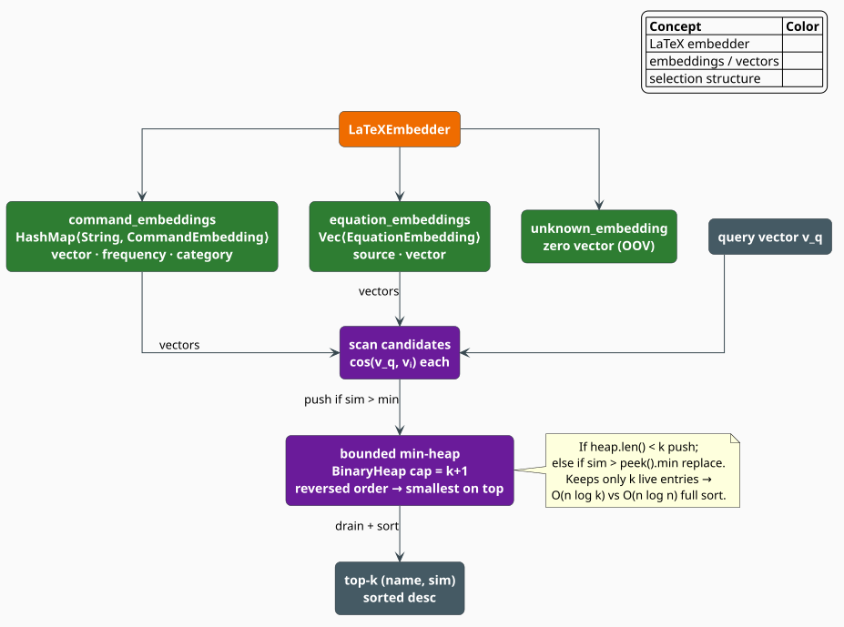

# LaTeX Embeddings

The **`LaTeXEmbedder`** stores dense vectors for two kinds of LaTeX object — individual
**commands** and whole **equations** — and answers nearest-neighbour queries over them by cosine
similarity. Commands additionally carry a **semantic category** (`GreekLetter`, `Operator`,
`Relation`, …), a small exact taxonomy that works even when no trained vector is available. Top-$`k`$
retrieval runs through a bounded min-heap, so a query costs $`O(n \log k)`$ rather than the
$`O(n \log n)`$ of sorting the whole vocabulary.

> **Scope.** Source of truth: [`src/latex/embedding.rs`](../../../src/latex/embedding.rs). The
> [neural rescorer](rescorer.md) consumes this embedder for its semantic-coherence component, and
> the [equation RAG index](rag.md) stores vectors of exactly the kind `EquationEmbedding` holds.
> For the distributional theory behind the vectors themselves see
> [Subword Embeddings](../embedding/overview.md) and [Skip-gram](../embedding/skip-gram.md); for
> the module map see the [overview](overview.md).

## Notation

| Symbol | Meaning |
|---|---|
| $`d`$ | the embedding dimension (`EmbeddingConfig::dimension`, default $`128`$) |
| $`v_x \in \mathbb{R}^d`$ | the vector of command or equation $`x`$ |
| $`V`$ | the **command vocabulary** — the set of command names with a stored vector |
| $`\lvert V \rvert`$ | its size, reported by `vocab_size()` |
| $`E`$ | the list of stored `EquationEmbedding` values |
| $`\mathbf{0}`$ | the **unknown vector** — the all-zero vector of length $`d`$ |
| $`\cos(a, b)`$ | cosine similarity between vectors $`a`$ and $`b`$ |
| $`k`$ | the number of neighbours requested from a top-$`k`$ query |
| $`\kappa(c)`$ | the semantic category of command $`c`$ (`CommandCategory::from_command`) |
| $`s`$ | a sequence of command names |

## Why embed LaTeX commands

A lexical automaton and a semantic space disagree about what "close" means, and a corrector needs
both:

| Notion of nearness | `\alpha` is close to | Good for |
|---|---|---|
| **Edit distance** (liblevenshtein) | `\aleph`, `\alph` | *proposing* candidates for a typo |
| **Semantic similarity** (this module) | `\beta`, `\gamma`, `\lambda` | *ranking* the proposals in context |

The lexical automaton proposes; the embedding disposes. `\sum` and `\prod` are structurally
interchangeable — both are large operators taking limits — and a vector space that saw them in the
same contexts will place them together, so a candidate that swaps one for the other is not
penalized as an alien token. Edit distance alone would call them unrelated.

The **categories** are the cheap, exact backstop for the same intuition. `CommandCategory` is a
total function over command names: it never needs training, never has an OOV problem (it answers
`Other`), and gives the [heuristic scorer](scorer.md) a usable notion of compatibility with no
vectors loaded at all.

## The vector types

### `CommandEmbedding`

```rust
pub struct CommandEmbedding {
    pub command: String,                    // the name WITHOUT the backslash: "frac", not "\frac"
    pub vector: Vec<f32>,
    pub frequency: u64,                     // occurrences in the training corpus
    pub category: Option<CommandCategory>,  // set by `with_category`, or on load
}
```

> **Key discipline.** The map is keyed by the **bare name** — `"frac"`, `"alpha"`, `"begin"` —
> which is exactly the payload of `LaTeXTokenKind::Command(String)`. This differs from the
> [n-gram models](ngram.md), whose vocabulary is keyed by the token's *spelling* (`\frac`, with
> the backslash). Look up `command_embedding("frac")`, never `command_embedding("\\frac")`.

`cosine_similarity(&self, other)` compares two command embeddings directly; `with_category` is the
builder-style setter.

### `EquationEmbedding`

```rust
pub struct EquationEmbedding {
    pub source: String,             // the (normalized) LaTeX source of the equation
    pub vector: Vec<f32>,
    pub source_id: Option<String>,  // provenance, e.g. an arXiv paper id
    pub label: Option<String>,      // the equation's \label, if it had one
}
```

Built with `EquationEmbedding::new(source, vector)` and refined with `with_source_id` /
`with_label`. These are the vectors that `most_similar_equations` searches, and they carry the same
payload an [`EquationDocument`](rag.md) carries into the retrieval index.

### `CommandCategory`: the exact taxonomy

`CommandCategory::from_command(name)` is a total, allocation-free classifier over the twelve
variants below; any name it does not recognize becomes `Other`.

| Variant | Recognized names include |
|---|---|
| `GreekLetter` | `alpha`, `beta`, `gamma`, … `omega`, `Gamma`, `Delta`, … and the `var…` forms |
| `Operator` | `sum`, `prod`, `int`, `oint`, `bigcup`, `bigwedge`, `lim`, `sup`, `inf`, `max`, `min` |
| `Relation` | `leq`, `geq`, `neq`, `equiv`, `approx`, `subset`, `in`, `prec`, `perp`, `models` |
| `Accent` | `hat`, `bar`, `vec`, `dot`, `tilde`, `widehat`, `overline`, `underbrace` |
| `Delimiter` | `left`, `right`, `big`, `Big`, `bigg`, `Bigg`, `lfloor`, `langle`, `vert` |
| `Function` | `sin`, `cos`, `tan`, `exp`, `log`, `ln`, `det`, `dim`, `ker`, `gcd` |
| `Spacing` | `quad`, `qquad`, `hspace`, `vspace`, `hfill`, `bigskip`, and the control symbols `,` `;` `:` `!` |
| `Environment` | `begin`, `end` |
| `Formatting` | `textbf`, `textit`, `emph`, `mathbf`, `mathrm`, `mathcal`, `mathbb`, `boldsymbol` |
| `Structure` | `section`, `subsection`, `chapter`, `part`, `title`, `author`, `maketitle` |
| `Arrow` | `rightarrow`, `Rightarrow`, `leftrightarrow`, `mapsto`, `hookrightarrow`, `uparrow` |
| `Other` | everything else |

`commands_in_category(category)` lists every *loaded* command in a category — a useful way to
enumerate the candidate substitutions the vectors actually know about.

## Similarity

### Cosine similarity, and why the OOV vector is silent

```math
\begin{array}{lr}
\displaystyle \cos(a, b) \;=\; \frac{a \cdot b}{\lVert a \rVert\,\lVert b \rVert}
\;=\; \frac{\sum_{i=1}^{d} a_i b_i}
            {\sqrt{\textstyle\sum_{i=1}^{d} a_i^2}\ \sqrt{\textstyle\sum_{i=1}^{d} b_i^2}} & \text{(E1)}
\end{array}
```

Cosine measures the **angle** between two vectors and ignores their magnitudes, so a frequent
command and a rare one that occur in the same contexts still count as near neighbours
[[3]](#references). The implementation folds the dot product and both norms in a single pass over
the coordinates, and it is guarded twice:

```math
\begin{array}{lr}
\displaystyle \cos(a, b) \;=\; 0
\qquad\text{whenever}\qquad
\lvert a \rvert \neq \lvert b \rvert
\ \ \lor\ \ \lvert a \rvert = 0
\ \ \lor\ \ \lVert a \rVert \, \lVert b \rVert = 0 & \text{(E2)}
\end{array}
```

The last clause is the interesting one. An unknown command's vector is $`\mathbf{0}`$ — the
zero vector returned by `command_vector` — and $`(\mathrm{E2})`$ makes $`\mathbf{0}`$
**orthogonal to everything by construction**. An out-of-vocabulary command therefore contributes
*no evidence* to any similarity computation, instead of contributing misleading evidence. This is
the same design instinct as the n-gram model's OOV floor: never let ignorance masquerade as
information.

### The sequence centroid

A sequence of commands is embedded by averaging the vectors of the commands the embedder actually
knows:

```math
\begin{array}{lr}
\displaystyle \bar{v}(s) \;=\; \frac{1}{\lvert s \cap V \rvert} \sum_{c \,\in\, s \cap V} v_c,
\qquad
\hat{v}(s) \;=\; \begin{cases}
\bar{v}(s) \big/ \lVert \bar{v}(s) \rVert & \text{if \texttt{config.normalize}} \\
\bar{v}(s) & \text{otherwise}
\end{cases} & \text{(E3)}
\end{array}
```

Mean-of-vectors is the standard cheap composition operator, and the same one the
[hybrid model](../hybrid/interpolation.md) uses for its context vector. Two degenerate inputs both
return $`\mathbf{0}`$ — an empty sequence, and a sequence in which *no* command is known
($`s \cap V = \varnothing`$, where the normalization step is skipped, since normalizing the zero
vector is undefined). By $`(\mathrm{E2})`$, both therefore compare as maximally uninformative
rather than as spuriously similar to something.

## Top-$`k`$ retrieval



*Figure 1. The embedder (orange) owns two vector stores and the OOV vector (green). A query scans
every candidate, computing $`\cos(v_q, v_i)`$, and pushes it through a **bounded min-heap**
(purple) that holds only the $`k`$ best seen so far. Draining and sorting the heap yields the
result in descending order of similarity.*

`BinaryHeap` in Rust is a **max**-heap, so `TopKEntry` implements `Ord` with the comparison
**reversed** — the entry with the *smallest* similarity floats to the top. That single inversion is
what makes the structure a min-heap and gives the loop its invariant:

> **Invariant.** After processing any prefix of the candidates, the heap holds the $`k`$ best
> candidates seen so far, and `heap.peek()` is the *worst* of those $`k`$.

The invariant is what makes admission cheap: a new candidate can only belong in the top $`k`$ if it
beats the worst incumbent, and that incumbent is exactly what `peek()` hands back in $`O(1)`$.

```
function most_similar_commands(query, k):              ▸ returns Vec<(&str, f32)>, descending
    if k == 0: return []
    v_q <- command_embeddings[query].vector            ▸ OOV query => return [] (no basis to compare)
    heap <- empty min-heap of capacity k+1             ▸ BinaryHeap<TopKEntry> with reversed Ord

    for (name, e) in command_embeddings:
        if name == query: continue                     ▸ never return the query as its own neighbour
        sim <- cos(v_q, e.vector)                      ▸ (E1)
        if heap.len() < k:
            heap.push( (sim, name) )                   ▸ still filling: admit unconditionally
        else if sim > heap.peek().similarity:          ▸ the invariant: peek() is the worst of the k
            heap.pop() ;  heap.push( (sim, name) )     ▸ evict the worst, admit the better

    return heap.drain() sorted by similarity, descending   ▸ O(k log k) on k ≪ n entries
```

`most_similar_equations(query_vector, k)` runs the identical procedure over $`E`$, keyed by index
rather than by name. It takes a **raw vector**, so the query need not be a member of the index —
which is precisely how a freshly embedded candidate equation is compared against a reference
corpus.

### Why the heap, and what it costs

Scanning $`n`$ candidates and sorting them all costs $`O(n d + n \log n)`$ time and $`O(n)`$
scratch memory. The bounded heap keeps only $`k`$ live entries, and each candidate performs at most
one $`O(\log k)`$ push and one $`O(\log k)`$ pop:

```math
\begin{array}{lr}
\displaystyle \underbrace{O\bigl(n\,d \;+\; n \log k\bigr)}_{\text{bounded min-heap}}
\qquad\text{versus}\qquad
\underbrace{O\bigl(n\,d \;+\; n \log n\bigr)}_{\text{sort-then-truncate}},
\qquad \text{memory } O(k) \text{ versus } O(n) & \text{(E4)}
\end{array}
```

For the realistic case $`k = 10`$ against a vocabulary of $`n = 5000`$ commands, $`\log_2 k \approx 3.3`$
against $`\log_2 n \approx 12.3`$ — a near-fourfold reduction in comparison work, and a 500-fold
reduction in scratch memory. Ties in similarity are resolved arbitrarily but deterministically:
the comparator falls back to `Ordering::Equal`, which also makes it `NaN`-safe.

## Engineering

### Configuration

```rust
pub struct EmbeddingConfig {           // re-exported from `latex` as `LaTeXEmbeddingConfig`
    pub dimension: usize,              // default 128  — read: sizes the OOV vector, gates loading
    pub normalize: bool,               // default true — read: by `sequence_embedding` only
    pub window_size: usize,            // default 5
    pub min_count: usize,              // default 5
    pub negative_samples: usize,       // default 5
    pub learning_rate: f64,            // default 0.025
}
```

> **Honest naming.** Four of those six fields — `window_size`, `min_count`, `negative_samples`,
> `learning_rate` — describe the *skip-gram procedure that would produce* the vectors
> [[1]](#references). **This module ships no trainer and never reads them.** Vectors arrive from
> outside, by `add_command_embedding` / `add_equation_embedding` or by `load_command_embeddings`.
> Produce them with the crate's [skip-gram trainer](../embedding/skip-gram.md), or — for equations
> under the `latex-rag` feature — with the [ModernBERT embedder](../neural/embedder.md), whose
> `embed` returns exactly the `Vec<f32>` these types hold. `dimension` and `normalize` *are* read,
> as annotated above.

### Loading pre-trained command vectors

```rust
#[cfg(feature = "serde-extras")]
pub fn load_command_embeddings(&mut self, path: &std::path::Path) -> crate::Result<()>;
```

The format is the classic whitespace-separated word2vec text layout — one command per line, the
bare name followed by $`d`$ coordinates:

```text
alpha   0.0421 -0.1337 0.9001 …
beta   -0.0117  0.2304 0.8811 …
frac    0.6510  0.0042 0.1200 …
```

Each row's category is assigned automatically by `CommandCategory::from_command`. Rows whose parsed
vector length differs from `config.dimension` are **skipped silently**, which is also what happens
to a row with an unparseable coordinate: the coordinate is dropped, the row comes up short, and the
length check rejects it. Validate the dimension of the file against the config if a silent empty
vocabulary would be hard to notice downstream.

### API surface

| Method | Returns | Notes |
|---|---|---|
| `command_embedding(name)` | `Option<&CommandEmbedding>` | full record, including frequency and category |
| `command_vector(name)` | `&[f32]` | the vector, or $`\mathbf{0}`$ for an unknown command |
| `contains_command(name)` | `bool` | membership in $`V`$ |
| `vocab_size()` / `dimension()` | `usize` | $`\lvert V \rvert`$ and $`d`$ |
| `most_similar_commands(name, k)` | `Vec<(&str, f32)>` | empty if $`k = 0`$ or the query is OOV |
| `most_similar_equations(vec, k)` | `Vec<(&EquationEmbedding, f32)>` | takes a raw query vector |
| `sequence_embedding(&[&str])` | `Vec<f32>` | the centroid $`(\mathrm{E3})`$ |
| `commands_in_category(cat)` | `Vec<&str>` | every loaded command in one category |

The module also declares `SimilarityResult { item, score, category }`, a self-describing result
record reserved for callers that want to carry a category alongside a score; no method returns it,
and `latex::mod` does not re-export it.

### Complexity

| Operation | Time | Memory |
|---|---|---|
| `command_vector` / `contains_command` | $`O(1)`$ expected (hash) | — |
| `cosine_similarity` | $`O(d)`$ | $`O(1)`$ |
| `sequence_embedding(s)` | $`O(\lvert s \rvert \, d)`$ | $`O(d)`$ |
| `most_similar_commands(·, k)` | $`O(\lvert V \rvert \, d + \lvert V \rvert \log k)`$ | $`O(k)`$ |
| `most_similar_equations(·, k)` | $`O(\lvert E \rvert \, d + \lvert E \rvert \log k)`$ | $`O(k)`$ |

## Usage

```rust
use libgrammstein::latex::embedding::CommandCategory;
use libgrammstein::latex::{CommandEmbedding, EquationEmbedding, LaTeXEmbedder, LaTeXEmbeddingConfig};

// An 8-dimensional toy space; production vectors are 128-d by default.
let config = LaTeXEmbeddingConfig { dimension: 8, ..Default::default() };
let mut embedder = LaTeXEmbedder::with_config(config);

// Vectors come from outside — here, hand-built; in practice, trained or loaded.
let mut greek = |name: &str, v: Vec<f32>| {
    embedder.add_command_embedding(
        CommandEmbedding::new(name.to_string(), v, 100).with_category(CommandCategory::GreekLetter),
    );
};
greek("alpha", vec![1.0, 0.1, 0.0, 0.0, 0.0, 0.0, 0.0, 0.0]);
greek("beta",  vec![0.9, 0.2, 0.0, 0.0, 0.0, 0.0, 0.0, 0.0]);
greek("gamma", vec![0.1, 1.0, 0.0, 0.0, 0.0, 0.0, 0.0, 0.0]);

// Nearest neighbours, descending. The query itself is never returned.
for (name, similarity) in embedder.most_similar_commands("alpha", 2) {
    println!("{name:<8} cos = {similarity:.3}");   // beta first, then gamma
}

// The categories work with no vectors at all — a total, training-free classifier.
assert_eq!(CommandCategory::from_command("sum"), CommandCategory::Operator);
assert_eq!(CommandCategory::from_command("wibble"), CommandCategory::Other);

// An unknown command is silent, not wrong: its vector is the zero vector, and (E2)
// makes the zero vector orthogonal to everything.
assert!(embedder.command_vector("wibble").iter().all(|&x| x == 0.0));
assert!(embedder.most_similar_commands("wibble", 5).is_empty());

// Equations are searched by a raw query vector, so the query need not be indexed.
embedder.add_equation_embedding(
    EquationEmbedding::new("E = mc^2".to_string(), vec![0.0, 0.0, 1.0, 0.0, 0.0, 0.0, 0.0, 0.0])
        .with_source_id("arXiv:1905.00001".to_string())
        .with_label("eq:mass-energy".to_string()),
);
let query = vec![0.0, 0.0, 0.9, 0.1, 0.0, 0.0, 0.0, 0.0];
let hits = embedder.most_similar_equations(&query, 1);
assert_eq!(hits[0].0.source, "E = mc^2");
```

Loading vectors from a pre-trained file (feature `serde-extras`):

```rust
use std::path::Path;
use libgrammstein::latex::LaTeXEmbedder;

let mut embedder = LaTeXEmbedder::new();                      // 128-d by default
embedder.load_command_embeddings(Path::new("latex-commands.vec"))?;
println!("{} commands loaded", embedder.vocab_size());
# Ok::<(), libgrammstein::Error>(())
```

## References

1. T. Mikolov, K. Chen, G. Corrado & J. Dean (2013). *Efficient Estimation of Word Representations
   in Vector Space.* [arXiv:1301.3781](https://arxiv.org/abs/1301.3781) — the skip-gram objective
   whose hyper-parameters `EmbeddingConfig` records.
2. P. Bojanowski, E. Grave, A. Joulin & T. Mikolov (2017). *Enriching word vectors with subword
   information* (FastText). TACL 5, 135–146.
   [doi:10.1162/tacl_a_00051](https://doi.org/10.1162/tacl_a_00051)
3. G. Salton, A. Wong & C. S. Yang (1975). *A vector space model for automatic indexing.*
   Communications of the ACM 18(11), 613–620.
   [doi:10.1145/361219.361220](https://doi.org/10.1145/361219.361220) — cosine similarity as the
   measure of nearness in a term-vector space.
4. J. W. J. Williams (1964). *Algorithm 232: Heapsort.* Communications of the ACM 7(6), 347–348.
   [doi:10.1145/512274.512284](https://doi.org/10.1145/512274.512284) — the binary heap underlying
   the bounded top-$`k`$ selection.

## See also

- [Combined Scorer](scorer.md) — uses `CommandCategory` (not the vectors) for its coherence component
- [Neural Rescorer](rescorer.md) — uses this embedder for its semantic-coherence component
- [Equation RAG](rag.md) — indexes equation vectors of exactly this shape for retrieval
- [Skip-gram](../embedding/skip-gram.md) — the crate's trainer for vectors of this kind
- [ModernBERT Embedder](../neural/embedder.md) — produces equation vectors under `latex-rag`
- [Overview](overview.md) — how the embeddings fit the pipeline
