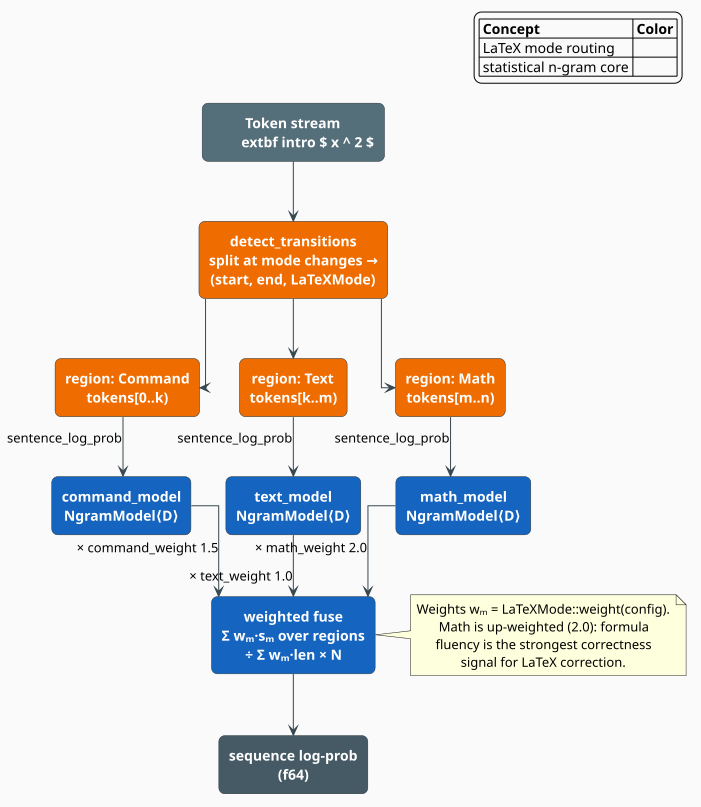

# Mode-Aware N-gram Models

The **`LaTeXNgramModel`** holds *four* Modified Kneser-Ney n-gram models — one for command
sequences, one for mathematics, one for prose, and one combined fallback — and scores a token
stream by cutting it into mode-homogeneous **regions**, routing each region to the model that
was trained on that mode, and fusing the per-region log-probabilities under **mode weights**.
The intuition is specialization: a command model learns that `\begin` is nearly always followed
by an environment name; a math model learns that `\frac` is nearly always followed by two
groups; a text model learns natural-language collocations. A single undifferentiated model must
average those three sub-languages together and is sharp at none of them.

> **Scope.** Source of truth: [`src/latex/ngram.rs`](../../../src/latex/ngram.rs). The tokens and
> their `in_math` flag come from the [tokenizer](tokenizer.md); the smoothing inside each
> component model is [Modified Kneser-Ney](../ngram/modified-kneser-ney.md); the component models
> themselves are ordinary [`NgramModel<D>`](../ngram/overview.md) instances. For the module map
> see the [overview](overview.md).

## Notation

Every symbol is defined before it is used.

| Symbol | Meaning |
|---|---|
| $`T = (t_1, \dots, t_N)`$ | the token stream produced by `LaTeXTokenizer::tokenize` |
| $`N`$ | the number of tokens, $`\lvert T \rvert`$ |
| $`\sigma(t)`$ | the token's **spelling** — the string returned by `LaTeXToken::text()` |
| $`\mu(t)`$ | the **mode of one token**, computed by `ModeDetector::token_mode` |
| $`k`$ | the n-gram order (`NgramConfig::order`, default $`5`$) |
| $`R`$ | the **region decomposition** returned by `ModeDetector::detect_transitions` |
| $`r = (i, j, m)`$ | a region: tokens $`t_i, \dots, t_{j-1}`$, all scored under mode $`m`$ |
| $`m(r)`$ | the mode of region $`r`$ |
| $`n_r = j - i`$ | the length of region $`r`$ in tokens |
| $`w_m`$ | the **mode weight** of mode $`m`$ (`LaTeXMode::weight`) |
| $`\mathbb{P}_m`$ | the Modified Kneser-Ney model owned by mode $`m`$ |
| $`\Lambda_r`$ | the log-probability of region $`r`$ under $`\mathbb{P}_{m(r)}`$ |
| $`\lambda_r = \Lambda_r / n_r`$ | the **per-token mean** log-probability of region $`r`$ |
| $`S(T)`$ | the model's score for the whole stream (`LaTeXNgramModel::score`) |

**Acronyms.** *MKN* — Modified Kneser-Ney; *LM* — language model; *OOV* — out-of-vocabulary.

## Why four models

LaTeX is three languages wearing one syntax. Each has its own statistics, and each is best
served by a model that saw only its own kind of data:

| Sub-language | What the model learns | Characteristic n-gram |
|---|---|---|
| **Command** | control-sequence grammar: which commands follow which, and what they take | `\begin` `{` `equation` `}` |
| **Math** | formula fluency: operator/operand alternation, sub- and superscript structure | `x` `^` `2` `+` `y` |
| **Text** | natural-language collocations in the prose between formulas | `the` `resulting` `bound` |

A fourth **combined** model is trained on everything and serves as the fallback for `Mixed`
regions and for the `mode_separation = false` path.

## Modes

### `LaTeXMode` and its weights

```rust
pub enum LaTeXMode { Command, Math, Text, Mixed }
```

Each mode carries a multiplicative weight, read from `NgramConfig`:

| Mode | Weight field | Default | Routed to |
|---|---|---|---|
| `Command` | `command_weight` | $`1.5`$ | `command_model` |
| `Math` | `math_weight` | $`2.0`$ | `math_model` |
| `Text` | `text_weight` | $`1.0`$ | `text_model` |
| `Mixed` | — (fixed) | $`1.0`$ | `combined_model` |

Math is up-weighted because formula fluency is the strongest correctness signal in a LaTeX
correction: a malformed equation is nearly always the error, whereas awkward prose usually is
not. `LaTeXMode::Mixed` always weighs $`1.0`$; it has no configurable field.

### `token_mode`: one token, one mode

The classification is a single `match`, and its **first rule dominates everything else**:

| Condition, tested in this order | $`\mu(t)`$ |
|---|---|
| `token.in_math` is `true` | `Math` |
| `Command(_)` or `Environment(_)` | `Command` |
| `Text(_)` | `Text` |
| `MathOpen(_)`, `MathClose(_)`, `Subscript`, `Superscript`, `Number(_)`, `Operator(_)`, `Identifier(_)` | `Math` |
| everything else — braces, `Whitespace`, `Comment`, `Ampersand`, `Newline`, `Parameter`, `Tilde`, `Special`, `Unknown` | `Mixed` |

Two consequences are worth internalizing, because they are easy to misread from the type names
alone:

- **`in_math` outranks the token kind.** A `Command` token *inside* mathematics — the `\frac` of
  a displayed equation — is `Math`, not `Command`, and is therefore scored by the math model. The
  `Command` mode is reserved for commands in the *document body*: `\section`, `\textbf`, `\begin`.
- **A `Number` outside math is still `Math`.** The bare `42` in the prose *"see Theorem 42"*
  classifies as `Math`, because numerals overwhelmingly occur in formulas. This is deliberate,
  and it is why an isolated numeral in running text can pull a short sequence toward `Math`.

### `sequence_mode`: the dominant mode of a stream

For a non-empty stream, write $`c_m`$ for the count of tokens in mode $`m`$, $`\rho_m`$ for the
longest *run* of consecutive mode-$`m`$ tokens, and take the thresholds
$`\theta_{\mathrm{cmd}} = \theta_{\mathrm{math}} = 2`$ (`ModeDetector::with_thresholds` overrides
them). Then:

```math
\mathrm{seq}(T) = \begin{cases}
\mathrm{Math}    & \text{if } \rho_{\mathrm{math}} \geq \theta_{\mathrm{math}}
                    \ \lor\ c_{\mathrm{math}} > \lfloor N/2 \rfloor
                    \ \lor\ \exists\, t \in T:\ t.\mathtt{in\_math} \\
\mathrm{Command} & \text{else if } \rho_{\mathrm{cmd}} \geq \theta_{\mathrm{cmd}}
                    \ \lor\ c_{\mathrm{cmd}} > \lfloor N/2 \rfloor \\
\mathrm{Text}    & \text{else if } c_{\mathrm{txt}} > \lfloor N/2 \rfloor \\
\mathrm{Mixed}   & \text{otherwise}
\end{cases} \tag{N1}
```

An empty stream is `Mixed`. The third disjunct of the `Math` branch makes mathematics
**sticky**: a single token anywhere inside math delimiters types the entire sequence as `Math`.
That is the right default for a corrector, whose first duty is to protect formulas.

### `detect_transitions`: carving the stream into regions

`sequence_mode` collapses a stream to one label; `detect_transitions` instead **segments** it.
It walks the stream and cuts a new region whenever the token mode changes — except that `Mixed`
tokens never cut, so braces and whitespace are absorbed into whichever region surrounds them.
The result is a decomposition $`R`$ whose regions **tile the stream exactly**: they are
contiguous, non-overlapping, and cover every token, so $`\sum_{r \in R} n_r = N`$.



*Figure 1. Mode-separated scoring. `detect_transitions` (orange) splits the token stream at mode
changes into `(start, end, LaTeXMode)` regions; each region is scored by its own Modified
Kneser-Ney model (blue) through `sentence_log_prob`; the per-region log-probabilities are fused
under the mode weights — math at $`2.0`$, command at $`1.5`$, text at $`1.0`$ — into a single
sequence log-probability.*

## The mode-weighted score

### The region term

Each region is scored as if it were a sentence of its own. Its log-probability sums the MKN
log-probabilities of its tokens' spellings, with each history clipped **both** by the model
order $`k`$ **and** by the region's left edge $`i`$:

```math
\Lambda_r \;=\; \sum_{p=i}^{j-1}
\log \mathbb{P}_{m(r)}\Bigl(\sigma(t_p) \;\Bigm|\;
\sigma(t_{\max(i,\; p-k+1)}), \dots, \sigma(t_{p-1})\Bigr) \tag{N2}
```

The $`\max(i, \cdot)`$ is not incidental — it is the semantic price of mode separation.
**Context never crosses a region boundary**: the first math token after a prose run is scored
with an *empty* history, because `sentence_log_prob` is invoked afresh on each region's slice.
The models stay pure — the math model is never asked about English words — at the cost of
forgetting the handful of tokens that preceded the switch.

### The fusion

The stream score is a weighted ratio, rescaled by the token count:

```math
S(T) \;=\; \frac{\displaystyle\sum_{r \in R} w_{m(r)}\,\Lambda_r}
                {\displaystyle\sum_{r \in R} w_{m(r)}\,n_r}\;\cdot\; N
\tag{N3}
```

with the guards $`S(T) = 0`$ when $`T`$ is empty, and $`S(T) = \sum_r w_{m(r)} \Lambda_r`$ in the
degenerate case where the denominator vanishes (reachable only by configuring every applicable
weight to $`0`$).

$`(\mathrm{N3})`$ is easier to read after one substitution. Multiplying and dividing region
$`r`$ by its length turns the ratio into a **mixture of per-token mean log-probabilities**:

```math
S(T) \;=\; N \sum_{r \in R} \pi_r \, \lambda_r,
\qquad
\pi_r \;=\; \frac{w_{m(r)}\,n_r}{\sum_{s \in R} w_{m(s)}\,n_s},
\qquad
\lambda_r \;=\; \frac{\Lambda_r}{n_r}
\tag{N4}
```

Because $`w_m > 0`$ and $`n_r \geq 1`$, the coefficients $`\pi_r`$ are non-negative and sum to
$`1`$: they form a genuine probability distribution over regions, in which a region's share of
the verdict is proportional to **its length times its mode's weight**. The score is therefore
$`N`$ times a weighted average per-token log-probability — the same units as an ordinary
sentence log-probability, which keeps $`S(T)`$ comparable across candidates of equal length.

### Corollary: the weights only re-balance *heterogeneous* streams

```math
\mu(t_p) = m \quad \text{for all } p
\qquad\Longrightarrow\qquad
S(T) \;=\; \sum_{r \in R} \Lambda_r
\quad\text{independently of } w_m
\tag{N5}
```

*Proof.* If every region carries the same mode $`m`$, then $`w_{m(r)} = w_m`$ is constant and
factors out of both sums in $`(\mathrm{N3})`$, giving
$`S(T) = \bigl(w_m \sum_r \Lambda_r\bigr) \big/ \bigl(w_m \sum_r n_r\bigr) \cdot N`$. The factor
$`w_m`$ cancels, and $`\sum_r n_r = N`$ because the regions tile the stream, so the surviving
$`N`$ in the numerator cancels against the $`N`$ in the denominator, leaving
$`S(T) = \sum_r \Lambda_r`$. $`\blacksquare`$

So `math_weight = 2.0` does **not** inflate the score of an all-math candidate. It matters only
when a stream *mixes* modes, where it decides how much of the verdict the formula regions cast
relative to the prose around them. That is exactly the behavior wanted from a corrector
comparing candidates that differ inside a formula: the mode weights sharpen the contrast
precisely where the candidates disagree.

### Without mode separation

Setting `NgramConfig::mode_separation = false` bypasses all of the above and consults only the
combined model:

```math
S_{\mathrm{joint}}(T) \;=\; \log \mathbb{P}_{\mathrm{comb}}
\bigl(\sigma(t_1), \dots, \sigma(t_N)\bigr) \tag{N6}
```

Here the history *does* run the length of the stream (clipped only by $`k`$), so this path trades
specialization for uninterrupted context. It is the right choice when the three per-mode corpora
are individually too small to train sharp models.

## The algorithm, literately

The following mirrors [`LaTeXNgramModel::score`](../../../src/latex/ngram.rs) and
`ModeDetector::detect_transitions`. `⟨…⟩` names a refinement expanded below; `<-` is assignment.

```
function score(T):                                  ▸ returns a log-probability (≤ 0), not a [0,1] score
    if T is empty: return 0.0
    if not config.mode_separation:                  ▸ single-model path, (N6)
        return combined_model.sentence_log_prob( [σ(t) for t in T] )

    R <- ⟨Carve T into regions⟩                     ▸ detect_transitions
    num <- 0.0 ;  den <- 0.0
    for (i, j, m) in R:
        spellings <- [σ(t) for t in T[i..j]]        ▸ σ = LaTeXToken::text()
        M <- ⟨Route m to its model⟩
        Λ <- M.sentence_log_prob(spellings)         ▸ (N2); the history restarts at i
        w <- m.weight(config)                       ▸ 2.0 math / 1.5 command / 1.0 text / 1.0 mixed
        num <- num + w · Λ
        den <- den + w · (j - i)
    return (num / den) · |T|   if den > 0   else   num          ▸ (N3)

⟨Carve T into regions⟩ ≡                            ▸ the regions tile [0, |T|) exactly
    mode <- μ(T[0]) ;  start <- 0 ;  R <- []
    for p in 1 .. |T|-1:
        m <- μ(T[p])
        if m ≠ mode and m ≠ Mixed:                  ▸ a Mixed token never cuts a region ...
            R.push( (start, p, mode) )              ▸ ... it is absorbed by the current one
            mode <- m ;  start <- p
    R.push( (start, |T|, mode) )                    ▸ close the final region
    return R

⟨Route m to its model⟩ ≡  match m:                  ▸ = model_for_mode(m)
    Command -> command_model     Math  -> math_model
    Text    -> text_model        Mixed -> combined_model
```

## Scoring one token in context

`score_token(token, context)` answers the incremental question a beam search asks — *how likely
is this next token?* — and returns $`\log \mathbb{P}_m(\sigma(t) \mid \sigma(\text{context}))`$.

The subtlety is **which** $`m`$:

```math
m \;=\; \begin{cases}
\mu(t) & \text{if the context is empty} \\
\mathrm{seq}(\text{context}) & \text{otherwise}
\end{cases} \tag{N7}
```

The model is chosen by the **context's** dominant mode $`(\mathrm{N1})`$, not by the candidate
token's own mode. A candidate `\frac` proposed after a run of prose is therefore scored by the
*text* model, which will rate it as improbable — precisely the signal a corrector wants. Only
when there is no context at all does the token's own mode select the model.

## Engineering

### The vocabulary is a vocabulary of *spellings*

Every component model is trained and queried on $`\sigma(t)`$, the reconstructed source text of a
token. The types are therefore strings such as `\frac`, `{`, `a`, `}`, and `^`. Two implications:

- `\alpha` (a `Command` token) and `alpha` (a `Text` run) are **distinct types** — the backslash
  is part of the spelling.
- The unit of statistics is the token, not the character, so a five-gram spans five *tokens*
  (`\frac` `{` `a` `}` `{`), not five characters.

`vocab_size(mode)` and `in_vocabulary(token, mode)` expose the per-mode vocabularies, and
`model_for_mode(mode)` hands back the underlying `NgramModel<D>` for direct queries.

### `NgramWindow`: the training-time sliding window

```rust
pub struct NgramWindow<'a> { /* … */ }

impl<'a> Iterator for NgramWindow<'a> {
    type Item = (&'a [LaTeXToken], &'a LaTeXToken);   // (context, token)
}
```

`NgramWindow::new(tokens, order)` yields exactly one `(context, token)` pair per position $`p`$,
whose context is the preceding $`k-1`$ tokens clipped at the stream start —
$`\mathrm{ctx}(p) = T[\max(1,\, p-k+1) \,..\, p)`$. The first token is therefore emitted with an
*empty* context, and the iterator's length equals $`N`$. The order must satisfy $`k \geq 1`$: the
iterator forms $`k - 1`$ in unsigned arithmetic, so $`k = 0`$ lies outside its domain.

### The trainer accumulates; the crate's trainer trains

> **Honest naming.** `LaTeXNgramTrainer` is a **buffer router**, not a training loop. `add_tokens`
> appends each token's spelling to its mode buffer (`Mixed` tokens go to neither) *and* to the
> combined buffer; `buffer_sizes()` reports the four lengths. It exposes no `train()`, and
> `NgramConfig::min_count` is not consulted anywhere in this module. To obtain the four
> `NgramModel<D>` instances that `LaTeXNgramModel::new` requires, feed each mode's corpus to the
> crate's own [`TrainerBuilder`](../../training/ngram.md) — the same Modified Kneser-Ney trainer
> the rest of libgrammstein uses — and hand the results over. Likewise, `LaTeXNgramModel` itself
> has no `save`/`load`: persist the four component models individually with
> `NgramModel::save`/`load` (feature `serde-extras`), or with the backend-agnostic
> `save_portable`/`load_portable`, and reassemble with `LaTeXNgramModel::new`.

### Complexity

Let $`N`$ be the token count and $`k`$ the order. `detect_transitions` is a single pass,
$`O(N)`$. Scoring performs one MKN query per token, and each query costs at most $`k`$ trie
look-ups — one per backoff level, see [Modified Kneser-Ney](../ngram/modified-kneser-ney.md) — so
$`S(T)`$ costs $`O(N k)`$ look-ups in total, independent of the number of regions. The scorer
allocates one `String` per token (its spelling) plus one `&str` vector per region, so working
memory is $`O(N)`$.

## Usage

```rust
use libdictenstein::dynamic_dawg::char::DynamicDawgChar;
use libgrammstein::corpus::PlaintextReader;
use libgrammstein::latex::{LaTeXMode, LaTeXNgramModel, LaTeXTokenizer, NgramConfig};
use libgrammstein::ngram::{NgramEntry, NgramModel, TrainerBuilder};

type Dict = DynamicDawgChar<NgramEntry>;

/// Train one Modified Kneser-Ney model over one mode's corpus. Write each mode's token
/// spellings out as plain text beforehand (one region per line): the crate's corpus
/// readers are file-backed.
fn train(path: &str, order: usize) -> libgrammstein::Result<NgramModel<Dict>> {
    let reader = PlaintextReader::from_file(path)?;
    TrainerBuilder::new(Dict::new()).order(order).train(reader)
}

let config = NgramConfig::default();     // order 5; math 2.0, command 1.5, text 1.0
let order = config.order;

let model = LaTeXNgramModel::new(
    train("latex.command.txt", order)?,  // \begin \section \textbf …
    train("latex.math.txt", order)?,     // x ^ 2 + y ^ 2 = z ^ 2 …
    train("latex.text.txt", order)?,     // the resulting bound is tight …
    train("latex.combined.txt", order)?, // everything, for Mixed regions
    config,
);

// Score a candidate: regions are detected, routed, and fused per (N3).
let tokenizer = LaTeXTokenizer::new();
let tokens = tokenizer.tokenize(r"\begin{equation} x^2 + y^2 = z^2 \end{equation}");
let log_p = model.score(&tokens);        // a log-probability (≤ 0), *not* a [0, 1] score

// Incremental scoring: the model is picked from the *context's* mode, per (N7).
let last = tokens.len() - 1;
let next = model.score_token(&tokens[last], &tokens[..last]);

println!("log P(sequence)        = {log_p:.3}");
println!("log P(last | context)  = {next:.3}");
println!("math vocabulary        = {}", model.vocab_size(LaTeXMode::Math));
# Ok::<(), libgrammstein::Error>(())
```

To disable region routing and score against the combined model alone — $`(\mathrm{N6})`$ — build
the config with `mode_separation` cleared:

```rust
use libgrammstein::latex::NgramConfig;

let config = NgramConfig { mode_separation: false, ..Default::default() };
```

## References

1. R. Kneser & H. Ney (1995). *Improved backing-off for M-gram language modeling.* ICASSP '95,
   181–184. [doi:10.1109/ICASSP.1995.479394](https://doi.org/10.1109/ICASSP.1995.479394)
2. S. F. Chen & J. Goodman (1999). *An empirical study of smoothing techniques for language
   modeling.* Computer Speech & Language 13(4), 359–393.
   [doi:10.1006/csla.1999.0128](https://doi.org/10.1006/csla.1999.0128) — the *Modified*
   Kneser-Ney variant that every component model uses.
3. F. Jelinek & R. L. Mercer (1980). *Interpolated estimation of Markov source parameters from
   sparse data.* In *Pattern Recognition in Practice*, 381–397. North-Holland — the classical
   antecedent of fusing several estimators by weight.
4. L. Lamport (1994). *LaTeX: A Document Preparation System*, 2nd ed. Addison-Wesley.
   ISBN 0-201-52983-1 — the command and environment grammar the command model learns.

## See also

- [Tokenizer](tokenizer.md) — produces the tokens, the spellings, and the `in_math` flag
- [Modified Kneser-Ney](../ngram/modified-kneser-ney.md) — the smoothing inside every component model
- [N-gram Overview](../ngram/overview.md) — the `NgramModel<D>` surface reused here
- [N-gram Training](../../training/ngram.md) — the `TrainerBuilder` that produces the four models
- [Combined Scorer](scorer.md) — the dependency-free heuristic that ranks candidates with no trained LM
- [Overview](overview.md) — how the mode-aware model fits the pipeline
