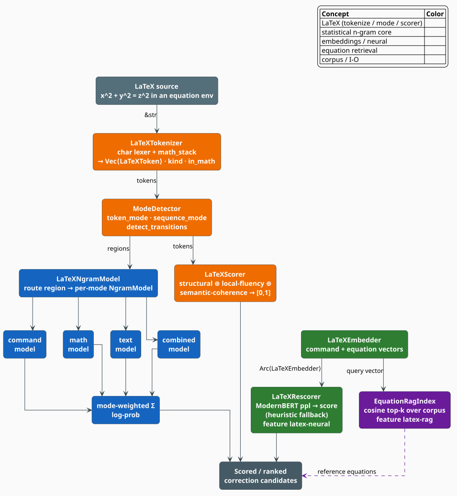

# LaTeX Scoring Module Overview

The **`latex` module** gives libgrammstein a set of LaTeX-aware language-model and
scoring components purpose-built for ranking correction candidates over mathematical and
scientific documents. Where the crate's core n-gram and hybrid models treat text as a flat
token stream, the LaTeX module first recovers document *structure* — commands, environments,
math mode versus prose — and scores each region with the machinery best suited to it. It is
designed to plug into the lling-llang WFST correction framework as a statistical/neural
scoring stage.

> **Scope.** Source of truth: [`src/latex/mod.rs`](../../../src/latex/mod.rs) and the six
> submodules it re-exports — [`tokenizer`](../../../src/latex/tokenizer.rs),
> [`ngram`](../../../src/latex/ngram.rs), [`embedding`](../../../src/latex/embedding.rs),
> [`scorer`](../../../src/latex/scorer.rs), [`rescorer`](../../../src/latex/rescorer.rs), and
> [`rag`](../../../src/latex/rag.rs). This page is the map; each component has its own page,
> linked under [See also](#see-also). For the underlying n-gram machinery these models reuse,
> see [Modified Kneser-Ney](../ngram/modified-kneser-ney.md).

## What the module provides, and why

LaTeX is not prose. The same character means different things in different contexts: a letter
in prose is part of a word, but the same letter inside a math region (delimited in LaTeX source
by a dollar pair) is a mathematical variable; a `+` is punctuation in text but a binary operator
in math. A flat tokenizer erases
exactly the distinctions a corrector needs. The module therefore factors the problem into
five cooperating pieces, each documented on its own page:

| Component | Type(s) | Role |
|---|---|---|
| **Tokenizer** | `LaTeXTokenizer`, `LaTeXToken`, `LaTeXTokenKind`, `MathMode`, `BraceKind` | mode-aware lexing: every token carries an `in_math` flag |
| **Mode-aware n-gram** | `LaTeXNgramModel`, `ModeDetector`, `LaTeXMode`, `NgramConfig` | separate Modified Kneser-Ney models for command / math / text, fused by mode weight |
| **Embeddings** | `LaTeXEmbedder`, `CommandEmbedding`, `EquationEmbedding` | dense vectors for commands and equations; cosine-similarity search |
| **Combined scorer** | `LaTeXScorer`, `ScorerConfig`, `ScoringResult`, `ComponentScore` | a fast, self-contained heuristic: structural validity + local fluency + semantic coherence |
| **Neural rescorer** | `LaTeXRescorer`, `RescorerConfig`, `RescoreResult` | optional ModernBERT pseudo-perplexity rescoring, with a heuristic fallback |
| **Equation RAG** | `EquationRagIndex`, `EquationDocument`, `EquationRetriever` | retrieve similar reference equations by embedding similarity |

The intuition behind the split is *specialization*: a command-sequence model learns that
`\begin` is almost always followed by an environment name; a math model learns that `\frac`
takes two group arguments; a text model learns natural-language collocations. Scoring each
region with the model that saw the most relevant training data yields sharper estimates than
one undifferentiated model could.



*Figure 1. The `latex` pipeline. A LaTeX string is lexed into mode-tagged tokens; the
`ModeDetector` partitions them into homogeneous regions; the mode-aware n-gram model (blue)
and the heuristic `LaTeXScorer` (orange) score them; and the optional neural rescorer (green)
and equation RAG index (purple) refine or contextualize the result.*

## How scoring composes

The default entry point, `LaTeXScorer::score`, is deliberately dependency-free: it needs no
trained model, no neural weights, and no corpus, so it can rank candidates immediately inside
a tight correction loop. It computes three normalized components, each in $`[0,1]`$, and
fuses them as a weight-normalized mean:

```math
\mathrm{score} = \frac{\sum_{j} n_j\, w_j}{\sum_{j} w_j}
\qquad\text{with components } j \in \{\text{structural},\ \text{fluency},\ \text{coherence}\}
\tag{L1}
```

where $`n_j \in [0,1]`$ is component $`j`$'s normalized score and $`w_j`$ its
configured weight. The three components are:

- **structural** — bracket and math-delimiter balance (`compute_structural_score`);
- **ngram** — *local fluency* from adjacent-token transitions and command density
  (`compute_local_fluency_score`); this is a heuristic proxy, **not** an n-gram log-probability
  query;
- **embedding** — *semantic coherence* from mode agreement and command-category compatibility
  (`compute_semantic_coherence_score`); again a heuristic proxy, **not** a vector lookup.

> **Honest naming.** The component keys `"ngram"` and `"embedding"` name the *concepts they
> approximate*, not the heavy machinery. `LaTeXScorer` never calls `LaTeXNgramModel` or
> `LaTeXEmbedder`. The full statistical model, the neural rescorer, and the RAG index are
> separate, opt-in components you compose yourself — see their pages. `ScorerConfig` carries
> `neural_weight` and `rag_weight` fields for that downstream composition, but the built-in
> `score()` does not read them.

## Feature gates

The module and its heavier dependencies are behind Cargo features (see
[`Cargo.toml`](../../../Cargo.toml)). The base feature compiles the pure-Rust tokenizer,
n-gram, embedding, heuristic scorer, and in-memory equation index with no external model
dependencies:

| Feature | Pulls in | Unlocks |
|---|---|---|
| `latex` | (nothing extra) | tokenizer, mode-aware n-gram, embeddings, heuristic scorer, equation index, heuristic rescoring |
| `latex-neural` | `latex` + `neural-rescore` | ModernBERT rescoring inside `LaTeXRescorer` (Candle + tokenizers + hf-hub) |
| `latex-rag` | `latex` + `rag` | the crate-level neural embedding + exact-cosine `rag` backend used to *produce* equation vectors |
| `latex-full` | `latex-neural` + `latex-rag` | everything above |

```toml
[dependencies]
libgrammstein = { version = "0.2", features = ["latex-full"] }
```

Inside the source, the neural path is guarded by `#[cfg(feature = "neural-rescore")]` (which
`latex-neural` enables), and `LaTeXEmbedder::load_command_embeddings` by
`#[cfg(feature = "serde-extras")]`. The `latex::rag` in-memory `EquationRagIndex` itself
compiles under the base `latex` feature because it operates on caller-supplied vectors; the
`latex-rag` feature adds the components that *compute* those vectors.

## A first pass, end to end

```rust
use libgrammstein::latex::{LaTeXTokenizer, LaTeXScorer};

// 1. Lex LaTeX into mode-tagged tokens.
let tokenizer = LaTeXTokenizer::new();
let tokens = tokenizer.tokenize(r"\begin{equation} x^2 + y^2 = z^2 \end{equation}");

// 2. Rank correction candidates with the dependency-free heuristic scorer.
let mut scorer = LaTeXScorer::new();
let result = scorer.score(&tokens);

println!("combined score = {:.3}", result.score);        // in [0, 1]
println!("detected mode  = {:?}", result.mode);          // LaTeXMode
for component in &result.components {
    println!("  {:<10} {:.3}", component.name, component.normalized_score);
}
```

Bringing the trained statistical model, the neural rescorer, or the equation index into the
loop is covered on the respective component pages.

## References

1. R. Kneser & H. Ney (1995). *Improved backing-off for M-gram language modeling.* ICASSP '95,
   181–184. [doi:10.1109/ICASSP.1995.479394](https://doi.org/10.1109/ICASSP.1995.479394)
2. B. Warner, A. Chaffin, B. Clavié, et al. (2024). *Smarter, Better, Faster, Longer: A Modern
   Bidirectional Encoder* (ModernBERT). [arXiv:2412.13663](https://arxiv.org/abs/2412.13663)
3. P. Lewis, E. Perez, A. Piktus, et al. (2020). *Retrieval-Augmented Generation for
   Knowledge-Intensive NLP Tasks.* [arXiv:2005.11401](https://arxiv.org/abs/2005.11401)

## See also

- [Tokenizer](tokenizer.md) — mode-aware lexing and the token model
- [Mode-Aware N-gram Models](ngram.md) — per-mode Modified Kneser-Ney scoring
- [LaTeX Embeddings](embedding.md) — command and equation vectors
- [Combined Scorer](scorer.md) — the three heuristic components in detail
- [Neural Rescorer](rescorer.md) — ModernBERT rescoring and fallback
- [Equation RAG](rag.md) — retrieval of similar reference equations
- [Modified Kneser-Ney](../ngram/modified-kneser-ney.md) — the smoothing the n-gram models reuse
