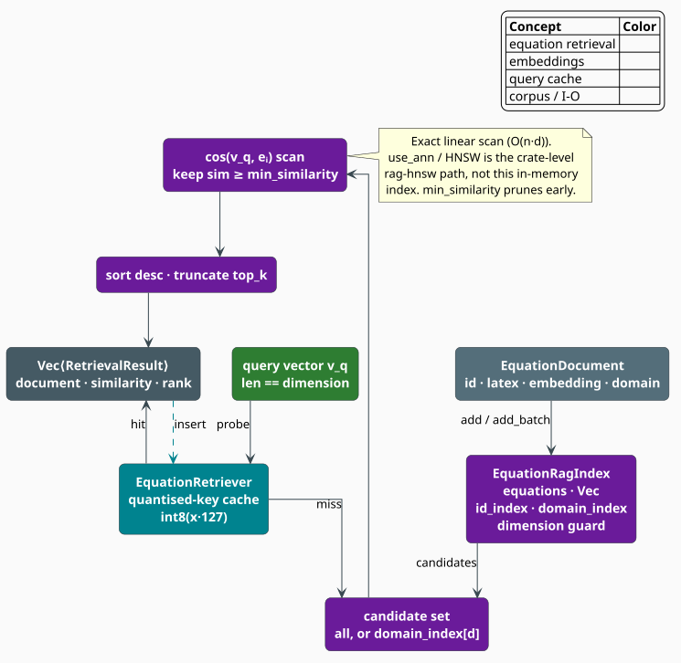

# Equation RAG

The **`EquationRagIndex`** holds a corpus of reference equations — each an id, its LaTeX source, its
embedding vector, and optional provenance — and retrieves the ones most similar to a query vector by
**exact cosine similarity**, subject to a similarity floor and a top-$`k`$ truncation. It is the
LaTeX module's *evidence* stage. Where the [n-gram model](ngram.md) argues from fluency and the
[neural rescorer](rescorer.md) argues from naturalness, retrieval argues from **precedent**: a
candidate repair that matches a published equation at cosine $`0.97`$ is not merely plausible, it is
*attested*.

> **Scope.** Source of truth: [`src/latex/rag.rs`](../../../src/latex/rag.rs). The vectors it stores
> have the shape of an [`EquationEmbedding`](embedding.md); under the `latex-rag` feature they are
> typically produced by the [ModernBERT embedder](../neural/embedder.md). This is the small,
> in-memory, equation-shaped index; the crate's general-purpose, ANN-capable one is a separate
> component — see [RAG Overview](../rag/overview.md). For the module map see the
> [overview](overview.md).

## Notation

| Symbol | Meaning |
|---|---|
| $`d`$ | the embedding dimension, fixed at construction (`EquationRagIndex::new(d)`) |
| $`n`$ | the number of indexed equations, `len()` |
| $`e_i \in \mathbb{R}^d`$ | the embedding of the $`i`$-th `EquationDocument` |
| $`q \in \mathbb{R}^d`$ | the query vector |
| $`\tau`$ | the **similarity floor**, `RetrievalConfig::min_similarity` (default $`0.5`$) |
| $`k`$ | the retrieval width, `RetrievalConfig::top_k` (default $`5`$) |
| $`\delta`$ | an optional **domain** filter, e.g. `"calculus"` |
| $`\mathrm{dom}(i)`$ | the domain of document $`i`$, if it has one |
| $`\mathcal{C}`$ | the **candidate set** — the documents a query is allowed to match |
| $`\mathcal{R}`$ | the **result list** — the ranked, filtered, truncated output |
| $`[x]_a^b`$ | $`\min(\max(x, a), b)`$, the clamp of $`x`$ into $`[a, b]`$ |

**Acronyms.** *RAG* — retrieval-augmented generation; *ANN* — approximate nearest neighbour.

## Why retrieval helps a corrector

Retrieval-augmented generation [[1]](#references) replaces the assumption that a model must *store*
all its knowledge in parameters with the cheaper one that it can *look knowledge up*. For LaTeX
correction the knowledge is a corpus of equations known to be correct, and the payoff is a kind of
evidence the other components structurally cannot produce:

| Component | The question it answers | The evidence it produces |
|---|---|---|
| [Heuristic scorer](scorer.md) | Does this candidate balance and read like LaTeX? | well-formedness |
| [Mode-aware n-gram](ngram.md) | Have I seen these token sequences? | fluency |
| [Neural rescorer](rescorer.md) | Would a bidirectional encoder expect this? | naturalness |
| **Equation RAG** | **Does this equation already exist in the literature?** | **precedent** |

A corrector deciding between `E = mc^2` and `E = mc^3` gets a weak signal from all three of the
first rows — both candidates are well-formed, fluent, and unsurprising — and a decisive one from the
fourth.

## The document

```rust
pub struct EquationDocument {
    pub id: String,                            // unique key; `get(id)` resolves it
    pub latex: String,                         // the equation source, as it will be shown
    pub embedding: Vec<f32>,                   // length must equal the index's `dimension`
    pub source: Option<String>,                // provenance, e.g. an arXiv paper id
    pub label: Option<String>,                 // the equation's \label, if it had one
    pub domain: Option<String>,                // "calculus", "linear_algebra", … — the filter key
    pub metadata: HashMap<String, String>,     // anything else
}
```

Built with `EquationDocument::new(id, latex, embedding)` and refined with `with_source`,
`with_label`, `with_domain`, and `with_metadata`. The `domain` is the only optional field the index
*indexes*: it maintains a `domain_index` so that a domain-filtered query never touches an equation
from another field of mathematics.

## Retrieval

### Similarity

```math
\begin{array}{lr}
\displaystyle \mathrm{sim}(q, e_i) \;=\; \cos(q, e_i)
\;=\; \frac{\sum_{j=1}^{d} q_j\, e_{ij}}
            {\sqrt{\textstyle\sum_{j=1}^{d} q_j^2}\ \sqrt{\textstyle\sum_{j=1}^{d} e_{ij}^2}} & \text{(Q1)}
\end{array}
```

with the same guards as the [embedder's](embedding.md) cosine — mismatched lengths, an empty vector,
or a zero denominator all yield $`0`$, so a degenerate vector can never masquerade as a match.

### The result list

```math
\begin{array}{lr}
\displaystyle \mathcal{C} \;=\;
\begin{cases}
\{\, i \;:\; \mathrm{dom}(i) = \delta \,\} & \text{for a domain-filtered query} \\
\{\, 1, \dots, n \,\} & \text{otherwise}
\end{cases} & \text{(Q2)}
\end{array}
```

```math
\begin{array}{lr}
\displaystyle \mathcal{R} \;=\;
\Bigl(\text{the } k \text{ largest of } \bigl\{\, i \in \mathcal{C} \;:\; \mathrm{sim}(q, e_i) \geq \tau \,\bigr\}
\text{ by } \mathrm{sim}(q, e_i),\ \text{descending}\Bigr) & \text{(Q3)}
\end{array}
```

Each element of $`\mathcal{R}`$ is materialized as a `RetrievalResult { document, similarity, rank }`,
where `rank` is the zero-based position in the output. Two properties of $`(\mathrm{Q3})`$ are worth
stating explicitly:

- **The floor comes before the truncation.** A query with only two matches above $`\tau`$ returns
  two results, not $`k`$ padded with weak ones. $`\tau`$ is what makes "no good precedent exists" an
  expressible answer, and it is why the default $`\tau = 0.5`$ matters more than the default
  $`k = 5`$.
- **A dimension mismatch retrieves nothing, silently.** If $`\lvert q \rvert \neq d`$ the query
  returns an empty list rather than an error — an asymmetry with `add`, which *does* reject a
  mis-dimensioned document. Check `dimension()` against your embedder's `embedding_dim()` once, at
  wiring time.



*Figure 1. Documents (grey) enter the index (purple), which maintains an id map, a domain map, and a
dimension guard. A query vector (green) first probes the retriever's quantized-key cache (teal); on a
miss, the candidate set — everything, or one domain — is scanned by exact cosine, floored at
$`\tau`$, sorted, and truncated to $`k`$.*

## The algorithm, literately

The following mirrors `EquationRagIndex::retrieve_with_filter` and `EquationRetriever::retrieve`.
`⟨…⟩` names a refinement expanded below; `<-` is assignment.

```
function retrieve(q, δ = None):                       ▸ &self: the index itself is read-only here
    if |q| ≠ dimension: return []                     ▸ silent guard (see above)

    C <- if δ is Some(domain) then domain_index[domain] else [0 .. n)      ▸ (Q2)

    scored <- [ (i, cos(q, e_i)) for i in C ]         ▸ (Q1); the exact scan, O(|C|·d)
    scored <- [ (i, s) in scored : s ≥ min_similarity ]                    ▸ the floor, τ
    sort scored by s, descending                      ▸ O(|scored| · log |scored|)
    truncate scored to top_k                          ▸ (Q3)

    return [ RetrievalResult{ document: equations[i].clone(), similarity: s, rank }
             for (rank, (i, s)) in enumerate(scored) ]                     ▸ rank is 0-based

function cached_retrieve(q):                          ▸ EquationRetriever::retrieve, &mut self
    key <- ⟨Quantize q⟩                               ▸ (Q4); an int8 vector, not the f32 one
    if key not in cache:
        if |cache| ≥ 1000: cache.clear()              ▸ clear-on-full, not LRU
        cache[key] <- retrieve(q, None)               ▸ note: domain queries are NOT cached
    return cache[key]

⟨Quantize q⟩ ≡  [ trunc( clamp(127 · x, -128, 127) ) as i8   for x in q ]  ▸ Rust's float→int `as`
                                                                           ▸ saturates and truncates
```

## The quantized query cache

`EquationRetriever` wraps an index with a memo whose key is **not** the query vector but an
**8-bit quantization** of it:

```math
\begin{array}{lr}
\displaystyle Q(x)_j \;=\; \mathrm{trunc}\Bigl( \bigl[\, 127\,x_j \,\bigr]_{-128}^{\,127} \Bigr)
\;\in\; \{-128, \dots, 127\} & \text{(Q4)}
\end{array}
```

(`trunc` rounds *toward zero*, which is what Rust's `as i8` cast does to an `f32`; the cast also
saturates, which is what makes the explicit clamp redundant but harmless.) A `Vec<f32>` of 128
coordinates becomes a `Vec<u8>` of 128 bytes — a 4× smaller key that hashes 4× faster.

The quantization is also what gives the cache its hit rate, and its one caveat: **two different
queries collide iff they quantize identically.** For embeddings in the usual range that bound is
exact and small.

**Proposition (cache substitution error).** Let $`x, y \in [-1, 1]^d`$ with $`Q(x) = Q(y)`$. Then

```math
\begin{array}{lr}
\displaystyle \lVert x - y \rVert_\infty \;<\; \frac{1}{127} \;\approx\; 7.9 \times 10^{-3},
\qquad
\lVert x - y \rVert_2 \;<\; \frac{\sqrt{d}}{127} & \text{(Q5)}
\end{array}
```

*Proof.* On $`[-1, 1]`$ we have $`127 x_j \in [-127, 127]`$, so the clamp in $`(\mathrm{Q4})`$ is
inert and $`Q(x)_j = \mathrm{trunc}(127 x_j)`$. Truncation toward zero maps a real $`u`$ to the
integer $`m`$ with $`u \in [m, m+1)`$ when $`m \geq 0`$ and $`u \in (m-1, m]`$ when $`m < 0`$; in
either case the preimage of $`m`$ is an interval of length $`1`$. If $`Q(x)_j = Q(y)_j = m`$ then
$`127 x_j`$ and $`127 y_j`$ lie in that same unit interval, so $`\lvert 127x_j - 127y_j \rvert < 1`$,
i.e. $`\lvert x_j - y_j \rvert < 1/127`$. Taking the maximum over $`j`$ gives the $`\ell_\infty`$
bound, and $`\lVert v \rVert_2 \leq \sqrt{d}\,\lVert v \rVert_\infty`$ gives the $`\ell_2`$ bound.
$`\blacksquare`$

**Corollary (the retrieved similarities are barely perturbed).** If in addition $`x`$, $`y`$, and
every $`e_i`$ are unit vectors, then for every indexed equation

```math
\begin{array}{lr}
\displaystyle \bigl\lvert \cos(x, e_i) - \cos(y, e_i) \bigr\rvert
\;=\; \bigl\lvert \langle x - y,\; e_i \rangle \bigr\rvert
\;\leq\; \lVert x - y \rVert_2 \, \lVert e_i \rVert_2
\;<\; \frac{\sqrt{d}}{127} & \text{(Q6)}
\end{array}
```

by Cauchy-Schwarz. At the default $`d = 128`$ that is $`\sqrt{128}/127 \approx 0.089`$ — so a cache
hit may answer with the results of a query up to $`0.089`$ away in cosine, which is comfortably
inside the resolution at which $`\tau`$ and the ranking are meaningful, and is the deliberate price
of the smaller, faster key. Where exactness matters more than throughput, query
`EquationRagIndex::retrieve` directly and skip the retriever.

Three further properties of the cache follow from the code and are easy to trip over:

- It is **clear-on-full** at `1000` entries — the whole map is dropped, not an LRU victim.
- `retrieve_in_domain` is **not** cached: the key $`(\mathrm{Q4})`$ records the query but not the
  domain, so caching domain-filtered results under it would return one domain's answers for
  another's question. Taking `&self`, it also does not need to be.
- `index_mut()` **clears the cache** before handing out the mutable borrow, so the memo can never
  outlive the index state it was computed from.

## Engineering

### Building the index

```rust
pub fn add(&mut self, doc: EquationDocument) -> Result<(), &'static str>;
pub fn add_batch(&mut self, docs: Vec<EquationDocument>) -> Result<usize, &'static str>;
```

`add` enforces two invariants and maintains three structures:

| Guard | Failure |
|---|---|
| `doc.embedding.len() == dimension` | `Err("Embedding dimension mismatch")` |
| `len() < config.max_index_size` (default `1_000_000`) | `Err("Index size limit reached")` |

On success the document is appended to the `equations` vector, its id is recorded in `id_index`, and
— if it has one — its domain is recorded in `domain_index`.

> **Two behaviors to design around.** `add_batch` **silently skips** every document that `add`
> rejects and reports only how many it accepted: its `Ok(count)` is a *count*, not a promise, so
> compare `count` against `docs.len()` if rejections matter. And `add` does not enforce id
> uniqueness — re-adding an id overwrites its `id_index` entry, so `get(id)` resolves to the newest
> document while the older one remains in the index and continues to be *retrievable* by similarity.
> Deduplicate upstream if that matters. Note also that these errors are `&'static str`, not the
> crate's [`Error`](../../api/errors.md) type.

The fluent builder assembles both steps:

```rust
use libgrammstein::latex::rag::EquationRagIndexBuilder;

let index = EquationRagIndexBuilder::new(768)   // dimension
    .top_k(10)
    .min_similarity(0.7)
    .add_equations(documents)                   // Vec<EquationDocument>
    .build()?;                                  // Result<EquationRagIndex, &'static str>
# Ok::<(), &'static str>(())
```

### Exact scan, and where approximation lives

> **Honest naming.** `RetrievalConfig::use_ann` is recorded and **never read**. This index is
> *always* an exact linear scan — every candidate's cosine is computed, every time. That is the right
> default for the scale it is built for: a few thousand reference equations, where an exact scan
> costs microseconds and an approximate index would add error for no measurable gain. Approximate
> search is a *different component*: the crate-level [`rag`](../rag/overview.md) module, whose
> `HnswBackend` [[4]](#references) is enabled by the `rag-hnsw` feature and is intended for indices
> beyond a million documents.

The scan also **sorts its whole filtered candidate list** before truncating to $`k`$, where the
[embedder's](embedding.md) top-$`k`$ uses a bounded min-heap. The two choices trade differently: with
a selective floor ($`\tau = 0.5`$ on unit vectors admits few candidates) the surviving set $`m`$ is
far smaller than $`n`$ and the sort is free, whereas a permissive floor makes $`m \approx n`$ and the
heap's $`O(n \log k)`$ would dominate the sort's $`O(n \log n)`$. Choose $`\tau`$ with that in mind.

### Complexity

| Operation | Time | Notes |
|---|---|---|
| `add` | $`O(1)`$ amortized | plus the id/domain map inserts |
| `retrieve` | $`O(n\,d + m \log m)`$ | $`m`$ = candidates surviving the floor $`\tau`$ |
| `retrieve_in_domain` | $`O(n_\delta\, d + m \log m)`$ | $`n_\delta`$ = documents in domain $`\delta`$ |
| `get(id)` | $`O(1)`$ expected | hash lookup through `id_index` |
| `EquationRetriever::retrieve` (hit) | $`O(d)`$ | quantize $`(\mathrm{Q4})`$ + hash |

Memory is $`O(n\,d)`$ for the vectors plus $`O(n)`$ for the two maps; the retriever's cache adds up
to $`1000 \times d`$ bytes of int8 keys and their result lists.

### Feature gates

`EquationRagIndex` compiles under the **base `latex` feature**, because it operates entirely on
caller-supplied vectors and needs no model. The `latex-rag` feature (`latex` + `rag`) adds the
machinery that *produces* those vectors — the ModernBERT embedder and the exact-cosine backend — and
is what you want if the equations are to be embedded rather than imported.

## Usage

Index a small reference corpus and retrieve against it:

```rust
use libgrammstein::latex::{EquationDocument, EquationRagIndex, EquationRetrievalConfig};

// A 4-dimensional toy space; production vectors are the embedder's dimension (e.g. 768).
let config = EquationRetrievalConfig { top_k: 3, min_similarity: 0.5, ..Default::default() };
let mut index = EquationRagIndex::with_config(4, config);

index.add(
    EquationDocument::new("eq:mass-energy".into(), r"E = mc^2".into(), vec![1.0, 0.0, 0.0, 0.0])
        .with_source("arXiv:physics/0512204".into())
        .with_domain("relativity".into()),
)?;
index.add(
    EquationDocument::new("eq:newton-2".into(), r"F = ma".into(), vec![0.9, 0.1, 0.0, 0.0])
        .with_domain("mechanics".into()),
)?;
index.add(
    EquationDocument::new("eq:euler".into(), r"e^{i\pi} + 1 = 0".into(), vec![0.0, 0.0, 1.0, 0.0])
        .with_domain("analysis".into()),
)?;

// A candidate equation, embedded. Everything below the floor is simply absent from the answer.
let query = vec![0.98, 0.05, 0.0, 0.0];
for hit in index.retrieve(&query) {
    println!("#{} {:<18} cos={:.3}", hit.rank, hit.document.latex, hit.similarity);
}
// #0 E = mc^2          cos=0.999
// #1 F = ma            cos=0.997
// (Euler's identity is orthogonal to the query and never clears τ = 0.5.)

// Restrict the precedent to one field of mathematics.
let mechanics = index.retrieve_in_domain(&query, "mechanics");
assert_eq!(mechanics.len(), 1);
assert_eq!(mechanics[0].document.id, "eq:newton-2");

assert_eq!(index.len(), 3);
assert_eq!(index.domain_count("relativity"), 1);
assert!(index.get("eq:euler").is_some());
# Ok::<(), &'static str>(())
```

Front the index with the caching retriever when the same candidates recur — as they do across the
passes of a beam search:

```rust
use libgrammstein::latex::{EquationRagIndex, EquationRetriever};

let mut retriever = EquationRetriever::new(EquationRagIndex::new(4));

let query = vec![0.98, 0.05, 0.0, 0.0];
let first = retriever.retrieve(&query).len();     // computed
let again = retriever.retrieve(&query).len();     // served from the quantized-key cache (Q4)
assert_eq!(first, again);

// Mutating the index invalidates the memo automatically.
retriever.index_mut();                            // cache cleared here
retriever.clear_cache();                          // …or by hand
```

Producing the vectors with ModernBERT (feature `latex-rag`):

```rust
#[cfg(feature = "latex-rag")]
{
    use libgrammstein::latex::{EquationDocument, EquationRagIndex};
    use libgrammstein::neural::{EmbeddingConfig, ModernBertEmbedder};

    let embedder = ModernBertEmbedder::new(EmbeddingConfig::default())?;
    let mut index = EquationRagIndex::new(embedder.embedding_dim());   // dimensions agree by construction

    for (id, latex) in [("eq:mass-energy", r"E = mc^2"), ("eq:newton-2", r"F = ma")] {
        let vector = embedder.embed(latex)?;
        index.add(EquationDocument::new(id.into(), latex.into(), vector))
            .expect("dimension matches the embedder");
    }

    let query = embedder.embed_query(r"E = mc^3")?;   // a damaged candidate
    for hit in index.retrieve(&query) {
        println!("precedent: {} (cos {:.3})", hit.document.latex, hit.similarity);
    }
}
# Ok::<(), libgrammstein::Error>(())
```

## References

1. P. Lewis, E. Perez, A. Piktus, et al. (2020). *Retrieval-Augmented Generation for
   Knowledge-Intensive NLP Tasks.* NeurIPS 33.
   [arXiv:2005.11401](https://arxiv.org/abs/2005.11401) — retrieval as an alternative to
   parametric memory.
2. V. Karpukhin, B. Oğuz, S. Min, et al. (2020). *Dense Passage Retrieval for Open-Domain Question
   Answering.* EMNLP 2020, 6769–6781.
   [doi:10.18653/v1/2020.emnlp-main.550](https://doi.org/10.18653/v1/2020.emnlp-main.550) — dense
   vectors plus inner-product search as the retrieval primitive.
3. G. Salton, A. Wong & C. S. Yang (1975). *A vector space model for automatic indexing.*
   Communications of the ACM 18(11), 613–620.
   [doi:10.1145/361219.361220](https://doi.org/10.1145/361219.361220) — cosine similarity
   $`(\mathrm{Q1})`$.
4. Y. A. Malkov & D. A. Yashunin (2020). *Efficient and Robust Approximate Nearest Neighbor Search
   Using Hierarchical Navigable Small World Graphs.* IEEE TPAMI 42(4), 824–836.
   [doi:10.1109/TPAMI.2018.2889473](https://doi.org/10.1109/TPAMI.2018.2889473) — the approximate
   index that the crate-level `rag-hnsw` backend uses, and that this exact index deliberately is not.
5. J. Johnson, M. Douze & H. Jégou (2021). *Billion-scale similarity search with GPUs.* IEEE
   Transactions on Big Data 7(3), 535–547.
   [doi:10.1109/TBDATA.2019.2921572](https://doi.org/10.1109/TBDATA.2019.2921572) — where exact
   scans stop being affordable, and what replaces them.

## See also

- [LaTeX Embeddings](embedding.md) — `EquationEmbedding`, the vector shape this index stores
- [ModernBERT Embedder](../neural/embedder.md) — produces the equation vectors under `latex-rag`
- [RAG Overview](../rag/overview.md) — the crate's general-purpose index, with ANN backends
- [RAG Retriever](../rag/retriever.md) — the general-purpose retriever and its configuration
- [Combined Scorer](scorer.md) — the stage whose `rag_weight` is reserved for this evidence
- [Overview](overview.md) — how retrieval fits the pipeline
