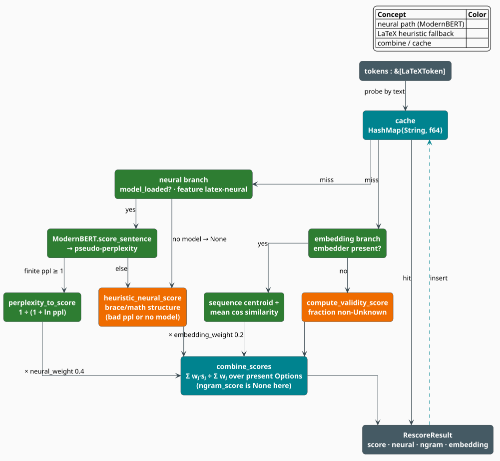

# Neural Rescorer

The **`LaTeXRescorer`** is the module's optional heavy stage. It asks a fine-tuned **ModernBERT**
masked language model how *natural* a candidate reads, converts the model's **pseudo-perplexity**
into a $`[0,1]`$ score, and fuses it with a semantic-coherence score drawn from the
[LaTeX embedder](embedding.md). Its defining engineering property is **graceful degradation**:
every component is an `Option`, and the combiner renormalizes over whatever is present — so the
same call path serves a fully-loaded neural build, an embeddings-only build, and a build with
neither, with no branching in the caller.

> **Scope.** Source of truth: [`src/latex/rescorer.rs`](../../../src/latex/rescorer.rs). The neural
> machinery it drives is crate-level: [`ModernBertRescorer`](../neural/rescorer.md) and the
> [ModernBERT model](../neural/model.md). Gated by the `latex-neural` feature
> (`latex` + `neural-rescore`). For the module map see the [overview](overview.md).

## Notation

| Symbol | Meaning |
|---|---|
| $`T`$ | the candidate token stream; $`N = \lvert T \rvert`$ |
| $`s`$ | the reconstructed LaTeX source of $`T`$ — the concatenation of the token spellings |
| $`x = (x_1, \dots, x_n)`$ | the *sub-word* tokens ModernBERT sees after encoding $`s`$ |
| $`x_{\setminus i}`$ | $`x`$ with position $`i`$ replaced by the `[MASK]` token |
| $`\mathrm{PLL}(s)`$ | the **pseudo-log-likelihood** of $`s`$ under the masked LM |
| $`\mathrm{PPL}(s)`$ | the **pseudo-perplexity** of $`s`$ |
| $`H(s)`$ | the mean per-token cross-entropy of $`s`$, in nats |
| $`\eta,\ \nu,\ \varepsilon`$ | the **neural**, **n-gram**, and **embedding** component scores |
| $`w_\eta, w_\nu, w_\varepsilon`$ | their weights ($`0.4`$, $`0.4`$, $`0.2`$ by default) |
| $`\mathcal{P}`$ | the set of components actually **present** (i.e. `Some`) for this candidate |
| $`[x]_a^b`$ | $`\min(\max(x, a), b)`$, the clamp of $`x`$ into $`[a, b]`$ |

**Acronyms.** *MLM* — masked language model; *PLL* — pseudo-log-likelihood; *PPL* — perplexity.

## Why a second pass at all

Correction is a two-stage economy. The first stage must be cheap, because it runs over *every*
candidate the automaton proposes: that is the job of the [heuristic scorer](scorer.md) and the
[mode-aware n-gram model](ngram.md), both of which are local by construction. A **rescorer** runs
last, over the surviving handful, and is allowed to be expensive — which buys it something the
first stage cannot have: a *bidirectional, global* view of the candidate, in which the tail of an
equation can inform the reading of its head.

That division of labour — cheap generative first pass, expensive discriminative rescoring pass — is
the standard architecture of speech recognition and machine translation systems, and the reason a
masked LM (which cannot generate left-to-right at all) is nevertheless an excellent *judge*
[[1]](#references).

## Pseudo-perplexity

### The score ModernBERT actually produces

A masked language model has no left-to-right factorization, so it cannot report $`\mathbb{P}(s)`$
directly. Salazar et al. [[1]](#references) define instead the **pseudo-log-likelihood**: mask each
position in turn, ask the model for the probability of the token that was really there, and sum:

```math
\begin{array}{lr}
\displaystyle \mathrm{PLL}(s) \;=\; \sum_{i=1}^{n} \log \mathbb{P}_{\mathrm{MLM}}\bigl(x_i \;\bigm|\; x_{\setminus i}\bigr) & \text{(R1)}
\end{array}
```

Exponentiating the negated mean gives the **pseudo-perplexity**, the quantity
`ModernBertRescorer::score_sentence` returns:

```math
\begin{array}{lr}
\displaystyle \mathrm{PPL}(s)
\;=\; \exp\Bigl(-\tfrac{1}{n}\,\mathrm{PLL}(s)\Bigr)
\;=\; \exp\Bigl(-\tfrac{1}{n}\sum_{i=1}^{n} \log \mathbb{P}_{\mathrm{MLM}}\bigl(x_i \mid x_{\setminus i}\bigr)\Bigr) & \text{(R2)}
\end{array}
```

Each of the $`n`$ terms costs one forward pass: the masked sequence goes through the encoder, the
MLM head projects the hidden state at position $`i`$ onto the vocabulary, a numerically stable
log-softmax normalizes it, and the original token's log-probability is read off. Scoring one
sentence therefore costs $`n`$ forward passes — which is exactly why this is a *rescoring* stage
and not a first-pass one. Lower is better, and $`\mathrm{PPL}(s) \geq 1`$ always, with equality
only if the model is certain of every token.

### Mapping perplexity to a score

Perplexity is unbounded above and *lower*-is-better; every other component in this module is
bounded in $`[0,1]`$ and *higher*-is-better. `perplexity_to_score` reconciles them:

```math
\begin{array}{lr}
\displaystyle \eta \;=\; \frac{1}{1 + \ln \mathrm{PPL}(s)} & \text{(R3)}
\end{array}
```

This map is not arbitrary. Substituting $`(\mathrm{R2})`$ reveals what it really measures:

```math
\begin{array}{lr}
\displaystyle \ln \mathrm{PPL}(s) \;=\; -\tfrac{1}{n}\,\mathrm{PLL}(s) \;=\; H(s),
\qquad\text{hence}\qquad
\eta \;=\; \frac{1}{1 + H(s)} & \text{(R4)}
\end{array}
```

$`H(s)`$ is the model's **mean per-token cross-entropy in nats** — the average number of nats of
surprise the candidate costs it. So $`\eta`$ is a *hyperbolic squash of cross-entropy*: it maps the
unbounded loss $`[0, \infty)`$ onto the bounded score $`(0, 1]`$, monotonically decreasing, with

| $`\mathrm{PPL}`$ | $`H`$ (nats) | $`\eta`$ | Reading |
|---|---|---|---|
| $`1`$ | $`0`$ | $`1.00`$ | the model is certain of every token |
| $`e \approx 2.72`$ | $`1`$ | $`0.50`$ | one nat of surprise per token |
| $`10`$ | $`2.30`$ | $`0.30`$ | routine for natural text |
| $`100`$ | $`4.61`$ | $`0.18`$ | the candidate is strange |
| $`\to \infty`$ | $`\to \infty`$ | $`\to 0^{+}`$ | never exactly zero |

The gradient is gentlest precisely where the good candidates live (small $`H`$) and steepest across
the boundary between plausible and implausible — a useful shape for ranking, and one that never
saturates to a hard zero that would annihilate the mixture.

A non-finite perplexity, or one below $`1`$, is out of the map's domain; `perplexity_to_score`
returns `None` for those, and the caller falls back to the structural heuristic of
$`(\mathrm{R7})`$ below.

## Graceful degradation



*Figure 1. The two branches of a `rescore` call. The neural branch (green) runs ModernBERT and maps
its pseudo-perplexity through $`(\mathrm{R3})`$; if a **loaded** model returns an unusable
perplexity it falls back to the structural heuristic (orange), and if no model is loaded at all the
component is simply absent. The embedding branch falls back from centroid coherence to token
validity. The combiner (teal) renormalizes over whichever components are present, and memoizes the
fused number.*

| Component | Where it comes from | Present when | Fallback within the branch |
|---|---|---|---|
| **neural** $`\eta`$ | $`(\mathrm{R3})`$ of ModernBERT's `score_sentence` | a model has been loaded via `load_model` | `heuristic_neural_score`, if the loaded model returns a degenerate perplexity |
| **n-gram** $`\nu`$ | *(a caller's `LaTeXNgramModel` score)* | never, on the shipped path | — |
| **embedding** $`\varepsilon`$ | mean cosine of each command to the sequence centroid | always | `compute_validity_score` |

> **Honest naming.** Two points of this table repay a second reading, because the type names invite
> the opposite conclusion.
>
> **First:** with no model loaded, the neural component is **`None`** — it is *dropped from the
> mixture*, not replaced by the heuristic. `heuristic_neural_score` is the fallback for a *loaded*
> model that returns an unusable perplexity, not for the absence of a model. Since `model_loaded`
> is set only by `load_model`, which exists only under `neural-rescore`, a build without the
> feature never produces a neural component at all, and its score is carried entirely by
> $`\varepsilon`$.
>
> **Second:** `rescore` always passes `None` for the n-gram component — it computes no n-gram score
> of its own. The `ngram_score` field of `RescoreResult` and the `ngram_weight` of `RescorerConfig`
> exist so that a caller who *does* run a [`LaTeXNgramModel`](ngram.md) has somewhere to put its
> verdict; on the shipped call path, $`\nu \notin \mathcal{P}`$ and `ngram_weight` never
> contributes.

### The combination

```math
\begin{array}{lr}
\displaystyle \mathrm{score}(T) \;=\;
\frac{\sum_{j \in \mathcal{P}} w_j\, s_j}{\sum_{j \in \mathcal{P}} w_j},
\qquad
\mathcal{P} \subseteq \{\eta,\ \nu,\ \varepsilon\},
\qquad
\mathrm{score}(T) \;=\; 0 \ \text{ if } \ \mathcal{P} = \varnothing & \text{(R5)}
\end{array}
```

Renormalizing over the *present* components is the whole trick. A missing component does not drag
the score toward zero; it **reweights** the survivors, which keeps the output on a stable
$`[0,1]`$ scale across build configurations:

| Build | $`\mathcal{P}`$ | Realized denominator | Effective score |
|---|---|---|---|
| `latex` only, no embedder | $`\{\varepsilon\}`$ | $`0.2`$ | $`\varepsilon`$ (the validity ratio) |
| `latex` + embedder | $`\{\varepsilon\}`$ | $`0.2`$ | $`\varepsilon`$ (centroid coherence) |
| `latex-neural`, model loaded | $`\{\eta, \varepsilon\}`$ | $`0.6`$ | $`(0.4\,\eta + 0.2\,\varepsilon)\,/\,0.6`$ |
| the above, caller supplies $`\nu`$ | $`\{\eta, \nu, \varepsilon\}`$ | $`1.0`$ | $`0.4\,\eta + 0.4\,\nu + 0.2\,\varepsilon`$ |

Note the first two rows: with no neural model, the rescorer's output *is* the embedding component,
undiluted.

### The embedding component

With an embedder attached and at least two commands present, $`\varepsilon`$ measures the
**self-consistency** of the candidate's commands — how tightly they cluster around their own
centroid:

```math
\begin{array}{lr}
\displaystyle \varepsilon \;=\; \frac{1}{\lvert C \cap V \rvert}
\sum_{c \,\in\, C \cap V} \cos\bigl(\hat{v}(C),\ v_c\bigr) & \text{(R6)}
\end{array}
```

where $`C`$ is the sequence of command names in $`T`$, $`V`$ the embedder's vocabulary, $`v_c`$ the
vector of command $`c`$, and $`\hat{v}(C)`$ the (optionally normalized) centroid of the known
commands — equation $`(\mathrm{E3})`$ of the [embeddings page](embedding.md). A candidate whose
commands all belong to one semantic neighbourhood (`\alpha \beta \gamma`) has a tight centroid and
a high $`\varepsilon`$; a candidate that scatters across categories (`\alpha \sum \textbf`) has a
diffuse centroid and a lower one.

Three conditions send the branch to its fallback — no embedder attached, fewer than two commands in
the stream, or no command in the vocabulary — and the fallback is the crudest measure in the
module, the fraction of tokens that lexed into *something*:

```math
\begin{array}{lr}
\displaystyle \mathrm{validity}(T) \;=\;
\frac{\#\{\, t \in T \;:\; t \text{ is not } \mathtt{Unknown} \,\}}{\max(N,\ 1)} & \text{(R7)}
\end{array}
```

### The structural heuristic

When a loaded model yields an unusable perplexity, the neural branch falls back to a signed walk
over the token stream. Let $`g(T)`$ accumulate

| Token | Contribution to $`g`$ |
|---|---|
| `Command` | $`+0.10`$ |
| `MathOpen`, or a `MathClose` that closes something | $`+0.10`$ |
| `OpenBrace`, or a `CloseBrace` that closes something | $`+0.05`$ |
| a `CloseBrace` or `MathClose` that closes **nothing** | $`-0.50`$ |
| `Unknown` | $`-0.20`$ |
| anything else | $`+0.02`$ |

and let $`b_\circ`$ and $`m_\circ`$ be the residual brace and math depths at end of input. Then

```math
\begin{array}{lr}
\displaystyle h(T) \;=\; \tfrac{1}{2}\left(
\left[\frac{g(T) \;-\; 0.30\,\lvert b_\circ \rvert \;-\; 0.30\,\lvert m_\circ \rvert}{N}\right]_{-1}^{\,1}
\;+\; 1 \right) & \text{(R8)}
\end{array}
```

with $`h(T) = 0`$ for an empty stream. The trailing affine map $`z \mapsto (z+1)/2`$ carries the
clamped, length-normalized accumulation from $`[-1, 1]`$ onto the $`[0, 1]`$ scale every other
component uses. The absolute values are deliberate: an *excess* closing delimiter drives the depth
negative and is therefore charged twice — once by the $`-0.50`$ at the moment it closes nothing, and
again by $`0.30\,\lvert b_\circ \rvert`$ at the end.

## The algorithm, literately

The following mirrors [`LaTeXRescorer::rescore`](../../../src/latex/rescorer.rs). `⟨…⟩` names a
refinement expanded above; `<-` is assignment.

```
function rescore(T):                                  ▸ &mut self: the cache is exclusive, not shared
    s <- concat( σ(t) for t in T )                    ▸ the reconstructed LaTeX source
    if s in cache:
        return RescoreResult{ sequence: s, score: cache[s] }   ▸ NOTE: components are NOT memoized

    η <- ⟨neural component⟩(T)                        ▸ Option<f64>
    ν <- None                                         ▸ never computed here; reserved for the caller
    ε <- ⟨embedding component⟩(T)                     ▸ Option<f64>, always Some

    score <- Σ wⱼ·sⱼ / Σ wⱼ   over the present components, else 0.0     ▸ (R5)
    cache[s] <- score
    return RescoreResult{ sequence: s, score, neural: η, ngram: ν, embedding: ε }

⟨neural component⟩ ≡
    if not model_loaded: return None                  ▸ the component is DROPPED, not defaulted
    ppl <- ModernBERT.score_sentence(s)               ▸ (R2); n forward passes
    return Some( perplexity_to_score(ppl)             ▸ (R3), defined iff ppl is finite and ≥ 1
                 or else heuristic_neural_score(T) )  ▸ (R8) on inference error / degenerate ppl

⟨embedding component⟩ ≡
    C <- [ name for Command(name) in T ]
    if no embedder or |C| < 2:  return Some( validity(T) )              ▸ (R7)
    v̂ <- embedder.sequence_embedding(C)               ▸ (E3), the centroid
    known <- [ c in C : embedder.contains_command(c) ]
    if known is empty:          return Some( validity(T) )              ▸ (R7)
    return Some( mean over c in known of cos(v̂, embedder.command_vector(c)) )   ▸ (R6)
```

## Engineering

### The cache memoizes the *number*, not the breakdown

> **Behavioral subtlety.** The cache is a `HashMap<String, f64>`: it stores the **fused score
> only**. On a hit, `rescore` returns `RescoreResult::new(sequence, score)` — whose `neural_score`,
> `ngram_score`, and `embedding_score` are all `None` and whose `confidence` is $`1.0`$. The score
> is identical; the component breakdown is not. If a caller needs the per-component values for
> every candidate, it should retain the first `RescoreResult` rather than re-`rescore`, or call
> `clear_cache()` between passes.

The map is also **unbounded** — there is no eviction — so a long-lived rescorer over an unbounded
candidate stream grows without limit. `cache_stats()` returns `(len, capacity)`, where the second
element is the `HashMap`'s current allocation, not a ceiling. Contrast the
[heuristic scorer](scorer.md), whose cache is bounded at `10_000` entries with a clear-on-full
policy. Where the rescorer is long-lived, call `clear_cache()` on a schedule.

### Configuration

```rust
pub struct RescorerConfig {
    pub neural_weight: f64,     // 0.4  — read by the combiner
    pub ngram_weight: f64,      // 0.4  — read, but `rescore` supplies no n-gram score (see above)
    pub embedding_weight: f64,  // 0.2  — read by the combiner
    pub batch_size: usize,      // 16   — read by `BatchRescorer` as its chunk size
    pub max_length: usize,      // 512
    pub use_gpu: bool,          // false
    pub model_name: String,     // "modernbert-latex"
}
```

> **Honest naming.** `max_length`, `use_gpu`, and `model_name` are recorded and **not consulted**.
> The model that actually gets loaded, the device it runs on, and its sequence limit all come from
> the [`crate::neural::RescoringConfig`](../neural/rescorer.md) (and the `ModernBertConfig` inside
> it) that you hand to `load_model` — which is the config that owns those decisions.

### Candidates and batching

```rust
pub struct RescoreCandidate {
    pub tokens: Vec<LaTeXToken>,
    pub prior_score: f64,       // from an earlier pipeline stage
    pub source: String,         // e.g. "lexical", "syntactic"
}
```

`BatchRescorer::rescore_candidates` walks the candidates in chunks of `batch_size` and ranks the
results by the **sum** of the prior and the rescore:

```math
\begin{array}{lr}
\displaystyle \mathrm{rank}(\mathrm{cand}) \;=\; \mathrm{prior}(\mathrm{cand}) \;+\; \mathrm{score}(T_{\mathrm{cand}}) & \text{(R9)}
\end{array}
```

Because $`(\mathrm{R9})`$ is a *sum* and not an interpolation, the two terms must live on
comparable scales for the ranking to mean anything: a prior on a log-probability scale
($`\ll 0`$) and a rescore on $`[0,1]`$ will let the prior dominate completely. Normalize the prior
into $`[0,1]`$ before handing it over. `top_k(candidates, k)` truncates the ranking; `best` takes
its head.

Within a chunk the candidates are scored **one at a time** — the chunking bounds working-set size,
and the batched-inference path across a whole chunk is a property of the underlying
[`ModernBertRescorer`](../neural/rescorer.md), not of this wrapper.

### Feature gates

| Build | `load_model` | Neural component | Effective score |
|---|---|---|---|
| `latex` | absent | never present | $`\varepsilon`$ alone — $`(\mathrm{R6})`$ or $`(\mathrm{R7})`$ |
| `latex-neural`, model not loaded | present | absent | $`\varepsilon`$ alone |
| `latex-neural`, model loaded | present | present | $`(0.4\,\eta + 0.2\,\varepsilon)/0.6`$ |

## Usage

Without the neural feature — the rescorer still ranks, on coherence and validity alone:

```rust
use std::sync::Arc;
use libgrammstein::latex::{LaTeXEmbedder, LaTeXRescorer, LaTeXTokenizer};

let tokenizer = LaTeXTokenizer::new();

// An embedder is optional; with one, ε is centroid coherence (R6), without it, validity (R7).
let embedder = Arc::new(LaTeXEmbedder::new());
let mut rescorer = LaTeXRescorer::new().with_embedder(Arc::clone(&embedder));

assert!(!rescorer.is_model_loaded());   // no ModernBERT: the neural component is absent
assert!(rescorer.has_embedder());

let balanced = rescorer.rescore(&tokenizer.tokenize(r"\frac{a}{b}"));
let truncated = rescorer.rescore(&tokenizer.tokenize(r"\frac{a}{b"));

assert!(balanced.score >= truncated.score);
println!("neural    = {:?}", balanced.neural_score);      // None — dropped from the mixture
println!("ngram     = {:?}", balanced.ngram_score);       // None — reserved for the caller
println!("embedding = {:?}", balanced.embedding_score);   // Some(_) — always present
```

With `latex-neural`, load ModernBERT and let $`\eta`$ join the mixture:

```rust
#[cfg(feature = "latex-neural")]
{
    use libgrammstein::latex::{LaTeXRescorer, LaTeXTokenizer, RescorerConfig};
    use libgrammstein::neural::RescoringConfig;

    let config = RescorerConfig { neural_weight: 0.6, embedding_weight: 0.4, ..Default::default() };
    let mut rescorer = LaTeXRescorer::with_config(config);

    // The model, its device, and its sequence limit come from RescoringConfig — not RescorerConfig.
    rescorer.load_model(RescoringConfig::default())?;
    assert!(rescorer.is_model_loaded());

    let tokenizer = LaTeXTokenizer::new();
    let result = rescorer.rescore(&tokenizer.tokenize(r"\int_0^1 x^2 \, dx = \frac{1}{3}"));

    // η = 1 / (1 + H), the hyperbolic squash of ModernBERT's mean cross-entropy (R4).
    println!("neural = {:?}, fused = {:.3}", result.neural_score, result.score);
}
# Ok::<(), libgrammstein::Error>(())
```

Ranking a candidate set against priors from an earlier stage:

```rust
use libgrammstein::latex::{LaTeXRescorer, LaTeXTokenizer};
use libgrammstein::latex::rescorer::{BatchRescorer, RescoreCandidate};

let tokenizer = LaTeXTokenizer::new();
let mut batch = BatchRescorer::new(LaTeXRescorer::new());

// Priors must already be on a [0, 1] scale: (R9) *adds* them to the rescore.
let candidates = vec![
    RescoreCandidate::new(tokenizer.tokenize(r"\alpha"), 0.50, "lexical"),
    RescoreCandidate::new(tokenizer.tokenize(r"\aleph"), 0.35, "lexical"),
    RescoreCandidate::new(tokenizer.tokenize(r"\alph"),  0.20, "lexical"),
];

for (candidate, result) in batch.top_k(&candidates, 2) {
    println!("{:<8} prior={:.2} + rescore={:.3}", candidate.text(), candidate.prior_score, result.score);
}
```

## References

1. J. Salazar, D. Liang, T. Q. Nguyen & K. Kirchhoff (2020). *Masked Language Model Scoring.*
   ACL 2020, 2699–2712.
   [doi:10.18653/v1/2020.acl-main.240](https://doi.org/10.18653/v1/2020.acl-main.240) — the
   pseudo-log-likelihood of $`(\mathrm{R1})`$, and the case for masked LMs as rescorers.
2. J. Devlin, M.-W. Chang, K. Lee & K. Toutanova (2019). *BERT: Pre-training of Deep Bidirectional
   Transformers for Language Understanding.* NAACL-HLT 2019, 4171–4186.
   [doi:10.18653/v1/N19-1423](https://doi.org/10.18653/v1/N19-1423) — the masked-LM objective
   $`(\mathrm{R2})`$ evaluates.
3. B. Warner, A. Chaffin, B. Clavié, et al. (2024). *Smarter, Better, Faster, Longer: A Modern
   Bidirectional Encoder* (ModernBERT). [arXiv:2412.13663](https://arxiv.org/abs/2412.13663) — the
   encoder behind `score_sentence`.
4. F. Jelinek, R. L. Mercer, L. R. Bahl & J. K. Baker (1977). *Perplexity — a measure of the
   difficulty of speech recognition tasks.* Journal of the Acoustical Society of America 62(S1),
   S63. [doi:10.1121/1.2016299](https://doi.org/10.1121/1.2016299) — perplexity as the exponential
   of mean cross-entropy, the identity $`(\mathrm{R4})`$ rests on.

## See also

- [Combined Scorer](scorer.md) — the cheap first-pass scorer whose `neural_weight` is reserved for this stage
- [LaTeX Embeddings](embedding.md) — supplies the centroid and vectors behind $`(\mathrm{R6})`$
- [Mode-Aware N-gram Models](ngram.md) — the source of the $`\nu`$ a caller may supply
- [Neural Rescorer (crate)](../neural/rescorer.md) — `ModernBertRescorer`, `RescoringConfig`, and the batching machinery
- [ModernBERT Model](../neural/model.md) — the encoder, its MLM head, and device selection
- [Overview](overview.md) — how rescoring fits the pipeline
