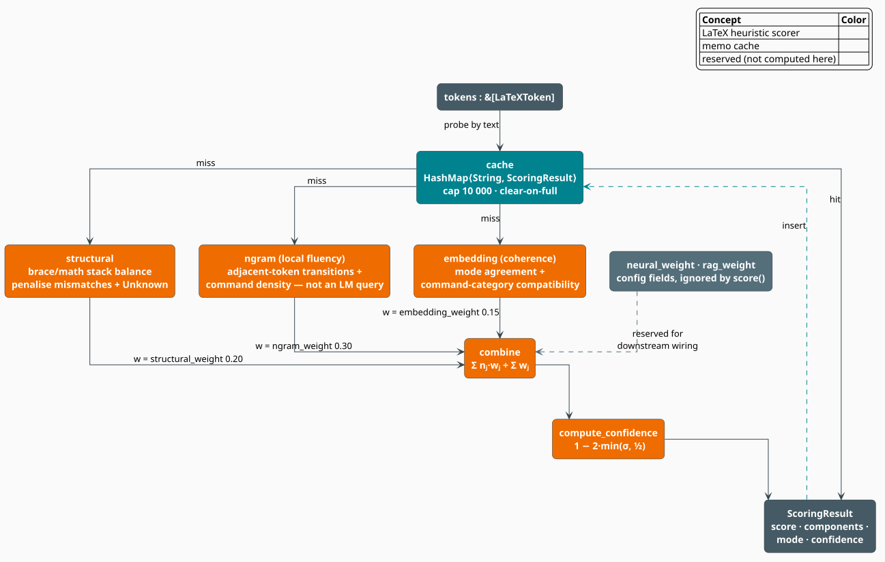

# Combined LaTeX Scorer

The **`LaTeXScorer`** is the module's default entry point and, by design, its most modest
component: a **dependency-free heuristic** that ranks candidate token streams with no trained
model, no neural weights, and no corpus. It computes three normalized scores — *structural
validity*, *local fluency*, and *semantic coherence*, each in $`[0, 1]`$ — fuses them as a
weight-normalized mean, and reports a **confidence** derived from how strongly the three
components agree with one another. Because it touches nothing but the token stream in front of
it, it can be called inside the innermost loop of a corrector, once per candidate, at memory
speed.

> **Scope.** Source of truth: [`src/latex/scorer.rs`](../../../src/latex/scorer.rs). It consumes
> the tokens produced by the [tokenizer](tokenizer.md), the `ModeDetector` of the
> [mode-aware n-gram model](ngram.md), and the `CommandCategory` taxonomy of the
> [embeddings](embedding.md). For the module map see the [overview](overview.md), which labels the
> fusion below `(L1)`.

## Notation

| Symbol | Meaning |
|---|---|
| $`T = (t_1, \dots, t_N)`$ | the candidate token stream |
| $`N`$ | the token count, $`\lvert T \rvert`$ |
| $`J`$ | the set of components actually computed: structural, ngram, embedding |
| $`n_j \in [0,1]`$ | the normalized score of component $`j`$ |
| $`w_j`$ | the configured weight of component $`j`$ |
| $`[x]^{+}`$ | $`\max(x, 0)`$ |
| $`[x]_a^b`$ | $`\min(\max(x, a), b)`$, the clamp of $`x`$ into $`[a, b]`$ |
| $`\varphi(t_p, t_{p+1})`$ | the **transition fluency** of one adjacent token pair |
| $`\rho`$ | the **command ratio** — the fraction of tokens that are `Command` |
| $`\upsilon`$ | the **unknown ratio** — the fraction of tokens that are `Unknown` |
| $`\alpha`$ | the **mode-agreement ratio** — the fraction of tokens whose mode is the sequence's |
| $`\chi`$ | the **category-coherence ratio** — see $`(\mathrm{S3})`$ |
| $`\varsigma`$ | the population standard deviation of the $`n_j`$ |

## What it is, and what it is not

> **Honest naming.** The component keys are `"structural"`, `"ngram"`, and `"embedding"` — but the
> latter two name the *concepts they approximate*, not the machinery they invoke. **`LaTeXScorer`
> never calls `LaTeXNgramModel` and never calls `LaTeXEmbedder`.** The `"ngram"` component is a
> local-fluency proxy computed from adjacent-token transitions; the `"embedding"` component is a
> coherence proxy computed from mode agreement and the *exact* `CommandCategory` taxonomy — no
> vectors are touched. `ScorerConfig` also carries `neural_weight` and `rag_weight` fields, which
> `score()` never reads: they exist so that a caller who *does* wire in the
> [neural rescorer](rescorer.md) and the [equation RAG index](rag.md) has one config object to
> carry all five weights. `normalize_components` is likewise recorded and not read — the three
> component scores are already constructed in $`[0, 1]`$, so `raw_score == normalized_score`
> throughout. `min_score` **is** read: it sets `ScoringResult::passes_threshold`.

This honesty is the point of the design, not an apology for it. A corrector's inner loop may score
thousands of candidates per keystroke; a component that must consult a trie, a vector space, or a
transformer belongs in a *later*, cheaper-to-amortize stage. The heuristic exists to shrink the
candidate set that reaches those stages.



*Figure 1. Anatomy of a `score()` call. The reconstructed source string probes a bounded cache
(teal); on a miss, three independent proxies (orange) are computed over the token stream, fused by
their configured weights, and passed through a variance-based confidence. The `neural_weight` and
`rag_weight` fields (grey) are carried for downstream composition and are not read here.*

## The three components

### `structural` — do the delimiters balance?

The scorer walks the stream with two stacks, one for braces and one for math delimiters, and
subtracts a penalty for every defect it meets. Let $`b_\times`$ be the number of *mismatched*
closing braces, $`m_\times`$ the number of mismatched math closes, $`u`$ the number of `Unknown`
tokens, and $`b_\circ`$ and $`m_\circ`$ the number of braces and math delimiters still **unclosed**
at end of input:

```math
\mathrm{structural}(T) \;=\;
\Bigl[\; 1
\;-\; 0.20\,b_\times
\;-\; 0.30\,m_\times
\;-\; 0.10\,u
\;-\; 0.15\,b_\circ
\;-\; 0.20\,m_\circ
\;\Bigr]^{+}
\tag{S1}
```

An empty stream scores $`0`$. The penalty schedule encodes a judgement about which defects are
most diagnostic of a *wrong* candidate:

| Defect | Penalty | Why it is weighted so |
|---|---|---|
| mismatched math close | $`0.30`$ | closing `$` against an open `\[` cannot be a typo of intent — the candidate is wrong |
| mismatched closing brace | $`0.20`$ | `}` closing an unopened `[` — a structural contradiction |
| unclosed math delimiter | $`0.20`$ | leaves the remainder of the document in math mode |
| unclosed brace | $`0.15`$ | serious, but a truncated candidate window is a common benign cause |
| `Unknown` token | $`0.10`$ | a backslash that begins nothing lexable; suspicious, not fatal |

A brace closes correctly only when its `BraceKind` matches the kind on top of the stack, and a math
delimiter closes correctly only when its `MathMode` matches — so `\[ x $` is caught, not merely
counted.

### `ngram` — does the stream read like LaTeX?

The fluency proxy averages a hand-built **transition score** over adjacent token pairs, then nudges
it with a **density score** that rewards an idiomatic proportion of commands:

```math
\mathrm{fluency}(T) \;=\;
\Biggl[\;
0.85 \cdot \underbrace{\frac{1}{N-1}\sum_{p=1}^{N-1} \varphi(t_p,\, t_{p+1})}_{\text{transition score}}
\;+\;
0.15 \cdot \underbrace{\bigl[\,1 - 1.5\,\lvert \rho - 0.20 \rvert \,\bigr]_{0.35}^{1.0}}_{\text{density score}}
\;\Biggr]_{0}^{1}
\tag{S2}
```

with two base cases: an empty stream scores $`0`$, and a single token scores $`0.25`$ if it is
`Unknown` and $`0.70`$ otherwise (there is no pair to score).

The **density score** peaks at $`\rho = 0.20`$ — one command per five tokens, the empirical texture
of ordinary LaTeX — and falls off linearly at rate $`1.5`$ in either direction, floored at
$`0.35`$. It punishes both extremes: a stream of nothing but commands, and a stream with none at
all where one is expected.

The **transition fluency** $`\varphi`$ is a `match` over the two token kinds; the *first* matching
arm wins, so the table is read top to bottom:

| Previous → current | $`\varphi`$ | Reading |
|---|---|---|
| `Command(c)` → `OpenBrace`, where `c` takes a group | $`1.00`$ | `\frac` `{` — the command got its argument |
| `Command(c)` → anything else, where `c` takes a group | $`0.45`$ | `\frac` `\alpha` — the argument group is missing |
| `OpenBrace` → `CloseBrace` | $`0.55`$ | `{}` — an empty group is legal but pointless |
| `OpenBrace` → *any*, or *any* → `CloseBrace` | $`0.85`$ | ordinary group boundaries |
| `MathOpen` → `MathClose` | $`0.40`$ | empty mathematics — a strong smell |
| `MathOpen` → *any*, or *any* → `MathClose` | $`0.95`$ | ordinary math boundaries |
| `Identifier` / `Number` → `Operator` | $`0.95`$ | `x` `+` — operand then operator |
| `Operator` → `Identifier` / `Number` / `Command` | $`0.95`$ | `+` `y` — operator then operand |
| `Subscript` / `Superscript` → `Identifier` / `Number` / `Command` / `OpenBrace` | $`0.95`$ | `^` `2` — the script got a base |
| `Subscript` / `Superscript` → anything else | $`0.35`$ | `^` `+` — a dangling script |
| `Command` → `Command` | $`\varphi_{cc}`$ | see below |
| `Unknown` on either side | $`0.20`$ | the strongest single-pair penalty |
| `Text` → `Text`, `Identifier` → `Identifier` | $`0.75`$ | plausible but uninformative |
| anything else | $`0.70`$ | the neutral default |

The commands that "take a group" are the ones whose argument is mandatory: `frac`, `sqrt`, `binom`,
`overline`, `underline`, `hat`, `bar`, `vec`, `text`, `textbf`, `textit`, `emph`, `section`,
`subsection`, `subsubsection`, `begin`, `end`.

Command-to-command transitions get their own rule, $`\varphi_{cc}`$:

| `(left, right)` | $`\varphi_{cc}`$ | Reading |
|---|---|---|
| `("left", "right")` or `("begin", "end")` | $`0.20`$ | a delimiter pair or environment with *nothing inside* |
| `("left", _)` or `(_, "right")` | $`0.60`$ | one half of a `\left … \right` pair |
| categories compatible (see $`(\mathrm{S3})`$) | $`0.85`$ | `\sum` `\alpha` — an operator and its operand |
| otherwise | $`0.55`$ | two commands that do not belong together |

### `embedding` — is the stream about one thing?

The coherence proxy mixes three signals: how many tokens share the sequence's dominant mode, how
many adjacent command pairs are *categorically* compatible, and how badly the stream is polluted by
unlexable tokens:

```math
\mathrm{coherence}(T) \;=\;
\Bigl[\; 0.55\,\alpha \;+\; 0.45\,\chi \;-\; 0.35\,\upsilon \;\Bigr]_{0}^{1},
\qquad
\chi \;=\; \begin{cases}
1 & \text{if fewer than two commands} \\[2pt]
\dfrac{\#\{\,p \;:\; \kappa(c_p) \sim \kappa(c_{p+1})\,\}}{\#\{\text{commands}\} - 1} & \text{otherwise}
\end{cases}
\tag{S3}
```

Here $`\alpha`$ is the fraction of tokens whose `token_mode` equals `sequence_mode(T)` (see
[Mode-Aware N-gram Models](ngram.md) for both), $`\kappa`$ is `CommandCategory::from_command`, and
$`c_1, c_2, \dots`$ are the command tokens **in order, with the non-command tokens elided** — so
$`\chi`$ measures adjacency among *commands*, not among tokens.

The compatibility relation $`\sim`$ is worth reading carefully, because it is **reflexive but not
symmetric**:

```math
\kappa_1 \sim \kappa_2
\quad\Longleftrightarrow\quad
\kappa_1 = \kappa_2
\ \ \lor\ \ \kappa_1 = \mathrm{Spacing}
\ \ \lor\ \ \kappa_2 = \mathrm{Spacing}
\ \ \lor\ \ (\kappa_1, \kappa_2) \in C
\tag{S4}
```

```math
C = \left\{
\begin{aligned}
&(\mathrm{Operator}, \mathrm{GreekLetter}),\ (\mathrm{Operator}, \mathrm{Function}),\
 (\mathrm{Function}, \mathrm{GreekLetter}),\ (\mathrm{Function}, \mathrm{Operator}), \\
&(\mathrm{Relation}, \mathrm{GreekLetter}),\ (\mathrm{Relation}, \mathrm{Function}),\
 (\mathrm{Accent}, \mathrm{GreekLetter}),\ (\mathrm{Accent}, \mathrm{Function})
\end{aligned}
\right\}
\tag{S5}
```

(the reflexive pairs $`(\kappa, \kappa)`$ — `GreekLetter` beside `GreekLetter`, `Delimiter` beside
`Delimiter`, and so on — are already covered by the first disjunct of $`(\mathrm{S4})`$.)

The **asymmetry is deliberate and meaningful**. `\sum \alpha` is idiomatic — an operator followed by
its operand — so $`(\mathrm{Operator}, \mathrm{GreekLetter}) \in C`$. The reverse, `\alpha \sum`,
is not idiomatic, and $`(\mathrm{GreekLetter}, \mathrm{Operator}) \notin C`$, so it scores $`0.55`$
rather than $`0.85`$ in $`\varphi_{cc}`$ and does not count toward $`\chi`$. Direction carries
information, and the relation keeps it. `Spacing` is a wildcard on both sides: `\quad` may stand
between any two commands without breaking their coherence.

## The fusion, and the confidence

### Fusion

```math
\mathrm{score}(T) \;=\; \frac{\sum_{j \in J} n_j\, w_j}{\sum_{j \in J} w_j},
\qquad J = \{\,\text{structural},\ \text{ngram},\ \text{embedding}\,\}
\tag{S6}
```

Dividing by the **realized** weight sum — rather than assuming the five configured weights add to
one — is what keeps $`\mathrm{score}(T) \in [0, 1]`$ no matter how the weights are set, and it is
what makes the unread `neural_weight` and `rag_weight` harmless rather than distorting. With the
default configuration the realized denominator is

```math
\textstyle\sum_{j \in J} w_j \;=\; \underbrace{0.20}_{\text{structural}} + \underbrace{0.30}_{\text{ngram}} + \underbrace{0.15}_{\text{embedding}} \;=\; 0.65,
```

not $`1.00`$: the remaining $`0.35`$ of configured weight belongs to components this scorer does not
compute.

### Confidence by agreement

```math
\bar{n} = \frac{1}{\lvert J \rvert}\sum_{j \in J} n_j,
\qquad
\varsigma = \sqrt{\frac{1}{\lvert J \rvert}\sum_{j \in J} \bigl(n_j - \bar{n}\bigr)^{2}},
\qquad
\mathrm{confidence} = \Bigl[\, 1 - 2\,\min\bigl(\varsigma,\ \tfrac{1}{2}\bigr) \Bigr]^{+}
\tag{S7}
```

$`\varsigma`$ is the **population** standard deviation (the denominator is $`\lvert J \rvert`$, not
$`\lvert J \rvert - 1`$) of the component scores, and the map $`\varsigma \mapsto 1 - 2\varsigma`$
sends perfect agreement ($`\varsigma = 0`$) to confidence $`1`$ and saturates at $`0`$ once the
components disagree by half a standard deviation or more. Fewer than two components yields
confidence $`1`$ by definition.

The intuition is the ensemble one [[3]](#references): a score of $`0.6`$ assembled from three
components that *all* said $`0.6`$ is a very different claim from a $`0.6`$ assembled from
$`1.0`$, $`0.6`$, and $`0.2`$. The first is a confident middling verdict; the second is a
disagreement that a downstream stage — the [neural rescorer](rescorer.md), say — is well placed to
break. `confidence` is the signal that tells the caller which one it holds.

## The algorithm, literately

The following mirrors [`LaTeXScorer::score`](../../../src/latex/scorer.rs). `⟨…⟩` names a
refinement expanded above; `<-` is assignment; `++` is concatenation.

```
function score(T):                                    ▸ &mut self: the cache is exclusive, not shared
    key <- concat( σ(t) for t in T )                  ▸ the reconstructed LaTeX source
    if key in cache: return cache[key].clone()        ▸ hit: components and confidence come back intact

    mode <- mode_detector.sequence_mode(T)            ▸ the reported LaTeXMode

    s <- ⟨structural⟩(T)                              ▸ (S1)  brace + math-delimiter balance
    f <- ⟨fluency⟩(T)                                 ▸ (S2)  transitions + command density
    c <- ⟨coherence⟩(T)                               ▸ (S3)  mode agreement + category compatibility

    components <- [ ("structural", s, w_structural),
                    ("ngram",      f, w_ngram),
                    ("embedding",  c, w_embedding) ]  ▸ raw == normalized: all three land in [0,1]

    combined <- Σ nⱼ·wⱼ / Σ wⱼ   over components      ▸ (S6); Σ wⱼ = 0.65 with the defaults
    result <- ScoringResult{ sequence: key, score: combined, components, mode }
    result.passes_threshold <- (combined ≥ config.min_score)
    result.compute_confidence()                       ▸ (S7); population σ of the three nⱼ

    if |cache| ≥ 10_000:  cache.clear()               ▸ clear-on-full, not LRU (see Engineering)
    cache[key] <- result
    return result
```

## Engineering

### The result types

```rust
pub struct ComponentScore {
    pub name: String,                          // "structural" | "ngram" | "embedding"
    pub raw_score: f64,
    pub normalized_score: f64,                 // clamped into [0, 1]
    pub weight: f64,
    pub details: HashMap<String, String>,      // free-form annotations, via `with_detail`
}

pub struct ScoringResult {
    pub sequence: String,                      // the reconstructed source, and the cache key
    pub score: f64,                            // (S6), in [0, 1]
    pub components: Vec<ComponentScore>,
    pub mode: LaTeXMode,                       // sequence_mode(T)
    pub passes_threshold: bool,                // score >= config.min_score
    pub confidence: f64,                       // (S7), in [0, 1]
}
```

`ComponentScore::weighted_score()` returns $`n_j w_j`$ — the numerator's term for that component —
and `ScoringResult::component(name)` looks one up by name.

### The cache

The memo is a `HashMap<String, ScoringResult>` keyed by the **reconstructed source string**, so two
different token vectors that spell the same LaTeX share an entry. Its eviction policy is
**clear-on-full**: at `10_000` entries the whole map is dropped rather than an LRU victim being
chosen. That is a deliberate simplification for a short-lived, single-threaded scorer — the cost of
a total flush is one rebuild of a cache that fills in microseconds, and it buys the scorer freedom
from any ordering structure at all. Contrast the
[hybrid model's cache](../hybrid/interpolation.md), which *is* an LRU and *is* lock-free, because it
is shared across scoring threads and lives for the process's lifetime.

`score` takes `&mut self` for exactly this reason: `LaTeXScorer` is a per-thread object. Give each
worker its own. `cache_stats()` returns `(len, max_cache_size)` and `clear_cache()` flushes it by
hand.

### The builder and its presets

```rust
let scorer = LaTeXScorer::builder()
    .structural_preset()        // ← presets REPLACE the entire config; call them first
    .min_score(0.35)            // ← individual setters refine it afterwards
    .build();
```

> **Ordering matters.** `statistical_preset()`, `neural_preset()`, and `structural_preset()` assign
> a whole new `ScorerConfig`, discarding every weight set before them. Always apply the preset
> first, then refine.

The four configurations, and the denominator each one actually realizes in $`(\mathrm{S6})`$:

| Configuration | `structural` | `ngram` | `embedding` | *`neural`* | *`rag`* | Realized $`\sum_{j \in J} w_j`$ |
|---|---|---|---|---|---|---|
| `ScorerConfig::default()` | $`0.20`$ | $`0.30`$ | $`0.15`$ | *$`0.25`$* | *$`0.10`$* | $`0.65`$ |
| `ScorerConfig::statistical()` | $`0.15`$ | $`0.50`$ | $`0.20`$ | *$`0.10`$* | *$`0.05`$* | $`0.85`$ |
| `ScorerConfig::neural()` | $`0.15`$ | $`0.20`$ | $`0.15`$ | *$`0.45`$* | *$`0.05`$* | $`0.50`$ |
| `ScorerConfig::structural()` | $`0.45`$ | $`0.20`$ | $`0.10`$ | *$`0.15`$* | *$`0.10`$* | $`0.75`$ |

Italicized weights are carried for downstream composition and are not read by `score()`. Note the
consequence: choosing `neural()` without actually wiring in the rescorer does not *disable* the
scorer — it merely re-balances the three components it does compute, since $`(\mathrm{S6})`$
renormalizes.

### Complexity

`structural`, `fluency`, and `coherence` are each a single pass, and `sequence_mode` is another, so
a cache miss costs $`O(N)`$ in the token count plus $`O(L)`$ to build the $`L`$-byte key — with a
cache hit costing only the $`O(L)`$ hash and a clone of the result. `score_candidates` scores each
candidate and then sorts, at $`O(M \log M)`$ in the number of candidates $`M`$; `best_candidate`
is `score_candidates` truncated to its head.

## Usage

```rust
use libgrammstein::latex::{LaTeXScorer, LaTeXTokenizer, ScorerConfig};

let tokenizer = LaTeXTokenizer::new();
let mut scorer = LaTeXScorer::new();                 // ScorerConfig::default()

// Rank three candidate repairs of a damaged fraction.
let candidates = [
    tokenizer.tokenize(r"\frac{a}{b}"),              // well-formed
    tokenizer.tokenize(r"\frac{a}{b"),               // unclosed brace
    tokenizer.tokenize(r"\frac \alpha \beta"),       // no argument groups at all
];
let refs: Vec<&[_]> = candidates.iter().map(|v| v.as_slice()).collect();

for result in scorer.score_candidates(&refs) {       // sorted by score, descending
    println!(
        "{:<24} score={:.3}  confidence={:.3}  mode={:?}",
        result.sequence, result.score, result.confidence, result.mode,
    );
    for component in &result.components {
        println!("    {:<11} {:.3} × {:.2}", component.name, component.normalized_score, component.weight);
    }
}

// The winner is the first element; `best_candidate` is the same thing, truncated.
let best = scorer.best_candidate(&refs).expect("at least one candidate");
assert!(best.passes_threshold);                      // min_score defaults to 0.0
```

Emphasize structure over fluency, and reject anything weak:

```rust
use libgrammstein::latex::LaTeXScorer;

let mut strict = LaTeXScorer::builder()
    .structural_preset()     // structural 0.45, ngram 0.20, embedding 0.10
    .min_score(0.50)         // refine *after* the preset
    .build();

let tokenizer = libgrammstein::latex::LaTeXTokenizer::new();
let result = strict.score(&tokenizer.tokenize(r"\begin{equation} x^2 \end{equation}"));
println!("{} -> {:.3} (passes: {})", result.sequence, result.score, result.passes_threshold);
println!("cache: {:?}", strict.cache_stats());       // (entries, capacity = 10_000)
```

## References

1. D. E. Knuth (1984). *The TeXbook.* Addison-Wesley. ISBN 0-201-13447-0 — grouping, math-mode
   delimiters, and the balance discipline that $`(\mathrm{S1})`$ scores.
2. L. Lamport (1994). *LaTeX: A Document Preparation System*, 2nd ed. Addison-Wesley.
   ISBN 0-201-52983-1 — the mandatory-argument arity encoded in `command_takes_group`.
3. T. G. Dietterich (2000). *Ensemble Methods in Machine Learning.* In *Multiple Classifier
   Systems*, LNCS 1857, 1–15. Springer.
   [doi:10.1007/3-540-45014-9_1](https://doi.org/10.1007/3-540-45014-9_1) — disagreement among
   independent scorers as a measure of uncertainty, the intuition behind $`(\mathrm{S7})`$.

## See also

- [Tokenizer](tokenizer.md) — the token kinds every rule in $`(\mathrm{S1})`$–$`(\mathrm{S3})`$ matches on
- [Mode-Aware N-gram Models](ngram.md) — the `ModeDetector` reused by the coherence component, and the *real* n-gram model
- [LaTeX Embeddings](embedding.md) — the `CommandCategory` taxonomy reused by $`(\mathrm{S4})`$, and the *real* vector space
- [Neural Rescorer](rescorer.md) — the stage that `neural_weight` is reserved for
- [Equation RAG](rag.md) — the stage that `rag_weight` is reserved for
- [Overview](overview.md) — how the scorer fits the pipeline
