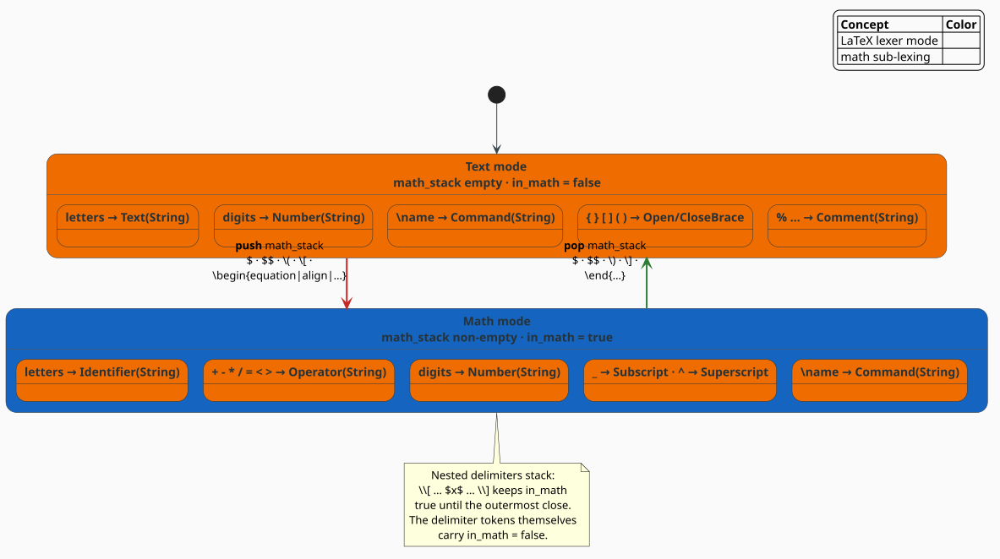

# LaTeX Tokenizer

The **`LaTeXTokenizer`** is a single-pass, character-level lexer that turns LaTeX source into a
stream of typed, position-bearing tokens. Its defining feature is *mode awareness*: a running
stack of math-mode delimiters lets the same character lex differently in prose than in
mathematics, so downstream models can specialize on command, math, and text contexts. Every
token records whether it sits inside math mode.

> **Scope.** Source of truth: [`src/latex/tokenizer.rs`](../../../src/latex/tokenizer.rs). The
> emitted tokens feed the [mode-aware n-gram model](ngram.md), the [heuristic scorer](scorer.md),
> and the [neural rescorer](rescorer.md). For the module map see the [overview](overview.md).

## Why a LaTeX-specific lexer

A whitespace/word tokenizer cannot see the distinctions a LaTeX corrector depends on:

- **Commands are not words.** `\alpha` is one atomic token, not a backslash followed by the
  word *alpha*; `\\` is a line break, not two backslashes.
- **Mode changes meaning.** The letter `x` is prose in running text but a *variable* inside a
  math region. A `+` is punctuation in text but a binary *operator* in math.
- **Delimiters nest and must balance.** Braces, brackets, the dollar-sign math delimiters, the
  paren/bracket forms, and `\begin{env}` … `\end{env}` all open and close scopes a corrector
  must track. In LaTeX source those delimiters look like this:

```latex
The letter x is prose, but $x$ makes it a variable.   % inline math: a dollar pair
$$ x^2 + 1 = 0 $$                                     % display math: a doubled-dollar pair
\( x \)        \[ x^2 \]                              % the paren and bracket forms
\begin{equation} x = y \end{equation}                 % a math environment
```

The tokenizer resolves these at lex time and stamps each token with an `in_math` flag, so no
later stage has to re-derive context.

## The token model

A token is a `kind` plus a half-open byte span $`[\mathit{start},\ \mathit{end})`$ into
the source and the `in_math` flag:

```rust
pub struct LaTeXToken {
    pub kind: LaTeXTokenKind,
    pub start: usize,   // byte offset where the token begins
    pub end: usize,     // byte offset one past the token
    pub in_math: bool,  // true if emitted while the math stack was non-empty
}
```

`LaTeXTokenKind` is a 20-variant enum. Payloads are the captured text (or a typed sub-kind):

| Variant | Payload | Matches |
|---|---|---|
| `Command(String)` | name without backslash | `\alpha`, `\frac`, `\begin`; also single-symbol control words like `\,` |
| `Environment(String)` | environment name | the name token right after `\begin` / `\end` |
| `Text(String)` | run of prose | letters/other chars outside math |
| `Number(String)` | integer or decimal | `42`, `3.14` |
| `Identifier(String)` | one letter | a single alphabetic character **in math mode** |
| `Operator(String)` | one symbol | `+ - * / = < > ! \| : ; , .` **in math mode** |
| `OpenBrace(BraceKind)` / `CloseBrace(BraceKind)` | `Curly` / `Square` / `Paren` | `{ } [ ] ( )` |
| `MathOpen(MathMode)` / `MathClose(MathMode)` | the delimiter kind | math-mode boundaries (below) |
| `Ampersand` | — | `&` (table / matrix column separator) |
| `Newline` | — | `\\` |
| `Comment(String)` | text to end of line | `% …` |
| `Whitespace(String)` | the run of spaces | contiguous whitespace |
| `Parameter(u8)` | the digit | macro parameters `#1` … `#9` |
| `Subscript` / `Superscript` | — | `_` / `^` |
| `Tilde` | — | `~` (non-breaking space) |
| `Special(char)` | the character | a lone symbol in math (or `#` not followed by a digit) |
| `Unknown(String)` | the text | a backslash that begins nothing lexable |

`MathMode` names the five ways math opens, and `BraceKind` the three bracket shapes:

```rust
pub enum MathMode { InlineDollar, InlineParen, DisplayDoubleDollar, DisplayBracket, Environment }
pub enum BraceKind { Curly, Square, Paren }
```

mapping each LaTeX math delimiter (see the source example above) onto one variant:

| LaTeX source delimiter | `MathMode` variant |
|---|---|
| a dollar pair | `InlineDollar` |
| a doubled-dollar pair | `DisplayDoubleDollar` |
| `\(` … `\)` | `InlineParen` |
| `\[` … `\]` | `DisplayBracket` |
| `\begin{equation}` … `\end{equation}` | `Environment` |

### Token helpers

`LaTeXToken` exposes the predicates the scorers use and a faithful text reconstruction:

- `text() -> String` rebuilds the source spelling (`Command("frac")` → `\frac`,
  `MathOpen(InlineDollar)` → `$`, `Newline` → `\\`, …). Concatenating `text()` over a token
  stream round-trips the meaningful content.
- `is_structural()` — true for braces, math delimiters, `Ampersand`, `Newline`.
- `is_command()` — true for `Command(_)`.
- `is_math()` — true when `in_math`, or for math delimiters and `Subscript` / `Superscript`.

## Mode awareness: the math stack

The lexer keeps a `math_stack: Vec<MathMode>`. It is non-empty exactly when the cursor is
inside mathematics, and it stacks so nested delimiters balance correctly. Two rules follow:

1. **Content carries `in_math = true`; delimiters carry `in_math = false`.** The opening and
   closing delimiter tokens sit on the boundary and are emitted with `in_math = false`; every
   token strictly between them sees a non-empty stack and is stamped `true`. In the source
   `x^2` enclosed by a dollar pair, the two delimiter tokens are `false` while `x`, `^`, and
   `2` are `true`.
2. **The same character lexes by mode.** In math, a letter becomes `Identifier`, the operator
   symbols become `Operator`, and other symbols become `Special`; in text, letters and other
   characters accumulate into a `Text` run.



*Figure 1. The lexer as a two-state machine. Pushing a math delimiter switches sub-lexing from
Text rules (letters → `Text`) to Math rules (letters → `Identifier`, `+ - * / = < >` →
`Operator`); popping returns to Text. Because the stack nests, math spans can contain further
math delimiters without losing context.*

## The lexer, literately

The following mirrors `Lexer::next_token` and its helpers. `⟨…⟩` names a refinement expanded
below; `<-` is assignment; `++` is concatenation.

```
function next_token():                                ▸ returns None at end of input
    start <- pos
    c <- advance()                                    ▸ consume one char; None => stream end
    in_math <- (math_stack is non-empty)              ▸ snapshot BEFORE any push/pop
    match c:
        '\\' -> ⟨Lex a backslash⟩
        '$'  -> ⟨Lex a dollar⟩                        ▸ toggles InlineDollar / DisplayDoubleDollar
        '{' | '}' | '[' | ']' | '(' | ')' -> emit Open/CloseBrace(kind)
        '%'  -> read to end of line -> Comment
        '&'  -> Ampersand
        '_'  -> Subscript ;  '^' -> Superscript
        '#'  -> if next is digit then Parameter(d) else Special('#')
        '~'  -> Tilde
        c is whitespace -> accumulate run -> Whitespace
        c is ascii digit -> ⟨Lex a number⟩
        c is math-operator and in_math -> Operator(c)
        c is alphabetic -> Identifier(c) if in_math else ⟨Lex a text run⟩
        otherwise -> Special(c) if in_math else ⟨Lex a text run⟩

⟨Lex a backslash⟩ ≡
    match peek():
        '\\'                 -> Newline
        '[' -> push DisplayBracket, MathOpen ;  ']' -> pop if top is DisplayBracket, MathClose
        '(' -> push InlineParen,   MathOpen ;  ')' -> pop if top is InlineParen,   MathClose
        alphabetic           -> read name while alphabetic -> Command(name)
                                if name == "begin" set after_begin ; if "end" set after_end
        other non-space sym  -> Command(symbol)              ▸ control symbols: \, \; \! ...
        otherwise            -> Unknown("\\")

⟨Lex a dollar⟩ ≡                                       ▸ delimiter tokens get in_math = false
    if peek() == '$':  advance
        if top is DisplayDoubleDollar then pop, MathClose else push, MathOpen
    else
        if top is InlineDollar        then pop, MathClose else push, MathOpen

⟨Lex a number⟩ ≡
    read ascii digits
    if peek() == '.' and the char after '.' is a digit:  read '.' and the fractional digits
    -> Number(text)                                    ▸ a trailing dot with no digit is NOT consumed

⟨Lex a text run⟩ ≡
    read chars until a special char or whitespace, capped at max_token_length
    if after_begin or after_end:                       ▸ this run names an environment
        clear the flag
        if the name is a math environment:
            after \begin -> push Environment ;  after \end -> pop if top is Environment
        -> Environment(name)
    else -> Text(run)
```

The `after_begin` / `after_end` latches are how `\begin{equation}` opens math: the `{`, the
environment name, and the `}` lex normally, but the name token is reclassified as
`Environment`, and if it names a math environment the stack is pushed (or popped, after
`\end`). The recognized math environments are `equation`, `equation*`, `align`, `align*`,
`alignat`, `alignat*`, `gather`, `gather*`, `multline`, `multline*`, `eqnarray`, `eqnarray*`,
`displaymath`, `math`, `array`, `matrix`, `bmatrix`, `pmatrix`, `vmatrix`, `Vmatrix`, `cases`,
`split`, and `subequations`.

## Engineering

### Configuration

```rust
pub struct TokenizerConfig {
    pub preserve_whitespace: bool, // default false: Whitespace tokens are dropped
    pub preserve_comments: bool,   // default false: Comment tokens are dropped
    pub expand_macros: bool,       // default false
    pub normalize_unicode: bool,   // default true
    pub max_token_length: usize,   // default 256: caps a single Text run
}
```

`preserve_whitespace` and `preserve_comments` are honored by the emit filter — when `false`
(the default) those tokens are lexed but not returned. `max_token_length` bounds the length of
a single `Text` run. `expand_macros` and `normalize_unicode` are reserved configuration
fields; the current lexer does not yet act on them.

### Eager and streaming APIs

`tokenize` materializes a `Vec<LaTeXToken>`; `tokenize_iter` yields the identical sequence lazily
from an `impl Iterator`, applying the same preserve filters inline, which avoids allocating the
vector for large documents. The two are verified equal by a property test in the module.

```rust
pub fn tokenize(&self, input: &str) -> Vec<LaTeXToken>;
pub fn tokenize_iter<'a>(&'a self, input: &'a str) -> impl Iterator<Item = LaTeXToken> + 'a;
```

### Complexity

Each character is consumed once; the number-lexer's single-character look-ahead clones the
`Chars` iterator (not the string), so lexing is $`O(n)`$ in the input length $`n`$
with $`O(1)`$ extra state beyond the token output and the (shallow) math stack.

## Usage

```rust
use libgrammstein::latex::{LaTeXTokenizer, LaTeXTokenKind, MathMode, TokenizerConfig};

let tokenizer = LaTeXTokenizer::new();
let tokens = tokenizer.tokenize(r"The area $\pi r^2$ is exact.");

for t in &tokens {
    // `text()` reconstructs the source spelling; `in_math` flags mathematics.
    println!("{:<18} in_math={} :: {:?}", t.text(), t.in_math, t.kind);
}

// Opt into whitespace + comment tokens when you need faithful layout:
let cfg = TokenizerConfig { preserve_comments: true, ..Default::default() };
let verbose = LaTeXTokenizer::with_config(cfg);
let with_comments = verbose.tokenize(r"x % keep me");
assert!(with_comments.iter().any(|t| matches!(t.kind, LaTeXTokenKind::Comment(_))));

// The opening dollar is a delimiter (in_math = false); the pi command inside is in math.
assert!(matches!(tokens[1].kind, LaTeXTokenKind::MathOpen(MathMode::InlineDollar)));
assert!(tokens.iter().any(|t| t.in_math && t.is_command()));
```

## References

1. D. E. Knuth (1984). *The TeXbook.* Addison-Wesley. ISBN 0-201-13447-0 — the definitive
   account of TeX's category codes and math-mode lexing that this tokenizer approximates.
2. L. Lamport (1994). *LaTeX: A Document Preparation System*, 2nd ed. Addison-Wesley.
   ISBN 0-201-52983-1 — the LaTeX command and environment syntax recognized here.

## See also

- [Mode-Aware N-gram Models](ngram.md) — consumes these tokens and their `in_math` flag
- [Combined Scorer](scorer.md) — structural checks over the token stream
- [Overview](overview.md) — how the tokenizer fits the pipeline
