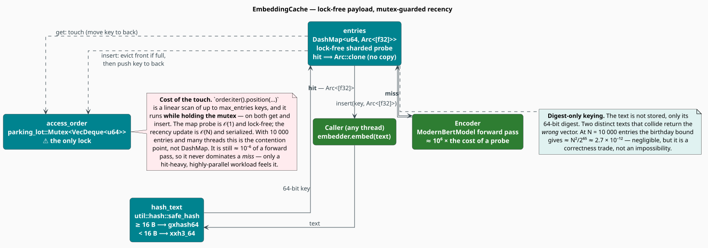
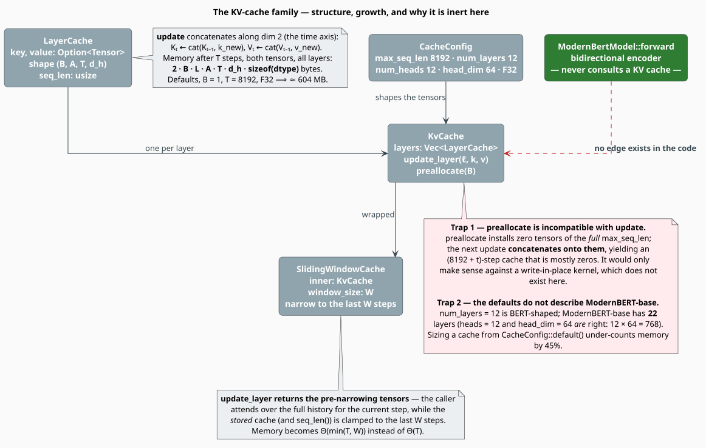

# Caching for Neural Inference

A transformer forward pass costs roughly a million times what a hash-map probe costs. Anywhere
the same text is embedded twice, a cache is not an optimization — it is the difference between a
usable system and an unusable one. This module ships two cache families with very different
standing: `EmbeddingCache`, which is **live** and backs every embedder call, and the
`KvCache`/`LayerCache`/`SlidingWindowCache` trio, which is **scaffolding** that nothing
currently constructs.

> **Scope.** Source of truth: [`src/neural/cache.rs`](../../../src/neural/cache.rs). Feature:
> `neural-rescore`. The consumer of the live cache is [`ModernBertEmbedder`](embedder.md).

## 1. Notation

| Symbol | Meaning |
|---|---|
| $`h`$, $`m`$ | cache **hits** and **misses** over some window of calls |
| $`H`$ | the hit **rate** — the fraction of calls served from the cache |
| $`C_{\text{hit}}`$, $`C_{\text{miss}}`$ | the cost of a hit and of a miss (a full forward pass) |
| $`\bar{C}`$ | the amortized cost per call |
| $`N`$ | `max_entries` — the cache's capacity |
| $`B`$, $`L`$, $`A`$, $`T`$, $`d_h`$ | batch, layers, heads, sequence length, head dimension |

## 2. Why the embedding cache pays

```math
H \;=\; \frac{h}{h + m} \;\in\; [0, 1],
\qquad
\bar{C} \;=\; H \cdot C_{\text{hit}} \;+\; (1 - H)\, C_{\text{miss}} \tag{C1}
```

The speed-up over an uncached embedder is $`C_{\text{miss}} / \bar{C}`$, and because
$`C_{\text{hit}} \lll C_{\text{miss}}`$ it collapses to the classic hyperbola:

```math
\text{speed-up} \;=\; \frac{C_{\text{miss}}}{H\,C_{\text{hit}} + (1 - H)\,C_{\text{miss}}}
\;\xrightarrow[\;C_{\text{hit}} \to 0\;]{}\;
\frac{1}{1 - H} \tag{C2}
```

$`(\mathrm{C2})`$ is worth internalizing: at $`H = 0.5`$ the cache buys $`2\times`$; at
$`H = 0.9`$ it buys $`10\times`$; at $`H = 0.99`$, $`100\times`$. The returns are *superlinear*
in the hit rate, which is why the interactive workloads — a REPL, a chat, a re-ranking loop over
an overlapping candidate set — benefit far more than a single cold pass over a corpus.

Hit rate is monotone non-decreasing in capacity for LRU (it has the *stack property* of Mattson
et al. [[1]](#references)), so raising `cache_size` can never make the hit rate worse — only
the memory bill. The memory is honest and easy: $`N`$ entries $`\times`$ (768 floats + a
`u64` key + `Arc` overhead) $`\approx N \times 3.1`$ KB, i.e. **≈ 31 MB at the default
$`N = 10\,000`$**.

## 3. `EmbeddingCache`: lock-free payload, mutex-guarded recency



*Figure 1 — where a lock is and is not taken. The `DashMap` probe is lock-free; the LRU touch is
not.*

```rust
pub struct EmbeddingCache {
    entries: dashmap::DashMap<u64, std::sync::Arc<[f32]>>,          // lock-free, sharded
    max_entries: usize,
    access_order: parking_lot::Mutex<std::collections::VecDeque<u64>>, // the only lock
}
```

Three deliberate choices:

1. **`DashMap` for the payload.** Sharded, per-shard locking; concurrent readers on different
   keys never contend. This is the hot path.
2. **`Arc<[f32]>` for the value.** A hit returns a *cloned `Arc`*, not a copied 768-float
   vector — an atomic increment instead of a 3 KB `memcpy`. (`ModernBertEmbedder::embed` then
   calls `.to_vec()` to hand the caller an owned `Vec<f32>`, so the copy is paid at the API
   boundary, not inside the cache.)
3. **A `VecDeque` of keys for LRU order.** Eviction is `pop_front` — $`O(1)`$.

The key is a 64-bit digest, not the text:

```rust
fn hash_text(text: &str) -> u64 {
    crate::util::hash::safe_hash(text.as_bytes())   // gxhash64 for >= 16 bytes, else xxh3_64
}
```

> **Two honest properties of this design.**
>
> **(a) The recency touch is $`O(N)`$ under the lock.** Both `get` and `insert` do
> `order.iter().position(…)` to find and move the key — a linear scan of up to `max_entries`
> keys, performed *while holding* the mutex. The map probe is $`O(1)`$ and lock-free; the LRU
> bookkeeping is neither. It remains ~$`10^{-6}`$ of a forward pass, so it never dominates a
> **miss** — but on a hit-heavy, highly-parallel workload the mutex, not `DashMap`, is the
> contention point. An intrusive LRU (a hash map into a linked list) would make the touch
> $`O(1)`$; a `ClockPro`/`SIEVE`-style approximation would remove the lock altogether.
>
> **(b) Digest-only keying can collide.** The text is not stored, so two distinct strings whose
> digests collide would return the *wrong* vector. By the birthday bound the probability at
> $`N = 10^4`$ entries is about $`N^2 / 2^{65} \approx 2.7 \times 10^{-12}`$ — negligible, but
> it is a correctness trade, not an impossibility. Store the text alongside the vector if your
> domain cannot tolerate it.

## 4. Measuring the hit rate

There are **no hit/miss counters in the crate.** `EmbeddingCache` exposes `len()`, `is_empty()`
and `clear()`; `ModernBertEmbedder::cache_stats()` returns `Option<usize>` — the *entry count*,
not a `(hits, misses)` pair. $`(\mathrm{C1})`$ therefore has to be instrumented from outside:

```rust
use std::sync::atomic::{AtomicU64, Ordering};
use libgrammstein::neural::{EmbeddingConfig, ModernBertEmbedder};

let embedder = ModernBertEmbedder::new(EmbeddingConfig::default())?;
let (hits, misses) = (AtomicU64::new(0), AtomicU64::new(0));

// A miss is exactly "the entry count grew"; the cache is only appended to on a miss.
let mut embed_counted = |text: &str| -> libgrammstein::neural::Result<Vec<f32>> {
    let before = embedder.cache_stats().unwrap_or(0);
    let vector = embedder.embed(text)?;
    let after = embedder.cache_stats().unwrap_or(0);
    if after > before {
        misses.fetch_add(1, Ordering::Relaxed);
    } else {
        hits.fetch_add(1, Ordering::Relaxed);
    }
    Ok(vector)
};

let _ = embed_counted("the quick brown fox")?;   // miss
let _ = embed_counted("the quick brown fox")?;   // hit

let (h, m) = (hits.load(Ordering::Relaxed), misses.load(Ordering::Relaxed));
println!("hit rate = {:.1}%", 100.0 * h as f64 / (h + m) as f64);
# Ok::<(), libgrammstein::neural::NeuralError>(())
```

> **The caveat this wrapper carries.** "Entry count grew" identifies a miss only while the cache
> is **below capacity**. Once it is full, a miss evicts as it inserts and `len()` stays pinned at
> `max_entries`, so every call then looks like a hit. Size the probe window accordingly, or add
> real counters to `EmbeddingCache` if you need this in production.

### Using the cache directly

```rust
use libgrammstein::neural::EmbeddingCache;

let cache = EmbeddingCache::new(1_000);            // Default::default() is 1_000 entries

cache.insert("hello", vec![1.0, 2.0, 3.0]);        // takes a Vec<f32>, by value
assert_eq!(cache.len(), 1);

// A hit hands back a cheap Arc clone, not a copy.
let hit: Option<std::sync::Arc<[f32]>> = cache.get("hello");
assert_eq!(hit.as_deref(), Some([1.0, 2.0, 3.0].as_slice()));

cache.clear();
assert!(cache.is_empty());
```

Every method takes `&self` — `EmbeddingCache` is shared, not owned exclusively. The unit test
`test_embedding_cache_concurrent` drives it from four threads at once.

## 5. The KV-cache family — scaffolding, not a fast path



*Figure 2 — structure and growth law. The red edge is the one that does not exist.*

`LayerCache`, `KvCache` and `SlidingWindowCache` implement the standard autoregressive
key-value cache: keep each layer's $`\mathbf{K}`$ and $`\mathbf{V}`$ projections so that step
$`t+1`$ does not recompute step $`t`$'s.

**None of it is on a live path, and it should not be.** ModernBERT is a *bidirectional* encoder:
a forward pass attends over the whole sequence at once, and there is no "previous step" whose
keys and values could be reused. `ModernBertModel::forward` and `get_mlm_logits` never touch a
`KvCache`; no call site in the crate constructs one. KV caching is a decoder technique, and this
module has no decoder. The types compile, are exported, and are unit-tested — treat them as a
foundation for a future autoregressive head, not as a knob you can turn today.

If you *do* build on them, know the growth law and the two traps.

```math
M_{\text{kv}} \;=\; 2 \cdot B \cdot L \cdot A \cdot T \cdot d_h \cdot \operatorname{sizeof}(\text{dtype}) \tag{C3}
```

(the $`2`$ is keys **and** values). At the `CacheConfig` defaults —
$`L = 12`$, $`A = 12`$, $`d_h = 64`$, F32 — with $`B = 1`$ and $`T = 8192`$:

```math
M_{\text{kv}} \;=\; 2 \cdot 1 \cdot 12 \cdot 12 \cdot 8192 \cdot 64 \cdot 4\ \text{B}
\;\approx\; 604\ \text{MB} \tag{C4}
```

A `SlidingWindowCache` of width $`W`$ replaces $`T`$ with $`\min(T, W)`$ in $`(\mathrm{C3})`$,
bounding memory at the cost of forgetting: it `narrow`s the stored tensors to the last $`W`$
steps after each update. Note that `update_layer` returns the **pre-narrowing** tensors — the
caller attends over the full history for the current step, while the *stored* cache (and
`seq_len()`) is clamped.

> **Trap 1 — `preallocate` is incompatible with `update`.** `KvCache::preallocate(batch)`
> installs zero tensors of the *full* `max_seq_len`. But `LayerCache::update` **concatenates**
> along the time axis (`Tensor::cat(&[k, &new_key], 2)`), so the first update appends to those
> 8 192 zero steps and yields an $`(8192 + t)`$-step cache that is mostly zeros. `preallocate`
> would only make sense against a write-in-place kernel, which does not exist here. Do not call
> it.
>
> **Trap 2 — the defaults do not describe ModernBERT-base.** `CacheConfig::default()` has
> `num_layers: 12`. ModernBERT-base has **22** layers. (`num_heads: 12` and `head_dim: 64` *are*
> right — they multiply to the 768 hidden size.) Sizing a cache from the defaults under-counts
> $`(\mathrm{C3})`$ by $`1 - 12/22 \approx 45\%`$; the true figure at $`T = 8192`$ is ≈ 1.11 GB.

```rust
pub struct CacheConfig {
    pub max_seq_len: usize,  // default: 8192
    pub num_layers: usize,   // default: 12   ← ModernBERT-base has 22
    pub num_heads: usize,    // default: 12
    pub head_dim: usize,     // default: 64
    pub dtype: DType,        // default: F32
}
```

## 6. Choosing a cache

| Situation | Use |
|---|---|
| Repeated or overlapping texts (RAG queries, re-ranking, a REPL) | `EmbeddingCache` — it is already on by default (`cache_size: 10_000`) |
| One cold pass over a corpus, every text distinct | Set `cache_size: 0`: the cache can only cost you memory and an $`O(N)`$ touch |
| Memory-bound embedding of a huge corpus | `cache_size: 0`, plus BF16 in `ModernBertConfig::dtype` |
| Autoregressive decoding | Nothing here applies — the KV family is inert and this module has no decoder |

## References

1. R. L. Mattson, J. Gecsei, D. R. Slutz & I. L. Traiger (1970). *Evaluation techniques for
   storage hierarchies.* IBM Systems Journal 9(2), 78–117. (The *stack property*: for LRU, hit
   rate is monotone non-decreasing in capacity.)
   [doi:10.1147/sj.92.0078](https://doi.org/10.1147/sj.92.0078)
2. L. A. Belady (1966). *A study of replacement algorithms for a virtual-storage computer.* IBM
   Systems Journal 5(2), 78–101. (The optimal offline policy LRU approximates.)
   [doi:10.1147/sj.52.0078](https://doi.org/10.1147/sj.52.0078)
3. B. Warner et al. (2024). *Smarter, Better, Faster, Longer: A Modern Bidirectional Encoder for
   Fast, Memory Efficient, and Long Context Finetuning and Inference.* arXiv:2412.13663.
   [doi:10.48550/arXiv.2412.13663](https://doi.org/10.48550/arXiv.2412.13663)
4. T. Dao, D. Y. Fu, S. Ermon, A. Rudra & C. Ré (2022). *FlashAttention: Fast and Memory-Efficient
   Exact Attention with IO-Awareness.* NeurIPS 35. arXiv:2205.14135.
   [doi:10.48550/arXiv.2205.14135](https://doi.org/10.48550/arXiv.2205.14135)

## See also

- [Embedder](embedder.md) — the cache's only in-crate consumer
- [Model](model.md) — why a bidirectional encoder has nothing to cache across steps
- [Neural Overview](overview.md) — the maturity table this page's §5 explains
- [Threading Model](../../architecture/threading.md) — the crate-wide concurrency conventions
- [Code-embedding caching](../code-embeddings/caching.md) — the same idea, for code vectors
