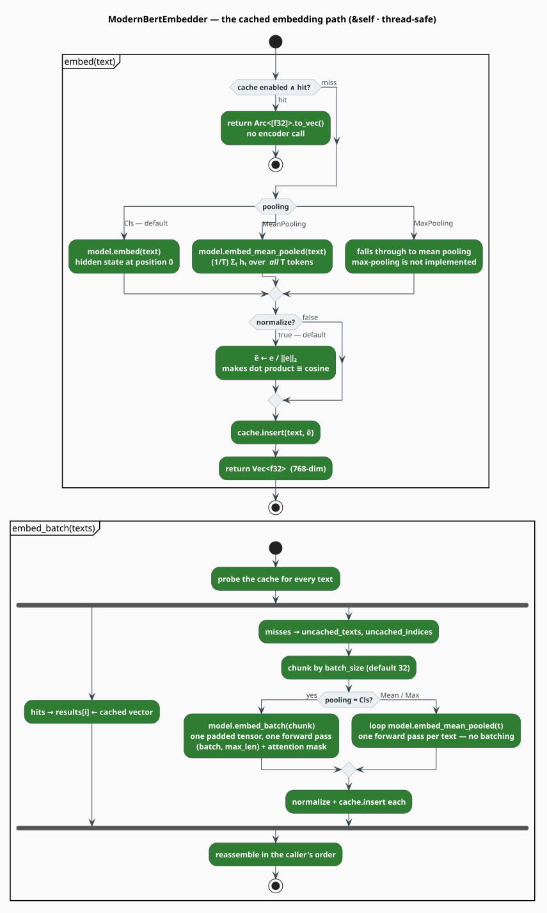

# The ModernBERT Embedder — Documents and Queries as Vectors

`ModernBertEmbedder` turns text into a single dense vector: run the encoder, **pool** the
per-token hidden states into one, optionally **normalize** it to unit length, and **memoize** the
result. Those vectors are the substrate of retrieval ([RAG](../rag/overview.md)), of
[extractive summarization](summarizer.md), and of the
[neural code embedders](../code-embeddings/overview.md).

> **Scope.** Source of truth: [`src/neural/embedder.rs`](../../../src/neural/embedder.rs).
> Feature: `neural-rescore`. The encoder is [Model](model.md); the memo table is
> [Cache](cache.md).

## 1. Notation

| Symbol | Meaning |
|---|---|
| $`T`$ | tokens in the text, after tokenization (including `[CLS]` and `[SEP]`) |
| $`H`$ | hidden size — the embedding dimension, 768 for ModernBERT-base |
| $`\mathbf{h}_t \in \mathbb{R}^{H}`$ | the encoder's final hidden state at position $`t`$ |
| $`\mathbf{e} \in \mathbb{R}^{H}`$ | the pooled text vector, before normalization |
| $`\hat{\mathbf{e}}`$ | the $`\ell_2`$-normalized vector, $`\lVert \hat{\mathbf{e}} \rVert_2 = 1`$ |
| $`\cos(\mathbf{a}, \mathbf{b})`$ | cosine similarity |
| $`N`$ | number of texts in a batch |

## 2. What an embedding is for

An embedding is a point in $`\mathbb{R}^{768}`$ chosen so that *semantic* closeness becomes
*geometric* closeness — the vector-space hypothesis that has underpinned information retrieval
since Salton [[1]](#references), now with the coordinates produced by a transformer rather than
by term counts. The similarity is the cosine:

```math
\cos(\mathbf{a}, \mathbf{b}) \;=\; \frac{\mathbf{a} \cdot \mathbf{b}}{\lVert \mathbf{a} \rVert_2 \, \lVert \mathbf{b} \rVert_2} \;\in\; [-1, 1] \tag{E1}
```

and normalizing once, up front, makes it free at query time:

```math
\hat{\mathbf{e}} = \frac{\mathbf{e}}{\lVert \mathbf{e} \rVert_2}
\quad\Longrightarrow\quad
\cos(\hat{\mathbf{a}}, \hat{\mathbf{b}}) = \hat{\mathbf{a}} \cdot \hat{\mathbf{b}} \tag{E2}
```

That identity is why `normalize` defaults to `true`: a retrieval index can then rank by a plain
dot product — a single fused multiply-add per dimension, and the operation an ANN index is
built to accelerate. (`ModernBertEmbedder::normalize` guards the zero vector by returning it
unchanged rather than dividing by zero, and `cosine_similarity` returns $`0`$ if either norm is
zero.)

## 3. Pooling: from $`T`$ vectors to one

The encoder emits $`T`$ hidden states; pooling collapses them.

```math
\mathbf{e}_{\mathrm{Cls}} = \mathbf{h}_0,
\qquad
\mathbf{e}_{\mathrm{Mean}} = \frac{1}{T}\sum_{t=0}^{T-1} \mathbf{h}_t \tag{E3}
```

| `PoolingStrategy` | Behavior | Notes |
|---|---|---|
| `Cls` (**default**) | $`\mathbf{h}_0`$ — the state above the `[CLS]` marker | the position BERT-family models are pre-trained to use as a sequence summary |
| `MeanPooling` | the arithmetic mean of *all* $`T`$ states | the strategy Sentence-BERT [[2]](#references) found best for similarity tasks |
| `MaxPooling` | **not implemented — silently falls back to `MeanPooling`** | the enum variant exists; the branch calls `embed_mean_pooled` |

Two honest details about `MeanPooling`:

1. **The mean includes `[CLS]` and `[SEP]`.** `embed_mean_pooled` sums the whole sequence axis
   and divides by $`T`$; it does not exclude the markers. With $`T \gg 2`$ the effect is small,
   but on very short texts those two states carry real weight.
2. **The mean ignores padding, because it never pads.** `embed_mean_pooled` runs one sequence at
   a time with no attention mask — correct, but it also means mean-pooled *batches* are looped,
   not batched (see §5).

> **`PoolingStrategy` is not reachable from outside the crate.** The enum is `pub`, but its
> module is private and `src/neural/mod.rs` does not re-export it — so a downstream crate cannot
> name `PoolingStrategy::MeanPooling` to put it in an `EmbeddingConfig`. In practice you get the
> default, `Cls`. This is an API gap, not a design decision; it is recorded in the
> [maturity table](overview.md#7-maturity-what-is-wired-and-what-is-not).

## 4. The embedding path



*Figure 1 — `embed` and `embed_batch`. Both take `&self`: one embedder serves a whole thread
pool. The cache is probed before the encoder is ever touched.*

```
function embed(text):
    if cache enabled and cache.get(text) is Some(v):
        return v.to_vec()                          ▸ hit: an Arc clone, no forward pass
    e <- match pooling:
           Cls          -> model.embed(text)               ▸ h_0
           MeanPooling  -> model.embed_mean_pooled(text)   ▸ (1/T) Σ_t h_t
           MaxPooling   -> model.embed_mean_pooled(text)   ▸ fallback (not implemented)
    if normalize: e <- e / ||e||                   ▸ (E2)
    cache.insert(text, e)
    return e
```

## 5. Batching

`embed_batch` is cache-aware: it partitions the input into hits and misses, and only the misses
reach the encoder.

```
function embed_batch(texts):
    results <- [None; |texts|]
    for i, t in texts:                             ▸ probe first
        if cache hit: results[i] <- cached
        else:         push (i, t) onto the miss list
    for chunk in misses.chunks(batch_size):        ▸ default 32
        embeddings <- match pooling:
            Cls                     -> model.embed_batch(chunk)     ▸ ONE padded forward pass
            MeanPooling | MaxPooling-> chunk.map(model.embed_mean_pooled)  ▸ one pass EACH
        normalize + cache.insert each; write into results at the original indices
    return results
```

**The asymmetry is the point.** Only the `Cls` path is genuinely batched: `model.embed_batch`
pads the chunk to its longest member, builds the $`0/1`$ attention mask, and runs **one**
forward pass of shape $`(N, T_{\max}, H)`$. The mean/max path loops. If you are embedding a
corpus, `Cls` is not merely the default — it is the fast path.

Work saved by the cache, for a batch with hit rate $`H_{\text{rate}}`$:

```math
C_{\text{batch}} \;=\; \bigl(1 - H_{\text{rate}}\bigr) \cdot N \cdot C_{\text{fwd}}
\;+\; N \cdot C_{\text{probe}},
\qquad C_{\text{probe}} \lll C_{\text{fwd}} \tag{E4}
```

## 6. Documents, queries, and truncation

```rust
// Title and content are concatenated with a space, then truncated.
pub fn embed_document(&self, title: Option<&str>, content: &str) -> Result<Vec<f32>>;

// No prefix is added — ModernBERT needs no "query: " sentinel. This is embed(query).
pub fn embed_query(&self, query: &str) -> Result<Vec<f32>>;
```

`embed_document` truncates with a **character** heuristic — roughly four characters per token:

```math
\text{max\_chars} \;=\; 4 \cdot \texttt{max\_seq\_len} \;=\; 32\,768 \ \text{(default)} \tag{E5}
```

and then backs off to the last whitespace so a word is not cut in half.

> **Two sharp edges in the truncation path.**
> 1. **It slices by byte index.** `&text[..max_chars]` panics if `max_chars` does not land on a
>    UTF-8 character boundary — reachable for any non-ASCII document longer than 32 768 bytes
>    ([`src/neural/embedder.rs:256`](../../../src/neural/embedder.rs)). ASCII inputs are safe.
>    Pre-truncate multi-byte text yourself, or slice on a `char_indices` boundary.
> 2. **It is a heuristic, and it is the only limit there is.** Four characters per token is a
>    crude English average; the crate never calls `Tokenizer::with_truncation`, so a text that
>    survives $`(\mathrm{E5})`$ may still tokenize past 8 192 and will be encoded anyway, with
>    RoPE extrapolating beyond its training length. `embed` and `embed_query` do not truncate at
>    all.

## 7. Usage

```rust
use libgrammstein::neural::{EmbeddingConfig, ModernBertEmbedder};

// Defaults: ModernBERT-base, Cls pooling, normalize = true, cache 10_000, batch 32.
let embedder = ModernBertEmbedder::new(EmbeddingConfig::default())?;
assert_eq!(embedder.embedding_dim(), 768);

let query = embedder.embed_query("How does Kneser-Ney smoothing work?")?;
let doc = embedder.embed_document(
    Some("Modified Kneser-Ney"),
    "Absolute discounting subtracts a fixed mass from every non-zero count…",
)?;

// Associated function — NOT a method on &self.
let score = ModernBertEmbedder::cosine_similarity(&query, &doc);
println!("cosine = {score:.4}");
# Ok::<(), libgrammstein::neural::NeuralError>(())
```

Sharing one encoder across an embedder and a rescorer, and inspecting the cache:

```rust
use libgrammstein::neural::{EmbeddingConfig, ModernBertEmbedder};

let config = EmbeddingConfig { cache_size: 50_000, ..Default::default() };
let embedder = ModernBertEmbedder::new(config)?;

let _vectors = embedder.embed_batch(&["first document", "second document"])?;

// cache_stats() is the number of *entries*, not a (hits, misses) pair — see below.
if let Some(entries) = embedder.cache_stats() {
    println!("{entries} embeddings memoized");
}
embedder.clear_cache();

// The Arc lets a rescorer or summarizer reuse the same 149M-parameter encoder.
let shared = embedder.model_arc();
# Ok::<(), libgrammstein::neural::NeuralError>(())
```

Setting `cache_size: 0` disables the cache entirely (the `Option<EmbeddingCache>` stays `None`).

### Bulk corpora

`BatchDocumentEmbedder` wraps an embedder and keeps document identity attached to the vector:

```rust
use libgrammstein::neural::{
    BatchDocumentEmbedder, DocumentEmbedding, EmbeddingConfig, ModernBertEmbedder,
};

let batch = BatchDocumentEmbedder::new(ModernBertEmbedder::new(EmbeddingConfig::default())?);

// (id, optional title, content) — owned Strings, as a slice.
let documents = vec![
    ("doc-1".to_string(), Some("Smoothing".to_string()), "Absolute discounting…".to_string()),
    ("doc-2".to_string(), None, "Continuation counts measure versatility…".to_string()),
];

let embedded: Vec<DocumentEmbedding> = batch.embed_documents(&documents)?;
for DocumentEmbedding { document_id, embedding, title } in &embedded {
    println!("{document_id} ({:?}): {} dims", title, embedding.len());
}
# Ok::<(), libgrammstein::neural::NeuralError>(())
```

## 8. Configuration reference

```rust
pub struct EmbeddingConfig {
    pub model_config: ModernBertConfig,  // default: ModernBERT-base, CPU, F32, 8192
    pub pooling: PoolingStrategy,        // default: Cls   (see the reachability note, §3)
    pub normalize: bool,                 // default: true
    pub cache_size: usize,               // default: 10_000  (0 disables the cache)
    pub batch_size: usize,               // default: 32
}
```

| Scenario | Setting |
|---|---|
| Retrieval / ANN index | `normalize: true` — the dot product then *is* the cosine, $`(\mathrm{E2})`$ |
| Repeated queries (a chat or a REPL) | raise `cache_size`; the hit path never touches the encoder |
| Embedding a large corpus once | keep `Cls` (the only batched path) and raise `batch_size` |
| Memory-constrained | `cache_size: 0`, and prefer BF16 in `model_config.dtype` |

## 9. Limitations

| Limitation | Detail |
|---|---|
| `MaxPooling` | Not implemented; falls back to mean pooling with no warning. |
| `PoolingStrategy` unreachable | Not re-exported; external crates cannot select a strategy. |
| Mean/Max are not batched | Only `Cls` uses `model.embed_batch`; the others loop one text at a time. |
| Byte-index truncation | Can panic on non-ASCII documents over 32 768 bytes — §6. |
| No token-level length guard | `max_seq_len` is not enforced on the tokenized sequence — §6. |
| `cache_stats()` | Returns `Option<usize>` (entry count). There are **no** hit/miss counters; see [Cache](cache.md) §4 for how to measure the hit rate yourself. |
| `embed_batch` unwraps | The final reassembly `unwrap`s its `Option`s. The invariant does hold (every index is filled on both the hit and miss paths), but it is an `unwrap`, not an `expect`. |

## References

1. G. Salton, A. Wong & C. S. Yang (1975). *A vector space model for automatic indexing.*
   Communications of the ACM 18(11), 613–620.
   [doi:10.1145/361219.361220](https://doi.org/10.1145/361219.361220)
2. N. Reimers & I. Gurevych (2019). *Sentence-BERT: Sentence Embeddings using Siamese
   BERT-Networks.* EMNLP-IJCNLP, 3982–3992. arXiv:1908.10084.
   [doi:10.18653/v1/D19-1410](https://doi.org/10.18653/v1/D19-1410)
3. B. Warner et al. (2024). *Smarter, Better, Faster, Longer: A Modern Bidirectional Encoder for
   Fast, Memory Efficient, and Long Context Finetuning and Inference.* arXiv:2412.13663.
   [doi:10.48550/arXiv.2412.13663](https://doi.org/10.48550/arXiv.2412.13663)

## See also

- [Model](model.md) — the pooling primitives `embed`, `embed_mean_pooled`, `embed_batch`
- [Cache](cache.md) — the `EmbeddingCache` behind the hit path
- [Summarizer](summarizer.md) — the embedder's in-crate consumer
- [RAG Retriever](../rag/retriever.md) — where the query and document vectors meet
- [Subword Embeddings](../embedding/overview.md) — the non-neural embedding model
- [Similarity](../embedding/similarity.md) — cosine and friends, in the statistical core
