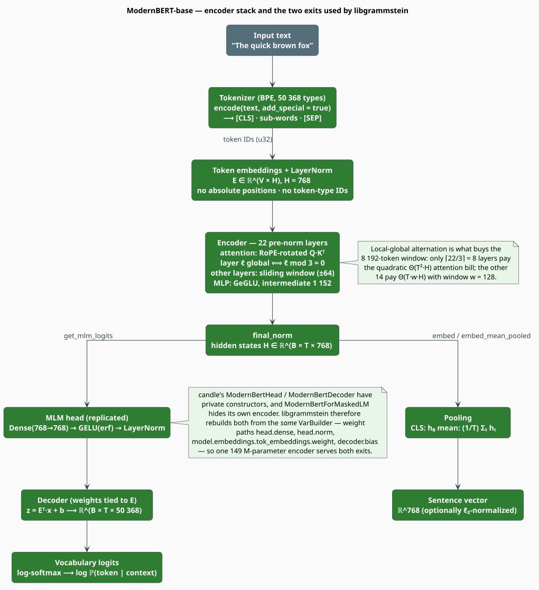

# The ModernBERT Model Wrapper

`ModernBertModel` is libgrammstein's Rust-native handle on a ModernBERT checkpoint
[[1]](#references): it owns the tokenizer, the encoder, and a **reconstructed masked-LM head**,
and it exposes exactly two exits — a *pooled sentence vector* and a *distribution over the
vocabulary at every position*. Those two exits are all the embedder, the rescorer and the
summarizer ever need.

> **Scope.** Source of truth: [`src/neural/modernbert.rs`](../../../src/neural/modernbert.rs).
> Feature: `neural-rescore`. The consumers are documented in [Embedder](embedder.md),
> [Rescorer](rescorer.md) and [Summarizer](summarizer.md).

## 1. Notation

Every symbol is defined before it is used.

| Symbol | Meaning |
|---|---|
| $`B`$ | batch size (number of sequences in one forward pass) |
| $`T`$ | sequence length in **tokens**, after tokenization |
| $`H`$ | hidden size — 768 for ModernBERT-base |
| $`L`$ | number of encoder layers — 22 for ModernBERT-base |
| $`A`$ | number of attention heads — 12; head dimension $`d_h = H/A = 64`$ |
| $`\mathcal{V}`$ | the vocabulary; $`\lvert \mathcal{V} \rvert = 50\,368`$ |
| $`w`$ | the sliding-window width of a *local* attention layer — 128, i.e. $`\pm 64`$ |
| $`\mathbf{h}_t \in \mathbb{R}^{H}`$ | the encoder's final hidden state at position $`t`$ |
| $`\mathbf{E} \in \mathbb{R}^{\lvert \mathcal{V} \rvert \times H}`$ | the input token-embedding matrix |
| $`\mathbf{z}_t \in \mathbb{R}^{\lvert \mathcal{V} \rvert}`$ | the MLM **logit** row at position $`t`$ |

## 2. What ModernBERT is

ModernBERT is an **encoder-only**, bidirectional transformer trained with a masked-language
objective, in the lineage of BERT [[2]](#references) but rebuilt around four modern choices:

| Choice | What it replaces | Why it matters here |
|---|---|---|
| **RoPE** [[3]](#references) | learned absolute position embeddings | positions are injected by rotating $`\mathbf{Q}`$ and $`\mathbf{K}`$, so the 8 192-token window needs no position table |
| **GeGLU** [[4]](#references) | a GELU feed-forward block | a gated MLP; the checkpoint's feed-forward width is a slim 1 152 |
| **Local/global alternation** [[5]](#references) | uniform full attention | only every third layer is global; the rest attend within $`\pm 64`$ |
| **No token-type IDs** | BERT's segment embeddings | there is no "sentence A / sentence B" input to build |

**Bidirectional** is the load-bearing word. Every position sees every other position, which is
what makes masked-token prediction meaningful — and, as [Cache](cache.md) §5 explains, what
makes an autoregressive KV cache pointless.

## 3. Architecture, as libgrammstein drives it



*Figure 1 — from text to either a sentence vector or vocabulary logits. Both exits share the
single encoder instance.*

### The attention budget

Layer $`\ell`$ is **global** exactly when $`\ell \bmod 3 = 0`$, and **local** otherwise (this is
candle's rule, driven by the checkpoint's `global_attn_every_n_layers = 3`). With $`L = 22`$
that is 8 global and 14 local layers. The cost of one forward pass is therefore

```math
C_{\text{fwd}}(T) \;=\; \underbrace{\Theta\!\left(L \cdot T \cdot H^{2}\right)}_{\text{projections + MLP}}
\;+\; \underbrace{\Theta\!\left(\lceil L/3 \rceil \cdot T^{2} \cdot H\right)}_{\text{global attention}}
\;+\; \underbrace{\Theta\!\left(\lfloor 2L/3 \rfloor \cdot T \cdot w \cdot H\right)}_{\text{local attention}} \tag{N1}
```

The middle term is the only quadratic one, and it is paid by $`\lceil 22/3 \rceil = 8`$ layers
rather than all 22 — that is the whole trick behind the long context. For short sentences (the
rescoring regime, $`T \lesssim 50`$) the first term dominates and the model behaves like a
linear-cost encoder.

### The masked-LM head, and why it is rebuilt here

candle exposes ModernBERT's MLM head only through `ModernBertForMaskedLM`, whose inner encoder
is **private** — using it would mean holding a *second* 149 M-parameter encoder alongside the
one the embedder already needs. libgrammstein instead rebuilds the head and the decoder from the
**same `VarBuilder`**, at candle's own weight paths, so a single encoder serves both exits:

```rust
// src/neural/modernbert.rs — the replicated head (fields of ModernBertModel)
let mlm_head_dense = linear_no_bias(hidden_size, hidden_size, vb.pp("head").pp("dense"))?;
let mlm_head_norm = layer_norm_no_bias(hidden_size, model_config.layer_norm_eps, vb.pp("head").pp("norm"))?;

// The decoder's weight is *tied* to the input embeddings (Press & Wolf, 2017).
let decoder_weights = vb.get(
    (model_config.vocab_size, hidden_size),
    "model.embeddings.tok_embeddings.weight",
)?;
let decoder_bias = vb.get(model_config.vocab_size, "decoder.bias")?;
let mlm_decoder = Linear::new(decoder_weights, Some(decoder_bias));
```

The head is the composition

```math
\mathbf{z}_t \;=\; \mathbf{E}\,\operatorname{LayerNorm}\!\bigl(\operatorname{GELU}(\mathbf{W}_{\text{dense}}\,\mathbf{h}_t)\bigr) \;+\; \mathbf{b}_{\text{dec}} \tag{N2}
```

where the decoder matrix **is** the transposed input-embedding matrix $`\mathbf{E}`$ — *weight
tying* [[6]](#references), which is why `vb.get` fetches `model.embeddings.tok_embeddings.weight`
rather than a separate decoder tensor. $`\operatorname{GELU}`$ here is the exact
error-function form (`gelu_erf`), matching candle's `ModernBertHead`.

> **Weight tying is a claim about the checkpoint, not an assumption.** ModernBERT-base ships
> `tie_word_embeddings = true`, so `decoder.weight` does not exist as a separate tensor and the
> lookup above is the *only* correct way to build the decoder. A checkpoint with untied
> embeddings would need a different weight path.

## 4. Loading a model

### From the Hugging Face Hub

```rust
use libgrammstein::neural::{ModernBertConfig, ModernBertModel};

// Downloads model.safetensors, config.json and tokenizer.json on first use,
// caching under HF_HOME (default ~/.cache/huggingface).
let model = ModernBertModel::load(ModernBertConfig::default())?;

assert_eq!(model.hidden_size(), 768);
assert_eq!(model.vocab_size(), 50_368);
# Ok::<(), libgrammstein::neural::NeuralError>(())
```

`load` takes the config **by value**. Any Hub failure surfaces as
`NeuralError::ModelLoad`.

### From local files (offline, pinned, or fine-tuned)

Note the argument order — **model, config, tokenizer** — and that the final parameter is a
`candle_core::Device`, not the crate's `Device` enum. `Device::to_candle()` bridges the two, and
its error converts automatically:

```rust
use std::path::Path;
use libgrammstein::neural::{ModernBertConfig, ModernBertModel};

let config = ModernBertConfig::default();
let device = config.device.to_candle()?;   // candle_core::Device

let model = ModernBertModel::load_from_files(
    Path::new("./models/modernbert/model.safetensors"),
    Path::new("./models/modernbert/config.json"),
    Path::new("./models/modernbert/tokenizer.json"),
    config,
    device,
)?;
# Ok::<(), libgrammstein::neural::NeuralError>(())
```

Weights are mapped with `VarBuilder::from_mmaped_safetensors`, so the 600 MB of F32 parameters
are paged in by the kernel rather than copied through the heap.

### Configuration

```rust
pub struct ModernBertConfig {
    pub model_id: String,     // default: "answerdotai/ModernBERT-base"
    pub device: Device,       // default: Device::Cpu
    pub dtype: DType,         // default: DType::F32   (candle_core::DType)
    pub max_seq_len: usize,   // default: 8192
}
```

| Device | Requires |
|---|---|
| `Device::Cpu` | nothing (the default) |
| `Device::Cuda(i)` | Candle built with CUDA; fails with `DeviceNotAvailable` otherwise |
| `Device::Metal` | Candle built with Metal (Apple silicon) |

> **Two honest notes on this struct.** (i) `dtype` is `candle_core::DType`, and libgrammstein
> does **not** re-export `candle_core` — to set anything other than the default you must add
> `candle-core` to your own `Cargo.toml`. (ii) `max_seq_len` is *not* enforced on the token
> sequence: the crate never calls `Tokenizer::with_truncation`, and `forward` will happily run a
> sequence longer than 8 192 (with RoPE extrapolating past its training length). The only place
> `max_seq_len` is consulted is the embedder's character-level truncation heuristic — see
> [Embedder](embedder.md) §6.

## 5. Tokenization

```rust
// `model` is the ModernBertModel loaded in §4.
// One text → token IDs, with [CLS] … [SEP] added.
let ids: Vec<u32> = model.encode("The quick brown fox")?;

// Many texts → (ids, unpadded lengths). Padding to a rectangle is the caller's job;
// embed_batch does it for you.
let (ids_batch, lengths): (Vec<Vec<u32>>, Vec<usize>) = model.encode_batch(&["first", "second"])?;

// Back to text.
let text: String = model.decode(&ids)?;
# Ok::<(), libgrammstein::neural::NeuralError>(())
```

`encode` passes `add_special_tokens = true`, so the returned sequence is
`[CLS] · sub-words · [SEP]` and $`T`$ counts those two markers. This matters for scoring: the
[rescorer](rescorer.md) masks *every* returned position, special tokens included.

**Special tokens are resolved at run time, never hard-coded.** `mask_token_id()` is
`tokenizer.token_to_id("[MASK]")` and returns an `Option<u32>`; the rescorer turns `None` into
`NeuralError::Tokenization`. For the stock ModernBERT tokenizer the ids happen to be:

| Token | ID (ModernBERT-base) | Role |
|---|---|---|
| `[UNK]` | 50 280 | out-of-vocabulary |
| `[CLS]` | 50 281 | sequence start; the `Cls` pooling position |
| `[SEP]` | 50 282 | sequence end |
| `[PAD]` | 50 283 | padding (masked out by the attention mask) |
| `[MASK]` | 50 284 | the position the MLM head must predict |

These are **BPE** [[6]](#references) ids from a modified OLMo tokenizer — not BERT's WordPiece
ids. Do not carry `101`/`102`/`103` over from BERT-era code.

## 6. The two exits

### Exit A — hidden states and pooled vectors

```rust
use candle_core::Tensor;   // libgrammstein does not re-export candle; add it yourself

// `model` is the ModernBertModel loaded in §4.
// Build a (1, T) id tensor, then run the encoder.
let ids = model.encode("The quick brown fox")?;
let input_ids = Tensor::new(&ids[..], model.device())?.unsqueeze(0)?;

// (B, T, H) hidden states. `None` means "attend to everything" (an all-ones mask).
let hidden = model.forward(&input_ids, None)?;

// Or skip the tensor plumbing entirely — these three do it for you:
let cls: Vec<f32> = model.embed("The quick brown fox")?;              // h_0
let mean: Vec<f32> = model.embed_mean_pooled("The quick brown fox")?; // (1/T) Σ_t h_t
let batch: Vec<Vec<f32>> = model.embed_batch(&["a", "b"])?;           // CLS, padded + masked
# Ok::<(), libgrammstein::neural::NeuralError>(())
```

```math
\mathbf{e}_{\text{CLS}} = \mathbf{h}_0,
\qquad
\mathbf{e}_{\text{mean}} = \frac{1}{T}\sum_{t=0}^{T-1} \mathbf{h}_t \tag{N3}
```

`embed_batch` pads to the longest sequence in the batch and builds the matching $`0/1`$
attention mask, so padded positions cannot leak into the result. `embed_mean_pooled` runs a
single sequence with no mask, and its mean therefore includes the `[CLS]` and `[SEP]` states —
a small, deliberate simplification, discussed in [Embedder](embedder.md) §3.

### Exit B — MLM logits

```rust
use candle_core::{IndexOp, Tensor};

// `model` is the ModernBertModel loaded in §4.
// Mask a position, then ask the model what belongs there.
let mut ids = model.encode("The quick brown fox")?;
let mask_id = model.mask_token_id().expect("ModernBERT's vocabulary has [MASK]");
ids[2] = mask_id;

let input_ids = Tensor::new(&ids[..], model.device())?.unsqueeze(0)?;

// (B, T, |V|) logits: hidden states → dense → GELU(erf) → LayerNorm → tied decoder.
let logits = model.get_mlm_logits(&input_ids)?;
let row = logits.i((0, 2))?;                     // the masked position's distribution
# Ok::<(), libgrammstein::neural::NeuralError>(())
```

This is equation $`(\mathrm{N2})`$ applied at every position at once. It is the *only* thing the
pseudo-perplexity scorer needs, and the reason the head is reconstructed at all. Note the
signature takes **just** the ids — no attention mask — so `get_mlm_logits` implies an all-ones
mask and must not be fed a padded batch.

## 7. Memory

Parameters dominate a short-sequence forward pass:

```math
M_{\text{params}} = P \cdot \operatorname{sizeof}(\text{dtype}),
\qquad P = 149 \times 10^{6}
\;\Longrightarrow\;
M_{\text{params}} \approx 596\ \text{MB (F32)},\quad 298\ \text{MB (BF16)} \tag{N4}
```

Activations add $`\Theta(B \cdot T \cdot H)`$ per layer, plus the attention scores — which is
where $`(\mathrm{N1})`$'s quadratic term reappears as *memory*. Inference evaluates one layer at
a time and drops its scores immediately, so the transient peak is a **single** global layer's
score matrix:

```math
M_{\text{attn}}^{\text{peak}} = \Theta\!\left(B \cdot A \cdot T^{2}\right),
\qquad
M_{\text{attn}}^{\text{local}} = \Theta\!\left(B \cdot A \cdot T \cdot w\right) \tag{N5}
```

At $`T = 8192`$, $`B = 1`$, F32, one global layer's scores are
$`12 \times 8192^2 \times 4\ \text{B} \approx 3.2\ \text{GB}`$ if materialized densely — 64
$`\times`$ cheaper on a local layer, where the $`T^2`$ becomes $`T \cdot w`$ with $`w = 128`$.
That single number is why long-context use leans on fused, never-materialized attention kernels
[[7]](#references), and why the practical ceiling on CPU sits far below the nominal 8 192 tokens.
Keep rescoring inputs short; keep document embedding batched but modest.

## 8. Debug and introspection

```rust
// `model` is the ModernBertModel loaded in §4.
model.hidden_size();     // 768
model.vocab_size();      // 50_368  (from the tokenizer, not the config)
model.mask_token_id();   // Some(50_284)
model.device();          // &candle_core::Device
model.tokenizer();       // &tokenizers::Tokenizer
model.config();          // &ModernBertConfig
println!("{model:?}");   // Debug: model_id, device, hidden_size, vocab_size
```

`ModernBertModel` has a hand-written `Debug` (the tensors are not printable) and is `Send +
Sync`, which is what lets every consumer hold it as an `Arc<ModernBertModel>`.

## References

1. B. Warner et al. (2024). *Smarter, Better, Faster, Longer: A Modern Bidirectional Encoder for
   Fast, Memory Efficient, and Long Context Finetuning and Inference.* arXiv:2412.13663.
   [doi:10.48550/arXiv.2412.13663](https://doi.org/10.48550/arXiv.2412.13663)
2. J. Devlin, M.-W. Chang, K. Lee & K. Toutanova (2019). *BERT: Pre-training of Deep
   Bidirectional Transformers for Language Understanding.* NAACL-HLT, 4171–4186.
   [doi:10.18653/v1/N19-1423](https://doi.org/10.18653/v1/N19-1423)
3. J. Su, M. Ahmed, Y. Lu, S. Pan, W. Bo & Y. Liu (2024). *RoFormer: Enhanced Transformer with
   Rotary Position Embedding.* Neurocomputing 568, 127063.
   [doi:10.1016/j.neucom.2023.127063](https://doi.org/10.1016/j.neucom.2023.127063)
4. N. Shazeer (2020). *GLU Variants Improve Transformer.* arXiv:2002.05202.
   [doi:10.48550/arXiv.2002.05202](https://doi.org/10.48550/arXiv.2002.05202)
5. I. Beltagy, M. E. Peters & A. Cohan (2020). *Longformer: The Long-Document Transformer.*
   arXiv:2004.05150.
   [doi:10.48550/arXiv.2004.05150](https://doi.org/10.48550/arXiv.2004.05150)
6. O. Press & L. Wolf (2017). *Using the Output Embedding to Improve Language Models.* EACL,
   157–163. [doi:10.18653/v1/E17-2025](https://doi.org/10.18653/v1/E17-2025)
7. T. Dao, D. Y. Fu, S. Ermon, A. Rudra & C. Ré (2022). *FlashAttention: Fast and Memory-Efficient
   Exact Attention with IO-Awareness.* NeurIPS 35. arXiv:2205.14135.
   [doi:10.48550/arXiv.2205.14135](https://doi.org/10.48550/arXiv.2205.14135)

## See also

- [Neural Overview](overview.md) — the module map and the maturity table
- [Rescorer](rescorer.md) — the consumer of Exit B (MLM logits)
- [Embedder](embedder.md) — the consumer of Exit A (pooled vectors)
- [Cache](cache.md) — why an encoder does not want a KV cache
- [Errors](../../api/errors.md) — how `NeuralError` folds into the crate error
