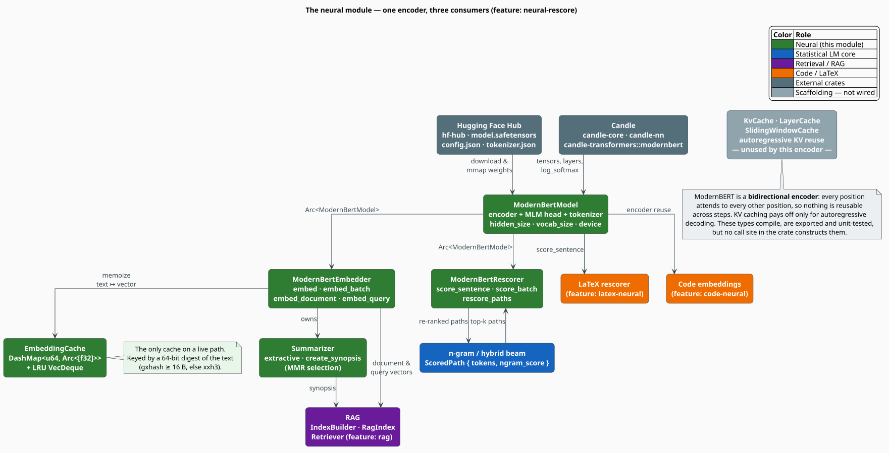

# Neural Module Overview — ModernBERT in libgrammstein

The **neural** module puts a *bidirectional transformer encoder* — [ModernBERT](https://huggingface.co/answerdotai/ModernBERT-base)
[[1]](#references) — behind four capabilities the crate's count-based core cannot provide on its
own: **rescoring** an n-gram beam by masked-LM pseudo-perplexity, **embedding** documents and
queries for retrieval, **summarizing** a document extractively, and **caching** the results of
all of the above. It is a thin, honest wrapper: libgrammstein ships no weights and trains no
transformer. You bring a checkpoint; the crate drives it through
[Candle](https://github.com/huggingface/candle).

> **Scope.** Source of truth: [`src/neural/mod.rs`](../../../src/neural/mod.rs) and its five
> siblings. Everything here is behind the `neural-rescore` Cargo feature. Deep-dives:
> [Model](model.md) · [Embedder](embedder.md) · [Rescorer](rescorer.md) ·
> [Summarizer](summarizer.md) · [Cache](cache.md).

## 1. Why an encoder next to the n-gram core

libgrammstein's default scorer is a Modified Kneser-Ney n-gram model
([Modified Kneser-Ney](../ngram/modified-kneser-ney.md)). It is fast, exact on seen contexts,
and blind past its order. An MLM encoder is the complementary instrument:

| | N-gram (MKN) | ModernBERT (MLM) |
|---|---|---|
| Context used | the previous $`n-1`$ words | the **whole sentence**, both directions, up to 8 192 tokens |
| Estimate | a true conditional probability $`\mathbb{P}(w \mid h)`$ | a **pseudo**-likelihood — see [Rescorer](rescorer.md) §2 |
| Unseen word | backs off to a lower order | sub-word tokenization keeps going |
| Cost per sentence | $`O(n)`$ trie look-ups | $`T`$ transformer forward passes for $`T`$ tokens |
| Trained here? | yes, from your corpus | **no** — bring your own checkpoint |

The two are combined, not substituted: `rescore_paths` re-ranks an n-gram beam rather than
replacing it, and the mixing weights are yours to choose. The pattern mirrors the
statistics-plus-semantics fusion already used by the [hybrid model](../hybrid/interpolation.md),
with a transformer standing in for the subword-embedding expert.

**Acronyms.** *MLM* — Masked Language Model; *PLL* — Pseudo-Log-Likelihood; *PPPL* —
Pseudo-Perplexity; *MMR* — Maximal Marginal Relevance; *RoPE* — Rotary Position Embedding;
*BPE* — Byte-Pair Encoding; *RAG* — Retrieval-Augmented Generation.

## 2. Module map

One `ModernBertModel` is loaded once, wrapped in an `Arc`, and shared — by the embedder, by the
rescorer, and (through the embedder) by the summarizer. Nothing in the module holds a second
copy of the 149 M-parameter encoder.



*Figure 1 — the neural module. Green is this module; blue is the statistical LM core that feeds
it beam paths; purple and orange are the downstream features that consume its vectors. The
KV-cache family is drawn muted because nothing constructs it — see
[§7](#7-maturity-what-is-wired-and-what-is-not).*

The public surface, exactly as re-exported by [`src/neural/mod.rs`](../../../src/neural/mod.rs):

```rust
pub use cache::{CacheConfig, EmbeddingCache, KvCache, LayerCache, SlidingWindowCache};
pub use embedder::{BatchDocumentEmbedder, DocumentEmbedding, EmbeddingConfig, ModernBertEmbedder};
pub use modernbert::{Device, ModernBertConfig, ModernBertModel};
pub use rescorer::{ModernBertRescorer, RankedPath, RescoringConfig, RescoringResult, ScoredPath};
pub use summarizer::{ScoredSentence, Summarizer, SummarizerConfig, Synopsis, SynopsisSource};

#[cfg(feature = "code-neural")]
pub mod code;                       // CodeT5+ / UniXcoder / GraphCodeBERT
```

## 3. What ModernBERT brings

ModernBERT [[1]](#references) is a 2024 redesign of the BERT [[2]](#references) encoder: RoPE
[[3]](#references) in place of learned absolute positions, GeGLU [[4]](#references) in place of
the GELU-MLP, pre-normalization, alternating local/global attention in the spirit of Longformer
[[5]](#references), and no token-type embeddings at all. The numbers below are the **base**
checkpoint's, read out of its `config.json` at load time — the crate hard-codes none of them:

| Property | ModernBERT-base | Where the crate gets it |
|---|---|---|
| Layers | 22 | `config.json` → candle's `Config::num_hidden_layers` |
| Hidden size $`H`$ | 768 | `ModernBertModel::hidden_size()` |
| Attention heads | 12 (head dim 64) | `config.json` |
| Feed-forward width | 1 152 (GeGLU) | `config.json` |
| Context length | 8 192 tokens | `ModernBertConfig::max_seq_len` |
| Vocabulary $`\lvert \mathcal{V} \rvert`$ | 50 368 (BPE [[6]](#references)) | `ModernBertModel::vocab_size()` |
| Parameters | 149 M | — |
| Objective | masked language modeling | the MLM head drives [rescoring](rescorer.md) |

The 8 192-token window is what makes the [summarizer](summarizer.md) and the RAG
[document embedder](embedder.md) practical: a whole article is one sequence, not a stitched
sliding window.

## 4. The four capabilities

### Rescoring — [`ModernBertRescorer`](rescorer.md)

Score a sentence by masking each token in turn and asking the model to predict it back. The
resulting **pseudo-perplexity** [[7]](#references) re-ranks the n-best paths of a beam:

```rust
use libgrammstein::neural::{ModernBertRescorer, RescoringConfig, ScoredPath};

let rescorer = ModernBertRescorer::new(RescoringConfig::default())?;

// Paths out of an n-gram beam. W = f64 here; any W: Clone + Into<f64> works.
let paths = vec![
    ScoredPath::new(vec!["the".into(), "quick".into(), "fox".into()], 0.62_f64),
    ScoredPath::new(vec!["teh".into(), "quick".into(), "fox".into()], 0.58_f64),
];

// Consumes the vector; returns it re-sorted by the combined score.
let ranked = rescorer.rescore_paths(paths)?;
println!("best = {}", ranked[0].text());
# Ok::<(), libgrammstein::neural::NeuralError>(())
```

### Embedding — [`ModernBertEmbedder`](embedder.md)

One pooled, optionally $`\ell_2`$-normalized vector per text, memoized in a lock-free cache:

```rust
use libgrammstein::neural::{EmbeddingConfig, ModernBertEmbedder};

let embedder = ModernBertEmbedder::new(EmbeddingConfig::default())?;

let query = embedder.embed_query("What is Kneser-Ney smoothing?")?;
let doc = embedder.embed_document(Some("Smoothing"), "Absolute discounting reserves mass…")?;

// An associated function, not a method — call it on the type.
let similarity = ModernBertEmbedder::cosine_similarity(&query, &doc);
# Ok::<(), libgrammstein::neural::NeuralError>(())
```

### Summarization — [`Summarizer`](summarizer.md)

Pick the sentences that are simultaneously *central* and *non-redundant*, by Maximal Marginal
Relevance [[8]](#references):

```rust
use libgrammstein::neural::{EmbeddingConfig, ModernBertEmbedder, Summarizer, SummarizerConfig};

let article = "Machine learning learns from data. Deep learning uses many layers. \
               GPUs made it practical.";

// A Summarizer is built *from an embedder*; there is no Summarizer::new(config).
let embedder = ModernBertEmbedder::new(EmbeddingConfig::default())?;
let summarizer = Summarizer::new(embedder, SummarizerConfig::default());

let summary = summarizer.extractive(article, Some(2))?;       // 2 sentences
let synopsis = summarizer.create_synopsis(None, article)?;    // (explicit, content)
assert!(!synopsis.is_explicit());
# Ok::<(), libgrammstein::neural::NeuralError>(())
```

### Caching — [`EmbeddingCache`](cache.md)

A `DashMap` keyed by a 64-bit digest of the text, with a mutex-guarded LRU order. It is the one
cache on a live path; the `KvCache` family is not — see
[§7](#7-maturity-what-is-wired-and-what-is-not).

## 5. Enabling the feature

`neural-rescore` pulls in Candle, the Hugging Face Hub client, and the `tokenizers` crate:

```toml
[dependencies]
libgrammstein = { path = "../libgrammstein", features = ["neural-rescore"] }
```

```toml
# Cargo.toml (libgrammstein) — the feature's exact expansion
neural-rescore = [
    "dep:candle-core", "dep:candle-nn", "dep:candle-transformers",
    "dep:tokenizers", "dep:hf-hub", "dep:serde_json",
]
```

Several higher-level features *imply* it — turning any of these on turns the neural module on:

| Feature | Uses the neural module for |
|---|---|
| `rag` / `rag-hnsw` | document and query vectors, synopsis generation |
| `latex-neural` | rescoring LaTeX candidates ([`src/latex/rescorer.rs`](../../../src/latex/rescorer.rs)) |
| `code-neural` | code embeddings (also unlocks `neural::code`) |
| `latex-ocr` | the OCR model plumbing |

> **Weights are not vendored.** `ModernBertConfig::default()` names
> `answerdotai/ModernBERT-base`, and `ModernBertModel::load` downloads it through `hf-hub` into
> the standard Hugging Face cache (`HF_HOME`, default `~/.cache/huggingface`). The first call
> therefore needs network access. For air-gapped or pinned deployments use
> `ModernBertModel::load_from_files`, which reads `model.safetensors`, `config.json` and
> `tokenizer.json` straight off disk — see [Model](model.md) §4.

## 6. Devices, threading, errors

**Devices.** `Device` is `Cpu` (the default), `Cuda(index)`, or `Metal`. `Device::to_candle()`
performs the conversion and fails with `NeuralError::DeviceNotAvailable` when the backend is
absent; the CUDA and Metal paths additionally need Candle built with those backends.

**Threading.** `ModernBertModel` lives behind an `Arc`; the embedder, rescorer and summarizer
all take `&self` on their hot paths, and `EmbeddingCache` is a `DashMap`. A single embedder can
therefore be shared across a thread pool with no external lock (see
[Threading Model](../../architecture/threading.md)):

```rust
use std::sync::Arc;
use libgrammstein::neural::{EmbeddingConfig, ModernBertEmbedder};

let texts: Vec<String> = vec!["first".to_string(), "second".to_string()];
let embedder = Arc::new(ModernBertEmbedder::new(EmbeddingConfig::default())?);

let handles: Vec<_> = texts
    .into_iter()
    .map(|text| {
        let embedder = Arc::clone(&embedder);
        std::thread::spawn(move || embedder.embed(&text))
    })
    .collect();

for handle in handles {
    let _vector = handle.join().expect("embedding thread panicked")?;
}
# Ok::<(), libgrammstein::neural::NeuralError>(())
```

**Errors.** Every entry point returns `neural::Result<T>`, an alias for
`std::result::Result<T, NeuralError>`:

| Variant | Raised when |
|---|---|
| `ModelLoad(String)` | the Hub download failed, or `config.json` did not deserialize |
| `Tokenization(String)` | the tokenizer failed, or the vocabulary has no `[MASK]` |
| `Inference(String)` | a layer index was out of range (KV cache) |
| `DeviceNotAvailable(String)` | CUDA or Metal was requested but is not present |
| `Io(std::io::Error)` | reading a local model file failed |
| `Candle(String)` | any `candle_core::Error`, through a blanket `From` impl |

`NeuralError` folds into the crate-wide error as `libgrammstein::Error::Neural` — see
[Errors](../../api/errors.md).

## 7. Maturity: what is wired, and what is not

This module was built ahead of some of its consumers. The table is the honest state of the code
as it stands; read it before you design against a type.

| Item | State |
|---|---|
| `ModernBertModel` | **Live.** Encoder plus MLM head; loads from the Hub or from local files. |
| `ModernBertEmbedder` | **Live.** Consumed by [RAG](../rag/builder.md) and by [code embeddings](../code-embeddings/overview.md). |
| `ModernBertRescorer` | **Live.** Consumed by the [LaTeX rescorer](../latex/rescorer.md). |
| `Summarizer` | **Live.** Consumed by the RAG index builder. |
| `EmbeddingCache` | **Live.** Backs the embedder. |
| `PoolingStrategy::MaxPooling` | **Not implemented.** Silently falls back to mean pooling. |
| `PoolingStrategy` (the type) | **Unreachable downstream.** It is `pub` inside a private module and is not re-exported, so an external crate cannot name it; you get `EmbeddingConfig::default()`'s `Cls` unless the crate is patched. |
| `RescoringResult`, `RankedPath` | **Declared, never constructed.** Nothing in the crate produces one; `rescore_paths` returns a plain `Vec<ScoredPath<W>>`. |
| `ScoredSentence` | **Declared, never constructed.** The summarizer scores tuples internally. |
| `KvCache`, `LayerCache`, `SlidingWindowCache`, `CacheConfig` | **Scaffolding.** Compiled, exported and unit-tested, but nothing constructs them, and `ModernBertModel::forward` never consults a KV cache — a bidirectional encoder has nothing to reuse across steps. See [Cache](cache.md) §5. |
| MMR redundancy term | **Defective.** An index misalignment makes the diversity penalty compare the wrong vectors; the relevance term is unaffected. See [Summarizer](summarizer.md) §7. |

## References

1. B. Warner, A. Chaffin, B. Clavié, O. Weller, O. Hallström, S. Taghadouini, A. Gallagher,
   R. Biswas, F. Ladhak, T. Aarsen, N. Cooper, G. Adams, J. Howard & I. Poli (2024).
   *Smarter, Better, Faster, Longer: A Modern Bidirectional Encoder for Fast, Memory Efficient,
   and Long Context Finetuning and Inference.* arXiv:2412.13663.
   [doi:10.48550/arXiv.2412.13663](https://doi.org/10.48550/arXiv.2412.13663)
2. J. Devlin, M.-W. Chang, K. Lee & K. Toutanova (2019). *BERT: Pre-training of Deep
   Bidirectional Transformers for Language Understanding.* NAACL-HLT, 4171–4186.
   [doi:10.18653/v1/N19-1423](https://doi.org/10.18653/v1/N19-1423)
3. J. Su, M. Ahmed, Y. Lu, S. Pan, W. Bo & Y. Liu (2024). *RoFormer: Enhanced Transformer with
   Rotary Position Embedding.* Neurocomputing 568, 127063.
   [doi:10.1016/j.neucom.2023.127063](https://doi.org/10.1016/j.neucom.2023.127063)
4. N. Shazeer (2020). *GLU Variants Improve Transformer.* arXiv:2002.05202.
   [doi:10.48550/arXiv.2002.05202](https://doi.org/10.48550/arXiv.2002.05202)
5. I. Beltagy, M. E. Peters & A. Cohan (2020). *Longformer: The Long-Document Transformer.*
   arXiv:2004.05150.
   [doi:10.48550/arXiv.2004.05150](https://doi.org/10.48550/arXiv.2004.05150)
6. R. Sennrich, B. Haddow & A. Birch (2016). *Neural Machine Translation of Rare Words with
   Subword Units.* ACL, 1715–1725.
   [doi:10.18653/v1/P16-1162](https://doi.org/10.18653/v1/P16-1162)
7. J. Salazar, D. Liang, T. Q. Nguyen & K. Kirchhoff (2020). *Masked Language Model Scoring.*
   ACL, 2699–2712. arXiv:1910.14659.
   [doi:10.18653/v1/2020.acl-main.240](https://doi.org/10.18653/v1/2020.acl-main.240)
8. J. Carbonell & J. Goldstein (1998). *The use of MMR, diversity-based reranking for reordering
   documents and producing summaries.* SIGIR '98, 335–336.
   [doi:10.1145/290941.291025](https://doi.org/10.1145/290941.291025)

## See also

- [Model](model.md) — the ModernBERT wrapper: loading, tokenizing, the two exits
- [Rescorer](rescorer.md) — pseudo-perplexity and beam re-ranking
- [Embedder](embedder.md) — pooling, normalization, batching
- [Summarizer](summarizer.md) — centroid relevance and MMR
- [Cache](cache.md) — the embedding cache, and the inert KV-cache family
- [RAG Overview](../rag/overview.md) — the module's largest consumer
- [Neural code embeddings](../code-embeddings/overview.md) — CodeT5+ / UniXcoder / GraphCodeBERT
- [Hybrid Interpolation](../hybrid/interpolation.md) — the non-neural way to fuse two experts
