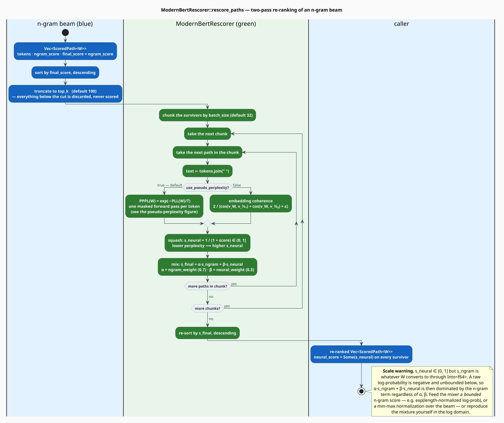
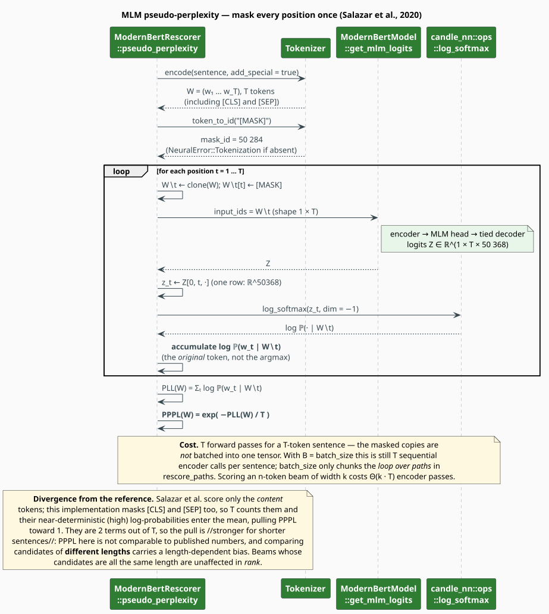

# Neural Rescoring — MLM Pseudo-Perplexity over an N-best Beam

`ModernBertRescorer` takes the n-best paths of a beam search — produced by the n-gram model, by
a WFST lattice, or by any other generator — and **re-ranks** them with a bidirectional encoder.
The neural signal is the **pseudo-perplexity** of Salazar et al. [[1]](#references): mask each
token in turn, ask the model to predict it back, and average the log-probabilities.

> **Scope.** Source of truth: [`src/neural/rescorer.rs`](../../../src/neural/rescorer.rs).
> Feature: `neural-rescore`. The encoder it drives is [Model](model.md); a live consumer is the
> [LaTeX rescorer](../latex/rescorer.md).

## 1. Notation

| Symbol | Meaning |
|---|---|
| $`W = (w_1, \dots, w_T)`$ | the token sequence of one candidate, $`T`$ tokens including `[CLS]` and `[SEP]` |
| $`W_{\setminus t}`$ | $`W`$ with position $`t`$ replaced by the `[MASK]` token |
| $`\mathcal{V}`$ | the vocabulary; $`\mathbf{z}_t \in \mathbb{R}^{\lvert \mathcal{V} \rvert}`$ is the MLM logit row at $`t`$ |
| $`\mathrm{PLL}(W)`$ | pseudo-log-likelihood of $`W`$ |
| $`\mathrm{PPPL}(W)`$ | pseudo-perplexity of $`W`$ — **lower is better** |
| $`s_{\text{ngram}}`$, $`s_{\text{neural}}`$ | the two component scores of a path — **higher is better** |
| $`\alpha, \beta`$ | the mixing weights `ngram_weight` and `neural_weight` |
| $`k`$ | `top_k` — how many paths survive to be scored |

## 2. Why *pseudo*-perplexity

An autoregressive model factorizes a sentence exactly, so its perplexity is a genuine
likelihood. A masked LM does not: it was trained to fill in blanks, and the product of its
per-position conditionals

```math
\prod_{t=1}^{T} \mathbb{P}_{\mathrm{MLM}}\bigl(w_t \mid W_{\setminus t}\bigr)
```

is **not** a normalized distribution over sentences — each factor conditions on the *whole rest
of the sentence*, so the factors overlap rather than chain. Wang & Cho [[2]](#references) showed
the MLM nevertheless defines a coherent energy over sentences, and Salazar et al.
[[1]](#references) showed that the un-normalized quantity above, used as a *score*, is an
excellent **reranker** — competitive with, and complementary to, autoregressive LMs on ASR and
NMT n-best lists. That is precisely the use here: $`\mathrm{PPPL}`$ never has to be a
probability, only a faithful *ordering*.

The definitions:

```math
\mathrm{PLL}(W) \;=\; \sum_{t=1}^{T} \log \mathbb{P}_{\mathrm{MLM}}\bigl(w_t \mid W_{\setminus t};\ \theta\bigr) \tag{R1}
```

```math
\mathrm{PPPL}(W) \;=\; \exp\!\left(-\frac{1}{T}\,\mathrm{PLL}(W)\right) \tag{R2}
```

and the per-position term is a numerically stable log-softmax over the vocabulary axis:

```math
\log \mathbb{P}_{\mathrm{MLM}}\bigl(w_t \mid W_{\setminus t}\bigr)
\;=\; z_{t,\,w_t} \;-\; \log \sum_{v \in \mathcal{V}} \exp\bigl(z_{t,\,v}\bigr) \tag{R3}
```

$`(\mathrm{R2})`$ is a *length-normalized* quantity — the $`1/T`$ — so short and long candidates
are on comparable footing, exactly as with ordinary perplexity.

## 3. Rescoring a beam



*Figure 1 — `rescore_paths` in full. Blue is the incoming n-gram beam; green is the neural work.
Everything below the `top_k` cut is discarded and never scored.*

A path is a `ScoredPath<W>`, generic over whatever numeric type the beam carries:

```rust
pub struct ScoredPath<W> {
    pub tokens: Vec<String>,
    pub ngram_score: W,             // the beam's own score, untouched
    pub neural_score: Option<f64>,  // None until rescoring; Some(s_neural) after
    pub final_score: f64,           // = ngram_score on construction; the mix after
}

impl<W: Clone + Into<f64>> ScoredPath<W> {
    pub fn new(tokens: Vec<String>, ngram_score: W) -> Self { /* final_score = ngram_score */ }
    pub fn text(&self) -> String { self.tokens.join(" ") }
}
```

The neural score is squashed into a bounded, *higher-is-better* scale before mixing, because
$`\mathrm{PPPL} \in [1, \infty)`$ points the wrong way:

```math
s_{\text{neural}}(W) \;=\; \frac{1}{1 + \mathrm{PPPL}(W)} \;\in\; (0, 1] \tag{R4}
```

```math
s_{\text{final}}(W) \;=\; \alpha \cdot s_{\text{ngram}}(W) \;+\; \beta \cdot s_{\text{neural}}(W) \tag{R5}
```

> **Scale warning — read before choosing $`\alpha`$ and $`\beta`$.** $`(\mathrm{R4})`$ lands in
> $`(0, 1]`$, but $`s_{\text{ngram}}`$ is *whatever your `W` converts to* through `Into<f64>`.
> If you hand the beam a raw log-probability (negative, unbounded below), $`(\mathrm{R5})`$ is
> dominated by the n-gram term for **any** $`\alpha, \beta`$, and the neural signal is
> cosmetic. Feed the mixer a bounded, higher-is-better n-gram score — a length-normalized
> $`\exp(\log \mathbb{P})`$, or a min-max normalization across the beam — or do the mixing
> yourself in the log domain and hand `rescore_paths` an already-comparable scale.

## 4. Pseudo-perplexity, mechanically



*Figure 2 — scoring a single sentence. The masked copies are not batched: a $`T`$-token
sentence costs $`T`$ encoder forward passes.*

The following mirrors `ModernBertRescorer::pseudo_perplexity`.

```
function pseudo_perplexity(sentence):
    W <- model.encode(sentence)                    ▸ [CLS] … [SEP]; T = |W|
    if T == 0: return 0.0                          ▸ empty input scores 0, not NaN
    mask_id <- model.mask_token_id()               ▸ None ⟹ NeuralError::Tokenization
    total <- 0.0
    for t in 0 .. T-1:                             ▸ every position, specials included
        W_masked    <- clone(W)
        original    <- W_masked[t]
        W_masked[t] <- mask_id
        Z  <- model.get_mlm_logits(W_masked)       ▸ (1, T, |V|) — one full forward pass
        z_t <- Z[0, t, ·]                          ▸ the masked row only
        total <- total + token_log_prob(z_t, original)     ▸ (R3)
    return exp( -total / T )                       ▸ (R2)

function token_log_prob(z_t, id):                  ▸ numerically stable; no manual exp/sum
    lp <- log_softmax(z_t, dim = -1)               ▸ candle_nn::ops::log_softmax
    return lp[id] as f64
```

Two details worth naming:

1. **The original token is scored, not the argmax.** The model's *confidence in what was
   actually written* is the signal; a fluent sentence is one the model would have guessed.
2. **`log_softmax` is used rather than `softmax` + `ln`.** Subtracting the log-sum-exp keeps the
   value finite for logits that would otherwise overflow $`\exp`$; the unit test
   `test_token_log_prob_matches_log_softmax` pins this against a hand-computed stable softmax.

### Cost

```math
C\bigl(\mathrm{PPPL}(W)\bigr) \;=\; T \cdot C_{\text{fwd}}(T)
\quad\text{and, over a beam of } k \text{ paths,}\quad
C_{\text{rescore}} \;=\; \Theta\!\left(\textstyle\sum_{i=1}^{k} T_i \cdot C_{\text{fwd}}(T_i)\right) \tag{R6}
```

with $`C_{\text{fwd}}`$ from [Model](model.md) $`(\mathrm{N1})`$. This is the dominant fact about
the rescorer: a 20-token sentence is **twenty** encoder passes. `batch_size` does *not* help
here — it chunks the loop over *paths*, not the masked copies of one sentence, and
`score_batch` is a plain `map` over `score_sentence`. Budget accordingly, and lean on `top_k`.

## 5. Configuration

```rust
pub struct RescoringConfig {
    pub model_config: ModernBertConfig,  // default: ModernBERT-base on CPU, F32
    pub ngram_weight: f64,               // default: 0.7   (alpha)
    pub neural_weight: f64,              // default: 0.3   (beta)
    pub top_k: usize,                    // default: 100
    pub batch_size: usize,               // default: 32
    pub use_pseudo_perplexity: bool,     // default: true
}
```

| Knob | Effect |
|---|---|
| `top_k` | the cut. Paths ranked below $`k`$ by `final_score` are dropped **before** any encoder call — this, not `batch_size`, is the throughput lever. |
| `batch_size` | how many *paths* are processed per chunk of the loop. It does not build batched tensors. |
| `use_pseudo_perplexity` | `true` selects $`(\mathrm{R2})`$; `false` selects the embedding-coherence heuristic of §6. |
| `ngram_weight` / `neural_weight` | $`\alpha`$ and $`\beta`$ of $`(\mathrm{R5})`$. They are *not* required to sum to 1, and `set_weights` changes them at run time. |

The default is **n-gram-leaning** ($`\alpha = 0.7`$ against $`\beta = 0.3`$): the statistical
model is trusted, and the encoder is a tie-breaker. Invert it when fluency matters more than
corpus fidelity.

## 6. The alternative signal: embedding coherence

With `use_pseudo_perplexity: false`, the score becomes a cheap geometric heuristic — split the
sentence in half, embed the halves and the whole, and ask how well the whole agrees with its
parts:

```math
s_{\text{coh}}(W) \;=\; \frac{2}{\cos(\mathbf{v}_W, \mathbf{v}_{W_1}) + \cos(\mathbf{v}_W, \mathbf{v}_{W_2}) + \varepsilon},
\qquad \varepsilon = 10^{-6} \tag{R7}
```

where $`W_1, W_2`$ are the first and second halves by whitespace and $`\mathbf{v}`$ is a `[CLS]`
embedding. It costs **three** forward passes instead of $`T`$, and it is *inverted* so that —
like $`\mathrm{PPPL}`$ — lower is better, which is what makes the shared squash $`(\mathrm{R4})`$
meaningful for both branches. A single-word sentence short-circuits to $`1.0`$.

> **Be honest about what this is.** $`(\mathrm{R7})`$ is not a perplexity and has no
> probabilistic reading: it is unbounded above, it rewards sentences whose halves happen to
> embed near the whole, and it is blind to word order within a half. Use it when you need a
> fast, coarse fluency prior; use $`(\mathrm{R2})`$ when the ranking must be defensible.

## 7. Usage

```rust
use libgrammstein::neural::{ModernBertRescorer, RescoringConfig, ScoredPath};

// Fluency-leaning weights, and a tight cut for latency.
let config = RescoringConfig {
    ngram_weight: 0.4,
    neural_weight: 0.6,
    top_k: 10,
    ..Default::default()
};
let rescorer = ModernBertRescorer::new(config)?;

// Candidates from a beam. Give the mixer a *bounded* n-gram score (see the scale warning).
let paths: Vec<ScoredPath<f64>> = vec![
    ScoredPath::new(vec!["the".into(), "quick".into(), "brown".into(), "fox".into()], 0.71),
    ScoredPath::new(vec!["the".into(), "quik".into(), "brown".into(), "fox".into()], 0.68),
    ScoredPath::new(vec!["the".into(), "quick".into(), "brown".into(), "box".into()], 0.66),
];

let ranked = rescorer.rescore_paths(paths)?;   // by value; returns a re-sorted Vec

for (rank, path) in ranked.iter().enumerate() {
    println!(
        "{}. {:<28} ngram={:.3}  neural={:.3}  final={:.3}",
        rank + 1,
        path.text(),
        path.ngram_score,
        path.neural_score.expect("rescored paths always carry a neural score"),
        path.final_score,
    );
}
# Ok::<(), libgrammstein::neural::NeuralError>(())
```

Scoring a single sentence, or sharing one encoder with an embedder:

```rust
use std::sync::Arc;
use libgrammstein::neural::{
    EmbeddingConfig, ModernBertEmbedder, ModernBertRescorer, RescoringConfig,
};

// One 149M-parameter encoder, two consumers.
let embedder = ModernBertEmbedder::new(EmbeddingConfig::default())?;
let model: Arc<_> = embedder.model_arc();
let rescorer = ModernBertRescorer::from_model(model, RescoringConfig::default());

let pppl = rescorer.score_sentence("The quick brown fox jumps over the lazy dog.")?;
println!("pseudo-perplexity = {pppl:.2}");   // lower is more fluent
# Ok::<(), libgrammstein::neural::NeuralError>(())
```

## 8. Limitations

| Limitation | Detail |
|---|---|
| Special tokens are scored | `encode` adds `[CLS]`/`[SEP]` and the loop masks *every* position, so those two near-deterministic predictions enter the mean of $`(\mathrm{R2})`$. $`\mathrm{PPPL}`$ is therefore biased toward $`1`$, more so for short sentences (they are 2 terms out of $`T`$), and is **not** comparable to published numbers. Ranking within a beam of equal-length candidates is unaffected. Salazar et al. exclude them. |
| No batched masking | The $`T`$ masked copies of a sentence are $`T`$ separate forward passes; they could be one $`T \times T`$ batch. This is the single largest available speed-up. |
| `score_batch` is sequential | It is `sentences.iter().map(score_sentence).collect()` — no tensor batching. |
| Scale mismatch | See the warning in §3: $`s_{\text{ngram}}`$ is not normalized by the rescorer. |
| `RescoringResult` / `RankedPath` | Exported, documented, and **never constructed** by any code path. `rescore_paths` returns `Vec<ScoredPath<W>>`; treat those two structs as a reserved shape, not an API. |
| Superseded proxy | An earlier `token_probability_proxy` (an $`\ell_2`$-norm-of-hidden-state stand-in used before the MLM head existed) remains commented out in the source per the project's no-delete policy. It is not reachable. |

## References

1. J. Salazar, D. Liang, T. Q. Nguyen & K. Kirchhoff (2020). *Masked Language Model Scoring.*
   ACL, 2699–2712. arXiv:1910.14659.
   [doi:10.18653/v1/2020.acl-main.240](https://doi.org/10.18653/v1/2020.acl-main.240)
2. A. Wang & K. Cho (2019). *BERT has a Mouth, and It Must Speak: BERT as a Markov Random Field
   Language Model.* NeuralGen workshop. arXiv:1902.04094.
   [doi:10.48550/arXiv.1902.04094](https://doi.org/10.48550/arXiv.1902.04094)
3. B. Warner et al. (2024). *Smarter, Better, Faster, Longer: A Modern Bidirectional Encoder for
   Fast, Memory Efficient, and Long Context Finetuning and Inference.* arXiv:2412.13663.
   [doi:10.48550/arXiv.2412.13663](https://doi.org/10.48550/arXiv.2412.13663)
4. J. Devlin, M.-W. Chang, K. Lee & K. Toutanova (2019). *BERT: Pre-training of Deep
   Bidirectional Transformers for Language Understanding.* NAACL-HLT, 4171–4186.
   [doi:10.18653/v1/N19-1423](https://doi.org/10.18653/v1/N19-1423)

## See also

- [Model](model.md) — `get_mlm_logits`, the exit this document consumes
- [Neural Overview](overview.md) — where the rescorer sits, and what is not wired
- [Modified Kneser-Ney](../ngram/modified-kneser-ney.md) — the model that produces the beam
- [Hybrid Interpolation](../hybrid/interpolation.md) — mixing two experts *inside* the LM instead
- [LaTeX Rescorer](../latex/rescorer.md) — a live consumer, with a non-neural fallback
