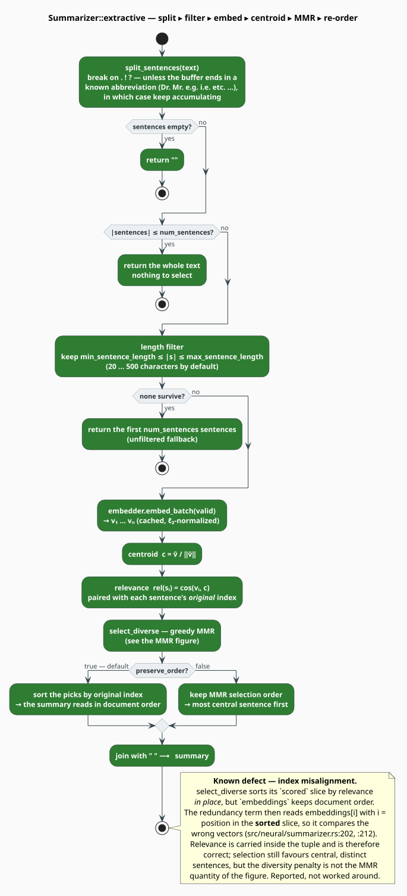
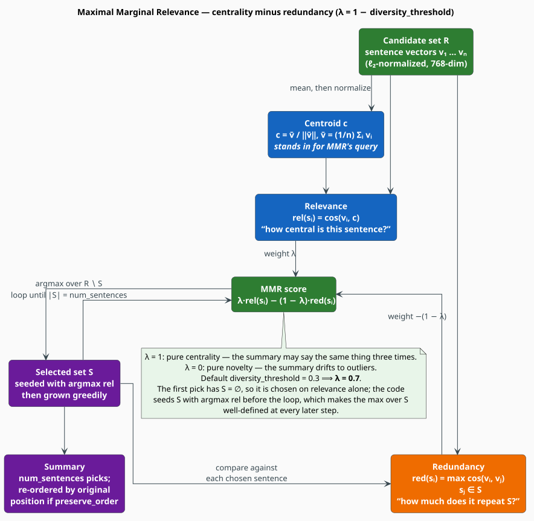

# Extractive Summarization — Centroid Relevance and MMR

`Summarizer` builds a synopsis by **selecting** sentences, never by generating them. It embeds
every candidate sentence, measures each one's *centrality* against the document centroid, and
then picks greedily under a **Maximal Marginal Relevance** objective [[1]](#references) so the
chosen sentences do not all say the same thing.

> **Scope.** Source of truth: [`src/neural/summarizer.rs`](../../../src/neural/summarizer.rs).
> Feature: `neural-rescore`. It embeds through [`ModernBertEmbedder`](embedder.md) and is
> consumed by the [RAG index builder](../rag/builder.md).

## 1. Notation

| Symbol | Meaning |
|---|---|
| $`D = (s_1, \dots, s_n)`$ | the document's candidate sentences, in document order |
| $`\mathbf{v}_i \in \mathbb{R}^{H}`$ | the embedding of sentence $`s_i`$ ($`H = 768`$, $`\ell_2`$-normalized) |
| $`\bar{\mathbf{v}}`$, $`\mathbf{c}`$ | the mean of the $`\mathbf{v}_i`$, and its normalization — the **centroid** |
| $`S`$ | the set of already-selected sentences; $`R \setminus S`$ are the candidates left |
| $`\lambda`$ | the MMR trade-off, $`\lambda \in [0, 1]`$ |
| $`\delta`$ | the `diversity_threshold` config field; $`\lambda = 1 - \delta`$ |
| $`m`$ | `num_sentences` — how many sentences the summary keeps |

## 2. Extractive, and why

*Abstractive* summarization writes new sentences and can hallucinate; *extractive*
summarization can only quote. For a retrieval index — the summarizer's actual job here, where a
synopsis is shown to a user as evidence for a hit — the extractive guarantee (**every word in
the summary appears in the document**) is worth more than fluency. The classical instantiation is
centroid-based [[2]](#references): treat the document's mean vector as its "topic", and keep the
sentences nearest to it.

Centrality alone, however, is degenerate: the three sentences nearest the centroid are usually
near *each other*, and the summary repeats itself. MMR is the fix.

## 3. The pipeline



*Figure 1 — `extractive`, including both short-circuits and the length filter. The selection
step is expanded in Figure 2.*

### Splitting

`split_sentences` breaks on `.`, `!` and `?`, but suppresses the break when the buffer ends in a
known abbreviation — a 30-entry list (`mr.`, `dr.`, `e.g.`, `i.e.`, `etc.`, `vs.`, `fig.`,
`approx.`, …). On a suppressed break the buffer keeps accumulating, so *"Dr. Smith arrived."*
stays one sentence. This is a lexical heuristic, not a sentence tokenizer: decimals (*"3.14"*),
ellipses and unlisted abbreviations will still split.

### Filtering and the short-circuits

Two exits happen before any encoder call:

- $`n = 0`$ → the empty string;
- $`n \leq m`$ → the whole text, joined (nothing to select).

Then sentences outside `[min_sentence_length, max_sentence_length]` — 20 to 500 **characters**
by default — are dropped. If *nothing* survives the filter, the summarizer falls back to the
first $`m`$ sentences unfiltered rather than returning nothing.

## 4. The MMR objective



*Figure 2 — the objective. Relevance pulls toward the centroid (blue); redundancy pushes away
from what is already chosen (orange).*

The centroid, and each sentence's relevance to it:

```math
\bar{\mathbf{v}} = \frac{1}{n}\sum_{i=1}^{n} \mathbf{v}_i,
\qquad
\mathbf{c} = \frac{\bar{\mathbf{v}}}{\lVert \bar{\mathbf{v}} \rVert_2},
\qquad
\operatorname{rel}(s_i) = \cos(\mathbf{v}_i, \mathbf{c}) \tag{S1}
```

Carbonell & Goldstein's MMR [[1]](#references) then selects greedily, trading relevance against
redundancy:

```math
\operatorname{MMR}(s_i) \;=\; \lambda \cdot \operatorname{rel}(s_i)
\;-\; (1 - \lambda) \cdot \max_{s_j \in S} \cos(\mathbf{v}_i, \mathbf{v}_j) \tag{S2}
```

```math
s^{\ast} \;=\; \operatorname*{arg\,max}_{s_i \in R \setminus S} \operatorname{MMR}(s_i),
\qquad S \leftarrow S \cup \{ s^{\ast} \} \quad\text{until}\quad \lvert S \rvert = m \tag{S3}
```

The original formulation scores relevance against a **query**; with no query to speak of, the
document centroid $`\mathbf{c}`$ takes its place — the standard reduction of MMR to *generic*
(query-free) summarization.

The trade-off knob is inverted in the config: the field is a *diversity* threshold, so

```math
\lambda \;=\; 1 - \delta, \qquad \delta = \texttt{diversity\_threshold} \tag{S4}
```

| `diversity_threshold` $`\delta`$ | $`\lambda`$ | Behavior |
|---|---|---|
| `0.0` | 1.0 | pure centrality — the summary may repeat itself |
| `0.3` (**default**) | 0.7 | centrality-leaning, with a real redundancy penalty |
| `0.5` | 0.5 | relevance and novelty weighted equally |
| `1.0` | 0.0 | pure novelty — the summary drifts to outliers |

**The first pick is special.** With $`S = \varnothing`$ the maximum in $`(\mathrm{S2})`$ is over
an empty set. The implementation sidesteps this by seeding $`S`$ with the most relevant sentence,
$`\operatorname*{arg\,max}_i \operatorname{rel}(s_i)`$, *before* the loop begins — so every
subsequent evaluation of $`(\mathrm{S2})`$ has a non-empty $`S`$ and is well-defined.

### Ordering the output

With `preserve_order: true` (the default) the picks are re-sorted by their **original document
index**, so the summary reads in narrative order. With `false` they stay in MMR selection order —
most central sentence first.

## 5. The algorithm, literately

Mirrors `Summarizer::extractive` and `Summarizer::select_diverse`.

```
function extractive(text, num):
    m         <- num or config.num_sentences
    sentences <- split_sentences(text)                  ▸ abbreviation-aware
    if sentences is empty:      return ""
    if |sentences| <= m:        return join(sentences)  ▸ nothing to select
    valid <- [ (i, s) for (i, s) in sentences if min_len <= |s| <= max_len ]
    if valid is empty:          return join(first m sentences)

    V <- embedder.embed_batch(texts of valid)           ▸ cached, ℓ2-normalized
    c <- normalize(mean(V))                             ▸ (S1)
    scored <- [ (i, s, cos(V[j], c)) for j, (i, s) in valid ]      ▸ relevance

    picks <- select_diverse(scored, V, m)               ▸ (S2), (S3)
    idx   <- [ i for (i, _, _) in picks ]
    if preserve_order: sort(idx)                        ▸ narrative order
    return join(sentences[i] for i in idx)

function select_diverse(scored, V, m):
    sort scored by relevance, descending                ▸ ⚠ see §7 — this permutes `scored`
    S <- [ scored[0] ]                                  ▸ seed with the most central sentence
    while |S| < m and |S| < |scored|:
        best <- argmax over candidates not in S of:
                    λ · relevance  −  (1 − λ) · max cos(v_candidate, v_selected)
        if no candidate: break
        S <- S + [best]
    return S
```

## 6. Usage

```rust
use libgrammstein::neural::{
    EmbeddingConfig, ModernBertEmbedder, Summarizer, SummarizerConfig,
};

// A Summarizer is constructed FROM an embedder; `new` is infallible and takes both.
let embedder = ModernBertEmbedder::new(EmbeddingConfig::default())?;
let summarizer = Summarizer::new(embedder, SummarizerConfig::default());

let article = "Machine learning is a subfield of artificial intelligence. \
               It lets programs improve from data rather than explicit rules. \
               Deep learning, a further subfield, uses many-layered networks. \
               GPUs made training those networks practical at scale.";

// `None` means "use config.num_sentences" (3).
let summary = summarizer.extractive(article, Some(2))?;
println!("{summary}");
# Ok::<(), libgrammstein::neural::NeuralError>(())
```

Sharing an existing encoder instead of loading a second one:

```rust
use std::sync::Arc;
use libgrammstein::neural::{ModernBertModel, ModernBertConfig, Summarizer, SummarizerConfig};

let model = Arc::new(ModernBertModel::load(ModernBertConfig::default())?);

// from_model builds an internal embedder with EmbeddingConfig::default().
let summarizer = Summarizer::from_model(model, SummarizerConfig::default())?;
# Ok::<(), libgrammstein::neural::NeuralError>(())
```

### Synopses

A `Synopsis` records **where the text came from**, which is what lets a RAG index prefer a
human-written abstract over a machine-made one:

```rust
use libgrammstein::neural::SynopsisSource;

// `summarizer` is the Summarizer built above.
let body = "The paper proves X. The proof proceeds by induction on the term structure. \
            A corollary follows for the untyped case.";

// create_synopsis(explicit, content) — the explicit synopsis comes FIRST.
let from_abstract = summarizer.create_synopsis(Some("The paper proves X."), body)?;
assert!(from_abstract.is_explicit());
assert_eq!(from_abstract.source, SynopsisSource::Explicit);

let generated = summarizer.create_synopsis(None, body)?;   // falls back to extractive
assert_eq!(generated.source, SynopsisSource::Generated);   // the Default variant
# Ok::<(), libgrammstein::neural::NeuralError>(())
```

`Synopsis` and `SynopsisSource` both derive `Serialize`/`Deserialize`, so a synopsis survives a
round-trip through a serialized index.

### Configuration

```rust
pub struct SummarizerConfig {
    pub num_sentences: usize,       // default: 3
    pub min_sentence_length: usize, // default: 20  (characters)
    pub max_sentence_length: usize, // default: 500 (characters)
    pub preserve_order: bool,       // default: true
    pub diversity_threshold: f32,   // default: 0.3  → lambda = 0.7
}
```

## 7. Limitations

### The redundancy term compares the wrong vectors — a known defect

`select_diverse` sorts its `scored` slice **in place** by relevance, but the parallel
`embeddings` slice is left in document order. The loop then indexes `embeddings[i]` with `i` =
the candidate's position in the *sorted* slice, and resolves each already-selected sentence with
`scored.iter().position(…)` — again a **sorted** position — before indexing `embeddings` with it.
After the sort, position $`i`$ in `scored` and position $`i`$ in `embeddings` are no longer the
same sentence.

- **Where.** [`src/neural/summarizer.rs`](../../../src/neural/summarizer.rs), `select_diverse`,
  the `embeddings[i]` at line 202 and the `position(…)` at line 212.
- **Effect.** The relevance term of $`(\mathrm{S2})`$ is carried inside the tuple and is
  therefore *correct*. The redundancy term is evaluated on a permuted pairing, so it is not the
  $`\max_{s_j \in S} \cos(\mathbf{v}_i, \mathbf{v}_j)`$ of the formula. Selection still favors
  central sentences and still returns $`m`$ **distinct** sentences (membership is tracked by the
  original index, which is correct), so output remains plausible — which is exactly why the
  defect is easy to miss.
- **Also.** The `position(…)` scan inside the inner loop makes selection
  $`O(m \cdot n^{2})`$ where an aligned implementation is $`O(m \cdot n \cdot H)`$.
- **Status.** Reported, not worked around: fixing it means editing `src/`, which this
  documentation pass does not do. Until it is fixed, treat `diversity_threshold` as a knob with
  a *directionally* correct but quantitatively wrong effect.

### Other limitations

| Limitation | Detail |
|---|---|
| Sentence splitting is lexical | Decimals, ellipses and unlisted abbreviations split incorrectly. The abbreviation list is English-only. |
| Length filter is in characters | `min`/`max_sentence_length` count `char`s via `str::len()` — i.e. **bytes** — so the effective threshold is stricter for multi-byte scripts. |
| `ScoredSentence` is never constructed | The struct is exported but the implementation scores anonymous tuples; treat it as a reserved shape. |
| No redundancy against the *query* | This is generic (query-free) summarization: $`\mathbf{c}`$ replaces MMR's query. There is no API to summarize *with respect to* a query. |
| Cost | $`n`$ sentence embeddings, cached, plus an $`O(m \cdot n^2)`$ selection. The encoder passes dominate for a cold cache. |

An alternative worth knowing: graph-centrality methods such as LexRank [[3]](#references) rank
sentences by eigenvector centrality in a similarity graph instead of by distance to a centroid.
They are more robust on multi-topic documents, at the cost of an $`O(n^2)`$ similarity matrix
and a power iteration.

## References

1. J. Carbonell & J. Goldstein (1998). *The use of MMR, diversity-based reranking for reordering
   documents and producing summaries.* SIGIR '98, 335–336.
   [doi:10.1145/290941.291025](https://doi.org/10.1145/290941.291025)
2. D. R. Radev, H. Jing, M. Styś & D. Tam (2004). *Centroid-based summarization of multiple
   documents.* Information Processing & Management 40(6), 919–938.
   [doi:10.1016/j.ipm.2003.10.006](https://doi.org/10.1016/j.ipm.2003.10.006)
3. G. Erkan & D. R. Radev (2004). *LexRank: Graph-based Lexical Centrality as Salience in Text
   Summarization.* Journal of Artificial Intelligence Research 22, 457–479.
   [doi:10.1613/jair.1523](https://doi.org/10.1613/jair.1523)
4. N. Reimers & I. Gurevych (2019). *Sentence-BERT: Sentence Embeddings using Siamese
   BERT-Networks.* EMNLP-IJCNLP, 3982–3992. arXiv:1908.10084.
   [doi:10.18653/v1/D19-1410](https://doi.org/10.18653/v1/D19-1410)

## See also

- [Embedder](embedder.md) — the vectors the summarizer selects over
- [Neural Overview](overview.md) — the module map and the maturity table
- [RAG Builder](../rag/builder.md) — the consumer that turns synopses into index entries
- [Topic Modeling](../topic/overview.md) — clustering documents rather than sentences
- [Cache](cache.md) — why a second pass over the same document is nearly free
