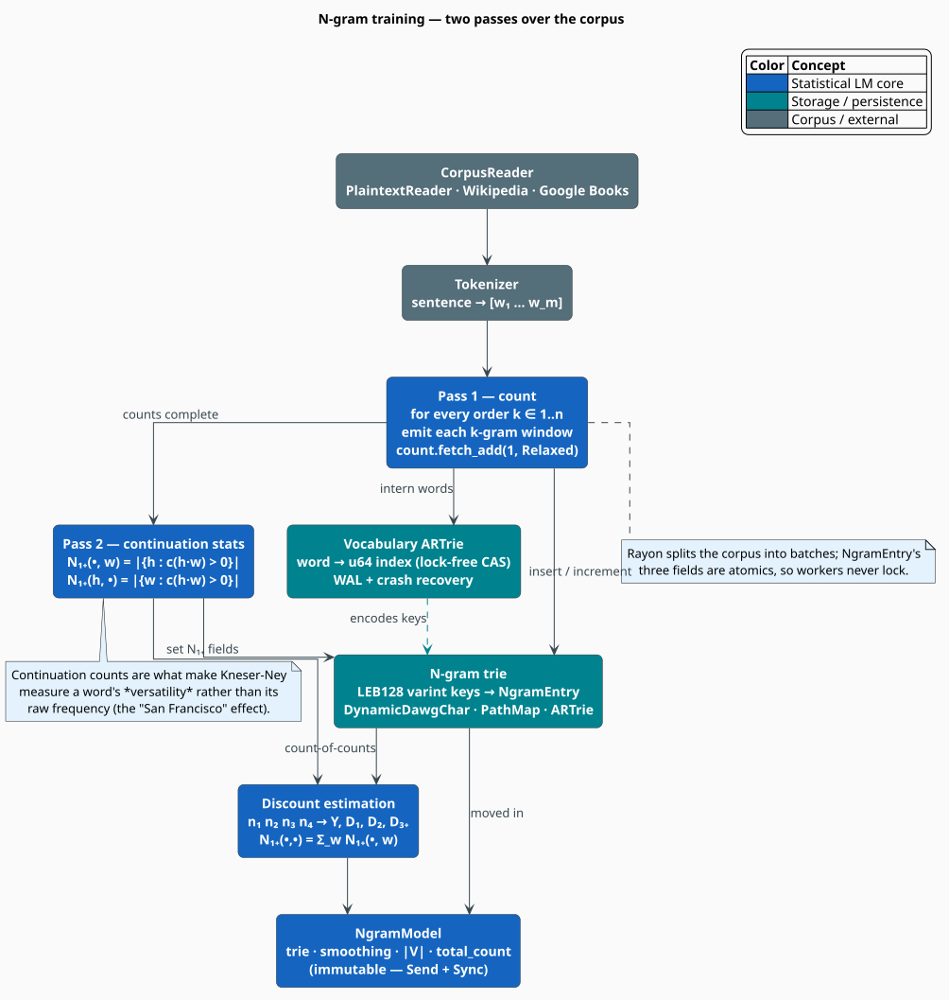

# N-gram Language Models

The **n-gram model** is libgrammstein's statistical core: it estimates how probable a word is
given the words immediately before it, by counting word sequences in a training corpus. It is the
oldest idea in language modelling [[1]](#references) and still the most useful one when you need
*calibrated* probabilities, *transparent* provenance, and *microsecond* queries. This document
explains *what* an n-gram model is, the *mathematics* that makes counting tractable, and *how
libgrammstein trains and stores one*.

> **Scope.** Source of truth: [`src/ngram/mod.rs`](../../../src/ngram/mod.rs),
> [`src/ngram/model.rs`](../../../src/ngram/model.rs), and
> [`src/ngram/trainer.rs`](../../../src/ngram/trainer.rs). Smoothing is covered in depth by
> [Modified Kneser-Ney](modified-kneser-ney.md), physical storage by
> [Trie Storage](trie-storage.md), and the read surface by [Query API](query-api.md). This model
> is the n-gram half of the [Hybrid Model](../hybrid/interpolation.md).

## Notation

Every symbol is defined before it is used in a formula.

| Symbol | Meaning |
|---|---|
| $`w`$ | a word (token) |
| $`w_i`$ | the $`i`$-th token of a sentence |
| $`h`$ | the *history* (context) preceding a word |
| $`n`$ | the model **order** — the maximum number of tokens in a stored n-gram |
| $`m`$ | the number of tokens in a sentence |
| $`V`$ | the vocabulary (set of distinct words); $`\lvert V \rvert`$ its size |
| $`c(x)`$ | raw training count of the token sequence $`x`$ |
| $`h\,w`$ | the sequence $`h`$ with $`w`$ appended |
| $`\mathbb{P}(w \mid h)`$ | probability of $`w`$ given history $`h`$ |
| $`n_i`$ | the *count-of-counts* — how many n-grams occur exactly $`i`$ times |
| $`N_{1+}(\bullet, w)`$ | *continuation count* — number of distinct contexts preceding $`w`$ |
| $`N_{1+}(h, \bullet)`$ | number of distinct words following $`h`$ |
| $`\mathrm{PP}`$ | perplexity |

**Acronyms.** *LM* — Language Model; *MLE* — Maximum-Likelihood Estimate; *MKN* — Modified
Kneser-Ney; *OOV* — Out-Of-Vocabulary; *WAL* — Write-Ahead Log.

## The problem: the chain rule does not fit in a corpus

The probability of a sentence factorizes exactly, with no approximation, by the **chain rule of
probability**:

```math
\begin{array}{lr}
\displaystyle \mathbb{P}(w_1 \dots w_m) = \prod_{i=1}^{m} \mathbb{P}\bigl(w_i \mid w_1 \dots w_{i-1}\bigr) & \text{(N1)}
\end{array}
```

$`(\mathrm{N1})`$ is useless as it stands. The final factor conditions on an *entire* preceding
sentence; to estimate it by counting we would need to have seen that exact sentence, and the number
of possible histories grows as $`\lvert V \rvert^{\,i-1}`$. No corpus is large enough — most
histories occur **zero** times.

The **Markov assumption** rescues it: assume a word depends only on the $`n-1`$ words before it,
and truncate the history.

```math
\begin{array}{lr}
\displaystyle \mathbb{P}\bigl(w_i \mid w_1 \dots w_{i-1}\bigr) \;\approx\; \mathbb{P}\bigl(w_i \mid w_{i-n+1} \dots w_{i-1}\bigr) & \text{(N2)}
\end{array}
```

This is the *only* approximation in the model, and it is the one that makes it work: there are far
fewer distinct $`n`$-token windows than distinct sentences, so counts become dense enough to
estimate. Substituting $`(\mathrm{N2})`$ into $`(\mathrm{N1})`$ gives the model libgrammstein
implements. An order-$`n`$ model therefore stores every sequence of length $`1`$ through $`n`$:

| Order | Name | Stored sequence | Conditions on |
|---|---|---|---|
| 1 | unigram | *fox* | nothing |
| 2 | bigram | *brown fox* | 1 word |
| 3 | trigram | *quick brown fox* | 2 words |
| 4 | 4-gram | *the quick brown fox* | 3 words |
| 5 | 5-gram | *the quick brown fox jumps* | 4 words |

libgrammstein supports orders $`1 \le n \le 5`$; $`n = 5`$ is the `TrainingConfig` default.

### Counting, and why counting alone fails

The **Maximum-Likelihood Estimate** is the obvious estimator — divide the count of the full n-gram
by the count of its context:

```math
\begin{array}{lr}
\displaystyle \mathbb{P}_{\mathrm{MLE}}(w \mid h) = \frac{c(h\,w)}{c(h)} & \text{(N3)}
\end{array}
```

$`(\mathrm{N3})`$ assigns probability **zero** to every n-gram absent from training. Because
$`(\mathrm{N1})`$ *multiplies* the per-token probabilities, a single unseen n-gram drives the whole
sentence to $`\mathbb{P} = 0`$, i.e. $`\log \mathbb{P} = -\infty`$. Since a corpus never contains
every valid n-gram, an unsmoothed model rejects most grammatical sentences. *Smoothing* fixes this
by moving a little probability mass from seen events to unseen ones; libgrammstein's always-on
smoother is **Modified Kneser-Ney**, described [below](#smoothing-modified-kneser-ney) and in full
in [Modified Kneser-Ney](modified-kneser-ney.md).

### Perplexity: how a model is judged

Models are compared by **perplexity** — the exponentiated per-token cross-entropy, interpretable as
the average number of equally-likely choices the model faces at each token. Lower is better.

```math
\begin{array}{lr}
\displaystyle \mathrm{PP}(w_1 \dots w_m) = \exp\!\left(-\frac{1}{m} \sum_{i=1}^{m} \log \mathbb{P}\bigl(w_i \mid w_{i-n+1} \dots w_{i-1}\bigr)\right) & \text{(N4)}
\end{array}
```

Note that $`(\mathrm{N4})`$ **sums logarithms** rather than multiplying probabilities. This is not a
cosmetic choice: a 30-token sentence multiplies 30 numbers each far below $`1`$, which underflows
`f64`. libgrammstein therefore works in log-space everywhere — every public scorer returns a
*log*-probability. See [`Perplexity`](../../../src/scoring/perplexity.rs) and
[Query API](query-api.md#perplexity).

## Training: two passes over the corpus



Training is a **counting** problem, not an optimization problem: there is no gradient descent and
no loss to minimize, so a corpus needs exactly two passes.

**Pass 1 — count.** Slide a window over every sentence and increment the count of every n-gram of
every order $`1 \le k \le n`$. Rayon splits the corpus into batches
(`TrainingConfig::batch_size`, default $`10\,000`$) and workers increment
[`NgramEntry`](../../../src/ngram/entry.rs) counters *concurrently*; because those counters are
atomics, no worker ever takes a lock.

**Pass 2 — continuation statistics.** Kneser-Ney does not back off on raw frequency but on
*versatility*, so a second sweep derives two statistics per entry:

```math
\begin{array}{lr}
\displaystyle N_{1+}(\bullet, w) = \bigl\lvert \{\, h : c(h\,w) > 0 \,\} \bigr\rvert,
\qquad
N_{1+}(h, \bullet) = \bigl\lvert \{\, w : c(h\,w) > 0 \,\} \bigr\rvert & \text{(N5)}
\end{array}
```

The first counts the distinct contexts a word *completes*; the second counts the distinct words a
context *admits*. Both are stored back into the entry
(`update_continuation_count_by_key` / `update_unique_continuations_by_key`).

Finally the discounts are estimated from the **count-of-counts** $`n_1, n_2, n_3, n_4`$ and the
corpus-wide continuation denominator $`N_{1+}(\bullet, \bullet) = \sum_w N_{1+}(\bullet, w)`$ is
summed, both of which are sealed into the returned model.

### The algorithm, literately

The following mirrors [`NgramTrainer::train`](../../../src/ngram/trainer.rs). `⟨…⟩` names a
refinement expanded below; `▸` marks a side-comment. Inside pseudocode all operators are ASCII.

```
function train(reader):                                ▸ consumes the trainer, returns NgramModel
    count_ngrams(reader)                               ▸ Pass 1
    collect_continuation_counts()                      ▸ Pass 2
    smoothing <- compute_smoothing_params()
    return NgramModel::new(trie, smoothing, vocab_size, total_count)

function count_ngrams(reader):                         ▸ Pass 1 — parallel, lock-free
    for each batch of sentences in reader:             ▸ batch_size sentences per Rayon task
        parallel for each sentence in batch:
            tokens <- tokenize(sentence)
            for k in 1..=order:                        ▸ every order, not just the highest
                for each window tokens[i .. i+k]:
                    key <- ⟨encode key⟩
                    trie.insert_with_key(key)          ▸ count.fetch_add(1, Relaxed)

function collect_continuation_counts():                ▸ Pass 2 — derive the MKN statistics
    for each stored bigram (h, w):                     ▸ h is a single word here
        contexts[w].insert(h)                          ▸ distinct predecessors of w
        words[h].insert(w)                             ▸ distinct successors of h
    for each w: trie.update_continuation_count(w, |contexts[w]|)        ▸ N1+(., w)
    for each h: trie.update_unique_continuations(h, |words[h]|)         ▸ N1+(h, .)

function compute_smoothing_params():
    (n1, n2, n3, n4) <- count-of-counts over all stored n-grams
    kn <- KneserNeySmoothing::from_counts(n1, n2, n3, n4)               ▸ Y, D1, D2, D3+
    return kn.with_total_bigram_types( sum of continuation_count over unigrams )  ▸ N1+(.,.)

⟨encode key⟩ ≡
    if vocabulary_mode is Legacy:  join tokens with '|'                 ▸ deprecated, see trie-storage
    else:                          intern each token to a u64 index,    ▸ vocabulary-indexed
                                   LEB128-varint it, carry bytes as Latin-1 chars
```

**There is no `NgramModel::train`.** Training always goes through
[`TrainerBuilder`](../../../src/ngram/trainer.rs), because the model cannot be constructed without
first choosing a *dictionary backend* to store the counts in — see [Usage](#usage).

## Smoothing: Modified Kneser-Ney

Smoothing answers two questions: **how much** mass to steal from seen n-grams, and **where** to put
it. MKN subtracts a count-dependent *absolute discount* $`D(c)`$ and redistributes the freed mass to
a recursively-backed-off lower order, weighted by $`\lambda(h)`$:

```math
\begin{array}{lr}
\displaystyle \mathbb{P}_{\mathrm{MKN}}(w \mid h) =
\frac{\bigl[\,c(h\,w) - D(c(h\,w))\,\bigr]^{+}}{c(h)}
\;+\; \lambda(h)\,\mathbb{P}_{\mathrm{MKN}}(w \mid h') & \text{(N6)}
\end{array}
```

where $`[x]^{+} = \max(x, 0)`$ and $`h'`$ is $`h`$ with its **oldest** (leftmost) word removed. The
recursion peels one word per level until it bottoms out at a unigram, whose OOV branch returns the
strictly positive $`1 / \lvert V \rvert`$ — which is why $`\log \mathbb{P}`$ is *always finite* in
libgrammstein, even for a word that never appeared in training.


The lower orders use the continuation counts of $`(\mathrm{N5})`$ rather than raw counts, which is
what stops a frequent-but-inflexible word (*Francisco*, which essentially only ever follows *San*)
from outranking a versatile one (*city*) as a fallback. The three discounts, the exact backoff
weight, and the two guards that keep the logarithm finite are derived in
[Modified Kneser-Ney](modified-kneser-ney.md).

## Engineering

### The model is a trie plus four numbers

```rust
pub struct NgramModel<D>
where
    D: MappedDictionary<Value = NgramEntry>,
{
    trie: NgramTrie<D>,            // the counts, keyed by encoded n-gram
    smoothing: KneserNeySmoothing, // D1, D2, D3+, and N1+(.,.)
    vocab_size: usize,             // |V| — distinct unigrams
    total_count: u64,              // corpus size in tokens
}
```

`D` is a **type parameter**, not a concrete trie: the model is generic over any dictionary backend
that maps an encoded key to an [`NgramEntry`](../../../src/ngram/entry.rs). That is what lets the
same model type be trained in memory, memory-mapped from disk, or shared with lling-llang's lattice
— see [Trie Storage](trie-storage.md).

### Choosing a backend

| Backend | Mutable? | serde? | Use when |
|---|---|---|---|
| `DynamicDawgChar<NgramEntry>` | yes | yes | general purpose; `save`/`load` a whole model |
| `PathMapDictionary<NgramEntry>` | yes | no | lling-llang integration (shared lattice memory) |
| `SharedCharARTrie<NgramEntry>` | yes | portable only | corpora too large for RAM (WAL-backed, crash-safe) |
| `DoubleArrayTrieChar<NgramEntry>` | **no** | portable only | inference only — fastest reads, bulk-built once |

Two aliases name the common choices:
[`SerializableNgramModel`](../../../src/ngram/mod.rs) (`DynamicDawgChar`) and
[`PathMapNgramModel`](../../../src/ngram/mod.rs) (`PathMapDictionary`).

### Concurrency

`NgramEntry`'s three fields are `AtomicU64`/`AtomicU32`, so Pass 1 counts without locks. After
training the model is **immutable**: every query method takes `&self`, and the model is `Send + Sync`,
so a single instance can be scored from any number of threads. See
[Threading Model](../../architecture/threading.md).

### Complexity

Let $`n`$ be the order, $`T`$ the corpus size in tokens, and $`m`$ the length of an encoded key.

| Operation | Cost | Notes |
|---|---|---|
| Training (Pass 1) | $`O(n\,T)`$ | each token opens $`n`$ windows; parallel over batches |
| Training (Pass 2) | $`O(\lvert{\cdot}\rvert)`$ | linear in the number of stored bigrams |
| `count` | $`O(m)`$ | one trie walk |
| `log_prob` | $`O(n\,m)`$ | at most $`n`$ walks, one per backoff level |
| `sentence_log_prob` | $`O(m\,n\,\lvert w \rvert)`$ | one `log_prob` per token |

Memory is dominated by the stored n-gram types, not by the corpus: a corpus of $`T`$ tokens yields
at most $`n\,T`$ n-gram types, and in practice far fewer (Zipf's law).

## Usage

Train a 5-gram model over a plaintext corpus, then query it.

```rust
use libgrammstein::ngram::{NgramEntry, TrainerBuilder};
use libgrammstein::corpus::PlaintextReader;
use libdictenstein::dynamic_dawg::char::DynamicDawgChar;

// The backend is chosen first — the trainer counts INTO it.
let reader = PlaintextReader::from_file("corpus.txt")?;
let model = TrainerBuilder::new(DynamicDawgChar::<NgramEntry>::new())
    .order(5)
    .train(reader)?;

// Probability queries are log-space and always finite.
let log_p = model.log_prob("fox", &["the", "quick", "brown"]);
let sentence = model.sentence_log_prob(&["the", "quick", "brown", "fox"]);

println!("order={} |V|={} tokens={}", model.order(), model.vocab_size(), model.total_count());
println!("log P(fox | the quick brown) = {log_p:.3}, sentence = {sentence:.3}");
# Ok::<(), libgrammstein::Error>(())
```

To train with the **vocabulary-indexed** key encoding (recommended — it is immune to the delimiter
bug described in [Trie Storage](trie-storage.md)), give the builder a vocabulary path:

```rust
use libgrammstein::ngram::{NgramEntry, TrainerBuilder};
use libgrammstein::corpus::PlaintextReader;
use libdictenstein::dynamic_dawg::char::DynamicDawgChar;
use std::path::PathBuf;

let reader = PlaintextReader::from_file("corpus.txt")?;
let model = TrainerBuilder::new(DynamicDawgChar::<NgramEntry>::new())
    .order(5)
    .min_word_freq(2)                                   // drop hapax legomena
    .with_vocabulary_path(PathBuf::from("vocab.artrie")) // word -> u64, WAL-backed
    .train(reader)?;
# Ok::<(), libgrammstein::Error>(())
```

## Configuration

The fields of [`TrainingConfig`](../../../src/ngram/trainer.rs), with their shipped defaults.

| Parameter | Default | Effect |
|---|---|---|
| `order` | $`5`$ | maximum n-gram order $`n`$ |
| `batch_size` | $`10\,000`$ | sentences per Rayon batch |
| `min_word_freq` | $`1`$ | drop words rarer than this from $`V`$ |
| `vocabulary_mode` | `Legacy` | key encoding: `Legacy`, `Create(path)`, or `Shared(vocab)` |

> **Default caveat.** `vocabulary_mode` still defaults to `Legacy` (pipe-separated keys) for
> backward compatibility, even though that encoding is deprecated. New code should pass
> `with_vocabulary_path` or `with_vocabulary` — see [Trie Storage](trie-storage.md#the-delimiter-bug).

See [N-gram Training](../../training/ngram.md) for corpus preparation and
[Large Corpora](../../training/large-corpora.md) for the out-of-core path.

## References

1. C. E. Shannon (1948). *A mathematical theory of communication.* Bell System Technical Journal
   27(3), 379–423. [doi:10.1002/j.1538-7305.1948.tb01338.x](https://doi.org/10.1002/j.1538-7305.1948.tb01338.x)
2. F. Jelinek & R. L. Mercer (1980). *Interpolated estimation of Markov source parameters from
   sparse data.* In *Pattern Recognition in Practice*, 381–397. North-Holland.
3. R. Kneser & H. Ney (1995). *Improved backing-off for M-gram language modeling.* ICASSP '95,
   181–184. [doi:10.1109/ICASSP.1995.479394](https://doi.org/10.1109/ICASSP.1995.479394)
4. S. F. Chen & J. Goodman (1999). *An empirical study of smoothing techniques for language
   modeling.* Computer Speech & Language 13(4), 359–393.
   [doi:10.1006/csla.1999.0128](https://doi.org/10.1006/csla.1999.0128)
5. K. Heafield (2011). *KenLM: Faster and smaller language model queries.* WMT '11, 187–197.
   [aclanthology:W11-2123](https://aclanthology.org/W11-2123/)

## See also

- [Modified Kneser-Ney](modified-kneser-ney.md) — the smoothing algorithm, in full
- [Trie Storage](trie-storage.md) — key encoding and the dictionary backends
- [Query API](query-api.md) — the probability-query interface
- [N-gram Training](../../training/ngram.md) — corpus preparation and tuning
- [Hybrid Interpolation](../hybrid/interpolation.md) — fusing this model with embeddings
- [N-gram API reference](../../api/ngram.md) — the full method surface
