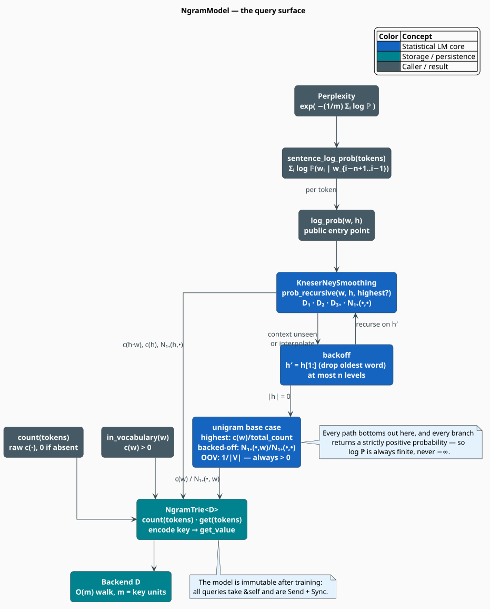

# Query API

Once trained, an [`NgramModel`](../../../src/ngram/model.rs) is an **immutable, thread-safe oracle**
answering one question in several shapes: *how probable is this word, here?* This document is the
semantics of that read surface — what each method returns, the guarantees it makes (chiefly: the
log-probability is **always finite**), what each costs, and how a model is persisted and reloaded.

> **Scope.** Source of truth: [`src/ngram/model.rs`](../../../src/ngram/model.rs),
> [`src/ngram/smoothing/kneser_ney.rs`](../../../src/ngram/smoothing/kneser_ney.rs), and
> [`src/scoring/`](../../../src/scoring/perplexity.rs). For the storage the queries walk, see
> [Trie Storage](trie-storage.md); for the smoothing they invoke, see
> [Modified Kneser-Ney](modified-kneser-ney.md). The full signature list lives in the
> [N-gram API reference](../../api/ngram.md).

## Notation

Every symbol is defined before it is used in a formula.

| Symbol | Meaning |
|---|---|
| $`w`$ | the word whose probability is queried |
| $`h`$ | the *history* (context) — the words preceding $`w`$; $`\lvert h \rvert`$ its length |
| $`n`$ | the model order (`NgramModel::order`) |
| $`m`$ | the number of tokens in a sentence |
| $`w_i`$ | the $`i`$-th token of a sentence, $`1 \le i \le m`$ |
| $`V`$ | the vocabulary; $`\lvert V \rvert`$ its size (`vocab_size`) |
| $`T`$ | the corpus size in tokens (`total_count`) |
| $`c(x)`$ | raw training count of the sequence $`x`$ |
| $`\mathbb{P}_{\mathrm{MKN}}`$ | the Modified Kneser-Ney probability |
| $`\mathrm{PP}`$ | perplexity |
| $`\ell`$ | the length of an encoded trie key, in characters |

**Acronyms.** *MKN* — Modified Kneser-Ney; *OOV* — Out-Of-Vocabulary; *DAT* — Double-Array Trie.

## The surface



Every method takes `&self`. Nothing in the query path mutates the model, allocates a vocabulary
index, or takes a lock.

| Method | Returns | Meaning |
|---|---|---|
| `log_prob(word, context)` | `f64` | $`\log \mathbb{P}_{\mathrm{MKN}}(w \mid h)`$ — **always finite** |
| `sentence_log_prob(tokens)` | `f64` | $`\sum_i \log \mathbb{P}(w_i \mid h_i)`$ with a sliding context |
| `count(tokens)` | `u64` | raw $`c(\cdot)`$; $`0`$ if the n-gram was never seen |
| `in_vocabulary(word)` | `bool` | whether $`c(w) > 0`$ |
| `oov_log_prob()` | `f64` | $`-\log \lvert V \rvert`$ — the uniform OOV floor |
| `order()` | `usize` | the model order $`n`$ |
| `vocab_size()` | `usize` | $`\lvert V \rvert`$ |
| `total_count()` | `u64` | $`T`$ |
| `ngram_count()` | `usize` | number of stored n-gram *types* |
| `smoothing()` | `&KneserNeySmoothing` | the fitted discounts and $`N_{1+}(\bullet,\bullet)`$ |
| `trie()` | `&NgramTrie<D>` | escape hatch to the raw storage |

### `log_prob` — the primitive

`log_prob` is the one operation everything else is built from. It returns a **natural** logarithm
(base $`e`$), and the context is ordered oldest-first, so the word nearest to $`w`$ is the *last*
element of the slice:

```rust
// P(fox | quick brown) — "brown" is adjacent to "fox"
let log_p = model.log_prob("fox", &["quick", "brown"]);

// P(the) — an empty context is a legal unigram query
let log_p_uni = model.log_prob("the", &[]);
```

A context longer than $`n - 1`$ is *not* rejected: the MKN recursion simply backs off through the
extra levels, so passing a full sentence prefix to a trigram model is well-defined (it is
equivalent to passing only the last two words, modulo the backoff path taken).

### The finiteness guarantee

This is the single most important property of the query API, and it is worth stating precisely.

> **Guarantee.** For every string $`w`$ and every context $`h`$,
> $`\mathbb{P}_{\mathrm{MKN}}(w \mid h) > 0`$, hence $`\log \mathbb{P}`$ is finite —
> never $`-\infty`$, never `NaN`.

*Why it holds.* The recursion in
[`prob_recursive`](../../../src/ngram/smoothing/kneser_ney.rs) shortens the history by one word per
level and therefore always terminates at the unigram base case. Both branches of that base case
return a strictly positive number: a seen word yields $`c(w)/T > 0`$ (or its continuation-count
analogue), and an **unseen** word falls to the uniform floor

```math
\mathbb{P}(w) = \frac{1}{\lvert V \rvert} > 0
\qquad\Longleftrightarrow\qquad
\texttt{oov_log_prob()} = -\log \lvert V \rvert \tag{Q1}
```

Two further guards protect the interpolated levels above the base case: an unseen n-gram substitutes
$`D_1`$ for its (zero) discount so that backoff mass is still reserved, and a degenerate
$`p \le 0`$ falls through to the strictly positive backoff term. Both are explained in
[Modified Kneser-Ney](modified-kneser-ney.md#engineering).

*Why it matters.* Callers may take the logarithm without a guard, and downstream consumers — WFST
weights in particular, which reject a non-finite weight with a panic — can trust the number. The
regression test `test_log_prob_finite_for_unseen_ngrams` pins the guarantee for an unseen bigram, an
unseen trigram, an OOV word, and even the **empty string** as a candidate word.

The one degenerate case: `oov_log_prob()` returns `f64::NEG_INFINITY` when $`\lvert V \rvert = 0`$,
i.e. for a model trained on an empty corpus. A model with a vocabulary is always safe.

## Scoring a sentence

`sentence_log_prob` slides an $`(n-1)`$-word window along the tokens and sums the per-token
log-probabilities. For token $`i`$ the context is the preceding $`n-1`$ tokens, truncated at the
start of the sentence:

```math
h_i = w_{\max(1,\, i-n+1)} \dots w_{i-1},
\qquad
\log \mathbb{P}(w_1 \dots w_m) = \sum_{i=1}^{m} \log \mathbb{P}\bigl(w_i \mid h_i\bigr) \tag{Q2}
```

The $`\max(1, \cdot)`$ is `i.saturating_sub(order - 1)` in the code: the first token is scored as a
unigram, the second with one word of context, and so on until the window is full. An empty token
slice returns $`0.0`$ — the log of $`\mathbb{P} = 1`$, the correct identity for an empty product.

**Sums, not products.** $`(\mathrm{Q2})`$ adds logarithms rather than multiplying probabilities.
A 30-token sentence would multiply thirty numbers each well below $`1`$ and underflow `f64` long
before the end; in log-space the same computation is a sum of thirty modest negative numbers.
Nothing in libgrammstein ever multiplies raw probabilities across a sentence.

### The algorithm, literately

The following mirrors [`NgramModel::sentence_log_prob`](../../../src/ngram/model.rs). `▸` marks a
side-comment; all operators are ASCII.

```
function sentence_log_prob(tokens):
    if tokens is empty: return 0.0            ▸ log(1) — the empty product

    total <- 0.0
    for i in 0 .. len(tokens):
        w             <- tokens[i]
        context_start <- max(0, i - (order - 1))   ▸ saturating: no window before the start
        h             <- tokens[context_start .. i]
        total <- total + log_prob(w, h)            ▸ (Q2); each term is finite by (Q1)
    return total
```

## Perplexity

Perplexity is the exponentiated per-token cross-entropy — the average branching factor the model
faces. Lower is better; it is *the* number by which two language models are compared.

```math
\mathrm{PP}(w_1 \dots w_m) = \exp\!\left(-\frac{1}{m}\sum_{i=1}^{m} \log \mathbb{P}\bigl(w_i \mid h_i\bigr)\right)
= \exp\!\left(-\frac{\log \mathbb{P}(w_1 \dots w_m)}{m}\right) \tag{Q3}
```

`NgramModel` deliberately does **not** expose `perplexity` itself — it lives in
[`src/scoring/`](../../../src/scoring/perplexity.rs), which borrows a model and adds the corpus
machinery around it:

| Type | Method | Purpose |
|---|---|---|
| [`SentenceScorer`](../../../src/scoring/sentence.rs) | `log_prob`, `normalized_log_prob`, `perplexity` | score, and rank, individual sentences |
| `SentenceScorer` | `rank_sentences`, `best_sentence` | pick the most probable candidate |
| [`Perplexity`](../../../src/scoring/perplexity.rs) | `corpus_perplexity(reader)` | stream a whole corpus |

`corpus_perplexity` returns a [`PerplexityResult`](../../../src/scoring/perplexity.rs) carrying
`perplexity`, `total_log_prob`, `total_tokens`, `oov_count`, `oov_rate`, and `sentence_count` —
the OOV rate being essential context, since a model can only be fairly compared with another at a
comparable OOV rate.

## Complexity

Let $`\ell`$ be the encoded key length in characters (by
[`(T3)`](trie-storage.md#step-2--leb128-varint-the-integer), $`\ell \approx 5`$–$`8`$ for a 5-gram).

| Operation | Trie lookups | Cost | Note |
|---|---|---|---|
| `count` | $`1`$ | $`O(\ell)`$ | one walk |
| `in_vocabulary` | $`1`$ | $`O(\ell)`$ | a unigram `contains` |
| `log_prob` | $`\le 2n`$ | $`O(n\,\ell)`$ | per backoff level: $`c(h\,w)`$, $`c(h)`$, and $`N_{1+}(h,\bullet)`$ |
| `sentence_log_prob` | $`\le 2nm`$ | $`O(m\,n\,\ell)`$ | one `log_prob` per token |
| `oov_log_prob`, `order`, `vocab_size` | $`0`$ | $`O(1)`$ | stored fields |

Because $`n \le 5`$ and $`\ell`$ is a small constant, a `log_prob` query is $`\approx 100`$ ns
against a varint-indexed trie — and, decisively, **independent of the corpus size**. There is no
term for $`T`$ or $`\lvert V \rvert`$ anywhere in the table.

## Concurrency

The model is **immutable after training**. Every query takes `&self`, `NgramModel<D>` is
`Send + Sync` whenever `D` is, and `Clone` clones an `Arc` rather than the trie. A single model can
therefore be scored from any number of threads with no locking and no duplication of the (large)
count table:

```rust
use std::sync::Arc;
use rayon::prelude::*;

let model = Arc::new(model);
let scores: Vec<f64> = sentences
    .par_iter()                                    // Rayon: one task per sentence
    .map(|s| model.sentence_log_prob(s))           // &self — no lock, no clone
    .collect();
```

See [Threading Model](../../architecture/threading.md).

## Persistence

Two axes: whether the *backend* is serde-serializable, and whether the format is *portable* across
backends. All of it is gated on the `serde-extras` feature.

| Method | Requires | Writes |
|---|---|---|
| `save` / `load` | `D: Serialize + DeserializeOwned` | the whole model, backend included (bincode) |
| `save_portable` / `load_portable` | `D: IterableDictionary` | `(key, snapshot)` pairs — **any** backend can read it |
| `save_portable_with_vocabulary` | `D: IterableDictionary` | the above **plus** the word list, making the file self-contained |
| `from_portable_static` / `load_static_portable` | — | a read-only `DoubleArrayTrieChar` model |

`load_portable` takes a **dictionary factory** — a closure that manufactures the empty backend to
fill — which is how one portable file can be materialized into whichever trie the consumer wants:

```rust
use libgrammstein::ngram::{NgramEntry, NgramModel};
use libdictenstein::dynamic_dawg::char::DynamicDawgChar;

// Portable: the file does not know which backend it will be loaded into.
model.save_portable("model.bin")?;

let restored: NgramModel<DynamicDawgChar<NgramEntry>> =
    NgramModel::load_portable("model.bin", DynamicDawgChar::new)?;

// …or materialize the SAME file into the fast, read-only static backend for inference.
let fast = NgramModel::load_static_portable("model.bin")?;
# Ok::<(), libgrammstein::Error>(())
```

[`PortableNgramModel`](../../../src/ngram/model.rs) carries the entries, `max_order`, `vocab_size`,
`total_count`, the fitted `smoothing`, and an optional
[`PortableVocabulary`](../../../src/ngram/model.rs). The vocabulary is exported in index order, so
`words[j]` is the term whose vocabulary index is $`j + 1`$ (indices begin at `FIRST_VALID_INDEX`;
a stale doc-comment in the source still describes an obsolete PUA offset).

## Usage

```rust
use libgrammstein::ngram::{NgramEntry, TrainerBuilder};
use libgrammstein::scoring::SentenceScorer;
use libgrammstein::corpus::PlaintextReader;
use libdictenstein::dynamic_dawg::char::DynamicDawgChar;

let reader = PlaintextReader::from_file("corpus.txt")?;
let model = TrainerBuilder::new(DynamicDawgChar::<NgramEntry>::new())
    .order(3)
    .train(reader)?;

// --- point queries -------------------------------------------------------
let log_p = model.log_prob("fox", &["quick", "brown"]);
assert!(log_p.is_finite() && log_p <= 0.0);          // a log-probability is never positive

let unseen = model.log_prob("aardvark", &["quick", "brown"]);
assert!(unseen.is_finite());                          // OOV is finite, not -inf

assert_eq!(model.count(&["quick", "brown", "fox"]), model.count(&["quick", "brown", "fox"]));
assert!(model.in_vocabulary("fox"));

// --- sentence + ranking --------------------------------------------------
let scorer = SentenceScorer::new(&model);
let ppl = scorer.perplexity(&["the", "quick", "brown", "fox"]);

let candidates: Vec<&[&str]> = vec![&["the", "quick", "fox"], &["the", "quick", "brown"]];
let best = scorer.best_sentence(&candidates);        // Option<(&[&str], f64)>

println!("perplexity = {ppl:.2}, best = {best:?}");
# Ok::<(), libgrammstein::Error>(())
```

## References

1. S. F. Chen & J. Goodman (1999). *An empirical study of smoothing techniques for language
   modeling.* Computer Speech & Language 13(4), 359–393.
   [doi:10.1006/csla.1999.0128](https://doi.org/10.1006/csla.1999.0128)
2. F. Jelinek, R. L. Mercer, L. R. Bahl & J. K. Baker (1977). *Perplexity — a measure of the
   difficulty of speech recognition tasks.* Journal of the Acoustical Society of America 62(S1),
   S63. [doi:10.1121/1.2016299](https://doi.org/10.1121/1.2016299)
3. K. Heafield (2011). *KenLM: Faster and smaller language model queries.* WMT '11, 187–197.
   [aclanthology:W11-2123](https://aclanthology.org/W11-2123/)

## See also

- [N-gram Overview](overview.md) — the model and how it is trained
- [Modified Kneser-Ney](modified-kneser-ney.md) — the recursion behind every `log_prob`
- [Trie Storage](trie-storage.md) — the $`O(\ell)`$ lookups the queries perform
- [Hybrid Interpolation](../hybrid/interpolation.md) — fusing these scores with an embedding model
- [N-gram API reference](../../api/ngram.md) — the complete signature list
