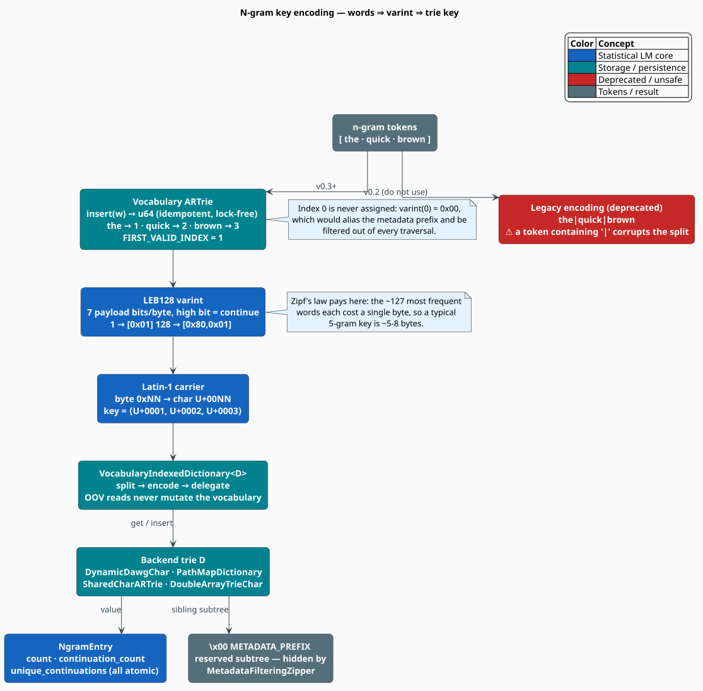

# Trie Storage and Key Encoding

An n-gram model is, physically, a **map from a token sequence to three counters**. How that
sequence is turned into a lookup key decides the model's memory footprint, its query latency, and
— as libgrammstein learned the hard way — whether it silently corrupts data. This document explains
the **vocabulary-indexed LEB128 encoding** that keys every n-gram, the reserved-index invariant that
protects the metadata subtree, and the four dictionary backends the encoded keys can be stored in.

> **Scope.** Source of truth: [`src/ngram/trie.rs`](../../../src/ngram/trie.rs),
> [`src/ngram/vocabulary.rs`](../../../src/ngram/vocabulary.rs),
> [`src/ngram/vocabulary_indexed.rs`](../../../src/ngram/vocabulary_indexed.rs), and
> [`src/ngram/entry.rs`](../../../src/ngram/entry.rs). For what is *stored* see
> [N-gram Overview](overview.md); for how it is *read* see [Query API](query-api.md).

## Notation

Every symbol is defined before it is used in a formula.

| Symbol | Meaning |
|---|---|
| $`w`$ | a word (token) |
| $`V`$ | the vocabulary; $`\lvert V \rvert`$ its size |
| $`\iota(w)`$ | the **vocabulary index** of $`w`$ — a `u64` assigned on first sight |
| $`n`$ | the n-gram order (number of tokens in the key) |
| $`k`$ | the length of a word in characters |
| $`m`$ | the length of an **encoded key**, in trie units (characters) |
| $`b(i)`$ | the number of bytes LEB128 needs to encode the integer $`i`$ |
| $`\lceil x \rceil`$ | the ceiling of $`x`$ |
| $`r`$ | a word's frequency rank ($`1`$ = most frequent), used in Zipf's law |
| $`c(x)`$ | raw training count of the token sequence $`x`$ |
| $`h`$ | a context (history); $`h\,w`$ is $`h`$ with $`w`$ appended |

**Acronyms.** *LEB128* — Little-Endian Base-128 (a variable-length integer encoding); *ARTrie* —
Adaptive Radix Trie; *DAWG* — Directed Acyclic Word Graph; *DAT* — Double-Array Trie; *PUA* —
Private Use Area; *WAL* — Write-Ahead Log; *OOV* — Out-Of-Vocabulary.

## The delimiter bug

The obvious key encoding joins the tokens with a separator:

```rust
// NgramTrie::encode_key_legacy — deprecated since 0.3.0
tokens.join("|")   // ["the", "quick", "brown"] -> "the|quick|brown"
```

This is *wrong*, and wrong in the worst way: it fails **silently**. A token may legitimately contain
the separator — URLs, code identifiers, and tokenizer artefacts all do — and the key then decodes to
the wrong arity:

```rust
// The regression test that pins the bug (src/ngram/trie.rs)
let tokens = ["foo|bar", "baz"];                 // a 2-gram
let encoded = Trie::encode_key_legacy(&tokens);  // "foo|bar|baz"
let decoded: Vec<_> = encoded.split('|').collect();
assert_eq!(decoded, ["foo", "bar", "baz"]);      // a 3-gram — silently corrupted
```

A 2-gram has become a 3-gram. Counts land on the wrong entry, the order statistics are wrong, and
nothing panics. `NGRAM_SEPARATOR` and `NgramTrie::encode_key` are consequently
`#[deprecated(since = "0.3.0")]`.

The fix is to stop delimiting altogether: if every token is mapped to an integer, and the integers
are encoded *self-delimitingly*, then no byte in the key can ever be mistaken for a boundary.

## The encoding, in three steps



### Step 1 — intern the word to an integer

A shared **vocabulary** assigns each distinct word a monotonically increasing `u64` index on first
insertion, and returns that same index forever after (the insert is idempotent):

```math
\iota : V \to \{1, 2, 3, \dots\}, \qquad \iota(w) = \iota(w') \iff w = w' \tag{T1}
```

The vocabulary is a [`PersistentVocabARTrie`](../../../src/ngram/vocabulary.rs) — an adaptive radix
trie [[3]](#references) with a write-ahead log. It answers the forward lookup $`w \mapsto \iota(w)`$
in $`O(k)`$ (a trie walk over the word's $`k`$ characters) and the reverse lookup
$`\iota(w) \mapsto w`$ in $`O(k)`$ by parent-pointer backtracking, with an $`O(1)`$ cache hit. Index
assignment is a lock-free atomic bump, so many corpus workers may intern concurrently — ten threads
racing to insert the same word all receive the *same* index, and the vocabulary grows by one.

### Step 2 — LEB128-varint the integer

Each index is encoded as an **LEB128 varint** [[4]](#references): seven payload bits per byte, with
the high bit set on every byte but the last.

```math
b(i) = \max\left(\left\lceil \frac{\lfloor \log_2 i \rfloor + 1}{7} \right\rceil,\ 1\right) \tag{T2}
```

| Index range | Bytes | Example |
|---|---|---|
| $`0 \le i \le 127`$ | 1 | $`1 \to`$ `[0x01]` |
| $`128 \le i \le 16\,383`$ | 2 | $`128 \to`$ `[0x80, 0x01]` |
| $`16\,384 \le i \le 2\,097\,151`$ | 3 | $`16\,384 \to`$ `[0x80, 0x80, 0x01]` |
| $`\dots`$ | $`\dots`$ | up to 10 bytes for $`2^{64} - 1`$ |

Varints are **self-delimiting**: the decoder knows a value has ended when it reads a byte whose high
bit is clear, so a concatenation of varints parses back to exactly the right arity with no separator
at all. That eliminates the delimiter bug by construction. `decode_ngram_key` recovers the index
list, and `ngram_order` recovers $`n`$ simply by counting the varints.

**This encoding is compact precisely because language is Zipfian.** Word frequency follows Zipf's
law [[5]](#references) — the $`r`$-th most frequent word occurs with probability roughly
proportional to $`1/r`$ — and because indices are handed out in *first-encounter* order, the
commonest words receive the smallest indices. The $`127`$ words that fit in a single byte are
exactly the function words (*the*, *of*, *and*, …) that dominate any corpus. The expected key size
is therefore far below the worst case:

```math
m = \sum_{j=1}^{n} b\bigl(\iota(w_j)\bigr) \;\approx\; n \cdot \bar{b},
\qquad \bar{b} \approx 1\text{–}2 \text{ bytes for typical text} \tag{T3}
```

A 5-gram key is thus roughly $`5`$–$`8`$ bytes, against the $`\approx 30`$ bytes the same 5-gram
would occupy as a raw UTF-8 string — a $`4`$–$`6\times`$ reduction in key storage, before the trie's
own prefix sharing is even counted.

### Step 3 — carry the bytes as Latin-1 characters

The dictionary backends are keyed by `char`, not by `u8`. Each varint byte is therefore widened to
the codepoint of the same numeric value:

```math
\text{byte } \mathrm{0xNN} \;\longmapsto\; \text{char } \mathrm{U{+}00NN}, \qquad 0 \le \mathrm{NN} \le 255 \tag{T4}
```

This is the Latin-1 (ISO-8859-1) block, which is a byte-for-byte identity map onto the first $`256`$
Unicode codepoints, so the transform is lossless and trivially invertible (`c as u8`). The resulting
`String` is valid UTF-8 and any char-keyed trie stores it unchanged. The round-trip is pinned by
`test_latin1_encoding_preserves_bytes`, which asserts it for all $`256`$ byte values.

> **Historical note.** An earlier design mapped words to Unicode **Private Use Area** codepoints
> (one PUA char per word). That capped the vocabulary at the PUA's $`131\,068`$ codepoints and is
> gone. A handful of stale doc-comments in the source still say "PUA character", but the shipped
> encoding is the LEB128 varint described here, and the vocabulary is bounded only by `u64`.

## The reserved-index invariant

```rust
/// Index 0 is reserved to avoid collision with the \x00 metadata key prefix.
pub const FIRST_VALID_INDEX: u64 = 1;
```

This constant is load-bearing. The trie reserves the key prefix `'\x00'`
([`METADATA_PREFIX`](../../../src/ngram/metadata_filtering_zipper.rs)) for an internal subtree that
holds model metadata alongside the n-grams. Now observe that $`b(0) = 1`$ and that the LEB128
encoding of $`0`$ is the single byte `0x00`, which Step 3 widens to exactly `'\x00'`.

Had index $`0`$ ever been assigned to a word, then *any n-gram beginning with that word* would
produce a key starting with `'\x00'` — indistinguishable from a metadata key, and therefore
**hidden from every traversal** by the metadata filter. Its counts would be written and then
silently never read. Starting the index space at $`1`$ makes the two prefixes disjoint by
construction:

```math
\forall\, w \in V : \iota(w) \ge 1 \;\Longrightarrow\; \text{first byte of key} \ne \mathrm{0x00} \tag{T5}
```

[`MetadataFilteringZipper`](../../../src/ngram/metadata_filtering_zipper.rs) enforces the other half
of the contract at read time: at the root it refuses to `transition('\x00')` and filters that edge
out of `edges()`, so metadata is invisible to iteration, to `Dictionary::len`, and to the
Levenshtein automata that traverse the same trie. `len()` subtracts the metadata subtree's final
count from the backend's total rather than walking the entire visible trie, and `is_empty()` probes
for the *first* visible final rather than counting all of them.

## Lookup complexity

A trie [[1]](#references)[[2]](#references) resolves a key by walking one node per key unit, so a
lookup is linear in the **key length** — not in the number of stored n-grams:

```math
T_{\text{lookup}}(m) = O(m), \qquad m = \sum_{j=1}^{n} b\bigl(\iota(w_j)\bigr) \tag{T6}
```

This is the property that makes the whole design work. $`m`$ is a small constant in practice (a
5-gram key is $`\approx 5`$–$`8`$ units by $`(\mathrm{T3})`$), so a lookup is $`O(1)`$ for all
practical purposes and — crucially — **independent of corpus size**. A model trained on a billion
tokens answers a query as fast as one trained on a thousand.

| Structure | Lookup | Prefix queries | Notes |
|---|---|---|---|
| Hash map | $`O(m)`$ expected | no | must hash the whole key; no prefix sharing |
| Sorted array + binary search | $`O(m \log N)`$ | no | cache-hostile; $`N`$ = number of stored n-grams |
| **Trie** | $`O(m)`$ **worst case** | **yes** | shares prefixes; $`h`$ is a *prefix* of $`h\,w`$ |

The last column is the deciding one. Modified Kneser-Ney needs $`c(h\,w)`$ **and** $`c(h)`$ on every
query, and $`h`$ is a proper prefix of $`h\,w`$ — so a walk that reaches the full n-gram has already
passed through the node for its context. Backoff, which repeatedly shortens the history, is likewise
pure prefix navigation. A hash map would have to hash and probe independently for every one of those
lookups.

## Engineering

### `NgramTrie<D>`: the typed wrapper

```rust
pub struct NgramTrie<D>
where
    D: MappedDictionary<Value = NgramEntry>,
{
    dictionary: Arc<D>,   // the backend — shared, never deep-cloned
    max_order: usize,     // n
    _marker: PhantomData<D>,
}
```

`NgramTrie::new(dictionary, max_order)` takes **two** arguments. Cloning an `NgramTrie` clones the
`Arc`, not the trie, so handing a model to another thread is free.

The impl is deliberately **split in two** by trait bound:

- `impl<D: MappedDictionary<Value = NgramEntry>>` — the **read** surface (`get`, `get_by_key`,
  `contains`, `contains_key`, `count`, `count_by_key`, `len`, `is_empty`, `iter_entries`).
  Available on *every* backend, including read-only ones.
- `impl<D: MutableMappedDictionary<Value = NgramEntry>>` — the **write** surface (`insert`,
  `insert_with_key`, `insert_with_count`, `update_continuation_count_by_key`,
  `update_unique_continuations_by_key`). Available only on writable backends.

That split is what lets the immutable `DoubleArrayTrieChar` back an `NgramModel` for inference while
remaining untrainable: the type system rejects any attempt to count into it.

### `NgramEntry`: three atomics per n-gram

```rust
#[derive(Debug, Default)]
pub struct NgramEntry {
    count: AtomicU64,                 // c(h·w)
    continuation_count: AtomicU32,    // N1+(., ngram) — distinct preceding contexts
    unique_continuations: AtomicU32,  // N1+(ngram, .) — distinct following words
}
```

Fields are **private**; access is through the accessors `count()`, `continuation_count()`,
`unique_continuations()` and the mutators `increment()`, `increment_by()`,
`increment_continuation()`, `increment_unique_continuations()`, `set_continuation_count()`,
`set_unique_continuations()`. Every load and store uses `Ordering::Relaxed`, which is correct here
because counting imposes no happens-before requirement between workers — only the final value after
the join matters. `test_thread_safety` pins this: ten threads incrementing one entry a thousand
times each land on exactly $`10\,000`$.

A `Clone + Copy` [`NgramEntrySnapshot`](../../../src/ngram/entry.rs) with plain (non-atomic) fields
exists for serialization and for crossing thread boundaries.

### `VocabularyIndexedDictionary<D>`: encoding as a decorator

Rather than teach every backend about vocabularies, the encoding is a **wrapper** that implements
the same `Dictionary` / `MappedDictionary` / `MutableMappedDictionary` traits as the thing it wraps:

```rust
pub struct VocabularyIndexedDictionary<D> {
    backend: D,                    // any dictionary backend
    vocabulary: SharedVocabARTrie, // word -> u64
    delimiter: char,               // how a term string splits into words (default ' ')
}
```

It splits the incoming term, encodes the words, and delegates. The asymmetry between reads and
writes is deliberate and important:

- **Write** paths (`insert_with_value`, `update_or_insert`, `insert_ngram`) call
  `encode_key_inserting`, which **allocates** a vocabulary index for any unseen word.
- **Read** paths (`get_value`, `contains`, `get_ngram`, `contains_ngram`) call
  `encode_key_existing`, which returns `None` the moment a word is absent — so **querying an OOV
  n-gram never mutates the vocabulary**. This is pinned by
  `vocabulary_query_oov_reads_do_not_mutate_vocabulary`.

Without that split, merely *scoring* a corpus would slowly grow the vocabulary with every unknown
word it encountered.

### Backends

All four satisfy `MappedDictionary<Value = NgramEntry>`; the first three also satisfy
`MutableMappedDictionary`. Each implements `IterableDictionary`, the iteration hook that lets a
model be exported to the backend-agnostic portable format.

| Backend | Mutable | serde | Persistence | Best for |
|---|---|---|---|---|
| `DynamicDawgChar` | yes | **yes** | whole-model `save`/`load` | the default; DAWG suffix sharing |
| `PathMapDictionary` | yes | no | portable only | lling-llang shared lattice |
| `SharedCharARTrie` | yes | portable | **WAL + crash recovery** | corpora larger than RAM |
| `DoubleArrayTrieChar` | **no** | portable | bulk-built, immutable | inference — fastest reads |

`DoubleArrayTrieChar` [[6]](#references) is built once from a key set (`from_terms_with_values`,
which sorts with the builder's own comparator, so no manual ordering is required) and then answers
queries from two flat integer arrays with almost no pointer chasing.
`NgramModel::from_portable_static` converts any trained model into one, and the
`static_dat_model_matches_source` test asserts that it reproduces the source model's `count` and
`log_prob` for seen, unseen, and OOV n-grams alike.

## Usage

The encoding functions are exported from [`crate::ngram`](../../../src/ngram/vocabulary.rs).

```rust
use libgrammstein::ngram::{
    create_vocabulary, decode_ngram_key, encode_ngram_key, encode_ngram_key_existing, ngram_order,
};
use std::path::Path;

let vocab = create_vocabulary(Path::new("vocab.artrie"))?;

// Encoding INTERNS: unseen words are assigned the next free index.
let key = encode_ngram_key(&["the", "quick", "brown"], &vocab);
assert_eq!(decode_ngram_key(&key), vec![1, 2, 3]);  // indices start at FIRST_VALID_INDEX
assert_eq!(ngram_order(&key), 3);                   // arity recovered from the varints

// A token containing '|' no longer corrupts anything.
let tricky = encode_ngram_key(&["foo|bar", "baz"], &vocab);
assert_eq!(decode_ngram_key(&tricky).len(), 2);     // still a 2-gram

// Query-only encoding: None if ANY word is OOV, and the vocabulary is left untouched.
assert!(encode_ngram_key_existing(&["the", "never_seen"], &vocab).is_none());
# Ok::<(), libgrammstein::ngram::VocabularyError>(())
```

Batched interning collapses $`n`$ write-ahead-log records into one, which matters during bulk import:

```rust
use libgrammstein::ngram::encode_ngram_key_batch;

// One WAL record for the whole 5-gram instead of five.
let key = encode_ngram_key_batch(&["the", "quick", "brown", "fox", "jumps"], &vocab);
```

Every `encode_*` function has a fallible `try_encode_*` twin returning `VocabularyResult<_>` instead
of panicking on a persistence error, plus `*_bytes` variants that skip the Latin-1 widening for
byte-keyed tries.

## References

1. E. Fredkin (1960). *Trie memory.* Communications of the ACM 3(9), 490–499.
   [doi:10.1145/367390.367400](https://doi.org/10.1145/367390.367400)
2. D. E. Knuth (1998). *The Art of Computer Programming, Vol. 3: Sorting and Searching*, 2nd ed.,
   §6.3 (Digital Searching). Addison-Wesley.
3. V. Leis, A. Kemper & T. Neumann (2013). *The adaptive radix tree: ARTful indexing for main-memory
   databases.* ICDE 2013, 38–49.
   [doi:10.1109/ICDE.2013.6544812](https://doi.org/10.1109/ICDE.2013.6544812)
4. DWARF Debugging Information Format Committee (2017). *DWARF Version 5*, §7.6 (Variable Length
   Data: LEB128). The same encoding is used by Protocol Buffers and WebAssembly.
   [dwarfstd.org/doc/DWARF5.pdf](https://dwarfstd.org/doc/DWARF5.pdf)
5. G. K. Zipf (1949). *Human Behavior and the Principle of Least Effort.* Addison-Wesley.
6. J. Aoe (1989). *An efficient digital search algorithm by using a double-array structure.* IEEE
   Transactions on Software Engineering 15(9), 1066–1077.
   [doi:10.1109/32.31365](https://doi.org/10.1109/32.31365)

## See also

- [N-gram Overview](overview.md) — what is stored, and how it is trained
- [Query API](query-api.md) — reading the trie back out
- [Modified Kneser-Ney](modified-kneser-ney.md) — why $`c(h)`$ and $`c(h\,w)`$ are both needed
- [Memory Optimization](../../architecture/memory-optimization.md) — sizing a model for a corpus
- [Threading Model](../../architecture/threading.md) — why the entry fields are atomics
