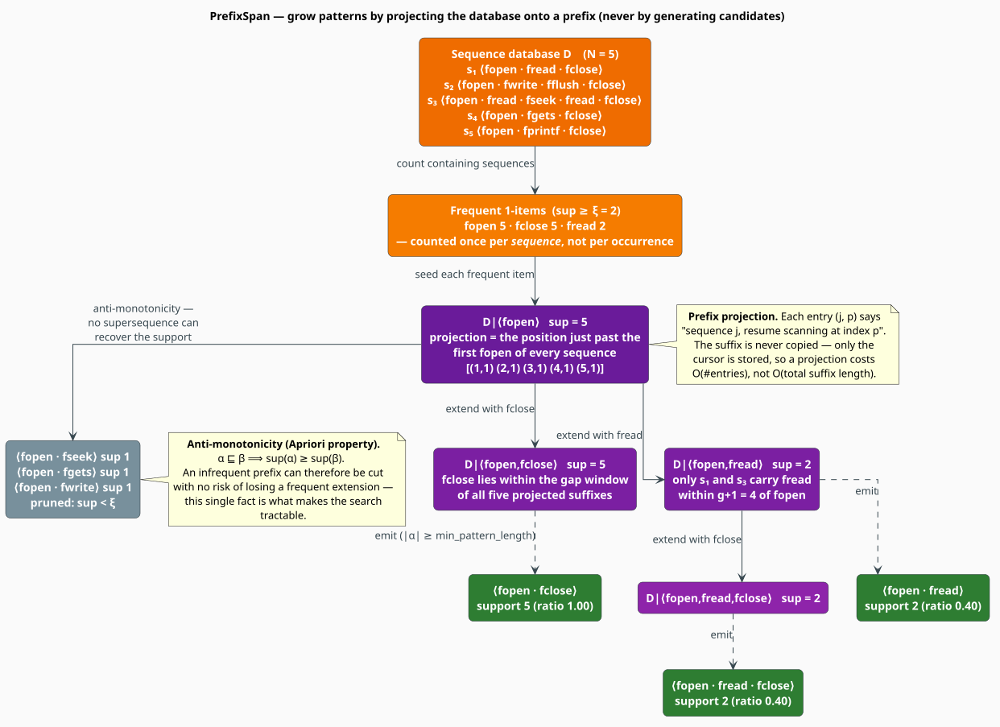

# API Pattern Mining

`ApiPatternMiner` discovers the **call orders** that recur across a body of code — *open then
close*, *connect, query, commit* — by running **PrefixSpan** [[1]](#references) over a database of
API-call sequences. This document defines what a pattern and its support *are*, derives the property
that makes the search tractable, and specifies exactly what this implementation computes.

> **Scope.** Source of truth: [`src/topic/paradigm/api_patterns.rs`](../../../src/topic/paradigm/api_patterns.rs).
> The miner is one of the three engines introduced in the [Overview](overview.md); it shares no
> state with the others.

## 1. The problem

A library's *documentation* tells you which calls exist. A library's *usage* tells you which calls
go together, and in what order — and that is what a corpus can be made to confess. Recovering those
orders supports API-misuse detection (a `fopen` with no matching `fclose`), idiom extraction,
documentation-by-example, and refactoring toward the abstraction the pattern is begging for
[[5]](#references)[[6]](#references).

The miner is deliberately **language-agnostic**: it consumes sequences of *strings* and never looks
at code. What counts as an "API call" — a method name, a receiver-qualified name like `db.query`, a
system call in a trace — is the caller's decision. Extract the sequences (from an AST, a
[code-property graph](../code/cpg.md), or a runtime trace), then hand them over.

## 2. Notation

| Symbol | Meaning |
|---|---|
| $`\Sigma`$ | the alphabet of API-call names |
| $`s_j = \langle a_{j,0}, \dots, a_{j,\lvert s_j \rvert - 1} \rangle`$ | the $`j`$-th **sequence**, a word over $`\Sigma`$ |
| $`\mathcal{D} = \langle s_0, \dots, s_{N-1} \rangle`$ | the **sequence database**; $`N = \lvert \mathcal{D} \rvert`$ |
| $`\alpha = \langle \alpha_0, \dots, \alpha_{k-1} \rangle`$ | a **pattern** — itself a word over $`\Sigma`$, of length $`k`$ |
| $`g`$ | `max_gap` — the largest number of items that may be *skipped* between consecutive pattern items |
| $`\mathrm{sup}(\alpha)`$ | the **support** of $`\alpha`$ — a count of *sequences*, not of occurrences |
| $`\rho`$ | `min_support` — a *relative* support threshold in $`[0,1]`$ |
| $`c_{\min}`$ | `min_support_count` — an *absolute* floor |
| $`\xi`$ | the effective absolute support threshold, from $`(\mathrm{A3})`$ |
| $`\mathcal{D}\vert_\alpha`$ | the **projected database** — where to resume scanning, per sequence |

## 3. Containment, support, and the threshold

Pattern $`\alpha`$ is **contained** in sequence $`s`$ under gap bound $`g`$ — written
$`\alpha \sqsubseteq_g s`$ — when its items occur in order, each within $`g+1`$ positions of the
last:

```math
\begin{array}{lr}
\displaystyle \alpha \sqsubseteq_g s \iff \exists\, p_0 < p_1 < \dots < p_{k-1} \ \text{ with } \ s_{p_m} = \alpha_m \ \text{ and } \ 1 \le p_{m+1} - p_m \le g + 1 & \text{(A1)}
\end{array}
```

Setting $`g = 0`$ (`allow_gaps = false`, i.e. `ApiPatternConfig::strict`) forces
$`p_{m+1} = p_m + 1`$ — the items must be **consecutive**. Larger $`g`$ tolerates that many
intervening calls.

**Support counts sequences, never occurrences.** A pattern occurring five times inside one sequence
still has support $`1`$:

```math
\begin{array}{lr}
\displaystyle \mathrm{sup}(\alpha) = \bigl\lvert \{\, j \ :\ \alpha \sqsubseteq_g s_j \,\} \bigr\rvert,
\qquad
\mathrm{sup}_{\mathrm{rel}}(\alpha) = \frac{\mathrm{sup}(\alpha)}{\max(N,\ 1)} & \text{(A2)}
\end{array}
```

$`\mathrm{sup}_{\mathrm{rel}}`$ is the `support_ratio` field. The threshold a pattern must clear
combines the relative and the absolute setting, taking whichever is **stricter**:

```math
\begin{array}{lr}
\displaystyle \xi = \max\Bigl(\bigl\lceil \rho \cdot N \bigr\rceil,\ c_{\min}\Bigr) & \text{(A3)}
\end{array}
```

so $`\rho`$ scales with the corpus while $`c_{\min}`$ refuses to call two coincidences a pattern in
a tiny one. A pattern is **frequent** iff $`\mathrm{sup}(\alpha) \geq \xi`$.

### The property that makes this tractable

The number of candidate patterns over $`\Sigma`$ is exponential, so no miner may enumerate them.
It does not have to, because support is **anti-monotone** (the *Apriori property*
[[2]](#references)) — extending a pattern can never increase its support:

```math
\begin{array}{lr}
\displaystyle \alpha \sqsubseteq \beta \ \implies\ \mathrm{sup}(\alpha) \ \geq\ \mathrm{sup}(\beta) & \text{(A4)}
\end{array}
```

*Proof.* Every sequence containing $`\beta`$ contains $`\alpha`$, since a witness chain for
$`\beta`$ restricted to the positions of $`\alpha`$'s items is a witness chain for $`\alpha`$. Hence
the witness set of $`\beta`$ is a subset of that of $`\alpha`$, and its cardinality cannot be
larger. $`\blacksquare`$

The contrapositive is the pruning rule: **if $`\alpha`$ is infrequent, every extension of $`\alpha`$
is infrequent**, so the entire subtree below $`\alpha`$ may be cut with no risk of losing a frequent
pattern. This single fact is the whole reason the search terminates in useful time.

## 4. PrefixSpan: growth by projection



Apriori-style miners *generate* candidates and then test them, which is expensive precisely because
most candidates fail. PrefixSpan [[1]](#references) never generates a candidate. It grows a prefix
$`\alpha`$ and carries with it a **projected database** — for each sequence still in play, a cursor
saying *where to resume reading*:

```math
\begin{array}{lr}
\displaystyle \mathcal{D}\vert_\alpha = \bigl\{\, (j,\ p) \ :\ \text{sequence } j \text{ witnesses } \alpha,\ \text{ending at position } p - 1 \,\bigr\} & \text{(A5)}
\end{array}
```

Only frequent single items can start a pattern (by $`(\mathrm{A4})`$), so the recursion seeds itself
with those, then repeatedly: read the window of at most $`g+1`$ items past each cursor; count how
many *distinct sequences* each item appears in; keep the items clearing $`\xi`$; and recurse on each,
one item longer. The suffix is never copied — only the cursor moves — which is what makes a
projection cost $`O(\lvert \mathcal{D}\vert_\alpha \rvert)`$ rather than
$`O(\text{total suffix length})`$.

## 5. The algorithm, literately

This mirrors [`ApiPatternMiner::mine`](../../../src/topic/paradigm/api_patterns.rs) and its
recursive helper; `⟨…⟩` names a refinement expanded below.

```
function mine(D):                                        ▸ D = [s_0 … s_{N-1}]
    if D is empty: return []
    ξ <- max( ceil(min_support * N), min_support_count )  ▸ (A3)
    D <- intern(D)                                        ▸ every name becomes an Arc<str>
    F <- { item : #{ j : item ∈ s_j } ≥ ξ }               ▸ frequent 1-items; per-sequence count
    if F is empty: return []
    patterns <- []
    for item in F:
        cursors <- ⟨seed the projection⟩                  ▸ one cursor per witnessing sequence
        if |cursors| ≥ ξ:
            prefix_span(cursors, prefix = [item])
    sort patterns by (support ↓, length ↓)
    truncate patterns to max_patterns
    if closed_only: patterns <- ⟨keep only closed patterns⟩
    return patterns

function prefix_span(cursors, prefix):
    if |prefix| ≥ min_pattern_length:                     ▸ emit before extending …
        emit ApiPattern(prefix, support = #distinct sequences in cursors)
    if |prefix| ≥ max_pattern_length: return              ▸ … then respect the depth bound

    extensions <- empty map: item -> [cursor]
    for (j, p) in cursors:                                ▸ scan the gap window past each cursor
        last <- min(p + max_gap + 1, |s_j|)  if allow_gaps  else  min(p + 1, |s_j|)
        for i in p .. last-1:
            item <- s_j[i]
            if item not already taken from this cursor:   ▸ dedupe within one window
                extensions[item].push( (j, i+1) )

    for (item, cursors') in extensions:
        if #distinct sequences in cursors' ≥ ξ:           ▸ the (A4) prune
            prefix_span(cursors', prefix ++ [item])

⟨seed the projection⟩ ≡                                   ▸ NOTE: the FIRST occurrence only
    for each sequence s_j:
        p <- the smallest index with s_j[p] = item        ▸ earliest anchor; see §8
        if p exists: cursors.push( (j, p+1) )

⟨keep only closed patterns⟩ ≡                             ▸ (A6)
    drop α whenever some kept β ⊐ α has sup(β) = sup(α)
```

Note the emit-then-descend order: a pattern is recorded as soon as it is long enough, so the output
contains **every** frequent pattern of admissible length, not only the maximal ones. Filtering to
the interesting ones is what `closed_only` is for (§9).

## 6. The `ApiPattern` record

```rust
pub struct ApiPattern {
    pub sequence: Vec<Arc<str>>,   // the pattern α, in order
    pub support: usize,            // sup(α) — (A2)
    pub support_ratio: f64,        // sup_rel(α) — (A2)
    pub is_closed: bool,
    pub avg_position: f64,
    pub confidence: Option<f64>,
}
```

`ApiPattern::new` sets `support_ratio` from $`(\mathrm{A2})`$ and gives the last three fields fixed
constructor defaults — `is_closed = false`, `avg_position = 0.5`, `confidence = None`. **`mine` does
not compute them**, and they keep those defaults in everything it returns. Two consequences are
worth internalising, because the field names invite the opposite assumption:

- Do **not** filter on `is_closed`. Even under `closed_only`, closedness is applied by *removing*
  non-closed patterns from the returned vector, not by flagging the survivors — so the flag reads
  `false` on a pattern that is, in fact, closed. The correct test is "did it survive `closed_only`
  mining", not "is `is_closed` set".
- `avg_position` ($`0.5`$) and `confidence` (`None`) are reserved fields, carried for consumers that
  wish to compute a positional bias or an association-rule confidence themselves. They convey no
  information as returned.

Useful methods: `len()`, `is_empty()`, and `to_string_pattern()`, which renders the sequence as
`"open -> read -> close"`.

`MiningStats` — `sequences_processed`, `items_processed`, `patterns_found`, `time_us` — is exported
alongside, for callers that wish to record a run; `mine` returns `Vec<ApiPattern>` and does not
produce one.

## 7. Configuration

```rust
pub struct ApiPatternConfig {
    pub min_support: f64,        // ρ    default 0.1
    pub min_support_count: usize,// c_min default 2
    pub max_pattern_length: usize,// L   default 10
    pub min_pattern_length: usize,//     default 2
    pub closed_only: bool,       //      default false
    pub max_patterns: usize,     //      default 1000
    pub allow_gaps: bool,        //      default true
    pub max_gap: usize,          // g    default 3
}
```

Every field is consumed by `mine`. Three presets and a builder are provided:

| Constructor | `allow_gaps` | $`g`$ | $`\rho`$ | Use when |
|---|---|---|---|---|
| `default()` / `new()` | `true` | 3 | 0.10 | general purpose |
| `strict()` | `false` | 0 | 0.10 | the calls must be **consecutive** — e.g. mining lock/unlock adjacency |
| `lenient()` | `true` | 10 | 0.05 | long function bodies with much intervening logic |

```rust
let config = ApiPatternConfig::new()
    .with_min_support(0.25)        // ρ — a quarter of all sequences
    .with_min_support_count(3)     // …but never fewer than 3 sequences
    .with_min_pattern_length(2)
    .with_max_pattern_length(6)
    .with_max_gap(2);              // sets allow_gaps = (2 > 0) = true
```

`with_max_gap` also *derives* `allow_gaps`: passing `0` sets it to `false`, so
`with_max_gap(0)` and `strict()` agree.

## 8. What support means here, exactly

Two implementation choices refine $`(\mathrm{A2})`$, and both are observable. State them, or you
will misread a support count.

**Support is by distinct sequence, at every depth.** A projected database may hold several cursors
for the same sequence (a later item can be reachable from several earlier witnesses), so the miner
counts *distinct sequence indices*, never cursors. Repetition inside one sequence cannot inflate a
support.

**The seed is anchored at the earliest occurrence.** For the first item of a pattern, only the
*first* occurrence in each sequence is projected. In classical, unconstrained PrefixSpan this is
exactly right: anything reachable from a later occurrence is also reachable from the earliest one.
Under a **finite `max_gap`** that implication fails, and the resulting support is a *lower bound* on
the number of sequences containing the pattern:

```
D  = ⟨ a x x x a b ⟩ , ⟨ a b ⟩ , ⟨ a b ⟩          with max_gap g = 1

⟨a,b⟩ is present in all three sequences under (A1) — in the first, via the SECOND `a`,
which is immediately followed by `b`. But the projection seeds on the FIRST `a`, whose
gap window reaches only ⟨x, x⟩, so `b` is never seen in that sequence.

    reported support = 2          true gap-constrained support = 3
```

Widening $`g`$ until the window can reach from the earliest occurrence to the continuation restores
the exact count (at $`g = 10`$ the example reports $`3`$). If you need exact gap-constrained support
on sequences whose *seed calls repeat*, either widen `max_gap` or split each sequence at repeated
seeds before mining. For the common shape of API traces — a resource opened once, used, and closed —
the anchoring is harmless and the count is exact.

## 9. Closed patterns

A frequent pattern set is highly redundant: if `⟨connect, query, fetch, close⟩` holds in 40
sequences, so do all $`2^4 - 1`$ of its non-empty sub-patterns, most with the *same* support and no
extra information. A pattern is **closed** when no proper super-pattern has the same support
[[3]](#references):

```math
\begin{array}{lr}
\displaystyle \mathrm{Closed}(\mathcal{F}) = \bigl\{\, \alpha \in \mathcal{F} \ :\ \nexists\, \beta \in \mathcal{F} \ \text{ with } \ \alpha \sqsubset \beta \ \wedge \ \mathrm{sup}(\beta) = \mathrm{sup}(\alpha) \,\bigr\} & \text{(A6)}
\end{array}
```

Closed patterns are a **lossless** condensation: they preserve the support of every frequent pattern
(any $`\alpha`$ inherits the support of its smallest closed super-pattern), while discarding the
sub-patterns that add nothing. Setting `closed_only = true` applies $`(\mathrm{A6})`$ as a
post-filter over the mined, sorted, truncated list — pairwise, by subsequence test.

```rust
// Three identical sequences ⟨a, b, c⟩. Un-closed mining reports ⟨a,b⟩, ⟨b,c⟩, ⟨a,c⟩ and
// ⟨a,b,c⟩ — all with support 3. Only ⟨a,b,c⟩ is closed, and it implies the rest.
let mut miner = ApiPatternMiner::new(ApiPatternConfig {
    min_support: 0.5,
    min_support_count: 2,
    closed_only: true,
    ..Default::default()
});
let patterns = miner.mine(&[vec!["a", "b", "c"], vec!["a", "b", "c"], vec!["a", "b", "c"]]);
assert!(patterns.iter().any(|p| p.sequence.len() == 3));   // ⟨a,b,c⟩ survives
assert!(!patterns.iter().any(|p| p.to_string_pattern() == "a -> b"));  // ⟨a,b⟩ is absorbed
```

Because the filter runs *after* the `max_patterns` truncation, a super-pattern evicted by the cap
cannot absorb its sub-patterns. Raise `max_patterns` if you mine with `closed_only` and a tight cap.

## 10. Engineering

**String interning.** Every call name is interned into an `Arc<str>` through a
`HashMap<String, Arc<str>>` held by the miner, so the many copies of a name across projections share
one allocation and comparisons are cheap. This is why **`mine` takes `&mut self`** — the intern
cache is the only mutable state, and it persists across calls, so repeated mining over the same
vocabulary gets cheaper.

**Signature.** `mine` is generic over anything sequence-shaped, so `Vec<Vec<&str>>`,
`&[Vec<String>]` and `&[&[String]]` all work without conversion:

```rust
pub fn mine<S, T>(&mut self, sequences: &[S]) -> Vec<ApiPattern>
where
    S: AsRef<[T]>,
    T: AsRef<str>;
```

**Output ordering.** Patterns are sorted by support descending, ties broken by length descending —
so the most-supported, and among equals the most-specific, come first. `patterns[0]` is the strongest
finding.

## 11. Cost

Let $`N`$ be the sequence count, $`\bar{\ell}`$ the mean sequence length, $`L`$ =
`max_pattern_length`, and $`F`$ the number of frequent patterns actually emitted.

| Stage | Cost |
|---|---|
| interning | $`O(N \bar{\ell})`$ |
| frequent 1-items | $`O(N \bar{\ell})`$ |
| one projection step | $`O(\lvert \mathcal{D}\vert_\alpha \rvert \cdot (g+1))`$ — the window is bounded by the gap |
| whole recursion | $`O\bigl(F \cdot N \cdot (g+1)\bigr)`$, depth-bounded by $`L`$ |
| `closed_only` filter | $`O(F^2 \cdot L)`$ — pairwise subsequence tests |

The mining is **output-sensitive**: it costs what it finds. The two levers that bound it are $`\xi`$
(raise `min_support` and the frequent set collapses) and $`L`$. The closed filter is the one
quadratic term — with a large `max_patterns` and `closed_only`, it dominates.

## 12. Worked example

```rust
use libgrammstein::topic::paradigm::{ApiPatternConfig, ApiPatternMiner};

// Five file-I/O traces. Every one opens and closes; what else is universal?
let sequences = vec![
    vec!["fopen", "fread", "fclose"],
    vec!["fopen", "fwrite", "fflush", "fclose"],
    vec!["fopen", "fread", "fseek", "fread", "fclose"],
    vec!["fopen", "fgets", "fclose"],
    vec!["fopen", "fprintf", "fclose"],
];

let mut miner = ApiPatternMiner::new(ApiPatternConfig {
    min_support: 0.3,       // ρ ⇒ ⌈0.3 × 5⌉ = 2
    min_support_count: 2,   // c_min = 2 ⇒ ξ = max(2, 2) = 2
    min_pattern_length: 2,
    ..Default::default()    // g = 3, closed_only = false
});

let patterns = miner.mine(&sequences);

// The invariant of the whole corpus: every open is matched by a close.
let open_close = patterns
    .iter()
    .find(|p| p.to_string_pattern() == "fopen -> fclose")
    .expect("fopen → fclose is present in all five sequences");

assert_eq!(open_close.support, 5);
assert_eq!(open_close.support_ratio, 1.0);

for p in patterns.iter().take(3) {
    println!("{:<28} support {}/{}  ({:.0}%)",
             p.to_string_pattern(), p.support, sequences.len(),
             p.support_ratio * 100.0);
}
// fopen -> fclose              support 5/5  (100%)
// fopen -> fread               support 2/5  (40%)
// fopen -> fread -> fclose     support 2/5  (40%)
```

A pattern with support $`1.0`$ and an obvious pairing — *every* `fopen` is answered by an `fclose` —
is exactly the shape of an API contract. Its *violations* are what a misuse detector reports.

## References

1. J. Pei, J. Han, B. Mortazavi-Asl, J. Wang, H. Pinto, Q. Chen, U. Dayal & M.-C. Hsu (2004).
   *Mining sequential patterns by pattern-growth: the PrefixSpan approach.* IEEE Transactions on
   Knowledge and Data Engineering 16(11), 1424–1440.
   [doi:10.1109/TKDE.2004.77](https://doi.org/10.1109/TKDE.2004.77) — the algorithm implemented here.
2. R. Agrawal & R. Srikant (1995). *Mining sequential patterns.* Proceedings of the 11th
   International Conference on Data Engineering (ICDE), 3–14.
   [doi:10.1109/ICDE.1995.380415](https://doi.org/10.1109/ICDE.1995.380415) — the problem statement
   and the anti-monotonicity property $`(\mathrm{A4})`$.
3. X. Yan, J. Han & R. Afshar (2003). *CloSpan: mining closed sequential patterns in large datasets.*
   Proceedings of the 2003 SIAM International Conference on Data Mining, 166–177.
   [doi:10.1137/1.9781611972733.15](https://doi.org/10.1137/1.9781611972733.15) — closed sequential
   patterns $`(\mathrm{A6})`$ and why they are a lossless condensation.
4. J. Wang & J. Han (2004). *BIDE: efficient mining of frequent closed sequences.* Proceedings of the
   20th International Conference on Data Engineering (ICDE), 79–90.
   [doi:10.1109/ICDE.2004.1319986](https://doi.org/10.1109/ICDE.2004.1319986) — mining closed
   patterns *directly*, the natural upgrade from this implementation's post-filter.
5. H. Zhong, T. Xie, L. Zhang, J. Pei & H. Mei (2009). *MAPO: mining and recommending API usage
   patterns.* ECOOP 2009, LNCS 5653, 318–343.
   [doi:10.1007/978-3-642-03013-0_15](https://doi.org/10.1007/978-3-642-03013-0_15) — the canonical
   application of sequence mining to API usage.
6. M. Acharya, T. Xie, J. Pei & J. Xu (2007). *Mining API patterns as partial orders from source
   code: from usage scenarios to specifications.* ESEC/FSE 2007, 25–34.
   [doi:10.1145/1287624.1287630](https://doi.org/10.1145/1287624.1287630) — mining API *specifications*
   rather than sequences; the direction to go when total order is too strong an assumption.

## See also

- [Overview](overview.md) — the three engines and where the miner sits among them
- [Subtree Mining](../code/subtree-mining.md) — the same idea over *trees* (TreeMiner) rather than sequences
- [Code Property Graph](../code/cpg.md) — one good source of the call sequences this miner consumes
- [Domain Patterns](domain-patterns.md) — hand-written catalogs, where mining is not the right tool
