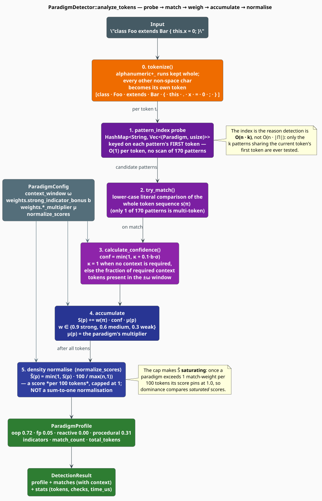

# Paradigm Detection

`ParadigmDetector` turns a code sample into a `ParadigmProfile` — four scores in $`[0,1]`$, one per
paradigm — by matching a table of **170 literal token patterns** and accumulating their weights.
This document specifies the pipeline exactly: how tokens are produced, how patterns are found, how
a match is weighted, and how the accumulated evidence becomes a score.

> **Scope.** Source of truth: [`src/topic/paradigm/detector.rs`](../../../src/topic/paradigm/detector.rs)
> and [`src/topic/paradigm/config.rs`](../../../src/topic/paradigm/config.rs). The taxonomy the
> matches are filed under is in [Indicators](indicators.md); the design rationale for literal
> matching is in the [Overview](overview.md#3-why-literal-tokens-and-not-a-grammar).

## 1. The two entry points

```rust
impl ParadigmDetector {
    pub fn new(config: ParadigmConfig) -> Self;
    pub fn with_defaults() -> Self;

    /// Tokenize `code` with the built-in tokenizer, then analyse.
    pub fn analyze(&self, code: &str) -> ParadigmProfile;

    /// Analyse a token stream you produced yourself.
    pub fn analyze_tokens(&self, tokens: &[String]) -> DetectionResult;
}
```

`analyze` is `analyze_tokens` composed with the built-in tokenizer, discarding everything but the
profile. The two differ in more than convenience — §7 shows that a class of patterns is reachable
**only** through `analyze_tokens`. Both take `&self`; the detector's fields are all `Send + Sync`,
so one detector may be shared by reference across threads.

## 2. Notation

Every symbol used below is defined here first. Indices are **0-based**, matching the code.

| Symbol | Meaning |
|---|---|
| $`T = \langle t_0, \dots, t_{n-1} \rangle`$ | the token stream; $`n`$ is the token count (`total_tokens`) |
| $`\mathrm{lc}(t)`$ | the lower-cased form of token $`t`$ |
| $`\mathcal{P}`$ | the four *matchable* paradigms: OOP, FP, Reactive, Procedural |
| $`\pi`$ | a **pattern** (a `PatternDef`) |
| $`\mathbf{s}_\pi`$ | the pattern's token sequence, of length $`\ell_\pi = \lvert \mathbf{s}_\pi \rvert`$ |
| $`w_\pi`$ | the pattern's base **weight**, drawn from $`\{0.3,\ 0.6,\ 0.9\}`$ |
| $`\sigma_\pi`$ | the **strong** flag — $`1`$ when $`w_\pi \geq 0.7`$, else $`0`$ |
| $`R_\pi`$ | the pattern's **required context** tokens (empty for all but one pattern) |
| $`\Pi_p`$ | the pattern table of paradigm $`p`$ |
| $`M_\pi`$ | the set of positions at which $`\pi`$ matches |
| $`\mu_p`$ | the multiplier for paradigm $`p`$ (`weights.*_multiplier`, default $`1`$) |
| $`b`$ | `weights.strong_indicator_bonus` (default $`0.5`$) |
| $`\omega`$ | `context_window`, in tokens (default $`10`$) |
| $`S_p,\ \hat{S}_p`$ | the **raw** and the **normalised** score for paradigm $`p`$ |

## 3. The pipeline



### 3.1 Match

A pattern matches at position $`i`$ when its whole token sequence is present there, compared
lower-case and **literally** — no wildcards, no character classes, no regular expressions:

```math
M_\pi = \bigl\{\, i \ :\ 0 \le i \le n - \ell_\pi \ \wedge\ \mathrm{lc}(t_{i+j}) = s_{\pi,j} \ \text{ for all } 0 \le j < \ell_\pi \,\bigr\} \tag{D1}
```

Of the 170 shipped patterns, 169 have $`\ell_\pi = 1`$; the sole two-token pattern is
`["if", "let"]` (an FP pattern-match indicator). Matching is therefore, in practice, a table
lookup on a single token.

### 3.2 Confidence

A match may be discounted by its surroundings. Let $`W_\pi(i)`$ be the **context window** — the
lower-cased tokens within $`\omega`$ positions either side of the match:

```math
W_\pi(i) = \bigl\{\, \mathrm{lc}(t_j) \ :\ \max(0,\ i - \omega) \le j < \min(n,\ i + \ell_\pi + \omega) \,\bigr\} \tag{D2}
```

The **context factor** $`\kappa`$ is the fraction of the pattern's required-context tokens actually
present in that window — and is $`1`$ by definition when the pattern requires no context:

```math
\kappa(\pi, i) = \begin{cases}
1 & R_\pi = \varnothing \\[4pt]
\dfrac{\bigl\lvert \{\, r \in R_\pi \ :\ r \in W_\pi(i) \,\} \bigr\rvert}{\lvert R_\pi \rvert} & \text{otherwise}
\end{cases} \tag{D3}
```

Confidence adds a bonus for strong patterns and clamps to $`1`$:

```math
\mathrm{conf}(\pi, i) = \min\Bigl(1,\ \kappa(\pi, i) + \tfrac{1}{10}\, b \, \sigma_\pi \Bigr) \tag{D4}
```

> **Corollary (confidence is inert for 169 of the 170 patterns).** If $`R_\pi = \varnothing`$ then
> $`\kappa = 1`$ by $`(\mathrm{D3})`$, so $`(\mathrm{D4})`$ gives
> $`\mathrm{conf} = \min(1,\ 1 + \tfrac{1}{10} b\,\sigma_\pi) = 1`$ for **any** non-negative $`b`$.
> Confidence can therefore only ever *reduce* a score, and only for a pattern that declares required
> context. Exactly one shipped pattern does: the Reactive reading of `for`, which requires `<-` (a
> Rholang receive) to distinguish it from a procedural loop. For every other pattern
> $`\mathrm{conf} \equiv 1`$, and $`(\mathrm{D5})`$ below collapses to a plain weighted count.

### 3.3 Score

The raw score of a paradigm is its total matched weight, scaled by the paradigm's multiplier:

```math
S_p \;=\; \mu_p \sum_{\pi \in \Pi_p} \ \sum_{i \in M_\pi} w_\pi \cdot \mathrm{conf}(\pi, i) \tag{D5}
```

$`S_p`$ is unbounded: it grows with the size of the sample. To make samples comparable, and only
when `normalize_scores` is set and at least one pattern matched, the detector converts it into a
**density** — matched weight per one hundred tokens — and caps it at $`1`$:

```math
\hat{S}_p \;=\; \min\Bigl(1,\ S_p \cdot \frac{100}{\max(n,\ 1)}\Bigr) \tag{D6}
```

> **`normalize_scores` does not make the scores sum to one.** $`(\mathrm{D6})`$ is a *per-paradigm*
> rescale-and-cap; the four results are independent and their sum may be anything in $`[0, 4]`$. The
> separate, explicit sum-to-one operation is
> [`ParadigmProfile::normalize`](indicators.md#6-normalisation-and-merging). Two consequences
> follow from the cap: a paradigm that exceeds one unit of match-weight per 100 tokens **saturates**
> at exactly $`1.0`$, and two saturated paradigms become indistinguishable — which is precisely the
> condition [`dominant_paradigm`](indicators.md#7-the-dominance-rule) reports as `Mixed`.

When `normalize_scores` is `false`, or when nothing matched, the profile keeps the raw $`S_p`$ of
$`(\mathrm{D5})`$ — uncapped, and not comparable across samples of different lengths.

## 4. The algorithm, literately

The following mirrors [`ParadigmDetector::analyze_tokens`](../../../src/topic/paradigm/detector.rs);
`⟨…⟩` names a refinement expanded below.

```
function analyze_tokens(T):                        ▸ T = [t_0 … t_{n-1}]
    profile <- empty; matches <- []; stats <- zeroed
    for i in 0 .. n-1:
        candidates <- pattern_index[ lc(T[i]) ]    ▸ O(1) probe; miss ⇒ next token
        for (p, idx) in candidates:                ▸ |candidates| ≤ 2  (see Engineering)
            pi <- patterns_for(p)[idx]
            stats.pattern_checks += 1
            if ⟨pattern pi matches at i⟩:
                conf  <- ⟨confidence of pi at i⟩              ▸ (D4)
                delta <- pi.weight * conf * multiplier(p)     ▸ the summand of (D5)
                add delta to profile.score[p]
                record IndicatorMatch{ indicator, context_before, context_after, conf }
                profile.indicators.push(indicator); profile.match_count += 1
    profile.total_tokens <- n
    if normalize_scores and profile.match_count > 0:
        ⟨density-normalise every score⟩                       ▸ (D6)
    return DetectionResult{ profile, matches, stats }

⟨pattern pi matches at i⟩ ≡                        ▸ (D1) — literal, lower-cased, no wildcards
    i + len(pi.tokens) <= n  and
    lc(T[i+j]) == pi.tokens[j]  for every j

⟨confidence of pi at i⟩ ≡                          ▸ (D3) then (D4)
    conf <- 1
    if pi.context_required is present:
        W    <- lc(T[ max(0, i-ω) .. min(n, i+len(pi.tokens)+ω) ])
        conf <- conf * |{ r in R : r in W }| / |R|
    if pi.is_strong:  conf <- conf + 0.1 * strong_indicator_bonus
    return min(conf, 1)

⟨density-normalise every score⟩ ≡                  ▸ (D6); applied to all four scores
    f <- 100 / max(n, 1)
    for each paradigm p:  score[p] <- min(score[p] * f, 1)
```

Note the loop's **`i += 1` at every step, even after a match**: matches may overlap, and a token
that begins one pattern is still offered to the next. Note also that a token whose bucket holds two
patterns (§5) contributes to **both** paradigms — the evidence is not arbitrated.

## 5. Engineering

### The first-token index

The detector never scans its 170 patterns. At construction, `build_index` maps every pattern's
**first token** to the patterns that begin with it:

```rust
pattern_index: HashMap<String, Vec<(Paradigm, usize)>>
```

For the shipped tables this yields **165 distinct keys**, of which 160 hold a single pattern and 5
hold two — so the bucket size $`k`$ obeys $`k \leq 2`$, and detection is $`O(n \cdot k) = O(n)`$
with a small constant. The five two-pattern buckets are exactly the tokens whose paradigm is
genuinely ambiguous:

| Token | Reactive / FP reading | Procedural reading |
|---|---|---|
| `for` | strong Reactive — a Rholang `for (@x <- ch)` receive | medium Procedural — a loop |
| `*` | strong Reactive — a Rholang name dereference | medium Procedural — a pointer dereference |
| `do` | medium FP — a Haskell `do` block | medium Procedural — a `do … while` loop |
| `return` | medium FP — the monadic `return` | weak Procedural — a return statement |
| `if` | weak FP — the two-token `if let` | weak Procedural — a conditional |

Both readings fire, and both scores rise. This is deliberate: the detector's job is to report
evidence, not to resolve it. Only `for` attempts a disambiguation, via its required-context token
`<-` (and §7 explains why that attempt is inert under `analyze`).

### Debug

`ParadigmDetector` implements `Debug` by hand, printing the *sizes* of the four tables rather than
their contents, so a `{:?}` in a log does not emit 170 patterns.

## 6. `DetectionResult`

`analyze_tokens` returns everything it learned:

```rust
pub struct DetectionResult {
    pub profile: ParadigmProfile,   // the four scores + the matched indicators
    pub matches: Vec<IndicatorMatch>,
    pub stats: DetectionStats,      // see the note below
}

pub struct IndicatorMatch {
    pub indicator: ParadigmIndicator,
    pub context_before: Vec<String>, // up to `context_window` tokens before the match
    pub context_after: Vec<String>,  // up to `context_window` tokens after it
    pub confidence: f64,             // conf(pi, i) from (D4)
}
```

`DetectionStats` carries four counters — `tokens_processed`, `pattern_checks`, `matches_found` and
`time_us` (wall-clock microseconds, measured with `Instant`). It is `pub`, and every field is
readable through `result.stats`, but the type is **not re-exported** from the module: you can read
it, you cannot `use` it by name.

The distinction between `profile.indicators` and `matches` is that the latter carries the
surrounding tokens. Use `matches` when you want to explain *why* a score is what it is:

```rust
let result = detector.analyze_tokens(&tokens);
for m in &result.matches {
    println!(
        "{:>10} {:<14} conf {:.2}  …{} ⟪{}⟫ {}…",
        m.indicator.paradigm,          // Display → "OOP", "FP", "Reactive", "Procedural"
        m.indicator.category.short_name(),
        m.confidence,
        m.context_before.join(" "),
        m.indicator.pattern,
        m.context_after.join(" "),
    );
}
```

## 7. The tokenizer contract

`analyze` calls a deliberately minimal built-in tokenizer:

- a run of `[A-Za-z0-9_]` becomes one token (so `__init__` and `flat_map` survive intact);
- **every other non-whitespace character becomes a token of its own**;
- whitespace is dropped.

The second rule has a consequence that governs how you should call the detector. A multi-character
operator is *never* produced as a single token — `=>` becomes `["=", ">"]`, and `>>=` becomes
`[">", ">", "="]`. Eleven pattern tokens in the shipped tables are multi-character operators or
sigils, and therefore **cannot match anything `analyze` produces**:

| Unreachable via `analyze` | Tokenizer yields | Pattern's paradigm |
|---|---|---|
| `=>` | `["=", ">"]` | FP — lambda |
| `->` | `["-", ">"]` | FP — lambda |
| `>>=` | `[">", ">", "="]` | FP — monadic bind |
| `>>` | `[">", ">"]` | FP — monadic sequence |
| `@property` | `["@", "property"]` | OOP — encapsulation |
| `+=` `-=` `*=` `/=` | `["+", "="]` … | Procedural — mutation |
| `++` `--` | `["+", "+"]`, `["-", "-"]` | Procedural — mutation |

The same applies to the one required-context token, `<-`, which the tokenizer splits into
`["<", "-"]`. Under `analyze`, therefore, the Reactive `for` pattern can never satisfy its context
requirement, and by $`(\mathrm{D3})`$–$`(\mathrm{D4})`$ its confidence is
$`\kappa + \tfrac{1}{10}b\,\sigma = 0 + 0.05 = 0.05`$ — it still contributes, but at 5 % of weight.

**The remedy is `analyze_tokens`.** Feed it a stream from a real lexer — one that preserves
multi-character operators — and all 170 patterns become reachable, including the `for`/`<-`
disambiguation:

```rust
// A lexer that keeps `<-` whole (e.g. tree-sitter, or your own) unlocks the
// Reactive reading of `for` and every multi-character-operator pattern.
let tokens: Vec<String> = ["for", "(", "@", "msg", "<-", "chan", ")"]
    .iter()
    .map(|s| s.to_string())
    .collect();
let result = detector.analyze_tokens(&tokens);
assert!(result.profile.reactive_score > 0.0);
```

Single-character sigils — `!`, `*`, `@`, `|`, `;`, `=`, `&` — are unaffected: the tokenizer emits
them as their own tokens, so the Rholang send/dereference/quote patterns work under plain
`analyze`.

## 8. The configuration surface

```rust
pub struct ParadigmConfig {
    pub weights: ParadigmWeights,
    pub language_hints: LanguageHints,
    pub min_score_threshold: f64,           // default 0.1
    pub normalize_scores: bool,             // default true
    pub max_indicators_per_paradigm: usize, // default 100
    pub track_positions: bool,              // default true
    pub context_window: usize,              // default 10
    pub parallel: bool,                     // default true
}

pub struct ParadigmWeights {
    pub oop_multiplier: f64,        // default 1.0   μ(OOP)
    pub fp_multiplier: f64,         // default 1.0   μ(FP)
    pub reactive_multiplier: f64,   // default 1.0   μ(Reactive)
    pub procedural_multiplier: f64, // default 1.0   μ(Procedural)
    pub strong_indicator_bonus: f64,// default 0.5   b in (D4)
    pub context_bonus: f64,         // default 0.3
    pub conflict_penalty: f64,      // default 0.2
}
```

Not every field participates in $`(\mathrm{D1})`$–$`(\mathrm{D6})`$. The table below states, for
each, whether `analyze_tokens` reads it — and, where it does not, what the field is *for*:

| Field | Read by `analyze_tokens`? | Role |
|---|---|---|
| `weights.*_multiplier` | **yes** | $`\mu_p`$ in $`(\mathrm{D5})`$ |
| `weights.strong_indicator_bonus` | **yes** | $`b`$ in $`(\mathrm{D4})`$ |
| `context_window` | **yes** | $`\omega`$ in $`(\mathrm{D2})`$, and the span of `context_before` / `context_after` |
| `normalize_scores` | **yes** | gates $`(\mathrm{D6})`$ |
| `min_score_threshold` | no | a value to hand to [`present_paradigms`](indicators.md#7-the-dominance-rule); the detector applies no floor of its own |
| `max_indicators_per_paradigm` | no | a budget for callers that cap their own collections; `analyze_tokens` records every match |
| `track_positions` | no | positions are recorded unconditionally — `ParadigmIndicator::position` is always `Some` |
| `parallel` | no | the detector is single-threaded; parallelism is the caller's (see §10) |
| `language_hints` | no | carried for callers; see §9 |
| `weights.context_bonus`, `weights.conflict_penalty` | no | reserved knobs, held for future scoring terms |

The presets are thin wrappers over these fields: `for_oop_detection` sets
$`\mu_{\text{OOP}} = 1.2,\ \mu_{\text{FP}} = 0.8`$; `for_fp_detection` mirrors it;
`for_reactive_detection` sets $`\mu_{\text{Rx}} = 1.2`$; `balanced` is `default`; and `quick_scan`
narrows the window to $`\omega = 5`$ and drops `max_indicators_per_paradigm` to 20. All are
composable with the builder methods:

```rust
use libgrammstein::topic::paradigm::{ParadigmConfig, ParadigmWeights};

let config = ParadigmConfig::new()
    .with_weights(ParadigmWeights::favor_fp())  // μ(FP) = 1.5
    .with_context_window(20)                    // ω = 20
    .with_min_threshold(0.2)                    // carried, for present_paradigms(0.2)
    .with_normalization(true);                  // apply (D6)
```

## 9. Language hints

`LanguageHints` is a per-language vocabulary — constructors exist for `python`, `rust`,
`javascript`, `java`, `haskell`, `rholang`, `metta`, plus `unknown`:

```rust
pub struct LanguageHints {
    pub language: Option<String>,
    pub is_oop_language: bool,
    pub is_fp_language: bool,
    pub is_multi_paradigm: bool,
    pub custom_oop_keywords: Vec<String>,
    pub custom_fp_keywords: Vec<String>,
    pub custom_reactive_keywords: Vec<String>,
    pub ignore_keywords: Vec<String>,
}
```

The hints encode real domain knowledge — `LanguageHints::rholang` marks `new` as a token to ignore,
because in Rholang `new` allocates a *channel*, not an object, and would otherwise read as a strong
OOP instantiation signal. `LanguageHints::metta` marks the language as FP and treats `!` as a
command prefix rather than a send.

As the table in §8 records, **`analyze_tokens` does not consume these hints**: the 170-pattern
table is fixed and language-agnostic. The hints are a data structure the *caller* applies — to
pre-filter a token stream through `ignore_keywords` before `analyze_tokens`, or to weight the
resulting profile. The idiomatic use is the former:

```rust
use libgrammstein::topic::paradigm::{LanguageHints, ParadigmDetector};

let hints = LanguageHints::rholang();
let detector = ParadigmDetector::with_defaults();

// Drop the language's false-friend tokens before they can score.
let tokens: Vec<String> = raw_tokens
    .into_iter()
    .filter(|t| !hints.ignore_keywords.iter().any(|k| k == t))
    .collect();

let result = detector.analyze_tokens(&tokens);
```

## 10. Cost and concurrency

| Stage | Cost |
|---|---|
| `tokenize` | $`O(\lvert \text{code} \rvert)`$, one pass, no allocation per character |
| index probe | $`O(1)`$ expected per token, plus $`O(\lvert t_i \rvert)`$ to lower-case it |
| `try_match` | $`O(k \cdot \ell)`$ per token, with $`k \leq 2`$ and $`\ell \leq 2`$ |
| normalisation | $`O(1)`$ — four multiplications |
| **total** | **$`O(n)`$** in the token count, with a constant of at most four comparisons |

Memory is $`O(m)`$ for $`m`$ matches: each `IndicatorMatch` clones up to $`2\omega`$ context tokens,
so a large `context_window` on a match-dense file is the one place allocation can surprise you.
Lower $`\omega`$ (or use `ParadigmConfig::quick_scan`) if that shows up in a profile.

The `parallel` config flag is *carried, not consumed* — `analyze_tokens` is single-threaded. Because
the detector is `Send + Sync` and `analyze` takes `&self`, parallelism belongs to the caller and is
free:

```rust
use rayon::prelude::*;

let detector = ParadigmDetector::with_defaults();
let profiles: Vec<_> = sources
    .par_iter()                            // one detector, shared by reference
    .map(|code| detector.analyze(code))
    .collect();
```

## 11. Worked example

```rust
use libgrammstein::topic::paradigm::{Paradigm, ParadigmDetector};

let detector = ParadigmDetector::with_defaults();

// Rust is genuinely multi-paradigm: `impl`/`self` are OOP, `iter`/`map`/`filter` are FP.
let code = r#"
    impl Display for Foo {
        fn fmt(&self, f: &mut Formatter) -> Result<(), Error> {
            self.items.iter()
                .map(|x| x.to_string())
                .filter(|s| !s.is_empty())
                .for_each(|s| write!(f, "{}", s));
            Ok(())
        }
    }
"#;

let profile = detector.analyze(code);
assert!(profile.oop_score > 0.0);   // impl (strong), self (medium)
assert!(profile.fp_score > 0.0);    // map, filter (strong); fn, | (medium); result/ok (strong)

// With both paradigms strongly present, the top two scores are close, and the
// dominance rule reports the honest answer rather than an arbitrary winner.
match profile.dominant_paradigm() {
    Some(Paradigm::Mixed) => println!("multi-paradigm, as Rust tends to be"),
    Some(p) => println!("dominated by {p}"),
    None => println!("too little evidence to call"),
}
```

## References

1. R. W. Floyd (1979). *The paradigms of programming.* Communications of the ACM 22(8), 455–460.
   [doi:10.1145/359138.359140](https://doi.org/10.1145/359138.359140)
2. E. Bainomugisha, A. L. Carreton, T. Van Cutsem, S. Mostinckx & W. De Meuter (2013). *A survey on
   reactive programming.* ACM Computing Surveys 45(4), Article 52.
   [doi:10.1145/2501654.2501666](https://doi.org/10.1145/2501654.2501666) — the source of the
   observable / event / backpressure / scheduler decomposition the Reactive table follows.
3. L. D. Meredith & M. Radestock (2005). *A reflective higher-order calculus.* Electronic Notes in
   Theoretical Computer Science 141(5), 49–67.
   [doi:10.1016/j.entcs.2005.05.016](https://doi.org/10.1016/j.entcs.2005.05.016) — why `for`, `!`,
   `*` and `@` are Reactive indicators rather than procedural ones.

## See also

- [Overview](overview.md) — the three engines and why matching is literal
- [Indicators](indicators.md) — the taxonomy, the weight tiers, and the dominance rule
- [API Patterns](api-patterns.md) — mining recurring call orders with PrefixSpan
- [Domain Patterns](domain-patterns.md) — the Rholang and MeTTa catalogs
- [Code Tokenizer](../code/tokenizer.md) — a structure-aware alternative source of tokens
