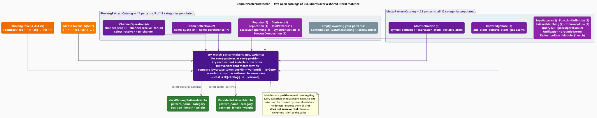

# Domain Patterns: Rholang and MeTTa

The general paradigm tables of [Detection](detection.md) know what a `class` or a `map` looks like
in a hundred languages. They know nothing about a **contract**, a **join pattern**, or an
**atomspace query**. `DomainPatternDetector` closes that gap with two hand-written catalogs of
idioms for the F1R3FLY.io domain-specific languages:

| Language | What it is | Catalog | Patterns | Categories used |
|---|---|---|---|---|
| **Rholang** | a reflective, concurrent process calculus for smart contracts [[1]](#references) | `RholangPatternCatalog` | 14 | 9 of 12 |
| **MeTTa** | a declarative meta-language for hypergraph-based AI [[2]](#references) | `MettaPatternCatalog` | 22 | 12 of 12 |

> **Scope.** Source of truth: [`src/topic/paradigm/domain_patterns.rs`](../../../src/topic/paradigm/domain_patterns.rs).
> The general four-paradigm detector is [Detection](detection.md); the two engines are independent
> and may be run over the same token stream.

## 1. Why a catalog, and not mining?

[API mining](api-patterns.md) *discovers* what recurs; a catalog *asserts* what matters. Each is
right in a different situation, and the choice is not a matter of taste:

| | Mining (PrefixSpan) | Catalog (this page) |
|---|---|---|
| needs | a large corpus | a language expert |
| finds | whatever is frequent | whatever is *significant* |
| misses | rare-but-critical idioms | anything nobody wrote down |
| names things | no — patterns are anonymous | yes — every match carries a name and a category |

A Rholang `contract` is worth naming even if it appears once, and a registry lookup is worth
naming *because* it is rare and consequential. Neither would survive a support threshold. Where the
idioms of a language are known in advance and few, a catalog beats a miner — and it can say
*which idiom* was found, which a support count never can.

## 2. The engine



```rust
impl DomainPatternDetector {
    pub fn new() -> Self;                                   // both catalogs, fully populated
    pub fn rholang_catalog(&self) -> &RholangPatternCatalog;
    pub fn metta_catalog(&self) -> &MettaPatternCatalog;

    pub fn detect_rholang_patterns(&self, tokens: &[&str]) -> Vec<RholangPatternMatch>;
    pub fn detect_metta_patterns(&self, tokens: &[&str]) -> Vec<MettaPatternMatch>;
}
```

Note the input type: **`&[&str]`**, not the `&[String]` that
[`ParadigmDetector::analyze_tokens`](detection.md#1-the-two-entry-points) takes. The detector has no
tokenizer of its own — you supply the tokens, which means you control how sigils are split (and,
for these languages, that matters: see §5).

Both detectors return a flat vector of matches:

```rust
pub struct RholangPatternMatch {   // MettaPatternMatch is identical, with a MettaPatternCategory
    pub pattern_name: String,      // e.g. "contract_definition"
    pub category: RholangPatternCategory,
    pub position: usize,           // token index
    pub length: usize,             // in tokens — see the matching contract below
    pub weight: f64,               // the catalog entry's weight, copied through
}
```

### The matching contract

Four rules govern every match. They are simple, and each has a consequence that will surprise you
if you do not know it.

1. **Every pattern is tried at every position.** There is no index and no early exit, so matches
   **overlap freely** — one token may be covered by several. In MeTTa, a `!` at the head of
   `!(add-atom …)` matches both `command_prefix` and `add_atom`, and both are reported.
2. **First variant wins — not longest.** A pattern may declare several token-sequence variants;
   `try_match_pattern` returns the length of the **first one that matches, in declaration order**.
   Three shipped Rholang entries declare the *short* variant first — `channel_send` (`["!"]` before
   `["!", "("]`), `contract_definition` and `new_channel` — so for those, `length` is always the
   short variant's. The pattern is still correctly *detected*; only the reported `length` is the
   shorter one. Order your own variants **longest-first** if `length` matters to you.
3. **Comparison is lower-cased on one side only.** The matcher tests
   `tokens[pos + i].to_lowercase() == variant[i]` — the *input* token is folded, the *pattern* token
   is used verbatim. **Catalog variants must therefore be written in lower case**: a variant
   containing an upper-case character can never equal a lower-cased token. Two shipped entries carry
   an upper-case character in their only variant — `symbol_definition` (`Symbol`) and
   `registry_insert` (`insertArbitrary`) — and so do not match; write custom entries in lower case
   to avoid the same fate.
4. **The detector reports; it does not score.** Nothing is summed, ranked, or thresholded. `weight`
   is copied from the catalog onto each match and left for you to aggregate. `is_antipattern`, set
   on a catalog entry by the `antipattern()` builder, is likewise **not** carried onto the match —
   to learn that a match names an anti-pattern, look its `pattern_name` up in the catalog.

## 3. The Rholang catalog

Rholang is built on the **rho-calculus** [[1]](#references), a reflective extension of the
π-calculus in which processes and names are mutually embedded: `@P` *quotes* a process `P` into a
name, and `*x` *dereferences* a name back into a process. Every idiom below is a shape of that
calculus, which is why the general detector files `!`, `*`, `@` and `for` under
[`ReactiveObservable`](indicators.md#2-the-taxonomy) — they are message passing, not object access.

**`RholangPatternCategory`** has 12 variants: `ProcessComposition`, `ChannelOperation`,
`Replication`, `Contract`, `Registry`, `JoinPattern`, `Synchronization`, `Continuation`,
`DataMarshalling`, `AccessControl`, `StateManagement`, `NameReflection`. Each carries a
`description()`. The last three of the first ten — `Continuation`, `DataMarshalling` and
`AccessControl` — have **no built-in patterns**; they are categories awaiting entries you supply
through `add_pattern` (§5).

The 14 shipped patterns:

| Pattern | Category | Variants (first match wins) | $`w`$ |
|---|---|---|---|
| `contract_definition` | `Contract` | `["contract"]`, `["contract", "("]` | 0.95 |
| `channel_send` | `ChannelOperation` | `["!"]`, `["!", "("]` | 0.90 |
| `channel_receive` | `ChannelOperation` | `["for", "(", "@"]`, `["for", "("]` | 0.90 |
| `new_channel` | `ChannelOperation` | `["new"]`, `["new", "in", "{"]` | 0.85 |
| `join_receive` | `JoinPattern` | `["for", "(", ";"]`, `["for", "(", "@", "<", "-"]` | 0.85 |
| `persistent_receive` | `Replication` | `["contract"]` | 0.85 |
| `parallel_composition` | `ProcessComposition` | `["\|"]` | 0.80 |
| `registry_lookup` | `Registry` | `["rho", ":", "registry", ":", "lookup"]`, `["registry", "!", "(", "` `"]` | 0.80 |
| `registry_insert` | `Registry` | `["rho", ":", "registry", ":", "insertArbitrary"]` | 0.80 |
| `state_cell` | `StateManagement` | `["for", "(", "@", "state", "<", "-"]` | 0.75 |
| `select_receive` | `ChannelOperation` | `["select", "{"]` | 0.70 |
| `name_quote` | `NameReflection` | `["@"]` | 0.70 |
| `name_dereference` | `NameReflection` | `["*"]` | 0.70 |
| `ack_pattern` | `Synchronization` | `["ack", "!", "("]`, `["ret", "!", "("]` | 0.70 |

The idioms these name, in the source language:

```rholang
// contract_definition (0.95) — a persistent, replicated receive. The highest weight in
// the catalog: nothing else in Rholang looks like this, and it defines a service.
contract foo(@arg, ret) = { ret!(arg) }

// channel_send (0.90) / channel_receive (0.90) — the two halves of message passing.
channel!(data)
for (@data <- channel) { Nil }

// new_channel (0.85) — allocate unforgeable names. NOT object construction: this is why
// LanguageHints::rholang lists `new` as a token to ignore for the general OOP detector.
new channel in { channel!(1) }

// join_receive (0.85) — synchronise on several channels at once; the join is atomic.
for (@x <- ch1; @y <- ch2) { Nil }

// state_cell (0.75) — the idiomatic mutable cell: take the state, put a new one back.
for (@state <- cell) { cell!(newState) }

// parallel_composition (0.80) — P and Q run concurrently.
P | Q

// name_quote (0.70) / name_dereference (0.70) — the reflection that defines the rho-calculus.
@P        // process ⇒ name
*channel  // name ⇒ process

// registry_lookup (0.80) — resolve a URI through the system registry.
new lookup(`rho:registry:lookup`) in { Nil }

// ack_pattern (0.70) — acknowledge completion on a return channel.
ack!(Nil)
```

`persistent_receive` and `contract_definition` share the variant `["contract"]`, so a `contract`
keyword yields **two** matches, in different categories (`Replication` and `Contract`). That is
intentional: a Rholang contract *is* both a persistent receive and a service definition, and a
consumer interested in either dimension will find it.

## 4. The MeTTa catalog

MeTTa is the language of the OpenCog Hyperon framework [[2]](#references): programs are
**atoms** — symbols, expressions, variables and grounded values — that are rewritten by pattern
matching against an **atomspace**. It is homoiconic, so code and knowledge share one representation,
and the idioms below are as much about *knowledge manipulation* as about computation.

**`MettaPatternCategory`** has 12 variants, and — unlike the Rholang catalog — **all 12 carry
patterns**: `AtomDefinition`, `TypePattern`, `FunctionDefinition`, `PatternMatching`, `Unification`,
`InferenceRule`, `KnowledgeBase`, `Query`, `Module`, `GroundedAtom`, `SpaceOperation`,
`ReductionRule`.

The 22 shipped patterns:

| Pattern | Category | Variants (first match wins) | $`w`$ |
|---|---|---|---|
| `function_definition` | `FunctionDefinition` | `["(", "="]` | 0.90 |
| `match_expression` | `PatternMatching` | `["(", "match"]` | 0.90 |
| `self_reference` | `SpaceOperation` | `["&self"]` | 0.90 |
| `type_declaration` | `TypePattern` | `["(", ":", "->", ")"]`, `["(", ":"]` | 0.85 |
| `pattern_function` | `FunctionDefinition` | `["(", "=", "("]` | 0.85 |
| `case_match` | `PatternMatching` | `["(", "case"]` | 0.85 |
| `inference_rule` | `InferenceRule` | `["(", ":-"]` | 0.85 |
| `query_space` | `Query` | `["(", "match", "&"]` | 0.85 |
| `variable_atom` | `AtomDefinition` | `["$"]` | 0.80 |
| `function_type` | `TypePattern` | `["(", "->"]` | 0.80 |
| `unify_expression` | `Unification` | `["(", "unify"]` | 0.80 |
| `add_atom` | `KnowledgeBase` | `["(", "add-atom"]`, `["!", "("]` | 0.80 |
| `reduction_rule` | `ReductionRule` | `["(", "=", "("]` | 0.80 |
| `remove_atom` | `KnowledgeBase` | `["(", "remove-atom"]` | 0.75 |
| `space_bind` | `SpaceOperation` | `["(", "bind!", ")"]` | 0.75 |
| `symbol_definition` | `AtomDefinition` | `["(", ":", "Symbol", ")"]` | 0.70 |
| `chain_rule` | `InferenceRule` | `["(", "chain"]` | 0.70 |
| `get_atoms` | `KnowledgeBase` | `["(", "get-atoms"]` | 0.70 |
| `grounded_symbol` | `GroundedAtom` | `["@"]` | 0.70 |
| `import_module` | `Module` | `["!", "(", "import!"]` | 0.70 |
| `expression_atom` | `AtomDefinition` | `["(", "("]` | 0.60 |
| `command_prefix` | `Query` | `["!"]` | 0.60 |

The idioms, in the source language — note that the variable sigil is part of the syntax, not math:

```metta
; function_definition (0.90) / reduction_rule (0.80) — in MeTTa these are the same act:
; a definition IS a rewrite rule. Both patterns match `(= (` , in different categories.
(= (add $x $y) (+ $x $y))
(= (inc $x) (+ $x 1))

; pattern_function (0.85) — definition by cases; the rewriter picks the matching clause.
(= (fib 0) 1)
(= (fib 1) 1)
(= (fib $n) (+ (fib (- $n 1)) (fib (- $n 2))))

; type_declaration (0.85) / function_type (0.80) — types are atoms too.
(: add (-> Number Number Number))
(-> A B)

; match_expression (0.90) / query_space (0.85) — query the atomspace by unification.
(match &self (foo $x) $x)

; variable_atom (0.80) — the bare sigil; every variable in the examples above matches it.
$x

; add_atom / remove_atom / get_atoms (KnowledgeBase) — mutate the space.
!(add-atom &self (foo bar))
!(remove-atom &self (foo bar))
!(get-atoms &self)

; self_reference (0.90) — the current space, the most common atom in real MeTTa.
&self

; inference_rule (0.85) — a conclusion from premises.
(:- (conclusion) (premise1) (premise2))

; import_module (0.70) and command_prefix (0.60) — `!` both prefixes a command and,
; followed by `(`, matches add_atom's second variant. Overlapping matches are normal.
!(import! &self stdlib)
```

**Tokenizing MeTTa is the caller's job, and it is consequential.** `variable_atom` matches the bare
token `["$"]`, so a tokenizer that emits the sigil and the name as *one* token (`$x`) will not match
it, while one that splits them (`$`, `x`) will — this is exactly the convention the crate's own
tests use. Choose a split and stay consistent with the variants you rely on.

## 5. Extending a catalog

Both catalogs are open. `add_pattern` appends and indexes by category, so a custom entry is a
first-class citizen of the same detector:

```rust
use libgrammstein::topic::paradigm::{
    RholangPattern, RholangPatternCatalog, RholangPatternCategory,
};

let mut catalog = RholangPatternCatalog::new();     // the 14 built-ins

// Fill in one of the three empty categories.
catalog.add_pattern(
    RholangPattern::new(
        "capability_attenuation",
        RholangPatternCategory::AccessControl,
        "Hand out a restricted forwarder rather than the raw channel",
    )
    .with_pattern(&["new", "forwarder", "in"])      // lower case, longest variant first
    .with_example("new forwarder in { for (@m <- forwarder) { target!(m) } }")
    .with_weight(0.8),
);

// Anti-patterns are declared the same way, and flagged on the CATALOG entry.
catalog.add_pattern(
    RholangPattern::new(
        "unbounded_replication",
        RholangPatternCategory::Replication,
        "A replicated receive with no termination condition",
    )
    .with_pattern(&["for", "(", "@", "_", "<", "-"])
    .with_weight(0.9)
    .antipattern(),                                  // sets is_antipattern on the entry
);

assert_eq!(catalog.patterns().len(), 16);
assert_eq!(catalog.by_category(RholangPatternCategory::AccessControl).len(), 1);
```

Two constraints on custom entries, restated from §2 because they are the two ways to author an
entry that silently never fires:

- write every variant token in **lower case**;
- declare variants **longest-first**, since the first match wins.

`DomainPatternDetector::new()` always builds the *built-in* catalogs; to run the detector over a
catalog you have extended, read the matches from your own catalog directly, or keep the extended
catalog alongside and consult it when interpreting a match's `pattern_name`.

## 6. Cost

`detect_rholang_patterns` and `detect_metta_patterns` try every pattern at every position:

```math
\begin{array}{lr}
\displaystyle \Theta\Bigl(n \cdot \sum_{p \in \mathrm{catalog}} \lvert \mathrm{variants}(p) \rvert \cdot \bar{\ell}\Bigr) & \text{(X1)}
\end{array}
```

with $`n`$ the token count and $`\bar{\ell}`$ the mean variant length. For the shipped catalogs the
inner sum is small — 18 Rholang variants and 24 MeTTa variants, none longer than 6 tokens — so the
scan is $`O(n)`$ with a constant near 100. That is one to two orders of magnitude more work per
token than the [indexed general detector](detection.md#5-engineering), and it is affordable only
because the catalogs are tiny. A catalog of thousands of patterns would need the same first-token
index the general detector uses.

## 7. Worked example

```rust
use libgrammstein::topic::paradigm::{DomainPatternDetector, RholangPatternCategory};

let detector = DomainPatternDetector::new();

// Tokens for:  contract foo(@arg, ret) = { ret!(*arg) }
let tokens = [
    "contract", "foo", "(", "@", "arg", ",", "ret", ")", "=",
    "{", "ret", "!", "(", "*", "arg", ")", "}",
];

let matches = detector.detect_rholang_patterns(&tokens);

for m in &matches {
    println!(
        "{:<22} {:<18} @{:<3} len {}  w {:.2}",
        m.pattern_name,
        m.category.description(),
        m.position,
        m.length,
        m.weight,
    );
}
// contract_definition   Contract …          @0   len 1  w 0.95   ← both fire on `contract`
// persistent_receive    Replication …       @0   len 1  w 0.85   ←
// name_quote            NameReflection …    @3   len 1  w 0.70
// channel_send          ChannelOperation …  @11  len 1  w 0.90   ← first variant ["!"] wins
// name_dereference      NameReflection …    @13  len 1  w 0.70

// The detector does not score. Aggregate the weights yourself if you want a total.
let contract_weight: f64 = matches
    .iter()
    .filter(|m| m.category == RholangPatternCategory::Contract)
    .map(|m| m.weight)
    .sum();
assert!(contract_weight > 0.0);
```

## References

1. L. G. Meredith & M. Radestock (2005). *A reflective higher-order calculus.* Electronic Notes in
   Theoretical Computer Science 141(5), 49–67.
   [doi:10.1016/j.entcs.2005.05.016](https://doi.org/10.1016/j.entcs.2005.05.016) — the rho-calculus
   underlying Rholang; the source of the quote/dereference reflection that `name_quote` and
   `name_dereference` detect.
2. B. Goertzel, V. Bogdanov, M. Duncan, D. Duong, Z. Goertzel, J. Horlings, M. Ikle, L. Jiang,
   K. Kastan, et al. (2023). *OpenCog Hyperon: a framework for AGI at the human level and beyond.*
   arXiv preprint. [doi:10.48550/arXiv.2310.18318](https://doi.org/10.48550/arXiv.2310.18318) — the
   framework MeTTa serves, and the atom / atomspace / grounded-atom vocabulary the catalog follows.
3. E. Bainomugisha, A. L. Carreton, T. Van Cutsem, S. Mostinckx & W. De Meuter (2013). *A survey on
   reactive programming.* ACM Computing Surveys 45(4), Article 52.
   [doi:10.1145/2501654.2501666](https://doi.org/10.1145/2501654.2501666) — why message-passing
   idioms such as Rholang's are classified as reactive rather than procedural.

## See also

- [Detection](detection.md) — the general four-paradigm detector, and `LanguageHints` for these languages
- [Indicators](indicators.md) — where `!`, `*`, `@` and `for` land in the general taxonomy
- [API Patterns](api-patterns.md) — the complementary tool: mine idioms instead of asserting them
- [Code Languages](../code/languages.md) — the tree-sitter grammars for Rholang and MeTTa
