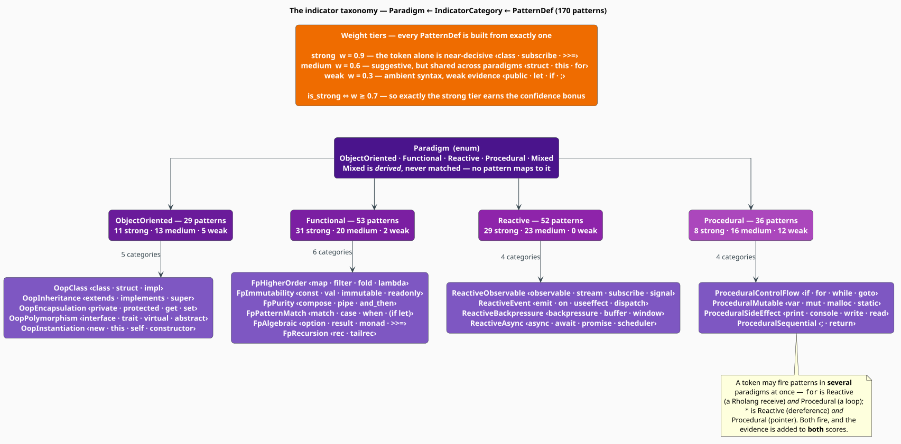
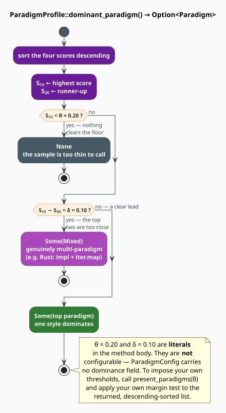

# Paradigm Indicators

An **indicator** is one piece of atomic evidence: *this token, at this position, is characteristic
of this paradigm, with this much force.* The detector emits one per match; a `ParadigmProfile` is
nothing more than those indicators, weighed and summed. This document defines the taxonomy the
indicators are filed under, the record that carries them, and the arithmetic that turns a bag of
them into a verdict.

> **Scope.** Source of truth: [`src/topic/paradigm/indicators.rs`](../../../src/topic/paradigm/indicators.rs)
> (types) and [`src/topic/paradigm/detector.rs`](../../../src/topic/paradigm/detector.rs) (the
> pattern tables). How matches are *produced* is [Detection](detection.md); this page is about what
> they *mean*.

## 1. The shape of the evidence

Three types cooperate, at three levels of granularity:

| Level | Type | Answers |
|---|---|---|
| the paradigm | `Paradigm` | *which of the four styles?* |
| the sub-category | `IndicatorCategory` | *which aspect of that style?* — inheritance, immutability, backpressure… |
| the match | `ParadigmIndicator` | *which token, where, how strongly?* |

`IndicatorCategory::paradigm()` folds the middle level into the top one, so every indicator's
paradigm is derivable from its category — the two are kept in the record only to save the lookup.

## 2. The taxonomy



`IndicatorCategory` has **19 variants**, partitioned across the four matchable paradigms. The
following table is the complete shipped inventory — all 170 patterns, by category:

| Category | Patterns | The tokens (s = strong, m = medium, w = weak) |
|---|---:|---|
| `OopClass` | 3 | `class` (s), `struct` (m), `impl` (s) |
| `OopInheritance` | 5 | `extends` (s), `implements` (s), `inherits` (s), `super` (m), `parent` (m) |
| `OopEncapsulation` | 7 | `private` (m), `protected` (m), `internal` (m), `@property` (m), `public` (w), `get` (w), `set` (w) |
| `OopPolymorphism` | 7 | `interface` (s), `trait` (s), `virtual` (s), `override` (s), `abstract` (s), `protocol` (m), `dyn` (m) |
| `OopInstantiation` | 7 | `new` (s), `this` (m), `self` (m), `constructor` (m), `destructor` (m), `__init__` (w), `__new__` (w) |
| `FpHigherOrder` | 21 | `map` `filter` `reduce` `fold` `foldl` `foldr` `flatmap` `flat_map` `lambda` `=>` `->` (s); `foreach` `find` `any` `all` `take` `drop` `zip` `concat` `fn` `\|` (m) |
| `FpImmutability` | 5 | `immutable` (s), `readonly` (s), `const` (m), `val` (m), `let` (w) |
| `FpPurity` | 4 | `compose` (s), `pipe` (s), `andthen` (m), `and_then` (m) |
| `FpPatternMatch` | 4 | `match` (s), `case` (m), `when` (m), `if let` (w — the only two-token pattern) |
| `FpAlgebraic` | 17 | `option` `some` `none` `result` `ok` `err` `either` `maybe` `just` `nothing` `monad` `functor` `applicative` `>>=` `>>` (s); `do` `return` (m) |
| `FpRecursion` | 2 | `rec` (m), `tailrec` (m) |
| `ReactiveObservable` | 31 | `observable` `subject` `stream` `flux` `mono` `subscribe` `signal` `computed` `switchmap` `debounce` `throttle` `!` `*` `@` `for` (s); `channel` `observer` `merge` `share` `tap` (m), … |
| `ReactiveEvent` | 13 | `emit` (s), `on` (s), `effect` (s), `useeffect` (s), `onclick` `onchange` `dispatch` `addeventlistener` (m), … |
| `ReactiveAsync` | 5 | `async` (m), `await` (m), `promise` (m), `future` (m), `scheduler` (m) |
| `ReactiveBackpressure` | 3 | `backpressure` (s), `buffer` (m), `window` (m) |
| `ProceduralControlFlow` | 10 | `goto` `for` `while` `loop` `do` (m); `if` `else` `switch` `break` `continue` (w) |
| `ProceduralMutable` | 18 | `var` `mut` `malloc` `free` `alloc` `dealloc` `global` `static` (s); `mutable` `+=` `-=` `++` `--` `*` `&` (m); `=` (w) |
| `ProceduralSideEffect` | 6 | `write` (m), `read` (m), `print` `println` `printf` `console` (w) |
| `ProceduralSequential` | 2 | `;` (w), `return` (w) |

Two structural facts are visible in the table and matter downstream:

- **The tables are unbalanced by design.** Reactive carries 52 patterns and OOP only 29, because
  reactive vocabulary is *specific* (`switchmap`, `combinelatest`, `backpressure` mean nothing else)
  while OOP vocabulary is *small and general*. The per-paradigm multipliers $`\mu_p`$ exist to
  correct for this if a corpus demands it.
- **A token may appear in two paradigms.** `for`, `*`, `do`, `return` and `if` each sit in two
  tables; both fire. See [Detection §5](detection.md#5-engineering).

### 2.1 The three weight tiers

Every pattern is constructed at exactly one of three strengths — there is no continuum:

| Tier | $`w_\pi`$ | $`\sigma_\pi`$ (strong flag) | Meaning | Examples |
|---|---|---|---|---|
| **strong** | $`0.9`$ | $`1`$ | the token alone is near-decisive | `class`, `subscribe`, `>>=`, `malloc` |
| **medium** | $`0.6`$ | $`0`$ | suggestive, but shared across paradigms | `struct`, `this`, `for`, `async` |
| **weak** | $`0.3`$ | $`0`$ | ambient syntax; weak evidence | `public`, `let`, `if`, `;`, `=` |

The strong flag is *derived*, not declared: $`\sigma_\pi = 1 \iff w_\pi \geq 0.7`$, which under the
three-tier scheme selects exactly the strong tier. $`\sigma_\pi`$ is what earns the confidence bonus
in [`(D4)`](detection.md#32-confidence); it is also exposed as `ParadigmIndicator::is_strong`, so a
caller can filter for high-conviction evidence:

```rust
let decisive: Vec<_> = profile.indicators.iter().filter(|i| i.is_strong).collect();
```

## 3. The `Paradigm` enum

```rust
pub enum Paradigm {
    ObjectOriented, // "OOP"
    Functional,     // "FP"
    Reactive,       // "Reactive"
    Procedural,     // "Procedural"
    Mixed,          // "Mixed" — derived, never matched
}
```

`Mixed` is a **conclusion, not an observation.** No pattern maps to it, `Paradigm::all_primary()`
excludes it, and `patterns_for(Mixed)` returns an empty slice. It is produced in exactly one place:
the dominance rule of §7, when no single style leads by enough. Accessors:

| Method | Returns |
|---|---|
| `short_name()` | `"OOP"`, `"FP"`, `"Reactive"`, `"Procedural"`, `"Mixed"` |
| `full_name()` | e.g. `"Object-Oriented Programming"` |
| `all_primary()` | the four matchable paradigms, as a `&'static [Paradigm]` |

`Display` prints the short name, so `println!("{paradigm}")` yields `FP`.

## 4. The profile

```rust
pub struct ParadigmProfile {
    pub oop_score: f64,
    pub fp_score: f64,
    pub reactive_score: f64,
    pub procedural_score: f64,
    pub indicators: Vec<ParadigmIndicator>, // every match, in token order
    pub total_tokens: usize,                // n — the denominator of the density (D6)
    pub match_count: usize,                 // |indicators|
}
```

The four scores are the $`\hat{S}_p`$ of [`(D6)`](detection.md#33-score). `score(paradigm)` reads
whichever field corresponds — with one twist. Asking for `Paradigm::Mixed` does not read a field;
it *computes* a mixedness index from the spread of the other four. With
$`\bar{S} = \tfrac{1}{4}\sum_{p} \hat{S}_p`$:

```math
\begin{array}{lr}
\displaystyle \mathrm{score}(\text{Mixed}) \;=\; 1 - \sqrt{\frac{1}{4} \sum_{p \in \mathcal{P}} \bigl(\hat{S}_p - \bar{S}\bigr)^2} & \text{(I1)}
\end{array}
```

That is $`1`$ minus the population standard deviation of the four scores. Four equal scores give a
standard deviation of $`0`$ and a mixedness of $`1`$; one paradigm at $`1.0`$ with the rest at $`0`$
gives $`\approx 1 - 0.433 = 0.567`$. It is a *spread* statistic, on the same $`[0,1]`$-ish scale as
the scores but not comparable with them — use it to rank samples by how blended they are, not to
compare against `oop_score`.

`present_paradigms(θ)` returns every paradigm at or above a floor, sorted descending — the honest
alternative to forcing a single winner:

```math
\begin{array}{lr}
\displaystyle \mathrm{present}(\theta) = \Bigl\langle\, (p,\ \hat{S}_p) \ :\ p \in \mathcal{P},\ \hat{S}_p \geq \theta \,\Bigr\rangle \quad\text{ordered by } \hat{S}_p \text{ descending} & \text{(I2)}
\end{array}
```

The natural argument is `config.min_score_threshold` (default $`0.1`$), which the detector itself
never applies — see [Detection §8](detection.md#8-the-configuration-surface).

## 5. Indicators

```rust
pub struct ParadigmIndicator {
    pub paradigm: Paradigm,           // a FIELD, not a method
    pub category: IndicatorCategory,
    pub pattern: String,              // the matched pattern's tokens, space-joined
    pub weight: f64,                  // w_π ∈ {0.3, 0.6, 0.9}
    pub position: Option<usize>,      // TOKEN index (not a byte offset), always Some from the detector
    pub length: usize,                // the match length in TOKENS (1, except for `if let`)
    pub is_strong: bool,              // σ_π — derived: weight ≥ 0.7
}
```

Two properties invite mistakes and are worth stating outright:

- **`position` and `length` are measured in tokens, not bytes.** There is no byte offset and no line
  number anywhere in the record: the detector consumes a token stream and never sees the original
  text. To map a match back to a source span, keep your own token-to-span table and index it with
  `position` — which the detector always populates, so the `Option` is always `Some`.
- **`paradigm` is a field.** `IndicatorCategory` also has a `paradigm()` *method*
  (`IndicatorCategory::OopClass.paradigm() == Paradigm::ObjectOriented`), and the two agree; the
  field is simply the cached answer.

`ParadigmIndicator::new(paradigm, category, pattern, weight)` derives `is_strong` from the weight
and defaults `position` to `None` and `length` to `1`; the builders `with_position`, `with_length`
and `with_strong` override each. Every category also offers `short_name()` — `"inheritance"`,
`"higher-order"`, `"backpressure"` — which is what to print in a report.

## 6. Normalisation and merging

`ParadigmProfile::normalize` is the **sum-to-one** operation, and it is *not* the same thing as the
detector's `normalize_scores` flag (which applies the density rescale
[`(D6)`](detection.md#33-score)). It rewrites the scores as a proper distribution over the four
paradigms:

```math
\begin{array}{lr}
\displaystyle \tilde{S}_p \;=\; \frac{\hat{S}_p}{\sum_{q \in \mathcal{P}} \hat{S}_q} \qquad\text{when the denominator is positive} & \text{(I3)}
\end{array}
```

A zero total is left untouched, so an empty profile stays all-zero rather than becoming `NaN`.
`normalized()` is the same operation returning a copy. Reach for it when you want *proportions*
("this file is 60 % OOP"); leave it alone when you want *intensity* ("this file is strongly OOP and
strongly FP") — $`(\mathrm{I3})`$ destroys the latter, because it cannot distinguish a file with
both scores at $`1.0`$ from one with both at $`0.1`$.

`merge(other, λ)` folds a second profile in under a convex combination, for $`\lambda \in [0,1]`$:

```math
\begin{array}{lr}
\displaystyle \hat{S}_p \ \leftarrow\ (1 - \lambda)\, \hat{S}_p \;+\; \lambda\, \hat{S}_p^{\,\text{other}} & \text{(I4)}
\end{array}
```

The indicator lists are concatenated and `total_tokens` / `match_count` are summed, so a merged
profile keeps full provenance. $`\lambda = 0.5`$ averages two files; a running $`\lambda`$ of
$`1/k`$ at the $`k`$-th file accumulates a streaming mean over a whole repository.

## 7. The dominance rule



`dominant_paradigm()` returns `Option<Paradigm>` — **not** `Paradigm`. Write $`\hat{S}_{(1)}`$ and
$`\hat{S}_{(2)}`$ for the highest and second-highest of the four scores, $`\theta = 0.20`$ for the
floor, and $`\delta = 0.10`$ for the required margin:

```math
\begin{array}{lr}
\displaystyle \mathrm{dom} = \begin{cases}
\texttt{None} & \hat{S}_{(1)} < \theta & \text{(too little evidence to call)} \\[3pt]
\texttt{Some(Mixed)} & \hat{S}_{(1)} - \hat{S}_{(2)} < \delta & \text{(no clear lead)} \\[3pt]
\texttt{Some}\bigl(\arg\max_p \hat{S}_p\bigr) & \text{otherwise} & \text{(a winner)}
\end{cases} & \text{(I5)}
\end{array}
```

The rule abstains twice, and that is the point: it returns `None` on a sample too thin to judge, and
`Mixed` on one that is genuinely blended, rather than crowning an arbitrary winner by a hair.

> **$`\theta`$ and $`\delta`$ are literals in the method body, not configuration.** `ParadigmConfig`
> carries no dominance field of any kind. If you need different thresholds, do not look for a knob —
> compute them yourself from `present_paradigms`, which hands back the same scores already sorted:
>
> ```rust
> let ranked = profile.present_paradigms(my_floor);   // descending
> let verdict = match ranked.as_slice() {
>     [] => None,                                                    // nothing clears my_floor
>     [(p, _)] => Some(*p),                                          // only one paradigm present
>     [(p, s1), (_, s2), ..] if s1 - s2 >= my_margin => Some(*p),    // a clear lead
>     _ => Some(Paradigm::Mixed),
> };
> ```

## 8. The descriptive indicator enums

Four further enums enumerate the *concepts* each paradigm is made of:

| Enum | Variants | Examples |
|---|---:|---|
| `OopIndicator` | 15 | `ClassKeyword`, `ExtendsKeyword`, `SelfReference`, `GetterSetter`, `VirtualKeyword` |
| `FpIndicator` | 16 | `Lambda`, `Map`, `Filter`, `Reduce`, `Curry`, `MonadicBind`, `TailRecursion` |
| `ReactiveIndicator` | 14 | `ObservableCreate`, `Subscribe`, `Backpressure`, `HotCold`, `Signal` |
| `ProceduralIndicator` | 13 | `ForLoop`, `MutableDecl`, `Goto`, `PointerOps`, `GlobalVariable` |

They are **descriptive vocabulary for callers, not machinery.** The detector classifies with
`IndicatorCategory`; these four enums are never produced by it, and no `ParadigmIndicator` carries
one. They exist so that downstream code — a linter, a report generator, a teaching tool — can name
concepts at a finer grain than the 19 categories allow, and so that such a name is spelled the same
way in every consumer of the crate. If you are matching on the detector's output, match on
`IndicatorCategory`.

## 9. Reading a profile

```rust
use libgrammstein::topic::paradigm::{Paradigm, ParadigmDetector};

let detector = ParadigmDetector::with_defaults();
let profile = detector.analyze(
    "class Repo extends Base { constructor() { this.cache = new Map(); } }",
);

// 1. The verdict — always an Option.
match profile.dominant_paradigm() {
    Some(Paradigm::Mixed) => println!("blended"),
    Some(p) => println!("{} ({:.2})", p.full_name(), profile.score(p)),
    None => println!("insufficient evidence"),
}

// 2. Everything that cleared a floor, strongest first.
for (paradigm, score) in profile.present_paradigms(0.1) {
    println!("{paradigm:>10}  {score:.3}");
}

// 3. The evidence itself — why did OOP win?
for ind in profile.indicators.iter().filter(|i| i.paradigm == Paradigm::ObjectOriented) {
    println!(
        "  token {:<12} category {:<14} w={:.1} {}",
        ind.pattern,
        ind.category.short_name(),
        ind.weight,
        if ind.is_strong { "STRONG" } else { "" },
    );
}
// class(class, w=0.9) · extends(inheritance, w=0.9) · constructor(instantiation, w=0.6)
// · this(instantiation, w=0.6) · new(instantiation, w=0.9)

// 4. How blended is it, on a single axis?
println!("mixedness {:.3}", profile.score(Paradigm::Mixed));   // (I1)
```

## References

1. R. W. Floyd (1979). *The paradigms of programming.* Communications of the ACM 22(8), 455–460.
   [doi:10.1145/359138.359140](https://doi.org/10.1145/359138.359140) — the argument that paradigms
   are *composable styles*, which is why `Mixed` is a first-class outcome here rather than a failure.
2. E. Bainomugisha, A. L. Carreton, T. Van Cutsem, S. Mostinckx & W. De Meuter (2013). *A survey on
   reactive programming.* ACM Computing Surveys 45(4), Article 52.
   [doi:10.1145/2501654.2501666](https://doi.org/10.1145/2501654.2501666) — the observable / event /
   backpressure / scheduler decomposition reproduced by the four `Reactive*` categories.
3. L. D. Meredith & M. Radestock (2005). *A reflective higher-order calculus.* Electronic Notes in
   Theoretical Computer Science 141(5), 49–67.
   [doi:10.1016/j.entcs.2005.05.016](https://doi.org/10.1016/j.entcs.2005.05.016) — the rho-calculus,
   which is why `!`, `*`, `@` and `for` are filed as `ReactiveObservable`.

## See also

- [Detection](detection.md) — how matches are produced, weighted and normalised
- [Overview](overview.md) — the three engines and the evidence model
- [Domain Patterns](domain-patterns.md) — DSL idioms, a level below these general indicators
