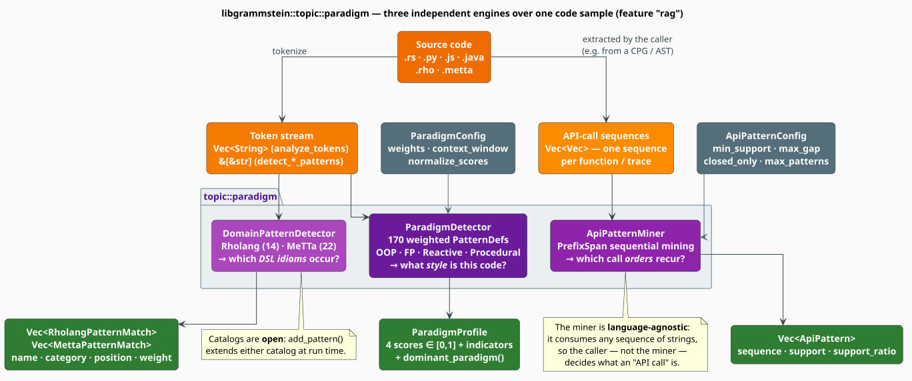

# Paradigm Analysis: Overview

The **paradigm** subsystem answers three separate questions about a body of source code, each with
its own engine and its own output type:

| Question | Engine | Output |
|---|---|---|
| *What **style** is this code written in?* | `ParadigmDetector` | `ParadigmProfile` — four scores in $`[0,1]`$ |
| *Which call **orders** recur across it?* | `ApiPatternMiner` | `Vec<ApiPattern>` — frequent sequences |
| *Which **DSL idioms** does it use?* | `DomainPatternDetector` | `Vec<RholangPatternMatch>` / `Vec<MettaPatternMatch>` |

The three engines are **independent**. They share a philosophy — *evidence from literal tokens,
weighted and accumulated* — but no state, and any one may be used on its own.

> **Scope.** Source of truth: [`src/topic/paradigm/`](../../../src/topic/paradigm/) —
> [`mod.rs`](../../../src/topic/paradigm/mod.rs),
> [`detector.rs`](../../../src/topic/paradigm/detector.rs),
> [`indicators.rs`](../../../src/topic/paradigm/indicators.rs),
> [`api_patterns.rs`](../../../src/topic/paradigm/api_patterns.rs),
> [`domain_patterns.rs`](../../../src/topic/paradigm/domain_patterns.rs) and
> [`config.rs`](../../../src/topic/paradigm/config.rs). This page is the hub; the mechanics live in
> [Detection](detection.md), [Indicators](indicators.md), [API Patterns](api-patterns.md) and
> [Domain Patterns](domain-patterns.md).

## 1. Availability

The module compiles only under the **`rag`** feature, because it ships inside `topic`:

```toml
[dependencies]
libgrammstein = { version = "*", features = ["rag"] }
```

Every type is reachable by two paths — the module itself, or the flattened `topic` re-export:

```rust
// canonical path
use libgrammstein::topic::paradigm::{Paradigm, ParadigmConfig, ParadigmDetector};
// …or through the topic re-export (the identical types)
use libgrammstein::topic::{ParadigmDetector, ParadigmProfile};
```

**Acronyms.** *OOP* — Object-Oriented Programming; *FP* — Functional Programming; *DSL* —
Domain-Specific Language; *AST* — Abstract Syntax Tree; *API* — Application Programming Interface.

## 2. The subsystem at a glance



Note what does **not** appear in that figure: there is no parser, no AST, and no regular-expression
engine. Every engine matches **literal, lower-cased token sequences** against a table of patterns.
That is a deliberate trade, examined next.

## 3. Why literal tokens, and not a grammar?

A paradigm is a *style*, not a construct. The evidence for "this is object-oriented" is diffuse: it
is the density of `class`, `extends`, `this` and `new` across a file, not any single parse node.
Three consequences follow, and together they set the design.

1. **Recall matters more than precision.** A missed `class` costs more than a spurious `get`,
   because scores aggregate over hundreds of tokens and isolated errors wash out. Literal matching
   has perfect recall on the tokens it knows.
2. **The input is often broken.** Paradigm detection is most useful exactly where code will not
   parse — a half-typed editor buffer, a diff hunk, a snippet inside a comment. A grammar-based
   detector returns nothing on such input; a token scanner degrades gracefully.
3. **Cost must stay linear.** The detector runs over whole corpora. Section 6 shows it is
   $`O(n \cdot k)`$ in the token count $`n`$ — one hash probe per token, not a parse.

The price is worth stating plainly: **the detector cannot see structure.** It cannot distinguish a
`class` keyword from the word *class* inside a string literal or a comment, and it cannot tell
whether `map` is a higher-order call or a variable named `map`. Where structure matters, either
feed the detector a token stream from a real lexer (see
[Detection §7](detection.md#7-the-tokenizer-contract)) or use the [code](../code/overview.md)
module, whose tree-sitter front end does build an AST.

> **Precision, quantified.** The weak tier ($`w = 0.3`$) exists precisely because of this
> blindness. Tokens such as `public`, `let`, `if` and `;` are ambient in nearly every language, so
> they are admitted as evidence but weighted at one third of a strong indicator. The weighting
> *is* the precision mechanism.

## 4. The evidence model, in one equation

All three engines reduce to *counting weighted evidence*. For the detector this is a single sum.
Write $`\Pi_p`$ for the pattern table of paradigm $`p`$, $`M_\pi`$ for the set of positions at which
pattern $`\pi`$ matches, $`w_\pi \in \{0.3,\ 0.6,\ 0.9\}`$ for its weight, $`\mathrm{conf}(\pi, i)`$
for the confidence of the match at position $`i`$, $`\mu_p`$ for the paradigm's multiplier, and
$`n`$ for the token count. Then the score reported for paradigm $`p`$ is

```math
\hat{S}_p \;=\; \min\Bigl(1,\ \frac{100}{\max(n,\, 1)} \sum_{\pi \in \Pi_p} \sum_{i \in M_\pi} w_\pi \cdot \mathrm{conf}(\pi, i) \cdot \mu_p \Bigr) \tag{P1}
```

Every symbol is defined again, from first principles, in [Detection §2](detection.md#2-notation),
where $`(\mathrm{P1})`$ is derived step by step. Three of its properties explain most of the
subsystem's observable behaviour:

- **It is a density, not a proportion.** The $`100 / n`$ factor makes $`\hat{S}_p`$ a score *per one
  hundred tokens*, so a long file is not automatically more object-oriented than a short one.
- **It saturates.** The $`\min(1, \cdot)`$ cap pins any paradigm exceeding one unit of match-weight
  per 100 tokens at exactly $`1.0`$.
- **It is not a probability.** The four scores do not sum to $`1`$ unless you ask for that
  explicitly, with [`ParadigmProfile::normalize`](indicators.md#6-normalisation-and-merging).

## 5. The type surface

Exactly these types are exported from `topic::paradigm`. The table is exhaustive: if a name is not
in it, the module does not define it.

| Type | Kind | Role | Documented in |
|---|---|---|---|
| `Paradigm` | enum (5) | OOP · FP · Reactive · Procedural · Mixed | [Indicators](indicators.md#3-the-paradigm-enum) |
| `ParadigmProfile` | struct | the four scores, the matched indicators, the counters | [Indicators](indicators.md#4-the-profile) |
| `ParadigmIndicator` | struct | one match: paradigm, category, pattern, weight, position | [Indicators](indicators.md#5-indicators) |
| `IndicatorCategory` | enum (19) | the sub-category a match belongs to | [Indicators](indicators.md#2-the-taxonomy) |
| `OopIndicator`, `FpIndicator`, `ReactiveIndicator`, `ProceduralIndicator` | enums | descriptive vocabulary for callers | [Indicators](indicators.md#8-the-descriptive-indicator-enums) |
| `ParadigmDetector` | struct | the detection engine | [Detection](detection.md) |
| `DetectionResult` | struct | profile, matches and statistics | [Detection](detection.md#6-detectionresult) |
| `IndicatorMatch` | struct | a match together with its surrounding context | [Detection](detection.md#6-detectionresult) |
| `ParadigmConfig` | struct | weights, context window, normalisation | [Detection](detection.md#8-the-configuration-surface) |
| `ParadigmWeights` | struct | per-paradigm multipliers and bonuses | [Detection](detection.md#8-the-configuration-surface) |
| `LanguageHints` | struct | per-language keyword vocabularies | [Detection](detection.md#9-language-hints) |
| `ApiPatternMiner` | struct | the PrefixSpan miner | [API Patterns](api-patterns.md) |
| `ApiPattern` | struct | one mined sequence and its support | [API Patterns](api-patterns.md#6-the-apipattern-record) |
| `ApiPatternConfig` | struct | support thresholds, gaps, closedness | [API Patterns](api-patterns.md#7-configuration) |
| `MiningStats` | struct | counters describing a mining run | [API Patterns](api-patterns.md#6-the-apipattern-record) |
| `DomainPatternDetector` | struct | the Rholang and MeTTa engine | [Domain Patterns](domain-patterns.md) |
| `RholangPattern`, `RholangPatternCatalog`, `RholangPatternCategory`, `RholangPatternMatch` | struct/enum | the Rholang catalog | [Domain Patterns](domain-patterns.md#3-the-rholang-catalog) |
| `MettaPattern`, `MettaPatternCatalog`, `MettaPatternCategory`, `MettaPatternMatch` | struct/enum | the MeTTa catalog | [Domain Patterns](domain-patterns.md#4-the-metta-catalog) |

One type is deliberately missing from that list: **`DetectionStats`**. It is `pub`, and its values
are readable through the `DetectionResult::stats` field, but it is not re-exported — so the *name*
cannot be imported. Read its fields; do not try to `use` it.

## 6. Cost

Let $`n`$ be the token count; $`k`$ the number of patterns sharing one first token (a small
constant — at most 3 in the shipped tables); $`C`$ the size of a domain catalog ($`C \leq 22`$);
$`L`$ the longest pattern; and $`\mathcal{D}`$ the sequence database handed to the miner.

| Engine | Time | Space | Why |
|---|---|---|---|
| `ParadigmDetector::analyze` | $`O(n \cdot k)`$ | $`O(m)`$ for $`m`$ matches | one hash probe per token, then $`k`$ literal comparisons |
| `DomainPatternDetector::detect_*` | $`O(C \cdot n \cdot L)`$ | $`O(m)`$ | every pattern is tried at every position |
| `ApiPatternMiner::mine` | output-sensitive, bounded by `max_pattern_length` and `max_patterns` | $`O(\lvert \mathcal{D} \rvert)`$ cursors | prefix projection stores cursors, never suffixes |

The detector is the fast path by an order of magnitude, because it is the only engine with an
index. The domain detector's $`C \cdot n`$ scan is affordable only because $`C`$ is tiny.

## 7. A worked example, end to end

```rust
use libgrammstein::topic::paradigm::{
    ApiPatternConfig, ApiPatternMiner, DomainPatternDetector, Paradigm, ParadigmDetector,
};

// --- 1. What style is this? ---
let detector = ParadigmDetector::with_defaults();
let profile = detector.analyze(
    "const total = items.map(x => x.price).filter(p => p > 0).reduce((a, b) => a + b, 0);",
);
// `const`, `map`, `filter`, `reduce` all fire as FP patterns; nothing OOP does.
assert!(profile.fp_score > profile.oop_score);

// `dominant_paradigm` returns an Option: None when nothing clears the floor,
// Some(Mixed) when the top two scores are within 0.1 of each other.
if let Some(paradigm) = profile.dominant_paradigm() {
    println!("dominant: {paradigm}");           // Display prints the short name, e.g. "FP"
}

// --- 2. Which call orders recur? ---
let mut miner = ApiPatternMiner::new(
    ApiPatternConfig::default()
        .with_min_support(0.5)
        .with_min_support_count(2),
);
let sequences = vec![
    vec!["open", "read", "close"],
    vec!["open", "write", "close"],
    vec!["open", "read", "seek", "close"],
];
let patterns = miner.mine(&sequences);          // note: `mine` takes &mut self (it interns)
// "open → close" holds in all three sequences, so it sorts first (support 3).
assert_eq!(patterns[0].to_string_pattern(), "open -> close");
assert_eq!(patterns[0].support, 3);

// --- 3. Which DSL idioms appear? ---
let domain = DomainPatternDetector::new();
let tokens = ["contract", "foo", "(", "@", "arg", ",", "ret", ")"];
let matches = domain.detect_rholang_patterns(&tokens);
assert!(matches.iter().any(|m| m.pattern_name == "contract_definition"));
```

The three engines are composed by the *caller*, not by the library. There is no umbrella
"analyse everything" entry point, and none is needed: each engine consumes a different shape of
input (a string, a sequence database, a token slice) and none feeds another.

## 8. Where to go next

| Document | Covers |
|---|---|
| [Detection](detection.md) | the matching pipeline, confidence, scoring, normalisation, configuration, the tokenizer contract |
| [Indicators](indicators.md) | the 19-category taxonomy, the weight tiers, the profile, the dominance rule |
| [API Patterns](api-patterns.md) | PrefixSpan, support, gap constraints, closed patterns |
| [Domain Patterns](domain-patterns.md) | the Rholang (14) and MeTTa (22) catalogs, and how to extend them |

## References

1. R. W. Floyd (1979). *The paradigms of programming.* Communications of the ACM 22(8), 455–460.
   [doi:10.1145/359138.359140](https://doi.org/10.1145/359138.359140) — the Turing-Award lecture
   that framed a paradigm as a reusable *style* rather than a language feature. It is the premise
   of this module: style is observable, and worth measuring.
2. E. Bainomugisha, A. L. Carreton, T. Van Cutsem, S. Mostinckx & W. De Meuter (2013). *A survey on
   reactive programming.* ACM Computing Surveys 45(4), Article 52.
   [doi:10.1145/2501654.2501666](https://doi.org/10.1145/2501654.2501666) — the taxonomy behind the
   four `Reactive*` indicator categories.
3. J. Pei, J. Han, B. Mortazavi-Asl, J. Wang, H. Pinto, Q. Chen, U. Dayal & M.-C. Hsu (2004).
   *Mining sequential patterns by pattern-growth: the PrefixSpan approach.* IEEE Transactions on
   Knowledge and Data Engineering 16(11), 1424–1440.
   [doi:10.1109/TKDE.2004.77](https://doi.org/10.1109/TKDE.2004.77) — the algorithm behind
   `ApiPatternMiner`.

## See also

- [Topic Overview](../topic/overview.md) — the `topic` module this subsystem ships inside
- [Code Overview](../code/overview.md) — the AST-based analyser, for when structure matters
- [Subtree Mining](../code/subtree-mining.md) — frequent-pattern mining over *trees* rather than sequences
