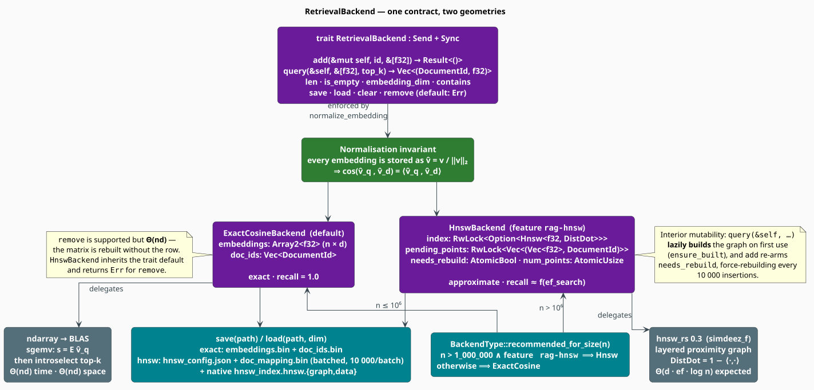
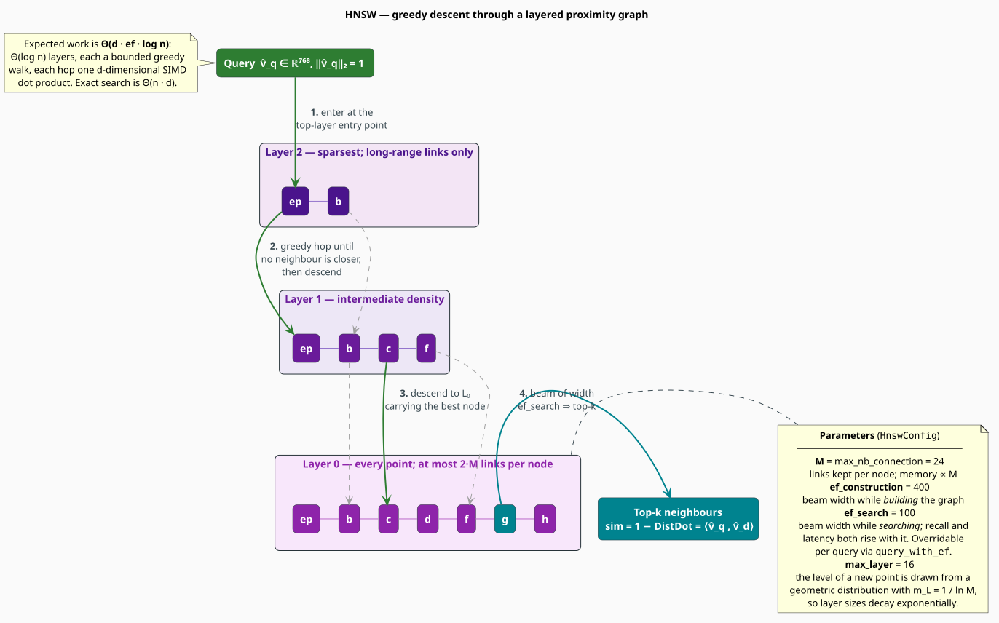

# Retrieval Backends

A **retrieval backend** owns the *geometry* of the index: it stores one unit vector per document
and answers a single question — *which $`k`$ documents point most nearly in the direction of this
query?* libgrammstein ships two, behind one trait. `ExactCosineBackend` answers exactly, by brute
force through a BLAS matrix-vector product. `HnswBackend` answers approximately, by navigating a
layered proximity graph. This document derives both, states their costs honestly, and explains the
invariant that lets a cosine ranking fall out of a Euclidean data structure.

> **Scope.** Source of truth: [`src/rag/backend.rs`](../../../src/rag/backend.rs) (the trait),
> [`src/rag/exact_backend.rs`](../../../src/rag/exact_backend.rs), and
> [`src/rag/hnsw_backend.rs`](../../../src/rag/hnsw_backend.rs) (feature `rag-hnsw`). For the
> cosine theory see [Overview](overview.md#theory-why-cosine-similarity); for the metadata half of
> the index see [Index](index.md).

## Notation

Every symbol below is defined before it is used in a formula.

| Symbol | Meaning |
|---|---|
| $`n`$ | number of indexed documents |
| $`d`$ | embedding dimension ($`768`$ for ModernBERT-base) |
| $`k`$ | number of results requested (`top_k`) |
| $`v`$ | a raw embedding, $`v \in \mathbb{R}^{d}`$ |
| $`\hat{v}`$ | its unit form, $`\hat{v} = v / \lVert v \rVert_2`$ |
| $`E`$ | the stored embedding matrix, $`E \in \mathbb{R}^{n \times d}`$, whose rows are the $`\hat{v}`$ |
| $`s`$ | the score vector, $`s \in \mathbb{R}^{n}`$, one cosine similarity per document |
| $`\langle u, v \rangle`$ | the inner product $`\sum_{i=1}^{d} u_i v_i`$ |
| $`M`$ | HNSW graph degree (`max_nb_connection`) |
| $`\mathrm{ef}`$ | HNSW beam width (`ef_search` at query time, `ef_construction` at build time) |
| $`m_L`$ | HNSW level-generation constant, $`m_L = 1/\ln M`$ |
| $`G`$ | the true top-$`k`$ set (ground truth); $`A`$ the approximate set returned |

**Acronyms.** *ANN* — Approximate Nearest Neighbor; *HNSW* — Hierarchical Navigable Small World;
*BLAS* — Basic Linear Algebra Subprograms; *SIMD* — Single Instruction, Multiple Data.

## The contract

```rust
pub trait RetrievalBackend: Send + Sync {
    fn add(&mut self, id: DocumentId, embedding: &[f32]) -> Result<()>;
    fn query(&self, embedding: &[f32], top_k: usize) -> Vec<(DocumentId, f32)>;
    fn len(&self) -> usize;
    fn embedding_dim(&self) -> usize;
    fn save(&self, path: &Path) -> Result<()>;
    fn load(path: &Path, embedding_dim: usize) -> Result<Self> where Self: Sized;
    fn clear(&mut self);
    fn contains(&self, id: DocumentId) -> bool;

    fn is_empty(&self) -> bool { self.len() == 0 }               // provided
    fn remove(&mut self, id: DocumentId) -> Result<bool> {       // provided: opt-in
        Err(RagError::IndexError("Removal not supported by this backend".to_string()))
    }
}
```

Three details of this signature do real work:

- **`Send + Sync`** — a backend may be shared across threads behind an `Arc`, which is what lets
  one `RagIndex` serve concurrent queries (see [Threading Model](../../architecture/threading.md)).
- **`query(&self, …)`** — searching takes a *shared* reference. A backend that must mutate to
  search (as HNSW does, when it lazily builds its graph) has to do so under interior mutability.
- **`remove` is a provided method that fails by default.** Removal is genuinely hard for a
  proximity graph, so the trait declines to demand it; `ExactCosineBackend` overrides it and
  `HnswBackend` does not.



## The normalization invariant

Both backends enforce one invariant on entry, in `normalize_embedding`:

```math
\hat{v} \;=\; \frac{v}{\lVert v \rVert_2}
\qquad\text{so that}\qquad
\lVert \hat{v} \rVert_2 = 1 \tag{B1}
```

with a guard: if $`\lVert v \rVert_2 = 0`$ the vector is stored unchanged (dividing by zero would
produce `NaN`, which would poison every subsequent comparison). A zero vector therefore scores
$`0`$ against everything and is simply never retrieved.

$`(\mathrm{B1})`$ is what makes cosine similarity cheap. By the unit-vector identity
$`(\mathrm{R2})`$ of the [Overview](overview.md#the-unit-vector-identity-that-makes-it-fast),

```math
\cos(\hat{u}, \hat{v}) \;=\; \langle \hat{u}, \hat{v} \rangle \tag{B2}
```

so a similarity is a dot product and nothing more. The module still exports the general helpers —
`dot_product(a, b)` and `cosine_similarity(a, b)`, the latter re-deriving both norms and returning
$`0`$ when either is zero — but the hot path never calls the general form.

> **Release-mode caveat.** `dot_product` checks equal lengths with `debug_assert_eq!`. In a release
> build a length mismatch is *not* caught: `zip` silently truncates to the shorter slice and
> returns a partial sum. Callers outside the backends should compare `embedding_dim()` first.

## `ExactCosineBackend`

### Scoring is one matrix-vector product

Stack the $`n`$ stored unit vectors as the rows of $`E \in \mathbb{R}^{n \times d}`$ (an
`ndarray::Array2<f32>`). Normalize the query to $`\hat{v}_q`$. Then **every** score is computed at
once:

```math
s \;=\; E\,\hat{v}_q \;\in\; \mathbb{R}^{n},
\qquad
s_i \;=\; \bigl\langle \hat{v}_{D_i},\ \hat{v}_q \bigr\rangle \;=\; \cos(v_{D_i},\, v_q) \tag{B3}
```

This is a single BLAS `sgemv` (`self.embeddings.dot(&query)`), which is cache-friendly, vectorized,
and — because $`E`$ is row-major and contiguous — reads memory in perfect streaming order. The
result $`s`$ is *exactly* the cosine similarity vector: recall is $`1`$ by construction, with no
tuning parameter to get wrong.

### Selecting the top $`k`$ without sorting

Sorting $`s`$ in full would cost $`\Theta(n \log n)`$, which is wasteful when $`k \ll n`$. The
backend instead uses **partial selection**: `select_nth_unstable_by` partitions $`s`$ about the
$`k`$-th largest element, so the first $`k`$ entries are the top $`k`$ in *some* order. Only those
are then sorted.

```math
\underbrace{\Theta(nd)}_{\text{scoring } (\mathrm{B3})}
\;+\;
\underbrace{O(n)}_{\text{selection, expected}}
\;+\;
\underbrace{O(k \log k)}_{\text{final sort}}
\;=\;
\Theta(nd) \quad\text{for } k \ll n \tag{B4}
```

Linear-time selection is the classical result of Blum, Floyd, Pratt, Rivest & Tarjan
[[1]](#references); Rust's `select_nth_unstable_by` is an introselect-style hybrid that attains it
in expectation. The $`\Theta(nd)`$ scoring term dominates: at $`n = 10^{6}`$ and $`d = 768`$ the
backend touches $`3.1`$ GB per query, and the wall-clock cost is memory bandwidth, not arithmetic.

> **Silent-empty caveat.** `query` returns an **empty vector** — not an error — when the index is
> empty *or* when `embedding.len() != embedding_dim`. A query embedded by the wrong model therefore
> yields "no results" rather than a dimension-mismatch failure. Check `embedding_dim()` when
> wiring a new encoder.

### Costs

| Operation | Cost | Note |
|---|---|---|
| `add` | $`\Theta(d)`$ amortized | row appended to $`E`$; geometric regrowth, $`\Theta(nd)`$ on realloc |
| `query` | $`\Theta(nd)`$ | $`(\mathrm{B4})`$ |
| `remove` | $`\Theta(nd)`$ | the matrix is **rebuilt** row by row without the removed one |
| `contains` | $`O(n)`$ | linear scan of `doc_ids` |
| memory | $`4nd`$ bytes | plus $`4n`$ bytes of `DocumentId` |

Removal is supported but expensive, and `remove` is *rare by design*: the doc comment says so, and
the implementation reflects it. Deleting many documents is better served by rebuilding the index.

> **Preallocation gap.** `ExactCosineBackend::with_capacity(dim, capacity)` reserves capacity for
> the `doc_ids` vector, but the embedding matrix is still created as `Array2::zeros((0, dim))` and
> grows by reallocation. The `capacity` argument therefore does *not* preallocate the dominant
> allocation ($`4nd`$ bytes vs $`4n`$). Callers who know $`n`$ in advance still pay the regrowth
> copies.

## `HnswBackend`

### Why exact search stops scaling

$`(\mathrm{B4})`$ is linear in $`n`$, and no amount of SIMD changes that. Classical spatial indices
(k-d trees and friends) do not rescue it either: in high dimension they degrade to a full scan —
the *curse of dimensionality*. The standard escape is to relax exactness. **Approximate nearest
neighbor** search [[2]](#references) accepts a small probability of missing a true neighbor in
exchange for a sublinear query, and it is measured by **recall**:

```math
\mathrm{recall@}k \;=\; \frac{\lvert A \cap G \rvert}{k}
\qquad
\begin{aligned}
G &= \text{the true top-}k\ \text{set} \\
A &= \text{the returned set},\ \lvert A \rvert = k
\end{aligned} \tag{B5}
```

Recall is not fixed by the algorithm; it is *bought* with search effort — the `ef_search` knob
below. Benchmarking methodology for the recall/throughput trade-off is standardized by
ANN-Benchmarks [[3]](#references).

### The HNSW idea

**HNSW** [[4]](#references) combines two older ideas. From **skip lists** [[5]](#references) it
takes a *hierarchy*: a stack of graphs, sparse at the top and complete at the bottom, so that a
search can take enormous strides before refining. From **navigable small-world graphs**
[[6]](#references) it takes the insight that a graph with both short-range and long-range links can
be traversed greedily to a target in a logarithmic number of hops.

A point entering the index is assigned a top level $`\ell`$ drawn from a geometric distribution,

```math
\ell \;=\; \bigl\lfloor -\ln(\mathrm{Uniform}(0,1)) \cdot m_L \bigr\rfloor,
\qquad
m_L \;=\; \frac{1}{\ln M} \tag{B6}
```

so that the expected number of layers is $`\Theta(\log n)`$ and each layer holds a geometrically
decaying fraction of the points. The point is linked to at most $`M`$ neighbors on every layer it
occupies (and up to $`2M`$ on layer $`0`$, which holds *all* points).



A query then descends the hierarchy: starting at the single entry point on the top layer, it hops
greedily to ever-closer neighbors until no neighbor improves, drops one layer, and repeats. On
layer $`0`$ it widens into a best-first beam search of width $`\mathrm{ef}`$, and the $`k`$ best of
those candidates are returned. The expected cost is

```math
\underbrace{\Theta(\log n)}_{\text{layers}}
\;\times\;
\underbrace{\Theta(\mathrm{ef})}_{\text{beam per layer}}
\;\times\;
\underbrace{\Theta(d)}_{\text{one distance}}
\;=\;
\Theta\bigl(d \cdot \mathrm{ef} \cdot \log n\bigr) \tag{B7}
```

against $`\Theta(nd)`$ for exact search: logarithmic, not linear, in the corpus size. That is the
whole point.

### The `DistDot` trick

`hnsw_rs` is a *metric* structure — it wants a distance, not a similarity. libgrammstein supplies
`DistDot`, defined on unit vectors as

```math
\mathrm{DistDot}(\hat{u}, \hat{v}) \;=\; 1 - \langle \hat{u}, \hat{v} \rangle
\qquad\Longrightarrow\qquad
\mathrm{sim} \;=\; 1 - \mathrm{DistDot} \tag{B8}
```

which is exactly the inversion the backend performs on every returned neighbor
(`let similarity = 1.0 - neighbor.distance;`). This is sound precisely because of the invariant
$`(\mathrm{B1})`$: by $`(\mathrm{R3})`$ of the [Overview](overview.md#the-unit-vector-identity-that-makes-it-fast),
$`\lVert \hat{u} - \hat{v} \rVert_2^{2} = 2 - 2\langle \hat{u}, \hat{v} \rangle`$, so Euclidean
distance is a strictly increasing function of $`\mathrm{DistDot}`$ on the unit sphere, and the two
induce **the same ranking**. Greedy graph traversal under `DistDot` therefore converges to the same
neighbors that cosine similarity would have chosen. Without normalization, this equivalence
collapses — which is why $`(\mathrm{B1})`$ is an invariant rather than an optimization.

### Parameters

```rust
pub struct HnswConfig {
    pub max_nb_connection: usize, // M — links per node.       default 24
    pub ef_construction: usize,   // build-time beam width.    default 400
    pub ef_search: usize,         // query-time beam width.    default 100
    pub max_layer: usize,         // hierarchy depth cap.      default 16
}
```

| Parameter | Raising it… | Costs |
|---|---|---|
| `max_nb_connection` ($`M`$) | improves recall and graph connectivity | memory $`\propto M`$; slower build |
| `ef_construction` | improves *graph quality* once, at build time | build time $`\propto \mathrm{ef}_{c}`$ |
| `ef_search` | improves recall per $`(\mathrm{B5})`$ | query latency $`\propto \mathrm{ef}`$, per $`(\mathrm{B7})`$ |
| `max_layer` | allows deeper hierarchies | $`16`$ already suffices for billions of points, per $`(\mathrm{B6})`$ |

`ef_search` is the only one that can be changed *per query*, via `query_with_ef` — so a latency
budget can be traded against recall at call time, without rebuilding anything.

> **Export gap.** `HnswConfig` and `HnswStats` are `pub` inside the private `hnsw_backend` module,
> but `src/rag/mod.rs` re-exports only `HnswBackend`. Downstream crates therefore cannot *name*
> these types, which makes `HnswBackend::with_config`, `set_config`, and `stats` unusable from
> outside libgrammstein. Use `HnswBackend::new(dim)` (which applies the defaults above) until the
> re-export is widened.

### Lazy building and interior mutability

The graph is **not** built as documents arrive. Instead:

```rust
pub struct HnswBackend {
    index: RwLock<Option<Hnsw<'static, f32, DistDot>>>,     // None until first build
    pending_points: RwLock<Vec<(Vec<f32>, DocumentId)>>,    // the id map, and the build input
    needs_rebuild: AtomicBool,                              // lock-free staleness check
    num_points: AtomicUsize,                                // lock-free len()
    embedding_dim: usize,
    config: HnswConfig,
}
```

`add` merely pushes to `pending_points` and sets `needs_rebuild`. The graph is materialized by
`ensure_built`, called from every query path: it reads `needs_rebuild` (an `Acquire` load — no lock
in the common, already-built case) and rebuilds only if stale. This is what allows `query(&self, …)`
to satisfy the trait's shared-reference signature while still mutating.

`pending_points` is doing double duty, and this is the key to reading the code: it is both the
*input* to the next build **and** the permanent `graph index → DocumentId` map. `hnsw_rs` knows
points only by their insertion ordinal, so `pending_points[i].1` is how the backend recovers a
`DocumentId` from a returned neighbor.

#### Bulk-loading hazard

`RetrievalBackend::add` force-rebuilds the graph *from scratch* every $`10\,000`$ insertions
(`if new_count % 10000 == 0`). Building a corpus of $`n`$ documents with repeated `add` therefore
performs $`B = \lceil n / 10^{4} \rceil`$ **full** builds, whose total work is

```math
\sum_{i=1}^{B} \Theta\bigl(10^{4}\, i \cdot \log(10^{4} i)\bigr)
\;=\; \Theta\bigl(B^{2} \cdot 10^{4} \log n\bigr) \tag{B9}
```

— quadratic in the number of blocks. At $`n = 10^{6}`$ that is $`100`$ rebuilds and roughly
$`50\times`$ the work of a single build. **Use `batch_add`**, which appends to `pending_points` and
arms `needs_rebuild` exactly once, then let the first query (or an explicit `force_rebuild`) build
the graph a single time.

### The `'static` transmute

`build_index` and `load_native_graph` each end with

```rust
let hnsw_static: Hnsw<'static, f32, DistDot> = unsafe { std::mem::transmute(hnsw) };
```

The lifetime parameter of `hnsw_rs::Hnsw` exists to support memory-mapped reloads, where the graph
borrows from a mapping. libgrammstein does not use that mode: `parallel_insert` **copies** the
point data into the index, and `HnswIo` with the default `ReloadOptions` fully deserializes it
(no `mmap`). The graph therefore owns everything it references, and the `'static` claim is
sound — but it is a claim the compiler cannot check, which is why the safety argument is spelled
out at both call sites. Enabling mmap-backed reload would invalidate it.

### The extended query surface

Beyond the trait's `query`, `HnswBackend` exposes three methods that the exact backend has no
analogue for:

| Method | Purpose |
|---|---|
| `query_with_ef(v, k, ef)` | trade recall against latency **per query** |
| `batch_query_with_ef(&[&[f32]], k, ef)` | `parallel_search` — one rayon-parallel sweep for many queries |
| `query_with_filter(v, k, ef, pred)` | restrict results to ids satisfying `pred` |

`query_with_filter` is the interesting one: the predicate is applied **during graph traversal**
(`search_filter` over a set of allowed ordinals), not as a post-filter on the results. A post-filter
would have to over-fetch blindly and could still come up short; filtering inside the traversal keeps
the beam focused on admissible candidates. Note the current implementation first materializes the
allowed set by evaluating `pred` over **every** pending point — an $`O(n)`$ pass — so a
highly selective filter is efficient in the graph but still pays a linear scan to set up.

### Costs

| Operation | Cost | Note |
|---|---|---|
| `add` | $`\Theta(d)`$ + a full rebuild every $`10^{4}`$ | see $`(\mathrm{B9})`$ |
| `batch_add` | $`\Theta(d)`$ per point, **no** rebuild | the bulk-load path |
| `query` | $`\Theta(d \cdot \mathrm{ef} \cdot \log n)`$ expected | $`(\mathrm{B7})`$ |
| `contains` | $`O(n)`$ | linear scan of `pending_points` |
| `remove` | **unsupported** | inherits the trait default: `Err(IndexError)` |
| memory | $`4nd`$ (points) + $`\approx 8nM`$ (graph) | as estimated by `stats()` |

> **`stats().layer_counts` is a coarse stand-in.** It reports `vec![num_points]` — a single-element
> vector holding the total — rather than a true per-layer histogram. Treat `num_points`,
> `embedding_dim`, `is_built`, and `estimated_memory_bytes` as meaningful, and `layer_counts` as
> a whole-index total rather than a per-layer breakdown.

## Choosing a backend

`BackendType::recommended_for_size` encodes the rule of thumb:

```
function recommended_for_size(n):
    if n > 1_000_000 and feature "rag-hnsw" is enabled:   ▸ the cfg is compiled in or out
        return Hnsw
    return ExactCosine                                    ▸ the default, and the fallback
```

Without the `rag-hnsw` feature the first branch does not exist, so the function returns
`ExactCosine` for every $`n`$ — a compile-time, not a runtime, decision.

| Prefer | When |
|---|---|
| `ExactCosineBackend` | $`n \lesssim 10^{6}`$; recall must be exactly $`1`$; documents are removed |
| `HnswBackend` | $`n \gtrsim 10^{6}`$; a recall of $`0.95`$–$`0.99`$ is acceptable; the corpus is append-only |

For context, billion-scale deployments typically add quantization on top of a graph index
[[7]](#references); libgrammstein stores full `f32` vectors, so its practical ceiling is set by
$`4nd`$ bytes of RAM.

## Persistence

Both backends write a **directory**, not a file.

| Backend | File | Contents |
|---|---|---|
| Exact | `embeddings.bin` | `bincode`: header $`(n, d)`$, then the flat row-major `f32` matrix |
| Exact | `doc_ids.bin` | `bincode`: `Vec<DocumentId>`, parallel to the matrix rows |
| HNSW | `hnsw_config.json` | pretty JSON of `HnswConfig` |
| HNSW | `doc_mapping.bin` | `bincode`: header $`(n, d, \text{version} = 2)`$, batch count, then batches |
| HNSW | `hnsw_index.hnsw.graph` / `.data` | the native `hnsw_rs` dump, written only if the graph is built |

`load` checks the stored $`d`$ against the caller's `embedding_dim` and fails with
`RagError::IndexError` on mismatch — the one dimension check that *is* an error rather than an
empty result.

**Why the HNSW mapping is batched.** Serializing $`10^{6}`$ vectors of $`768`$ dimensions in one
`bincode` call would materialize $`\approx 3`$ GB of intermediate buffers. The v2 format instead
writes `SERIALIZATION_BATCH_SIZE = 10_000` vectors at a time, bounding the peak at
$`10^{4} \times 768 \times 4 \approx 30`$ MB. The reader still accepts the unbatched **v1** layout
(all embeddings, then all ids), so old indices load.

**Why the native graph dump matters.** If `hnsw_index.hnsw.graph` and `.data` are present, `load`
reloads the graph structure directly; otherwise it falls back to rebuilding from `pending_points`,
which is correct but pays the full construction cost. A `save` performed before the graph was ever
built writes no graph files — so `save`-ing a freshly-`batch_add`-ed backend and reloading it will
rebuild. Call `force_rebuild()` before `save` to avoid that.

## Usage

```rust
use libgrammstein::rag::{cosine_similarity, ExactCosineBackend, DocumentId, RetrievalBackend};

let mut backend = ExactCosineBackend::new(3);
backend.add(DocumentId::new(0), &[1.0, 0.0, 0.0])?;
backend.add(DocumentId::new(1), &[0.0, 1.0, 0.0])?;
backend.add(DocumentId::new(2), &[0.9, 0.1, 0.0])?;   // stored as a unit vector

// Scores are cosine similarities; the query need not be normalized by the caller.
let hits = backend.query(&[1.0, 0.0, 0.0], 2);
assert_eq!(hits[0].0, DocumentId::new(0));            // cos = 1.0
assert_eq!(hits[1].0, DocumentId::new(2));            // cos ≈ 0.994

// The general helper, for scoring outside the index:
assert!((cosine_similarity(&[1.0, 0.0], &[1.0, 0.0]) - 1.0).abs() < 1e-6);
assert!(cosine_similarity(&[1.0, 0.0], &[0.0, 1.0]).abs() < 1e-6);
# Ok::<(), libgrammstein::rag::RagError>(())
```

Bulk-loading the approximate backend (feature `rag-hnsw`), avoiding the rebuild hazard of
$`(\mathrm{B9})`$:

```rust
# #[cfg(feature = "rag-hnsw")]
# fn main() -> Result<(), libgrammstein::rag::RagError> {
use libgrammstein::rag::{DocumentId, HnswBackend, RetrievalBackend};

let mut backend = HnswBackend::new(768);

// One pass, one rebuild: batch_add never triggers an intermediate build.
let docs = (0..100_000u32).map(|i| (DocumentId::new(i), vec![0.01 * i as f32; 768]));
backend.batch_add(docs)?;
backend.force_rebuild()?;                 // build once, explicitly, before saving

// Per-query recall/latency trade-off, without touching the graph:
let fast = backend.query_with_ef(&[0.5; 768], 10, 40);    // lower recall, lower latency
let careful = backend.query_with_ef(&[0.5; 768], 10, 400); // higher recall, higher latency
assert!(fast.len() <= 10 && careful.len() <= 10);
# Ok(())
# }
# #[cfg(not(feature = "rag-hnsw"))]
# fn main() {}
```

## References

1. M. Blum, R. W. Floyd, V. Pratt, R. L. Rivest & R. E. Tarjan (1973). *Time bounds for selection.*
   Journal of Computer and System Sciences 7(4), 448–461.
   [doi:10.1016/S0022-0000(73)80033-9](https://doi.org/10.1016/S0022-0000%2873%2980033-9)
2. P. Indyk & R. Motwani (1998). *Approximate nearest neighbors: towards removing the curse of
   dimensionality.* STOC '98, 604–613.
   [doi:10.1145/276698.276876](https://doi.org/10.1145/276698.276876)
3. M. Aumüller, E. Bernhardsson & A. Faithfull (2020). *ANN-Benchmarks: a benchmarking tool for
   approximate nearest neighbor algorithms.* Information Systems 87, 101374.
   [doi:10.1016/j.is.2019.02.006](https://doi.org/10.1016/j.is.2019.02.006)
4. Y. A. Malkov & D. A. Yashunin (2020). *Efficient and robust approximate nearest neighbor search
   using hierarchical navigable small world graphs.* IEEE TPAMI 42(4), 824–836.
   [doi:10.1109/TPAMI.2018.2889473](https://doi.org/10.1109/TPAMI.2018.2889473)
5. W. Pugh (1990). *Skip lists: a probabilistic alternative to balanced trees.* Communications of
   the ACM 33(6), 668–676.
   [doi:10.1145/78973.78977](https://doi.org/10.1145/78973.78977)
6. J. Kleinberg (2000). *Navigation in a small world.* Nature 406, 845.
   [doi:10.1038/35022643](https://doi.org/10.1038/35022643)
7. J. Johnson, M. Douze & H. Jégou (2021). *Billion-scale similarity search with GPUs.* IEEE
   Transactions on Big Data 7(3), 535–547.
   [doi:10.1109/TBDATA.2019.2921572](https://doi.org/10.1109/TBDATA.2019.2921572)

## See also

- [RAG Overview](overview.md) — the cosine theory these backends implement
- [Index](index.md) — the metadata half, and the existence invariant that guards removal
- [Retriever](retriever.md) — what happens to `Vec<(DocumentId, f32)>` after the backend returns it
- [Builder](builder.md) — bulk construction, and why it uses the exact backend
- [Threading Model](../../architecture/threading.md) — the `Send + Sync` discipline
- [Memory Optimization](../../architecture/memory-optimization.md) — the $`4nd`$ budget in context
