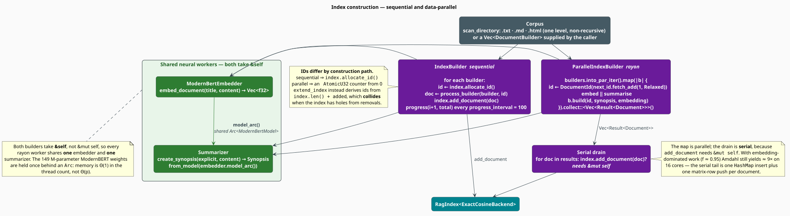

# The Index Builder

Building an index is an *embarrassingly parallel* problem wrapped around an *obstinately serial*
one. Encoding a document is expensive and independent of every other document; inserting the result
into the index is cheap but must happen one at a time. libgrammstein ships two builders that strike
that balance differently: `IndexBuilder` walks the corpus sequentially with a progress callback,
and `ParallelIndexBuilder` fans the encoding out across rayon's thread pool and drains the results
serially. This document explains both, quantifies the speedup available, and records the three
places where the two paths behave differently.

> **Scope.** Source of truth: [`src/rag/builder.rs`](../../../src/rag/builder.rs). For what a
> builder produces see [Document](document.md) and [Index](index.md); for the models it drives see
> [Neural Embedder](../neural/embedder.md) and [Summarizer](../neural/summarizer.md).

## Notation

| Symbol | Meaning |
|---|---|
| $`N`$ | number of documents to index |
| $`p`$ | number of worker threads (rayon's pool; by default, the core count) |
| $`f`$ | the *parallelizable fraction* of the total work |
| $`S(p)`$ | the speedup on $`p`$ threads relative to one thread |
| $`t_e`$ | wall-clock cost of embedding one document (a forward pass through ModernBERT) |
| $`t_i`$ | wall-clock cost of inserting one document into the index |

## The two builders



Both own exactly the same three things — an encoder, a summarizer, and a config — and both are
constructed identically:

```rust
pub struct IndexBuilder         { embedder: ModernBertEmbedder, summarizer: Summarizer, config: IndexBuilderConfig }
pub struct ParallelIndexBuilder { embedder: ModernBertEmbedder, summarizer: Summarizer, config: IndexBuilderConfig }
```

`new(config)` builds the encoder from `config.embedding_config`, then builds the summarizer *on top
of the encoder's model* rather than loading a second copy:

```rust
let embedder = ModernBertEmbedder::new(config.embedding_config.clone())?;
let summarizer = Summarizer::from_model(embedder.model_arc(), config.summarizer_config.clone())?;
```

`model_arc()` hands out an `Arc<ModernBertModel>`. The $`149`$-million-parameter encoder is
therefore held **once**, and the summarizer — which must embed candidate sentences to score them
against the document centroid — shares it. Loading two models here would double the resident weight
memory for no benefit.

## Shared, thread-safe models

The single most important fact about both builders is in their method signatures:

```rust
// IndexBuilder — note the shared reference:
pub fn build_from_builders(
    &self,
    builders: Vec<DocumentBuilder>,
    progress: Option<&dyn Fn(usize, usize)>,
) -> Result<RagIndex<ExactCosineBackend>>;

// ParallelIndexBuilder — likewise:
pub fn build_parallel(
    &self,
    builders: Vec<DocumentBuilder>,
) -> Result<RagIndex<ExactCosineBackend>>;
```

They take **`&self`**, not `&mut self`, because `ModernBertEmbedder::embed_document` and
`Summarizer::create_synopsis` are themselves `&self` methods. Every rayon worker therefore shares
*one* encoder and *one* summarizer. Memory for model weights is

```math
\Theta(1) \quad\text{in } p
\qquad\text{rather than}\qquad
\Theta(p) \tag{C1}
```

which is the difference between a $`16`$-thread build that fits in RAM and one that does not — at
roughly $`600`$ MB of `f32` weights per copy, $`\Theta(p)`$ would cost $`9.6`$ GB on $`16`$
threads.

## How much parallelism is actually available?

The parallel builder splits into a parallel map and a serial drain:

```rust
let results: Vec<Result<Document>> = builders
    .into_par_iter()
    .map(|builder| { /* embed + summarize — the expensive part */ })
    .collect();

let mut index = RagIndex::with_exact_backend(self.config.index_config.clone());
for result in results {
    index.add_document(result?)?;    // serial: add_document needs &mut self
}
```

Only the map is parallel, so **Amdahl's law** [[1]](#references) bounds the speedup. With a
parallelizable fraction $`f`$,

```math
S(p) \;=\; \frac{1}{(1 - f) + \dfrac{f}{p}} \tag{C2}
```

and here $`f`$ is the share of time spent embedding and summarizing rather than inserting:

```math
f \;=\; \frac{t_e}{t_e + t_i} \tag{C3}
```

The asymmetry between $`t_e`$ and $`t_i`$ is enormous. Embedding one document is a full transformer
forward pass — milliseconds. Inserting it is a `HashMap` insert plus one row appended to the
embedding matrix — microseconds. Taking $`f = 0.95`$ as a conservative estimate:

| $`p`$ | $`S(p)`$ by $`(\mathrm{C2})`$ | Efficiency $`S(p)/p`$ |
|---|---|---|
| $`4`$ | $`3.48`$ | $`87\%`$ |
| $`8`$ | $`5.93`$ | $`74\%`$ |
| $`16`$ | $`9.14`$ | $`57\%`$ |
| $`\infty`$ | $`20`$ | — |

The ceiling $`S(\infty) = 1/(1-f) = 20`$ is set by the serial drain, and no thread count escapes it.
Two practical consequences: throwing cores at a build has sharply diminishing returns past
$`\approx 16`$, and the drain is the thing to optimize if a build ever becomes insertion-bound
(pre-sizing the embedding matrix would be the first move — see
[Backend](backend.md#costs)).

## Configuration

```rust
pub struct IndexBuilderConfig {
    pub index_config: RagIndexConfig,           // embedding_dim, max_documents, store_content
    pub embedding_config: EmbeddingConfig,      // model, pooling, cache, batch size
    pub summarizer_config: SummarizerConfig,    // num_sentences, diversity_threshold, …
    pub batch_size: usize,                      // default 32
    pub generate_summaries: bool,               // default true
    pub progress_interval: usize,               // default 100
}
```

> **`batch_size` is inert.** It is declared, defaulted to $`32`$, printed by the `Debug` impl, and
> asserted in a unit test — but no code path in `builder.rs` reads it to batch anything. Documents
> are embedded one at a time via `embed_document`, never through `embed_batch`. Setting it has no
> effect today; batching the encoder is a genuine optimization the field is reserving space for.
> (`EmbeddingConfig::batch_size`, a *different* field, does drive `ModernBertEmbedder::embed_batch`
> when that method is called directly.)

## Sequential construction, literately

```
function build_from_builders(builders, progress):
    index <- RagIndex::with_exact_backend(index_config)
    total <- |builders|
    for i, builder in enumerate(builders):
        id  <- index.allocate_id()                 ▸ dense ids: 0, 1, 2, … — see Index (I3)
        doc <- ⟨Process one builder⟩
        index.add_document(doc)?                   ▸ the first error ABORTS the whole build
        ⟨Report progress⟩
    return Ok(index)

⟨Process one builder⟩ ≡                            ▸ = process_builder(builder, id)
    content <- builder.content
    if content is absent:
        return Err(IndexError "Document builder missing content")
    embedding <- embedder.embed_document(builder.title, content)?      ▸ ModernBERT ⇒ ℝ⁷⁶⁸
    synopsis  <- if generate_summaries:
                     summarizer.create_synopsis(builder.explicit_synopsis, content)?
                 else if builder.explicit_synopsis exists:
                     Synopsis::explicit(that text)
                 else:
                     Synopsis::generated("")       ▸ empty — see Document
    return builder.build(id, synopsis, embedding)

⟨Report progress⟩ ≡
    if progress is Some(callback):
        if (i + 1) mod progress_interval == 0  or  i + 1 == total:   ▸ always fires on the last one
            callback(i + 1, total)
```

Note that the embedding title is passed to the encoder: `embed_document(title, content)` encodes
the title *and* body together, so a document's heading contributes to its position in the vector
space.

## Scanning a directory

`build_from_directory(path, progress)` is `scan_directory` followed by `build_from_builders`.
`scan_directory` is deliberately simple, and its limits are worth stating plainly:

| Behaviour | Detail |
|---|---|
| Recursion | **none** — one `read_dir` over a single directory; subdirectories are ignored |
| Extensions | exactly `txt`, `md`, `html`; everything else is skipped silently |
| Encoding | `read_to_string` — a non-UTF-8 file aborts the entire scan with `RagError::Io` |
| URI | the file path, lossily stringified |
| Title | the file stem (`smoothing.md` $`\to`$ `"smoothing"`) |
| Size | the whole file is read into memory before embedding |

For anything richer — recursive walks, other formats, per-file metadata — build the
`Vec<DocumentBuilder>` yourself and call `build_from_builders`. That is the intended extension
point, and it is why the scan is not configurable.

## Three ways the two builders differ

These are not stylistic differences; each will change the contents of your index.

### 1. Id allocation

| Path | Id source | Result |
|---|---|---|
| `IndexBuilder::build_from_builders` | `index.allocate_id()` | $`0, 1, \dots, N-1`$ |
| `ParallelIndexBuilder::build_parallel` | `AtomicU32::fetch_add(1, Relaxed)` from $`0`$ | $`0, 1, \dots, N-1`$, **assigned in a nondeterministic order** |
| `IndexBuilder::extend_index` | `index.len() + added` | see the hazard below |

Under `build_parallel`, ids are dense but which *document* receives which id depends on thread
scheduling — the results are collected in the original order, so the index contents are
deterministic, but the id-to-document mapping is not reproducible across runs. If stable ids
matter (for a diff, a cache key, or an external reference), use the sequential builder.

> **`extend_index` id collision.** It derives each id as `DocumentId::new(index.len() + added)`. If
> the index has **holes** — a document was removed, so `len()` is smaller than the highest id in
> use — this generates an id that already exists. `add_document` would then *overwrite* the
> existing metadata entry and push a duplicate row into the backend. Extend only append-only
> indices, or allocate ids yourself via `index.allocate_id()` and use `add_document` directly.

### 2. `generate_summaries` is ignored in parallel

`IndexBuilder::process_builder` honours the flag. `ParallelIndexBuilder::build_parallel` does
not — it calls `create_synopsis` unconditionally:

```rust
let synopsis = self.summarizer.create_synopsis(builder.get_explicit_synopsis(), content)?;
```

So `generate_summaries: false` silently has **no effect** on the parallel path: documents without
an explicit synopsis will still get an extractive one, at the cost of embedding every sentence of
every document. If you are indexing a large corpus and do not want summaries, use the sequential
builder — or accept the cost.

### 3. No progress reporting in parallel

`build_parallel` takes no callback. Progress from inside a rayon `map` would require a shared
counter and would report completion order rather than document order; the builder declines to
pretend otherwise. Report progress at the call site by chunking the input yourself.

## Usage

Sequential, with progress:

```rust
use std::path::Path;

use libgrammstein::rag::{IndexBuilder, IndexBuilderConfig, RagIndexConfig};

let config = IndexBuilderConfig {
    index_config: RagIndexConfig { embedding_dim: 768, ..Default::default() },
    generate_summaries: true,
    progress_interval: 50,
    ..Default::default()
};

let builder = IndexBuilder::new(config)?;
let index = builder.build_from_directory(
    Path::new("corpus/"),
    Some(&|done, total| eprintln!("  {done}/{total} documents embedded")),
)?;
println!("indexed {} documents", index.len());
# Ok::<(), libgrammstein::rag::RagError>(())
```

Parallel, from documents already in memory:

```rust
use libgrammstein::rag::{DocumentBuilder, IndexBuilderConfig, LanguageTag, ParallelIndexBuilder};

let builders: Vec<DocumentBuilder> = corpus
    .iter()
    .map(|(uri, title, body)| {
        DocumentBuilder::new(*uri)
            .title(*title)
            .content(*body)
            .language(LanguageTag::english_us())
    })
    .collect();

let parallel = ParallelIndexBuilder::new(IndexBuilderConfig::default())?;
let index = parallel.build_parallel(builders)?;   // one shared encoder across all threads
# Ok::<(), libgrammstein::rag::RagError>(())
```

Extending an existing index (append-only — see the hazard above):

```rust
let added = builder.extend_index(&mut index, new_builders, None)?;
println!("added {added} documents; index now holds {}", index.len());
# Ok::<(), libgrammstein::rag::RagError>(())
```

## Engineering

**Errors abort the build.** Both builders use `?` inside their loops, and `build_parallel`
collects `Vec<Result<Document>>` and then propagates the first `Err` during the drain. One
unreadable file or one content-less builder discards the entire batch. Validate inputs — in
particular, ensure every `DocumentBuilder` has `content` — before committing to a long build.

**The parallel builder allocates all documents before inserting any.** `collect()` materializes
$`N`$ `Document` values, each holding a $`768`$-dimensional `Vec<f32>` ($`3072`$ bytes) plus its
prose, *before* the drain begins. Peak memory is therefore $`\Theta(N)`$ in documents, not
$`\Theta(p)`$. For $`N = 10^{6}`$ that is $`\geq 3`$ GB of embeddings alone, on top of what the
index itself will hold. Chunk very large corpora and call `extend_index` per chunk (mindful of the
id hazard), rather than passing a million builders at once.

**Both builders produce an `ExactCosineBackend` index.** Neither is generic in the backend:
`build_from_builders`, `build_from_directory`, and `build_parallel` all return
`RagIndex<ExactCosineBackend>`. Only `extend_index` is generic (`RagIndex<B>`), because it does not
have to *construct* the index. To populate an HNSW index, build the documents yourself and feed
them to a hand-constructed `RagIndex<HnswBackend>` — preferring `batch_add` for the reasons given
in [Backend](backend.md#bulk-loading-hazard).

## References

1. G. M. Amdahl (1967). *Validity of the single processor approach to achieving large scale
   computing capabilities.* AFIPS '67 (Spring), 483–485.
   [doi:10.1145/1465482.1465560](https://doi.org/10.1145/1465482.1465560)
2. J. Carbonell & J. Goldstein (1998). *The use of MMR, diversity-based reranking for reordering
   documents and producing summaries.* SIGIR '98, 335–336.
   [doi:10.1145/290941.291025](https://doi.org/10.1145/290941.291025)
3. B. Warner, A. Chaffin, B. Clavié, O. Weller, O. Hallström, S. Taghadouini, A. Gallagher,
   R. Biswas, F. Ladhak, T. Aarsen, N. Cooper, G. Adams, J. Howard & I. Poli (2024). *Smarter,
   better, faster, longer: a modern bidirectional encoder* (ModernBERT). arXiv:2412.13663.
   [doi:10.48550/arXiv.2412.13663](https://doi.org/10.48550/arXiv.2412.13663)

## See also

- [RAG Overview](overview.md) — where construction sits in the pipeline
- [Document](document.md) — `DocumentBuilder`, and what `build` produces
- [Index](index.md) — `add_document`, id allocation, and the dense-id assumption
- [Backend](backend.md) — why bulk loads should avoid repeated `add` on HNSW
- [Summarizer](../neural/summarizer.md) — the MMR extractive summarizer [[2]](#references)
- [Neural Embedder](../neural/embedder.md) — the shared ModernBERT encoder [[3]](#references)
- [Threading Model](../../architecture/threading.md) — the `&self` discipline that $`(\mathrm{C1})`$ rests on
