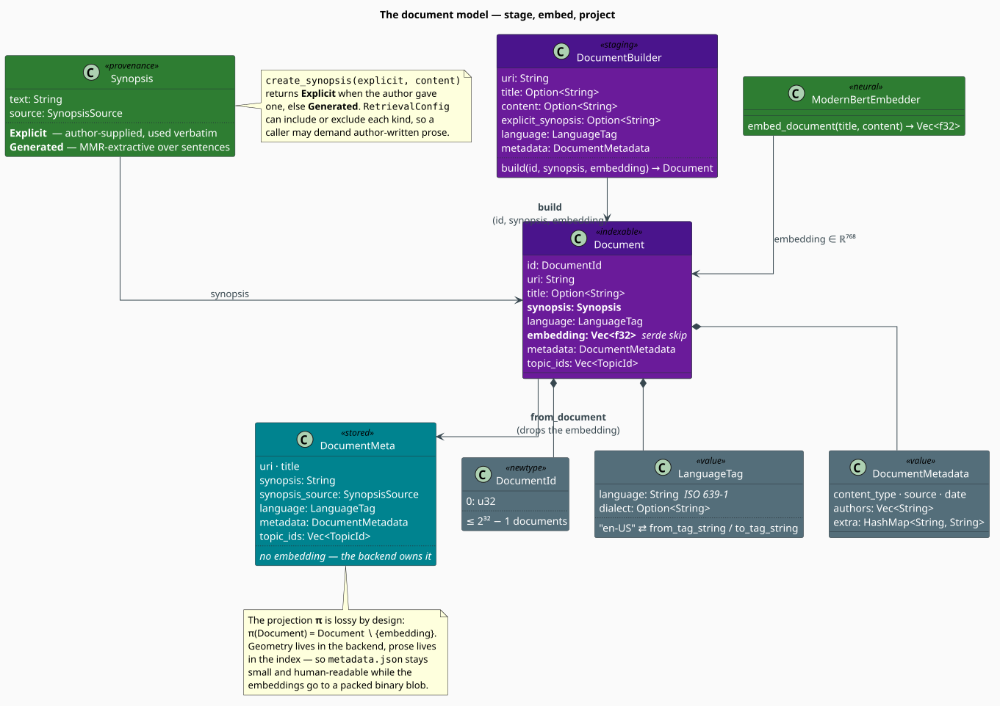

# The Document Model

A document passes through **three shapes** on its way into the index: it is *staged* as a
`DocumentBuilder` (prose, no vector), *realized* as a `Document` (prose **and** vector), and
finally *projected* into a `DocumentMeta` (prose, no vector) — which is the only shape the index
keeps. This document explains each shape, the value objects they carry, and the two questions the
model exists to answer: **who is this document** (identity) and **where did its summary come from**
(provenance).

> **Scope.** Source of truth: [`src/rag/document.rs`](../../../src/rag/document.rs); `Synopsis`
> and `SynopsisSource` are re-exported from [`src/neural/summarizer.rs`](../../../src/neural/summarizer.rs).
> For how documents are produced see [Builder](builder.md); for how they are stored see
> [Index](index.md).

## Notation

| Symbol | Meaning |
|---|---|
| $`d`$ | embedding dimension — $`768`$ for ModernBERT-base |
| $`v_D \in \mathbb{R}^{d}`$ | the embedding of document $`D`$ |
| $`\pi`$ | the projection `Document` $`\to`$ `DocumentMeta` (drops the embedding) |
| $`S`$ | the set of sentences already selected for a generated synopsis |
| $`R`$ | the set of candidate sentences of a document |
| $`c`$ | the centroid of a document's sentence embeddings |
| $`\lambda`$ | the MMR relevance/diversity trade-off, $`\lambda \in [0,1]`$ |
| $`\cos(u,v)`$ | cosine similarity (see [Overview](overview.md#theory-why-cosine-similarity)) |

**Acronyms.** *MMR* — Maximal Marginal Relevance; *URI* — Uniform Resource Identifier;
*BCP 47* — the IETF best-current-practice for language tags.

## The three shapes



| Shape | Type | Has a vector? | Lives where |
|---|---|---|---|
| **Staged** | `DocumentBuilder` | no — carries raw `content` | the caller's hands, before indexing |
| **Indexable** | `Document` | **yes** — `embedding: Vec<f32>` | transient; consumed by `add_document` |
| **Stored** | `DocumentMeta` | no — the backend has it | `RagIndex::documents`, and `metadata.json` |

The `Document` is deliberately short-lived. `RagIndex::add_document` splits it in two: the
embedding goes to the backend, and everything else is projected into a `DocumentMeta`. Formally, a
document is the tuple

```math
D \;=\; \bigl(\, \mathrm{id},\ \mathrm{uri},\ \mathrm{title},\ \mathrm{synopsis},\ \mathrm{language},\ v_D,\ \mathrm{metadata},\ \mathrm{topics} \,\bigr) \tag{D1}
```

and the stored projection simply deletes the vector coordinate:

```math
\pi(D) \;=\; D \setminus \{\, v_D \,\} \tag{D2}
```

$`(\mathrm{D2})`$ is the whole reason `metadata.json` stays small and human-readable while the
geometry goes to a packed binary blob. It is implemented by `DocumentMeta::from_document`, and it
is *lossy on purpose*: nothing in the index can reconstruct $`v_D`$ from a `DocumentMeta`.

## Identity: `DocumentId`

```rust
#[derive(Clone, Copy, Debug, Default, PartialEq, Eq, Hash, Serialize, Deserialize)]
pub struct DocumentId(pub u32);
```

A `u32` newtype — `Copy`, `Hash`, and cheap to pass around — bounding an index at
$`2^{32} - 1 = 4\,294\,967\,295`$ documents. It is the *join key* between the backend (which maps
ids to vectors) and the index (which maps ids to metadata), so it must be stable for the life of
the index.

Two conversions are provided. `From<u32>` is exact. **`From<usize>` performs an unchecked `as u32`
cast**, so on a 64-bit target an id above $`2^{32} - 1`$ wraps silently rather than failing:

```rust
use libgrammstein::rag::DocumentId;

assert_eq!(DocumentId::from(7_u32).as_u32(), 7);
assert_eq!(DocumentId::from(7_usize).as_u32(), 7);
// Caveat: DocumentId::from(usize::MAX) truncates to 4_294_967_295 without error.
```

Ids are normally allocated by the index rather than chosen by hand — `RagIndex::allocate_id`
hands out $`0, 1, 2, \dots`$ monotonically. Doing so keeps the id space *dense*, which several
components quietly rely on; see [Index](index.md#dense-ids-are-a-load-bearing-assumption).

## Synopsis provenance

A `Synopsis` is a summary plus a record of **where it came from**:

```rust
pub enum SynopsisSource { Explicit, Generated }

pub struct Synopsis {
    pub text: String,
    pub source: SynopsisSource,
}
```

| Source | Constructed by | Meaning |
|---|---|---|
| `Explicit` | `Synopsis::explicit(text)` | the author supplied it; used **verbatim**, never regenerated |
| `Generated` | `Synopsis::generated(text)` | libgrammstein wrote it by extractive summarization |

The distinction is not cosmetic. `Summarizer::create_synopsis(explicit, content)` short-circuits
whenever an explicit summary exists — an author-written abstract always beats a machine-selected
one — and `RetrievalConfig` lets a caller *demand* one kind or the other
(`include_explicit_synopsis`, `include_generated_synopsis`; see
[Retriever](retriever.md#stage-3-filtering)). Provenance is therefore a first-class, queryable property,
not a comment.

### How a generated synopsis is chosen

When no explicit summary exists, the summarizer selects sentences that are **representative** of
the document yet **not redundant** with each other. Representativeness is measured against the
centroid of the document's sentence embeddings,

```math
c \;=\; \frac{1}{\lvert R \rvert} \sum_{s \in R} v_s
\qquad\text{(the mean sentence vector)} \tag{D3}
```

and the selection greedily maximizes the **Maximal Marginal Relevance** objective of Carbonell &
Goldstein [[1]](#references), which subtracts a penalty for similarity to what has already been
chosen:

```math
\mathrm{MMR}(s) \;=\; \lambda \cdot \underbrace{\cos(v_s,\, c)}_{\text{relevance}}
\;-\; (1 - \lambda) \cdot \underbrace{\max_{s' \in S} \cos(v_s,\, v_{s'})}_{\text{redundancy}} \tag{D4}
```

The first sentence chosen is simply the most central one ($`S = \varnothing`$, so the penalty is
vacuous); each subsequent sentence maximizes $`(\mathrm{D4})`$ over the candidates not yet taken.
libgrammstein derives $`\lambda`$ from the summarizer's `diversity_threshold` (default $`0.3`$):

```math
\lambda \;=\; 1 - \texttt{diversity_threshold} \;=\; 0.7 \tag{D5}
```

so the default weighting is $`70\%`$ relevance against $`30\%`$ diversity. Raising
`diversity_threshold` buys broader coverage of the document at the cost of centrality. With
`preserve_order` (default `true`) the selected sentences are finally re-sorted into their original
document order, so the synopsis reads as prose rather than as a ranked list. The full algorithm —
sentence splitting, length filters, and batch embedding — is documented in
[Summarizer](../neural/summarizer.md).

## Language tags

```rust
pub struct LanguageTag {
    pub language: String,          // ISO 639-1, e.g. "en", "de", "es"
    pub dialect: Option<String>,   // region/script, e.g. "US", "GB", "AU"
}
```

`LanguageTag` renders as `"en-US"` via `to_tag_string` and parses back via `from_tag_string`.
Constructors are provided for the common cases (`english_us`, `english_uk`, `german`, `spanish`,
`french`), and `Display` delegates to `to_tag_string`.

> **Honest limitation.** `from_tag_string` is a *simplified* parser, not a BCP 47 implementation
> [[2]](#references). It splits on `-` and keeps the first two components, so `"en-US"` parses as
> expected, but `"zh-Hans-CN"` yields `language = "zh"`, `dialect = "Hans"` — capturing the
> **script** subtag while dropping the region. Tags with more than two subtags therefore do not
> round-trip: `from_tag_string("zh-Hans-CN").to_tag_string() == "zh-Hans"`. Use two-subtag tags
> unless you are prepared for that.

## Metadata

`DocumentMetadata` is an open bag of provenance, built fluently:

```rust
use libgrammstein::rag::DocumentMetadata;

let metadata = DocumentMetadata::new()
    .with_content_type("text/markdown")
    .with_source("internal-wiki")
    .with_date("2026-07-13")
    .with_author("Ada Lovelace")
    .with_extra("license", "CC-BY-4.0");
```

The fixed fields (`content_type`, `source`, `date`, `authors`) cover the common cases; anything
else goes into `extra: HashMap<String, String>`. Metadata is carried verbatim through $`\pi`$ into
`DocumentMeta`, so it survives `save`/`load` and is available on every retrieval hit.

## The staging builder, literately

`DocumentBuilder` accumulates everything a document needs *except* the two things only the
pipeline can supply — the id and the vector. The following mirrors
[`DocumentBuilder::build`](../../../src/rag/document.rs) and its caller
[`IndexBuilder::process_builder`](../../../src/rag/builder.rs); `⟨…⟩` names a refinement expanded
below.

```
function stage_and_realize(builder, id):                 ▸ builder: DocumentBuilder
    content <- builder.content                           ▸ REQUIRED — the only mandatory field
    if content is absent:
        return Err(IndexError "Document builder missing content")
    embedding <- embed_document(builder.title, content)  ▸ ModernBERT ⇒ v ∈ ℝ⁷⁶⁸
    synopsis  <- ⟨Choose a synopsis⟩
    return builder.build(id, synopsis, embedding)        ▸ consumes the builder

⟨Choose a synopsis⟩ ≡
    if generate_summaries:                               ▸ IndexBuilderConfig flag
        return create_synopsis(builder.explicit_synopsis, content)   ▸ Explicit if given, else MMR
    else:
        return Explicit(builder.explicit_synopsis)  if it exists
               Generated("")                        otherwise        ▸ deliberately empty
```

Two consequences follow directly from the pseudocode:

1. **`content` is mandatory.** A builder without it cannot be embedded, and the pipeline rejects
   it with `RagError::IndexError` rather than indexing an all-zero vector.
2. **`generate_summaries = false` can yield an empty synopsis.** If the caller supplies neither an
   explicit synopsis nor permission to generate one, the document is indexed with
   `Synopsis::generated("")` — searchable by vector, but with nothing to display. This is a
   legitimate choice when the caller intends to render titles only.

`build` also resets `topic_ids` to the empty vector. Topics are *not* a property the author
supplies; they are assigned later, by the index, when a topic model is fitted over the whole
corpus (see [Index](index.md#topic-integration)).

## Engineering

### The embedding is not serialized

```rust
pub struct Document {
    // …
    #[serde(skip)]
    pub embedding: Vec<f32>,
    // …
}
```

`Document` derives `Serialize`/`Deserialize`, but the vector is skipped. This is a deliberate
division of labour, and it has two visible consequences.

**Storage.** A $`768`$-dimensional `f32` vector is $`4 \times 768 = 3072`$ bytes packed. Rendered
as JSON — a comma-separated list of decimal literals — the same vector costs roughly $`8`$–$`12`$
KB, a $`3`$–$`4\times`$ inflation, and it must be re-parsed from text on every load. The backend
instead writes all $`n`$ vectors as one contiguous `f32` blob (`backend/embeddings.bin`), which is
both compact and fast to `mmap`-or-read.

**Round-tripping.** A `Document` that is serialized and deserialized comes back with
`embedding: Vec::new()`. This is *not* a lossy accident inside the index — the index never
serializes `Document`, only `DocumentMeta` (which has no embedding field at all, by $`(\mathrm{D2})`$)
— but a caller who persists bare `Document` values themselves must re-embed on load.

### `Document::new` starts with an empty generated synopsis

`Document::new(id, uri)` initializes `synopsis` to `Synopsis::generated(String::new())` — that is,
`source = Generated`, `text = ""`. A document built this way and never given a synopsis will be
*classified as generated* by `RetrievalResult::synopsis_is_explicit`, and so can be filtered out by
a retriever configured with `include_generated_synopsis: false`. Call `.with_synopsis(...)`
explicitly whenever the provenance matters.

### `display_title` never panics

Both `Document` and `DocumentMeta` expose `display_title() -> &str`, returning the title if
present and falling back to the URI otherwise. Since a URI is mandatory, the fallback always
exists — so rendering a hit list needs no `Option` handling.

## Usage

Staging a document with an author-written synopsis:

```rust
use libgrammstein::rag::{DocumentBuilder, DocumentMetadata, LanguageTag};

let builder = DocumentBuilder::new("file:///corpus/smoothing.md")
    .title("Modified Kneser-Ney")
    .content("Absolute discounting subtracts a fixed mass from every non-zero count …")
    .explicit_synopsis("How MKN discounts counts and redistributes mass by continuation counts.")
    .language(LanguageTag::english_us())
    .metadata(DocumentMetadata::new().with_source("libgrammstein-docs"));

assert_eq!(builder.get_uri(), "file:///corpus/smoothing.md");
assert_eq!(builder.get_explicit_synopsis(), Some("How MKN discounts counts and redistributes mass by continuation counts."));
```

Realizing a `Document` directly, when the embedding is already known:

```rust
use libgrammstein::neural::Synopsis;
use libgrammstein::rag::{Document, DocumentId, DocumentMeta, LanguageTag};

let doc = Document::new(DocumentId::new(1), "file:///corpus/smoothing.md")
    .with_title("Modified Kneser-Ney")
    .with_synopsis(Synopsis::explicit("Discounting and backoff."))
    .with_language(LanguageTag::english_us())
    .with_embedding(vec![0.0; 768]);

assert!(doc.has_explicit_synopsis());
assert_eq!(doc.display_title(), "Modified Kneser-Ney");

// The projection the index actually stores — note the embedding does not survive it.
let meta = DocumentMeta::from_document(&doc);
assert_eq!(meta.synopsis, "Discounting and backoff.");
assert_eq!(meta.language.to_tag_string(), "en-US");
```

## References

1. J. Carbonell & J. Goldstein (1998). *The use of MMR, diversity-based reranking for reordering
   documents and producing summaries.* SIGIR '98, 335–336.
   [doi:10.1145/290941.291025](https://doi.org/10.1145/290941.291025)
2. A. Phillips & M. Davis (2009). *Tags for identifying languages.* IETF BCP 47 / RFC 5646.
   [rfc-editor.org/rfc/rfc5646](https://www.rfc-editor.org/rfc/rfc5646)
3. B. Warner, A. Chaffin, B. Clavié, O. Weller, O. Hallström, S. Taghadouini, A. Gallagher,
   R. Biswas, F. Ladhak, T. Aarsen, N. Cooper, G. Adams, J. Howard & I. Poli (2024). *Smarter,
   better, faster, longer: a modern bidirectional encoder* (ModernBERT). arXiv:2412.13663.
   [doi:10.48550/arXiv.2412.13663](https://doi.org/10.48550/arXiv.2412.13663)

## See also

- [RAG Overview](overview.md) — why documents become vectors at all
- [Index](index.md) — where `DocumentMeta` is stored and joined against the backend
- [Builder](builder.md) — the pipeline that turns a `DocumentBuilder` into a `Document`
- [Retriever](retriever.md) — how synopsis provenance is used to filter results
- [Summarizer](../neural/summarizer.md) — the extractive summarizer behind `Synopsis::generated`
- [Neural Embedder](../neural/embedder.md) — the encoder that produces $`v_D`$
