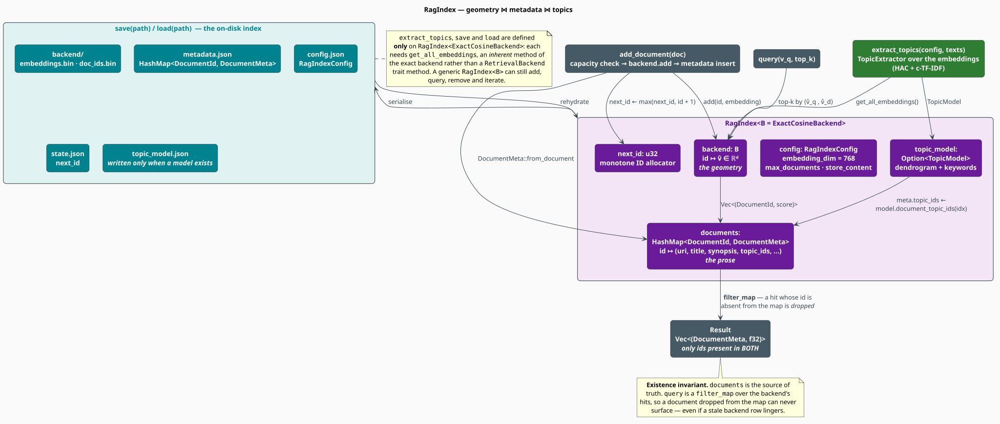

# The RAG Index

`RagIndex<B>` is the **join**. A [backend](backend.md) knows geometry — id-to-vector — and nothing
else; a [document](document.md) carries prose that no vector space can represent. The index holds
both, keeps them consistent, optionally fits a topic model over them, and knows how to write the
whole thing to disk and read it back. This document specifies that join, the invariant that keeps
it honest, and the assumptions it quietly makes about document ids.

> **Scope.** Source of truth: [`src/rag/index.rs`](../../../src/rag/index.rs). For the geometric
> half see [Backend](backend.md); for the query surface built on top of it see
> [Retriever](retriever.md); for the topic model it can carry see
> [Topic Modeling](../topic/overview.md).

## Notation

| Symbol | Meaning |
|---|---|
| $`n`$ | number of documents in the index |
| $`d`$ | embedding dimension (`RagIndexConfig::embedding_dim`, default $`768`$) |
| $`k`$ | number of results requested |
| $`\mathcal{I}`$ | the id set of the index — the keys of `documents` |
| $`\mathcal{B}`$ | the id set of the backend — the ids for which a vector is stored |
| $`\mu`$ | the metadata map, $`\mu : \mathcal{I} \to \texttt{DocumentMeta}`$ |
| $`\beta`$ | the geometry map, $`\beta : \mathcal{B} \to \mathbb{R}^{d}`$ |
| $`T`$ | the topic model, when one has been fitted |

**Acronyms.** *HAC* — Hierarchical Agglomerative Clustering; *c-TF-IDF* — class-based Term
Frequency–Inverse Document Frequency.

## Structure

```rust
pub struct RagIndex<B: RetrievalBackend = ExactCosineBackend> {
    backend: B,                                     // β — the geometry
    documents: HashMap<DocumentId, DocumentMeta>,   // μ — the prose
    next_id: u32,                                   // the monotone id allocator
    config: RagIndexConfig,
    topic_model: Option<TopicModel>,                // T — fitted post hoc, if at all
}
```

Note the **default type parameter**: `RagIndex` alone means `RagIndex<ExactCosineBackend>`, so the
common case needs no turbofish. The backend is generic, but — as the diagram records — three
methods are *not*; see [What only the exact backend can do](#what-only-the-exact-backend-can-do).



### Configuration

```rust
pub struct RagIndexConfig {
    pub embedding_dim: usize,        // default 768 — must match the encoder's output
    pub max_documents: Option<usize>,// default None — unbounded
    pub store_content: bool,         // default false — synopses only, never full bodies
}
```

`embedding_dim` is the contract between the index and the encoder. `add_document` forwards the
document's embedding straight to `backend.add`, which rejects any vector whose length differs —
so a mismatch between `RagIndexConfig::embedding_dim` and the model's true output dimension
surfaces as `RagError::IndexError` on the *first* insertion. Read the dimension from the encoder
rather than hard-coding it:

```rust
use libgrammstein::neural::{EmbeddingConfig, ModernBertEmbedder};
use libgrammstein::rag::{RagIndex, RagIndexConfig};

let embedder = ModernBertEmbedder::new(EmbeddingConfig::default())?;
let config = RagIndexConfig {
    embedding_dim: embedder.embedding_dim(),   // never guess
    ..Default::default()
};
let index = RagIndex::with_exact_backend(config);
# Ok::<(), libgrammstein::rag::RagError>(())
```

## The existence invariant

The index and the backend are two maps over ids, and the index is the **authority on existence**:

```math
\begin{array}{lr}
\displaystyle \mathcal{I} \;=\; \mathrm{dom}\,\mu
\qquad\text{is the set of documents that exist} & \text{(I1)}
\end{array}
```

`query` never trusts the backend alone. It asks the backend for candidates, then *joins* them
against $`\mu`$, discarding any id the metadata map does not recognize:

```math
\begin{array}{lr}
\displaystyle \mathrm{query}(v_q, k)
\;=\;
\Bigl[\, \bigl(\mu(i),\, s\bigr) \;\Big|\; (i, s) \in \beta\text{-}\mathrm{top}_k(v_q),\ \ i \in \mathcal{I} \,\Bigr] & \text{(I2)}
\end{array}
```

In Rust that projection is exactly one `filter_map`:

```rust
results
    .into_iter()
    .filter_map(|(id, score)| self.documents.get(&id).map(|meta| (meta.clone(), score)))
    .collect()
```

$`(\mathrm{I2})`$ is what makes removal *safe on a backend that cannot remove*. `RagIndex::remove`
deletes from $`\mu`$ first and only then asks the backend to forget the vector:

```
function remove(id):
    if μ.remove(id) was present:              ▸ the document ceases to exist HERE
        backend.remove(id)?                   ▸ may legitimately fail (HNSW: unsupported)
        return Ok(true)
    return Ok(false)                          ▸ unknown id: not an error
```

Because of $`(\mathrm{I2})`$, a stale vector left behind in the backend can never surface: its id
is no longer in $`\mathcal{I}`$, so the join drops it. The index leaks geometry, not correctness.

> **The one asymmetry.** If `backend.remove` returns `Err` — which is precisely what `HnswBackend`
> does, inheriting the trait default — the metadata entry has *already* been removed, and the `?`
> propagates the error. The document is thus gone from $`\mu`$ but still present in $`\beta`$, and
> the caller sees an `Err` despite a partially-applied removal. The document is correctly
> unreachable (by $`(\mathrm{I2})`$), but `len()` and the backend's `len()` now disagree. Treat
> removal as an exact-backend-only operation.

Note also that $`k`$ is a bound on *candidates*, not on results: $`(\mathrm{I2})`$ filters after the
backend has already chosen $`k`$ ids, so a query can return **fewer** than `top_k` hits. The
[retriever](retriever.md#stage-3-filtering) narrows this further.

## Adding documents

```
function add_document(doc):
    if max_documents is Some(m) and |μ| ≥ m:      ▸ capacity is checked BEFORE any work
        return Err(IndexError "Index at capacity")
    id <- doc.id                                  ▸ the CALLER chose the id
    backend.add(id, doc.embedding)?               ▸ dimension is validated here; normalizes
    μ.insert(id, DocumentMeta::from_document(doc)) ▸ the π projection of (D2)
    if id.as_u32() ≥ next_id:                     ▸ keep the allocator ahead of manual ids
        next_id <- id.as_u32() + 1
    return Ok(id)
```

Three observations:

1. **The caller owns the id.** `add_document` does not allocate; it *reads* `doc.id`. Use
   `allocate_id()` to obtain one, which hands out $`0, 1, 2, \dots`$ and is what the
   [builder](builder.md) does.
2. **`next_id` self-heals.** Inserting a document with a hand-picked id of $`1000`$ pushes the
   allocator to $`1001`$, so a later `allocate_id()` cannot collide with it.
3. **Capacity is counted in metadata.** `max_documents` bounds $`\lvert \mu \rvert`$, so a document
   removed from $`\mu`$ frees a slot even if its vector lingers in an HNSW backend.

## Dense ids are a load-bearing assumption

The index is deliberately vague about *which* ids exist — $`\mathcal{I}`$ is just a `HashMap`'s key
set — but two operations silently assume that ids are **dense and insertion-ordered**, i.e. that
document $`i`$ was the $`i`$-th vector added:

```math
\begin{array}{lr}
\displaystyle \text{Assumption (A):}\qquad \mathcal{I} = \{0, 1, \dots, n-1\}
\quad\text{and}\quad
\text{id } i \text{ occupies row } i \text{ of the backend matrix} & \text{(I3)}
\end{array}
```

- **`set_topic_model`** maps each document to its topic assignment with
  `model.document_topic_ids(doc_id.as_u32() as usize)` — treating the *id* as a *row index* into
  the extraction result.
- **`extract_topics`** requires `documents_text` to be ordered to match
  `backend.get_all_embeddings()`, i.e. insertion order, and checks only that the two have equal
  **length**.

$`(\mathrm{I3})`$ holds for any index built by `allocate_id` or by either
[builder](builder.md) — the normal path. It is *violated* by removing a document (which leaves a
hole) or by inserting hand-picked, sparse ids. In those cases topic assignment will mis-attribute
keywords, silently. **Fit topics before removing anything**, or rebuild the index first.

## Topic integration

An index can carry a **topic model**: a hierarchy of clusters over the very embeddings the backend
already stores, each labelled with the terms that distinguish it. The machinery is BERTopic-style
[[1]](#references) — hierarchical agglomerative clustering over the document vectors, then
c-TF-IDF to name each cluster — and is documented in [Topic Modeling](../topic/overview.md).

```
function extract_topics(topic_config, documents_text):
    embeddings <- backend.get_all_embeddings()          ▸ insertion order; see (I3)
    if |embeddings| ≠ |documents_text|:
        return Err(TopicError::ClusteringError)         ▸ the ONLY consistency check
    result <- TopicExtractor(topic_config).extract(embeddings, documents_text)
    model  <- TopicModel::from_extraction(result, topic_config)
    set_topic_model(model)                              ▸ writes topic_ids into every DocumentMeta
    return Ok(model)
```

`set_topic_model` is the interesting half: it walks $`\mu`$ and stamps each `DocumentMeta` with the
topics its embedding was assigned. Topics therefore become part of the *stored metadata*, and ride
along on every retrieval hit and through `save`/`load`. `clear_topic_model` reverses this, emptying
`topic_ids` everywhere.

Note the return type: `extract_topics` yields `topic::Result<TopicModel>`, not `rag::Result<_>` —
clustering failures are `TopicError`, not `RagError`.

```rust
use libgrammstein::topic::{ClusteringConfig, TopicConfig};

// documents_text MUST be in insertion order — see (I3).
let texts: Vec<String> = vec![
    "machine learning algorithms neural networks".to_string(),
    "machine learning models training data".to_string(),
    "database sql queries optimization".to_string(),
    "database storage retrieval systems".to_string(),
];
let topic_config = TopicConfig {
    clustering: ClusteringConfig { num_clusters: Some(2), ..Default::default() },
    ..Default::default()
};

let model = index.extract_topics(topic_config, &texts)?;
assert_eq!(model.num_topics(), 2);
assert!(index.topic_model().is_some());

// Every document now carries its topic ids, and they survive save/load.
let topics = index.document_topics(libgrammstein::rag::DocumentId::new(0));
assert!(!topics.is_empty());
# Ok::<(), libgrammstein::topic::TopicError>(())
```

## What only the exact backend can do

`RagIndex<B>` is generic in `B`, but three methods live in an `impl RagIndex<ExactCosineBackend>`
block and are unavailable for any other backend:

| Method | Why it is not generic |
|---|---|
| `with_exact_backend(config)` | names the concrete backend by definition |
| `extract_topics(config, texts)` | needs `get_all_embeddings()`, an *inherent* method of `ExactCosineBackend`, not a `RetrievalBackend` method |
| `save(path)` / `load(path)` | `load` must name a concrete type to construct |

The generic surface — `add_document`, `query`, `get`, `contains`, `remove`, `len`, `clear`,
`iter`, `document_ids`, `topic_model`, `set_topic_model`, `document_topics`, `backend`,
`backend_mut` — works for every backend. In practice this means: **topic modelling and persistence
are exact-backend features today.** An `HnswBackend` index can be built and queried, but must be
persisted through `backend().save(path)` directly, with its metadata written by the caller.

## Persistence

`save` writes a directory; `load` reads one back.

| Path | Written by | Contents |
|---|---|---|
| `backend/` | `ExactCosineBackend::save` | `embeddings.bin` + `doc_ids.bin` (see [Backend](backend.md#persistence)) |
| `metadata.json` | `serde_json` | the whole `HashMap<DocumentId, DocumentMeta>` |
| `config.json` | `serde_json` | `RagIndexConfig` |
| `state.json` | `serde_json` | `next_id` — so the allocator resumes where it left off |
| `topic_model.json` | `TopicModel::save` | written **only** when a topic model exists |

Two touches of backward compatibility are worth knowing. If `state.json` is absent (an index
written before it existed), `load` reconstructs the allocator as
$`\max(\mathcal{I}) + 1`$. And if `topic_model.json` is absent, the index simply loads without a
model. Because `Document::embedding` is `#[serde(skip)]` (see
[Document](document.md#the-embedding-is-not-serialized)), no vector is ever duplicated into
`metadata.json` — the geometry lives in exactly one place.

```rust
use std::path::Path;

index.save(Path::new("index/"))?;
let reloaded = libgrammstein::rag::RagIndex::load(Path::new("index/"))?;
assert_eq!(reloaded.len(), index.len());
# Ok::<(), libgrammstein::rag::RagError>(())
```

## Engineering

### `query` clones metadata

`RagIndex::query` returns `Vec<(DocumentMeta, f32)>` — an **owned** clone per hit, not a borrow.
This is what allows the index to sit behind an `Arc` and be queried concurrently without lending
out references tied to a lock or a lifetime. The cost is one `DocumentMeta` clone (several `String`
allocations) per result, which is negligible against the $`\Theta(nd)`$ scoring that preceded it,
and bounded by $`k`$ rather than by $`n`$.

### `clear` resets the allocator

`clear()` empties the backend and the metadata map **and** resets `next_id` to $`0`$. It does *not*
clear the topic model — a stale `TopicModel` survives a `clear`, referring to documents that no
longer exist. Call `clear_topic_model()` alongside it.

### Capacity is a soft ceiling

`max_documents` is checked on `add_document` only. Mutating the backend directly through
`backend_mut()` bypasses the check (and the metadata map), which is exactly why that escape hatch
should be reserved for backend-specific operations such as `HnswBackend::force_rebuild`.

## Usage

```rust
use libgrammstein::neural::Synopsis;
use libgrammstein::rag::{Document, DocumentId, RagIndex, RagIndexConfig};

let mut index = RagIndex::with_exact_backend(RagIndexConfig {
    embedding_dim: 3,
    max_documents: Some(1_000),
    ..Default::default()
});

for (i, (uri, embedding)) in [
    ("doc://ml",  [1.0, 0.0, 0.0]),
    ("doc://web", [0.0, 1.0, 0.0]),
    ("doc://db",  [0.0, 0.0, 1.0]),
].into_iter().enumerate() {
    let id = index.allocate_id();
    assert_eq!(id.as_u32(), i as u32);          // dense ids — see (I3)
    index.add_document(
        Document::new(id, uri)
            .with_synopsis(Synopsis::explicit("…"))
            .with_embedding(embedding.to_vec()),
    )?;
}

// Retrieval joins geometry against metadata, per (I2).
let hits = index.query(&[0.9, 0.1, 0.0], 2);
assert_eq!(hits[0].0.uri, "doc://ml");

// Existence is decided by the metadata map.
assert!(index.contains(DocumentId::new(1)));
assert!(index.remove(DocumentId::new(1))?);
assert!(!index.contains(DocumentId::new(1)));
assert_eq!(index.len(), 2);
# Ok::<(), libgrammstein::rag::RagError>(())
```

## References

1. M. Grootendorst (2022). *BERTopic: neural topic modeling with a class-based TF-IDF procedure.*
   arXiv:2203.05794.
   [doi:10.48550/arXiv.2203.05794](https://doi.org/10.48550/arXiv.2203.05794)
2. P. Lewis, E. Perez, A. Piktus, F. Petroni, V. Karpukhin, N. Goyal, H. Küttler, M. Lewis,
   W. Yih, T. Rocktäschel, S. Riedel & D. Kiela (2020). *Retrieval-augmented generation for
   knowledge-intensive NLP tasks.* NeurIPS 33, 9459–9474. arXiv:2005.11401.
   [doi:10.48550/arXiv.2005.11401](https://doi.org/10.48550/arXiv.2005.11401)

## See also

- [RAG Overview](overview.md) — where the index sits in the pipeline
- [Backend](backend.md) — the geometry $`\beta`$ and its two implementations
- [Document](document.md) — the `DocumentMeta` projection $`\pi`$ the index stores
- [Retriever](retriever.md) — the query surface layered on $`(\mathrm{I2})`$
- [Builder](builder.md) — how an index is populated in bulk
- [Topic Modeling](../topic/overview.md) — HAC and c-TF-IDF behind `extract_topics`
- [Topic Clustering](../topic/clustering.md) — the clustering step in detail
