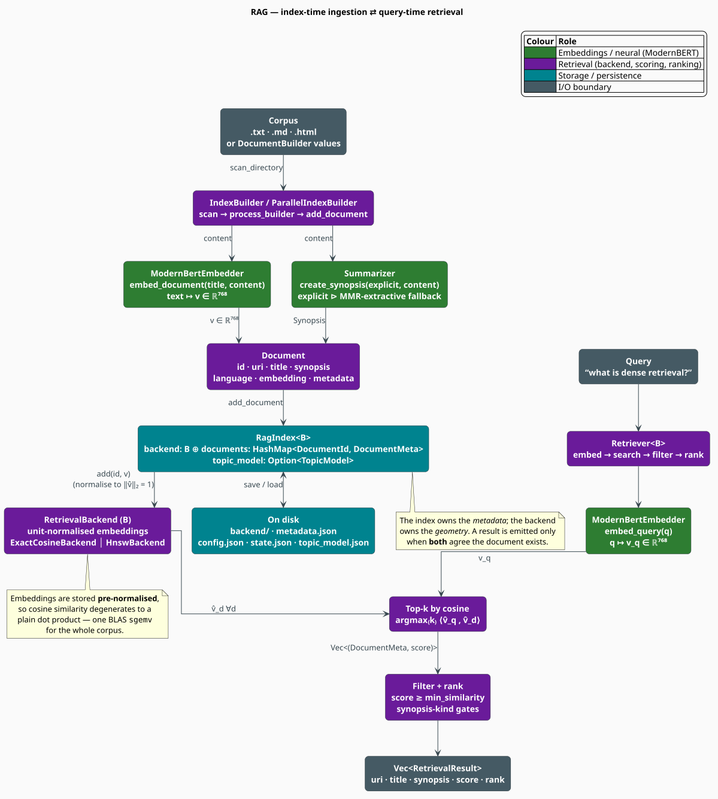

# RAG: Retrieval-Augmented Generation

The **RAG module** turns a corpus of documents into a *searchable semantic space*. A document is
encoded once, at index time, into a single dense vector; a query is encoded at search time by the
**same** encoder into the **same** space; and retrieval is then nothing more than finding the
vectors that point in most nearly the same direction as the query. This document explains *why*
that works, *what* the module is made of, and *how* the pieces fit together.

> **Scope.** Source of truth: [`src/rag/mod.rs`](../../../src/rag/mod.rs). The module is gated
> behind the `rag` Cargo feature (which implies `neural-rescore`); the approximate backend adds
> `rag-hnsw`. Per-component detail lives in [Document](document.md), [Backend](backend.md),
> [Index](index.md), [Retriever](retriever.md), and [Builder](builder.md).

## Notation

Every symbol below is defined before it is used in a formula.

| Symbol | Meaning |
|---|---|
| $`d`$ | embedding dimension — $`768`$ for ModernBERT-base (`RagIndexConfig::embedding_dim`) |
| $`n`$ | number of documents in the index |
| $`k`$ | number of results requested (`RetrievalConfig::top_k`) |
| $`\mathcal{D}`$ | the document collection, $`\mathcal{D} = \{D_1, \dots, D_n\}`$ |
| $`q`$ | the query, a string of text |
| $`E(\cdot)`$ | the encoder — ModernBERT, mapping text into $`\mathbb{R}^{d}`$ |
| $`v_D`$ | the raw embedding of document $`D`$, $`v_D = E(D) \in \mathbb{R}^{d}`$ |
| $`v_q`$ | the raw embedding of the query, $`v_q = E(q) \in \mathbb{R}^{d}`$ |
| $`\hat{v}`$ | the $`\ell_2`$-normalized (unit) form of $`v`$, $`\hat{v} = v / \lVert v \rVert_2`$ |
| $`\langle u, v \rangle`$ | the Euclidean inner (dot) product, $`\sum_{i=1}^{d} u_i v_i`$ |
| $`\lVert v \rVert_2`$ | the Euclidean norm, $`\sqrt{\langle v, v \rangle}`$ |
| $`\cos(u, v)`$ | cosine similarity between $`u`$ and $`v`$ |
| $`M`$, $`\mathrm{ef}`$ | HNSW graph degree and search-beam width (see [Backend](backend.md)) |

**Acronyms.** *RAG* — Retrieval-Augmented Generation; *ANN* — Approximate Nearest Neighbor;
*HNSW* — Hierarchical Navigable Small World; *BLAS* — Basic Linear Algebra Subprograms;
*MMR* — Maximal Marginal Relevance; *URI* — Uniform Resource Identifier.

## The problem: retrieval without keywords

A language model is only as good as the context it is given. **Retrieval-augmented generation**
[[1]](#references) attacks the *knowledge* problem by conditioning generation on documents fetched
from an external store at inference time, rather than on whatever the model happened to memorize
in its weights. The store must therefore answer one question quickly and well:

> *Given a query, which documents are most relevant?*

The classical answer is **lexical**: score by term overlap, as BM25 does [[2]](#references).
Lexical scoring is fast and interpretable, but brittle in exactly the way natural language is
flexible — it cannot see that *"car"* and *"automobile"* are the same thing, nor that *"how do I
stop my program crashing"* and *"exception handling"* are about one topic. The vocabulary of the
query and the vocabulary of the document simply fail to intersect. This is the **vocabulary
mismatch** problem.

**Dense retrieval** answers differently. Following the vector-space tradition [[3]](#references)
and its neural incarnation [[4]](#references)[[5]](#references), it maps *meaning* — not *words* —
into geometry: text becomes a point in $`\mathbb{R}^{d}`$, and semantic relatedness becomes
*proximity*. Two texts that mean the same thing land near one another even when they share not one
token. libgrammstein's RAG module is a dense retriever.

| Approach | Matches on | Blind to | Cost per query |
|---|---|---|---|
| Lexical (BM25) | shared terms | synonymy, paraphrase | sublinear (inverted index) |
| **Dense (this module)** | **shared meaning** | exact rare tokens (IDs, codes) | $`\Theta(nd)`$ exact; $`\Theta(d\,\mathrm{ef}\log n)`$ approximate |

## Theory: why cosine similarity

### From angle to inner product

Relevance is modelled as *directional agreement*. The **cosine similarity** of two non-zero
vectors is the cosine of the angle $`\theta`$ between them:

```math
\cos(u, v) \;=\; \frac{\langle u, v \rangle}{\lVert u \rVert_2 \, \lVert v \rVert_2}
\;=\; \cos \theta \;\in\; [-1, 1] \tag{R1}
```

It is $`1`$ when the vectors are parallel (same meaning), $`0`$ when orthogonal (unrelated), and
$`-1`$ when antiparallel. Crucially it is invariant to *magnitude*: a long document and a short one
that say the same thing score alike, because only direction carries the semantics. That is
precisely the property a retriever wants, and it is why $`(\mathrm{R1})`$ — rather than raw
Euclidean distance — is the similarity of choice for pooled transformer embeddings
[[5]](#references).

### The unit-vector identity that makes it fast

Evaluating $`(\mathrm{R1})`$ naïvely costs two norms and a division *per document*. libgrammstein
avoids all of it by **normalizing once, at insertion time**. Define the unit vector
$`\hat{v} = v / \lVert v \rVert_2`$, so that $`\lVert \hat{v} \rVert_2 = 1`$. The denominator of
$`(\mathrm{R1})`$ is then identically $`1`$, and cosine similarity collapses into a bare dot
product:

```math
\lVert \hat{u} \rVert_2 = \lVert \hat{v} \rVert_2 = 1
\quad\Longrightarrow\quad
\cos(\hat{u}, \hat{v}) \;=\; \frac{\langle \hat{u}, \hat{v} \rangle}{1 \cdot 1} \;=\; \langle \hat{u}, \hat{v} \rangle \tag{R2}
```

$`(\mathrm{R2})`$ is the load-bearing identity of the whole module. Every backend stores unit
vectors, so scoring $`n`$ documents becomes a single matrix-vector product — one BLAS call —
instead of $`n`$ independent cosine evaluations.

The same identity ties cosine to Euclidean geometry on the unit sphere. Expanding the squared
distance between two unit vectors:

```math
\lVert \hat{u} - \hat{v} \rVert_2^{2}
= \langle \hat{u}, \hat{u} \rangle - 2\,\langle \hat{u}, \hat{v} \rangle + \langle \hat{v}, \hat{v} \rangle
= 2 - 2\,\langle \hat{u}, \hat{v} \rangle \tag{R3}
```

Because $`(\mathrm{R3})`$ is a strictly decreasing function of $`\langle \hat{u}, \hat{v} \rangle`$,
**ranking by cosine similarity and ranking by Euclidean distance coincide** on normalized vectors.
That equivalence is what licenses libgrammstein to hand unit vectors to HNSW — an algorithm built
for metric spaces — and still get a cosine ranking back. See [Backend](backend.md#the-distdot-trick).

### Retrieval as an argmax

With $`(\mathrm{R2})`$ in hand, retrieval is one line. Writing $`\operatorname{top-\textit{k}}`$ for
the operator returning the $`k`$ highest-scoring documents:

```math
\mathrm{Retrieve}(q, k) \;=\; \operatorname*{top-\textit{k}}_{D \,\in\, \mathcal{D}}\
\bigl\langle\, \widehat{E(q)},\ \widehat{E(D)} \,\bigr\rangle \tag{R4}
```

Everything else in this module — the document model, the backends, the index, the retriever, the
builder — exists to make $`(\mathrm{R4})`$ *correct*, *fast*, and *durable*.

## Architecture



The module separates five concerns, each with its own page:

| Component | Types | Responsibility |
|---|---|---|
| [Document](document.md) | `Document`, `DocumentMeta`, `DocumentBuilder` | what a document *is*: identity, prose, synopsis, language, metadata, vector |
| [Backend](backend.md) | `RetrievalBackend`, `ExactCosineBackend`, `HnswBackend` | the *geometry*: store unit vectors, answer top-$`k`$ |
| [Index](index.md) | `RagIndex<B>`, `RagIndexConfig` | the *join*: geometry, metadata and topics, plus persistence |
| [Retriever](retriever.md) | `Retriever<B>`, `RetrievalConfig`, `RetrievalResult` | the *query pipeline*: encode, search, filter, rank |
| [Builder](builder.md) | `IndexBuilder`, `ParallelIndexBuilder` | *construction*: scan a corpus, embed, summarize, populate |

The split that matters most is **geometry versus prose**. The backend knows only
$`(\text{DocumentId}, \hat{v})`$ pairs; it has never heard of a title. The index owns the
`HashMap<DocumentId, DocumentMeta>` and never performs arithmetic. A result is emitted only where
the two agree — which is what makes removal safe (see
[Index](index.md#the-existence-invariant)).

## Two geometries, one contract

Both backends implement the same [`RetrievalBackend`](backend.md) trait, so the choice is a
deployment decision rather than an API one:

| | `ExactCosineBackend` (default) | `HnswBackend` (feature `rag-hnsw`) |
|---|---|---|
| Answer | **exact** — recall $`= 1`$ by construction | **approximate** — recall rises with `ef_search` |
| Query time | $`\Theta(nd)`$ | $`\Theta(d \cdot \mathrm{ef} \cdot \log n)`$ expected |
| Memory | $`4nd`$ bytes (the $`n \times d`$ `f32` matrix) | the matrix **plus** $`\approx 8nM`$ bytes of graph |
| Removal | supported, $`\Theta(nd)`$ (matrix rebuilt) | **unsupported** — the trait default returns `Err` |
| Best for | up to $`\approx 10^{6}`$ documents | beyond $`\approx 10^{6}`$ documents |

`BackendType::recommended_for_size(n)` encodes exactly that rule of thumb: it returns `Hnsw` when
$`n > 10^{6}`$ *and* the `rag-hnsw` feature is compiled in, and `ExactCosine` otherwise.

At $`n = 10^{6}`$ and $`d = 768`$ the exact matrix alone occupies
$`4 \times 10^{6} \times 768 \approx 3.1`$ GB, and every query touches all of it. That
memory-bandwidth wall — not arithmetic — is what makes the approximate backend necessary at scale.

## Usage

Indexing a directory and querying it, end to end:

```rust
use std::path::Path;
use std::sync::Arc;

use libgrammstein::neural::{EmbeddingConfig, ModernBertEmbedder};
use libgrammstein::rag::{
    format_results, IndexBuilder, IndexBuilderConfig, RagIndexConfig, RetrievalConfig, Retriever,
};

// 1. Build an index from a directory of .txt / .md / .html files.
let config = IndexBuilderConfig {
    index_config: RagIndexConfig { embedding_dim: 768, ..Default::default() },
    generate_summaries: true,
    ..Default::default()
};
let builder = IndexBuilder::new(config)?;
let index = builder.build_from_directory(
    Path::new("corpus/"),
    Some(&|done, total| eprintln!("embedded {done}/{total}")),
)?;

// 2. Query it. The retriever owns an encoder — the *same* model that embedded the
//    documents — so queries and documents share one vector space.
let embedder = ModernBertEmbedder::new(EmbeddingConfig::default())?;
let mut retriever = Retriever::new(
    Arc::new(index),
    embedder,
    RetrievalConfig { top_k: 5, min_similarity: 0.3, ..Default::default() },
);

let results = retriever.query("how does absolute discounting work?")?;
print!("{}", format_results(&results));
# Ok::<(), libgrammstein::rag::RagError>(())
```

Building an index by hand, when the documents are already in memory:

```rust
use libgrammstein::neural::Synopsis;
use libgrammstein::rag::{Document, RagIndex, RagIndexConfig};

let config = RagIndexConfig { embedding_dim: 3, ..Default::default() };
let mut index = RagIndex::with_exact_backend(config);

let id = index.allocate_id();
let doc = Document::new(id, "file:///notes/kneser-ney.md")
    .with_title("Kneser-Ney")
    .with_synopsis(Synopsis::explicit("Absolute discounting with continuation counts."))
    .with_embedding(vec![1.0, 0.0, 0.0]); // the backend normalizes it on insertion
index.add_document(doc)?;

// Query with a pre-computed embedding; scores are cosine similarities in [-1, 1].
let hits = index.query(&[1.0, 0.0, 0.0], 5);
assert_eq!(hits.len(), 1);
assert!((hits[0].1 - 1.0).abs() < 1e-6);
# Ok::<(), libgrammstein::rag::RagError>(())
```

## Errors

Every fallible operation returns `rag::Result<T>`, an alias for `Result<T, RagError>`:

| Variant | Raised when |
|---|---|
| `DocumentNotFound(DocumentId)` | a lookup names an absent document |
| `IndexError(String)` | dimension mismatch, index at capacity, or unsupported removal |
| `EmbeddingError(String)` | the encoder failed to produce a vector |
| `Io(std::io::Error)` | `save` / `load` / corpus scan touched a bad path |
| `Serialization(String)` | a `bincode` or `serde_json` round-trip failed |
| `Neural(NeuralError)` | the ModernBERT encoder or the summarizer failed |

The `Io` and `Neural` variants are `#[from]` conversions, so `?` composes across module
boundaries: an encoder failure inside `IndexBuilder::new` surfaces as `RagError::Neural` with no
manual `map_err`.

## Design notes

**One encoder, two roles.** `ModernBertEmbedder::embed_document(title, content)` and
`embed_query(q)` funnel into the same ModernBERT weights and the same pooling strategy. This is
not an implementation convenience but a *correctness requirement*: the inner product in
$`(\mathrm{R4})`$ is meaningless unless both operands inhabit the same space — the bi-encoder
discipline of Sentence-BERT [[5]](#references) and DPR [[4]](#references).

**Synopsis, not content.** The index stores a *synopsis* rather than the full document body
(`RagIndexConfig::store_content` defaults to `false`). A synopsis is either **explicit**
(author-supplied, used verbatim) or **generated** (extractive, selected by MMR [[6]](#references)).
Results carry the synopsis, so a caller can render a hit list without re-reading the corpus. See
[Document](document.md#synopsis-provenance).

**Thread safety.** `RetrievalBackend` is bounded by `Send + Sync`, so an index may be shared across
threads behind an `Arc`. `HnswBackend` goes further and answers `query(&self, …)` while lazily
building its graph under interior mutability — see
[Backend](backend.md#lazy-building-and-interior-mutability) and the crate-wide
[Threading Model](../../architecture/threading.md).

## References

1. P. Lewis, E. Perez, A. Piktus, F. Petroni, V. Karpukhin, N. Goyal, H. Küttler, M. Lewis,
   W. Yih, T. Rocktäschel, S. Riedel & D. Kiela (2020). *Retrieval-augmented generation for
   knowledge-intensive NLP tasks.* NeurIPS 33, 9459–9474. arXiv:2005.11401.
   [doi:10.48550/arXiv.2005.11401](https://doi.org/10.48550/arXiv.2005.11401)
2. S. Robertson & H. Zaragoza (2009). *The probabilistic relevance framework: BM25 and beyond.*
   Foundations and Trends in Information Retrieval 3(4), 333–389.
   [doi:10.1561/1500000019](https://doi.org/10.1561/1500000019)
3. G. Salton, A. Wong & C. S. Yang (1975). *A vector space model for automatic indexing.*
   Communications of the ACM 18(11), 613–620.
   [doi:10.1145/361219.361220](https://doi.org/10.1145/361219.361220)
4. V. Karpukhin, B. Oğuz, S. Min, P. Lewis, L. Wu, S. Edunov, D. Chen & W. Yih (2020). *Dense
   passage retrieval for open-domain question answering.* EMNLP 2020, 6769–6781.
   [doi:10.18653/v1/2020.emnlp-main.550](https://doi.org/10.18653/v1/2020.emnlp-main.550)
5. N. Reimers & I. Gurevych (2019). *Sentence-BERT: sentence embeddings using Siamese
   BERT-networks.* EMNLP-IJCNLP 2019, 3982–3992.
   [doi:10.18653/v1/D19-1410](https://doi.org/10.18653/v1/D19-1410)
6. J. Carbonell & J. Goldstein (1998). *The use of MMR, diversity-based reranking for reordering
   documents and producing summaries.* SIGIR '98, 335–336.
   [doi:10.1145/290941.291025](https://doi.org/10.1145/290941.291025)

## See also

- [Document](document.md) — the document model and synopsis provenance
- [Backend](backend.md) — exact cosine, HNSW, and the trait they share
- [Index](index.md) — `RagIndex<B>`, topic integration, persistence
- [Retriever](retriever.md) — the query pipeline, filtering, and ranking
- [Builder](builder.md) — corpus scanning and parallel construction
- [Topic Modeling](../topic/overview.md) — the HAC and c-TF-IDF model the index can carry
- [Neural Embedder](../neural/embedder.md) — the ModernBERT encoder $`E(\cdot)`$
- [LaTeX RAG](../latex/rag.md) — the same machinery applied to mathematical documents
