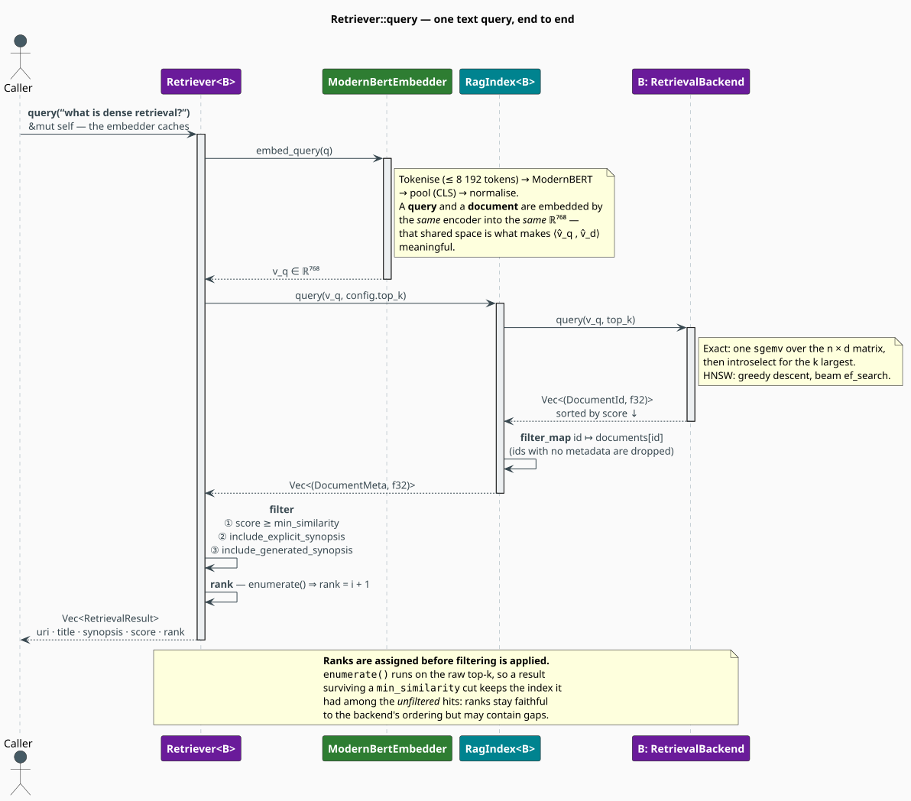

# The Retriever

`Retriever<B>` is the front door: it takes a **string**, and gives back a ranked list of
**documents a human can read**. Everything between those two points — encoding the query into the
document's vector space, searching the backend, joining against metadata, applying policy filters,
and assigning ranks — is this component's job. This document walks the pipeline stage by stage,
and is candid about the two places where its behaviour will surprise you.

> **Scope.** Source of truth: [`src/rag/retriever.rs`](../../../src/rag/retriever.rs). For the
> search it delegates to, see [Index](index.md) and [Backend](backend.md); for the encoder it
> owns, see [Neural Embedder](../neural/embedder.md).

## Notation

| Symbol | Meaning |
|---|---|
| $`q`$ | the query text |
| $`E(\cdot)`$ | the ModernBERT encoder; $`v_q = E(q) \in \mathbb{R}^{d}`$ |
| $`d`$ | embedding dimension ($`768`$ for ModernBERT-base) |
| $`k`$ | `RetrievalConfig::top_k` — the number of *candidates* fetched from the index |
| $`\tau`$ | `RetrievalConfig::min_similarity` — the score floor |
| $`H`$ | the ordered candidate list returned by the index, $`\lvert H \rvert \leq k`$ |
| $`\phi`$ | the filter predicate applied to each candidate |
| $`s_i`$ | the cosine similarity of the $`i`$-th candidate |

## The pipeline



Composed, the retriever is a four-stage function:

```math
\begin{array}{lr}
\displaystyle \mathrm{query}(q)
\;=\;
\underbrace{\mathrm{rank}}_{4}
\;\circ\;
\underbrace{\mathrm{filter}_{\phi}}_{3}
\;\circ\;
\underbrace{\mathrm{index.query}(\cdot,\, k)}_{2}
\;\circ\;
\underbrace{E}_{1}
\;\bigl(q\bigr) & \text{(Q1)}
\end{array}
```

Stage 1 is the only one that touches a neural network; stage 2 is the only one that touches
geometry; stages 3 and 4 are pure policy over the result list.

### Stage 1: encode the query

```rust
let embedding = self.embedder.embed_query(query)?;
```

`embed_query` and `embed_document` are two entry points into the **same** ModernBERT weights and
the same pooling strategy. This is the bi-encoder discipline, and it is a correctness requirement,
not a convenience: the inner product $`\langle \hat{v}_q, \hat{v}_D \rangle`$ is meaningless unless
$`v_q`$ and $`v_D`$ were produced by the same map. Index a corpus with one model and query it with
another and you will get *plausible-looking nonsense* — the scores will be finite, ordered, and
wrong. See [Overview](overview.md#design-notes).

### Stage 2: search the index

```rust
let raw_results = self.index.query(embedding, self.config.top_k);
```

The index scores every document (exactly, or approximately under HNSW), takes the top $`k`$, and
joins the surviving ids against its metadata map — the existence invariant $`(\mathrm{I2})`$ of
[Index](index.md#the-existence-invariant). What comes back is `Vec<(DocumentMeta, f32)>`, already
sorted by score, descending.

### Stage 3: filtering

Each candidate is tested against a conjunction of three predicates:

```math
\begin{array}{lr}
\displaystyle \phi(\text{meta},\, s)
\;=\;
\underbrace{\bigl(s \geq \tau\bigr)}_{\text{score floor}}
\;\wedge\;
\underbrace{\bigl(\text{explicit} \Rightarrow \texttt{include\_explicit\_synopsis}\bigr)}_{\text{provenance gate}}
\;\wedge\;
\underbrace{\bigl(\neg\,\text{explicit} \Rightarrow \texttt{include\_generated\_synopsis}\bigr)}_{\text{provenance gate}} & \text{(Q2)}
\end{array}
```

where *explicit* abbreviates `meta.synopsis_source == SynopsisSource::Explicit`.

```rust
pub struct RetrievalConfig {
    pub top_k: usize,                       // default 10
    pub min_similarity: f32,                // default 0.0  — admits everything, incl. negatives
    pub include_explicit_synopsis: bool,    // default true
    pub include_generated_synopsis: bool,   // default true
}
```

The **score floor** $`\tau`$ deserves thought. Cosine similarity ranges over $`[-1, 1]`$, and the
default $`\tau = 0`$ therefore admits every orthogonal-or-better document — including ones with no
meaningful relation to the query. A retriever with a permissive floor always returns *something*,
which is rarely what a RAG prompt wants. Sensible floors for ModernBERT embeddings start around
$`\tau \approx 0.3`$; tune against a labelled development set rather than by intuition, because the
absolute scale of cosine scores is model-dependent.

The **provenance gates** exploit `Synopsis`'s two-valued source (see
[Document](document.md#synopsis-provenance)). Setting `include_generated_synopsis: false` restricts
results to documents whose summary a human wrote — useful when the synopsis will be shown to a user
verbatim, or spliced into a prompt as ground truth.

### Stage 4: ranking

```rust
pub struct RetrievalResult {
    pub uri: String,
    pub title: Option<String>,
    pub synopsis: String,
    pub synopsis_is_explicit: bool,
    pub score: f32,       // cosine similarity in [-1, 1]
    pub rank: usize,      // 1 = best
}
```

`display_title()` returns the title if there is one and the URI otherwise, so a hit list always
renders.

## Two behaviours that will surprise you

### Ranks are assigned *before* filtering

The implementation reads:

```rust
raw_results
    .into_iter()
    .enumerate()                                   // ← rank is fixed HERE …
    .filter(|(_, (meta, score))| { /* φ, per (Q2) */ })   // ← … and filtering happens AFTER
    .map(|(i, (meta, score))| RetrievalResult::from_meta(&meta, score, i + 1))
    .collect()
```

Because `enumerate()` precedes `filter`, `rank` is the candidate's **position among the unfiltered
top-$`k`$**, not its position in the returned list. Formally, for the $`i`$-th candidate (0-based):

```math
\begin{array}{lr}
\displaystyle \mathrm{rank}_i \;=\; i + 1
\qquad\text{regardless of how many of } \{0, \dots, i-1\} \text{ were filtered out} & \text{(Q3)}
\end{array}
```

Two consequences follow, and both are visible to callers:

1. **Ranks can have gaps.** If candidates 1 and 3 survive $`\phi`$ but 2 does not, the results
   carry ranks $`1`$ and $`3`$.
2. **The first result need not have rank $`1`$.** If the top-scoring candidate is filtered out —
   say it has a generated synopsis and the caller demanded explicit ones — the best surviving
   result carries rank $`2`$.

This is faithful to the *backend's* ordering, which is arguably the point: `rank` tells you where a
document placed among all candidates, and `score` remains monotonically non-increasing down the
list either way. But if you need a dense $`1..m`$ numbering of what you actually got, renumber at
the call site:

```rust
let mut results = retriever.query("dense retrieval")?;
for (i, result) in results.iter_mut().enumerate() {
    result.rank = i + 1;   // dense renumbering of the surviving hits
}
# Ok::<(), libgrammstein::rag::RagError>(())
```

### `query` takes `&mut self`; `query_with_embedding` does not

```rust
pub fn query(&mut self, query: &str) -> Result<Vec<RetrievalResult>>;
pub fn query_with_embedding(&self, embedding: &[f32]) -> Result<Vec<RetrievalResult>>;
```

The `&mut self` on `query` is **stronger than necessary** — `ModernBertEmbedder::embed_query` takes
`&self`, and the index sits behind an `Arc` — but it is the signature, so it is binding: a
`Retriever` cannot serve two text queries concurrently through `query`.

`query_with_embedding` takes `&self` and is therefore the **concurrency-friendly entry point**.
Embed the queries yourself (the embedder is `&self`-callable and internally cached), then fan out:

```rust
use std::sync::Arc;
use rayon::prelude::*;

// The embedder can be called concurrently; so can query_with_embedding.
let embeddings: Vec<Vec<f32>> = queries
    .par_iter()
    .map(|q| embedder.embed_query(q))
    .collect::<Result<_, _>>()?;

let retriever = Arc::new(retriever);   // &self methods only, from here on
let all_hits: Vec<Vec<_>> = embeddings
    .par_iter()
    .map(|v| retriever.query_with_embedding(v))
    .collect::<Result<_, _>>()?;
# Ok::<(), libgrammstein::rag::RagError>(())
```

## Batch retrieval

`BatchRetriever` wraps a `Retriever` and accepts many queries at once:

```rust
pub fn query_batch(&mut self, queries: &[&str]) -> Result<Vec<Vec<RetrievalResult>>>;
```

> **It is sequential.** The implementation is `queries.iter().map(|q| self.retriever.query(q))` —
> a plain loop. It is a convenience for *shape* (many queries in, many result lists out), not a
> performance feature, and it does **not** reach `HnswBackend::batch_query_with_ef`, which is the
> genuinely parallel batch path. For throughput, embed in parallel and use `query_with_embedding`
> as shown above; the first error aborts the whole batch either way, since `collect()` into a
> `Result` is short-circuiting.

## Rendering results

`format_results` produces a plain-text listing — rank, score to two decimals, display title, URI,
and the synopsis tagged with its provenance:

```rust
use libgrammstein::rag::{format_results, RetrievalResult};

let results = vec![RetrievalResult {
    uri: "doc://mkn".to_string(),
    title: Some("Modified Kneser-Ney".to_string()),
    synopsis: "Absolute discounting with continuation counts.".to_string(),
    synopsis_is_explicit: true,
    score: 0.95,
    rank: 1,
}];

let rendered = format_results(&results);
assert!(rendered.contains("1. [0.95] Modified Kneser-Ney"));
assert!(rendered.contains("Synopsis (explicit):"));
```

## Usage

```rust
use std::sync::Arc;

use libgrammstein::neural::{EmbeddingConfig, ModernBertEmbedder};
use libgrammstein::rag::{format_results, RetrievalConfig, Retriever};

let embedder = ModernBertEmbedder::new(EmbeddingConfig::default())?;
let mut retriever = Retriever::new(
    Arc::new(index),                       // Arc<RagIndex<B>> — shareable across threads
    embedder,
    RetrievalConfig {
        top_k: 5,
        min_similarity: 0.35,              // reject the merely-orthogonal
        include_explicit_synopsis: true,
        include_generated_synopsis: false, // author-written summaries only
    },
);

let results = retriever.query("how does absolute discounting work?")?;
for result in &results {
    println!("{:>2}. [{:.3}] {}", result.rank, result.score, result.display_title());
}
print!("{}", format_results(&results));

// Policy can change between queries without rebuilding anything.
retriever.set_config(RetrievalConfig { top_k: 20, ..Default::default() });
# Ok::<(), libgrammstein::rag::RagError>(())
```

## Tuning

| Goal | Setting |
|---|---|
| High-precision context for a prompt | `top_k` $`\approx 3`$–$`5`$, `min_similarity` $`\approx 0.4`$–$`0.5`$ |
| Broad recall for a re-ranker | `top_k` $`\approx 50`$–$`100`$, `min_similarity` $`= 0`$ |
| Human-facing hit list | `include_generated_synopsis: false`, so every summary was author-written |
| Lowest latency (HNSW) | lower `ef_search` via `HnswBackend::query_with_ef` — see [Backend](backend.md#parameters) |

Because filtering happens *after* the backend has committed to $`k`$ candidates, a strict
`min_similarity` combined with a small `top_k` can return an empty list even when relevant
documents exist further down the ranking. Over-fetch ($`k`$ large) and filter hard, rather than
under-fetching and hoping.

## Engineering

**The retriever owns its encoder.** `Retriever::new` takes a `ModernBertEmbedder` by value, so each
retriever holds a handle to the model. `ModernBertEmbedder` keeps the $`149`$-million-parameter
encoder behind an `Arc` internally (see [Neural Embedder](../neural/embedder.md)), so constructing
several retrievers does not replicate the weights — but it does replicate the embedding cache.

**The index is shared, not owned.** It is held as `Arc<RagIndex<B>>`, so many retrievers — with
different `RetrievalConfig` policies — can read one index concurrently. `index()` exposes it
immutably; there is no mutable accessor, because a retriever must never invalidate the geometry it
is querying.

**Scores are `f32`, not log-probabilities.** They are cosine similarities in $`[-1, 1]`$, directly
comparable *within* one index but not across models or across differently-normalized corpora.

## References

1. N. Reimers & I. Gurevych (2019). *Sentence-BERT: sentence embeddings using Siamese
   BERT-networks.* EMNLP-IJCNLP 2019, 3982–3992.
   [doi:10.18653/v1/D19-1410](https://doi.org/10.18653/v1/D19-1410)
2. V. Karpukhin, B. Oğuz, S. Min, P. Lewis, L. Wu, S. Edunov, D. Chen & W. Yih (2020). *Dense
   passage retrieval for open-domain question answering.* EMNLP 2020, 6769–6781.
   [doi:10.18653/v1/2020.emnlp-main.550](https://doi.org/10.18653/v1/2020.emnlp-main.550)

## See also

- [RAG Overview](overview.md) — the cosine theory behind the scores
- [Index](index.md) — the existence invariant $`(\mathrm{I2})`$ that stage 2 relies on
- [Backend](backend.md) — exact and approximate search, and per-query `ef_search`
- [Document](document.md) — synopsis provenance, which stage 3 filters on
- [Neural Embedder](../neural/embedder.md) — `embed_query` and the embedding cache
- [Neural Rescorer](../neural/rescorer.md) — re-ranking a broad candidate set
