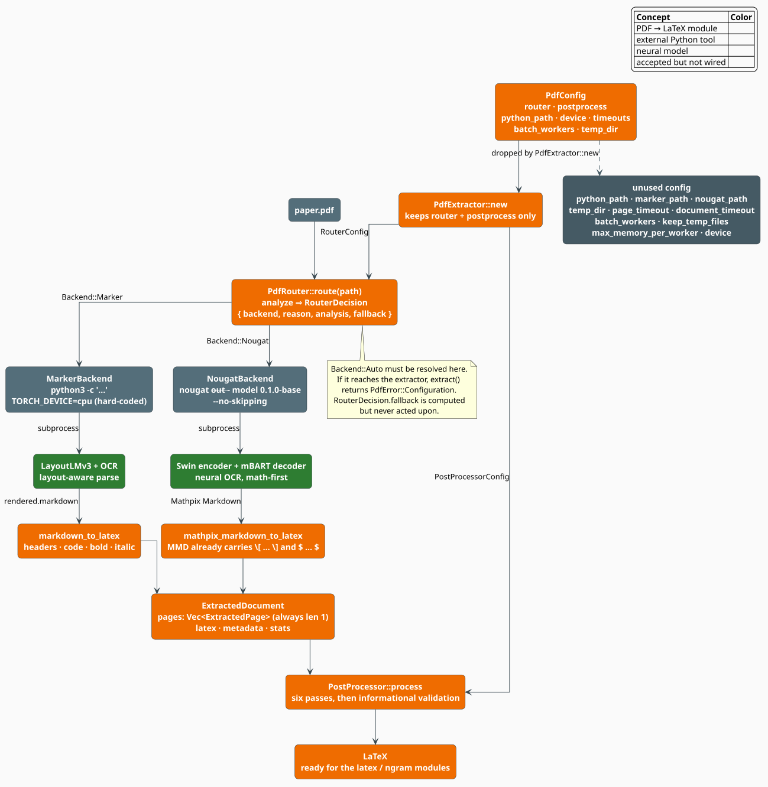
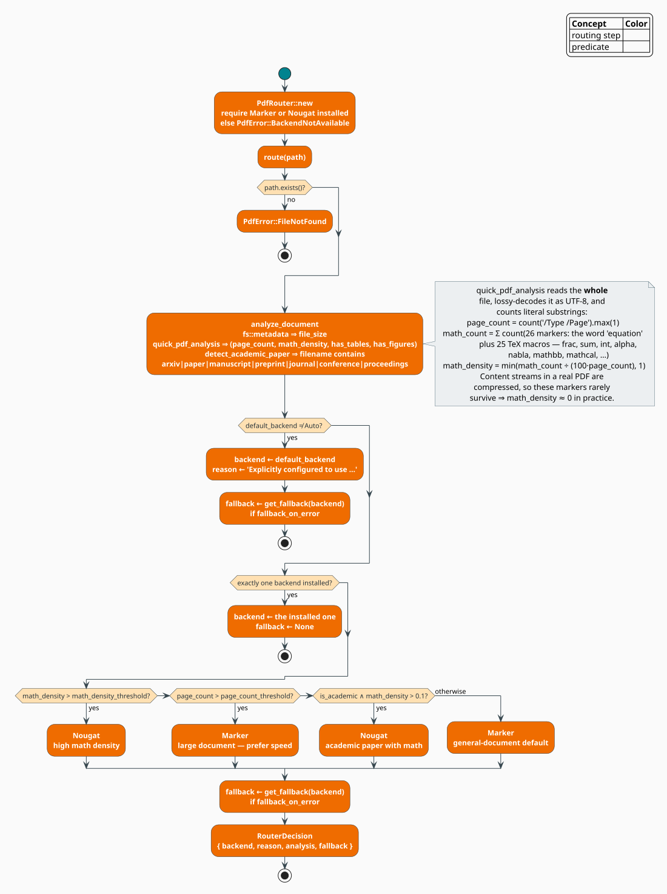
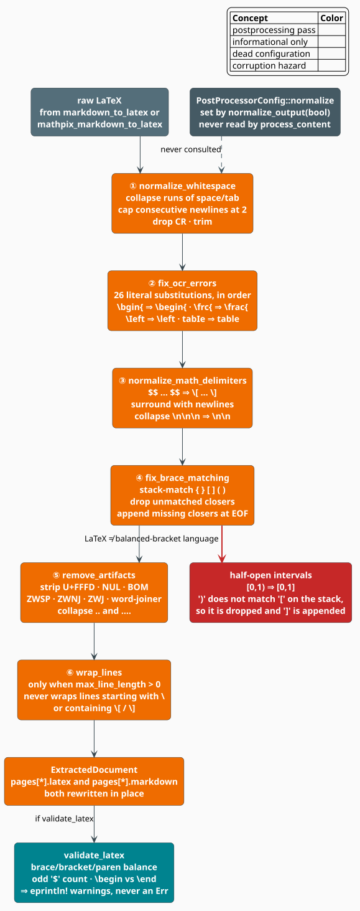

# PDF → LaTeX Source Extraction

Academic PDFs are the richest available corpus for a **LaTeX** language model — millions of
papers, every one of them originally *written* in LaTeX and then compiled into a format that
throws the source away. The `sources::pdf` module tries to invert that compilation: it drives
two external neural PDF parsers, **Marker** and **Nougat**, picks between them per document,
and cleans their output into LaTeX that the [LaTeX modeling](../latex/overview.md) and
[n-gram](../ngram/overview.md) components can train on.

This document describes the architecture as designed, the algorithms as implemented, and —
because the module is young and its shipped behaviour diverges from its ambitions in several
places — a precise account of **what is and is not wired**.

> **Scope.** Source of truth: [`src/sources/pdf/mod.rs`](../../../src/sources/pdf/mod.rs),
> [`backend.rs`](../../../src/sources/pdf/backend.rs),
> [`router.rs`](../../../src/sources/pdf/router.rs),
> [`postprocess.rs`](../../../src/sources/pdf/postprocess.rs),
> [`config.rs`](../../../src/sources/pdf/config.rs), and
> [`error.rs`](../../../src/sources/pdf/error.rs). For what consumes the extracted LaTeX see
> [LaTeX Overview](../latex/overview.md); for the other external corpus source see
> [Corpus Overview](../corpus/overview.md).

## Status: a library surface, not yet a pipeline

Read this section before building anything on the module.

- **It compiles and its unit tests pass.** The routing, post-processing, configuration, and
  error types are complete and tested.
- **Nothing in the repository calls it.** There is no CLI subcommand, no example, and no
  prelude re-export; `PdfExtractor` has zero in-tree consumers. It is a library API awaiting a
  caller.
- **It requires external Python tooling at runtime.** `PdfRouter::new` fails with
  `BackendNotAvailable` unless `marker-pdf` or `nougat-ocr` is importable/executable, so even
  constructing a `PdfExtractor` is a no-op on a machine without them.
- **Several configuration fields are accepted and then dropped.** They are enumerated in
  [Configuration](#configuration); the shortest summary is that only `config.router` and
  `config.postprocess` survive `PdfExtractor::new`.
- **Pagination is nominal.** Both backends return exactly **one** `ExtractedPage` per document
  regardless of the real page count.

None of this is fatal — the pieces are individually sound — but it means the module is a
foundation, not a finished product.

## Feature gate

```toml
# PDF to LaTeX extraction using Marker and Nougat backends
# These tools run as subprocesses (Python-based) and auto-select based on document analysis
pdf-extraction = ["dep:serde_json"]
```

The gate is thin because the heavy lifting is out-of-process. `serde_json` is the only new
dependency (Marker's subprocess speaks JSON on stdout); `rayon`, `regex`, `serde`, and
`thiserror` are unconditional dependencies of the crate already. In `src/sources/mod.rs`:

```rust
#[cfg(feature = "pdf-extraction")]
pub mod pdf;
```

and the enclosing `sources` module is itself gated on
`#[cfg(any(feature = "google-books", feature = "pdf-extraction"))]`. Build with
`--features pdf-extraction`.

The **runtime** dependencies are not Rust crates at all:

| Backend | Install | Probe used by `is_available()` |
|---|---|---|
| Marker | `pip install marker-pdf` | `python3 -c "import marker"` |
| Nougat | `pip install nougat-ocr` | `nougat --help` |

## Notation

| Symbol | Meaning |
|---|---|
| $`d`$ | the PDF document being extracted |
| $`P(d)`$ | the estimated page count of $`d`$ |
| $`M(d)`$ | the count of math markers found in $`d`$'s raw bytes |
| $`\mu(d)`$ | the estimated **math density** of $`d`$, $`\mu(d) \in [0,1]`$ |
| $`\tau_\mu`$ | the `math_density_threshold` (default $`0.3`$) |
| $`\tau_P`$ | the `page_count_threshold` (default $`50`$) |
| $`A(d)`$ | the `is_academic` predicate — true when the *filename* looks like a paper |

**Acronyms.** *OCR* — Optical Character Recognition; *MMD* — Mathpix Markdown, Nougat's output
dialect; *UAX* — Unicode Standard Annex; *ZWSP* — zero-width space.

## Architecture

`PdfExtractor` is a thin composition of a router and a post-processor:

```rust
pub struct PdfExtractor {
    router: PdfRouter,
    postprocessor: PostProcessor,
}
```

and `extract` is a three-step pipeline: **route** the document to a backend, **shell out** to
that backend, **post-process** its output.



*Figure 1 — the end-to-end path. Dashed grey marks configuration that is accepted by
`PdfConfig` and then dropped by `PdfExtractor::new`.*

### The two backends, and why there are two

The backends embody the classic accuracy/throughput trade-off in document AI:

| | **Marker** | **Nougat** |
|---|---|---|
| Model | LayoutLMv3 + OCR | Swin Transformer encoder + mBART decoder [[1]](#references) |
| Approach | layout-aware structural parse | end-to-end neural OCR, image → markup |
| Output | Markdown | Mathpix Markdown (already carries `\[ … \]`) |
| Math quality | good | **excellent** — trained on arXiv LaTeX pairs |
| Declared speed (CPU / GPU) | $`1.0`$ / $`5.0`$ pages·s⁻¹ | $`0.1`$ / $`1.0`$ pages·s⁻¹ |
| `max_concurrent_pages` | $`4`$ | $`1`$ |
| Tables / figures | both | tables only |
| Invocation | `python3 -c "<script>"` | the `nougat` CLI |

The speed figures are the **declared** `BackendCapabilities` constants, not measurements — they
are hard-coded in each backend's `info()` and exist so the router *could* reason about cost.
Nougat being an order of magnitude slower than Marker is the entire reason a router exists.

Both are driven as subprocesses. Marker gets a generated Python program on `-c`:

```python
from marker.converters.pdf import PdfConverter
from marker.models import create_model_dict

model_dict = create_model_dict()                    # loads the model weights — every call
converter = PdfConverter(artifact_dict=model_dict)
rendered = converter("<path>")
print(json.dumps({"markdown": rendered.markdown, "metadata": ...}))
```

Nougat gets a CLI invocation: `nougat <path> --out - --model 0.1.0-base --no-skipping`.

> **The trait is not object-safe.** `PdfBackend::extract<P, F>` is generic over the path and
> the progress callback, so there is no `Box<dyn PdfBackend>`. `PdfExtractor::extract` instead
> `match`es on the routed `Backend` and constructs a **fresh** `MarkerBackend` or
> `NougatBackend` on every call. Adding a third backend means editing that `match`, not just
> implementing the trait.

### Subprocess cost

Because availability is probed by *actually importing the library*, and because both the
router and the backend constructor re-probe, a single `extract` of one document in `Auto` mode
with both tools installed spawns roughly **five** Python subprocesses before any parsing
begins:

| Call site | Probe |
|---|---|
| `PdfRouter::new` | `Marker.is_available()` (short-circuits `‖`, so Nougat only if Marker is absent) |
| `auto_select` | `Marker.is_available()`, `Nougat.is_available()` |
| `get_fallback` | the *other* backend's `is_available()` |
| `MarkerBackend::new` / `NougatBackend::new` | `check_*_available()` again |

`import marker` pulls in PyTorch, so each probe costs seconds, and the extraction subprocess
then calls `create_model_dict()` — reloading the model weights **per document**. For batch work
this dominates the wall-clock time. A future revision should probe once and cache, and keep a
warm model server; today, budget for it.

## Routing

`PdfRouter::route` analyses the document, then selects a backend by a fixed cascade.



*Figure 2 — the decision procedure in evaluation order. The first matching rule wins.*

### Document analysis

`quick_pdf_analysis` reads the file and estimates four quantities from the **raw bytes**,
lossily decoded as UTF-8:

```math
P(d) = \max\bigl(\#\{\text{occurrences of ``/Type /Page''}\},\; 1\bigr),
\qquad
M(d) = \sum_{m \in \mathcal{M}} \#\{\text{occurrences of } m\}
\tag{P1}
```

where $`\mathcal{M}`$ is a fixed list of **26 markers** — the word `equation` plus 25 TeX
macros (`\frac`, `\sum`, `\int`, `\alpha`, …, `\mathbb`, `\mathcal`). Math density normalises
$`M`$ against an assumed 100 markers-per-page saturation point:

```math
\mu(d) = \min\!\left(\frac{M(d)}{100 \cdot P(d)},\; 1\right)
\tag{P2}
```

> **Honest assessment.** $`(\mathrm{P1})`$ and $`(\mathrm{P2})`$ are heuristics over a
> *compressed binary format*, and they are weaker than they look:
>
> - A PDF's text lives in **Flate-compressed content streams**. The literal bytes `\frac` or
>   `\sum` are LaTeX *source*, which the PDF compiler consumed; they do not appear in the PDF
>   at all except by accident. In practice $`M(d) \approx 0`$ and therefore
>   $`\mu(d) \approx 0`$ for real papers — so the $`\mu > \tau_\mu`$ rule almost never fires
>   and `Auto` almost always resolves to **Marker**.
> - The page-count probe requires the exact string `/Type /Page`, with that spacing. Many
>   producers emit `/Type/Page`, and object streams may be compressed, in which case the count
>   is $`0`$ and the `.max(1)` clamp reports a **one-page** document.
> - `/Type /Pages` (the page-*tree* node) contains `/Type /Page` as a prefix, so each tree node
>   inflates $`P(d)`$ by one.
> - The whole file is read into memory (`std::fs::read`) and decoded, despite the code comment
>   promising to "read first few KB".
>
> A sound implementation would parse the PDF (the crate already has an optional `pdf`
> dependency behind the `ocr` feature) and count real page objects, then sample decoded text
> for math glyphs. Until then, treat `Auto` as "Marker unless you say otherwise", and set
> `default_backend` explicitly for math-heavy corpora.

`is_academic` is likewise filename-based: $`A(d)`$ is true when the lowercased filename contains
any of `arxiv`, `paper`, `manuscript`, `preprint`, `journal`, `conference`, `proceedings`. And
`has_tables` / `has_figures` are computed — by looking for `/Table`, `tabular`, `/Figure`,
`/Image`, `/XObject` — but **never consulted** by `auto_select`.

### The decision cascade

With both backends installed, `auto_select` applies the first rule that matches:

```math
\mathrm{backend}(d) =
\begin{cases}
\textbf{Nougat} & \text{if } \mu(d) > \tau_\mu \\
\textbf{Marker} & \text{else if } P(d) > \tau_P \\
\textbf{Nougat} & \text{else if } A(d) \wedge \mu(d) > 0.1 \\
\textbf{Marker} & \text{otherwise}
\end{cases}
\tag{P3}
```

Ahead of the cascade sit two overrides: an explicit `default_backend ≠ Auto` short-circuits
everything, and if exactly one backend is installed it is used unconditionally. `RouterConfig`
ships four presets:

| Preset | `default_backend` | $`\tau_\mu`$ | $`\tau_P`$ | `fallback_on_error` |
|---|---|---|---|---|
| `RouterConfig::default()` | `Auto` | $`0.3`$ | $`50`$ | `true` |
| `marker_only()` | `Marker` | $`0.3`$ | $`50`$ | `false` |
| `nougat_only()` | `Nougat` | $`0.3`$ | $`50`$ | `false` |
| `math_optimized()` | `Auto` | $`0.1`$ | $`50`$ | `true` |
| `speed_optimized()` | `Auto` | $`0.5`$ | $`20`$ | `true` |

> **`fallback` is computed but never used.** `RouterDecision` carries a
> `fallback: Option<Backend>`, populated when `fallback_on_error` is set. `PdfExtractor::extract`
> never reads it: if the chosen backend fails, the error propagates. Likewise
> `timeout_switch_seconds` and `parallel_pages` are configuration that no code path consults.

## Extraction and the shape of the result

```rust
pub struct ExtractedDocument {
    pub source_path: String,
    pub backend: Backend,
    pub pages: Vec<ExtractedPage>,   // always exactly one element
    pub latex: String,               // the whole document
    pub metadata: DocumentMetadata,  // always Default::default()
    pub stats: ExtractionStats,
}
```

with convenience methods `page_count()`, `equation_count()` (summed over pages), and
`average_confidence()`.

**What the backends actually populate**, and what they leave at zero:

| Field | Marker | Nougat | Note |
|---|---|---|---|
| `latex`, `pages[0].latex` | ✓ | ✓ | the real payload |
| `pages[0].markdown` | ✓ raw Markdown | ✓ raw MMD | pre-conversion text, preserved |
| `pages[0].equation_count` | heuristic | heuristic | see $`(\mathrm{P4})`$ below |
| `pages[0].confidence` | $`0.9`$ | $`0.95`$ | **hard-coded constants**, not model confidences |
| `pages[0].figure_count`, `table_count` | $`0`$ | $`0`$ | never populated |
| `stats.processing_time_ms` | ✓ | ✓ | genuinely measured |
| `stats.total_characters` | $`0`$ | $`0`$ | never populated |
| `stats.total_figures`, `total_tables` | $`0`$ | $`0`$ | never populated |
| `metadata` (title, authors, abstract) | $`\varnothing`$ | $`\varnothing`$ | Marker's subprocess *requests* `rendered.metadata`, then discards it |

The equation heuristic counts delimiter occurrences on the pre-post-processed LaTeX:

```math
\texttt{equation_count} =
\#\{\texttt{\textbackslash begin\{equation\}}\} + \#\{\texttt{\textbackslash[}\} + \#\{\texttt{\$\$}\}
\;\;(+\; \#\{\texttt{\textbackslash begin\{align\}}\} \text{ for Nougat})
\tag{P4}
```

A display block delimited by a doubled dollar,
$`\texttt{\$\$} \ldots \texttt{\$\$}`$, contains **two** occurrences of that delimiter, so
every such equation is counted **twice**; a
$`\texttt{\textbackslash[} \ldots \texttt{\textbackslash]}`$ block, having only its opener
counted, contributes **once**. Read `equation_count` as a rough math-volume signal, not a
count.

### Progress reporting

`ExtractionStage` declares five stages — `Analyzing`, `Extracting`, `MathOcr`,
`Postprocessing`, `Validating` — but each backend emits exactly **two** `ExtractionProgress`
callbacks: `Analyzing` at $`0\%`$ before the subprocess, and `Postprocessing` at $`100\%`$
after it. `Extracting`, `MathOcr`, and `Validating` are never emitted, and `current_page` /
`total_pages` only ever take the values $`0/0`$ then $`1/1`$. Fine-grained progress would
require streaming the subprocess's stdout, which the current `Command::output()` call (which
blocks until exit) does not do.

### Markdown → LaTeX conversion

Each backend converts its native output to LaTeX with a small regex/replace pass. **Both
conversions have defects that a caller must know about.**

`markdown_to_latex` (Marker) does:

```rust
latex = latex.replace("# ",   "\\section{");
latex = latex.replace("## ",  "\\subsection{");
latex = latex.replace("### ", "\\subsubsection{");
// then regex passes for `code`, **bold**, *italic*
```

1. **The braces are never closed.** `# Title` becomes `\section{Title` — the code comment
   concedes the point ("Close headers (simple heuristic: end at newline) … This is a basic
   conversion"). Downstream, `fix_brace_matching` dutifully appends the missing `}` — at the
   **end of the document**, so the entire remainder of the paper becomes the argument of the
   first `\section{`. Valid braces, wrong document.
2. **The H2/H3 arms are dead.** `str::replace` scans left to right, so `## Title` matches the
   *first* pattern `"# "` at offset 1 and becomes `#\section{Title`. By the time the `"## "`
   replacement runs there are no `## ` sequences left. Only H1 ever produces a sectioning
   command, and it produces the wrong one for H2/H3.

`mathpix_markdown_to_latex` (Nougat) is in better shape — MMD already emits `\[ … \]` and
$` … `$ for math, so math passes through untouched — but its header regexes are
`^# (.+)$` **without the multi-line flag**. In the `regex` crate, `^` and `$` anchor to the
whole haystack unless `(?m)` is set, and `.` does not cross a newline. A multi-line document
therefore matches none of them, and Nougat's headers are silently left as Markdown. (The bold
and italic regexes have no anchors and do work.)

## Post-processing

`PostProcessor::process` rewrites `latex` **and** `markdown` on every page through six
order-dependent passes, each gated by its own flag, then optionally validates.



*Figure 3 — passes run in this fixed order; each is individually switchable.*

| # | Pass | Flag | What it does |
|---|---|---|---|
| ① | `normalize_whitespace` | `normalize_whitespace` | collapse space/tab runs; cap consecutive newlines at 2; drop CR; trim |
| ② | `fix_ocr_errors` | `fix_ocr_errors` | 26 literal substitutions for OCR confusions |
| ③ | `normalize_math_delimiters` | `normalize_math_delimiters` | rewrite $`\texttt{\$\$} \ldots \texttt{\$\$}`$ into $`\texttt{\textbackslash[} \ldots \texttt{\textbackslash]}`$, pad with newlines |
| ④ | `fix_brace_matching` | `fix_brace_matching` | stack-balance `{}`, `[]`, `()` |
| ⑤ | `remove_artifacts` | `remove_artifacts` | strip U+FFFD, NUL, BOM, ZWSP/ZWNJ/ZWJ, word-joiner; collapse `..` and `....` |
| ⑥ | `wrap_lines` | `max_line_length > 0` | word-wrap prose lines only |

Presets: `PostProcessorConfig::default()` enables everything with no wrapping;
`minimal()` keeps only whitespace normalisation; `thorough()` enables everything and wraps at
80 columns.

### Pass ② is a substitution list, with three redundancies

The OCR fix table targets the glyph confusions that plague scanned math — `l`/`I`/`1`,
`O`/`0` — mapping e.g. `\Ieft` → `\left`, `\Ieq` → `\leq`, `\0mega` → `\Omega`, `tabIe` →
`table`, `\bgin{` → `\begin{`, `\frc{` → `\frac{`. Three entries are inert and can be ignored
when reading the source: `(\rho, \rho)`, `(\sum_, \sum_)`, `(\int_, \int_)`, and
`(eqnarray, eqnarray)` are **identity** mappings, and `\Iambda` appears twice (mapped first to
`\lambda`, so the later `\Lambda` entry never fires).

### Pass ④ can corrupt valid mathematics

`fix_brace_matching` treats `{}`, `[]`, **and `()`** as a matched-delimiter language: it pushes
openers on a stack, drops any closer that does not match the top of the stack, and appends
whatever is still open at EOF. That is correct for `{}` and for the `\[ … \]` math pairs that
pass ③ produces. It is **wrong for parentheses and brackets in mathematical text**, because
LaTeX is not a balanced-bracket language. The canonical casualty is the half-open interval:

| Input | Stack behaviour | Output |
|---|---|---|
| `[0,1)` | `[` pushed; `)` does not match `[` on top ⇒ **dropped**; `[` still open at EOF ⇒ `]` appended | `[0,1]` |

A half-open interval is silently rewritten into a closed one — a change of *meaning*, not of
formatting. Intervals like $`(a, b]`$, coordinates, and any prose with an unmatched
parenthesis are exposed to the same rewrite. **If your corpus contains real mathematics, set
`fix_brace_matching: false`** and rely on validation to report imbalance instead of silently
"repairing" it.

### Pass ⑤ has a document-global coupling

```rust
while result.contains("..") && !result.contains("...") {
    result = result.replace("..", ".");
}
```

The guard is evaluated over the **whole document**. A single legitimate ellipsis anywhere
disables `..` collapsing everywhere; remove that ellipsis and the pass suddenly starts
rewriting every `..` in the document. Behaviour that depends non-locally on unrelated text is
worth knowing about before you trust a diff.

### Validation is informational only

`validate_latex` checks brace/bracket/paren balance, an odd count of `$`, and
`\begin`/`\end` parity, returning a `Vec<String>` of issues. `validate_document` prints them
with `eprintln!` and **returns `Ok(())` regardless**. Nothing fails, and no `PdfError::Validation`
is ever constructed by this path. The module doc-comment's promise to "verify LaTeX syntax
using latex-parser" is unimplemented: the checks are hand-rolled counters, and no parser is
invoked.

Also note `PostProcessorConfig::normalize` — settable via `PdfConfigBuilder::normalize_output`
— is **never read** by `process_content`. It is a dead flag.

## Configuration

```rust
pub struct PdfConfig {
    pub router: RouterConfig,               // ✓ used
    pub postprocess: PostProcessorConfig,   // ✓ used
    pub python_path: PathBuf,               // ✗ dropped
    pub marker_path: Option<PathBuf>,       // ✗ dropped
    pub nougat_path: Option<PathBuf>,       // ✗ dropped
    pub temp_dir: Option<PathBuf>,          // ✗ dropped
    pub page_timeout: Duration,             // ✗ dropped
    pub document_timeout: Duration,         // ✗ dropped
    pub batch_workers: usize,               // ✗ dropped
    pub keep_temp_files: bool,              // ✗ dropped
    pub max_memory_per_worker: Option<usize>, // ✗ dropped
    pub device: String,                     // ✗ dropped
}
```

`PdfExtractor::new` keeps `router` and `postprocess` and **discards the rest**. The backends
are then built with `MarkerBackend::new()` / `NougatBackend::new()`, whose constructors
hard-code `python_path = "python3"`, `device = "cpu"`, and `model_tag = "0.1.0-base"`. The
builder methods that *would* thread the configuration through — `with_python_path`,
`with_device`, `with_marker_path`, `with_nougat_path`, `with_model_tag` — exist on the backends
but are never called by the extractor.

The practical consequences:

- **`device` is inert.** Setting `device: "cuda:0"` on `PdfConfig` does not reach the
  subprocess; Marker is always launched with `TORCH_DEVICE=cpu`. To use a GPU today you must
  construct `MarkerBackend::new()?.with_device("cuda:0")` yourself and call `extract` on it
  directly, bypassing `PdfExtractor`.
- **Timeouts are not enforced.** Both backends call `Command::output()`, which blocks until the
  child exits. `page_timeout` and `document_timeout` are never armed, and
  `PdfError::Timeout` is never constructed. A hung Nougat process hangs the caller.
- **`batch_workers` does not size the pool.** `extract_batch` uses `rayon`'s `par_iter` on the
  **global** thread pool. Control the width with `RAYON_NUM_THREADS` or an explicit
  `rayon::ThreadPoolBuilder`.
- **`effective_temp_dir()` exists and is never called.**

`PdfConfig::validate()` is real and worth calling — it rejects zero timeouts, zero workers, and
a `math_density_threshold` outside $`[0,1]`$. `PdfConfigBuilder::build_validated()` runs it for
you.

## Errors

`PdfError` (with `pub type PdfResult<T> = Result<T, PdfError>`) has 14 variants; the ones the
shipped code actually constructs are marked:

| Variant | Constructed? | Raised by |
|---|---|---|
| `Io(io::Error)` | ✓ | `#[from]`, and `quick_pdf_analysis` |
| `FileNotFound(PathBuf)` | ✓ | `route`, both backends' `extract` |
| `BackendNotAvailable { backend, reason }` | ✓ | `PdfRouter::new`, `MarkerBackend::new`, `NougatBackend::new` |
| `BackendFailed { backend, message }` | ✓ | subprocess spawn failure or non-zero exit |
| `InvalidOutput { backend, reason }` | ✓ | Marker's stdout is not valid JSON |
| `Configuration(String)` | ✓ | `Backend::Auto` reaching the extractor unresolved |
| `Timeout { seconds }` | ✗ | — timeouts are never enforced |
| `Validation(String)` | ✗ | — validation only warns |
| `Postprocess(String)` | ✗ | — |
| `InvalidPdf`, `PythonEnvironment`, `ResourceExhaustion`, `PageExtractionFailed`, `UnsupportedFeature` | ✗ | — reserved |

Three helpers support recovery logic: `is_recoverable()` (true for `PageExtractionFailed` and
`Timeout` — both currently unreachable), `is_backend_missing()`, and `backend_name()`, which
returns the offending backend for the three backend-scoped variants.

## Usage

The intended shape, once a backend is installed:

```rust
use libgrammstein::sources::pdf::{Backend, PdfConfigBuilder, PdfExtractor};

// Auto-route; be strict about math; wrap output at 80 columns via the `thorough` preset.
let config = PdfConfigBuilder::new()
    .backend(Backend::Auto)
    .math_density_threshold(0.3)
    .validate_latex(true)
    .build_validated()?;                 // ← runs PdfConfig::validate

let extractor = PdfExtractor::new(config)?;   // errs if neither backend is installed

let doc = extractor.extract("arxiv-2401.00001.pdf", |p| {
    // Two callbacks arrive: Analyzing @ 0 %, Postprocessing @ 100 %.
    println!("{:?} — {:.0}%", p.stage, p.percent);
})?;

println!("{} equations, {:.0} ms", doc.equation_count(), doc.stats.processing_time_ms);
println!("{}", doc.latex);
# Ok::<(), libgrammstein::sources::pdf::PdfError>(())
```

Batch extraction parallelises across documents with `rayon` (one subprocess per document, so
mind the memory):

```rust
use libgrammstein::sources::pdf::{PdfConfig, PdfExtractor};

let extractor = PdfExtractor::new(PdfConfig::default())?;
let paths = ["a.pdf", "b.pdf", "c.pdf"];

let results = extractor.extract_batch(&paths, |b| {
    println!("[{}/{}] {} {}", b.current, b.total, b.path, if b.success { "ok" } else { "FAILED" });
});

let latex: Vec<String> = results.into_iter().filter_map(Result::ok).map(|d| d.latex).collect();
# Ok::<(), libgrammstein::sources::pdf::PdfError>(())
```

For a math-heavy corpus, prefer pinning the backend and disabling the bracket "fixer":

```rust
use libgrammstein::sources::pdf::{PdfConfig, PostProcessorConfig, RouterConfig};

let config = PdfConfig {
    router: RouterConfig::nougat_only(),           // Nougat: trained on arXiv LaTeX
    postprocess: PostProcessorConfig {
        fix_brace_matching: false,                 // do not rewrite [0,1) into [0,1]
        ..PostProcessorConfig::default()
    },
    ..PdfConfig::default()
};
```

## Recommended next steps for the module

Ordered by the ratio of correctness gained to work required:

1. **Close the header braces** in `markdown_to_latex`, and fix the replacement order so `##`
   and `###` are matched before `#`. Today one malformed header swallows the document.
2. **Add `(?m)`** to the four header regexes in `mathpix_markdown_to_latex`.
3. **Restrict `fix_brace_matching` to `{}`**, or make bracket/paren balancing opt-in. It
   currently changes the meaning of interval notation.
4. **Thread `PdfConfig` into the backends** — `python_path`, `device`, `model_tag` — so GPU
   extraction is reachable through `PdfExtractor`.
5. **Enforce the timeouts** by replacing `Command::output()` with a spawn plus a wait-with-
   deadline, and construct the `PdfError::Timeout` that already exists.
6. **Probe availability once**, cache it, and keep the model warm across a batch.
7. **Parse the PDF** (with the existing optional `pdf` crate) for a real page count and a math
   estimate taken from decoded text, so `Auto` routing means something.

## References

1. L. Blecher, G. Cucurull, T. Scialom & R. Stojnic (2023). *Nougat: Neural Optical
   Understanding for Academic Documents.* arXiv:2308.13418.
   [doi:10.48550/arXiv.2308.13418](https://doi.org/10.48550/arXiv.2308.13418)
2. Y. Xu, T. Lv, L. Cui, G. Wang, Y. Lu, D. Florencio, C. Zhang & F. Wei (2021).
   *LayoutLMv3: Pre-training for Document AI with Unified Text and Image Masking.*
   arXiv:2204.08387. [doi:10.48550/arXiv.2204.08387](https://doi.org/10.48550/arXiv.2204.08387)
3. VikParuchuri. *Marker: convert PDF to markdown quickly and accurately.*
   [github.com/VikParuchuri/marker](https://github.com/VikParuchuri/marker)
4. Z. Liu, Y. Lin, Y. Cao, H. Hu, Y. Wei, Z. Zhang, S. Lin & B. Guo (2021). *Swin Transformer:
   Hierarchical Vision Transformer using Shifted Windows.* ICCV 2021, 10012–10022.
   [doi:10.1109/ICCV48922.2021.00986](https://doi.org/10.1109/ICCV48922.2021.00986) — Nougat's
   visual encoder.

## See also

- [LaTeX Overview](../latex/overview.md) — what the extracted LaTeX is used to model
- [LaTeX Tokenizer](../latex/tokenizer.md) — the mode-aware lexer that consumes it
- [Corpus Overview](../corpus/overview.md) — the other corpus readers and their formats
- [N-gram Overview](../ngram/overview.md) — the model the extracted text ultimately trains
- [Architecture Overview](../../architecture/overview.md) — where `sources` sits in the crate
