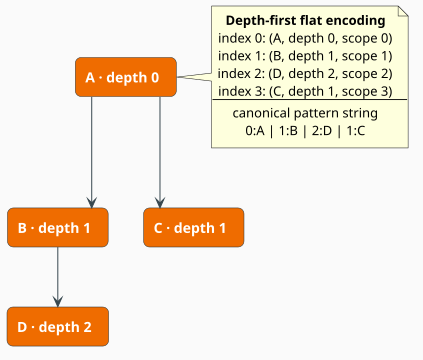
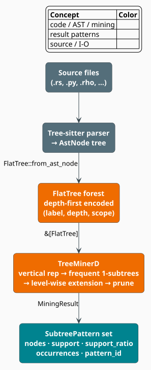

# Subtree Mining

Source-code abstract syntax trees are full of recurring structure — `if`/`else`/`return`
skeletons, builder chains, error-handling shapes, and outright copy-paste clones. **Frequent
subtree mining** discovers that structure automatically: given a forest of ASTs, it returns the
tree-shaped patterns that occur in at least a chosen fraction of the trees. libgrammstein
implements the **TreeMinerD** algorithm of Zaki [[1]](#references), which encodes each tree as a
depth-first string and grows patterns one node at a time. This document explains the encoding, the
support model, and the concrete types; the level-wise mining loop itself is detailed in
[TreeMinerD Algorithm](treeminer-d.md).

> **Scope.** Source of truth:
> [`src/code/subtree/mod.rs`](../../../src/code/subtree/mod.rs),
> [`src/code/subtree/pattern.rs`](../../../src/code/subtree/pattern.rs), and
> [`src/code/subtree/treeminer.rs`](../../../src/code/subtree/treeminer.rs). The trees are built
> from the AST types in [`src/code/ast.rs`](../../../src/code/ast.rs) (see [AST](../code/ast.md)).

## Why mine subtrees?

A flat token n-gram cannot express "a function whose body is an `if` with a `return`" — that is a
*shape*, not a sequence. Mining over ASTs recovers such shapes and enables:

- **idiom discovery** — the high-support patterns are a codebase's common constructions;
- **clone detection** — a large pattern occurring in a handful of files flags duplicated logic;
- **design-pattern detection** — factories, builders, and visitors have recognizable subtrees;
- **pattern-based completion** — a partial tree can be matched against mined patterns to suggest
  what usually comes next.

## Depth-first tree encoding

TreeMinerD never manipulates pointer-linked trees during mining. Each tree is *flattened* to a
sequence of nodes in **pre-order** (depth-first, parent before children, left to right); every
node records its **depth**, which is enough to reconstruct the parent-child structure without
explicit pointers.



For the tree above, [`FlatTree::from_ast_node`](../../../src/code/subtree/pattern.rs) emits the
sequence $`\langle (A,0), (B,1), (D,2), (C,1) \rangle`$, writing the node's AST kind as its label
and its nesting level as its depth. Because pre-order plus depth is a bijection with the tree,
patterns can be compared as strings: the **canonical encoding** of a pattern is
`depth:label` fields joined by `|`, e.g. `0:A|1:B|2:D|1:C`
([`encode_pattern`](../../../src/code/subtree/pattern.rs)). This string is canonical (one tree,
one string), compact ($`O(k)`$ for a $`k`$-node pattern), and comparable (string equality is tree
equality), which is what makes candidate grouping cheap.

Each [`FlatNode`](../../../src/code/subtree/pattern.rs) also carries a `scope` field. As populated
by `from_ast_node` it is the node's **linear position** in the pre-order sequence (the index it was
inserted at); it derives from Zaki's *scope-list* concept [[1]](#references) but is metadata only —
the matcher keys entirely off labels and relative depths, not `scope`.

## Support and frequency

Let the input be a forest of $`m`$ trees and let $`P`$ be a candidate pattern. The **support** of
$`P`$ is the number of *distinct trees* that contain it (multiple occurrences within one tree do
not raise support), and the **support ratio** normalizes that by the forest size:

```math
\mathrm{support}(P) = \bigl\lvert \{\, t : P \text{ occurs in tree } t \,\} \bigr\rvert,
\qquad
\mathrm{support\_ratio}(P) = \frac{\mathrm{support}(P)}{m} \tag{S1}
```

A pattern is **frequent** when its support meets a threshold derived from the configured minimum
support fraction $`\sigma \in [0, 1]`$:

```math
\mathrm{support}(P) \;\ge\; \max\!\bigl(\lceil \sigma\, m \rceil,\; 1\bigr) \tag{S2}
```

The right-hand side is [`MiningResult::min_support_count`](../../../src/code/subtree/treeminer.rs).
Frequency is **downward closed** (the Apriori property): every subtree of a frequent pattern is
itself frequent, so a pattern can be frequent only if all of its one-node-smaller prefixes are —
this is exactly what lets TreeMinerD grow patterns level by level and prune aggressively (see
[TreeMinerD Algorithm](treeminer-d.md)).

What "occurs in" means here is Zaki's **embedded** subtree match: the pattern's nodes must appear
in pre-order at their recorded *relative depths* within a single rooted subtree of the host tree,
though intervening host nodes may be skipped. Embedded matching (as opposed to strictly induced
matching) captures patterns that share ancestry even when unrelated nodes sit between them.

## The mining pipeline



Source files are parsed to ASTs, each AST is flattened to a
[`FlatTree`](../../../src/code/subtree/pattern.rs), and the forest is handed to
[`TreeminerD::mine`](../../../src/code/subtree/treeminer.rs), which returns a
[`MiningResult`](../../../src/code/subtree/treeminer.rs) of frequent
[`SubtreePattern`](../../../src/code/subtree/pattern.rs)s.

## Core types

### `FlatTree` and `FlatNode`

```rust
pub struct FlatNode {
    pub label: Arc<str>,   // AST kind, e.g. "function_definition"
    pub depth: usize,      // nesting level, root = 0
    pub scope: usize,      // pre-order position (metadata; see above)
}

pub struct FlatTree {
    pub nodes: Vec<FlatNode>,          // pre-order sequence
    pub tree_id: u64,                  // unique per tree (e.g. a file hash)
    pub metadata: Option<TreeMetadata>, // optional file path / language / source
}
```

`FlatTree` offers [`len`](../../../src/code/subtree/pattern.rs),
[`is_empty`](../../../src/code/subtree/pattern.rs),
[`label_positions`](../../../src/code/subtree/pattern.rs) (label → positions, the seed of the
vertical representation), and [`extract_subtree`](../../../src/code/subtree/pattern.rs) (the
contiguous slice of a node and its descendants). `from_ast_node` leaves `metadata` as `None`;
`with_metadata` attaches a `TreeMetadata` carrying the source path, language, and text.

### `PatternNode` and `SubtreePattern`

```rust
pub struct PatternNode {
    pub label: Arc<str>,
    pub depth: usize,      // depth relative to the pattern root
}

pub struct SubtreePattern {
    pub nodes: Vec<PatternNode>, // pre-order, depths relative to the pattern root
    pub support: usize,          // (S1): distinct trees containing the pattern
    pub support_ratio: f64,      // support / total_trees
    pub occurrences: Vec<u64>,   // tree_ids where the pattern occurs
    pub pattern_id: u64,
}
```

Two `SubtreePattern`s are equal (and hash equal) iff their `nodes` match, so a pattern's identity
is its shape. Useful accessors are [`size`](../../../src/code/subtree/pattern.rs) (node count),
[`max_depth`](../../../src/code/subtree/pattern.rs),
[`root_label`](../../../src/code/subtree/pattern.rs),
[`contains`](../../../src/code/subtree/pattern.rs) (subsequence containment of another pattern),
and [`to_string_repr`](../../../src/code/subtree/pattern.rs) (an indented, human-readable tree).

## Quick start

```rust
use libgrammstein::code::subtree::{FlatNode, FlatTree, TreeminerD};

// Two functions that share the `function_definition -> parameters -> block` skeleton.
let tree1 = FlatTree::new(
    vec![
        FlatNode::new("function_definition", 0, 0),
        FlatNode::new("parameters", 1, 1),
        FlatNode::new("block", 1, 2),
        FlatNode::new("return_statement", 2, 3),
    ],
    1,
);
let tree2 = FlatTree::new(
    vec![
        FlatNode::new("function_definition", 0, 0),
        FlatNode::new("parameters", 1, 1),
        FlatNode::new("block", 1, 2),
        FlatNode::new("if_statement", 2, 3),
    ],
    2,
);

// Patterns present in at least 50% of trees.
let miner = TreeminerD::new(0.5);
let result = miner.mine(&[tree1, tree2]);

for pattern in &result.patterns {
    let labels: Vec<&str> = pattern.nodes.iter().map(|n| n.label.as_ref()).collect();
    println!("support {}: {:?}", pattern.support, labels);
}
```

## Building trees from the AST

[`FlatTree::from_ast_node`](../../../src/code/subtree/pattern.rs) flattens an
[`AstNode`](../../../src/code/ast.rs) recursively, using each node's `kind` as the label:

```rust
use libgrammstein::code::ast::AstNode;
use libgrammstein::code::subtree::FlatTree;

// `ast: AstNode` parsed elsewhere; `file_hash: u64` identifies the source file.
let flat: FlatTree = FlatTree::from_ast_node(&ast, file_hash);
assert_eq!(flat.nodes[0].label.as_ref(), ast.kind.as_str()); // root label == root AST kind
```

Because a tree is just a `Vec<FlatNode>` plus an id, trees can equally be produced from any other
tree source (a tree-sitter cursor, a serialized AST) as long as the emitted nodes are in pre-order
with correct depths.

## Encoding utilities

The canonical encoding used internally for candidate grouping is exposed for storing and comparing
patterns. These functions are re-exported at the module root — there is no public `pattern`
submodule to import from.

```rust
use libgrammstein::code::subtree::{decode_pattern, encode_pattern, pattern_hash};

let encoded = encode_pattern(&pattern.nodes);   // "0:function_definition|1:parameters|..."
let decoded = decode_pattern(&encoded);         // round-trips back to Vec<PatternNode>
let digest  = pattern_hash(&pattern.nodes);     // u64 hash of the canonical string
assert_eq!(decoded, pattern.nodes);
```

## Performance

Mining time is dominated by candidate extension and scales with the forest size $`m`$, the average
nodes per tree, and — steeply — with how low the support threshold is set (a lower $`\sigma`$
admits more candidates at every level). The precise cost model is given in
[TreeMinerD Algorithm](treeminer-d.md#complexity); each run reports its measured wall time in
[`MiningResult::mining_time_ms`](../../../src/code/subtree/treeminer.rs) alongside the counts of
candidates generated and pruned. Practical levers:

1. **Raise `min_support`** — the single most effective way to shrink the search.
2. **Cap `max_pattern_size` / `max_depth`** — bounds the number of extension levels.
3. **Pre-filter AST nodes** — dropping whitespace/comment kinds before flattening removes noise.
4. **Keep the parallel path on** (the default) for multi-core machines.

## References

1. M. J. Zaki (2005). *Efficiently mining frequent trees in a forest: Algorithms and
   applications.* IEEE Transactions on Knowledge and Data Engineering 17(8), 1021–1035.
   [doi:10.1109/TKDE.2005.125](https://doi.org/10.1109/TKDE.2005.125)
2. M. J. Zaki (2002). *Efficiently mining frequent trees in a forest.* In Proceedings of the 8th
   ACM SIGKDD International Conference on Knowledge Discovery and Data Mining, 71–80.
   [doi:10.1145/775047.775058](https://doi.org/10.1145/775047.775058)

## See also

- [TreeMinerD Algorithm](treeminer-d.md) — the level-wise candidate generation and pruning loop
- [AST](../code/ast.md) — the `AstNode` trees that feed subtree mining
- [Code Embeddings](../code-embeddings/overview.md) — an alternative, neural code representation
- [Paradigm Detection](../paradigm/overview.md) — higher-level pattern mining over the same ASTs
