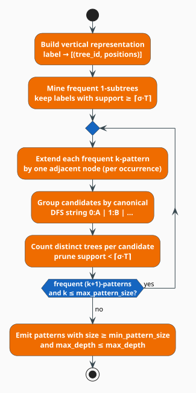

# The TreeMinerD Algorithm

Given a forest of abstract syntax trees, **which tree-shaped patterns recur?** The search space is
brutal — a tree of $`n`$ nodes has exponentially many embedded subtrees — so no algorithm can
enumerate candidates blindly. **TreeMinerD** [[1]](#references) makes the search tractable with one
classical idea, *downward closure*, and one representational trick, the *depth-first string
encoding*. This document is the mining loop: how candidates are generated, how support is counted,
how the search is pruned, and precisely where libgrammstein's implementation diverges from Zaki's
paper.

> **Scope.** Source of truth: [`src/code/subtree/treeminer.rs`](../../../src/code/subtree/treeminer.rs)
> and [`src/code/subtree/pattern.rs`](../../../src/code/subtree/pattern.rs). The encoding, the
> support model, and the core types are introduced in [Subtree Mining](overview.md) — read that
> first. Gated on the `code` feature.

## Notation

Every symbol is defined before it is used in a formula.

| Symbol | Meaning |
|---|---|
| $`\mathcal{F}`$ | the input **forest**; $`m = \lvert \mathcal{F} \rvert`$ its size in trees |
| $`t`$ | a single tree in $`\mathcal{F}`$, with $`\lvert t \rvert`$ nodes |
| $`\bar{n}`$ | the average number of nodes per tree |
| $`P`$ | a candidate **pattern** (a tree of $`k`$ labelled nodes) |
| $`k`$ | the **size** of a pattern — its node count |
| $`\ell(x)`$ | the label of node $`x`$ |
| $`\mathrm{pos}(x)`$ | the pre-order position (index) of node $`x`$ in its flattened tree |
| $`\mathrm{depth}(x)`$ | the nesting depth of $`x`$; the root has depth $`0`$ |
| $`\mathrm{scope}(x)`$ | the interval $`[\,\mathrm{pos}(x),\ \max_{y \in \mathrm{sub}(x)} \mathrm{pos}(y)\,]`$ |
| $`\mathrm{sub}(x)`$ | the set of nodes in the subtree rooted at $`x`$ (including $`x`$) |
| $`P \preceq t`$ | "$`P`$ occurs as an **embedded** subtree of $`t`$" |
| $`\sigma`$ | the minimum support **fraction**, $`\sigma \in [0,1]`$ (`min_support`) |
| $`\mathrm{sup}(P)`$ | the **support** — the number of distinct trees containing $`P`$ |
| $`\theta`$ | the minimum support **count**, $`\theta = \max(\lceil \sigma m \rceil, 1)`$ |
| $`L_k`$ | the set of frequent patterns of size $`k`$; $`\lvert L_k \rvert`$ its cardinality |
| $`\mathrm{enc}(P)`$ | the canonical depth-first string of $`P`$ |

**Acronyms.** *AST* — Abstract Syntax Tree; *DFS* — Depth-First Search.

## The two ideas

### Idea 1 — downward closure makes the search finite

The support function is **anti-monotone**: enlarging a pattern can never increase the number of
trees that contain it, because any tree containing $`P'`$ must also contain each of its subpatterns.

```math
P \subseteq P' \;\Longrightarrow\; \mathrm{sup}(P) \;\ge\; \mathrm{sup}(P') \tag{D1}
```

Contrapositively — and this is the form that does the work — **an infrequent pattern can never
become frequent by growing it**:

```math
\mathrm{sup}(P) < \theta \;\Longrightarrow\; \mathrm{sup}(P') < \theta \quad \text{for every } P' \supseteq P \tag{D2}
```

$`(\mathrm{D2})`$ is the *Apriori* principle [[3]](#references), and it licenses the entire
level-wise strategy: mine the frequent patterns of size $`k`$, extend **only those** to candidates of
size $`k+1`$, and discard the rest **together with their whole unexplored superpattern lattice**.
Every pruned candidate at level $`k`$ saves an exponential subtree of the search space.

### Idea 2 — trees as strings

A pattern is grown, hashed, compared, and grouped many millions of times, so its representation must
be cheap. TreeMinerD never manipulates pointer-linked trees during mining: each pattern is a flat
pre-order sequence of `(depth, label)` pairs, and its **canonical encoding** is that sequence
serialized ([`encode_pattern`](../../../src/code/subtree/pattern.rs)):

```math
\mathrm{enc}(P) = \bigl\langle\, d_1{:}\ell_1 \,\bigr\rangle \,\vert\, \bigl\langle\, d_2{:}\ell_2 \,\bigr\rangle \,\vert\, \dots \,\vert\, \bigl\langle\, d_k{:}\ell_k \,\bigr\rangle \tag{D3}
```

For the pattern *A* with children *B* (itself parenting *D*) and *C*, that is the string
`0:A|1:B|2:D|1:C`. The encoding is **canonical** (one tree, exactly one string), **compact**
($`O(k)`$), and **comparable** (string equality *is* tree equality) — so grouping duplicate
candidates becomes a hash-map insertion, and pattern identity costs a string hash instead of a tree
isomorphism test. See [Subtree Mining](overview.md#depth-first-tree-encoding).

### What "occurs in" means

$`P \preceq t`$ denotes an **embedded** subtree match, in Zaki's sense: the nodes of $`P`$ must
appear in $`t`$ in pre-order, at their recorded *relative depths*, all within a single rooted
subtree of $`t`$ — but intervening host nodes **may be skipped**. Embedded matching (as against
strictly *induced* matching, which forbids skipping) is what lets a pattern capture shared ancestry
through irrelevant intermediate nodes — `function` above `return` remains a match even when a
`block` and an `if` sit between them.

## Zaki's machinery: scopes and scope-list joins

The paper's efficiency comes from a **vertical** representation. Give every node the interval

```math
\mathrm{scope}(x) = \bigl[\,\mathrm{pos}(x),\ \max_{y \in \mathrm{sub}(x)} \mathrm{pos}(y)\,\bigr] \tag{D4}
```

i.e. the span of pre-order positions covered by $`x`$'s subtree. Scopes turn structural questions
into interval arithmetic. For two nodes $`x`$ and $`y`$ with scopes $`s_x = [l_x, u_x]`$ and
$`s_y = [l_y, u_y]`$:

```math
\underbrace{s_y \subset s_x}_{y \text{ is a descendant of } x}
\qquad\text{versus}\qquad
\underbrace{u_x < l_y}_{y \text{ follows } x \text{ as a sibling/cousin}} \tag{D5}
```

Patterns sharing a common $`(k-1)`$-node prefix form an **equivalence class**, and Zaki generates the
$`(k+1)`$-candidates of a class by **joining** the scope-lists of two of its members, testing
$`(\mathrm{D5})`$ to decide whether the new node attaches as a descendant or as a sibling. Support
falls straight out of the join, with no re-scan of the forest.

The **D** in TreeMinerD stands for *distinct*: this variant counts only **whether** a pattern occurs
in a tree, not how many times, so its join may stop at a tree's first witness. That is exactly the
support model libgrammstein uses — see $`(\mathrm{S1})`$ in [Subtree Mining](overview.md#support-and-frequency).

## What libgrammstein actually implements



The shipped miner keeps the level-wise skeleton, the distinct-tree support model, and the canonical
encoding — but it **does not build scope lists and does not join them**. Instead it *re-matches* each
frequent pattern against the trees it is known to occur in, extends every match it finds, and groups
the resulting candidates by their canonical string. Being explicit about this is the point of this
section.

| Aspect | Zaki's TreeMinerD | libgrammstein |
|---|---|---|
| Vertical representation | scope-lists per pattern | `label` $`\to`$ `[(tree_id, positions)]`, used only to seed $`L_1`$ |
| Candidate generation | **scope-list join** within a prefix equivalence class | **re-match**, then append one node per match |
| Duplicate candidates | prevented by canonical (rightmost-path) extension | permitted, then collapsed by $`\mathrm{enc}(P)`$ in a hash map |
| Support counting | falls out of the join | `HashSet<tree_id>` per candidate |
| Support model | distinct trees | distinct trees — **same** |
| Pruning | $`(\mathrm{D2})`$ | $`(\mathrm{D2})`$ — **same** |

The trade is deliberate and defensible: re-matching costs more time per level, but it materializes no
scope-lists, so peak memory stays proportional to the forest plus the current frontier rather than to
the number of *embeddings*. The correctness-relevant consequences are collected in
[Divergences and caveats](#divergences-and-caveats).

### The mining loop, literately

The following mirrors [`TreeminerD::mine`](../../../src/code/subtree/treeminer.rs). `⟨…⟩` names a
refinement expanded below; `▸` marks a side-comment. All operators are ASCII.

```
function mine(trees):                                     ▸ returns a MiningResult
    if trees is empty: return empty result
    m     <- len(trees)
    theta <- max(ceil(min_support * m), 1)                ▸ the support threshold, in trees
    tree_map <- { t.tree_id -> t }                        ▸ built ONCE, reused every level

    vertical <- ⟨build vertical representation⟩           ▸ label -> [(tree_id, positions)]
    L1       <- ⟨frequent 1-subtrees⟩                     ▸ the seed frontier

    all      <- L1
    frontier <- L1
    k        <- 2
    while frontier is not empty and k <= max_pattern_size:
        next <- ⟨extend frontier by one node⟩             ▸ parallel when config.parallel
        next <- filter(next, size >= min_pattern_size and max_depth <= max_depth)
        all.extend(next)
        frontier <- next                                  ▸ ONLY frequent patterns are extended: (D2)
        k <- k + 1

    return filter(all, size >= min_pattern_size)          ▸ plus the counters and the elapsed time

⟨build vertical representation⟩ ≡
    for each tree t:
        for (label, positions) in t.label_positions():    ▸ one entry per label PER TREE
            vertical[label].push( (t.tree_id, positions) )

⟨frequent 1-subtrees⟩ ≡                                   ▸ support = number of distinct trees
    for (label, occurrences) in vertical:
        if len(occurrences) >= theta:                     ▸ one occurrence entry per tree, so this
            emit single-node pattern(label)               ▸   length IS the distinct-tree count
```

### Candidate generation, literately

```
⟨extend frontier by one node⟩ ≡
    candidates <- {}                                      ▸ enc(P) -> (nodes, set of tree_ids)
    parallel for each pattern P in frontier:              ▸ Rayon par_iter; candidates is a DashMap
        for each tree_id in P.occurrences:                ▸ only trees already known to contain P
            t <- tree_map[tree_id]
            for each extension E in find_extensions(P, t):
                generated <- generated + 1
                candidates[ enc(E) ].nodes <- E
                candidates[ enc(E) ].trees.insert(tree_id)     ▸ a SET: distinct trees only

    for (nodes, trees) in candidates:                     ▸ the pruning step — (D2)
        if len(trees) >= theta: emit pattern(nodes, support = len(trees))
        else:                   pruned <- pruned + 1

function find_extensions(P, t):                           ▸ every one-node growth of P inside t
    extensions <- []
    for each match M in find_pattern_matches(P, t):       ▸ M is a list of node positions in t
        base_depth <- depth( t.nodes[ M[0] ] )            ▸ the depth of the match ROOT
        last       <- M.last()
        for pos in (last + 1) .. len(t.nodes):            ▸ scan FORWARD only (pre-order)
            x   <- t.nodes[pos]
            rel <- saturating_sub( depth(x), base_depth ) ▸ depth RELATIVE to the match root
            if rel > max_depth: break                     ▸ heuristic cutoff (see caveats)
            E <- P.nodes ++ [ (label(x), rel) ]           ▸ append one node at the END
            if E not in extensions: extensions.push(E)    ▸ O(|extensions|) linear dedup
            if pos > last + max_pattern_size: break       ▸ heuristic window (see caveats)
    return extensions

function find_pattern_matches(P, t):                      ▸ embedded, pre-order, relative-depth
    matches <- []
    for each start where label(t.nodes[start]) == label(P.nodes[0]):
        base_depth  <- depth( t.nodes[start] )
        positions   <- [start]
        pattern_idx <- 1
        for pos in (start + 1) .. len(t.nodes):
            if pattern_idx >= size(P): break
            x   <- t.nodes[pos]
            rel <- saturating_sub( depth(x), base_depth )
            if label(x) == label(P.nodes[pattern_idx]) and rel == depth(P.nodes[pattern_idx]):
                positions.push(pos)                       ▸ GREEDY: taken on first agreement,
                pattern_idx <- pattern_idx + 1            ▸   never reconsidered (no backtracking)
            if depth(x) <= base_depth and pos > start: break   ▸ left the rooted subtree
        if pattern_idx == size(P): matches.push(positions)
    return matches
```

## Divergences and caveats

Four behaviors of the shipped miner are worth knowing before you trust its output. None is hidden;
all are visible in the pseudocode above.

### 1. Matching is greedy — one embedding per candidate root

`find_pattern_matches` advances `pattern_idx` on the **first** node that agrees in label and relative
depth, and never backtracks. It therefore yields **at most one embedding per starting node**, not all
embeddings. Support counting is unaffected in spirit — a single witness is all that distinct-tree
support ever needs — but *candidate generation* is driven by the matches that are found, so an
extension reachable only through an alternative embedding under the same root can be missed. The
consequence is that support may be **under**-counted (never over-counted) for some larger patterns,
making the miner *conservative* rather than unsound.

### 2. Two heuristic cutoffs bound the extension scan

Neither appears in Zaki's algorithm; both exist, per the source comment, "to avoid explosion":

- `if rel > max_depth: break` — the forward scan **stops** at the first node deeper than `max_depth`
  relative to the match root. Because pre-order descends before it ascends, a deep node can thus
  terminate the scan before shallower, still-valid extension sites further right are reached.
- `if pos > last + max_pattern_size: break` — extensions are drawn only from a window of
  `max_pattern_size` nodes past the last matched position.

Both trade recall for a bounded branching factor. Widen `max_depth` and `max_pattern_size` if you
suspect patterns are being missed.

### 3. `min_pattern_size` above $`2`$ silently returns nothing

This one is a genuine footgun. The level filter is applied to the frontier itself:

```
next     <- filter(next, size >= min_pattern_size and ...)
frontier <- next
```

At the first iteration `next` holds only **2-node** patterns. If `min_pattern_size >= 3` they are all
filtered out, `frontier` becomes empty, the `while` loop exits immediately, and the final
`filter(all, size >= min_pattern_size)` then discards the 1-node seeds as well. **The result is an
empty pattern set** — not "only the large patterns", but *nothing at all*.

| `min_pattern_size` | Behavior |
|---|---|
| $`1`$ | everything, including single-node patterns (what the unit tests use) |
| $`2`$ | **the default** — patterns of $`2`$+ nodes; correct |
| $`\ge 3`$ | **empty result** — mining terminates at level 2 |

To find only large patterns, leave `min_pattern_size` at $`2`$ and filter `result.patterns` by
`size()` yourself.

### 4. `num_threads` is inert

`TreeminerConfig::num_threads` is declared and defaulted to $`0`$ but **never read**. Parallelism is
governed by `config.parallel` (a `bool`) and executed on Rayon's **global** thread pool. To control
the thread count, configure that pool (e.g. `RAYON_NUM_THREADS`, or a scoped
`ThreadPoolBuilder`) — setting `num_threads` here does nothing.

## Parallelism

With `parallel: true` (the default), the extension step runs `patterns.par_iter()` across Rayon's
global pool. The shared candidate table is a `DashMap<String, (Vec<PatternNode>, HashSet<u64>)>`,
which gives lock-free-per-shard concurrent insertion, and the `candidates_generated` counter is an
`AtomicU64`. The subsequent support filter runs serially over the collected map. Because every worker
touches only `tree_map` (read-only) and the `DashMap`, no locks are held across the matching work
itself.

## Complexity

Let $`m`$ be the forest size, $`\bar{n}`$ the average nodes per tree, $`\lvert L_k \rvert`$ the number
of frequent $`k`$-patterns, $`o`$ the average number of trees a pattern occurs in, and
$`W = `$ `max_pattern_size`.

Matching one pattern against one tree costs $`O(\bar{n}^{2})`$ in the worst case (every node is a
candidate start, and each start scans forward), and each match contributes at most $`W`$ extension
sites. Summing over the frontier and over levels:

```math
T_{\text{mine}} \;=\; O\!\left(\sum_{k=1}^{W} \lvert L_k \rvert \cdot o \cdot \bar{n}^{2} \cdot W \right) \tag{D6}
```

The dangerous factor is $`\lvert L_k \rvert`$, which is worst-case **exponential** in $`\bar{n}`$ —
this is inherent to frequent-subtree mining, not an artifact of the implementation. $`\sigma`$ is the
lever that controls it: raising $`\sigma`$ raises $`\theta`$, which culls $`L_k`$ at every level, and
by $`(\mathrm{D2})`$ each cull removes an entire superpattern lattice.

| Lever | Effect | Cost |
|---|---|---|
| **Raise `min_support`** | shrinks every $`L_k`$ — by far the most effective | misses rarer idioms |
| Lower `max_pattern_size` | caps the number of levels, and the extension window | misses large patterns |
| Lower `max_depth` | caps pattern depth; tightens the scan cutoff | misses deep patterns |
| Pre-filter AST node kinds | shrinks $`\bar{n}`$ quadratically in the match step | needs domain knowledge |
| Keep `parallel: true` | divides wall time by the core count | none |

Memory is $`O(m\,\bar{n})`$ for the forest plus $`O(\lvert L_k \rvert \cdot k)`$ for the frontier and
candidate table — notably **not** proportional to the number of embeddings, which is the payoff for
abandoning scope-lists.

## Configuration

[`TreeminerConfig`](../../../src/code/subtree/treeminer.rs), with shipped defaults:

| Field | Default | Meaning |
|---|---|---|
| `min_support` | $`0.1`$ | $`\sigma`$ — a pattern must appear in $`\ge 10\%`$ of trees |
| `max_pattern_size` | $`20`$ | maximum nodes per pattern; also the extension window $`W`$ |
| `max_depth` | $`10`$ | maximum pattern depth; also the scan cutoff |
| `min_pattern_size` | $`2`$ | minimum nodes to report — **do not raise above $`2`$** (see caveat 3) |
| `parallel` | `true` | use Rayon for the extension step |
| `num_threads` | $`0`$ | **inert** (see caveat 4) |

## Results

[`MiningResult`](../../../src/code/subtree/treeminer.rs) reports the patterns *and* the work done:

| Field | Meaning |
|---|---|
| `patterns` | the frequent `SubtreePattern`s, all levels pooled |
| `num_trees` | $`m`$ |
| `min_support_count` | $`\theta = \max(\lceil \sigma m \rceil, 1)`$ |
| `candidates_generated` | extensions **emitted**, duplicates included — a *work* counter |
| `patterns_pruned` | distinct candidates rejected by $`\mathrm{sup} < \theta`$ |
| `mining_time_ms` | measured wall time |

The ratio `patterns_pruned / candidates_generated` is the health metric to watch: a very high ratio
means $`\sigma`$ is doing its job but a great deal of work is being wasted generating doomed
candidates — usually a sign to raise `min_support` or tighten `max_pattern_size`.

## Usage

```rust
use libgrammstein::code::subtree::{FlatNode, FlatTree, TreeminerD};

// Two trees sharing the function_definition -> parameters -> block skeleton.
let tree1 = FlatTree::new(
    vec![
        FlatNode::new("function_definition", 0, 0),
        FlatNode::new("parameters", 1, 1),
        FlatNode::new("block", 1, 2),
        FlatNode::new("return_statement", 2, 3),
    ],
    1,
);
let tree2 = FlatTree::new(
    vec![
        FlatNode::new("function_definition", 0, 0),
        FlatNode::new("parameters", 1, 1),
        FlatNode::new("block", 1, 2),
        FlatNode::new("if_statement", 2, 3),
    ],
    2,
);

// Shorthand: min_support only, everything else default.
let result = TreeminerD::new(0.5).mine(&[tree1, tree2]);

for pattern in &result.patterns {
    println!(
        "support {}/{} ({:.0}%)  {:?}",
        pattern.support,
        result.num_trees,
        pattern.support_ratio * 100.0,
        pattern.nodes.iter().map(|n| n.label.as_ref()).collect::<Vec<_>>(),
    );
}
println!(
    "{} candidates, {} pruned, {} ms",
    result.candidates_generated, result.patterns_pruned, result.mining_time_ms
);
```

Full control goes through `with_config`:

```rust
use libgrammstein::code::subtree::{TreeminerConfig, TreeminerD};

let miner = TreeminerD::with_config(TreeminerConfig {
    min_support: 0.25,     // present in at least a quarter of the files
    max_pattern_size: 12,  // and the extension window
    max_depth: 6,
    min_pattern_size: 2,   // leave at 2 — see caveat 3
    parallel: true,
    ..Default::default()
});

// Report only the substantial patterns by filtering AFTER mining.
let result = miner.mine(&trees);
let large: Vec<_> = result.patterns.iter().filter(|p| p.size() >= 5).collect();
```

## References

1. M. J. Zaki (2005). *Efficiently mining frequent trees in a forest: Algorithms and applications.*
   IEEE Transactions on Knowledge and Data Engineering 17(8), 1021–1035.
   [doi:10.1109/TKDE.2005.125](https://doi.org/10.1109/TKDE.2005.125)
2. M. J. Zaki (2002). *Efficiently mining frequent trees in a forest.* KDD 2002, 71–80.
   [doi:10.1145/775047.775058](https://doi.org/10.1145/775047.775058)
3. R. Agrawal & R. Srikant (1994). *Fast algorithms for mining association rules in large databases.*
   VLDB 1994, 487–499. — the origin of the downward-closure pruning of $`(\mathrm{D2})`$.
   [dl.acm.org/doi/10.5555/645920.672836](https://dl.acm.org/doi/10.5555/645920.672836)
4. T. Asai, K. Abe, S. Kawasoe, H. Arimura, H. Sakamoto & S. Arikawa (2002). *Efficient substructure
   discovery from large semi-structured data* (FREQT). SDM 2002, 158–174.
   [doi:10.1137/1.9781611972726.10](https://doi.org/10.1137/1.9781611972726.10)
5. Y. Chi, Y. Yang & R. R. Muntz (2005). *Canonical forms for labelled trees and their applications
   in frequent subtree mining.* Knowledge and Information Systems 8(2), 203–234. — the theory behind
   the canonical encoding of $`(\mathrm{D3})`$.
   [doi:10.1007/s10115-004-0180-7](https://doi.org/10.1007/s10115-004-0180-7)

## See also

- [Subtree Mining](overview.md) — the encoding, the support model, and the core types
- [AST](../code/ast.md) — the `AstNode` trees that feed the miner
- [Subtree Mining (code)](../code/subtree-mining.md) — the miner in the code-correction pipeline
- [Paradigm Detection](../paradigm/overview.md) — higher-level pattern mining over the same ASTs
