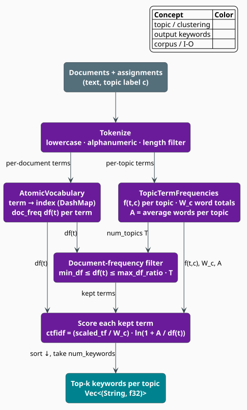

# c-TF-IDF Keyword Extraction

Once documents are clustered, each topic needs a human-readable label. **Class-based TF-IDF**
(c-TF-IDF) produces one by treating an entire topic as a single "document" and scoring its terms
against the other topics — the term-weighting scheme introduced by BERTopic [[1]](#references). A
term scores highly for a topic when it is *frequent inside that topic* yet *rare across the
corpus*, which is exactly what a distinguishing keyword should be. This document derives the
score libgrammstein computes, term by term, and shows the lock-free structures that count terms in
parallel.

> **Scope.** Source of truth:
> [`src/topic/ctfidf.rs`](../../../src/topic/ctfidf.rs) and
> [`src/topic/config.rs`](../../../src/topic/config.rs). Clusters come from
> [Clustering](clustering.md); the resulting keyword lists are attached to each
> [`Topic`](../../../src/topic/topic.rs) by the extractor (see [Topic Overview](overview.md)).

## Notation

| Symbol | Meaning |
|---|---|
| $`t`$ | a term (a whitespace-and-punctuation-normalized token) |
| $`c`$ | a topic (cluster) index |
| $`T`$ | the number of topics |
| $`f(t, c)`$ | raw count of term $`t`$ across the documents of topic $`c`$ |
| $`W_c`$ | total token count of topic $`c`$, $`W_c = \sum_t f(t, c)`$ |
| $`A`$ | average token count per topic, $`A = \frac{1}{T}\sum_{c} W_c`$ |
| $`\mathrm{df}(t)`$ | document frequency — number of documents containing term $`t`$ |
| $`\mathrm{tf}^{\star}(t, c)`$ | the (optionally sublinear) scaled term frequency |

**Acronyms.** *TF* — Term Frequency; *IDF* — Inverse Document Frequency; *c-TF-IDF* — class-based
TF-IDF; *DF* — Document Frequency.

## From TF-IDF to c-TF-IDF

Standard TF-IDF weights a term for a single *document*, so it answers "which words characterize
this document?" Topic modeling needs "which words characterize this *topic*?" c-TF-IDF answers it
by concatenating every document of a topic into one pseudo-document and computing a TF-IDF-shaped
score over those $`T`$ pseudo-documents:

| Aspect | TF-IDF | c-TF-IDF |
|---|---|---|
| Unit of aggregation | one document | one topic (all its documents) |
| Term frequency | per document | summed over the topic, then normalized by $`W_c`$ |
| Inverse frequency | over the document collection | $`\ln(1 + A / \mathrm{df}(t))`$ |
| Output | a per-document vector | a ranked keyword list per topic |



## The score

For a surviving term $`t`$ in topic $`c`$, libgrammstein
([`CtfIdf::compute_ctfidf`](../../../src/topic/ctfidf.rs)) computes

```math
\mathrm{ctfidf}(t, c) = \underbrace{\frac{\mathrm{tf}^{\star}(t, c)}{W_c}}_{\text{normalized TF}}
\;\cdot\;
\underbrace{\ln\!\left(1 + \frac{A}{\mathrm{df}(t)}\right)}_{\text{IDF}} \tag{T1}
```

The **term-frequency** factor is normalized by the topic's total token count $`W_c`$ so that
long and short topics are comparable, and is optionally passed through a **sublinear** transform
that damps very frequent terms (a word occurring 100 times should not outweigh one occurring 10
times by a full factor of ten):

```math
\mathrm{tf}^{\star}(t, c) = \begin{cases}
1 + \ln f(t, c) & \text{if } \texttt{sublinear\_tf} \text{ (the default)} \\
f(t, c) & \text{otherwise}
\end{cases} \tag{T2}
```

The **inverse-frequency** factor $`\ln(1 + A / \mathrm{df}(t))`$ is BERTopic's c-TF-IDF IDF
[[1]](#references): it grows as a term's document frequency $`\mathrm{df}(t)`$ shrinks, so a term
that appears in few documents earns a large weight and a term that appears everywhere earns almost
none. The $`1 +`$ inside the logarithm keeps the factor non-negative even when
$`\mathrm{df}(t) > A`$. The denominator is floored at $`1`$ ($`\mathrm{df}(t) \gets \max(\mathrm{df}(t), 1)`$)
so an unseen term can never divide by zero.

> **Implementation note.** In canonical BERTopic the IDF uses each term's frequency *across all
> classes*; libgrammstein instead uses the per-document frequency $`\mathrm{df}(t)`$ (a term is
> counted once per document that contains it, via a per-document seen-set). The two agree in
> spirit — both reward corpus-wide rarity — and the document-frequency form composes directly with
> the document-frequency vocabulary filter described next.

## Vocabulary filtering

Before scoring, terms are pruned by length and by document frequency
([`AtomicVocabulary`](../../../src/topic/ctfidf.rs)). A token joins the vocabulary only if its
byte length lies in $`[\texttt{min\_term\_length}, \texttt{max\_term\_length}]`$; then
[`filter_by_df`](../../../src/topic/ctfidf.rs) keeps term $`t`$ iff

```math
\texttt{min\_df} \;\le\; \mathrm{df}(t) \;\le\; \bigl\lfloor \texttt{max\_df\_ratio} \cdot T \bigr\rfloor \tag{T3}
```

The lower bound $`\texttt{min\_df}`$ removes typos and one-off noise; the upper bound removes
near-ubiquitous terms (the topic-modeling analogue of stop words) by capping document frequency at
a fraction of the topic count $`T`$. Terms outside the band contribute nothing to any keyword
list.

## Tokenization

[`CtfIdf::tokenize`](../../../src/topic/ctfidf.rs) is deliberately simple and dependency-free: it
splits on whitespace, and for each token keeps only the alphanumeric characters, lowercases them,
and drops the token if nothing remains.

```rust
use libgrammstein::topic::CtfIdf;

assert_eq!(
    CtfIdf::tokenize("Hello, World! This is a test."),
    vec!["hello", "world", "this", "is", "a", "test"],
);
// Punctuation inside a token is stripped, joining the pieces:
assert_eq!(CtfIdf::tokenize("Machine-learning  and  AI!"), vec!["machinelearning", "and", "ai"]);
```

## The algorithm, literately

The following mirrors [`CtfIdf::build_vocabulary`](../../../src/topic/ctfidf.rs) and
[`compute_ctfidf`](../../../src/topic/ctfidf.rs). Building runs in parallel over documents; the two
shared structures are an [`AtomicVocabulary`](../../../src/topic/ctfidf.rs) (term ids and document
frequencies) and a [`TopicTermFrequencies`](../../../src/topic/ctfidf.rs) (per-topic term counts
and word totals).

```
function build_vocabulary(documents, assignments):        ▸ documents[i] is in topic assignments[i]
    T   <- max(assignments) + 1
    ttf <- TopicTermFrequencies::new(T)
    parallel for (doc, c) in zip(documents, assignments):
        seen <- empty set                                 ▸ per-document, for document frequency
        for token in tokenize(doc):
            idx <- vocabulary.get_or_insert(token)        ▸ None if length-filtered out
            if idx is None: continue
            ttf.increment(c, idx)                         ▸ f(idx, c) += 1 ; W_c += 1  (atomic)
            if seen.insert(idx):                          ▸ first time in THIS document ...
                vocabulary.increment_doc_freq(idx)        ▸ ... so df(idx) += 1
    store ttf

function compute_ctfidf(c):                               ▸ scores for one topic
    A   <- ttf.average_word_count()                       ▸ (mean of W_c over topics)
    W_c <- ttf.topic_word_count(c)
    if W_c == 0: return empty
    scores <- empty list
    for t in vocabulary.filter_by_df(T):                  ▸ (T3): min_df <= df(t) <= max_df_ratio*T
        f <- ttf.get(c, t)
        if f == 0: continue
        tf_star <- (1 + ln(f)) if sublinear_tf else f     ▸ (T2)
        norm_tf <- tf_star / W_c
        idf     <- ln(1 + A / max(df(t), 1))              ▸ IDF factor of (T1)
        append (t, norm_tf * idf) to scores               ▸ (T1)
    sort scores by value descending
    return scores

function extract_keywords(c):
    return take(compute_ctfidf(c), num_keywords)          ▸ map ids back to strings
```

## Usage

`CtfIdf::new` takes a [`CtfidfConfig`](../../../src/topic/config.rs); `build_vocabulary` counts
terms per topic; `extract_keywords(c)` returns the ranked `Vec<(String, f32)>` for topic $`c`$,
and `extract_all_keywords` returns one such list per topic.

```rust
use libgrammstein::topic::{CtfIdf, CtfidfConfig};

let config = CtfidfConfig {
    num_keywords: 5,
    min_df: 1,
    min_term_length: 2,
    ..Default::default()
};
let mut ctfidf = CtfIdf::new(config);

let documents = vec![
    "machine learning algorithms neural networks".to_string(),
    "deep learning neural networks training".to_string(),
    "data science statistics analysis".to_string(),
    "data mining clustering classification".to_string(),
];
let assignments = vec![0, 0, 1, 1];      // two topics, aligned with `documents`

ctfidf.build_vocabulary(&documents, &assignments)?;

for (word, score) in ctfidf.extract_keywords(0) {
    println!("{word}: {score:.4}");      // learning, neural, networks, ...
}
# Ok::<(), libgrammstein::topic::TopicError>(())
```

`CtfidfConfig` fields, with their defaults, are:

| Field | Default | Role |
|---|---|---|
| `num_keywords` | `10` | keywords kept per topic |
| `min_df` | `2` | lower document-frequency bound of $`(\mathrm{T3})`$ |
| `max_df_ratio` | `0.95` | upper bound coefficient of $`(\mathrm{T3})`$ |
| `ngram_range` | `(1, 1)` | term span (currently unigrams) |
| `sublinear_tf` | `true` | select $`1 + \ln f`$ in $`(\mathrm{T2})`$ |
| `min_term_length` | `2` | shortest admissible term (bytes) |
| `max_term_length` | `50` | longest admissible term (bytes) |

The helpers
[`format_keywords`](../../../src/topic/ctfidf.rs) and
[`format_keywords_with_scores`](../../../src/topic/ctfidf.rs) render a keyword list for display.

## Engineering

### Lock-free counting

Both shared structures are built for parallel `build_vocabulary`:

- **`AtomicVocabulary`** maps terms to dense indices with a `DashMap<String, usize>` and hands out
  ids from an `AtomicUsize`. The term list and per-term document-frequency counters live behind a
  `RwLock<Vec<..>>` that is write-locked only when a genuinely new term extends the storage;
  reads and frequency increments (`AtomicUsize::fetch_add`) never block.
- **`TopicTermFrequencies`** holds, per topic, a `DashMap<usize, AtomicUsize>` of term counts plus
  an `AtomicUsize` running total $`W_c`$. Incrementing a term count and its topic total are both
  lock-free `fetch_add`s.

### Checkpointing

For resumable extraction, the counts serialize to a dense matrix:
[`export_term_frequencies`](../../../src/topic/ctfidf.rs) /
[`TopicTermFrequencies::to_dense`](../../../src/topic/ctfidf.rs) flatten the sparse per-topic maps
into `Vec<Vec<u32>>` (topic × vocabulary), and `from_dense` reconstructs them. The vocabulary
terms round-trip through [`export_vocabulary`](../../../src/topic/ctfidf.rs).

## Complexity

| Operation | Time | Space |
|---|---|---|
| Tokenize + count | $`O(\text{total tokens})`$ | $`O(\lvert V \rvert)`$ for vocabulary $`V`$ |
| DF filter | $`O(\lvert V \rvert)`$ | $`O(\lvert V \rvert)`$ |
| Score one topic | $`O(\lvert V \rvert)`$ | $`O(\lvert V \rvert)`$ |
| Score all topics | $`O(T \cdot \lvert V \rvert)`$ | $`O(T \cdot \lvert V \rvert)`$ |

## References

1. M. Grootendorst (2022). *BERTopic: Neural topic modeling with a class-based TF-IDF procedure.*
   arXiv:2203.05794. [arxiv.org/abs/2203.05794](https://arxiv.org/abs/2203.05794)
2. K. Sparck Jones (1972). *A statistical interpretation of term specificity and its application
   in retrieval.* Journal of Documentation 28(1), 11–21.
   [doi:10.1108/eb026526](https://doi.org/10.1108/eb026526)

## See also

- [Topic Overview](overview.md) — the end-to-end pipeline
- [Clustering](clustering.md) — how the topics being labeled are formed
- [Dendrogram](dendrogram.md) — choosing the number of topics to label
