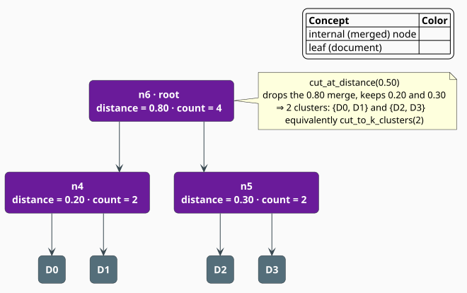

# Dendrogram

A **dendrogram** is the binary tree of merges that hierarchical clustering produces: its leaves
are documents, its internal nodes are merges, and the *height* of an internal node is the distance
at which its two children fused. Because the whole hierarchy is retained, the number of topics is
not fixed at clustering time — it is chosen afterward by **cutting** the tree, either to a target
count or at a distance threshold. This document describes the tree the code builds and the two cut
operations it supports.

> **Scope.** Source of truth:
> [`src/topic/dendrogram.rs`](../../../src/topic/dendrogram.rs). The dendrogram is produced by
> [Clustering](clustering.md) from its linkage matrix and stored on the
> [`TopicModel`](../../../src/topic/model.rs); see the [Topic Overview](overview.md) for the
> surrounding pipeline.

## Reading a dendrogram

The vertical axis is merge distance; the leaves are laid along the horizontal axis. A horizontal
cut at height $`\tau`$ severs every merge above $`\tau`$, and the connected groups of leaves that
remain below the cut are the clusters.



Cutting the tree above at $`\tau = 0.5`$ removes only the root merge (height $`0.80`$) and leaves
the two subtrees $`\{D_0, D_1\}`$ (height $`0.20`$) and $`\{D_2, D_3\}`$ (height $`0.30`$) intact —
two clusters. Lowering the cut to $`\tau = 0.25`$ also severs the $`0.30`$ merge, giving three
clusters; raising it above $`0.80`$ gives one.

## The data structure

A dendrogram is a map of nodes plus the id of the root
([`src/topic/dendrogram.rs`](../../../src/topic/dendrogram.rs)). Every node — leaf or internal —
is a [`DendrogramNode`](../../../src/topic/dendrogram.rs):

```rust
pub struct DendrogramNode {
    pub id: u32,               // leaf id in 0..num_leaves; merged id in num_leaves..2*num_leaves-1
    pub left: Option<u32>,     // child ids; both None for a leaf
    pub right: Option<u32>,
    pub distance: f32,         // height at which this node was formed (0.0 for a leaf)
    pub count: usize,          // number of leaf documents beneath this node
}

pub struct Dendrogram {
    // nodes: HashMap<u32, DendrogramNode>   (private)
    // num_leaves: usize                     (private)
    // root: Option<u32>                     (private)
}
```

The struct derives `Serialize`/`Deserialize`, so it travels inside a serialized `TopicModel`.

## Building from a linkage matrix

[`Dendrogram::from_linkage`](../../../src/topic/dendrogram.rs) turns the clustering's
`Vec<(u32, u32, f32, u32)>` linkage matrix into the tree. It first creates `num_leaves` leaf
nodes with ids $`0, \dots, n{-}1`$, then walks the linkage rows: row $`i`$ becomes an internal
node with id $`n + i`$, children equal to the row's two cluster ids, and the row's distance and
count. The root is the last row's node, $`n + (\lvert\text{linkage}\rvert - 1)`$. For $`n`$ leaves
there are $`n-1`$ merges, so the finished tree holds $`2n-1`$ nodes.

```rust
use libgrammstein::topic::Dendrogram;

// Merge 0,1 at 1.0 -> node 4; merge 2,3 at 1.5 -> node 5; merge 4,5 at 2.0 -> node 6 (root).
let linkage = vec![(0, 1, 1.0, 2), (2, 3, 1.5, 2), (4, 5, 2.0, 4)];
let dendro = Dendrogram::from_linkage(&linkage, 4);

assert_eq!(dendro.num_leaves(), 4);
assert_eq!(dendro.num_nodes(), 7);                 // 4 leaves + 3 merges
assert_eq!(dendro.root().unwrap().id, 6);
```

## Cutting the tree

### By distance threshold

[`cut_at_distance`](../../../src/topic/dendrogram.rs) returns a `Vec<u32>` cluster label per leaf.
It descends from the root: at an internal node whose forming distance *exceeds* the threshold it
recurses into each child as a separate cluster; at a node whose distance is *within* the threshold
it stops and assigns that whole subtree one label. Formally, with a fresh counter $`\kappa`$
starting at $`0`$:

```
function cut_recursive(node, τ):
    if node is a leaf:            assign leaf -> κ
    else if node.distance > τ:    cut_recursive(left, τ);  κ <- κ + 1;  cut_recursive(right, τ)
    else:                         assign every leaf under node -> κ    ▸ subtree stays one cluster
```

```rust
let labels = dendro.cut_at_distance(1.8);          // severs only the 2.0 merge
assert_eq!(Dendrogram::unique_clusters(&labels).len(), 2);
```

### To a target number of clusters

[`cut_to_k_clusters`](../../../src/topic/dendrogram.rs) finds the threshold that yields exactly
$`k`$ clusters. Intuitively, $`k`$ clusters remain after severing the $`k-1`$ tallest merges, so
the cut is placed just below the $`(k{-}1)`$-th tallest merge distance. Let
$`\delta_1 \le \delta_2 \le \dots \le \delta_m`$ be the *distinct* internal-node distances. The
method sets

```math
\begin{array}{lr}
\displaystyle \tau = \frac{\delta_{m-k} + \delta_{m-k+1}}{2} & \text{(D1)}
\end{array}
```

then calls `cut_at_distance` with the threshold $`\tau`$. The degenerate cases are handled
explicitly: $`k \ge n`$
places every leaf in its own cluster, $`k \le 1`$ places all leaves in one, and asking for more
clusters than the tree can distinguish ($`k > m + 1`$) again gives singleton leaves.

```rust
let labels = dendro.cut_to_k_clusters(2);
assert_eq!(Dendrogram::unique_clusters(&labels).len(), 2);
assert_eq!(labels[0], labels[1]);                  // 0 and 1 share a cluster
assert_ne!(labels[0], labels[2]);                  // ... distinct from 2,3
```

## Navigating the hierarchy

| Method | Returns | Purpose |
|---|---|---|
| [`root()`](../../../src/topic/dendrogram.rs) | `Option<&DendrogramNode>` | the top merge |
| [`get(id)`](../../../src/topic/dendrogram.rs) | `Option<&DendrogramNode>` | look a node up by id |
| [`num_leaves()`](../../../src/topic/dendrogram.rs) | `usize` | document count $`n`$ |
| [`num_nodes()`](../../../src/topic/dendrogram.rs) | `usize` | total nodes $`2n-1`$ |
| [`leaves_under(id)`](../../../src/topic/dendrogram.rs) | `Vec<u32>` | leaf ids beneath a node |
| [`nodes_at_level(lo, hi)`](../../../src/topic/dendrogram.rs) | `Vec<&DendrogramNode>` | nodes whose distance is in $`[lo, hi)`$ |
| [`depth(id)`](../../../src/topic/dendrogram.rs) | `Option<usize>` | edges from the root to a node |

Two static helpers bridge to topic ids and cluster sets:
[`assignments_to_topic_ids`](../../../src/topic/dendrogram.rs) maps a label vector to
`Vec<TopicId>`, and [`unique_clusters`](../../../src/topic/dendrogram.rs) returns the sorted
distinct labels — the idiom for counting clusters after a cut.

```rust
let leaves = dendro.leaves_under(4);               // {0, 1}
assert_eq!(leaves.len(), 2);
assert_eq!(dendro.depth(6), Some(0));              // root is at depth 0
assert_eq!(dendro.depth(0), Some(2));              // leaf 0 is two merges down
```

## Choosing the number of topics

When neither a $`k`$ nor a threshold is supplied a priori, the sequence of merge distances
suggests a natural cut: a large *jump* between consecutive merge heights marks the boundary
between within-topic and across-topic fusion (the "elbow"). The merge distances are available on
the model as the third field of each linkage row, so the elbow can be located without any
private access:

```rust
// `model: &TopicModel`
let mut distances: Vec<f32> = model.linkage().iter().map(|&(_, _, d, _)| d).collect();
distances.sort_by(|a, b| a.total_cmp(b));

// The largest gap between successive merge heights is a candidate cut.
let elbow = distances
    .windows(2)
    .enumerate()
    .max_by(|a, b| (a.1[1] - a.1[0]).total_cmp(&(b.1[1] - b.1[0])))
    .map(|(i, _)| i + 1);

if let Some(k) = elbow {
    let labels = model.dendrogram().cut_to_k_clusters(k);
    println!("elbow suggests {k} clusters -> {} labels", labels.len());
}
```

## Persistence

The dendrogram is part of the serialized model, so a reloaded model can be re-cut at any
granularity without re-running clustering:

```rust
use libgrammstein::topic::TopicModel;

let model = TopicModel::load("./topic_model.json")?;
let dendro = model.dendrogram();
println!("{} documents, {} nodes", dendro.num_leaves(), dendro.num_nodes());

let coarse = dendro.cut_to_k_clusters(5);          // re-cut to 5 topics
let fine   = dendro.cut_to_k_clusters(25);         // ... or 25, from the same tree
# Ok::<(), libgrammstein::topic::TopicError>(())
```

## Complexity

Building from the linkage matrix is $`O(n)`$ in time and space. `cut_at_distance` visits each node
once, $`O(n)`$; `cut_to_k_clusters` additionally sorts the $`O(n)`$ distinct merge distances,
$`O(n \log n)`$. `leaves_under` and `depth` are linear in the size of the subtree they traverse.

## See also

- [Topic Overview](overview.md) — the end-to-end pipeline
- [Clustering](clustering.md) — how the linkage matrix behind the tree is produced
- [c-TF-IDF](ctfidf.md) — labeling the clusters a cut produces
