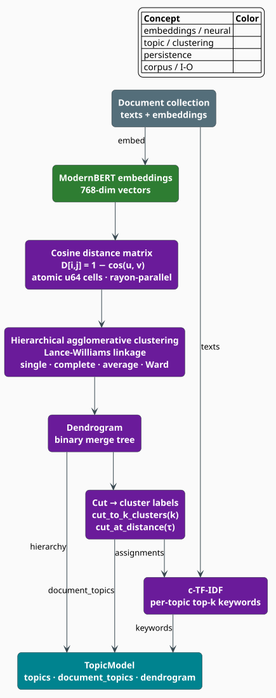

# Topic Extraction Overview

The **topic module** discovers the latent themes of a document collection and labels each
document with the theme(s) it belongs to. It follows the **BERTopic** recipe
[[1]](#references): *embed* every document into a dense vector, *cluster* those vectors with
hierarchical agglomerative clustering, and *describe* each cluster with a class-based TF-IDF
(**c-TF-IDF**) keyword list. This document explains what the module produces, the shape of the
pipeline, the concrete types the reader will touch, and how the three stages fit together.

> **Scope.** Source of truth:
> [`src/topic/mod.rs`](../../../src/topic/mod.rs),
> [`src/topic/extractor.rs`](../../../src/topic/extractor.rs),
> [`src/topic/model.rs`](../../../src/topic/model.rs),
> [`src/topic/topic.rs`](../../../src/topic/topic.rs), and
> [`src/topic/config.rs`](../../../src/topic/config.rs). The three stages are documented in
> [Clustering](clustering.md), [c-TF-IDF](ctfidf.md), and [Dendrogram](dendrogram.md). For the
> embeddings that feed the pipeline see [RAG Overview](../rag/overview.md); for topic storage in
> a retrieval index see [RAG Index](../rag/index.md).

## What topic modeling produces

Topic modeling turns an unlabeled corpus into (a) a set of **topics**, each summarized by a
ranked keyword list, and (b) a **document → topic** assignment map. Concretely, given documents
$`d_1, \dots, d_n`$ with embeddings $`v_1, \dots, v_n`$, the module returns a
[`TopicModel`](../../../src/topic/model.rs) whose topics partition the corpus and whose
`document_topics` records, for each document index, the topic(s) it was assigned.

**Why the BERTopic recipe.** Classical topic models (LDA and friends) model a document as a bag
of words drawn from latent multinomials. BERTopic instead separates *grouping* from *labeling*:
it clusters contextual embeddings — which already encode semantics that a bag of words cannot —
and only then extracts human-readable keywords. The separation makes each stage independently
swappable and inspectable, and it lets the same clustering produce topics at many granularities
by cutting a hierarchy rather than re-fitting a model.

## Notation

Every symbol is defined before it is used in a formula.

| Symbol | Meaning |
|---|---|
| $`n`$ | number of documents in the corpus |
| $`v_i`$ | the embedding vector of document $`i`$ (768-dim by default) |
| $`T`$ | number of topics (clusters) produced by the cut |
| $`c`$ | a topic (cluster) index, $`0 \le c < T`$ |
| $`d(v_i, v_j)`$ | cosine distance between embeddings $`v_i`$ and $`v_j`$ |
| $`f(t, c)`$ | raw count of term $`t`$ across the documents of topic $`c`$ |
| $`W_c`$ | total token count of topic $`c`$, $`W_c = \sum_t f(t, c)`$ |
| $`A`$ | average token count per topic, $`A = \frac{1}{T}\sum_{c} W_c`$ |
| $`\mathrm{df}(t)`$ | document frequency — number of documents containing term $`t`$ |

**Acronyms.** *HAC* — Hierarchical Agglomerative Clustering; *c-TF-IDF* — class-based Term
Frequency–Inverse Document Frequency; *UPGMA* — Unweighted Pair Group Method with Arithmetic
mean; *OOV* — Out-Of-Vocabulary.

## The pipeline

[`TopicExtractor::extract`](../../../src/topic/extractor.rs) runs four phases in order. The first
three are the BERTopic stages; the fourth assembles the result.



1. **Distance matrix.** Every pair of document embeddings is scored with **cosine distance**
   $`d(v_i, v_j) = 1 - \cos(v_i, v_j)`$. The upper triangle is computed in parallel and stored in
   lock-free atomic cells (see [Clustering](clustering.md)).
2. **Clustering.** [`HierarchicalClustering`](../../../src/topic/clustering.rs) performs
   agglomerative clustering with a **Lance-Williams** linkage update (single, complete, average,
   or Ward), producing a *linkage matrix* and a [`Dendrogram`](dendrogram.md).
3. **c-TF-IDF.** [`CtfIdf`](../../../src/topic/ctfidf.rs) tokenizes the documents, aggregates
   term counts per topic, and scores each term to yield the top-$`k`$ keywords per topic.
4. **Assembly.** [`TopicExtractor`](../../../src/topic/extractor.rs) builds one
   [`Topic`](../../../src/topic/topic.rs) per cluster — keywords, a generated description, the
   cluster centroid, and a document count — and records the per-document assignments.

## The core types

The types below are the public surface a caller works with; each field named here exists in the
source.

### `TopicId`

A 32-bit topic identifier ([`src/topic/topic.rs`](../../../src/topic/topic.rs)):

```rust
use libgrammstein::topic::TopicId;

let id = TopicId::new(0);
assert_eq!(id.as_u32(), 0);
println!("{id}");            // Display: "Topic(0)"
```

### `Topic`

Each topic carries its keywords, a description, hierarchy links, and its cluster centroid:

```rust
pub struct Topic {
    pub id: TopicId,
    pub parent_id: Option<TopicId>,     // hierarchy parent (None for a root topic)
    pub children: Vec<TopicId>,         // hierarchy children (empty for a leaf topic)
    pub level: usize,                   // 0 = root, increasing = deeper
    pub keywords: Vec<(String, f32)>,   // (term, c-TF-IDF score), score-sorted
    pub description: String,            // generated from the keywords
    pub centroid: Option<Arc<[f32]>>,   // mean embedding of the cluster
    pub document_count: usize,
    pub coherence: Option<f32>,
}
```

`keyword_summary(n)` joins the top $`n`$ keywords into a comma-separated string; `is_leaf` and
`is_root` test the hierarchy links.

### `TopicModel`

The container returned by extraction. It is immutable after construction and
`serde`-serializable to JSON or bincode:

```rust
// Iterate the extracted topics.
for topic in model.topics() {
    println!("{}: {}", topic.id.as_u32(), topic.keyword_summary(5));
}

// Look a topic up by id, or fetch a document's topics.
if let Some(topic) = model.get(TopicId::new(0)) {
    println!("{}", topic.description);
}
let doc_topics: &[TopicId] = model.document_topic_ids(0);

// Navigate the hierarchy.
let dendrogram = model.dendrogram();
```

## Configuration

`TopicConfig` composes one config per stage plus a few global knobs. The fields below are exactly
those in [`src/topic/config.rs`](../../../src/topic/config.rs) — note that the clustering,
c-TF-IDF, and summarization settings are **nested**, not flat.

```rust
use libgrammstein::topic::{
    TopicConfig, ClusteringConfig, CtfidfConfig, SummarizationConfig, LinkageMethod,
};

let config = TopicConfig {
    clustering: ClusteringConfig {
        num_clusters: Some(20),          // target topic count; None => cut by threshold
        distance_threshold: None,        // alternative cut: merge until distance > this
        linkage: LinkageMethod::Ward,    // default linkage
        min_cluster_size: 5,
        parallel: true,
        checkpoint_interval: 100,
        verbose: false,
    },
    ctfidf: CtfidfConfig {
        num_keywords: 10,                // keywords per topic
        min_df: 2,                       // drop terms below this document frequency
        max_df_ratio: 0.95,             // drop terms above this share (see c-TF-IDF doc)
        ngram_range: (1, 1),
        sublinear_tf: true,              // use 1 + ln(tf) instead of raw tf
        min_term_length: 2,
        max_term_length: 50,
    },
    summarization: SummarizationConfig::default(),
    hierarchy_levels: 3,
    min_topic_size: 5,
    compute_coherence: true,
    verbose: false,
};
```

Convenience constructors cover common regimes:
[`TopicConfig::with_num_clusters(k)`](../../../src/topic/config.rs),
[`TopicConfig::for_small_corpus()`](../../../src/topic/config.rs) (fewer, looser clusters), and
[`TopicConfig::for_large_corpus()`](../../../src/topic/config.rs) (more clusters, larger
checkpoint interval, stricter `min_df`).

## Standalone extraction

`TopicExtractor::extract` takes `&mut self` because it threads a resumable checkpoint through the
run; it returns an [`ExtractionResult`](../../../src/topic/extractor.rs) which
`TopicModel::from_extraction` wraps into the persistent model.

```rust
use libgrammstein::topic::{TopicExtractor, TopicConfig, TopicModel};

// `embeddings: Vec<Vec<f32>>` and `texts: Vec<String>` are aligned by index.
let config = TopicConfig::with_num_clusters(10);
let mut extractor = TopicExtractor::new(config.clone());
let result = extractor.extract(&embeddings, &texts)?;
let model = TopicModel::from_extraction(result, config);

for topic in model.topics() {
    println!("Topic {}: {}", topic.id.as_u32(), topic.description);
    for (word, score) in topic.keywords.iter().take(5) {
        println!("  {word}: {score:.4}");
    }
}
# Ok::<(), libgrammstein::topic::TopicError>(())
```

At least two documents are required; fewer returns
[`TopicError::InsufficientDocuments`](../../../src/topic/mod.rs), and a ragged
`embeddings`/`texts` length mismatch returns
[`TopicError::ClusteringError`](../../../src/topic/mod.rs).

## Integration with a retrieval index

A `RagIndex` built on the exact-cosine backend can extract topics directly from the embeddings it
already holds; the extracted [`TopicModel`](../../../src/topic/model.rs) is stored on the index
and its topic ids are copied onto each document's metadata.

```rust
// `index: RagIndex<ExactCosineBackend>` already populated with documents.
let texts: Vec<String> = index.iter().map(|(_, meta)| meta.synopsis.clone()).collect();

let model = index.extract_topics(TopicConfig::default(), &texts)?;
println!("{} topics over {} documents", model.num_topics(), model.num_documents());

// Topics are serialized alongside the index.
index.save(std::path::Path::new("./index"))?;
# Ok::<(), Box<dyn std::error::Error>>(())
```

`RagIndex::extract_topics` reads the embeddings via `get_all_embeddings`, so the caller supplies
only the aligned document *texts*; the returned model is also reachable later through
`index.topic_model()`.

## Engineering

### Thread safety

The pipeline parallelizes the two data-parallel phases and keeps the rest sequential and
immutable:

- **Distance matrix** — the $`O(n^2)`$ pairwise cosine distances are computed with `rayon` and
  written into a `Vec<AtomicU64>` (each cell an `f64`'s bit pattern), so worker threads never
  contend for a lock ([Clustering](clustering.md)).
- **Vocabulary + term counts** — c-TF-IDF builds its vocabulary through a `DashMap` and atomic
  per-topic counters, so documents are tokenized and counted in parallel ([c-TF-IDF](ctfidf.md)).
- **Agglomeration** — the merge loop itself is sequential (it repeatedly selects the global
  minimum), and the resulting `TopicModel` is immutable, hence trivially `Send + Sync`.

Because the model is immutable after extraction, many extractions can run concurrently:

```rust
use rayon::prelude::*;

let models: Vec<_> = datasets
    .par_iter()
    .map(|(embeddings, texts)| {
        let mut extractor = TopicExtractor::new(config.clone());
        extractor.extract(embeddings, texts)
    })
    .collect();
```

### Persistence

`TopicModel` serializes with `serde`. `save`/`load` use pretty JSON; `save_bincode`/`load_bincode`
use the compact bincode format. The `centroid` field (`Option<Arc<[f32]>>`) has a custom
serializer that round-trips through `Option<Vec<f32>>`, so both formats reload the shared-slice
centroids without a bespoke reader.

### Feature flag

The module is compiled behind the `rag` feature (it shares the embedding infrastructure of the
retrieval index):

```toml
[dependencies]
libgrammstein = { version = "0.1", features = ["rag"] }
```

## References

1. M. Grootendorst (2022). *BERTopic: Neural topic modeling with a class-based TF-IDF procedure.*
   arXiv:2203.05794. [arxiv.org/abs/2203.05794](https://arxiv.org/abs/2203.05794)
2. J. H. Ward Jr. (1963). *Hierarchical grouping to optimize an objective function.* Journal of
   the American Statistical Association 58(301), 236–244.
   [doi:10.1080/01621459.1963.10500845](https://doi.org/10.1080/01621459.1963.10500845)

## See also

- [Clustering](clustering.md) — hierarchical agglomerative clustering and Lance-Williams linkage
- [c-TF-IDF](ctfidf.md) — the class-based keyword-extraction algorithm
- [Dendrogram](dendrogram.md) — navigating and cutting the topic hierarchy
- [RAG Overview](../rag/overview.md) — the embeddings and index that feed topic extraction
- [RAG Index](../rag/index.md) — how topics are stored with a retrieval index
