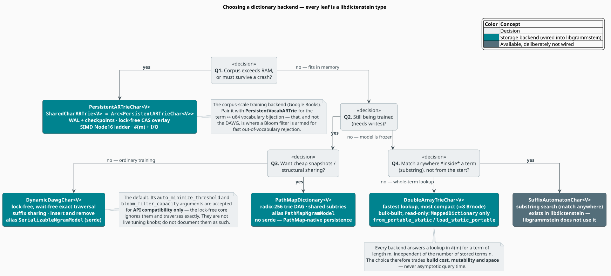

# Backend Selection

Every dictionary in libgrammstein — the n-gram store, the vocabulary, the spelling dictionary the
Levenshtein automaton queries — is one of **libdictenstein**'s trie backends behind a trait object
bound. They are interchangeable by construction: each answers a lookup in $`O(m)`$ for a term of
length $`m`$, independent of how many terms it holds. Choosing among them therefore never trades
away asymptotic query time. It trades **durability, mutability, build cost and space**.

This document says which one to pick, and why — and corrects a set of claims the previous revision
made that the source code does not support.

> **Attribution.** These backends are **libdictenstein**'s, not liblevenshtein's. The tries were
> extracted out of liblevenshtein into libdictenstein; liblevenshtein re-exports them in its
> `prelude`, but every `use` in this repository names the owner. See
> [Overview §2](overview.md#2-what-each-crate-actually-supplies).

> **Scope.** Source of truth: [`src/ngram/mod.rs`](../../../src/ngram/mod.rs) (the type aliases),
> [`src/ngram/trie.rs`](../../../src/ngram/trie.rs) (which backends satisfy which traits),
> [`src/ngram/model.rs`](../../../src/ngram/model.rs) (the static-backend constructors),
> [`src/ngram/vocabulary.rs`](../../../src/ngram/vocabulary.rs) (the vocabulary trie), and
> libdictenstein's own `README.md` for the per-node space figures quoted below.

## Notation

| Symbol | Meaning |
|---|---|
| $`m`$ | length of the query term, in dictionary units (`u8` bytes or `char` scalars) |
| $`n`$ | number of terms stored in the dictionary |
| $`N`$ | number of $`(\text{key}, \text{value})`$ pairs supplied to a bulk build |
| $`V`$ | the value type stored at terminal nodes (for n-grams, `NgramEntry`) |
| $`\Sigma`$ | the unit alphabet; $`\lvert \Sigma \rvert = 256`$ for `u8`, $`2^{21}`$ for `char` |

**Acronyms.** *DAWG* — Directed Acyclic Word Graph; *ART* — Adaptive Radix Trie; *WAL* —
Write-Ahead Log; *CAS* — Compare-And-Swap; *COW* — Copy-On-Write; *SIMD* — Single Instruction,
Multiple Data; *OOV* — Out-Of-Vocabulary.

## 1. The invariant that makes this a free choice

A trie consumes one unit of the query per level, so a lookup terminates after at most $`m`$ node
transitions no matter how large the dictionary grows:

```math
T_{\text{lookup}}(m, n) \;=\; O(m)
\qquad\text{— independent of } n
\tag{B1}
```

This is *the* defining property of trie-shaped indexes and it holds for **every** backend below.
Consequently, the Levenshtein automaton's cost model (see
[Overview §3.4](overview.md#34-complexity)) is identical across backends: the automaton is generic
over `D: Dictionary`, and swapping the backend changes constants and memory, never the semantics or
the asymptotics of a correction.

What *does* differ:

```math
\text{choose } D \;\text{ by }\;
\bigl(\, \text{durability},\;\; \text{mutability},\;\; T_{\text{build}},\;\; \text{bytes/node} \,\bigr)
\tag{B2}
```

## 2. The backends

Each backend is generic over its value type $`V`$ (`V: DictionaryValue`) and is parameterized by a
**unit** — the symbol type on its edges. libdictenstein ships a `u8` (byte) form and a `Char` form
(the `char` unit: a 32-bit Unicode scalar) of most backends, and the suffix names which:
`DynamicDawg` is the byte trie, `DynamicDawgChar` the Unicode one.

libgrammstein is **not** uniform about this, and the exception is worth knowing:

| Backend it uses | Unit | Note |
|---|---|---|
| `DynamicDawgChar`, `DoubleArrayTrieChar`, `PersistentARTrieChar` | `char` | Unicode text keys |
| `PathMapDictionary` | **`u8`** | the *byte* form — its Unicode sibling is `PathMapDictionaryChar`, which libgrammstein does not use |

That is consistent, not accidental: PathMap is a **radix-256** structure whose keys are byte strings
(the translator in [PathMap Synergy](pathmap-synergy.md) inserts with `key.as_bytes()`), so the byte
unit is its natural form. Keys remain valid UTF-8 either way — a `u8`-unit trie simply indexes their
UTF-8 encoding rather than their scalars.

| Backend | Role in libgrammstein | Updates | Lookup | Bytes/node |
|---|---|---|---|---|
| `DynamicDawgChar<V>` | **default** in-memory training store | insert **and** remove | $`O(m)`$ | ≈ 25–32 |
| `DoubleArrayTrieChar<V>` | frozen model, fastest inference | bulk build only — **read-only** | $`O(m)`$ | ≈ 8 |
| `PathMapDictionary<V>` | shared-structure store, cheap snapshots | insert and remove | $`O(m)`$ | — (DAG-shared) |
| `PersistentARTrieChar<V>` | corpus-scale training, crash-durable | insert and remove | $`O(m)`$ + I/O | — (disk-backed) |
| `PersistentVocabARTrie` | the term ↔ `u64` vocabulary bijection | insert | $`O(m)`$ | — (disk-backed) |
| `SuffixAutomatonChar<V>` | substring search — **not wired in** | insert and remove | $`O(m)`$ | ≈ 40–50 |

*Per-node byte figures are libdictenstein's, from its README's structural comparison; they are
structural estimates, not measurements of this repository's workload.*

## 3. Choosing



*Figure 1 — the questions in the order that matters. Durability first: it constrains everything
downstream. Teal leaves are wired into libgrammstein; the grey leaf exists but is deliberately not.*

The tree in Figure 1 is the whole decision procedure. In prose:

1. **Does the corpus exceed RAM, or must training survive a crash?** → `PersistentARTrieChar`.
2. **Is the model still being written?** If it also wants cheap snapshots → `PathMapDictionary`;
   otherwise → `DynamicDawgChar` (the default).
3. **Is the model frozen?** If lookups must match *inside* a term → `SuffixAutomatonChar` (not used
   here); otherwise → `DoubleArrayTrieChar`.

## 4. The backends in detail

### 4.1 `DynamicDawgChar` — the default

A **DAWG** is a trie that additionally merges *suffixes*: states with identical continuations are
shared, so `running` and `jumping` share one `ing` tail. The result is a minimal acyclic
deterministic automaton over the term set [[1]](#references), which buys compression that a plain
trie cannot.

```rust
use libdictenstein::dynamic_dawg::char::DynamicDawgChar;
use libgrammstein::ngram::{NgramEntry, TrainerBuilder};

let dictionary = DynamicDawgChar::<NgramEntry>::new();
let model = TrainerBuilder::new(dictionary).order(5).train(&reader)?;
model.save("ngram_model.bin")?;   // serde: this is the backend that round-trips
# Ok::<(), libgrammstein::Error>(())
```

- **Concurrency.** The public `DynamicDawgChar` wraps an `Arc<LockFreeDawg<char, V>>` (libdictenstein
  aliases the inner type as `DynamicDawgCharInner<V> = LockFreeDawg<char, V>`): reads are wait-free
  and writes take `&self`. No `RwLock` is needed or wanted.
- **Serialization.** It is the backend behind `SerializableNgramModel`, so `save` / `load` work.
- **Correction of a stale claim.** `DynamicDawgChar::with_config` accepts
  `auto_minimize_threshold` and `bloom_filter_capacity`, and the previous revision of this document
  advertised them as live "SIMD and bloom filter optimizations". They are **not**. libdictenstein's
  own doc comment states they are *"accepted for API compatibility"* and that *"the lock-free
  implementation performs exact wait-free traversals"*; the lock-free core discards both arguments.
  Do not tune them, and do not document them as knobs. (Where those optimizations *do* live: §6.)

### 4.2 `DoubleArrayTrieChar` — frozen and fast

A **double-array trie** [[2]](#references) packs the trie into two integer arrays, `base` and
`check`, so a transition is an array index rather than a pointer chase — cache-friendly, and the
most compact representation on offer (≈ 8 bytes/node). The price is rigidity: it is bulk-built from
a sorted term set and **cannot be updated** afterwards.

This shows up in the type system, which is the cleanest possible statement of the constraint: it
implements `MappedDictionary` but **not** `MutableMappedDictionary`. A frozen backend simply cannot
be handed to `TrainerBuilder`; the compiler says so.

```rust
use libdictenstein::double_array_trie::char::DoubleArrayTrieChar;
use libgrammstein::ngram::{NgramEntry, NgramModel};

// Load a portable snapshot straight into the fast static backend.
let model: NgramModel<DoubleArrayTrieChar<NgramEntry>> =
    NgramModel::load_static_portable("model.portable.bin")?;

// `from_terms_with_values` sorts with the builder's own comparator — no manual key ordering.
# Ok::<(), libgrammstein::Error>(())
```

Build cost is $`O(N \log N)`$ (sort, then pack). There is **no** `StaticNgramModel` type alias — the
previous revision invented one, along with `to_static()`, `to_backend()`, `to_double_array()` and
`from_pairs()`. The real constructors are `NgramModel::from_portable_static` and
`NgramModel::load_static_portable`, both feature-gated on `serde-extras`.

### 4.3 `PathMapDictionary` — shared structure

A radix-256 trie that is a **DAG**: identical subtries are shared rather than copied, so a snapshot
costs a pointer, not a traversal. It backs the `PathMapNgramModel` alias and is the natural choice
when many near-identical model versions must coexist.

```rust
use libdictenstein::pathmap::PathMapDictionary;
use libgrammstein::ngram::{NgramEntry, PathMapNgramModel, TrainerBuilder};

let dictionary = PathMapDictionary::<NgramEntry>::new();
let model: PathMapNgramModel = TrainerBuilder::new(dictionary).order(5).train(&reader)?;
# Ok::<(), libgrammstein::Error>(())
```

It has **no serde support** — persistence goes through PathMap's own path serialization. It is a
**trie**, with $`O(m)`$ lookup and full prefix traversal; the previous revision's description of it
as a *"lock-free concurrent hash map"* with *"$`O(1)`$ average lookup"*, *"no prefix search"* and
*"no fuzzy matching"* was wrong in every particular. See [PathMap Synergy](pathmap-synergy.md).

### 4.4 `PersistentARTrieChar` — corpus scale

An **Adaptive Radix Trie** [[3]](#references) whose nodes change representation with their fanout
(the Node4 → Node16 → Node48 → Node256 ladder), paired with a **WAL** for crash durability and a
lock-free CAS overlay for concurrency. This is the backend that ingests Google Books: the corpus
does not fit in RAM, and a multi-hour import must survive a crash.

`SharedCharARTrie<V> = Arc<PersistentARTrieChar<V>>` is the handle actually used; it implements
`MutableMappedDictionary<Value = NgramEntry>` and libgrammstein adds the `IterableDictionary`
portable-serialization hook to it in [`src/ngram/trie.rs`](../../../src/ngram/trie.rs).

Lookup is $`O(m)`$ **plus I/O** — the one place the uniform cost model of $`(\mathrm{B1})`$ acquires
a term that the others do not have. Reads traverse immutable snapshots; writes publish by CAS.

### 4.5 `PersistentVocabARTrie` — the vocabulary

A durable **bijection** between terms and `u64` indices, which is what makes the varint n-gram key
encoding possible at all (see [Overview §6](overview.md#6-how-n-grams-become-dictionary-terms)).
Forward lookup (word → index) is the $`O(m)`$ trie walk; reverse lookup (index → word) is parent-
pointer backtracking with a hot cache. It is also the **spelling dictionary the Levenshtein
automaton queries** in the shipped corrector.

```rust
use libgrammstein::ngram::vocabulary::{open_or_create_vocabulary, open_or_create_vocabulary_with_bloom};

let vocab = open_or_create_vocabulary(std::path::Path::new("vocab"))?;
// …or arm the Bloom filter for fast OOV rejection on negative lookups:
let vocab = open_or_create_vocabulary_with_bloom(std::path::Path::new("vocab"), 5_000_000)?;
# Ok::<(), libgrammstein::ngram::vocabulary::VocabularyError>(())
```

### 4.6 `SuffixAutomatonChar` — available, not wired

Matches **anywhere inside** a term rather than from the start, which is the right structure for
substring search. libdictenstein provides it (and a persistent variant); **libgrammstein does not
use it.** It is listed here so the omission is a documented decision rather than an oversight: the
correction pipeline matches whole words, and the vocabulary trie is the right index for that.

## 5. Trait capability matrix

Which traits a backend implements *is* its contract — the compiler enforces the table below, so it
cannot drift.

| Backend | `Dictionary` | `MappedDictionary` | `MutableMappedDictionary` | `IterableDictionary` | serde |
|---|:--:|:--:|:--:|:--:|:--:|
| `DynamicDawgChar<NgramEntry>` | ✓ | ✓ | ✓ | ✓ | ✓ |
| `PathMapDictionary<NgramEntry>` | ✓ | ✓ | ✓ | ✓ | ✗ |
| `SharedCharARTrie<NgramEntry>` | ✓ | ✓ | ✓ | ✓ | ✗ (WAL + checkpoints) |
| `DoubleArrayTrieChar<NgramEntry>` | ✓ | ✓ | ✗ **read-only** | ✓ | ✓ (portable) |
| `VocabularyIndexedDictionary<D>` | ✓ | ✓ | ✓ | ✓ | inherits `D` |

`IterableDictionary` is libgrammstein's own trait ([`src/ngram/trie.rs`](../../../src/ngram/trie.rs)):
it yields $`(\text{key}, \text{value})`$ pairs and exists so a model can be serialized **portably**
— without requiring the backend itself to implement `serde`. That is the mechanism by which a model
trained on one backend loads onto another.

## 6. Where the optimizations actually are

The previous revision attributed SIMD and Bloom filtering to the DAWG. Both exist; neither is there.

| Optimization | Where it lives | What it does |
|---|---|---|
| **SIMD** | `PersistentARTrie` Node16 | one `_mm_cmpeq_epi8` replaces up to 16 scalar byte comparisons when finding a child |
| **Bloom filter** | `PersistentVocabARTrie` (`*_with_bloom` constructors) | rejects OOV terms without traversing; no false negatives, ~1% false-positive rate [[4]](#references) |
| **Path compression** | `PersistentARTrie` | collapses single-child chains, so `metamorphosis` is not 13 nodes (and, on disk, not 13 page faults) |
| **Suffix sharing** | `DynamicDawgChar` | the DAWG minimization that merges common tails |
| **Structural sharing** | `PathMapDictionary` | identical subtries are one subtrie |
| **Lock-free CAS** | all mutable backends | writes take `&self`; readers never block |

The Bloom filter placement is not an accident. Negative lookups are the expensive case for the
corrector — *every in-vocabulary word costs one `contains` walk*, and the OOV check is on the hot
path for each token. Putting the filter on the vocabulary trie is putting it exactly where the
negative answers are.

## 7. Type aliases and conversion

There are exactly **two** aliases ([`src/ngram/mod.rs`](../../../src/ngram/mod.rs)):

```rust
pub type SerializableNgramModel =
    NgramModel<libdictenstein::dynamic_dawg::char::DynamicDawgChar<NgramEntry>>;

pub type PathMapNgramModel =
    NgramModel<libdictenstein::pathmap::PathMapDictionary<NgramEntry>>;
```

Moving a model between backends goes through the **portable format**, which stores
$`(\text{key}, \text{value})`$ pairs rather than a backend's internal layout — that is precisely why
`IterableDictionary` exists:

```rust
// Train on the mutable default, deploy on the immutable fast one.
let model = TrainerBuilder::new(DynamicDawgChar::<NgramEntry>::new())
    .order(5)
    .train(&reader)?;

model.save_portable("model.portable.bin")?;                 // backend-agnostic on the way out

let fast: NgramModel<DoubleArrayTrieChar<NgramEntry>> =
    NgramModel::load_static_portable("model.portable.bin")?; // …and on the way back in
# Ok::<(), libgrammstein::Error>(())
```

The CLI wraps the same two conversions:

```sh
# Both take positional INPUT and OUTPUT paths.
libgrammstein convert to-static   model.portable.bin  model.static.bin
libgrammstein convert to-pathmap  model_dir           model.paths --verify
```

(`to-pathmap` is gated on the `google-books` feature; see [PathMap Synergy §4.4](pathmap-synergy.md#44-the-cli).)

## 8. Recommendations by workload

| Workload | Backend | Why |
|---|---|---|
| Ordinary training; save/load | `DynamicDawgChar` | mutable, lock-free, serde — the default for a reason |
| Google-Books-scale import | `PersistentARTrieChar` | WAL durability; the corpus exceeds RAM |
| Frozen production inference | `DoubleArrayTrieChar` | most compact, cache-friendly; immutability is enforced by the type |
| Many coexisting model versions | `PathMapDictionary` | shared subtries make a snapshot a pointer |
| Word ↔ index mapping; spelling dictionary | `PersistentVocabARTrie` | durable bijection; Bloom-filtered OOV rejection |
| Substring ("match anywhere") search | `SuffixAutomatonChar` | available in libdictenstein — not wired into libgrammstein |

## 9. On benchmark numbers

The previous revision of this document contained tables of query latencies, memory footprints and
concurrent write throughputs. **Those numbers were not measured** — no benchmark in this repository
produces them, and they have been removed rather than restated.

What the repository *does* have is a Criterion harness. Measure on the machine you will deploy on:

```sh
cargo bench --bench ngram_query      # lookup latency across backends
cargo bench --bench training         # ingest throughput
cargo bench --bench checkpoint_ops   # WAL / checkpoint costs
```

Pin CPU affinity and fix the core frequency before believing any of it. For a decision procedure,
Figure 1 and $`(\mathrm{B2})`$ are sufficient — the asymptotics are identical across backends, so
the choice is about durability, mutability and space, and those are structural facts rather than
measurements.

## References

1. J. Daciuk, S. Mihov, B. W. Watson & R. E. Watson (2000). *Incremental construction of minimal
   acyclic finite-state automata.* Computational Linguistics 26(1), 3–16.
   [doi:10.1162/089120100561601](https://doi.org/10.1162/089120100561601)
2. J. Aoe (1989). *An efficient digital search algorithm by using a double-array structure.* IEEE
   Transactions on Software Engineering 15(9), 1066–1077.
   [doi:10.1109/32.31365](https://doi.org/10.1109/32.31365)
3. V. Leis, A. Kemper & T. Neumann (2013). *The adaptive radix tree: ARTful indexing for main-memory
   databases.* IEEE 29th International Conference on Data Engineering (ICDE), 38–49.
   [doi:10.1109/ICDE.2013.6544812](https://doi.org/10.1109/ICDE.2013.6544812)
4. B. H. Bloom (1970). *Space/time trade-offs in hash coding with allowable errors.* Communications
   of the ACM 13(7), 422–426.
   [doi:10.1145/362686.362692](https://doi.org/10.1145/362686.362692)

## See also

- [liblevenshtein Overview](overview.md) — the automaton these backends sit under
- [PathMap Synergy](pathmap-synergy.md) — `PathMapDictionary` and the production translation, in depth
- [Trie Storage](../../components/ngram/trie-storage.md) — how n-grams and the vocabulary are laid out
- [Threading Model](../../architecture/threading.md) — why `&self` mutation and lock-free CAS matter
- [Dictionary Building](../../components/dictionary/building.md) — constructing a spelling dictionary
