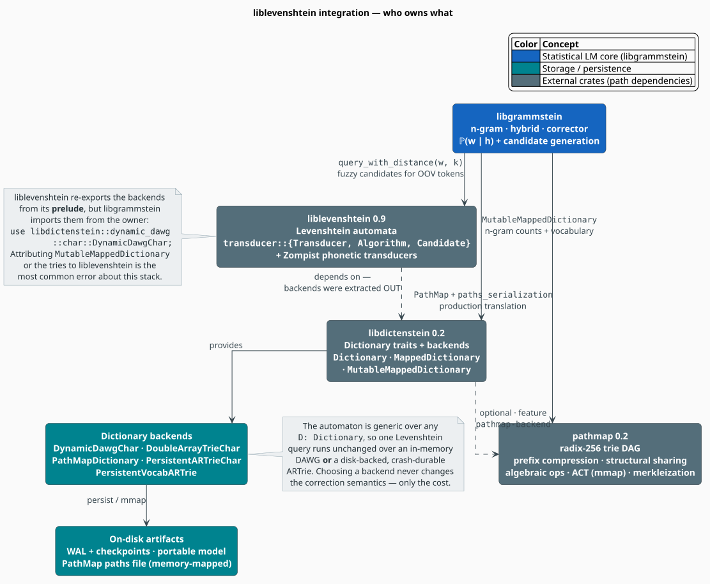
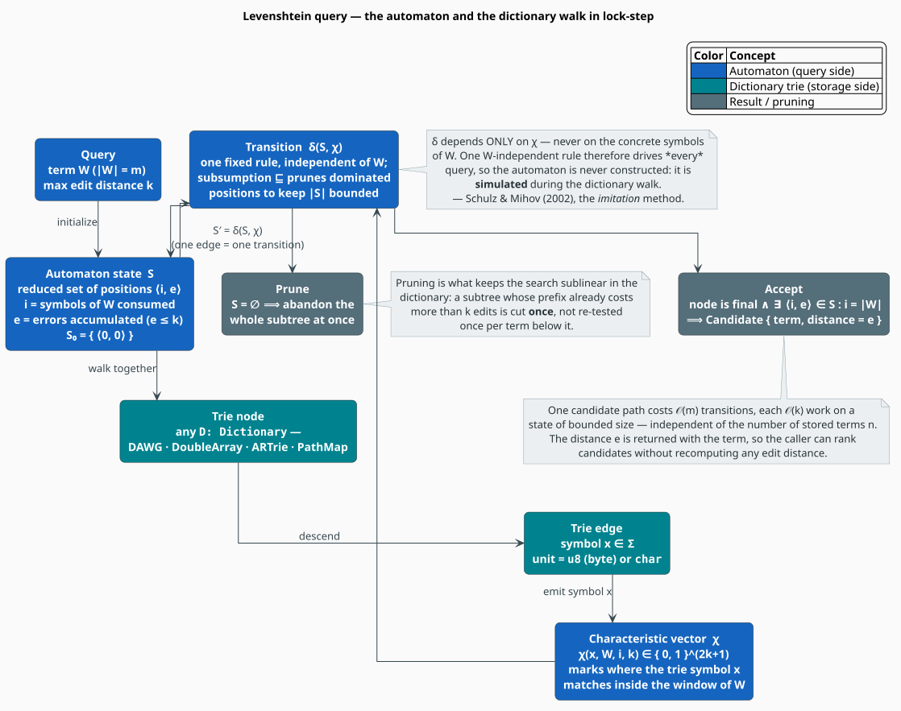

# liblevenshtein Integration

**[liblevenshtein-rust](https://github.com/f1r3fly-io/liblevenshtein-rust)** gives libgrammstein
one thing the statistical core cannot supply on its own: the ability to ask *"which known words are
within $`k`$ edits of this misspelling?"* and to answer it in time that does not grow with the size
of the dictionary. It does so with **Levenshtein automata** [[1]](#references)[[2]](#references) —
the fuzzy-matching engine behind the spelling stage of the
[hierarchical corrector](../lling-llang/hierarchical-correction.md).

> **The one thing to get right.** liblevenshtein supplies the **automata**. It does **not** supply
> the dictionaries. The trie backends and the `Dictionary` / `MappedDictionary` /
> `MutableMappedDictionary` traits were extracted into the sibling crate **libdictenstein**;
> liblevenshtein *depends* on it and re-exports the backends through its `prelude`, but
> libgrammstein imports them from the owner. Every `use` in this repository reads
> `libdictenstein::…`, never `liblevenshtein::dictionary::…`. Attributing the traits or the tries
> to liblevenshtein is the most common error made about this stack — and it is the error the
> previous revision of this document made.

> **Scope.** Source of truth: [`src/integration/corrector.rs`](../../../src/integration/corrector.rs)
> (the automaton's only production caller), [`src/ngram/trie.rs`](../../../src/ngram/trie.rs) and
> [`src/ngram/vocabulary.rs`](../../../src/ngram/vocabulary.rs) (how n-grams become dictionary
> terms), and [`Cargo.toml`](../../../Cargo.toml) (the dependency edges). For *which* backend to
> put under the automaton see [Backend Selection](backend-selection.md); for the PathMap substrate
> see [PathMap Synergy](pathmap-synergy.md).

## Notation

Every symbol is defined here before it appears in a formula.

| Symbol | Meaning |
|---|---|
| $`\Sigma`$ | the alphabet of symbols (dictionary *units*: `u8` bytes or `char` Unicode scalars) |
| $`\Sigma^{*}`$ | the set of all finite strings over $`\Sigma`$ |
| $`W`$ | the **query term** — the (possibly misspelled) word being corrected |
| $`m`$ | the length of the query term, $`m = \lvert W \rvert`$ |
| $`w_i`$ | the $`i`$-th symbol of $`W`$ |
| $`s`$ | a **dictionary term** — a candidate correction |
| $`\ell`$ | the length of a dictionary term, $`\ell = \lvert s \rvert`$ |
| $`D`$ | the **dictionary**, a finite set $`D \subset \Sigma^{*}`$ |
| $`n`$ | the number of terms stored in the dictionary, $`n = \lvert D \rvert`$ |
| $`k`$ | the **maximum edit distance** searched (`EditConfig::max_distance`, default $`2`$) |
| $`d(W, s)`$ | the edit distance between $`W`$ and $`s`$ |
| $`\mathcal{N}_k(W)`$ | the **Levenshtein neighborhood** — every string within $`k`$ edits of $`W`$ |
| $`\langle i, e \rangle`$ | an automaton **position**: $`i`$ symbols of $`W`$ consumed, $`e`$ errors paid |
| $`S`$ | an automaton **state** — a subsumption-reduced set of positions |
| $`\chi`$ | the **characteristic vector** of a symbol against a window of $`W`$ |
| $`\delta`$ | the automaton transition function |
| $`[\,P\,]`$ | the Iverson bracket: $`1`$ if the proposition $`P`$ holds, else $`0`$ |

**Acronyms.** *OOV* — Out-Of-Vocabulary (a token absent from the dictionary); *DAWG* — Directed
Acyclic Word Graph; *ART* — Adaptive Radix Trie; *WFST* — Weighted Finite-State Transducer;
*LEB128* — Little-Endian Base-128 (a variable-length integer encoding); *WAL* — Write-Ahead Log;
*CAS* — Compare-And-Swap.

## 1. The problem: fuzzy lookup that ignores dictionary size

A language model can rank *"the quick brown fox"* above *"teh quikc brwon fox"* only if something
first proposes `the` as an alternative to `teh`. That proposal step is a **neighborhood query**:

```math
\mathcal{N}_k(W) = \bigl\{\, s \in \Sigma^{*} \;:\; d(W, s) \le k \,\bigr\},
\qquad
\text{answer} \;=\; D \cap \mathcal{N}_k(W) \tag{L1}
```

The naïve implementation computes $`d(W, s)`$ for **every** $`s \in D`$ and keeps the close ones.
With the standard dynamic program that costs $`O(m\,\ell)`$ per term, hence $`O(n \cdot m\,\ell)`$
per query — linear in the dictionary. For the Google-Books vocabulary ($`n`$ in the millions) that
is hopeless on a per-token budget.

The Levenshtein-automaton approach turns the question inside out. Rather than testing terms one at
a time, it builds a machine that **accepts exactly $`\mathcal{N}_k(W)`$** and runs that machine
*against the dictionary trie*, so shared prefixes are tested once and hopeless subtrees are cut
whole. Cost stops being a function of $`n`$ and becomes a function of how much of the trie survives
pruning.

### 1.1 Edit distance, precisely

For $`W = w_1 \dots w_m`$ and $`s = s_1 \dots s_\ell`$, let $`d_{i,j}`$ be the distance between the
prefixes $`w_1 \dots w_i`$ and $`s_1 \dots s_j`$. Levenshtein's recurrence [[3]](#references) is:

```math
d_{i,j} =
\begin{cases}
j & i = 0 \\
i & j = 0 \\
\min
\begin{cases}
d_{i-1,\,j} + 1 & \text{(delete } w_i \text{)} \\
d_{i,\,j-1} + 1 & \text{(insert } s_j \text{)} \\
d_{i-1,\,j-1} + [\, w_i \neq s_j \,] & \text{(substitute; a match costs nothing)}
\end{cases}
& \text{otherwise}
\end{cases}
\tag{L2}
```

with $`d(W, s) = d_{m,\ell}`$. libgrammstein does **not** default to $`(\mathrm{L2})`$ as written:
it selects `Algorithm::Transposition`, which adds Damerau's fourth operation [[4]](#references) —
an **adjacent transposition** costs one edit rather than two substitutions:

```math
d_{i,j} \;\leftarrow\; \min\bigl(\, d_{i,j},\;\; d_{i-2,\,j-2} + 1 \,\bigr)
\qquad \text{when } w_i = s_{j-1} \;\wedge\; w_{i-1} = s_j
\tag{L3}
```

This matters more than it looks. Transposition is among the most common human typo classes, and
under $`(\mathrm{L3})`$ the fix `teh → the` costs $`1`$, not $`2`$ — so it sits comfortably inside a
$`k = 2`$ search alongside genuinely close alternatives instead of competing with them at the
budget's edge.

## 2. What each crate actually supplies



*Figure 1 — who owns what. Grey = external crate, teal = storage, blue = libgrammstein's own core.*

| Crate | Supplies | libgrammstein imports |
|---|---|---|
| **liblevenshtein** 0.9 | Levenshtein automata; phonetic transducers | `liblevenshtein::transducer::{Transducer, Algorithm, Candidate}`; `liblevenshtein::phonetic::{…}` |
| **libdictenstein** 0.2 | the dictionary traits **and** every trie backend | `libdictenstein::{Dictionary, MappedDictionary, MutableMappedDictionary}`; `libdictenstein::dynamic_dawg::char::DynamicDawgChar`; … |
| **pathmap** 0.2 | the radix-256 trie DAG substrate | `pathmap::PathMap`; `pathmap::paths_serialization::{…}` |

The dependency edges are acyclic: liblevenshtein depends on libdictenstein (never the reverse), and
libgrammstein depends on all three directly. Enabled features are pinned in
[`Cargo.toml`](../../../Cargo.toml) — `pathmap-backend`, `persistent-artrie` and `embedded-rules`
on liblevenshtein; `persistent-artrie` and `parking_lot` on libdictenstein.

## 3. Theory: the automaton



*Figure 2 — the automaton (blue) and the dictionary trie (teal) advance together: one trie edge
consumed is one automaton transition.*

### 3.1 States are sets of positions

A **position** $`\langle i, e \rangle`$ records a hypothesis: *"we have consumed $`i`$ symbols of
the query $`W`$ and paid $`e`$ errors doing so."* A **state** $`S`$ is a set of such positions — the
machine tracks every alignment still alive at once. The initial state commits to nothing:

```math
S_0 = \bigl\{\, \langle 0, 0 \rangle \,\bigr\} \tag{L4}
```

States are kept small by **subsumption**. A position strictly better than another in both
coordinates at once makes the other redundant:

```math
\langle i, e \rangle \sqsubseteq \langle i', e' \rangle
\iff
e < e' \;\wedge\; \lvert i - i' \rvert \le e' - e \tag{L5}
```

If $`\langle i, e \rangle \sqsubseteq \langle i', e' \rangle`$, then every continuation that
$`\langle i', e' \rangle`$ could still complete within budget, $`\langle i, e \rangle`$ can also
complete within budget — so the dominated position is dropped. Retaining only the
$`\sqsubseteq`$-minimal positions bounds $`\lvert S \rvert`$ by a function of $`k`$ **alone**, never
of $`m`$ or $`n`$. That bound is what keeps the per-transition cost constant.

### 3.2 The characteristic vector — the decisive insight

On reading a symbol $`x`$ from the dictionary, the automaton must decide where $`x`$ could match
inside $`W`$. Only a window of $`2k + 1`$ symbols around the current position can matter — anything
further away is unreachable on the remaining error budget. The **characteristic vector** records
exactly that window, and nothing else:

```math
\chi(x, W, i, k) \;=\;
\bigl(\, [\, w_{i+1} = x \,],\; [\, w_{i+2} = x \,],\; \dots,\; [\, w_{i+2k+1} = x \,] \,\bigr)
\;\in\; \{0, 1\}^{2k+1} \tag{L6}
```

Schulz & Mihov's decisive observation [[1]](#references) is that the transition depends **only** on
$`\chi`$ — never on the concrete symbols of $`W`$:

```math
S' = \delta(S, \chi) \tag{L7}
```

Two consequences follow, and together they are the entire reason this design is fast:

1. **One fixed transition rule serves every query.** Because $`\delta`$ never inspects $`W`$
   directly, it need not be rebuilt per query word. Automata parameterized this way — over the *bit
   pattern* rather than the *word* — are the **universal Levenshtein automata** of Mitankin, Mihov
   & Schulz [[5]](#references).
2. **The automaton need never be materialized.** liblevenshtein's default `query` path *simulates*
   the deterministic automaton's states during the dictionary walk instead of constructing a
   standalone machine — the paper's **imitation** method. (An eager `universal` construction also
   ships in the crate; it is not the default path.)

### 3.3 Acceptance

Let $`\hat\delta(S_0, s)`$ denote the state reached by feeding the symbols of $`s`$ one at a time
from $`S_0`$. The automaton accepts $`s`$ exactly when some surviving position has consumed **all**
of $`W`$ within budget:

```math
s \in \mathcal{N}_k(W)
\iff
\exists\, \langle i, e \rangle \in \hat\delta(S_0, s)
\;\;\text{with}\;\;
i = m \;\wedge\; e \le k
\tag{L8}
```

and the least such $`e`$ **is** the edit distance $`d(W, s)`$. This is why a `Candidate` can carry
its distance for free — the distance is a by-product of acceptance, never a second pass:

```rust
// liblevenshtein::transducer::Candidate — the distance comes back with the term.
pub struct Candidate {
    pub term: String,
    pub distance: usize,
}
```

### 3.4 Complexity

Three costs must be kept apart; conflating them is precisely how the fabricated benchmark tables in
the previous revision of this directory arose.

| Operation | Cost | Grows with $`n`$? |
|---|---|---|
| Exact lookup (`contains`, `get_value`) | $`O(m)`$ | **no** |
| Accepting one candidate $`s`$ | $`O\bigl(k \cdot (m + k)\bigr) = O(m)`$ for fixed $`k`$ | **no** |
| Full neighborhood query $`D \cap \mathcal{N}_k(W)`$ | $`O(k)`$ per *surviving* trie node | **no** — proportional to the pruned subtrie, not to $`n`$ |

The first row is the defining property of a trie-shaped index: the walk consumes one symbol per
level, so its length is bounded by the **query length**, never by how many terms are stored. Every
backend in [Backend Selection](backend-selection.md) shares this $`O(m)`$ bound; they differ in
constants, mutability and space — not in asymptotics.

A dictionary path can run at most $`m + k`$ symbols before the error budget is exhausted (each
symbol beyond the $`m`$-th is an insertion), which is why accepting a candidate is $`O(m)`$ for
constant $`k`$. And because a subtree whose prefix has already spent more than $`k`$ edits is cut
**once** instead of re-tested for every term beneath it, it is *pruning* — not the per-node cost —
that delivers the win over the $`O(n \cdot m\,\ell)`$ scan.

## 4. The query, literately

The following mirrors the shape of `Transducer::query_with_distance` as libgrammstein drives it.
`⟨…⟩` names a refinement expanded below.

```
function query(W, k):                             ▸ yields Candidate { term, distance }
    S0 <- { <0, 0> }                              ▸ (L4): consumed nothing, paid nothing
    walk(dictionary.root(), prefix = "", S = S0)  ▸ depth-first over the trie

function walk(node, prefix, S):
    if S is empty:                                ▸ subsumption (L5) left nothing alive ...
        return                                    ▸ ... so this whole subtree is unreachable: PRUNE
    ⟨Emit if accepting⟩
    for (x, child) in node.edges():               ▸ x is a unit: a u8 byte or a char
        chi <- characteristic_vector(x, W, S, k)  ▸ (L6): one bit per window offset
        S'  <- reduce(delta(S, chi))              ▸ (L7), then drop subsumed positions
        walk(child, prefix ++ x, S')              ▸ trie and automaton advance in lock-step

⟨Emit if accepting⟩ ≡
    if node.is_final():                           ▸ prefix is a real dictionary term
        e <- min { e : <i, e> in S, i = |W| }     ▸ (L8); undefined if nothing consumed all of W
        if e exists and e <= k:
            yield Candidate { term: prefix, distance: e }
```

Two invariants make this correct, and both fall straight out of the theory above:

- **Soundness.** `yield` fires only under $`(\mathrm{L8})`$, so every emitted term genuinely lies in
  $`\mathcal{N}_k(W)`$ and its reported distance is exactly $`d(W, s)`$.
- **Completeness.** The empty-state prune discards a subtree only when *no* position survives — and
  by $`(\mathrm{L5})`$ a discarded position could not have completed within budget anyway. No
  reachable candidate is lost.

## 5. How libgrammstein uses it

The automaton has exactly **one** production caller: `LevenshteinCorrectionLayer` in
[`src/integration/corrector.rs`](../../../src/integration/corrector.rs). It is a first-class
lling-llang `CorrectionLayer` — it consumes a lattice of tokens and returns a *new* lattice with
correction edges added, each weighted by its edit distance in the target semiring.

```rust
use libdictenstein::{Dictionary, DictionaryNode, MutableMappedDictionary};
use liblevenshtein::transducer::{Algorithm, Candidate, Transducer};

pub struct LevenshteinCorrectionLayer<W, B, D>
where
    D: Dictionary,
{
    /// The automaton, built ONCE at layer construction — never rebuilt per word.
    transducer: Transducer<D>,
    config: EditConfig,
    _marker: PhantomData<fn() -> (W, B)>,
}
```

The layer is generic over the semiring `W`, the lattice backend `B`, **and** the dictionary handle
`D`, so identical correction code runs over an in-memory DAWG or a disk-backed, crash-durable
ARTrie. The shipped `HierarchicalCorrector` façade fixes the instantiation to `TropicalWeight` +
`HashMapBackend` + a `SharedVocabARTrie` spelling dictionary, which is the common deployment.

### 5.1 The knobs

```rust
pub struct EditConfig {
    /// Maximum edit distance searched per OOV token. Default: 2.
    pub max_distance: usize,
    /// Standard | Transposition | MergeAndSplit. Default: Transposition.
    pub algorithm: Algorithm,
    /// Cap on correction edges added per token. Default: 8.
    pub max_corrections_per_word: usize,
    /// Tokens shorter than this (in Unicode scalars) are never corrected. Default: 2.
    pub min_word_length: usize,
    /// Keep the original token as an alternative alongside its corrections. Default: true.
    pub keep_original: bool,
}
```

`Algorithm` selects which edit set the automaton recognizes, and hence *which*
$`\mathcal{N}_k(W)`$ is searched:

| Variant | Operations | Use when |
|---|---|---|
| `Standard` | insert, delete, substitute — exactly $`(\mathrm{L2})`$ | you want textbook Levenshtein distance |
| `Transposition` | the above **plus** adjacent transposition, $`(\mathrm{L3})`$ | **the default** — human typing errors |
| `MergeAndSplit` | the above with merges and splits of adjacent symbols | OCR output, where `rn → m` and `m → rn` are single errors |

`min_word_length` exists because the neighborhood of a very short token is *dense*: within two edits
of a two-letter word lies a large fraction of the dictionary, so "correcting" it manufactures noise
rather than signal. `max_corrections_per_word` bounds the lattice's branching factor and keeps the
downstream Viterbi decode tractable.

### 5.2 Candidate selection

The layer queries once per OOV token, then imposes a total order so a given input always produces
the same lattice:

```rust
fn candidates_for(&self, word: &str) -> Vec<Candidate> {
    let mut candidates: Vec<Candidate> = self
        .transducer
        .query_with_distance(word, self.config.max_distance)
        .collect();

    // Deterministic ordering: closest first, ties broken lexicographically.
    candidates.sort_by(|a, b| a.distance.cmp(&b.distance).then_with(|| a.term.cmp(&b.term)));

    let mut seen: HashSet<&str> = HashSet::with_capacity(candidates.len());
    let mut selected: Vec<Candidate> =
        Vec::with_capacity(candidates.len().min(self.config.max_corrections_per_word));

    for candidate in &candidates {
        if selected.len() >= self.config.max_corrections_per_word {
            break;
        }
        // Never re-propose the original spelling as a "correction".
        if candidate.term == word {
            continue;
        }
        if seen.insert(candidate.term.as_str()) {
            selected.push(candidate.clone());
        }
    }
    selected
}
```

A token is a correction target **iff** it is long enough *and* `!dictionary.contains(word)`. That
membership test is the $`O(m)`$ exact lookup of §3.4, so an in-vocabulary word costs one trie walk
and no automaton work whatsoever. This is the cheap path, and on ordinary text it is overwhelmingly
the common one.

### 5.3 Where the edit distance goes

The layer converts each candidate's distance into a semiring weight (`W: From<f64>`), so a two-edit
correction enters the lattice at twice the price of a one-edit correction. The language model then
*rescores* those edges: the automaton supplies **plausibility**, the n-gram supplies **fluency**,
and the Viterbi decode arbitrates between them. See
[Hierarchical Correction](../lling-llang/hierarchical-correction.md) for the whole pipeline and
[Pipeline Assembly](../lling-llang/pipeline-assembly.md) for the layer ordering.

## 6. How n-grams become dictionary terms

A dictionary stores *strings*; an n-gram is a *sequence of words*. Something must encode one as the
other, and libgrammstein has two schemes — only one of which belongs in new code.

**Legacy: pipe-separated.** `["the", "quick", "brown"] → "the|quick|brown"`. This is
`NgramTrie::encode_key`, and it is **`#[deprecated]`**: a token that itself contains `|` silently
corrupts the key. It survives only to read models written before the migration.

**Current: vocabulary-indexed varints.** Each word is assigned a `u64` index by a
`PersistentVocabARTrie`; an n-gram key is the concatenation of its words' **LEB128 varints**, with
each byte `0x00`–`0xFF` lifted to the Unicode scalar `U+0000`–`U+00FF` (a Latin-1 lift, so the
result is always valid UTF-8 that a `char`-unit trie can store directly):

| Word | Index | LEB128 bytes | Key fragment |
|---|---|---|---|
| `the` | $`1`$ | `0x01` | `U+0001` |
| `quick` | $`128`$ | `0x80 0x01` | `U+0080 U+0001` |

There are no delimiters, so there is no delimiter bug. Frequent words land in low indices and cost a
single byte apiece. Index $`0`$ is reserved — its varint is `0x00`, which is the prefix set aside
for Modified Kneser-Ney metadata entries — hence `FIRST_VALID_INDEX = 1`, and hence the
`MetadataFilteringZipper` that hides `\x00`-prefixed keys from ordinary iteration.

```rust
use libgrammstein::ngram::vocabulary::{encode_ngram_key, open_or_create_vocabulary};

let vocab = open_or_create_vocabulary(std::path::Path::new("vocab"))?;
let key = encode_ngram_key(&["the", "quick", "brown"], &vocab); // varint-packed, delimiter-free
# Ok::<(), libgrammstein::ngram::vocabulary::VocabularyError>(())
```

Note what the spelling dictionary the corrector queries actually *is*: the **vocabulary trie**
itself. Its terms are whole words, so the automaton's alphabet is `char` and its neighborhood is a
neighborhood of *words* — not of encoded n-gram keys, which would be meaningless to edit. See
[Dictionary Backend](../lling-llang/dictionary-backend.md).

## 7. The trait contract

Everything above is generic over libdictenstein's trait tower. The exact signatures matter, because
several of them are routinely misquoted:

```rust
pub trait Dictionary {
    type Node: DictionaryNode;                    // Node::Unit is u8 or char
    fn root(&self) -> Self::Node;
    fn contains(&self, term: &str) -> bool;       // O(m) walk, then is_final
}

pub trait MappedDictionary: Dictionary {
    type Value: DictionaryValue;                  // an ASSOCIATED type, not a generic parameter
    fn get_value(&self, term: &str) -> Option<Self::Value>;   // returns an OWNED value
}

pub trait MutableMappedDictionary: MappedDictionary {
    fn insert_with_value(&self, term: &str, value: Self::Value) -> bool;   // &self, not &mut self
    fn update_or_insert<F>(&self, term: &str, default_value: Self::Value, update_fn: F) -> bool
    where
        F: Fn(&mut Self::Value);                  // Fn, not FnOnce — see below
}
```

Three details carry real design weight:

1. **`Value` is an associated type.** The bound libgrammstein writes throughout is therefore
   `D: MutableMappedDictionary<Value = NgramEntry>` — *not* `MutableMappedDictionary<NgramEntry>`.
2. **Mutation takes `&self`.** Insertion is *interior* mutability, so a dictionary is shared across
   Rayon workers behind a plain `Arc` with no `RwLock` anywhere in the write path. This is what
   makes corpus training lock-free.
3. **`update_fn` is `Fn`, not `FnOnce`.** The lock-free backends update by compare-and-swap, and a
   losing CAS **retries** — which re-runs the closure. libdictenstein documents it as a "retry-safe
   function". A closure with side effects reaching outside the value it is handed will therefore
   double-count under contention.

The value type must satisfy `DictionaryValue: Clone + Default + Send + Sync + Unpin + 'static` (plus
`Serialize + DeserializeOwned` under the serde feature). libgrammstein's
[`NgramEntry`](../../../src/ngram/entry.rs) satisfies it with **atomic** fields and a hand-written
`Clone`, so parallel corpus workers increment counts without locks — see
[Modified Kneser-Ney](../../components/ngram/modified-kneser-ney.md) and the
[Threading Model](../../architecture/threading.md).

## 8. The phonetic transducers

liblevenshtein also ships transducers over *pronunciation* rather than *spelling*, and libgrammstein
uses them in [`src/embedding/phonetic.rs`](../../../src/embedding/phonetic.rs):

```rust
use liblevenshtein::phonetic::{zompist_rules_char, OnlinePhoneticTransducerChar, RewriteRuleChar};
```

The Zompist rule set rewrites English orthography toward its pronunciation, so that *nite* and
*night* — four edits apart as *strings* — become neighbors as *sounds*. That is a genuinely
different similarity dimension from edit distance, and the correction framework is explicitly built
to fuse several such dimensions inside one semiring; see
[Correction Dimensions](../lling-llang/dimensions.md).

## 9. Usage

Build the automaton once, over whatever dictionary you already have, and query it per OOV token:

```rust
use libdictenstein::dynamic_dawg::char::DynamicDawgChar;
use libdictenstein::MutableMappedDictionary;
use liblevenshtein::transducer::{Algorithm, Transducer};

// Any `D: Dictionary` works; a DAWG is the general-purpose default.
let dictionary = DynamicDawgChar::<()>::new();
for word in ["the", "quick", "brown", "fox"] {
    dictionary.insert_with_value(word, ());   // note: &self, not &mut self
}

// One automaton, reused for every query.
let transducer = Transducer::new(dictionary, Algorithm::Transposition);

// "teh" -> "the" at distance 1: an adjacent transposition, per (L3).
for candidate in transducer.query_with_distance("teh", 2) {
    println!("{} (distance {})", candidate.term, candidate.distance);
}
```

Inside a correction pipeline you never call the transducer directly — you install the layer, and
the lattice machinery does the rest:

```rust
use libgrammstein::integration::corrector::{CorrectorConfig, HierarchicalCorrector};

let corrector = HierarchicalCorrector::from_checkpoint(
    std::path::Path::new("model_dir"),
    CorrectorConfig::default(),
)?;

let best = corrector.correct("teh quikc brwon fox");
assert_eq!(best[0].text, "the quick brown fox");
# Ok::<(), libgrammstein::Error>(())
```

## 10. Common misconceptions

Each row below was asserted by the previous revision of these documents and is false or stale.

| Claim | Status |
|---|---|
| "`MutableMappedDictionary` comes from liblevenshtein." | **False.** libdictenstein owns it; liblevenshtein only re-exports it in its prelude. |
| "`get_value` returns `Option<&V>`." | **False.** It returns an owned `Option<Self::Value>`. |
| "Insertion needs `&mut self`, or an `RwLock` around the dictionary." | **False.** It takes `&self`; the backends are lock-free. |
| "`DynamicDawgChar` has SIMD and Bloom-filter optimizations." | **Stale.** Its config arguments are accepted for API compatibility and then ignored; the lock-free core traverses exactly. SIMD lives in the ARTrie's Node16 ladder; the Bloom filter is armed on the *vocabulary* ARTrie. See [Backend Selection](backend-selection.md). |
| "The automaton is rebuilt for each query word." | **False.** One `Transducer` is built per layer and reused — the transition rule is $`W`$-independent by $`(\mathrm{L7})`$. |
| "`PathMapDictionary` is a hash map: $`O(1)`$, no prefix search, no fuzzy matching." | **False.** It is a trie, with $`O(m)`$ lookup and prefix walks. See [PathMap Synergy](pathmap-synergy.md). |
| "There is a `StaticNgramModel` type alias." | **False.** The aliases are `SerializableNgramModel` and `PathMapNgramModel`; the static path is `NgramModel::<DoubleArrayTrieChar<_>>::load_static_portable`. |

## References

1. K. U. Schulz & S. Mihov (2002). *Fast string correction with Levenshtein automata.*
   International Journal on Document Analysis and Recognition (IJDAR) 5(1), 67–85.
   [doi:10.1007/s10032-002-0082-8](https://doi.org/10.1007/s10032-002-0082-8)
2. S. Mihov & K. U. Schulz (2004). *Fast approximate search in large dictionaries.*
   Computational Linguistics 30(4), 451–477.
   [doi:10.1162/0891201042544938](https://doi.org/10.1162/0891201042544938)
3. V. I. Levenshtein (1966). *Binary codes capable of correcting deletions, insertions, and
   reversals.* Soviet Physics Doklady 10(8), 707–710. (Predates DOI registration; originally
   *Doklady Akademii Nauk SSSR* 163(4), 845–848, 1965.)
4. F. J. Damerau (1964). *A technique for computer detection and correction of spelling errors.*
   Communications of the ACM 7(3), 171–176.
   [doi:10.1145/363958.363994](https://doi.org/10.1145/363958.363994)
5. P. Mitankin, S. Mihov & K. U. Schulz (2009). *Universal Levenshtein automata for a generalization
   of the Levenshtein distance.* Annuaire de l'Université de Sofia, Faculté de Mathématique et
   Informatique 99, 5–23. (Foundational treatment: P. Mitankin, *Universal Levenshtein Automata:
   Building and Properties*, MSc thesis, Sofia University, 2005.)

## See also

- [Backend Selection](backend-selection.md) — which trie to put under the automaton, and why
- [PathMap Synergy](pathmap-synergy.md) — the radix-256 trie DAG substrate and the production translation
- [Hierarchical Correction](../lling-llang/hierarchical-correction.md) — the full correction pipeline
- [Dictionary Backend](../lling-llang/dictionary-backend.md) — feeding the automaton from the persistent vocabulary trie
- [Trie Storage](../../components/ngram/trie-storage.md) — how n-grams and the vocabulary are laid out
- [Dictionary Overview](../../components/dictionary/overview.md) — extracting and building spelling dictionaries
