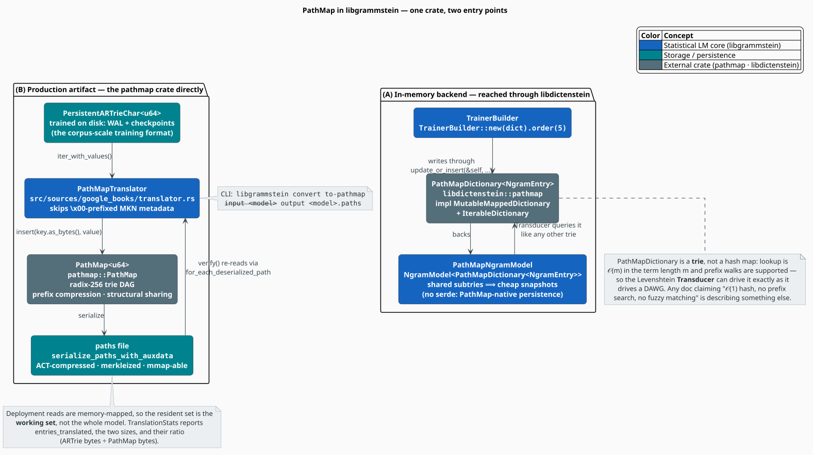

# PathMap Synergy

**[PathMap](https://github.com/Adam-Vandervorst/PathMap)** is the trie substrate underneath this
corner of the ecosystem: a radix-256 key-value store with prefix compression, **structural sharing**,
and algebraic operations over subtries. It is the low-level data structure behind
[MORK](https://github.com/trueagi-io/MORK), and libgrammstein reaches it by **two distinct routes**
that are routinely conflated — one in memory, one on disk.

> **PathMap is a trie, not a hash map.** The previous revision of this document described it as a
> *"lock-free concurrent hash map"* offering *"$`O(1)`$ average lookup"*, *"no prefix search"* and
> *"no fuzzy matching"*. Every one of those claims is false. PathMap is a radix-256 trie (indeed a
> **DAG**); lookup is $`O(m)`$ in the key length; prefix traversal is its native idiom; and because
> `PathMapDictionary` implements `libdictenstein::Dictionary`, the Levenshtein automaton can query
> it exactly as it queries a DAWG. The fabricated benchmark tables that accompanied those claims
> have been removed rather than restated.

> **Also: PathMap is not part of liblevenshtein.** It is its own crate (`pathmap = "0.2"`, a direct
> dependency of libgrammstein). `PathMapDictionary` — the *dictionary adapter* over it — belongs to
> **libdictenstein**, behind its `pathmap-backend` feature. See
> [Overview §2](overview.md#2-what-each-crate-actually-supplies).

> **Scope.** Source of truth: [`src/sources/google_books/translator.rs`](../../../src/sources/google_books/translator.rs)
> (the only place the `pathmap` crate's own API is called), [`src/ngram/mod.rs`](../../../src/ngram/mod.rs)
> (the `PathMapNgramModel` alias), [`src/ngram/trie.rs`](../../../src/ngram/trie.rs) (the
> `IterableDictionary` impl), and [`src/cli/commands/convert.rs`](../../../src/cli/commands/convert.rs)
> (the CLI surface).

## Notation

| Symbol | Meaning |
|---|---|
| $`m`$ | length of a key, in bytes |
| $`n`$ | number of $`(\text{key}, \text{value})`$ pairs stored |
| $`d`$ | depth of the trie node at which an update lands, $`d \le m`$ |
| $`v`$ | number of coexisting versions (snapshots) of a map |
| $`\lvert T \rvert`$ | the number of nodes in trie $`T`$ |
| $`\oplus`$ | PathMap's `join` — the algebraic union of two (sub)tries |
| $`\otimes`$ | PathMap's `meet` — the algebraic intersection of two (sub)tries |

**Acronyms.** *ACT* — Arena-Compact Trie (PathMap's read-only, memory-mappable format); *COW* —
Copy-On-Write; *DAG* — Directed Acyclic Graph; *ART* — Adaptive Radix Trie; *WAL* — Write-Ahead Log;
*MKN* — Modified Kneser-Ney; *mmap* — memory map.

## 1. What PathMap actually is

A **radix-256 trie**: each level consumes one byte of the key, so a node has up to 256 children and
a lookup terminates in at most $`m`$ steps. Single-child chains are collapsed by **prefix
compression**, the PATRICIA idea [[1]](#references), so a long unique suffix does not cost one node
per byte.

Four properties distinguish it from an ordinary radix trie, and each one earns its place here:

| Property | What it means | Why libgrammstein cares |
|---|---|---|
| **DAG, not tree** | identical subtries are *shared*, not duplicated | a snapshot costs a pointer; $`v`$ model versions do not cost $`v \cdot n`$ nodes |
| **Algebraic ops** | `join` ($`\oplus`$), `meet` ($`\otimes`$) etc., applicable to whole maps *and* subtries | merging shard tries is a set operation, not a re-insert loop |
| **ACT format** | a read-only arena layout that can be `mmap`-ed from disk | a model larger than RAM is still queryable — the resident set becomes the *working set* |
| **Merkleization** | content-addressed nodes | integrity verification, and content-addressing is what makes subtrie sharing decidable |

Navigation is by **zipper** — a cursor that descends, ascends and reads without materializing
intermediate structures. `read_zipper()` is exactly what the translator hands to the serializer in
§4.

### 1.1 Why structural sharing makes snapshots cheap

This is the property worth being precise about, because it is the reason to choose PathMap over a
DAWG at all.

Updating a persistent trie [[2]](#references) copies only the nodes on the path from the root to the
changed leaf; every subtrie hanging off that path is *shared* with the previous version. An update
landing at depth $`d`$ therefore allocates $`O(d)`$ new nodes and shares the remaining
$`\lvert T \rvert - O(d)`$:

```math
\begin{array}{lr}
\displaystyle \lvert T_{\text{new}} \rvert_{\text{fresh nodes}} = O(d) \le O(m),
\qquad
\text{cost}(v \text{ versions}) = O\bigl(\lvert T \rvert + v \cdot m\bigr)
\;\;\ll\;\;
O(v \cdot \lvert T \rvert) & \text{(P1)}
\end{array}
```

The right-hand comparison in $`(\mathrm{P1})`$ is the whole argument: naïvely, $`v`$ snapshots of an
$`n`$-entry model cost $`v`$ full copies; with structural sharing they cost one model plus a thin
$`O(m)`$ spine per version. For a language model where each version differs from the last by a
handful of counts, that is the difference between feasible and not.

## 2. The two entry points



*Figure 1 — (A) the in-memory dictionary backend, reached through libdictenstein; (B) the on-disk
production artifact, which calls the `pathmap` crate directly. Only (B) touches `pathmap::PathMap`.*

| | (A) In-memory backend | (B) Production artifact |
|---|---|---|
| Type | `libdictenstein::pathmap::PathMapDictionary<V>` | `pathmap::PathMap<u64>` |
| Reached via | libdictenstein (feature `pathmap-backend`) | the `pathmap` crate, directly |
| Used by | `TrainerBuilder`, `NgramModel`, the Levenshtein `Transducer` | `PathMapTranslator` only |
| Purpose | a mutable trie with shared structure | a compact, memory-mappable deployment file |
| Source | [`src/ngram/mod.rs`](../../../src/ngram/mod.rs) | [`src/sources/google_books/translator.rs`](../../../src/sources/google_books/translator.rs) |

## 3. Entry point (A): `PathMapDictionary` as a backend

`PathMapDictionary<V>` is libdictenstein's adapter that makes a PathMap satisfy the dictionary trait
tower. Because it implements `MutableMappedDictionary<Value = NgramEntry>`, it drops straight into
the trainer; because it implements `Dictionary`, the Levenshtein automaton can query it.

```rust
use libdictenstein::pathmap::PathMapDictionary;
use libgrammstein::ngram::{NgramEntry, PathMapNgramModel, TrainerBuilder};

let dictionary = PathMapDictionary::<NgramEntry>::new();
let model: PathMapNgramModel = TrainerBuilder::new(dictionary)
    .order(5)
    .train(&reader)?;
# Ok::<(), libgrammstein::Error>(())
```

It is one of the four backends carrying libgrammstein's own `IterableDictionary` hook
([`src/ngram/trie.rs`](../../../src/ngram/trie.rs)), so a `PathMapNgramModel` can still be written in
the **portable** format even though the backend has no `serde` support of its own:

```rust
impl IterableDictionary for libdictenstein::pathmap::PathMapDictionary<NgramEntry> {
    fn iter_all(&self) -> Box<dyn Iterator<Item = (String, NgramEntry)> + '_> {
        Box::new(self.iter())
    }
}
```

**The trade-off, stated honestly.** Against `DynamicDawgChar` you gain cheap snapshots and subtrie
algebra; you give up `serde`. Against `DoubleArrayTrieChar` you gain mutability; you give up the
$`\approx 8`$ bytes/node compactness. Lookup remains $`O(m)`$ in all three — see
[Backend Selection](backend-selection.md).

### 3.1 It is queryable by the automaton

Worth stating explicitly, because the previous revision denied it. `PathMapDictionary` implements
`Dictionary`, and `Transducer<D>` is generic over `D: Dictionary`. Therefore:

```rust
use libdictenstein::pathmap::PathMapDictionary;
use libdictenstein::MutableMappedDictionary;
use liblevenshtein::transducer::{Algorithm, Transducer};

let dictionary = PathMapDictionary::<()>::new();
for word in ["the", "quick", "brown", "fox"] {
    dictionary.insert_with_value(word, ());
}

// The very thing the old doc said PathMap could not do.
let transducer = Transducer::new(dictionary, Algorithm::Transposition);
for candidate in transducer.query_with_distance("teh", 2) {
    println!("{} @ {}", candidate.term, candidate.distance);
}
```

Prefix search and fuzzy matching are not merely *possible* on a PathMap; they are what a trie is
*for*.

## 4. Entry point (B): `PathMapTranslator`

This is where the `pathmap` crate's own API is used, and it exists to solve a specific deployment
problem. Corpus-scale training writes a `PersistentARTrieChar` — WAL-backed, crash-durable, built to
be *written*. Production wants the opposite: a frozen artifact built to be *read*, ideally without
loading it. `PathMapTranslator` converts the one into the other.

### 4.1 The pipeline, literately

Mirrors [`PathMapTranslator::translate`](../../../src/sources/google_books/translator.rs).

```
function translate(artrie_path, pathmap_path) -> TranslationStats:
    trie <- PersistentARTrieChar::<u64>::open(artrie_path)   ▸ the trained, disk-backed model

    entries <- []                                            ▸ Phase: Loading / Iterating
    for (key, value) in trie.iter_with_values():
        if is_valid_entry(key):                              ▸ skip \x00-prefixed MKN metadata
            entries.push((key, value))
    if entries is empty: return Err(EmptySource)

    pathmap <- PathMap::<u64>::new()                         ▸ Phase: Building
    for (key, value) in entries:
        pathmap.insert(key.as_bytes(), value)                ▸ radix-256 insert, byte keys

    rz <- pathmap.read_zipper()                              ▸ Phase: Saving — a cursor, not a copy
    serialize_paths_with_auxdata(rz, paths_writer, |_idx, _path, value|:
        values_writer.write_all(&value.to_le_bytes()))       ▸ values go to a .values sidecar

    return TranslationStats { entries_translated, artrie_size_bytes,
                              pathmap_size_bytes, compression_ratio, ... }
```

Three details a caller must know:

1. **Two files are written.** The `OUTPUT` path receives the serialized *paths*; a sibling with the
   extension replaced by `.values` receives the values, as little-endian `u64`. `verify` requires
   both, and refuses to run if either is missing.
2. **The value type is `u64`, not `NgramEntry`.** The Google-Books shards store raw counts; the
   auxdata callback writes exactly 8 bytes per entry.
3. **Entries are materialized before the build.** The loop collects into a `Vec<(String, u64)>`
   before constructing the `PathMap`, so peak memory scales with $`n`$, not with the streaming
   window. `TranslationStats::peak_memory_bytes` reports it. This is a real constraint on very large
   shards, and it is a property of *this translator*, not of PathMap.

### 4.2 The metadata filter

Modified Kneser-Ney stores its corpus-level statistics inside the same trie as the n-grams, under
keys prefixed with `\x00`. That prefix is reserved precisely because vocabulary index $`0`$ is
excluded (`FIRST_VALID_INDEX = 1`), so no legitimate n-gram key can begin with it — see
[Overview §6](overview.md#6-how-n-grams-become-dictionary-terms).

```rust
/// Check if an entry should be included (filters out metadata).
#[inline]
fn is_valid_entry(key: &str) -> bool {
    // Skip MKN metadata entries (they start with \x00)
    !key.starts_with('\x00')
}
```

The deployed PathMap therefore holds **n-grams only**. The same discipline appears in-process as
`MetadataFilteringZipper`, which hides `\x00`-prefixed paths from ordinary iteration.

### 4.3 Reporting and verification

```rust
pub struct TranslationStats {
    pub entries_translated: u64,
    pub artrie_size_bytes: u64,
    pub pathmap_size_bytes: u64,
    pub compression_ratio: f64,     // artrie_size_bytes / pathmap_size_bytes
    pub elapsed_seconds: f64,
    pub peak_memory_bytes: u64,
}

pub enum TranslationPhase { Loading, Iterating, Building, Merkleizing, Saving, Complete }

pub struct VerificationResult {
    pub entries_verified: u64,
    pub mismatches: u64,
    pub verified: bool,
}
```

The compression ratio is a *reported measurement*, not a promised constant:

```math
\begin{array}{lr}
\displaystyle \text{compression ratio}
= \frac{\text{size}(\text{ARTrie on disk})}{\text{size}(\text{PathMap on disk})} & \text{(P2)}
\end{array}
```

Verification is a genuine round-trip, not a checksum: `PathMapTranslator::verify` re-opens the source
ARTrie, streams the serialized paths back with `pathmap::paths_serialization::for_each_deserialized_path`,
and counts mismatches. Translation is only trustworthy if `verified == true`.

### 4.4 The CLI

```sh
# Translate a trained model into the deployment format, then check it round-trips.
libgrammstein convert to-pathmap <INPUT> <OUTPUT> --verify
```

`INPUT` is the `PersistentARTrie`-format model directory; `OUTPUT` is the paths file (the `.values`
sidecar is derived from it). The subcommand is gated on the `google-books` feature. Progress is
reported through `TranslationProgress { phase, entries_processed, entries_total, bytes_written,
elapsed_seconds }`, which is what drives the CLI's progress bar.

## 5. Why memory-mapping is the point

The ACT format exists so that a trie **larger than memory** remains queryable. Under `mmap`, a
lookup faults in only the pages along its own root-to-leaf path, so steady-state residency tracks
the *working set* — the n-grams your traffic actually touches — rather than the model:

```math
\begin{array}{lr}
\displaystyle \text{RSS} \;\approx\; \text{pages touched} \;\ll\; \text{size}(\text{model}) & \text{(P3)}
\end{array}
```

For a Google-Books-scale model this is the difference between a process that starts in milliseconds
and one that cannot start at all. It also composes with the path compression of §1: fewer nodes
along a path means fewer distinct pages faulted per lookup, so compression buys I/O, not just bytes.

## 6. Corrections to the previous revision

Recorded explicitly, because these claims were specific and wrong.

| Previous claim | Reality |
|---|---|
| "PathMap provides lock-free concurrent **hash map** functionality." | It is a radix-256 **trie** (a DAG). |
| "$`O(1)`$ average lookup." | $`O(m)`$ in the key length — and $`O(m)`$ is *better* than a hash for this workload, because it never rehashes and it supports prefixes. |
| "No prefix search. No fuzzy matching." | Both are native. `Transducer` queries it directly (§3.1). |
| "Higher memory usage; no compression." | It has **prefix compression** and **structural sharing**; the ACT format exists specifically to shrink and `mmap` it. |
| `PathMapDictionary::get` / `.insert(k, v).clear()` / `.modify()` / `.len()` | Not the API. The dictionary surface is `libdictenstein`'s: `contains`, `get_value`, `insert_with_value`, `update_or_insert`. |
| `HybridDictionary`, `ShardedPathMap`, `BoundedPathMap`, `IncrementalNgramModel` | None of these types exist in libgrammstein. They were illustrative inventions and have been removed. |
| `model.to_double_array()` | Not the API. Convert through the portable format — see [Backend Selection §7](backend-selection.md#7-type-aliases-and-conversion). |
| Benchmark tables (insert/lookup/memory) | Not measured by anything in this repository. Removed; use `cargo bench`. |

## References

1. D. R. Morrison (1968). *PATRICIA — Practical Algorithm To Retrieve Information Coded In
   Alphanumeric.* Journal of the ACM 15(4), 514–534.
   [doi:10.1145/321479.321481](https://doi.org/10.1145/321479.321481)
2. C. Okasaki (1998). *Purely Functional Data Structures.* Cambridge University Press.
   [doi:10.1017/CBO9780511530104](https://doi.org/10.1017/CBO9780511530104)
3. R. C. Merkle (1988). *A digital signature based on a conventional encryption function.* In
   *Advances in Cryptology — CRYPTO '87*, LNCS 293, 369–378.
   [doi:10.1007/3-540-48184-2_32](https://doi.org/10.1007/3-540-48184-2_32)
4. V. Leis, A. Kemper & T. Neumann (2013). *The adaptive radix tree: ARTful indexing for main-memory
   databases.* IEEE 29th International Conference on Data Engineering (ICDE), 38–49.
   [doi:10.1109/ICDE.2013.6544812](https://doi.org/10.1109/ICDE.2013.6544812)

## See also

- [Backend Selection](backend-selection.md) — where `PathMapDictionary` sits among the alternatives
- [liblevenshtein Overview](overview.md) — the automaton that queries these tries
- [Trie Storage](../../components/ngram/trie-storage.md) — n-gram and vocabulary layout
- [Google Books Import](../../cli/import-google-books.md) — the pipeline that produces the ARTrie this translates
- [Threading Model](../../architecture/threading.md) — lock-free CAS, `&self` mutation, and shared structure
