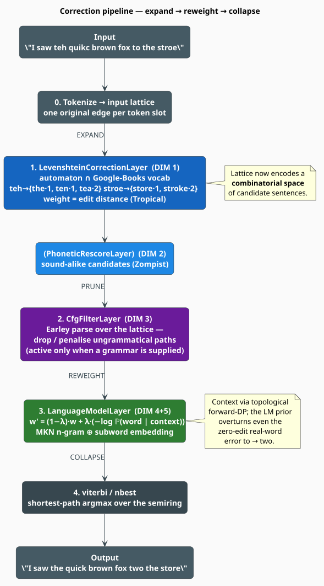

# Hierarchical Spelling & Grammar Correction

[← lling-llang integration index](./overview.md)

This document explains, end to end, how libgrammstein's Google-Books language
models plug into [lling-llang](https://github.com/f1r3fly-io/lling-llang)'s
weighted finite-state transducer (WFST) framework — together with the
[liblevenshtein](https://github.com/universal-automata/liblevenshtein-rust)
edit-distance automaton and the
[libdictenstein](https://github.com/vinary-tree/libdictenstein) dictionary
substrate — to perform **hierarchical spelling and grammar correction**.

The one-sentence thesis: correction is the **noisy-channel model** realized as a
**search for the best path through a semiring-weighted lattice**, where each
correction concern is one **independent dimension of approximate ("fuzzy")
matching**, and WFST composition fuses those dimensions into a single joint
score. The minimal system is two-dimensional (edit-distance $`\times`$
language-model); the production system is genuinely $`N`$-dimensional.

libgrammstein ships **two** correctors built on this model, and this document
covers both. The **lattice** corrector ([`HierarchicalCorrector`](#5-the-pipeline-stage-by-stage),
§5) expands a string-level lattice and rescores it with the Modified Kneser-Ney
n-gram plus a subword embedding. The **cascade** corrector
([`GrammarCorrector`](#6-a-second-corrector-the-term-id-cascade), §6) composes two
Levenshtein automata on a shared *term-id* alphabet and decodes word insertions,
deletions, and substitutions with a beam, scored by *stupid backoff* over the raw
n-gram counts; that cascade in turn ships in two interchangeable **store backends**
sharing one decoder — the in-memory single-store `GrammarCorrector` and the
`ShardedGrammarCorrector` over the Google-Books shard corpus (§6.9) — so this is still
*two* correctors, not three (the sharded form is a storage backend, not a new model).
They are complementary rather than competing — the cascade adds the
word-level edits the lattice does not attempt, while the lattice keeps the optional
grammar filter and the embedding fusion. Both are additive and opt-in behind the
`lling-llang-integration` feature; the default runtime behavior is unchanged.

> **Notation.** Mathematical *prose* uses MathJax delimited for GitHub-flavored
> Markdown: inline math is a backtick span wrapped in dollar signs, and display
> math is a fenced block whose info-string is `math`. Bare dollar delimiters are
> never used — GitHub's CommonMark pass strips backslash escapes before MathJax
> parses them. **PlantUML diagram labels** typeset their mathematics with
> `<latex>` — the bundled JLaTeXMath renders vector math into the SVG. Two
> constructs still render as literal text and therefore keep Unicode/plain
> operators: the **literate-pseudocode fences** below (they are code, not prose)
> and image **alt-text** (a plain-text fallback).

---

## Table of contents

1. [The governing equation](#1-the-governing-equation)
2. [Component & data-flow map](#2-component--data-flow-map)
3. [The dimensions](#3-the-dimensions)
4. [Why the search is N-dimensional](#4-why-the-search-is-n-dimensional)
5. [The pipeline, stage by stage](#5-the-pipeline-stage-by-stage)
6. [A second corrector: the term-id cascade](#6-a-second-corrector-the-term-id-cascade)
7. [Dependency contract](#7-dependency-contract)
8. [References](#8-references)

See also: **[dimensions.md](./dimensions.md)** (per-dimension detail),
**[dictionary-backend.md](./dictionary-backend.md)** (how the Levenshtein
automaton is fed), and **[pipeline-assembly.md](./pipeline-assembly.md)** (the
concrete `HierarchicalCorrector` API).

---

## 1. The governing equation

Given an observed, corrupted input $`x`$ (a misspelled/misgrammatical token
sequence), recover the intended clean text $`\hat{w}`$. This is Bayesian decoding —
the **noisy-channel model** ([Shannon 1948](https://doi.org/10.1002/j.1538-7305.1948.tb01338.x);
[Kernighan, Church & Gale 1990](https://doi.org/10.3115/997939.997975)):

```math
\hat{w} \;=\; \arg\max_{w} P(w \mid x)
        \;=\; \arg\max_{w} \; \underbrace{P(x \mid w)}_{\text{channel}} \cdot \underbrace{P(w)}_{\text{prior}}
```

- $`P(x \mid w)`$ — the **channel / error model**: how the surface form was
  corrupted. Realized by the **orthographic** (edit-distance) and **phonetic**
  (sound-alike) dimensions.
- $`P(w)`$ — the **language prior**: how plausible $`w`$ is as language. Realized by
  the **contextual** (n-gram), **semantic** (embedding), and **syntactic**
  (grammar) dimensions.

**Every independent factor in that product is one dimension of approximate
matching** — the precise content of "2+ dimensions."

---

## 2. Component & data-flow map

**Four crates are wired into the correction pipeline**; each contributes one or
more *dimensions*, and lling-llang is the shared WFST substrate that composes
them. A fifth crate, **duallity**, is the wider ecosystem's Levenshtein→WFST
adapter — shown for context because it realizes the alternative *cascade*
composition described below, **but libgrammstein does not depend on it** (it
appears nowhere in `Cargo.toml` or the source tree).

![Component and data-flow map: libdictenstein supplies the Dictionary substrate, liblevenshtein the edit-distance automaton (Transducer) plus Zompist phonetics, libgrammstein the Modified Kneser-Ney n-gram plus subword embeddings, and lling-llang the WFST lattice host (Lattice, semirings, the CorrectionLayer trait, and the viterbi/nbest decoders); duallity is drawn apart as the ecosystem's LevenshteinWfst adapter that libgrammstein does not depend on. Arrows show the acyclic dependency DAG and the artifacts — vocabulary, the MKN language model, the spelling layer, and the language-model layer — flowing into a correction.](../../diagrams/correction-component-map.svg)

**Figure 1.** The five crates and the artifacts that flow into a correction; the
four solid nodes are wired into the pipeline, duallity is the ecosystem adapter.
*(Rendered from `docs/diagrams/correction-component-map.puml`.)*

- **libgrammstein** — the *factory*: from the Google-Books corpora it builds the
  vocabulary, the **Modified Kneser-Ney** n-gram model, and subword embeddings.
  It also **owns** the `HierarchicalCorrector` and the generic
  `LevenshteinCorrectionLayer` (below).
- **libdictenstein** — the *dictionary substrate*: the `Dictionary` /
  `DictionaryNode` traversal traits and `PersistentVocabARTrie`.
- **liblevenshtein** — the *edit-distance engine*: a Levenshtein automaton
  (`Transducer`) that intersects a query with any `Dictionary`, plus phonetic
  (Zompist) encoders.
- **lling-llang** — the *WFST host*: `Lattice`, semirings, the `CorrectionLayer`
  **trait**, the `LanguageModelLayer` and `CfgFilterLayer` (both wired by the
  lattice corrector), the `viterbi`/`nbest`/`beam_search` decoders, and the lazy
  `compose` operator (`lling_llang::composition::compose`). lling-llang also offers
  a `PhoneticRescoreLayer`, but libgrammstein does **not** wire it in: the
  principled realization of phonetics is *fusion* into candidate generation (the
  cascade's $`T_{\text{lex}}`$, §6.3), not a downstream rescore of already-filtered candidates.
- **duallity** — the ecosystem's *WFST adapter*: `LevenshteinWfst` wraps a
  liblevenshtein automaton as an lling-llang FST so it can be `compose`-d. It is
  **not** a libgrammstein dependency, and `compose` itself is lling-llang's, not
  duallity's.

> **Attribution note.** `LevenshteinCorrectionLayer` is defined *in
> libgrammstein* (`src/integration/corrector.rs`); it *implements* lling-llang's
> `CorrectionLayer` trait rather than being an lling-llang type.

### Two composition realizations

There are two ways to fuse an edit-distance machine with an n-gram model in this
ecosystem, and it matters which one the shipped corrector uses:

1. **Layer / lattice path — what `HierarchicalCorrector` ships.** The corrector
   builds an explicit `Lattice` and applies lling-llang *layers* to it in place:
   `LevenshteinCorrectionLayer` (spelling) → optional `CfgFilterLayer` →
   `LanguageModelLayer` (rescoring), then decodes with `viterbi` / `nbest`. The
   liblevenshtein `Transducer` is driven **directly**; there is no `LevenshteinWfst`
   and no `compose` on this path.
2. **Cascade path — the classic WFST route, used for ASR-style pipelines.** Wrap
   the automaton as an FST (duallity's `LevenshteinWfst`) and lazily compose it
   with libgrammstein's exported n-gram transducer,
   $`T = \text{LevenshteinWfst} \circ \text{NgramTransducer}`$, via
   `lling_llang::composition::compose`. libgrammstein participates through its
   `NgramWfstExport` adapter (§7); duallity supplies the automaton wrapper.

This document's theory (§4) is stated in the vocabulary of path (2) because WFST
composition is the cleanest way to *see* the $`N`$-dimensional structure; the code
(§5) walks path (1) because building the lattice imperatively is what the library
actually does.

---

## 3. The dimensions

A *dimension* is an independent similarity/plausibility axis with its own metric
and engine. They are **heterogeneous** — one is a true string metric, another a
likelihood field, another a hard constraint — and a **semiring** is what unifies
them.


**Figure 2.** The $`N`$ heterogeneous dimensions and the semiring that fuses them
into one joint score. *(Rendered from `docs/diagrams/correction-dimensions.puml`.)*

| # | Dimension | Question | Engine · type |
|---|-----------|----------|---------------|
| 1 | **Orthographic** | "what real word is this a typo of?" | liblevenshtein automaton $`\cap`$ dictionary → `LevenshteinCorrectionLayer` |
| 2 | **Phonetic** | "what real word does this *sound* like?" | fused into $`T_{\text{lex}}`$ — liblevenshtein articulatory automaton (`PhoneticTransducerChar`, feature `phonetic-correction`): edit **and** phonetic cost in one query (§6.3) |
| 3 | **Syntactic** | "is this token sequence grammatical?" | lling-llang `CfgFilterLayer` (Earley-over-lattice) |
| 4 | **Contextual** | "which word fits its neighbors?" | libgrammstein n-gram, **Modified Kneser-Ney** → `LanguageModelLayer` |
| 5 | **Semantic** | "which candidate means the right thing / handles OOV?" | libgrammstein `SubwordEmbedding`, fused in `HybridLanguageModel` |

> **Realization note (Dimension 2).** Phonetics is realized the principled way —
> *fused* with Dimension 1 inside the cascade's $`T_{\text{lex}}`$ (§6.3), where a single query
> scores each candidate by edit **and** articulatory cost, so a sound-alike competes
> directly with an orthographic neighbor. lling-llang ships a `PhoneticRescoreLayer`
> and libgrammstein a standalone `PhoneticEmbedding` utility, but neither is wired
> into a shipped corrector: a downstream rescore would only re-rank the candidates
> orthographic distance already surfaced, never recovering a homophone it ranked out
> — which is why fusion, not rescoring, is the correct design.

**Definitions.**

*Semiring* — an algebraic structure $`K = (\mathbb{K}, \oplus, \otimes, \bar{0}, \bar{1})`$:
a set $`\mathbb{K}`$ of weights with an associative, commutative *sum* $`\oplus`$
(identity $`\bar{0}`$) and an associative *product* $`\otimes`$ (identity $`\bar{1}`$)
that distributes over $`\oplus`$. In this setting $`\otimes`$ **combines** the weights
of edges along one path and $`\oplus`$ **selects** among competing paths. The three
semirings this pipeline uses — Tropical $`(\min, +)`$, Log $`(\text{logsumexp}, +)`$,
and Probability $`(+, \times)`$ — are tabulated with their identities in
**[dimensions.md](./dimensions.md)**.

*Lattice* — an acyclic, weighted finite-state automaton (a directed acyclic graph)
whose nodes are token positions and whose arcs are candidate tokens carrying a
semiring weight. Each complete path from source to sink spells one candidate
correction of the whole sentence; the lattice compactly encodes the combinatorial
space of all such candidates.

*Modified Kneser-Ney (MKN)* — an n-gram smoothing estimator with order-specific
absolute discounts $`D_1, D_2, D_{3+}`$ and interpolation to lower orders via
*continuation counts* (how many distinct contexts a word completes, rather than
raw occurrences) ([Chen & Goodman 1999](https://doi.org/10.1006/csla.1999.0128)).
*Subword embedding* — word vectors composed from hashed character n-grams,
degrading gracefully for **out-of-vocabulary (OOV)** words — those absent from the
training vocabulary, which the n-gram alone cannot score
([Bojanowski et al. 2017](https://doi.org/10.1162/tacl_a_00051)).
*Levenshtein automaton* — a finite automaton whose language is exactly the
strings within edit distance $`k`$ of a query, simulated on the fly and intersected
with a dictionary ([Schulz & Mihov 2002](https://doi.org/10.1007/s10032-002-0082-8)).

Full per-dimension detail — weights, semirings, and the `HybridLanguageModel`
interpolation strategies — is in **[dimensions.md](./dimensions.md)**.

---

## 4. Why the search is N-dimensional

A **weighted finite-state transducer** is a tuple
$`T = (\Sigma, \Delta, Q, I, F, E, \lambda, \rho)`$ over a semiring $`K`$
([Mohri, Pereira & Riley 2002](https://doi.org/10.1006/csla.2001.0184)), where
$`\Sigma`$ and $`\Delta`$ are the input and output alphabets, $`Q`$ the states,
$`I \subseteq Q`$ the initial and $`F \subseteq Q`$ the final states, $`E`$ the weighted
transitions, and $`\lambda : I \to \mathbb{K}`$, $`\rho : F \to \mathbb{K}`$ the
initial- and final-weight functions.
**Composition** $`T = T_1 \circ T_2`$ builds a machine whose **states are pairs**
$`(q_1, q_2)`$ — a Cartesian product of the two state spaces. Searching it is
dynamic programming over a 2-D grid; stacking $`T_n`$ makes it an $`n`$-D grid.


**Figure 3.** Composition makes the state space a Cartesian product, so decoding
is dynamic programming over an $`n`$-dimensional grid. *(Rendered from
`docs/diagrams/correction-wfst-composition.puml`.)*

- **Path weight** $`w(p) = \bigotimes_{i} w(e_i)`$ — the semiring product of every
  dimension's contribution along the path.
- **Best correction** — the shortest path (Tropical, $`\oplus = \min,\ \otimes = +`$)
  or most-probable path (Log, $`\oplus = \text{logsumexp},\ \otimes = +`$),
  computed by the single generalized shortest-distance algorithm; `viterbi`,
  `nbest`, and `beam_search` are its specializations
  ([Viterbi 1967](https://doi.org/10.1109/TIT.1967.1054010);
  [Mohri 2009](https://doi.org/10.1007/978-3-642-01492-5_6)).
- **Tractability** — lazy composition + beam search keep the product
  $`\prod_i |T_i|`$ of dimension sizes from exploding. Global optimality does **not**
  compose from per-layer optima, which is why beam / k-best is used — a
  Pareto-frontier phenomenon.

The syntactic dimension (DIM 3) recognizes grammaticality with an **Earley parse**
— a chart parser that tests context-free-grammar membership in $`O(n^3)`$ time
([Earley 1970](https://doi.org/10.1145/362007.362035)) — run *over the lattice*
rather than over a single string.

---

## 5. The pipeline, stage by stage



**Figure 4.** The pipeline as an expand → prune → reweight → collapse sequence
over the lattice. *(Rendered from `docs/diagrams/correction-pipeline.puml`.)*

The mechanism in one line: **layer 1 expands the lattice, layers 2–3
reweight/prune it, Viterbi collapses it** — multi-dimensional dynamic
programming over a product automaton.

1. **Tokenize → input lattice.** Each token becomes one original edge
   $`i \rightarrow i{+}1`$.
2. **`LevenshteinCorrectionLayer` (DIM 1).** For every out-of-vocabulary token,
   the liblevenshtein automaton emits candidates within edit distance $`k`$, each
   added as a weighted arc. The automaton walks the **persistent vocabulary trie
   in place** — no in-RAM materialization — because the vocabulary's node handle
   descends the full depth of the trie; see
   [dictionary-backend.md](./dictionary-backend.md).
3. **`CfgFilterLayer` (DIM 3, optional).** An Earley parse over the lattice drops
   or penalizes ungrammatical paths. Active only when a grammar is supplied.
4. **`LanguageModelLayer` (DIM 4+5).** libgrammstein's `GrammsteinLanguageModel`
   rescores each arc: $`w' = (1-\lambda)\,w + \lambda\,\bigl(-\log P(\text{word} \mid \text{context})\bigr)`$,
   where the score fuses the MKN n-gram with the subword embedding.
5. **`viterbi` / `nbest`.** The joint-optimal correction is the shortest path.

The lattice pipeline carries **no** phonetic stage: Dimension 2 is realized *fused*
into candidate generation by the cascade corrector's $`T_{\text{lex}}`$ (§6.3) — the principled
alternative to a downstream sound-alike rescore, which would only re-rank the
candidates the edit automaton already surfaced.

### The algorithm, in literate form

The shipped `correct()` (in [`src/integration/corrector.rs`](../../../src/integration/corrector.rs))
is the layer/lattice realization of §2. In Knuth's literate style — a top-level
chunk refined into named sub-chunks, each with the prose that motivates it:

```
⟨Correct a sentence text⟩ ≡
    tokens ← split_whitespace(text)
    if tokens = ∅ : return ∅                     ▷ empty input ⇒ empty result
    ⟨Build the linear input lattice⟩
    ⟨Expand: apply the Levenshtein spelling layer⟩
    ⟨Prune: optionally apply the CFG filter⟩
    ⟨Reweight: apply the language-model layer⟩
    ⟨Collapse: decode the joint-optimal path(s)⟩
```

⟨**Build the linear input lattice**⟩ — one zero-cost *original* edge per token
slot ($`\bar{1}`$ is the tropical product identity, i.e. cost $`0`$):

```
⟨Build the linear input lattice⟩ ≡
    L ← empty Lattice over the Tropical semiring
    for i, tok in enumerate(tokens):
        add-edge L : i → i+1  label tok  weight 1̄  tag original
```

⟨**Expand**⟩ — the only stage that *adds* arcs; every original edge is copied
unchanged, so the lattice can only grow:

```
⟨Expand: apply the Levenshtein spelling layer⟩ ≡
    L ← spelling.apply(L)
    ▷ for each OOV token of length ≥ min_word_length, the automaton ∩ vocabulary
    ▷ emits every candidate within edit distance k as a new arc of
    ▷ weight = edit distance; the lattice now encodes a combinatorial space
    ▷ of candidate sentences.
```

⟨**Prune**⟩ — a hard/soft grammaticality filter, present only when a grammar was
attached via `with_grammar`:

```
⟨Prune: optionally apply the CFG filter⟩ ≡
    if grammar present :
        L ← CfgFilterLayer(grammar).apply(L)     ▷ Earley parse over the lattice
    else :
        leave L unchanged                        ▷ no general English CFG to default to
```

⟨**Reweight**⟩ — fold the language prior into every arc's cost (the $`\lambda`$
interpolation of §5.4):

```
⟨Reweight: apply the language-model layer⟩ ≡
    L ← language_model.apply(L)
    ▷ each arc weight w becomes w' = (1−λ)·w + λ·(−log ℙ(word | context)),
    ▷ where ℙ fuses the MKN n-gram with the subword embedding.
```

⟨**Collapse**⟩ — the generalized shortest-distance decode; `viterbi` is the
single-best specialization, `nbest` the k-best one:

```
⟨Collapse: decode the joint-optimal path(s)⟩ ≡
    if k_best ≤ 1 :
        p ← viterbi(L)
        return [ (words(p), weight(p)) ]  if p.success  else ∅
    else :
        return [ (words(p), weight(p))  for p in nbest(L, k_best) ]
```

### Minimal usage

The concrete assembly, validated end to end by
[`examples/correct_sentence.rs`](../../../examples/correct_sentence.rs):

```rust
use libgrammstein::integration::corrector::{CorrectorConfig, HierarchicalCorrector};

// `vocabulary: SharedVocabARTrie` and `model: NgramModel<D>` come from training;
// see examples/correct_sentence.rs for the full corpus/vocabulary setup.
let corrector =
    HierarchicalCorrector::from_ngram_model(vocabulary, model, CorrectorConfig::default());

let results = corrector.correct("teh quikc brwon fox");
assert_eq!(results[0].text, "the quick brown fox");
```

```sh
$ cargo run --example correct_sentence --features lling-llang-integration
input:  "teh quikc brwon fox"
output: "the quick brown fox"  (score 4.9835)
```

The full `HierarchicalCorrector` API (`CorrectorConfig`, `from_parts`,
`from_checkpoint`, `with_grammar`, n-best) is documented in
**[pipeline-assembly.md](./pipeline-assembly.md)**.

---

## 6. A second corrector: the term-id cascade

Sections 1–5 describe the **lattice** corrector (`HierarchicalCorrector`), which
expands a *string-level* lattice and rescores it. libgrammstein also ships a second,
self-contained corrector — the **`GrammarCorrector`** in
[`src/integration/grammar_corrector.rs`](../../../src/integration/grammar_corrector.rs)
— that realizes the *same* noisy-channel model (§1) as a **cascade of two
Levenshtein automata over a shared term-id alphabet**. It is the concrete,
term-id-native form of the "cascade path" sketched in §2: two edit machines are
composed and decoded jointly, but the machines are driven **directly** through
liblevenshtein's `Transducer` — there is no duallity `LevenshteinWfst` and no
lling-llang lattice or layer on this path (despite the module living behind the
`lling-llang-integration` feature). The articulatory spelling path additionally
uses the `phonetic-correction` feature. Internally, `GrammarCorrector` is now a thin
delegating newtype over a shared `GrammarCore<P>` beam decoder
(`grammar_corrector.rs:824-840`) — its public API and behavior are unchanged — and §6.9
reuses that *same* decoder over a sharded corpus by swapping only the n-gram view
source `P`.

![The T_lex ∘ T_gram cascade: an observed sentence x has each token mapped by T_lex (a character-level Levenshtein/articulatory automaton over the vocabulary) to candidate term-ids with an edit-plus-phonetic cost; T_gram is a word-level u64 Levenshtein automaton over the n-gram count store, viewed through U64NgramView; the source model is stupid backoff over the raw counts; the composition T = T_lex ∘ T_gram is decoded by a left-to-right, history-indexed beam that per token expands substitutions, deletions, and bridged insertions, models the sentence boundaries, prunes to the beam width, and returns the k-best hypotheses as the corrected sentence.](../../diagrams/correction-cascade.svg)

**Figure 5.** The $`T_{\text{lex}} \circ T_{\text{gram}}`$ cascade and its history-indexed beam decoder —
the term-id analogue of the lattice pipeline of Figure 4. *(Rendered from
`docs/diagrams/correction-cascade.puml`.)*

### 6.1 The model — a MAP decode in the log semiring

The objective is unchanged from §1 — recover $`\hat{w} = \arg\max_w P(x \mid w)\,P(w)`$
([Kernighan, Church & Gale 1990](https://doi.org/10.3115/997939.997975)) — but the
channel $`P(x \mid w)`$ is *factored* into two edit stages composed on the term-id
alphabet $`\Sigma = \{\,\text{term-id}\,\}`$, and the source $`P(w)`$ is estimated by
stupid backoff. Working in the log semiring turns the product into a sum, so the
maximum-a-posteriori (MAP) decode is a **minimum-cost** search:

```math
\hat{w} \;=\; \arg\min_{w}\;
  \underbrace{c_{\text{lex}}(x \mid w)}_{\text{spelling / phonetic}}
  \;+\; \underbrace{c_{\text{gram}}(x \mid w)}_{\text{word insert / delete}}
  \;+\; \underbrace{\lambda \cdot \bigl(-\log S(w)\bigr)}_{\text{source model}} ,
\qquad
S(w) \;=\; \prod_{i} S\!\bigl(w_i \mid w_{i-k+1}\,\dots\,w_{i-1}\bigr) .
```

**Symbols.** $`x`$ is the observed (corrupted) sentence and $`w`$ a candidate
correction; $`c_{\text{lex}}`$ and $`c_{\text{gram}}`$ are the two channel costs
(below); $`S(w)`$ is the stupid-backoff source score (§6.5); $`\lambda`$ is the
language-model mixing weight (`lm_weight`, default $`1.0`$); $`k`$ is the model
`order`. The three terms are the term-id counterparts of the lattice pipeline's
edit-distance, (absent here) grammar filter, and language-model reweighting.

### 6.2 The shared term-id alphabet

Both automata operate on **term-ids**, not characters or strings. The vocabulary
([`SharedVocabARTrie`](../../../src/ngram/vocabulary.rs)) is the bijection
`word ⟷ id`: `get_index(word) → Option<u64>` and `get_term(id) → Option<String>`,
with `FIRST_VALID_INDEX = 1` (index $`0`$ is reserved so a term-id's varint never
collides with the `\x00` metadata-key prefix). The n-gram **count store** keys each
window as the concatenated **LEB128 varints** of its term-ids (`encode_varint`), so
one stored key *is* one term-id sequence. Because $`T_{\text{lex}}`$ emits the very ids the
store is keyed by, the two stages share one alphabet with no translation layer — a
`LexCandidate`'s `id` is exactly `vocabulary.get_index(term)` (a property checked by
`lex_values_are_vocabulary_indices` in the proptest suite).

### 6.3 $`T_{\text{lex}}`$ — characters to term-ids

$`T_{\text{lex}}`$ is the **fuzzy lexicon**: for one observed token it returns ranked
in-vocabulary `LexCandidate { term, id, cost }` values. It has two interchangeable
realizations, selected by `use_phonetics` (which defaults to on iff the
`phonetic-correction` feature is compiled):

- **Articulatory path** (feature `phonetic-correction`) — a
  `PhoneticTransducerChar::with_articulatory_costs(vocabulary, nfa, k, ArticulatoryCosts::default())`
  over the vocabulary, read out by `query_values_sorted(token)`. Each candidate's
  `cost = edit_distance + phonetic_cost`, where $`\text{phonetic\_cost} \le 0`$ is a
  *sound-alike discount*: a substitution between articulatorily close graphemes
  (the `f` ↔ `ph` of `fone → phone`) costs a fraction of a full edit, so a genuine
  homophone outranks an arbitrary distance-2 neighbor.
- **Plain edit path** — a `Transducer::new(vocabulary, algorithm)` queried with
  `query_with_distance(token, max_char_edit_distance)`; each candidate's `cost` is
  its integer edit distance, and its `id` is recovered by `vocabulary.get_index`.
  The default `algorithm` is Damerau–Levenshtein (adjacent transpositions cost one
  edit; [Damerau 1964](https://doi.org/10.1145/363958.363994)), simulated on the fly
  and intersected with the trie ([Schulz & Mihov 2002](https://doi.org/10.1007/s10032-002-0082-8)).

Phonetics is therefore **fused into $`T_{\text{lex}}`$**, not applied as a downstream rescore
layer — the sound-alike discount competes with orthographic distance inside the
single candidate cost. This fusion is the principled choice, not a convenience: a
downstream rescore would only re-rank the candidates the edit automaton already
surfaced, so a genuine homophone that orthographic distance ranked past $`k`$ would
be lost before a phonetic stage ever saw it; fusing both costs into one query
generates the comprehensive candidate set and lets the homophone win outright. Two
guards keep the candidate set well behaved: a token
shorter than `min_word_length` (default $`2`$) is kept verbatim at cost $`0`$ rather
than thrashing over a dense short-string neighborhood, and a token with no
in-vocabulary neighbor falls back to *itself* with `id = 0` at `oov_penalty` (default
$`6.0`$), so the decode lattice always stays connected.

### 6.4 $`T_{\text{gram}}`$ — term-id sequences to known n-grams

$`T_{\text{gram}}`$ is the **fuzzy grammar**: the *same* Levenshtein engine, one level up.
Where $`T_{\text{lex}}`$ corrects the characters of a word, $`T_{\text{gram}}`$ corrects the words of a
sentence once each word is a term-id. `grammar_neighbors(ids, k)` runs one
`Transducer::query_units_values(ids, k)` pass and returns every stored n-gram within
word-edit distance $`k`$ as `GrammarNeighbor { ids, distance, frequency }`.

The engine can do this because the byte-keyed count store is presented as a
**`Unit = u64` dictionary** by [`U64NgramView`](../../../src/ngram/u64_view.rs): a
zero-copy adapter that collapses exactly one LEB128 varint — one term-id — per
traversal step. It is generic over the byte carrier, so the identical view rides
over both physical stores the crate uses:

| Backing store | Node `Unit` | Byte carrier |
|---|---|---|
| importer scale store `PersistentARTrie<u64>` | `u8` | raw varint byte |
| in-memory `DynamicDawgChar<…>` | `char` | Latin-1 lift (byte `0xNN` as `U+00NN`) |

`grammar_neighbors` is **sound and complete**: over arbitrary stored sets, queries,
and radii it returns *exactly* the stored sequences within distance $`k`$ — verified
differentially against a brute-force edit-distance reference in
`grammar_neighbors_are_sound_and_complete`
([`tests/grammar_corrector_proptest.rs`](../../../tests/grammar_corrector_proptest.rs)),
with each neighbor's `frequency` and `distance` checked faithful. This
soundness-and-completeness statement is for the **single-store** corrector; under
sharding the anchored `grammar_neighbors` returns only the *same-shard* subset — the
honest default the decoder relies on — while `grammar_neighbors_fanout` restores full
completeness across first-token edits (§6.9).

### 6.5 The source model — stupid backoff, *not* Kneser-Ney

The prior $`P(w)`$ is estimated by **stupid backoff**
([Brants et al. 2007](https://aclanthology.org/D07-1090/)) directly over the **raw
counts** $`f(\cdot)`$ the store holds, longest history first:

```math
S(w \mid h) \;=\;
  \begin{cases}
    \dfrac{f(h\,w)}{f(h)} & f(h\,w) > 0, \\[1.4ex]
    \alpha \cdot S\!\bigl(w \mid h'\bigr) & \text{otherwise},
  \end{cases}
  \qquad
  S(w) \;=\; \dfrac{f(w)}{N} ,
```

where $`h`$ is the history (oldest word first), $`h'`$ is $`h`$ with its **oldest**
word dropped, $`\alpha \in (0,1)`$ is the backoff weight (`backoff_alpha`, default
$`0.4`$ — the near-optimal value Brants et al. report across scales), and
$`N = \sum_v f(v)`$ is the corpus token total. A word unseen even as a unigram is
floored at $`1/(N+1)`$ so $`-\log S`$ stays finite. The source-model cost of §6.1 is
then $`-\log S(w \mid h)`$.

This choice is deliberate and worth stating plainly: **the cascade does not use
Modified Kneser-Ney.** The varint count store holds *plain occurrence counts*, and
stupid backoff is the standard estimator for web-scale count models — inexpensive,
needing no count-of-counts or continuation statistics, and approaching Kneser-Ney
quality as data grows — which is exactly the Google-Books regime. The MKN
`NgramModel` used by the lattice corrector (§4, §5) is a **separate, string-keyed
artifact**; the two correctors read different structures and must not be conflated.

### 6.6 The decode — a history-indexed beam

The store holds windows of length $`\le`$ `order`, so a whole sentence is decoded by
chaining windows with a left-to-right, history-indexed **beam** — the classic stack
decoder for the equation in §6.1. Each partial hypothesis carries its emitted words,
the parallel term-ids (its scoring / successor history), and its accumulated cost.
Per input token the beam expands three moves, mirroring the three error classes:

- **substitution / keep** — emit each $`T_{\text{lex}}`$ candidate $`w`$ of $`x_i`$ (the exact
  match is one, at cost $`0`$), paying $`c_{\text{lex}} + \lambda \cdot(-\log S(w \mid h))`$;
- **deletion** — drop $`x_i`$ for a fixed `deletion_penalty` (default $`3.0`$),
  removing an *extraneous* word;
- **insertion** — emit a word $`v`$ *without* consuming $`x_i`$, drawn from the
  **known continuations** of the history $`h`$ (the out-edges of the history node in
  the `U64NgramView`) and required to *bridge* forward to a candidate of $`x_i`$
  (i.e. $`h\,v\,c`$ is a stored n-gram), paying `insertion_penalty` (default $`3.0`$)
  $`+ \lambda\cdot(-\log S(v \mid h))`$ — adding a *missing* word only where the store
  has evidence for it.

Sentence boundaries are modeled to remove the shorter-is-cheaper length bias: the
beginning-of-sentence marker `<s>` seeds the history (so the first word is scored in
context), and the end-of-sentence marker `</s>` is scored after the last word (so a
truncated hypothesis pays for a word that rarely ends a sentence). When the store
was trained without boundaries these markers are simply absent from the vocabulary
and the step is skipped. After each token the beam is pruned to `beam_width` (default
$`16`$) by ascending cost, and `correct` finally returns the `k_best` (default $`1`$)
cheapest hypotheses. In Knuth's literate style — code fences keep Unicode operators:

```
⟨Correct a sentence x = x₁ … xₙ⟩ ≡
    tokens ← split_whitespace(x)
    if tokens = ∅ : return ∅                       ▷ empty input ⇒ empty result
    lex[i] ← T_lex(xᵢ)  for each token             ▷ per-token candidate sets, once
    beam ← { ⟨emitted:[], ids:[], cost:0⟩ }
    for xᵢ, candidates in zip(tokens, lex):
        ⟨Expand every hypothesis by one token⟩
        beam ← prune(next, beam_width)             ▷ keep the beam_width cheapest
    ⟨Score the end-of-sentence transition⟩
    return k_best(beam)
```

⟨**Expand every hypothesis by one token**⟩ — insertions are staged *before* the
token is consumed; then every staged base is either extended by a candidate or has
the token deleted. `h = effective_history(base.ids)` is the last `order − 1` emitted
ids, left-padded with `<s>`:

```
⟨Expand every hypothesis by one token⟩ ≡
    next ← ∅
    for H in beam:
        for base in ⟨bridged insertions before xᵢ⟩(H):
            h ← effective_history(base.ids)
            next ← next ∪ { base            with cost += deletion_penalty }   ▷ delete
            for w in candidates:                                             ▷ substitute / keep
                next ← next ∪ { base ⊕ w    with cost += w.cost + λ·(−log S(w│h)) }
```

⟨**bridged insertions before xᵢ**⟩ — data-driven and finite: only words the store
attests, and only where they reconnect to the observation. Repeated up to
`max_insertions_per_gap` (default $`1`$) times:

```
⟨bridged insertions before xᵢ⟩(H) ≡
    result ← { H } ; frontier ← { H }
    repeat up to max_insertions_per_gap times:
        grown ← ∅
        for cur in frontier:
            h ← effective_history(cur.ids)
            for v in known-continuations(h):                 ▷ out-edges of the history node
                if ∃ c ∈ candidates : h·v·c is a stored n-gram :   ▷ the bridge check
                    grown ← grown ∪ { cur ⊕ v
                                      with cost += insertion_penalty + λ·(−log S(v│h)) }
        result ← result ∪ grown ; frontier ← prune(grown, beam_width)
    return result
```

⟨**Score the end-of-sentence transition**⟩:

```
⟨Score the end-of-sentence transition⟩ ≡
    if </s> ∈ vocabulary :
        for H in beam : H.cost += λ·(−log S(</s>│h))    ▷ penalize truncated corrections
```

The decode's cost invariants are pinned by property tests
([`tests/grammar_corrector_proptest.rs`](../../../tests/grammar_corrector_proptest.rs)):
every returned hypothesis has a **finite, non-negative** cost (each term is
$`\ge 0`$: $`c_{\text{lex}} \ge 0`$, the edit penalties $`\ge 0`$, and $`-\log S \ge 0`$
since $`S \in (0, 1]`$), the decode is **deterministic**, and the hypotheses come
back **ranked** cheapest first.

### 6.7 Worked error taxonomy

The cascade's coverage spans the classical single-token error classes *and* the two
word-level classes the lattice corrector does not attempt. Each row names the stage
that resolves it:

| Error class | Example | Handled by |
|---|---|---|
| substitution | `teh → the` | $`T_{\text{lex}}`$ (edit) |
| transposition | `quikc → quick` | $`T_{\text{lex}}`$ (Damerau) |
| phonetic | `fone → phone` | $`T_{\text{lex}}`$ (articulatory discount) |
| missing word | `the quick fox → the quick brown fox` | $`T_{\text{gram}}`$ insertion (successor oracle) |
| extraneous word | `the the quick brown fox → the quick brown fox` | $`T_{\text{gram}}`$ deletion |
| real-word (context) | `form the list → from the list` | $`T_{\text{lex}}`$ candidate + n-gram rescore |

The first five rows are demonstrated end to end by the runnable example
([`examples/grammar_correct.rs`](../../../examples/grammar_correct.rs)), whose
console output is the ground-truth taxonomy:

```
$ cargo run --example grammar_correct --features phonetic-correction
T_lex ∘ T_gram grammar corrector
(phonetics: on)

  [substitution]
    in:  "teh quick brown fox"
    out: "the quick brown fox"  (cost 3.070)

  [transposition]
    in:  "the quikc brown fox"
    out: "the quick brown fox"  (cost 2.050)

  [missing word]
    in:  "the quick fox"
    out: "the quick brown fox"  (cost 4.070)

  [extraneous word]
    in:  "the the quick brown fox"
    out: "the quick brown fox"  (cost 4.070)

  [phonetic sound-alike]
    in:  "please answer the fone"
    out: "please answer the phone"  (cost 3.616)
```

The sixth row — a **real-word** error, where the mistyped token is itself a valid
word — is the case pure spelling correction cannot see: `form` is in the vocabulary,
so it survives as a zero-cost $`T_{\text{lex}}`$ candidate, but `from` is also a candidate (one
Damerau edit away), and the source model makes `from the list` cheaper than
`form the list` by more than that one edit. This is the same mechanism the lattice
corrector uses for `to → two`; here it falls out of the candidate set plus the
stupid-backoff rescore.

### 6.8 Which corrector to use

Both correctors are opt-in behind `lling-llang-integration`; they solve overlapping
but distinct problems.

| | `HierarchicalCorrector` (lattice, §5) | `GrammarCorrector` (cascade, §6) |
|---|---|---|
| Representation | string-level linear lattice | shared term-id alphabet, two composed automata |
| Spelling / phonetic | `LevenshteinCorrectionLayer` (orthographic edit only) | $`T_{\text{lex}}`$ (edit **and** articulatory phonetics, fused) |
| Word insert / delete | not attempted (per-slot substitution only) | $`T_{\text{gram}}`$ + beam insertion / deletion |
| Source model | MKN n-gram $`\oplus`$ subword embedding | stupid backoff over the raw counts |
| Grammar filter | optional `CfgFilterLayer` (Earley) | not on this path |
| Decoder | `viterbi` / `nbest` over the lattice | history-indexed beam (stack decoder) |
| Uses lling-llang lattice / layers | yes | no — drives liblevenshtein directly |
| Extra feature for phonetics | — | `phonetic-correction` for the articulatory $`T_{\text{lex}}`$ |

Reach for the **lattice** corrector when the correction is per-token spelling with a
rich fluency prior (MKN plus embeddings) or when a grammar filter applies; reach for
the **cascade** corrector when the errors include *missing* or *extraneous* words, or
when the natural artifact on hand is the Google-Books varint count store rather than
the string-keyed MKN model. The full `GrammarCorrector` API — `GrammarCorrectorConfig`,
`new` / `from_store`, `lex_candidates`, `grammar_neighbors`, and `correct` — and its
sharded sibling `ShardedGrammarCorrector` (§6.9), which shares the identical `GrammarCore`
decoder, are both documented in **[pipeline-assembly.md](./pipeline-assembly.md)**.

### 6.9 Scaling the cascade to a sharded corpus: `ShardedGrammarCorrector`

Everything above decodes against **one** count store. At Google-Books scale that store is
not a single trie but **many** byte-keyed persistent-trie *shards* behind a
`ShardCoordinator` (`src/sources/google_books/sharding/`). Three terms fix the vocabulary
for this subsection: a **shard** is one physical trie holding a disjoint slice of the
corpus; an n-gram's **first token** $`w_0`$ is its first word; and its **order** (the
field the router calls `key_len` — the *produced* length of the window) is its number of
term-ids. The `ShardedGrammarCorrector`
([`src/integration/sharded_grammar_corrector.rs`](../../../src/integration/sharded_grammar_corrector.rs))
scores a sentence against that sharded corpus.

It is emphatically **not a third corrector.** It runs the *same* §6 cascade decoded by the
*same* history-indexed `GrammarCore` beam as the single-store `GrammarCorrector` — both are
thin delegating newtypes over `GrammarCore<P>` (`grammar_corrector.rs:866-872`;
`sharded_grammar_corrector.rs:295-296`) — and differs *only* in **where the n-gram views
come from**. The complete design record — the one-seam refactor, the blocker B1, the five
must-fixes M1–M5, the verification, the feature gating, and the residual risks — is the
**[multi-shard grammar corrector](../multi-shard-grammar-corrector.md)** design doc; this
subsection is the reader's-eye summary of how it slots into the cascade.

![Figure 6: one n-gram lookup under sharding. An observed n-gram with first token w0 and order key_len is routed by compute_shard_key_from_token — the same pure function the importer's route_tokens used to store it, either hash(w0) mod num_shards or prefix(w0, order) — producing a ShardKey. ShardCoordinator::get_shard_readonly opens that one shard read-only, never creating, evicting, or checkpointing; when the shard file is absent it returns Ok(None), which the decoder reads as count 0 or no n-gram evidence. The resident shard's lock-free SharedARTrie of u64 is cloned via trie_arc and wrapped as a Unit-equals-u64 U64NgramView that feeds the shared GrammarCore beam. A second branch shows the empty-history successor oracle for first-position insertion at a boundary-less sentence start: the single store reads its whole-view root edges, while the sharded store fans out over every shard's root via all_shards_root_successors and de-duplicates; the two produce the same unigram set (parity), both feeding the same bridge filter and the beam's insertion arm. A legend contrasts the anchored grammar_neighbors, which walks only the query's own first-token shard, against grammar_neighbors_fanout, which walks every shard and merges neighbors by minimum distance and maximum frequency.](../../diagrams/correction-sharded-routing.svg)

**Figure 6.** One n-gram lookup under sharding: `ShardedView` routes $`(w_0, \text{order})`$
by the importer's own pure function, opens that single shard **read-only**, and views it as
a $`\text{Unit}=u64`$ n-gram trie feeding the shared `GrammarCore` beam; an absent
first-token yields `None`, read as "no n-gram evidence." The lower branch is the M5
empty-history successor fan-out: single-store whole-view roots and the sharded all-shards
fan-out yield the same unigram set (parity), keeping first-position insertion at parity.
*(Rendered from `docs/diagrams/correction-sharded-routing.puml`.)*

#### The one seam — `NgramViewSource`

The decoder never holds "the store." For every lookup it asks an `NgramViewSource` for the
$`u64`$-unit view whose *root* can walk the specific n-gram it is about to score —
`view_for(first_id, key_len) → Option<View>` — or, at an empty history, `whole_view()`; and
it asks `successors(history) → Vec<u64>` for the known continuations that drive word
insertion (`grammar_corrector.rs:276,290,306`). The single-store `SingleView` ignores the
routing arguments, returns the one whole store for both views, and inherits the default
`successors` unchanged (`grammar_corrector.rs:348-367`); `ShardedView` *routes* `view_for`
to a specific shard, returns `whole_view() = None` — because unigrams, and the roots of
every length class, are spread across *all* shards — and **overrides** `successors` so that
an empty history still fans out to every shard's root
(`sharded_grammar_corrector.rs:245-285`). Swapping `P` is the **entire** difference between
the two correctors:

```
⟨ShardedView::view_for(first_id, key_len)⟩ ≡                ▷ the one seam
    first_token ← vocabulary.get_term(first_id)             ▷ reverse-map id ⟶ routed string
    if first_token = ⊥ : return None                        ▷ id absent ⇒ no evidence
    key ← compute_shard_key_from_token(first_token, key_len, granularity)
    return open_view(key)                                   ▷ get_shard_readonly ⟶ U64NgramView
```

#### Co-location — the load-bearing correctness property

Routing is a **pure function of** $`(w_0, \text{order})`$ — no global state, no shard
contents — so the shard that *stored* a key is exactly the shard that *answers* a query for
it. The importer stores an n-gram via
`route_tokens(tokens) = compute_shard_key_from_token(tokens[0], tokens.len(), granularity)`
(`coordinator/routing.rs:34-38`); the decoder resolves a lookup via
`view_for = compute_shard_key_from_token(get_term(first_id), key_len, granularity)`
(`sharded_grammar_corrector.rs:245-256`) — the *identical* function (`routing.rs:363`) on
the *identical* inputs. One subtlety carries the whole property: the router keys on the
**produced** length, not the history length. The successor oracle scores $`h \cdot v`$ of
length $`\lvert h \rvert + 1`$, so `view_for` is asked for $`\lvert h \rvert + 1`$ —
matching the importer, which stored that window under `order = |tokens|`
(`grammar_corrector.rs:306-318`). Figure 6 traces this single lookup; the
**[multi-shard grammar corrector](../multi-shard-grammar-corrector.md)** design doc §3
proves the co-location argument in full.

#### Read-only query mode — writes are unreachable

A query must never mutate the corpus. `ShardedView` opens shards through
`ShardCoordinator::get_shard_readonly` (`coordinator/mod.rs:738`), which is **open-only**:
it returns a resident shard or opens an existing file, but never *creates* a shard, never
*evicts* one (so it never reaches the eviction-path `checkpoint()` write), and never arms
overlay eviction. A shard file that does not exist returns `Ok(None)` rather than an error
(`coordinator/mod.rs:764-766`). Three properties follow:

- **Write-unreachability.** With `max_open_shards = 0` there is no residency cap and hence
  no eviction, so the only path that writes during a read — the eviction checkpoint — is
  statically unreachable. Over a **cleanly-finalized corpus** the whole query is then
  write-free while readers are active; the one remaining on-open write, WAL replay for
  crash recovery, is a no-op there (finalize before querying — see the deployment contract
  below).
- **All-resident residency.** Each correction score touches up to `order` distinct
  first-token shards and never evicts, so a *bounded* cap would only accumulate shards
  without reclaiming them; query mode is therefore all-resident, and the constructor logs a
  warning if it is handed a positive `max_open_shards`
  (`sharded_grammar_corrector.rs:316-324`).
- **Absent first-token ⇒ no evidence.** An out-of-corpus $`w_0`$ routes to a shard that was
  never populated; `view_for` returns `None`, which the decoder reads as count $`0`$ / no
  neighbors — exactly the right answer.

Because a shard's byte trie is a lock-free `Arc` (`SharedARTrie<u64>`) whose reads are
`&self`, `ShardedView` clones the `Arc` out of the brief coordinator read-guard
(`trie_arc()`, `shard.rs:663`) and wraps it in a `U64NgramView` that *outlives* the guard
(`sharded_grammar_corrector.rs:147-150`) — so the transducer walks the shard without
holding any lock. The **[multi-shard grammar corrector](../multi-shard-grammar-corrector.md)**
design doc §7–§8 (must-fixes M2 / M3) carry the write-unreachability and residency
arguments.

#### The corpus total N is injected, not derived

The stupid-backoff base normalizer $`N = \sum_v f(v)`$ (§6.5) is supplied to
`ShardedGrammarCorrector::new` at construction (`sharded_grammar_corrector.rs:309-329`). A
sharded corpus persists *no* single token total, and its unigrams span every shard, so —
unlike the single-store `from_store`, which derives $`N`$ by summing the store's depth-1
unigram edges — a sharded corrector cannot recover $`N`$ from any one view; the importer,
which already accumulates it, passes it in.

#### Neighbor completeness — anchored vs. fanout (M4)

§6.4's `grammar_neighbors` is sound and complete over *one* store. Under sharding a
**first-token edit** (correcting $`w_0`$ itself) lands in a *different* shard — hash-modulo
routing ($`\mathrm{hash}(w_0) \bmod n_{\text{shards}}`$, for $`n_{\text{shards}}`$ the
shard count) destroys prefix locality — so the anchored `grammar_neighbors`, which walks
only the query's own first-token shard, structurally cannot see it
(`sharded_grammar_corrector.rs:359-366`). That is precisely the set the decoder relies on
(its successor oracle consults co-located continuations for a **non-empty** history; at an
empty history it fans out over all shards instead — see the next subsection), so it is the
honest **default**. For the batch / offline case that needs every neighbor, the opt-in
`grammar_neighbors_fanout` walks **every** shard and merges by term-id sequence — keeping
the minimum distance and maximum frequency — restoring the single-store soundness +
completeness contract (`sharded_grammar_corrector.rs:376-386,158-202`). Writing $`\text{stored}`$
for the corpus of stored n-gram term-id sequences, $`q`$ for the query sequence, $`k`$ for
the word-edit radius, $`d`$ for word-level Damerau–Levenshtein distance, and
$`\mathrm{shard}(\cdot)`$ for the routing function, the two neighbor sets are:

```math
\underbrace{\{\, s \in \text{stored} : d(s, q) \le k \,\wedge\, \mathrm{shard}(s) = \mathrm{shard}(q) \,\}}_{\text{anchored (same shard) — the default}}
\qquad
\underbrace{\{\, s \in \text{stored} : d(s, q) \le k \,\}}_{\text{fanout (all shards, merged)}}
```

Both are pinned differentially against a brute-force reference in
[`tests/sharded_grammar_corrector_proptest.rs`](../../../tests/sharded_grammar_corrector_proptest.rs):
fanout equals the single-store neighbor set, and anchored equals its same-shard subset.

#### First-position insertion — the empty-history fan-out (M5)

One completeness property is specific to the *successor oracle*, not the neighbor query. The
beam can insert a word **before** the first observed token — a first-position insertion,
reached only at an *empty* history, which in turn is reached only when the corpus models no
sentence boundary (`bos_id = None`, the Google-Books reality). There the oracle needs every
stored first-token. The single store reads them from `whole_view().root().edges()`; the
sharded store has no whole view (`whole_view() = None`), so a naïve sharded oracle would find
*nothing* and silently drop first-position insertion. The fix routes the oracle through a
third seam method, `successors(history)` (`grammar_corrector.rs:306-318`, called at
`grammar_corrector.rs:782`): its default is the old `view_for` / `whole_view` path — so
`SingleView` is unchanged — while `ShardedView` overrides the empty-history case with a
read-only **all-shards root fan-out** (open every shard, union its root edge ids, de-dup)
that returns *exactly* the single store's whole-view root set
(`sharded_grammar_corrector.rs:268-285,217-238`). Writing $`\varepsilon`$ for the empty
history and $`\mathrm{RootEdges}(\cdot)`$ for a trie root's out-edge term-ids:

```math
\texttt{successors}_{\text{sharded}}(\varepsilon)
\;=\;
\bigcup_{s \,\in\, \text{shards}} \mathrm{RootEdges}(s)
\;=\;
\texttt{successors}_{\text{single}}(\varepsilon),
```

because co-location (above) **partitions** the corpus, so every stored first-token lives in
exactly one shard's root and the per-shard roots' disjoint union is the whole-store root.
This is **parity, not a gate**: first-position insertion is *already* $`O(\lvert V\rvert)`$
on the single store (enumerate every unigram, bridge-check each), and the fan-out is the same
$`O(\lvert V\rvert)`$ edge walk, fired **at most once per `correct()`** and only for a
boundary-less corpus. A view-level differential test,
`sharded_successors_match_single_store_empty_and_nonempty_history`, pins the equality (and
fails without the fix). The genuinely faster direction for **both** backends is a reverse
(predecessor) index, turning the enumeration into an $`O(\lvert\text{predecessors}\rvert)`$
lookup — honest future work recorded in the design doc, not a defect in this parity fix.

#### Deployment contract

Two preconditions must hold when a `ShardedGrammarCorrector` is pointed at a corpus:

- **Same `ShardConfig`, same CPU count as at import.** With the default `CpuProportional`
  granularity, `num_shards` is derived from `available_parallelism()`
  (`config.rs:113,132`), so co-location holds only when import and query agree on the shard
  count and granularity — importing on an $`N`$-CPU host and querying on an $`M`$-CPU host
  (with $`N \ne M`$) routes to the wrong shard and silently misses counts.
- **Serve a cleanly-finalized corpus.** Opening a shard replays its write-ahead log for
  crash recovery, which is a no-op *only* on a finalized corpus; against an unfinalized one
  the "read-only" open would replay (a write). Finalize before querying.

Both are recorded as residual risks in the
**[multi-shard grammar corrector](../multi-shard-grammar-corrector.md)** design doc §13.

#### Feature gating

`ShardedGrammarCorrector` requires **both** the `lling-llang-integration` feature (which
gates the whole `integration` module, `src/lib.rs:73`) **and** the `google-books` feature
(which gates the sharded submodule and its re-export, `src/integration/mod.rs:56-57,72-73`),
because it needs the shard coordinator that only `google-books` compiles. Its property /
differential suite runs under both:

```sh
cargo test --features "lling-llang-integration google-books" \
    --test sharded_grammar_corrector_proptest
```

---

## 7. Dependency contract

The dependency graph is **one-directional and acyclic**:

![Dependency contract as a colored DAG: libgrammstein depends mandatorily on liblevenshtein and libdictenstein and optionally (feature lling-llang-integration) on lling-llang; lling-llang depends optionally on liblevenshtein and libdictenstein; duallity depends on liblevenshtein and lling-llang but is drawn detached as an ecosystem crate that libgrammstein does not depend on. Two annotation edges show libgrammstein implementing lling-llang's LanguageModel trait and exporting an NgramTransducerBuilder that produces an lling-llang NgramTransducer.](../../diagrams/correction-dependency-contract.svg)

**Figure 7.** The acyclic dependency contract; dashed edges are feature-gated,
and duallity is detached because libgrammstein does not depend on it. *(Rendered
from `docs/diagrams/correction-dependency-contract.puml`.)*

lling-llang has **no** libgrammstein dependency. libgrammstein feeds the LM
dimensions to lling-llang two ways:

- **(a) the string-typed `LanguageModel` trait** (`score_sequence`,
  `score_continuation`) — defined in lling-llang
  (`src/layers/rescoring/lm_rerank.rs`), *implemented* in libgrammstein by
  `GrammsteinLanguageModel`, and consumed by `LanguageModelLayer`; and
- **(b) the `NgramWfstExport` adapter** — an extension trait
  (`to_ngram_transducer::<W>()`, backed by `NgramTransducerBuilder`) in
  [`src/integration/wfst_export.rs`](../../../src/integration/wfst_export.rs) that
  **produces an lling-llang `NgramTransducer<W>`** (with backoff
  $`\varepsilon`$-arcs — the transitions that fall back to a lower-order model when
  a higher-order context is unseen) for the ASR-style *cascade* composition of §2.

Note that **Modified Kneser-Ney lives in libgrammstein**
(`src/ngram/smoothing/kneser_ney.rs`); lling-llang's own `asr/ngram.rs` uses Katz
backoff — a different estimator. And note that duallity, though it depends on
liblevenshtein and lling-llang, is **not** on any path *from* libgrammstein: the
shipped corrector reaches the same fusion through layers, not through duallity's
`LevenshteinWfst`.

---

## 8. References

- Shannon, C. E. (1948). *A Mathematical Theory of Communication.* Bell System
  Technical Journal. DOI: [10.1002/j.1538-7305.1948.tb01338.x](https://doi.org/10.1002/j.1538-7305.1948.tb01338.x)
- Kernighan, Church & Gale (1990). *A Spelling Correction Program Based on a
  Noisy Channel Model.* COLING. DOI: [10.3115/997939.997975](https://doi.org/10.3115/997939.997975)
- Damerau, F. J. (1964). *A Technique for Computer Detection and Correction of
  Spelling Errors.* Communications of the ACM, 7(3), 171–176.
  DOI: [10.1145/363958.363994](https://doi.org/10.1145/363958.363994)
- Brants, Popat, Xu, Och & Dean (2007). *Large Language Models in Machine
  Translation.* EMNLP-CoNLL, 858–867. ACL Anthology:
  [D07-1090](https://aclanthology.org/D07-1090/) *(introduces stupid backoff)*
- Viterbi, A. J. (1967). *Error Bounds for Convolutional Codes and an
  Asymptotically Optimum Decoding Algorithm.* IEEE Transactions on Information
  Theory. DOI: [10.1109/TIT.1967.1054010](https://doi.org/10.1109/TIT.1967.1054010)
- Earley, J. (1970). *An Efficient Context-Free Parsing Algorithm.* Communications
  of the ACM. DOI: [10.1145/362007.362035](https://doi.org/10.1145/362007.362035)
- Schulz, K. & Mihov, S. (2002). *Fast String Correction with Levenshtein
  Automata.* IJDAR. DOI: [10.1007/s10032-002-0082-8](https://doi.org/10.1007/s10032-002-0082-8)
- Mohri, Pereira & Riley (2002). *Weighted Finite-State Transducers in Speech
  Recognition.* Computer Speech & Language. DOI: [10.1006/csla.2001.0184](https://doi.org/10.1006/csla.2001.0184)
- Mohri, M. (2009). *Weighted Automata Algorithms.* In *Handbook of Weighted
  Automata*, Springer. DOI: [10.1007/978-3-642-01492-5_6](https://doi.org/10.1007/978-3-642-01492-5_6)
- Kneser, R. & Ney, H. (1995). *Improved Backing-off for M-gram Language
  Modeling.* ICASSP. DOI: [10.1109/ICASSP.1995.479394](https://doi.org/10.1109/ICASSP.1995.479394)
- Chen, S. & Goodman, J. (1999). *An Empirical Study of Smoothing Techniques for
  Language Modeling.* Computer Speech & Language. DOI: [10.1006/csla.1999.0128](https://doi.org/10.1006/csla.1999.0128)
- Bojanowski et al. (2017). *Enriching Word Vectors with Subword Information.*
  TACL. DOI: [10.1162/tacl_a_00051](https://doi.org/10.1162/tacl_a_00051)
