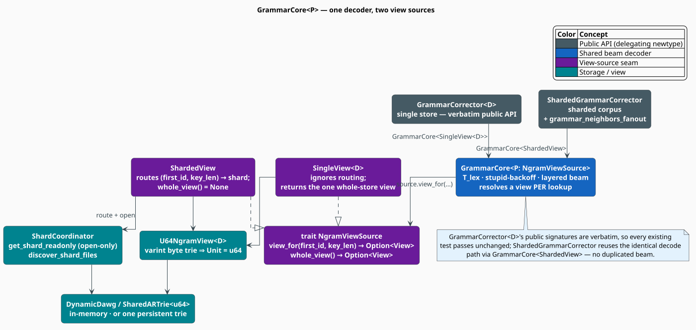
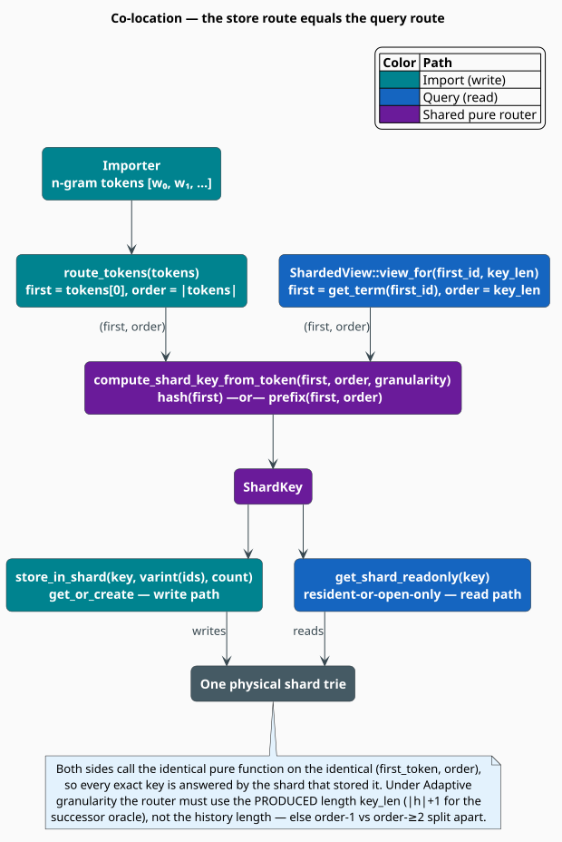
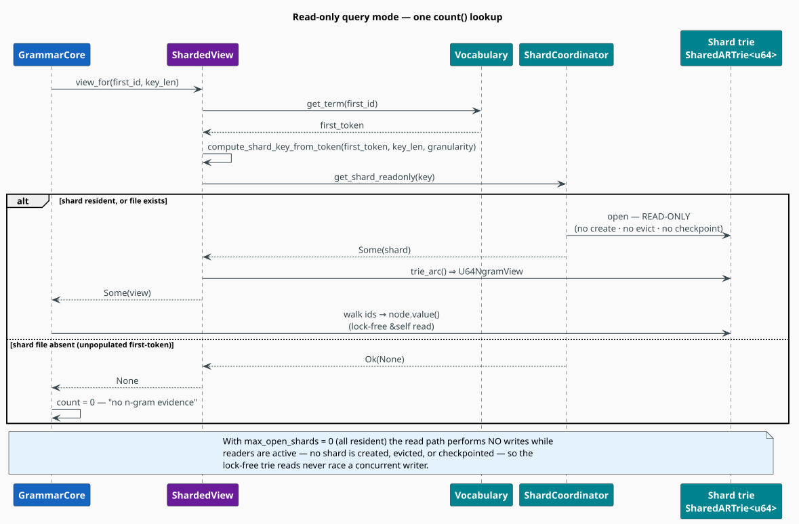

# Multi-shard grammar corrector

This document is the design record for running the $`T_{\text{lex}} \circ T_{\text{gram}}`$ grammar corrector
(`src/integration/grammar_corrector.rs`) over the **sharded** Google-Books n-gram
corpus. It captures the one-seam refactor, the blocker and four must-fixes a design
review surfaced (plus a fifth completeness gap found in a later pass), and how each is
resolved — enough to reconstruct the design from scratch.

**See also:** the reader's-eye summary in
[lling-llang/hierarchical-correction.md](lling-llang/hierarchical-correction.md) §6.9, and
the façade's API surface in
[lling-llang/pipeline-assembly.md](lling-llang/pipeline-assembly.md).

## 1. Motivation

The single-store [`GrammarCorrector<D>`](grammar_corrector.rs) decodes a sentence by a
layered noisy-channel beam over a term-id alphabet: $`T_{\text{lex}}`$ corrects a token's
*characters* to vocabulary term-ids, $`T_{\text{gram}}`$ corrects a sentence's *words* against the
known n-grams (via the carrier-generic [`U64NgramView`](../../src/ngram/u64_view.rs)),
and a *stupid-backoff* source score (Brants et al., 2007) ranks hypotheses. See
[`grammar_corrector.rs`](../../src/integration/grammar_corrector.rs) for the model.

At Google-Books scale the n-gram count store is not a single trie but **many byte-keyed
persistent-trie shards** managed by a `ShardCoordinator`
(`src/sources/google_books/sharding/`). The corrector must score against that sharded
store without duplicating the decoder and without losing the soundness guarantees the
single-store path enjoys.

A review of the first cut found the algorithmic core sound but flagged **one blocker
(B1) and four must-fixes (M1–M4)**; a later completeness pass surfaced a fifth
(**M5**) — an empty-history successor gap that silently left first-position insertion
unavailable on the sharded path:

| # | Finding | Resolution (this design) |
|---|---------|--------------------------|
| **B1** | The byte shard trie `Arc<PersistentARTrie<u64>>` (`SharedARTrie<u64>`) is `Clone` but not a `MappedDictionary`; the bare trie is a `MappedDictionary` but not `Clone`. Neither type satisfies the corrector bound `MappedDictionary<Value = u64> + Clone`. | Add `Dictionary` + `MappedDictionary` for `SharedARTrie<V>` in **libdictenstein** (§4). |
| **M1** | The view trait's node constraints were a comment, not real bounds. | Pin them as associated-type bounds on `NgramViewSource` (§5). |
| **M2** | A lazy shard open can evict another shard and call `checkpoint()` — a write — mid-query; "checkpoint-when-clean is a no-op" is false. | `max_open_shards = 0` + an open-only `get_shard_readonly` (§7). |
| **M3** | `correct()` touches up to `order` first-token shards per score, which can thrash a bounded LRU. | Query mode is all-resident (`max_open_shards = 0`) and never evicts (§8). |
| **M4** | A single-shard-anchored `grammar_neighbors` silently drops first-token-edit neighbors, breaking soundness + completeness. | Narrow the anchored contract + add opt-in `grammar_neighbors_fanout` (§9.1). |
| **M5** | `ShardedView::whole_view()` is `None`, so at an EMPTY history (a boundary-less sentence start, `bos_id = None`) the successor oracle could not enumerate the stored first-tokens — the sharded decoder could not insert a word *before* the first token. | Add a `successors` seam method whose `ShardedView` override fans out over every shard's root at an empty history, at parity with the single store (§9.2). |

## 2. The one seam

The refactor introduces a single abstraction — a per-operation **view source** — and
extracts the entire decoder into `GrammarCore<P: NgramViewSource>`. Both the single-store
`GrammarCorrector<D>` and the new `ShardedGrammarCorrector` are thin delegating newtypes
over `GrammarCore`, so they share the identical decode path.



The decoder never holds "the store". For each lookup it asks its source for the
`u64`-unit view whose **root can walk the specific n-gram it is about to score**:

```rust
pub trait NgramViewSource: Clone + Send + Sync + 'static {
    type Node: MappedDictionaryNode<Value = u64> + DictionaryNode<Unit = u64>;
    type View: Dictionary<Node = Self::Node>
        + MappedDictionary<Value = u64>
        + Clone + Send + Sync + 'static;

    /// A view whose ROOT walks any stored `key_len`-gram beginning with `first_id`.
    fn view_for(&self, first_id: u64, key_len: usize) -> Option<Self::View>;
    /// A view rooted at the WHOLE store, if the source can provide one.
    fn whole_view(&self) -> Option<Self::View>;
    /// The successor term-ids of `history` (its known continuations); at an EMPTY
    /// history, every stored first-token. Defaulted via `view_for` / `whole_view`;
    /// `ShardedView` overrides only the empty-history case with an all-shards fan-out.
    fn successors(&self, history: &[u64]) -> Vec<u64>;
}
```

- **`SingleView<D>`** wraps one whole count store; `view_for` ignores its arguments and
  returns the one `U64NgramView<D>`, and it inherits the default `successors` unchanged.
  Behavior is identical to the pre-sharding corrector.
- **`ShardedView`** routes `(first_id, key_len)` to a shard and returns a read-only view
  of it (§6). `whole_view()` is `None`: unigrams — and the roots of every length class —
  are spread across all shards, so no single view is the whole store. It **overrides**
  `successors` so that an empty history still enumerates every stored first-token, by
  fanning out over all shards' roots (§9.2).

For the single-store path, `whole_view()` backs both whole-store operations the decoder
can reach: the default `successors` at an *empty* history (an insertion before the first
token, reachable only without a boundary model) and an empty-sequence neighbor query. The
sharded path keeps the first at parity by *overriding* `successors` with an all-shards
root fan-out (§9.2), so its `whole_view() = None` now disables only the second — the
degenerate empty-sequence neighbor query — while first-position insertion is preserved.

**The seam rule.** Because different lookups in one score can hit different shards, every
store touch derives `(first_id = seq[0], key_len = seq.len())` from the sequence it is
about to look up and calls `source.view_for(...)`: `count`, the stupid-backoff numerator
and denominator (which route *independently* — they may live in different shards under an
order-sensitive granularity), the successor oracle, and `grammar_neighbors`.

## 3. Co-location — why routing is sound



Routing is a **pure function** of `(first_token, order)`:
[`compute_shard_key_from_token`](../../src/sources/google_books/sharding/routing.rs). The
importer stores an n-gram via `route_tokens(tokens)`
(`compute_shard_key_from_token(tokens[0], tokens.len(), granularity)`); the query resolves
a view via `view_for(first_id, key_len)`
(`compute_shard_key_from_token(get_term(first_id), key_len, granularity)`). Same function,
same inputs — so the shard that *stores* an exact key is the shard that *answers* it.

> **The Adaptive caveat.** Under `Adaptive` granularity, order-1 and order-≥2 n-grams
> split across shards. The successor oracle must therefore fetch the view for the
> **produced** length $`\lvert h\rvert + 1`$ (the length of $`h\cdot v`$), then
> walk to the $`\lvert h\rvert`$-depth node and read its edges — *not* the view for
> $`\lvert h\rvert`$. Fetching at the history length would land the history node in
> the wrong (unigram-vs-bigram) shard. The bridge check likewise routes by its own
> produced length.

## 4. B1 — the byte shard trie as a `MappedDictionary`

The corrector bound needs `MappedDictionary<Value = u64> + Clone` on **one** type. On the
byte side those two properties lived on two different types:

| Byte type | `Clone`? | `Dictionary` / `MappedDictionary`? |
|-----------|:--------:|:----------------------------------:|
| bare `PersistentARTrie<u64>` | ✗ (owns WAL / mmap / arena / atomics) | ✓ (`dictionary_traits.rs`) |
| `Arc<PersistentARTrie<u64>>` (`SharedARTrie<u64>`) | ✓ | ✗ — only `ARTrie` / `EvictableARTrie` |

The char/vocab side has no such gap: `SharedVocabARTrie = Arc<PersistentVocabARTrie>`
carries the full `Dictionary` family *on the `Arc` alias* (libdictenstein
`vocab/mod.rs`), with the load-bearing comment *"the impl lives on the `Arc` handle, whose
`Clone` satisfies the bound."* B1 is therefore a **missing-impl gap**, closed by adding
the analogous two delegating impls in **libdictenstein**
(`src/persistent_artrie/shared_trait_impl.rs`):

```rust
impl<V: DictionaryValue> Dictionary for SharedARTrie<V> {
    type Node = PersistentARTrieNode<V>;
    fn root(&self) -> Self::Node { self.read().root() }
    fn contains(&self, t: &str) -> bool { self.read().contains(t) }
    fn len(&self) -> Option<usize> { self.read().len() }
    fn sync_strategy(&self) -> SyncStrategy { self.read().sync_strategy() } // InternalSync
}
impl<V: DictionaryValue> MappedDictionary for SharedARTrie<V> {
    type Value = V;
    fn get_value(&self, t: &str) -> Option<V> { self.read().get_value(t) }
}
```

`.read()` is the no-lock `SharedTrieAccess` shim (the F4 lock collapse) that derefs to
`&PersistentARTrie`; `root()`/`get_value()` return owned values, so nothing borrows the
transient guard. Overriding `sync_strategy` is load-bearing: the bare trie reports
`InternalSync`; the trait default is `ExternalSync`, which would silently change the
transducer's synchronization contract.

**The resolution chain** this unblocks:

```math
\texttt{SharedARTrie<u64>} : \texttt{MappedDictionary<Value=u64>} + \texttt{Clone}
\;\Longrightarrow\;
\texttt{U64NgramView<SharedARTrie<u64>>} : \texttt{MappedDictionary<Value=u64>} + \texttt{Clone}
```

with node $`\texttt{Unit}=\texttt{u64}`$, $`\texttt{Value}=\texttt{u64}`$ — the
byte overlay node already projects `Unit = u8` (a `VarintByteUnit`) and `Value = u64`, so
no new node machinery is needed (that is M1).

## 5. M1 — real node-projection bounds

The projections the word-level Levenshtein engine requires are pinned as associated-type
bounds on `NgramViewSource` (§2): `Node: MappedDictionaryNode<Value = u64> +
DictionaryNode<Unit = u64>` and `View: Dictionary<Node = Self::Node>`. Because they live
on the trait, `GrammarCore<P>` needs no repeated `where` clauses, and both `SingleView`
and `ShardedView` satisfy them structurally (`View = U64NgramView<…>`,
`Node = U64NgramNode<…>`, `Unit = u64`, `Value = u64`).

## 6. `ShardedView`

```rust
fn view_for(&self, first_id: u64, key_len: usize) -> Option<U64NgramView<SharedARTrie<u64>>> {
    let first_token = self.vocabulary.get_term(first_id)?;                 // reverse map
    let key = compute_shard_key_from_token(&first_token, key_len as u8,    // same router
                                           &self.coordinator.config().granularity);
    let shard = self.coordinator.get_shard_readonly(&key).ok().flatten()?; // open-only
    Some(U64NgramView::new(shard.read().trie_arc()))                       // lock-free Arc
}
```

`ShardHandle::trie_arc()` clones the shard's `Arc`-shared byte trie; its reads are `&self`
and lock-free (the collapsed `Arc<PersistentARTrie>` has no inner `RwLock`), so the
returned view outlives the brief `RwLock<ShardHandle>` read guard.

## 7. M2 — a provably read-only query mode



The review's proposed fix — "verify `checkpoint()`-when-clean is a no-op" — rests on a
**false premise**. `ShardHandle::checkpoint()` unconditionally upserts checkpoint
sentinels (`save_checkpoint_state`), and `PersistentARTrie::checkpoint()` always writes a
header, a WAL `Checkpoint` record, and an `fsync`, even when clean; only
`flush_sequential` short-circuits. So a clean checkpoint *does* write.

The correct argument is **unreachability**, in two parts:

1. **Disarm eviction.** `max_open_shards = 0` ⟹ the coordinator's `lru_tracker` is
   `None` ⟹ `maybe_evict_shard` early-returns ⟹ the eviction-path `checkpoint()` write is
   unreachable. Overlay eviction is also inert (the default `overlay_budget_bytes = None`
   makes `arm_eviction` a no-op, and it fires only during a checkpoint, which never runs).

2. **Open-only reads.** A subtler hole: `view_for → get_or_create_shard` would **create**
   an empty shard file when a query's first-token routes to a never-populated shard
   (reachable for prefix granularities; only statistically absent for hash routing). A
   read path must not depend on corpus statistics for write-freedom. So `ShardedView` uses
   a dedicated `ShardCoordinator::get_shard_readonly`
   (`src/sources/google_books/sharding/coordinator/mod.rs`): resident-or-**open-only**,
   never `create`, never `arm_eviction`, never `maybe_evict_shard`; `Ok(None)` for an
   absent shard, which the decoder reads as "no n-gram evidence" (count `0`).

With both parts, in query mode there is no importer thread and `view_for` performs no
trie mutation and no file creation, so **no writer transition is concurrent with the
lock-free reads** — the "no TLA+ transition / no concurrent writer" claim is honest.
`ShardHandle` has no `Drop`; the only teardown write is `PersistentARTrie::Drop → close()`
at coordinator teardown, which is not concurrent with any reader.

This write-freedom is stated **over a checkpoint-finalized corpus**. The eviction and
file-creation writes are unreachable as argued above; the one remaining on-open write is
WAL replay for crash recovery, which is a no-op *only* on a cleanly-finalized corpus
(§13, risk 2). So "read-only" means: serve queries against a finalized corpus, and the
query path performs no writes.

**Required query configuration:** `max_open_shards = 0` **and** `overlay_budget_bytes =
None` **and** the open-only `view_for`.

## 8. M3 — residency

An n-gram order $`\le 5`$ means one `correct()` score touches at most ~5 distinct
first-token shards. Under the default `CpuProportional` granularity
$`\text{num\_shards} = \max(2C, 8)`$ which is $`\le`$ the historical default cap
of 32, so hash routing does not thrash; prefix granularities (676 shards) with a small cap
would. Query mode sidesteps the question entirely: `max_open_shards = 0` keeps every
touched shard resident and never evicts, so residency is all-resident by construction. The
constructor warns if a positive `max_open_shards` is configured.

## 9. M4 & M5 — completeness under sharding

Sharding threatens two of the single-store cascade's completeness properties, each
restored below: neighbor recall under a **first-token edit** (M4, the anchored/fanout
split) and the **empty-history successor set** at a boundary-less sentence start (M5, the
all-shards root fan-out).

### 9.1 M4 — anchored vs. fanout neighbors

Under sharding a **first-token edit** lands in a *different* shard, and hash routing
destroys prefix locality, so a query anchored to its own first-token's shard cannot see
first-token-edit neighbors. Rather than pretend otherwise, the sharded corrector exposes
two surfaces:

- **`grammar_neighbors` (anchored)** — walks the single shard of the query's own
  `(first-token, length)`. It returns exactly
  $`\{\,s \in \text{stored} : d(s,q) \le k \wedge \mathrm{shard}(s) = \mathrm{shard}(q)\,\}`$.
  This is *precisely*
  what the decoder relies on — the successor oracle consults co-located continuations for a
  **non-empty** history (its common case); at an empty history it fans out over every shard
  instead (§9.2) — so it is the honest default and imposes no cost on the hot path.
- **`grammar_neighbors_fanout` (opt-in)** — walks **every** shard
  (`discover_shard_files`), runs the word-level Levenshtein query against each, and merges
  by term-id sequence (min distance, max frequency). It restores the full single-store
  soundness + completeness contract $`\{\,s \in \text{stored} : d(s,q) \le k\,\}`$,
  including first-token-edit neighbors. It is a batch / offline operation.

`d(\cdot,\cdot)` is standard word-level Levenshtein distance (unit-cost insert / delete /
substitute).

### 9.2 M5 — empty-history successor parity (first-position insertion)

**The gap.** The layered beam can insert a word *before* consuming the next observed
token by asking the successor oracle for the known continuations of the current history
(the insertion arm, `grammar_corrector.rs:753-838`). At the very start of a
**boundary-less** sentence — the Google-Books reality, where the corpus carries no
`<s>` / `</s>` so `bos_id = None` — that history is *empty*, and the oracle needs every
stored first-token (every unigram). The single store answers from
`whole_view().root().edges()`. The sharded store cannot: `ShardedView::whole_view()`
returns `None` (unigrams span every shard — §2), so before this fix the empty-history
oracle returned nothing and the sharded decoder could **not** insert a first word.
First-position insertion silently worked on the single store and silently did not on the
sharded one — a completeness gap, not a modeling choice.

**The seam.** The oracle no longer reaches for `whole_view()` directly; it asks the view
source for `successors(history) → Vec<u64>` — every `v` such that `history · v` is a stored
path (`grammar_corrector.rs:306-318`, called from the insertion arm at
`grammar_corrector.rs:782`). The **default** implementation is bit-identical to the old
oracle path: it routes a non-empty history by `(history[0], |history|+1)` (the *produced*
length — the Adaptive caveat of §3) and an empty history through `whole_view()`, then walks
to the `history` node and collects its edge ids. `SingleView` therefore inherits it
unchanged (no override). `ShardedView` **overrides** it
(`sharded_grammar_corrector.rs:268-285`): a non-empty history takes the same anchored
`view_for` path; an **empty** history calls the private `all_shards_root_successors`
(`sharded_grammar_corrector.rs:217-238`), a read-only fan-out that opens **every** shard
(`discover_shard_files` + `get_shard_readonly`, via the shared `open_view`), unions their
root edge ids, and de-duplicates (a first-token can root several length classes that, under
`Adaptive` granularity, live in different shards). `whole_view()` now serves only the
degenerate empty-sequence `grammar_neighbors` query.

**Completeness (set equality).** The fan-out returns *exactly* the unigram set the single
store enumerates from its whole view. Writing $`\varepsilon`$ for the empty history
and $`\mathrm{RootEdges}(\cdot)`$ for the set of term-ids on a trie root's
out-edges:

```math
\texttt{successors}_{\text{sharded}}(\varepsilon)
\;=\;
\bigcup_{s \,\in\, \text{shards}} \mathrm{RootEdges}(s)
\;=\;
\mathrm{RootEdges}(\text{whole store})
\;=\;
\texttt{successors}_{\text{single}}(\varepsilon) .
```

The middle equality is the payoff of co-location (§3): sharding **partitions** the stored
n-grams, so every stored first-token lives in exactly one shard's root; the union of the
per-shard root edge sets is therefore the whole-store root edge set, and the `HashSet`
de-dup only collapses a first-token id reached through several length-class shards. This is
a **parity** property, verified *directly at the view level* — not merely through decoder
output — by `sharded_successors_match_single_store_empty_and_nonempty_history`
(`tests/sharded_grammar_corrector_proptest.rs`), which asserts
$`\texttt{successors}_{\text{sharded}}(\varepsilon) = \texttt{successors}_{\text{single}}(\varepsilon)`$
(and agreement on a non-empty history) under both a length-invariant (`TwoChar`) and a
length-sensitive (`Adaptive`) granularity. It fails without the fix: `whole_view() = None`
gives an empty sharded successor set.

**Cost — no new asymptotic price.** First-position insertion is *already*
$`O(\lvert V\rvert)`$ on the single store: at an empty history it enumerates all
$`\lvert V\rvert`$ unigrams and bridge-checks each. The sharded fan-out visits each
shard's root once, so it is the same $`O(\lvert V\rvert)`$ total edge walk plus an
$`O(n_{\text{shards}})`$ shard-open overhead. It fires **at most once per
`correct()`** — only when the history is empty, i.e. only for a boundary-less corpus — so it
adds no new order of cost to the decode. It is *parity*, not a performance gate.

**Honest future work.** The $`O(\lvert V\rvert)`$ first-position enumeration is
intrinsic to *both* backends, not an artifact of sharding: neither store carries a
**reverse (predecessor) index**. The genuinely efficient direction — for the single store
and the sharded store alike — is to build one, turning "which words can precede this
context" into an $`O(\lvert\text{predecessors}\rvert)`$ lookup instead of an
$`O(\lvert V\rvert)`$ scan plus bridge filter. That is a future enhancement of the
model, not a defect in this fix, which only restores single-store parity.

## 10. Corpus total `N`

The stupid-backoff normalizer $`N=\sum_v f(v)`$ (the sum of unigram counts) is
**injected at construction** (`ShardedGrammarCorrector::new(…, total_count, …)`). No
persisted corpus-token total exists — the per-shard `ngrams_processed` and the
`CoordinatorStats` are occurrence counters, not `N` — and unigrams span every shard, so
(unlike the single-store `from_store`) no single view can derive it. The importer, which
already accumulates the token total, supplies it.

## 11. Verification

| Layer | Command (feature set) | Result |
|-------|-----------------------|--------|
| B1 (libdictenstein) | `cargo test --lib --features persistent-artrie` | 1772 passed; the two B1 tests (functional read-through-`Arc` + a compile witness for `MappedDictionary<Value=u64> + Clone`) green; fmt + clippy clean |
| Decoder parity (libgrammstein) | `cargo test --features lling-llang-integration` on `grammar_corrector` | 12 unit tests + 4 proptests pass **unchanged** — the `SingleView` extraction is behavior-preserving |
| Sharded (libgrammstein) | `cargo test --features "lling-llang-integration google-books" --test sharded_grammar_corrector_proptest` | 8 tests pass |

The sharded suite (`tests/sharded_grammar_corrector_proptest.rs`) pins:

- **`fanout_neighbors_are_sound_and_complete`** — `grammar_neighbors_fanout(q, k)` equals
  the brute-force $`\{\,s : d(s,q)\le k\,\}`$ over a random multi-shard corpus.
- **`anchored_neighbors_are_the_same_shard_subset`** — `grammar_neighbors(q, k)` equals
  the same-shard subset of that set.
- **`sharded_correct_matches_single_store`** — `correct()` is identical to a single-store
  `GrammarCorrector` built from the same n-grams (differential decoder parity).
- **`query_mode_creates_no_shard_files`** — a query batch including an absent-first-token
  query leaves the shard directory's `(file, len, mtime)` set unchanged.
- **`fanout_recovers_first_token_edit_neighbor`** — the concrete M4 demonstration:
  anchored misses a cross-shard neighbor that fanout recovers.
- **`reopen_from_disk_matches_resident_queries`** — after `checkpoint_all`, a fresh
  coordinator over the same shard directory answers `grammar_neighbors_fanout` and
  `correct()` identically to the resident corrector (the real deployment path — reading
  pre-built shards from disk, not a resident overlay).
- **`sharded_correct_matches_single_store_adaptive`** — the decoder-parity differential
  under the length-sensitive `Adaptive` granularity, where order-1 and order-≥2 n-grams
  split across shards, pinning the produced-length successor routing and each backoff
  level's own-length routing.
- **`sharded_successors_match_single_store_empty_and_nonempty_history`** — the M5
  view-level parity proof: over a **boundary-less** corpus (`bos_id = None`),
  `ShardedView::successors(&[])` (the all-shards root fan-out) equals
  `SingleView::successors(&[])` (its whole-view root edges), and the two agree on a
  non-empty history too, under both `TwoChar` and `Adaptive` granularities. It fails
  without the fix.

## 12. Feature gating

The `integration` module is gated on `lling-llang-integration` (libgrammstein `lib.rs`),
so `grammar_corrector` (hence `GrammarCore` / `NgramViewSource` / `SingleView`) requires
that feature. `google-books` does not enable it. The sharded module therefore adds only
`#[cfg(feature = "google-books")]` inside `integration`, which composes to the conjunction
`all(lling-llang-integration, google-books)`. Building or testing the sharded types
requires **both** features.

## 13. Residual risks / known limitations

1. **Cross-host `num_shards`.** `CpuProportional` derives `num_shards` from
   `available_parallelism()`, so importing on an `N`-CPU host and querying on an `M`-CPU
   host routes to the *wrong* shard — silent count misses. Co-location holds only when the
   same `ShardConfig` and CPU count are used. **Recommended follow-up:** persist
   `num_shards` (and the granularity) at import and reuse it at query.
2. **WAL replay on open.** `ShardHandle::open` replays the WAL for crash recovery, a no-op
   on a *cleanly-finalized* corpus but a write otherwise. Serve queries only against a
   finalized corpus, or add a true read-only mmap open.
3. **Real Google-Books n-grams carry no `<s>` / `</s>`,** so boundary modeling
   self-disables at web scale (pre-existing, and shared by both backends). With no BOS the
   decoder reaches the empty-history insertion oracle at the sentence start; the sharded
   path now serves it **at parity** with the single store via the all-shards root fan-out
   (§9.2), so first-position insertion is *not* disabled under sharding. The only
   whole-store operation `whole_view() = None` still disables is the degenerate
   empty-sequence `grammar_neighbors` query (a non-decode call).

## 14. Where things live

| Concern | File |
|---------|------|
| B1 impls | libdictenstein `src/persistent_artrie/shared_trait_impl.rs` |
| Trait + `SingleView` + `GrammarCore` + `GrammarCorrector` | `src/integration/grammar_corrector.rs` |
| `ShardedView` + `ShardedGrammarCorrector` | `src/integration/sharded_grammar_corrector.rs` |
| `successors` seam (default) + empty-history fan-out (`all_shards_root_successors`, override) | `src/integration/grammar_corrector.rs` · `src/integration/sharded_grammar_corrector.rs` |
| `trie_arc()` | `src/sources/google_books/sharding/shard.rs` |
| `get_shard_readonly()` | `src/sources/google_books/sharding/coordinator/mod.rs` |
| Routing (`compute_shard_key_from_token`) | `src/sources/google_books/sharding/routing.rs` |
| Sharded tests | `tests/sharded_grammar_corrector_proptest.rs` |

## References

- T. Brants, A. C. Popat, P. Xu, F. J. Och, J. Dean. *Large Language Models in Machine
  Translation.* EMNLP-CoNLL 2007. (Stupid backoff.)
