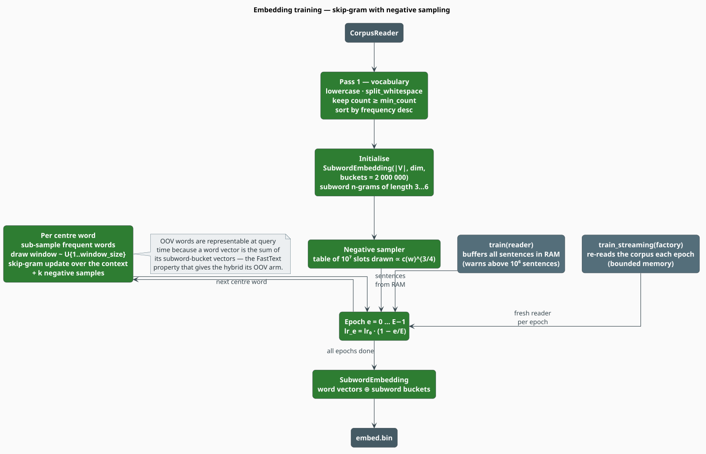

# Embedding Training

libgrammstein's embedding model is a **FastText-style subword embedding** [[3]](#references):
each word is represented by a word vector *plus* the character n-grams it contains, so a word never
seen in training still has a vector — the average of its subwords. That property is what gives the
hybrid model its out-of-vocabulary arm. This document explains the objective being optimised, the
sampling machinery that makes it tractable, and every knob that shapes the result.

> **Scope.** Source of truth: [`src/embedding/trainer.rs`](../../src/embedding/trainer.rs)
> (skip-gram, negative sampling, the training loops), [`src/embedding/model.rs`](../../src/embedding/model.rs)
> (`SubwordEmbedding`, vector composition) and
> [`src/cli/commands/train/embedding.rs`](../../src/cli/commands/train/embedding.rs) (the CLI).
> For how the vectors are consumed see [Hybrid Interpolation](../components/hybrid/interpolation.md)
> and [Hybrid Training](hybrid.md).

## Notation

| Symbol | Meaning |
|---|---|
| $`c`$ | the **centre** word of a training window; $`o`$ an observed **context** word |
| $`v_x`$ | the vector of token $`x`$; $`d`$ its dimension (`--dim`) |
| $`G_w`$ | the set of character n-grams (subwords) of word $`w`$ |
| $`B`$ | the number of subword hash buckets (`bucket_count`, default $`2 \times 10^{6}`$) |
| $`K`$ | negative samples per positive pair (`--neg-samples`) |
| $`\sigma(x)`$ | the logistic function $`1/(1 + e^{-x})`$ |
| $`\eta_e`$ | the learning rate at epoch $`e`$; $`\eta_0`$ its initial value (`--learning-rate`) |
| $`E`$ | the number of epochs (`--epochs`) |
| $`f(w)`$ | the relative corpus frequency of $`w`$ |
| $`t`$ | the sub-sampling threshold (`subsample_threshold`, $`10^{-4}`$) |
| $`\lvert V \rvert`$ | vocabulary size after the `--min-count` filter |

**Acronyms.** *SGNS* — Skip-Gram with Negative Sampling; *OOV* — Out-Of-Vocabulary; *SGD* —
Stochastic Gradient Descent.

## 1. The objective

Skip-gram asks: *given the centre word, which words surround it?* Training the full softmax over
$`\lvert V \rvert`$ words per token is hopeless, so SGNS replaces it with $`K + 1`$ independent
logistic regressions [[2]](#references) — one saying "this context is real", $`K`$ saying "these
sampled words are not":

```math
J(c, o) = -\log \sigma\!\left(v_c^{\top} v_o\right)
          \;-\; \sum_{k=1}^{K} \log \sigma\!\left(-\,v_c^{\top} v_{n_k}\right),
\qquad n_k \sim P_n \tag{S1}
```

The gradient of $`(\mathrm{S1})`$ gives exactly the updates the code performs, with learning rate
$`\eta`$:

```math
v_o \;\mathrel{+}=\; \eta\,\bigl(1 - \sigma(v_c^{\top} v_o)\bigr)\, v_c,
\qquad
v_{n_k} \;\mathrel{-}=\; \eta\,\sigma(v_c^{\top} v_{n_k})\, v_c \tag{S2}
```

```math
g \;=\; \eta\,\Bigl[\bigl(1 - \sigma(v_c^{\top} v_o)\bigr) v_o
        \;-\; \sum_{k=1}^{K} \sigma(v_c^{\top} v_{n_k})\, v_{n_k}\Bigr],
\qquad
v_c \;\mathrel{+}=\; g,
\qquad
v_g \;\mathrel{+}=\; \frac{g}{\lvert G_c \rvert}\ \ \forall\, g \in G_c \tag{S3}
```

$`(\mathrm{S3})`$ is the subword step: the centre word's gradient is shared equally among its
character n-grams, so every subword bucket learns from every word that contains it.

## 2. The sampling machinery

Three sampling decisions make $`(\mathrm{S1})`$ both cheap and well-conditioned.

**Negative sampling distribution.** Negatives are drawn from the unigram distribution raised to the
$`3/4`$ power — a compromise that samples rare words more often than their frequency warrants and
frequent words less [[2]](#references):

```math
P_n(w) = \frac{c(w)^{3/4}}{\sum_{w'} c(w')^{3/4}} \tag{S4}
```

This is realised as a pre-filled table of $`10^{7}`$ slots, so drawing a negative is one random
index — $`O(1)`$, no rejection loop. The true context word is excluded from its own negatives.

**Sub-sampling of frequent words.** Words like *the* appear in almost every window and carry almost
no information. Each occurrence of $`w`$ is *kept* with probability

```math
P_{\text{keep}}(w) = \left(\sqrt{\frac{f(w)}{t}} + 1\right)\cdot\frac{t}{f(w)}, \qquad t = 10^{-4} \tag{S5}
```

so a word at exactly the threshold is always kept, and a word 100 times more frequent is kept about
a tenth of the time. This both speeds training and sharpens the vectors of content words.

**Dynamic window.** For each centre word the effective half-width is drawn uniformly,
$`b \sim \mathcal{U}\{1, \dots, w\}`$ where $`w`$ is `--window`. Nearer context words therefore
participate in more updates than distant ones — a soft distance weighting that costs nothing.

## 3. The pipeline



*Figure 1 — vocabulary pass, initialisation, sampler construction, then one pass per epoch.*

**Pass 1 — vocabulary.** The corpus is streamed once; every token is **lowercased** and split on
whitespace. Words below `--min-count` are discarded, and the survivors are sorted by descending
frequency. An empty result raises `Error::EmptyCorpus`.

> **The vocabulary pass lowercases unconditionally and splits on whitespace only.** It does not use
> the `Tokenizer` that n-gram training uses. Punctuation therefore stays attached to words
> (`"fox."` and `"fox"` are different types). Pre-tokenise the corpus if that matters to you.

**Initialise.** A `SubwordEmbedding` is allocated with a $`\lvert V \rvert \times d`$ word matrix and
a $`B \times d`$ subword matrix, and both are filled with small random values. Subwords are the
character n-grams of length $`3 \ldots 6`$ (`min_subword_len` / `max_subword_len`).

**Sampler.** The $`10^{7}`$-slot negative-sampling table is built from the vocabulary counts per
$`(\mathrm{S4})`$.

**Epochs.** The learning rate decays linearly across epochs,

```math
\eta_e = \eta_0 \left(1 - \frac{e}{E}\right), \qquad e = 0, \dots, E-1 \tag{S6}
```

so the last epoch runs at $`\eta_0 / E`$ and the schedule anneals to zero — the standard SGD
schedule for word2vec-family models.

## 4. Two entry points, two memory profiles

| Method | Corpus handling | Use when |
|---|---|---|
| `train(reader)` | **buffers every sentence in RAM**, then runs all epochs over the buffer (warns above $`10^{6}`$ sentences) | the corpus comfortably fits in memory |
| `train_streaming(factory)` | re-reads the corpus from a fresh reader **once per epoch** | the corpus does not fit — bounded memory, $`E`$ extra passes of I/O |
| `train_continued(model, start_epoch, reader)` | continues an existing model for the remaining epochs | resuming a checkpointed run |

```rust
use libgrammstein::corpus::PlaintextReader;
use libgrammstein::embedding::EmbeddingTrainerBuilder;

// `train` takes the reader BY VALUE.
let reader = PlaintextReader::from_file("corpus.txt")?;
let model = EmbeddingTrainerBuilder::new()
    .dim(100)
    .window_size(5)
    .min_count(5)
    .neg_samples(5)
    .epochs(5)
    .learning_rate(0.05)
    .train(reader)?;

model.save("embeddings.bin")?;
# Ok::<(), libgrammstein::Error>(())
```

For a corpus too large to buffer, hand the trainer a *factory* instead of a reader:

```rust
use std::path::Path;
use libgrammstein::corpus::PlaintextReader;
use libgrammstein::embedding::EmbeddingTrainerBuilder;

let path = Path::new("huge-corpus.txt");
let model = EmbeddingTrainerBuilder::new()
    .dim(100)
    .epochs(5)
    .train_streaming(|| Ok(PlaintextReader::from_file(path)?))?;   // one fresh reader per epoch
# Ok::<(), libgrammstein::Error>(())
```

| Builder method | Library default | CLI flag | CLI default |
|---|---|---|---|
| `dim(n)` | `100` | `-d, --dim` | `100` |
| `window_size(n)` | `5` | `-w, --window` | `5` |
| `min_count(n)` | `5` | `-m, --min-count` | `5` |
| `neg_samples(n)` | `5` | `-n, --neg-samples` | `5` |
| `epochs(n)` | `5` | `-e, --epochs` | `5` |
| `learning_rate(x)` | `0.05` | `-l, --learning-rate` | **`0.025`** |
| `batch_size(n)` | `10_000` | — | — |

> **The CLI's default learning rate is half the library's.** `EmbeddingConfig::default` uses
> $`\eta_0 = 0.05`$; `--learning-rate` defaults to $`0.025`$. "Default settings" therefore means two
> different experiments depending on which door you came through. Pass `--learning-rate 0.05`
> to reproduce a library-default run from the CLI.

## 5. Vector composition, and why OOV works

At **query** time (`SubwordEmbedding::word_vector`) the vector of a word is:

```math
v(w) =
\begin{cases}
\dfrac{1}{2}\left(v_{\text{word}}(w) + \dfrac{1}{\lvert G_w \rvert}\displaystyle\sum_{g \in G_w} v_g\right)
  & w \in V \quad \text{(known word)} \\[2ex]
\dfrac{1}{\lvert G_w \rvert}\displaystyle\sum_{g \in G_w} v_g
  & w \notin V \quad \text{(OOV — subwords only)}
\end{cases} \tag{S7}
```

The OOV branch is the whole point: *unbelievability* was never in the corpus, but *unbeliev*,
*believ*, *ability* were, so it still lands near *implausibility*. Results are memoised in a bounded
per-model cache.

> **Known discrepancy in the training forward pass.** `EmbeddingTrainer::get_input_vector` composes
> the centre-word input vector by looking each subword bucket up with
> `SubwordEmbedding::embedding_by_index`, which indexes the **word** matrix — not the subword matrix
> that $`(\mathrm{S3})`$ writes to and that $`(\mathrm{S7})`$ reads at query time. Because
> $`B \gg \lvert V \rvert`$, most bucket look-ups fall outside the word matrix and contribute
> nothing to the forward pass. Subword vectors still *receive* the gradient of $`(\mathrm{S3})`$
> and are still what query-time OOV resolution uses, but they are not read back while training.
> Expect OOV vectors to be weaker than a reference FastText implementation would produce.

## 6. Memory

Both matrices are dense `f32`:

```math
\text{bytes} \;=\; \bigl(\lvert V \rvert + B\bigr) \cdot d \cdot 4 \tag{S8}
```

The **bucket matrix dominates**, because $`B = 2 \times 10^{6}`$ by default and is independent of
the corpus:

| $`d`$ | $`\lvert V \rvert`$ | word matrix | subword matrix | total |
|---|---|---|---|---|
| 100 | 50 000 | 20 MB | **800 MB** | 820 MB |
| 100 | 500 000 | 200 MB | **800 MB** | 1.0 GB |
| 300 | 500 000 | 600 MB | **2.4 GB** | 3.0 GB |

`bucket_count` is **not** exposed on `EmbeddingTrainerBuilder` or on the CLI. To shrink it, build an
`EmbeddingConfig` directly:

```rust
use libgrammstein::corpus::PlaintextReader;
use libgrammstein::embedding::{EmbeddingConfig, EmbeddingTrainer};

let mut config = EmbeddingConfig::new(100);
config.bucket_count = 200_000;          // 10x smaller subword matrix (80 MB at d = 100)
let reader = PlaintextReader::from_file("corpus.txt")?;
let model = EmbeddingTrainer::new(config).train(reader)?;
# Ok::<(), libgrammstein::Error>(())
```

Fewer buckets means more hash collisions between unrelated character n-grams, which blurs the
subword space — a direct quality-for-memory trade.

## 7. Checkpointing and resumption

`--checkpoint <DIR>` writes **one** checkpoint after training finishes; the trainer has no
epoch-by-epoch entry point, so `train_embedding_with_checkpoints` runs all $`E`$ epochs and then
saves. `--resume` loads that model and calls `train_continued`, which recovers the ephemeral
sampling statistics (vocabulary counts, the negative table) in one extra vocabulary-aligned pass and
then trains the remaining epochs. Asking to resume at or beyond $`E`$ is a no-op.

```bash
grammstein train embedding corpus.txt embed.bin --dim 300 --epochs 10 --checkpoint ./ckpt
grammstein train embedding corpus.txt embed.bin --dim 300 --epochs 20 \
  --checkpoint ./ckpt --resume ./ckpt/embedding-10.json    # 10 more epochs
```

## 8. Evaluating embeddings

Embeddings have no perplexity of their own — they are judged by the geometry they induce.

```bash
grammstein query similar embed.bin king -n 10
```

```rust
use libgrammstein::embedding::SubwordEmbedding;

let model = SubwordEmbedding::load("embeddings.bin")?;

// Nearest neighbours: do they look like synonyms/co-hyponyms?
for (word, score) in model.most_similar("king", 5) {
    println!("{word:<12} {score:.3}");
}

// OOV coverage: a word never seen in training still gets a vector.
let v = model.word_vector("unbelievability");
assert_eq!(v.len(), model.dim());
# Ok::<(), libgrammstein::Error>(())
```

| Symptom | Likely cause | Fix |
|---|---|---|
| neighbours are unrelated | too few epochs, or $`\eta_0`$ too low | raise `--epochs`; try `--learning-rate 0.05` |
| neighbours are all frequent function words | sub-sampling not biting; vocabulary too small | raise `--min-count` |
| vectors collapse (everything similar to everything) | $`\eta_0`$ too high — SGD diverged | lower `--learning-rate` |
| OOV vectors look random | subword space too collided | raise `bucket_count`; see also §5's discrepancy note |
| training is very slow | $`d`$ or $`K`$ too large | lower `--dim`; `--neg-samples 5` is usually enough |

The decisive test is the downstream one: build the hybrid and measure held-out perplexity
([Hybrid Training](hybrid.md)). An embedding that lowers hybrid perplexity is a good embedding,
whatever its nearest neighbours look like.

## 9. Complete example

```bash
# 1. Train embeddings (library-default learning rate, explicitly).
grammstein train embedding corpus.txt embed.bin \
  --dim 300 --window 5 --min-count 5 --neg-samples 5 --epochs 10 --learning-rate 0.05

# 2. Eyeball the geometry.
grammstein query similar embed.bin king -n 10

# 3. Put it to work: pair it with an n-gram model.
grammstein train ngram corpus.txt ngram.bin --order 5
grammstein train hybrid ngram.bin embed.bin hybrid.bin --strategy linear --alpha 0.8
grammstein eval compare dev.txt ngram.bin hybrid.bin
```

## References

1. T. Mikolov, K. Chen, G. Corrado & J. Dean (2013). *Efficient estimation of word representations
   in vector space.* ICLR Workshop. [arXiv:1301.3781](https://arxiv.org/abs/1301.3781)
2. T. Mikolov, I. Sutskever, K. Chen, G. Corrado & J. Dean (2013). *Distributed representations of
   words and phrases and their compositionality.* NeurIPS 26, 3111–3119.
   [arXiv:1310.4546](https://arxiv.org/abs/1310.4546)
3. P. Bojanowski, E. Grave, A. Joulin & T. Mikolov (2017). *Enriching word vectors with subword
   information* (FastText). TACL 5, 135–146.
   [doi:10.1162/tacl_a_00051](https://doi.org/10.1162/tacl_a_00051)

## See also

- [Subword Embeddings](../components/embedding/overview.md) — the model, in depth
- [Hybrid Training](hybrid.md) — combining these vectors with an n-gram model
- [Hybrid Interpolation](../components/hybrid/interpolation.md) — how $`v(w)`$ becomes a probability
- [Hyperparameter Tuning](hyperparameters.md) — choosing `--dim`, `--window`, `--epochs`
- [CLI Reference](../cli/README.md#62-train-embedding) — every flag on `train embedding`
