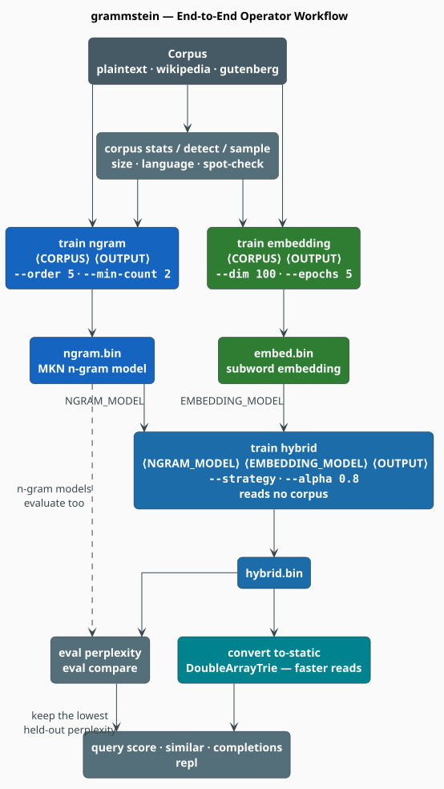
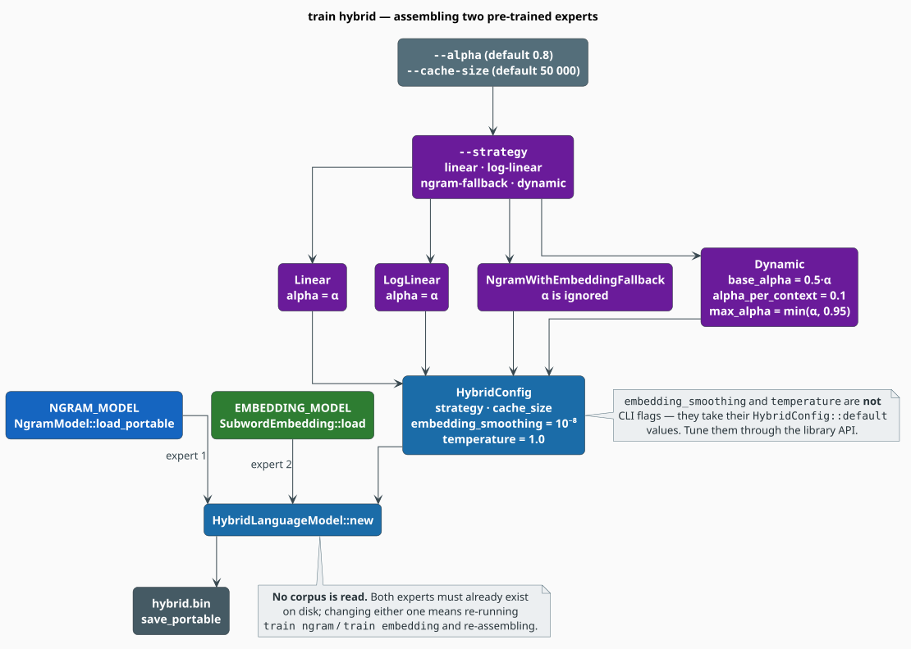

# Hybrid Model Training

A **hybrid language model** fuses a Modified Kneser-Ney n-gram model with a subword embedding model,
so that the razor-sharp *local* statistics of the former cover the latter's imprecision and the
*semantic generalization* of the latter covers the former's out-of-vocabulary blind spot. The
essential thing to understand before reading any further: **training a hybrid is not a training run
at all.** It is an *assembly* step over two models you have already trained.

> **Scope.** Source of truth: [`src/hybrid/model.rs`](../../src/hybrid/model.rs) (the model, the
> strategies, the cache) and [`src/cli/commands/train/hybrid.rs`](../../src/cli/commands/train/hybrid.rs)
> (the CLI's flag mapping). The mathematics of each strategy is derived in
> [Hybrid Interpolation](../components/hybrid/interpolation.md); OOV behaviour in
> [OOV Handling](../components/hybrid/oov-handling.md). Train the two inputs first:
> [N-gram Training](ngram.md), [Embedding Training](embedding.md).

## Notation

| Symbol | Meaning |
|---|---|
| $`w`$, $`h`$ | the candidate word and its history (context) |
| $`\mathbb{P}_n(w \mid h)`$ | the n-gram (Modified Kneser-Ney) probability |
| $`\mathbb{P}_e(w \mid h)`$ | the embedding-derived probability (cosine similarity, temperature-scaled) |
| $`\alpha \in [0,1]`$ | the n-gram mixing weight (`--alpha`); $`1`$ = pure n-gram, $`0`$ = pure embedding |
| $`\lvert h \rvert`$ | the context length, in words |
| $`V`$ | the n-gram vocabulary |
| $`\mathrm{PPL}`$ | perplexity on held-out text |

## 1. Why fuse them at all

The two experts fail in **complementary** ways, and that is the entire justification:

| Expert | Strong when | Weak when |
|---|---|---|
| N-gram (MKN) | the exact local context occurred in training | the word or the context is unseen |
| Subword embedding | the word is semantically near known words | precise word order matters |

Because their errors are largely independent, a weighted combination is more robust than either
alone. If your n-gram model's OOV rate on held-out text is already near zero, the hybrid buys you
little; if it is several percent, the hybrid is the cheapest fix available.

## 2. The workflow



*Figure 1 — the two experts are trained independently and only then assembled. Nothing forces them
to be trained from the same corpus, in the same run, or even on the same machine.*

### Step 1 — train the n-gram expert

```bash
grammstein train ngram corpus.txt ngram.bin --order 5 --min-count 2 --checkpoint ./ckpt
```

### Step 2 — train the embedding expert

```bash
grammstein train embedding corpus.txt embed.bin --dim 100 --epochs 5 --learning-rate 0.05
```

### Step 3 — assemble

```bash
grammstein train hybrid ngram.bin embed.bin hybrid.bin --strategy linear --alpha 0.8
```

Three positionals — `NGRAM_MODEL`, `EMBEDDING_MODEL`, `OUTPUT` — and **no corpus argument**. The
command loads both models, wraps them in a `HybridLanguageModel`, and writes the combined artifact
with `save_portable`.

The library equivalent:

```rust
use libgrammstein::hybrid::{HybridConfig, HybridLanguageModel, InterpolationStrategy};

// `ngram` and `embedding` were trained (or loaded) beforehand.
let config = HybridConfig {
    strategy: InterpolationStrategy::Linear { alpha: 0.8 },
    ..Default::default()
};
let hybrid = HybridLanguageModel::new(ngram, embedding, config);

// Defaults are Linear { alpha: 0.8 }, cache 50 000, smoothing 1e-8, temperature 1.0:
// let hybrid = HybridLanguageModel::with_defaults(ngram, embedding);

let log_p = hybrid.score("brown", &["the", "quick"]);
```

## 3. The four strategies

All four are derived in [Hybrid Interpolation](../components/hybrid/interpolation.md); this is the
operational summary.

```math
\text{Linear:}\quad \mathbb{P}(w \mid h) = \alpha\,\mathbb{P}_n + (1-\alpha)\,\mathbb{P}_e \tag{Y1}
```

```math
\text{Log-Linear:}\quad \log \mathbb{P}(w \mid h) = \alpha \log \mathbb{P}_n + (1-\alpha) \log \mathbb{P}_e \tag{Y2}
```

```math
\text{Fallback:}\quad \mathbb{P}(w \mid h) = \begin{cases} \mathbb{P}_n & w \in V \\ \mathbb{P}_e & \text{otherwise}\end{cases} \tag{Y3}
```

```math
\text{Dynamic:}\quad \alpha(h) = \min\bigl(\alpha_0 + \kappa \lvert h \rvert,\ \alpha_{\max}\bigr),
\qquad \mathbb{P}(w \mid h) = \alpha(h)\,\mathbb{P}_n + (1 - \alpha(h))\,\mathbb{P}_e \tag{Y4}
```

| `--strategy` | Combine | Reach for it when |
|---|---|---|
| `linear` (default) | probabilities | general purpose; predictable; start here |
| `log-linear` | log-probabilities (a product of experts) | the two experts live on different scales — a low probability from *either* strongly suppresses the result |
| `ngram-fallback` | hard switch on $`w \in V`$ | the n-gram corpus is large and trustworthy; no interpolation cost for known words |
| `dynamic` | probabilities, with $`\alpha`$ growing in $`\lvert h \rvert`$ | high OOV / mixed vocabulary — trust the n-gram *more* as context accumulates |

## 4. How `--alpha` reaches the strategy

The CLI exposes a single `--alpha`, but `Dynamic` needs three parameters. The mapping is performed
in `train_hybrid`, and it is the one place the CLI *derives* values rather than passing them
through:



*Figure 2 — the `--strategy` / `--alpha` mapping, verbatim from `src/cli/commands/train/hybrid.rs`.*

| `--strategy` | Constructed strategy | $`\alpha`$ is used as |
|---|---|---|
| `linear` | `Linear { alpha: α }` | the mixing weight |
| `log-linear` | `LogLinear { alpha: α }` | the log-space mixing weight |
| `ngram-fallback` | `NgramWithEmbeddingFallback` | **ignored entirely** |
| `dynamic` | `Dynamic { base_alpha: 0.5·α, alpha_per_context: 0.1, max_alpha: min(α, 0.95) }` | seeds all three fields |

So `--strategy dynamic --alpha 0.8` yields $`\alpha_0 = 0.4`$, $`\kappa = 0.1`$,
$`\alpha_{\max} = 0.8`$: the weight starts at $`0.4`$ with no context and climbs by $`0.1`$ per
context word, saturating at $`0.8`$ from four context words onward. To set the three independently,
use the library API.

`HybridConfig::embedding_smoothing` ($`10^{-8}`$, the probability floor) and `temperature`
($`1.0`$, the cosine-to-probability scale) have **no CLI flags**; they take their defaults.

## 5. Choosing $`\alpha`$

$`\alpha`$ is the cheapest hyperparameter in the entire library, because sweeping it **does not
touch the corpus** — you hold both experts fixed and re-assemble:

```bash
for a in 0.5 0.6 0.7 0.8 0.9 1.0; do
  grammstein train hybrid ngram.bin embed.bin "hybrid-$a.bin" --alpha "$a" --quiet
done

# One comparison run over all of them; the command names the winner.
grammstein eval compare dev.txt hybrid-0.5.bin hybrid-0.6.bin hybrid-0.7.bin \
                                hybrid-0.8.bin hybrid-0.9.bin hybrid-1.0.bin
```

Read the curve, not just the minimum. It is usually flat-bottomed: any $`\alpha`$ within a few
hundredths of the optimum performs the same, so prefer the *simpler* end (higher $`\alpha`$, i.e.
more n-gram) when two values tie. $`\alpha = 1.0`$ is the pure-n-gram control — **always include
it**. If it wins, the embedding is not earning its place and you should fix it (see
[Embedding Training §8](embedding.md#8-evaluating-embeddings)) rather than ship the hybrid.

| Situation | Start at |
|---|---|
| both experts trained on the same, large corpus | $`\alpha \approx 0.8`$ |
| the two experts are on different scales (`log-linear`) | $`\alpha \approx 0.6`$–$`0.8`$ |
| large, high-quality n-gram corpus | `ngram-fallback` (no $`\alpha`$) |
| high OOV rate, mixed vocabulary | `dynamic`, $`\alpha = 0.9`$ (giving $`\alpha_0 = 0.45`$, $`\alpha_{\max} = 0.9`$) |

## 6. The score cache

Every `score(w, h)` result is memoised in a `ScoreCache`: a `DashMap` keyed by a hash of
$`(w, h)`$ — lock-free get and insert — plus a `Mutex<VecDeque>` recording insertion order for LRU
eviction. **The mutex is taken only when the cache is over capacity**, so the hot path never blocks
and a single model can be scored from many threads at once.

`--cache-size` (default `50 000`) sets the capacity. Raise it when scoring long documents with
heavy context repetition; lower it when memory is tight. The cache is never serialized — a loaded
model starts cold.

## 7. Persistence

| Method | Requires | Notes |
|---|---|---|
| `save_portable` / `load_portable` | — | **what the CLI uses.** Backend-agnostic: `load_portable(path, DynamicDawgChar::new)` rebuilds the n-gram trie through a dictionary factory. |
| `save` / `load` | feature `serde-extras` and a `serde`-able backend | direct serialization of the whole model |

Because the CLI writes portable models, every `eval`, `query` and `repl` command can load a hybrid
by trying `HybridLanguageModel::load_portable` first and falling back to `NgramModel::load_portable`
— which is exactly how those commands accept both model kinds without being told which is which.

## 8. Evaluating the hybrid

```bash
# The number that matters, against the baseline it must beat.
grammstein eval compare dev.txt ngram.bin hybrid.bin
```

```math
\mathrm{PPL} = \exp\!\left(-\frac{1}{N}\sum_{i=1}^{N}\log \mathbb{P}(w_i \mid h_i)\right) \tag{Y5}
```

`HybridLanguageModel::sentence_log_prob` scores each token against the preceding
$`\min(i,\ n-1)`$ words, so the effective context grows to the n-gram order and then slides.

Two diagnostics beyond the headline number:

- **OOV rate.** `eval perplexity` prints it. The hybrid's whole reason for existing is to score OOV
  tokens sensibly; if OOV is 0%, the embedding arm is decoration.
- **Per-sentence spread.** `--per-sentence` gives min/max/median. A hybrid that improves the median
  but worsens the maximum is trading tail robustness for average-case gain — usually a bad deal in
  correction and rescoring pipelines.

> **A calibration caveat.** $`\mathbb{P}_e`$ is an *unnormalized* score: computing the true softmax
> normalizer would require a pass over the whole vocabulary per query, so the implementation uses a
> cheap surrogate. It is sound for **ranking and interpolation** — which is all the hybrid needs —
> but the resulting $`\mathbb{P}(w \mid h)`$ is not a calibrated distribution, and hybrid
> perplexities are therefore only comparable *to each other*, not to an external model's. See
> [Hybrid Interpolation §"The embedding probability"](../components/hybrid/interpolation.md#the-embedding-probability).

## 9. Complete example

```bash
# 1. Two experts, one corpus, independent runs.
grammstein train ngram     corpus.txt ngram.bin --order 5 --min-count 2 --checkpoint ./ckpt
grammstein train embedding corpus.txt embed.bin --dim 100 --epochs 5 --learning-rate 0.05

# 2. Sweep alpha (cheap: no corpus is read).
for a in 0.6 0.7 0.8 0.9 1.0; do
  grammstein train hybrid ngram.bin embed.bin "hybrid-$a.bin" --alpha "$a" --quiet
done

# 3. Select on dev.
grammstein eval compare dev.txt hybrid-0.6.bin hybrid-0.7.bin hybrid-0.8.bin \
                                hybrid-0.9.bin hybrid-1.0.bin

# 4. Report the winner once, on test.
grammstein eval perplexity hybrid-0.8.bin test.txt --per-sentence

# 5. Freeze and serve.
grammstein convert to-static hybrid-0.8.bin hybrid-static.bin
grammstein query completions hybrid-static.bin the quick -n 10
```

## References

1. F. Jelinek & R. L. Mercer (1980). *Interpolated estimation of Markov source parameters from
   sparse data.* In *Pattern Recognition in Practice*, 381–397. North-Holland.
2. G. E. Hinton (2002). *Training products of experts by minimizing contrastive divergence.*
   Neural Computation 14(8), 1771–1800.
   [doi:10.1162/089976602760128018](https://doi.org/10.1162/089976602760128018)
3. P. Bojanowski, E. Grave, A. Joulin & T. Mikolov (2017). *Enriching word vectors with subword
   information* (FastText). TACL 5, 135–146.
   [doi:10.1162/tacl_a_00051](https://doi.org/10.1162/tacl_a_00051)

## See also

- [Hybrid Interpolation](../components/hybrid/interpolation.md) — the derivations behind (Y1)–(Y4)
- [OOV Handling](../components/hybrid/oov-handling.md) — what happens when $`w \notin V`$
- [N-gram Training](ngram.md) · [Embedding Training](embedding.md) — the two inputs
- [Hyperparameter Tuning](hyperparameters.md) — the full search, of which $`\alpha`$ is one axis
- [CLI Reference](../cli/README.md#63-train-hybrid) — every flag on `train hybrid`
