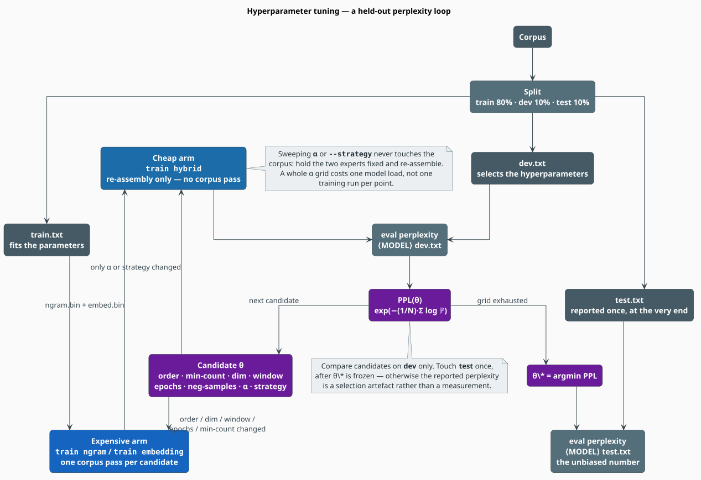

# Hyperparameter Tuning

Every knob in libgrammstein is one of two kinds: an **expensive** one that requires re-reading the
corpus (order, dimension, window, epochs, minimum count) or a **cheap** one that does not
(`--alpha`, `--strategy`, `--cache-size`). Tuning well is mostly a matter of never paying the
expensive price for a cheap question. This document defines the objective, gives the protocol that
keeps the resulting number honest, and works through every parameter the library exposes.

> **Scope.** Source of truth: [`src/cli/args.rs`](../../src/cli/args.rs) (the flags and their
> defaults), [`src/ngram/trainer.rs`](../../src/ngram/trainer.rs),
> [`src/embedding/trainer.rs`](../../src/embedding/trainer.rs) and
> [`src/hybrid/model.rs`](../../src/hybrid/model.rs) (what the values do). The per-component guides
> are [N-gram Training](ngram.md), [Embedding Training](embedding.md) and
> [Hybrid Training](hybrid.md).

## Notation

| Symbol | Meaning |
|---|---|
| $`\theta`$ | a candidate hyperparameter assignment; $`\Theta`$ the grid of candidates |
| $`\theta^{*}`$ | the assignment minimising held-out perplexity |
| $`\mathrm{PPL}(\theta)`$ | perplexity of the model fitted with $`\theta`$, on the dev split |
| $`n`$ | n-gram order (`--order`) |
| $`d`$ | embedding dimension (`--dim`) |
| $`w`$ | context window (`--window`) |
| $`E`$ | epochs (`--epochs`); $`K`$ negative samples (`--neg-samples`) |
| $`\eta_0`$ | initial learning rate (`--learning-rate`) |
| $`\alpha`$ | hybrid interpolation weight (`--alpha`) |
| $`T`$ | corpus size in tokens; $`C`$ the cost of one corpus pass |
| $`\lvert V \rvert`$ | vocabulary size |

## 1. The objective and the protocol

The objective is **held-out perplexity** — the exponentiated per-token cross-entropy of text the
model has never seen:

```math
\begin{array}{lr}
\displaystyle \mathrm{PPL}(\theta) = \exp\!\left(-\frac{1}{N}\sum_{i=1}^{N}\log \mathbb{P}_{\theta}(w_i \mid h_i)\right),
\qquad
\theta^{*} = \arg\min_{\theta \in \Theta}\ \mathrm{PPL}(\theta) & \text{(T1)}
\end{array}
```

Perplexity is the *effective branching factor*: a model with $`\mathrm{PPL} = 100`$ is, on average,
as uncertain as if it were choosing uniformly among 100 words at each step. Lower is better; $`1`$
is perfect; a uniform model scores $`\lvert V \rvert`$.

**Three splits, three jobs.** This is not ceremony — it is the difference between a measurement and
a story:

| Split | Share | Used for | Touched |
|---|---|---|---|
| train | 80% | fitting the parameters (counts, vectors) | every run |
| dev | 10% | selecting $`\theta`$ | every candidate |
| test | 10% | the number you report | **once**, after $`\theta^{*}`$ is frozen |



*Figure 1 — the search loop, and the two cost classes it must keep apart.*

```bash
# A reproducible 80/10/10 split.
total=$(wc -l < corpus.txt)
head -n $((total * 80 / 100)) corpus.txt > train.txt
sed -n "$((total * 80 / 100 + 1)),$((total * 90 / 100))p" corpus.txt > dev.txt
tail -n $((total / 10)) corpus.txt > test.txt
```

> **Perplexities are only comparable within one experiment.** Change the tokenisation, the test set,
> or the vocabulary, and the number moves for reasons that have nothing to do with model quality.
> Never compare a libgrammstein perplexity to a published one; compare it to *your* baseline, on
> *your* test set.

## 2. The two cost classes

Let $`C`$ be the cost of one pass over the corpus. Then, per candidate:

```math
\begin{array}{lr}
\displaystyle \underbrace{C_{\text{ngram}} \approx 2C}_{\text{count} \;+\; \text{continuation pass}}
\qquad
\underbrace{C_{\text{emb}} \approx (1 + E)\,C}_{\text{vocabulary} \;+\; E \text{ epochs}}
\qquad
\underbrace{C_{\text{hybrid}} \approx 0}_{\text{two model loads}} & \text{(T2)}
\end{array}
```

The consequence is stark. A grid over $`\{n\} \times \{d\} \times \{\alpha\}`$ with 3, 3 and 6
values costs

```math
\begin{array}{lr}
\displaystyle \lvert \{n\} \rvert \cdot C_{\text{ngram}}
\;+\; \lvert \{d\} \rvert \cdot C_{\text{emb}}
\;+\; \underbrace{\lvert \{n\} \rvert \cdot \lvert \{d\} \rvert \cdot \lvert \{\alpha\} \rvert \cdot 0}_{\text{the } \alpha \text{ sweep is free}}
\;=\; 3\cdot 2C + 3\cdot 6C = 24C & \text{(T3)}
\end{array}
```

if you fit each expert **once** per value and re-assemble for $`\alpha`$ — and $`54 \times`$ that
if you naively retrain both experts inside the $`\alpha`$ loop. **Never put an expensive fit inside
a cheap loop.**

## 3. The parameters

### 3.1 N-gram

| Parameter | Flag | Default | Range that matters |
|---|---|---|---|
| order $`n`$ | `-o, --order` | `5` | `3`–`5` |
| minimum count | `-m, --min-count` | `2` | `1`–`10` |
| batch size | `-b, --batch-size` | `10000` | throughput only; not a quality knob |

**Order $`n`$.** The dominant cost *and* the dominant quality knob. Memory and time both scale about
linearly in $`n`$ (equation (N1) in [N-gram Training](ngram.md#2-how-much-will-it-cost)), while the
returns fall away sharply: $`n = 5`$ is the standard because $`n = 6`$ and beyond mostly add
singletons, which MKN then discounts to almost nothing anyway.

| $`n`$ | Captures | Cost | Verdict |
|---|---|---|---|
| 2 | word pairs | lowest | too weak except as a baseline |
| 3 | short phrases | low | fine for small corpora ($`T < 10^{6}`$) |
| **5** | clauses | moderate | **the default; start here** |
| 7+ | long spans | high | almost always sparse; rarely pays |

Rule of thumb: raise $`n`$ only when the corpus grows enough to populate it. With $`T`$ tokens you
can support roughly $`n \approx \log_{10} T - 1`$ before the highest order becomes mostly singletons.

**Minimum count.** Prunes rare n-grams: smaller model, better generalization, *worse* coverage.
Beware the trap documented in [N-gram Training §3.3](ngram.md#33---min-count-does-not-prune-the-in-memory-model)
— `--min-count` is only applied on the `--checkpoint` path. On the in-memory path it does nothing at
all, so a "min-count sweep" without `--checkpoint` will produce identical models and a suspiciously
flat curve. That flat curve is the tell.

### 3.2 Embedding

| Parameter | Flag | Default | Range that matters |
|---|---|---|---|
| dimension $`d`$ | `-d, --dim` | `100` | `50`–`300` |
| window $`w`$ | `-w, --window` | `5` | `2`–`10` |
| minimum count | `-m, --min-count` | `5` | `2`–`20` |
| epochs $`E`$ | `-e, --epochs` | `5` | `5`–`20` |
| negative samples $`K`$ | `-n, --neg-samples` | `5` | `5`–`20` |
| learning rate $`\eta_0`$ | `-l, --learning-rate` | `0.025` | `0.01`–`0.05` |

**Dimension $`d`$.** Capacity. Both the memory (equation (S8)) and the per-update cost are linear in
$`d`$. Below $`50`$ the vectors cannot separate senses; above $`300`$ the gains are marginal on
anything but a very large corpus.

**Window $`w`$.** *What kind* of similarity you learn, not how much:

| $`w`$ | Learns | Neighbours of *Paris* look like |
|---|---|---|
| 2–3 | syntactic / functional similarity | *London*, *Berlin* (same slot) |
| 5 | a balance | **the default** |
| 8–10 | topical relatedness | *France*, *Eiffel*, *café* |

**Epochs $`E`$.** The learning rate decays linearly to zero across the epochs (equation (S6)), so
$`E`$ sets both the amount of training *and* the schedule. Doubling $`E`$ doubles the cost and
halves the final learning rate.

**Negative samples $`K`$.** $`5`$ suffices for large corpora; $`10`$–$`20`$ helps small ones, where
each positive pair must work harder. Cost is linear in $`K`$.

**Learning rate $`\eta_0`$.** Remember that the CLI default ($`0.025`$) is half the library default
($`0.05`$). Too high and the vectors collapse (everything similar to everything); too low and they
never leave their random initialisation.

### 3.3 Hybrid

| Parameter | Flag | Default | Notes |
|---|---|---|---|
| $`\alpha`$ | `-a, --alpha` | `0.8` | **free to sweep** — no corpus pass |
| strategy | `-s, --strategy` | `linear` | also free |
| cache size | `--cache-size` | `50000` | throughput only |
| temperature $`\tau`$ | — | `1.0` | library only (`HybridConfig`) |
| embedding smoothing | — | `1e-8` | library only (`HybridConfig`) |

$`\alpha`$ is the single highest-value-per-CPU-second knob in the library, because
$`C_{\text{hybrid}} \approx 0`$. Always include $`\alpha = 1.0`$ (the pure-n-gram control) in the
sweep: if it wins, your embedding is not contributing and the hybrid is a liability, not a feature.

## 4. Grid search, done right

Fit each expert **once** per expensive value; sweep the cheap axes over the fitted artifacts.

```bash
#!/usr/bin/env bash
set -euo pipefail

# --- Expensive axes: one fit per value, never repeated. ---
for n in 3 4 5; do
  grammstein train ngram train.txt "ngram-o$n.bin" \
    --order "$n" --min-count 2 --checkpoint "./ckpt-o$n" --quiet
done

for d in 50 100 200; do
  grammstein train embedding train.txt "embed-d$d.bin" \
    --dim "$d" --epochs 5 --learning-rate 0.05 --quiet
done

# --- Cheap axes: pure re-assembly, no corpus is read. ---
models=()
for n in 3 4 5; do
  for d in 50 100 200; do
    for a in 0.6 0.7 0.8 0.9 1.0; do
      out="hybrid-o$n-d$d-a$a.bin"
      grammstein train hybrid "ngram-o$n.bin" "embed-d$d.bin" "$out" \
        --strategy linear --alpha "$a" --quiet
      models+=("$out")
    done
  done
done

# --- Select on dev, in one comparison run. ---
grammstein eval compare dev.txt "${models[@]}" -o grid.json

# --- Report the winner ONCE, on test. ---
grammstein eval perplexity "$(jq -r 'min_by(.perplexity).model' <<<"$(jq '.models' grid.json)")" test.txt
```

**Coordinate descent beats a full grid** when the axes are nearly independent, which here they
largely are: tune $`n`$ with $`\alpha = 1`$ (pure n-gram, so the embedding cannot confound it), then
tune $`d`$ and $`E`$ against the fixed n-gram, then sweep $`\alpha`$ last. That costs
$`O(\sum_i \lvert \Theta_i \rvert)`$ fits instead of $`O(\prod_i \lvert \Theta_i \rvert)`$.

## 5. Starting points by corpus size

| Corpus | `--order` | `--min-count` (ngram) | `--dim` | `--window` | `--epochs` | `--min-count` (emb) | `--alpha` |
|---|---|---|---|---|---|---|---|
| small, $`T < 10^{6}`$ | 3 | 1 | 50 | 5 | 10–20 | 2 | 0.6 |
| medium, $`10^{6} \le T < 10^{8}`$ | 5 | 2 | 100 | 5 | 5–10 | 5 | 0.8 |
| large, $`T \ge 10^{8}`$ | 5 | 5–10 | 200–300 | 5 | 5 | 10 | 0.8–0.9 |

Small corpora need *more* epochs and *lower* thresholds (there is little data, so keep it and look
at it repeatedly); large corpora need the opposite (there is plenty, so prune hard and pass once).

## 6. Diagnosing a bad result

| Symptom | Diagnosis | Response |
|---|---|---|
| train perplexity $`\lll`$ dev perplexity | overfitting — the model memorised the corpus | lower `--order`; raise `--min-count`; get more data |
| both perplexities high and close | underfitting — not enough capacity | raise `--order`, `--dim`, `--epochs` |
| dev perplexity flat across a `--min-count` sweep | you are on the in-memory path, where `--min-count` is inert | add `--checkpoint` (see [§3.1](#31-n-gram)) |
| perplexity improves while OOV rate climbs | you pruned away the hard tokens, not modelled them | lower `--min-count`; check `eval perplexity`'s OOV line |
| $`\alpha^{*} = 1.0`$ | the embedding contributes nothing | fix the embedding, or ship the n-gram alone |
| OOM during training | the continuation-count pass, most likely | see [Large Corpora](large-corpora.md) |
| everything is slow | $`d`$, $`K`$ or $`E`$ too large; or an expensive fit inside a cheap loop | re-read §2 |

## 7. Metrics beyond perplexity

Perplexity is the right default objective, but it is not the whole story.

- **OOV rate** — printed by `eval perplexity`. A perplexity improvement bought by excluding hard
  tokens from the average is not an improvement. Read the two numbers together, always.
- **Task metrics** — if the model exists to rank spelling corrections or rescore a WFST lattice,
  measure *that*: top-1 accuracy on a held-out correction set beats a perplexity delta of a few
  points, every time. See [Spell Correction](../examples/spell-correction.md).
- **Latency** — `--cache-size` and `convert to-static` move the serving cost, not the quality. Tune
  them separately, after $`\theta^{*}`$ is fixed.

## References

1. S. F. Chen & J. Goodman (1999). *An empirical study of smoothing techniques for language
   modeling.* Computer Speech & Language 13(4), 359–393.
   [doi:10.1006/csla.1999.0128](https://doi.org/10.1006/csla.1999.0128)
2. J. Bergstra & Y. Bengio (2012). *Random search for hyper-parameter optimization.* JMLR 13,
   281–305. [jmlr.org/papers/v13/bergstra12a.html](https://www.jmlr.org/papers/v13/bergstra12a.html)
3. T. Mikolov, I. Sutskever, K. Chen, G. Corrado & J. Dean (2013). *Distributed representations of
   words and phrases and their compositionality.* NeurIPS 26, 3111–3119.
   [arXiv:1310.4546](https://arxiv.org/abs/1310.4546)

## See also

- [N-gram Training](ngram.md) — what `--order` and `--min-count` actually do
- [Embedding Training](embedding.md) — what `--dim`, `--window` and `--epochs` actually do
- [Hybrid Training](hybrid.md) — the $`\alpha`$ sweep in detail
- [Large Corpora](large-corpora.md) — when a candidate no longer fits in memory
- [CLI Reference](../cli/README.md) — every flag, with its default
