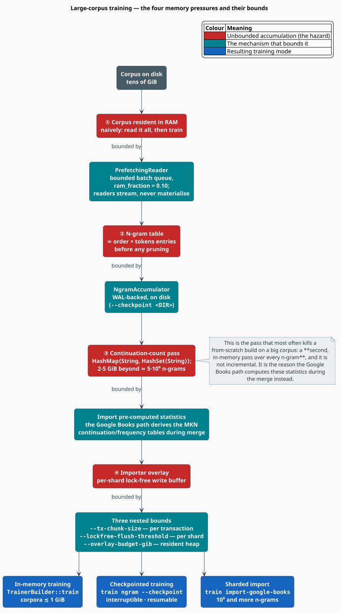

# Training on Large Corpora

Small corpora train themselves. What follows is for the case where the corpus does **not** fit
comfortably in RAM — tens of gigabytes of Wikipedia, a Gutenberg mirror, or the billions of records
in Google Books. There are exactly four places where such a corpus can exhaust memory, and each one
has exactly one mechanism that bounds it. This document names all four, explains the bound, and
tells you which of the three training modes to use.

> **Scope.** Source of truth: [`src/corpus/prefetch.rs`](../../src/corpus/prefetch.rs) (bounded
> streaming), [`src/ngram/accumulator.rs`](../../src/ngram/accumulator.rs) (the WAL accumulator),
> [`src/ngram/trainer.rs`](../../src/ngram/trainer.rs) (the continuation-count pass) and
> [`src/sources/google_books/`](../../src/sources/google_books/) (the sharded importer). For the
> importer's flags see the [Google Books guide](../cli/import-google-books.md); for the design story
> see [Memory Optimization](../architecture/memory-optimization.md).

## Notation

| Symbol | Meaning |
|---|---|
| $`T`$ | corpus size in tokens |
| $`n`$ | n-gram order |
| $`U`$ | the number of **distinct** n-grams (trie entries) |
| $`\lvert V \rvert`$ | vocabulary size |
| $`d`$ | embedding dimension; $`B`$ the subword bucket count |
| $`E`$ | embedding epochs |
| $`R`$ | total system RAM |

## 1. What actually grows

Three quantities scale with the corpus, and only one of them is the corpus itself:

```math
\begin{array}{lr}
\displaystyle \underbrace{T}_{\text{tokens — streamed, never resident}}
\qquad
\underbrace{U \le n\,T}_{\text{distinct n-grams — resident}}
\qquad
\underbrace{\lvert V \rvert}_{\text{vocabulary — resident, but Heaps-slow}} & \text{(L1)}
\end{array}
```

The corpus text is never the problem: every reader streams. The **n-gram table** is the problem, and
it grows with $`U`$, the number of *distinct* n-grams. Zipf's law keeps $`U`$ well below the
$`n\,T`$ upper bound — but $`U`$ still reaches hundreds of millions on a Wikipedia-scale corpus, and
each entry costs a key plus a 16-byte `NgramEntry` plus trie overhead.

## 2. The four pressures



*Figure 1 — each hazard (red) and the single mechanism that bounds it (teal), and the training mode
each combination implies (blue).*

## 3. The four pressures, in detail

### ① The corpus in RAM — bounded by `PrefetchingReader`

Every `CorpusReader` yields sentences lazily, and the trainer wraps the reader in a
`PrefetchingReader` that fills a **bounded** queue of batches on a background thread while the
`rayon` workers drain it. The queue is capped at a fraction of system RAM:

```math
\begin{array}{lr}
\displaystyle \text{queue bytes} \;\lesssim\; 0.10 \cdot R \qquad (\texttt{ram\_fraction} = 0.10) & \text{(L2)}
\end{array}
```

So corpus size does not enter the resident set at all — a 50 GB dump streams through a 4 GB process
without complaint. Nothing here needs configuring; `--batch-size` (default `10 000`) only trades
scheduling granularity against per-batch overhead.

### ② The n-gram table — bounded by `NgramAccumulator`

This is the resident structure that grows. Two ways to bound it:

**Prune it.** `--min-count` drops rare n-grams — which, by Zipf, is most of them. Note the trap: it
is only applied on the checkpointed path (see [N-gram Training §3.3](ngram.md#33---min-count-does-not-prune-the-in-memory-model)).

**Spill it to disk.** `--checkpoint <DIR>` replaces the in-memory trie with the WAL-backed
`NgramAccumulator`: counts live in an on-disk structure, are `sync`ed periodically, and only the
survivors of the `--min-count` filter are ever loaded into an in-memory trie — at the very end, in
`finalize_ngram_model`.

```bash
grammstein train ngram wikipedia.txt model.bin \
  --order 5 --min-count 5 \
  --checkpoint ./ckpt --checkpoint-interval 500000 --keep-checkpoints 3
```

### ③ The continuation-count pass — the one that kills builds

MKN needs $`N_{1+}(\bullet, w)`$ and $`N_{1+}(h, \bullet)`$ (equation (N2)), and
`collect_continuation_counts` computes them in a **second, in-memory pass over every n-gram**, using
a `HashMap<String, HashSet<String>>`. Its footprint is proportional to $`U`$ and *independent of
every memory flag you have set*:

| $`U`$ | Approximate footprint |
|---|---|
| $`10^{6}`$ | a few hundred MB |
| $`5 \times 10^{6}`$ | the code logs a warning here |
| $`10^{7}`$ and beyond | **2–5 GB and climbing** |

This pass runs on the library path *and* is the reason a from-scratch build on a very large corpus
can survive counting and then die during smoothing. Three ways out:

1. **Prune harder** (`--min-count`, on the checkpointed path) so $`U`$ never gets there;
2. **Lower the order** — $`U`$ falls roughly linearly in $`n`$;
3. **Use the Google Books importer**, which derives the MKN statistics during its merge from the
   already-materialised shards, and never builds the hash-of-sets at all.

### ④ The importer overlay — bounded by three nested flags

Only relevant to `train import-google-books`. Each shard has a lock-free overlay (its concurrent
write buffer), and three flags bound three different buffers:

| Flag | Bounds | Default |
|---|---|---|
| `--tx-chunk-size` | entries buffered inside one transaction | `500000` |
| `--lockfree-flush-threshold` | overlay entries per shard between checkpoints | auto (`50000` at `--parallel >= 8`) |
| `--overlay-budget-gib` | resident overlay heap retained after each checkpoint | `10` |

Peak transaction memory scales as $`O(P \cdot T_{\text{chunk}})`$ in the number of workers $`P`$, so
halve the chunk size when you double `--parallel`. The full treatment, with sizing tables, is in the
[Google Books guide](../cli/import-google-books.md).

## 4. Choosing a mode

| Mode | Command | Bounded by | Resumable | Parallel | Use when |
|---|---|---|---|---|---|
| **In-memory** | `train ngram` (no `--checkpoint`) | prefetch queue only | no | yes (rayon) | the n-gram table fits in RAM |
| **Checkpointed** | `train ngram --checkpoint` | WAL accumulator | **yes** | no (streamed) | it does not fit, or the run is too long to risk |
| **Sharded import** | `train import-google-books` | overlay + tx + budget | **yes** | yes (async) | Google Books, $`10^{9}`$+ n-grams |

The checkpointed path trades throughput for safety: it streams single-threaded rather than
prefetch-parallel. That is the cost of never losing a long run. `Ctrl-C` writes a checkpoint before
exiting, and `--resume latest` picks it up.

## 5. Streaming corpus readers

Every reader is lazy; none of them materialise the corpus.

```rust
use libgrammstein::corpus::{GutenbergReader, PlaintextReader, WikipediaReader};

// A directory of plain-text files, streamed file by file.
let reader = PlaintextReader::from_directory("corpus/")?;

// A Wikipedia dump on disk (bz2 is handled transparently).
let reader = WikipediaReader::new("enwiki-latest-pages-articles.xml.bz2")?;

// A directory of Project Gutenberg books.
let reader = GutenbergReader::from_directory("gutenberg/")?;
# Ok::<(), libgrammstein::Error>(())
```

A Wikipedia dump can be streamed **straight from the URL** — no local copy at all — with the
`http-corpus` feature (enabled by `cli`):

```bash
grammstein train ngram \
  "https://dumps.wikimedia.org/enwiki/latest/enwiki-latest-pages-articles.xml.bz2" \
  model.bin --format wikipedia --checkpoint ./ckpt
```

> **A URL only works with `--format wikipedia`.** The plaintext and gutenberg readers resolve their
> argument as a filesystem path; a URL handed to them fails with "file not found". This is the
> single most common mistake in a large-corpus run.

## 6. Embeddings on a large corpus

The embedding trainer has the same in-memory/streaming split, and the choice is explicit:

| Entry point | Corpus handling | Passes |
|---|---|---|
| `train(reader)` | **buffers every sentence in RAM** (warns above $`10^{6}`$ sentences) | $`1`$ |
| `train_streaming(factory)` | re-reads the corpus from a fresh reader **each epoch** | $`1 + E`$ |

```rust
use std::path::Path;
use libgrammstein::corpus::PlaintextReader;
use libgrammstein::embedding::EmbeddingTrainerBuilder;

let path = Path::new("wikipedia.txt");
let model = EmbeddingTrainerBuilder::new()
    .dim(100)
    .epochs(5)
    .train_streaming(|| Ok(PlaintextReader::from_file(path)?))?;   // bounded memory
# Ok::<(), libgrammstein::Error>(())
```

The CLI's `train embedding` uses the buffering `train`, so for a corpus you cannot buffer, drive
`train_streaming` from the library. Note also that the $`B \times d`$ subword matrix is a fixed cost
independent of corpus size — 800 MB at $`B = 2 \times 10^{6}`$, $`d = 100`$ (see
[Embedding Training §6](embedding.md#6-memory)).

## 7. Controlling parallelism

`--threads` **parses but is never read** (see [CLI Reference §11](../cli/README.md#11-flags-that-parse-but-do-nothing)).
Training parallelism comes from `rayon`'s global pool, so control it the way rayon expects:

```bash
RAYON_NUM_THREADS=16 grammstein train ngram corpus.txt model.bin --order 5
```

or, from the library, before training:

```rust
rayon::ThreadPoolBuilder::new()
    .num_threads(16)
    .build_global()
    .expect("global rayon pool must not be initialised twice");
```

The Google Books importer is the exception: its `--parallel` **is** honoured, and sizes both the
download streams and the Tokio worker pool.

## 8. Estimating memory before you start

For the n-gram table, with $`U`$ distinct n-grams:

```math
\begin{array}{lr}
\displaystyle \text{bytes} \;\approx\; U \cdot \bigl(\underbrace{16}_{\texttt{NgramEntry}} + \bar{k} + \omega\bigr) & \text{(L3)}
\end{array}
```

where $`\bar{k}`$ is the mean key length in bytes and $`\omega`$ the per-node trie overhead
(backend-dependent). `NgramEntry` is exactly 16 bytes: one `AtomicU64` count plus two `AtomicU32`
continuation statistics. Vocabulary-indexed keys (one PUA character per word) shrink $`\bar{k}`$
substantially versus pipe-separated legacy keys — see
[N-gram Training §4](ngram.md#4-key-encoding-legacy-vs-vocabulary-indexed).

Do not trust the estimate; **measure**. Run a single prefix or a truncated corpus first:

```bash
head -c 500M wikipedia.txt > sample.txt
/usr/bin/time -v grammstein train ngram sample.txt sample.bin --order 5 2>&1 | grep 'Maximum resident'
```

then extrapolate — sub-linearly, because $`U`$ grows sub-linearly in $`T`$.

## 9. Best practices

1. **Measure on a sample first.** A 500 MB slice tells you the shape of the curve for the price of a
   coffee.
2. **Checkpoint anything that runs longer than you are willing to lose.** It also makes
   `--min-count` work.
3. **Prune early.** `--min-count 5` on a large corpus typically removes the majority of distinct
   n-grams and costs almost nothing in perplexity.
4. **Do not raise the order to compensate for a small corpus.** It inflates $`U`$, inflates the
   continuation pass, and produces singletons that MKN discounts away regardless.
5. **Stream from the URL** rather than downloading, when the dump is only needed once.
6. **Freeze for inference.** `convert to-static` rebuilds the model on a `DoubleArrayTrie`: faster
   reads, smaller resident set, no write capability (which you no longer need).
7. **Watch the OOV rate**, not just perplexity. Aggressive pruning shows up there first.

## References

1. S. F. Chen & J. Goodman (1999). *An empirical study of smoothing techniques for language
   modeling.* Computer Speech & Language 13(4), 359–393.
   [doi:10.1006/csla.1999.0128](https://doi.org/10.1006/csla.1999.0128)
2. G. K. Zipf (1949). *Human Behavior and the Principle of Least Effort.* Addison-Wesley.
3. H. S. Heaps (1978). *Information Retrieval: Computational and Theoretical Aspects.* Academic
   Press. (Vocabulary growth: $`\lvert V \rvert \approx k\,T^{\beta}`$, $`\beta \approx 0.5`$.)

## See also

- [Google Books Import](../cli/import-google-books.md) — the four importer flags, with sizing tables
- [Memory Optimization](../architecture/memory-optimization.md) — the design story behind the bounds
- [N-gram Training](ngram.md) — the two training paths and the `--min-count` trap
- [Embedding Training](embedding.md) — `train` versus `train_streaming`
- [Hyperparameter Tuning](hyperparameters.md) — how corpus size should move your defaults
- [CLI Reference](../cli/README.md) — every flag, with its default
