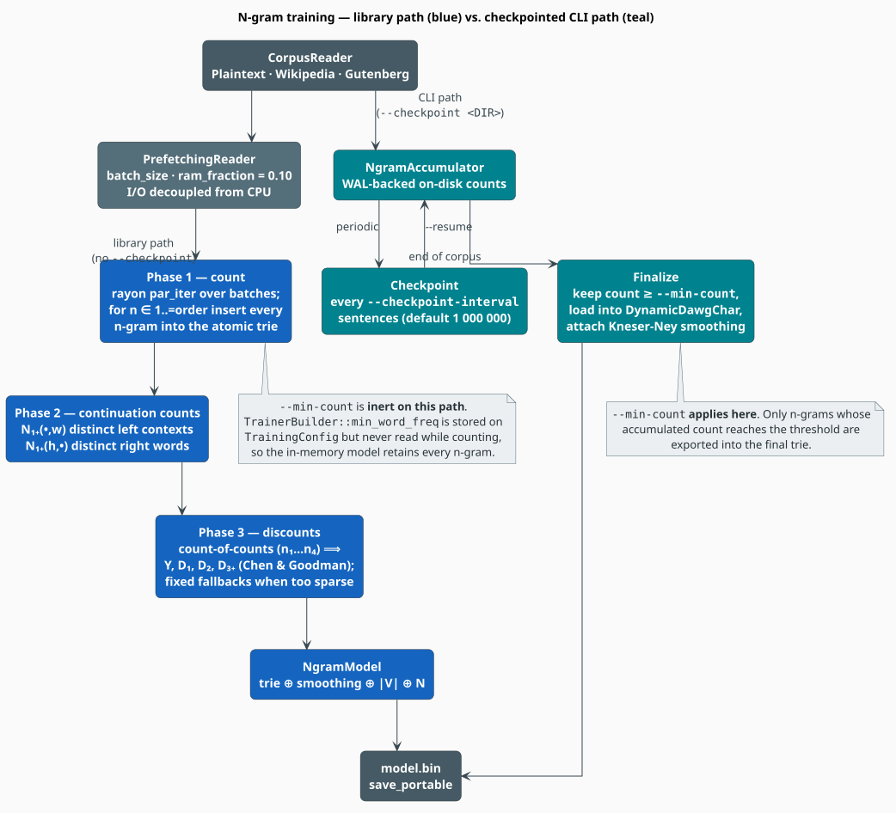

# N-gram Training

Training an n-gram model in libgrammstein means three things: **counting** every n-gram up to some
order $`n`$, **collecting the continuation statistics** that Modified Kneser-Ney needs, and
**estimating the discounts** from the corpus's own count-of-counts. This document explains each
phase, the two paths the code offers (in-memory and checkpointed), and how the knobs on the builder
and on the CLI map onto them.

> **Scope.** Source of truth: [`src/ngram/trainer.rs`](../../src/ngram/trainer.rs) (the pipeline),
> [`src/cli/commands/train/ngram.rs`](../../src/cli/commands/train/ngram.rs) (the CLI paths) and
> [`src/ngram/accumulator.rs`](../../src/ngram/accumulator.rs) (the WAL accumulator). For the
> smoother see [Modified Kneser-Ney](../components/ngram/modified-kneser-ney.md); for storage see
> [Trie Storage](../components/ngram/trie-storage.md); for scale see [Large Corpora](large-corpora.md).

## Notation

| Symbol | Meaning |
|---|---|
| $`n`$ | maximum n-gram order (`--order`, `TrainerBuilder::order`) |
| $`w`$, $`h`$ | a word (token), and a history (context) |
| $`c(h\,w)`$ | raw corpus count of the n-gram formed by appending $`w`$ to $`h`$ |
| $`\ell`$ | the length of a sentence, in tokens |
| $`T`$ | total tokens in the corpus |
| $`\lvert V \rvert`$ | vocabulary size — the number of distinct unigrams |
| $`n_i`$ | the *count-of-counts*: how many distinct n-grams occur exactly $`i`$ times |
| $`N_{1+}(\bullet, w)`$ | continuation count of $`w`$ — distinct contexts it completes |
| $`N_{1+}(h, \bullet)`$ | number of distinct words that follow $`h`$ |
| $`D_1, D_2, D_{3+}`$ | the three Modified Kneser-Ney discounts |

**Acronyms.** *MKN* — Modified Kneser-Ney; *WAL* — Write-Ahead Log; *OOV* — Out-Of-Vocabulary;
*PUA* — Private Use Area (the Unicode block used for vocabulary-indexed keys).

## 1. What training produces

A trained `NgramModel<D>` bundles four things:

1. an **n-gram trie** over a dictionary backend $`D`$, mapping each key to an `NgramEntry` that
   holds $`c(h\,w)`$, $`N_{1+}(\bullet, w)`$ and $`N_{1+}(h, \bullet)`$ as atomics;
2. a **`KneserNeySmoothing`** carrying $`D_1, D_2, D_{3+}`$ and $`N_{1+}(\bullet, \bullet)`$;
3. the **vocabulary size** $`\lvert V \rvert`$, which supplies the OOV floor $`1/\lvert V \rvert`$;
4. the **total token count** $`T`$, the unigram denominator.

Everything downstream — perplexity, completions, the hybrid model, WFST rescoring — reads only that
bundle.

## 2. How much will it cost?

Every sentence of length $`\ell`$ emits n-grams of every order up to $`n`$:

```math
\begin{array}{lr}
\displaystyle \#\{\text{n-grams emitted}\} = \sum_{k=1}^{\min(n,\ell)} (\ell - k + 1)
\;\approx\; n\,\ell \qquad (\ell \gg n) & \text{(N1)}
\end{array}
```

so emitted work grows as $`O(n \cdot T)`$. The number of **distinct** n-grams grows more slowly —
language is Zipfian [[3]](#references), and most long n-grams are singletons — but it still
dominates the memory budget. Order is the most expensive knob on this page: `--order 5` costs
roughly $`5\times`$ what `--order 1` does, in both time and space.

## 3. The two training paths

The library offers one pipeline; the CLI wraps it in two.



*Figure 1 — the library's three-phase in-memory pipeline (blue) and the CLI's WAL-backed
checkpointed path (teal). The two differ in whether `--min-count` is applied at all.*

### 3.1 The library path — `TrainerBuilder`

```rust
use libgrammstein::corpus::PlaintextReader;
use libgrammstein::ngram::{NgramEntry, TrainerBuilder};
use libdictenstein::dynamic_dawg::char::DynamicDawgChar;

// The builder takes the dictionary by value; `train` takes the reader by value.
let reader = PlaintextReader::from_file("corpus.txt")?;
let model = TrainerBuilder::new(DynamicDawgChar::<NgramEntry>::new())
    .order(5)
    .batch_size(10_000)
    .train(reader)?;

println!("vocab = {}, n-grams = {}", model.vocab_size(), model.ngram_count());
# Ok::<(), libgrammstein::Error>(())
```

`TrainerBuilder::train(reader)` is sugar for `.build().train(reader)`; call `.build()` yourself when
you want the `NgramTrainer` itself (for example to use `train_with_progress`, §7).

| Builder method | Default | Effect |
|---|---|---|
| `order(n)` | `5` | maximum order |
| `batch_size(n)` | `10_000` | sentences per prefetched, rayon-parallel batch |
| `min_word_freq(n)` | `1` | **stored but never read** — see §3.3 |
| `tokenizer(t)` | `Tokenizer::new()` | custom tokenization |
| `with_vocabulary_path(p)` | — | vocabulary-indexed keys, persisted at `p` |
| `with_vocabulary(v)` | — | vocabulary-indexed keys over an existing `SharedVocabARTrie` |

### 3.2 The three phases

**Phase 1 — count.** A `PrefetchingReader` decouples I/O from CPU: a background thread fills a
bounded queue of sentence batches (`batch_size`, with the queue capped at 10% of RAM), and each
batch is counted through `rayon`'s `par_iter`. For every sentence and every
$`k \in 1 \ldots \min(n, \ell)`$, each window of width $`k`$ is inserted into the trie. Counts are
`AtomicU64` fetch-adds, so workers never take a lock. An empty corpus raises `Error::EmptyCorpus`.

**Phase 2 — continuation counts.** MKN's lower-order distribution is built from *continuation
counts* rather than raw counts — the "San Francisco" intuition: *Francisco* is frequent but follows
essentially only *San*, so it deserves almost no fallback mass, while *city* follows many words and
deserves a lot. This phase walks every key, splits it into $`(h, w)`$, and accumulates

```math
\begin{array}{lr}
\displaystyle N_{1+}(\bullet, w) = \bigl\lvert \{\, h : c(h\,w) > 0 \,\} \bigr\rvert,
\qquad
N_{1+}(h, \bullet) = \bigl\lvert \{\, w : c(h\,w) > 0 \,\} \bigr\rvert & \text{(N2)}
\end{array}
```

and writes both back into the entries. It is a **second, in-memory pass over every n-gram**, held in
a `HashMap<String, HashSet<String>>`. The code warns past $`5 \times 10^{6}`$ n-grams, where it can
reach 2–5 GiB; this is the pass that most often ends a from-scratch build on a big corpus. See
[Large Corpora §3](large-corpora.md#3-the-four-pressures-in-detail).

**Phase 3 — discounts.** The count-of-counts $`n_1, n_2, n_3, n_4`$ are tallied and the Chen &
Goodman estimators evaluated [[2]](#references):

```math
\begin{array}{lr}
\displaystyle Y = \frac{n_1}{n_1 + 2 n_2}, \qquad
D_1 = 1 - 2Y\frac{n_2}{n_1}, \qquad
D_2 = 2 - 3Y\frac{n_3}{n_2}, \qquad
D_{3+} = 3 - 4Y\frac{n_4}{n_3} & \text{(N3)}
\end{array}
```

If **any** of $`n_1 \ldots n_4`$ is zero — a tiny or highly repetitive corpus — the estimators are
undefined and the trainer falls back to the fixed defaults
$`D_1 = 0.75,\ D_2 = 0.85,\ D_{3+} = 0.95`$. Finally $`N_{1+}(\bullet, \bullet)`$, the total number
of distinct bigram types, is summed over the unigram entries and attached to the smoother as the
denominator of the continuation distribution.

### 3.3 `--min-count` does not prune the in-memory model

`TrainingConfig::min_word_freq` is set by `TrainerBuilder::min_word_freq` and by the CLI's
`--min-count`, but **no code reads it while counting**. On the library path — and therefore on the
CLI's non-checkpointed path — every n-gram the corpus produces is retained, whatever `--min-count`
says.

Pruning happens only on the checkpointed path, in `finalize_ngram_model`, which exports an n-gram
only when its accumulated count reaches the threshold. **If you need a frequency-pruned model today,
train with `--checkpoint`:**

```bash
grammstein train ngram corpus.txt model.bin --order 5 --min-count 5 --checkpoint ./ckpt
```

### 3.4 The checkpointed path — `NgramAccumulator`

Given `--checkpoint <DIR>`, the CLI replaces the in-memory trie with a WAL-backed on-disk
accumulator. Sentences are streamed (single-threaded, not prefetched), tokenised, and every n-gram
`increment`ed against the accumulator. Every `--checkpoint-interval` sentences (default $`10^{6}`$)
the WAL is synced and a checkpoint written; `--keep-checkpoints` (default `5`) bounds how many are
kept. `Ctrl-C` writes a checkpoint before exiting, so an interrupted run loses nothing.

At the end, `finalize_ngram_model` filters by `--min-count`, loads the survivors into a
`DynamicDawgChar`, attaches a `KneserNeySmoothing`, derives $`\lvert V \rvert`$ and $`T`$ from the
unigrams, and writes the model with `save_portable`.

```bash
# Start a long run.
grammstein train ngram big.txt model.bin --order 5 --checkpoint ./ckpt

# Resume it. --resume REQUIRES --checkpoint; "latest" selects the newest checkpoint.
grammstein train ngram big.txt model.bin --order 5 --checkpoint ./ckpt --resume latest
```

> **Trade-off.** The checkpointed path is resumable and prunes, but streams single-threaded. The
> in-memory path is prefetched and rayon-parallel, and therefore far faster per sentence, but keeps
> everything and cannot resume. Choose by whether losing the run would hurt more than the extra
> wall-clock costs.

## 4. Key encoding: legacy vs. vocabulary-indexed

| Mode | Key for *the quick brown* | Selected by |
|---|---|---|
| **Legacy** (default) | `"the\|quick\|brown"` — pipe-separated | `VocabularyMode::Legacy` |
| **Vocabulary-indexed** | one PUA character per word | `with_vocabulary_path` / `with_vocabulary` |

Legacy keys are simple and backward-compatible, but they **corrupt any token containing a pipe**.
Vocabulary-indexed keys map each distinct word to a PUA character, which makes keys compact (one
`char` per *word*, not per byte) and pipe-safe. Use them when the corpus may contain `|`, when
several models must share one vocabulary, or when interoperating with the Google Books importer.

```rust
use libgrammstein::corpus::PlaintextReader;
use libgrammstein::ngram::{NgramEntry, TrainerBuilder};
use libdictenstein::dynamic_dawg::char::DynamicDawgChar;
use std::path::PathBuf;

let reader = PlaintextReader::from_file("corpus.txt")?;
let model = TrainerBuilder::new(DynamicDawgChar::<NgramEntry>::new())
    .order(5)
    .with_vocabulary_path(PathBuf::from("model/vocab.artrie"))
    .train(reader)?;
# Ok::<(), libgrammstein::Error>(())
```

## 5. Choosing a dictionary backend

The trainer is generic over any `MutableMappedDictionary<Value = NgramEntry> + IterableDictionary`.

| Backend | Writes | Reads | Use when |
|---|---|---|---|
| `DynamicDawgChar<NgramEntry>` | lock-free | fast | **the default** — what the CLI trains on |
| `PathMapDictionary<NgramEntry>` | lock-free | fast | experiments, tests, PathMap deployments |
| `DoubleArrayTrieChar<NgramEntry>` | immutable | fastest | **inference only** — produced by `convert to-static` |

`DoubleArrayTrieChar` is immutable by construction and cannot be trained into. Train on
`DynamicDawgChar`, then freeze:

```bash
grammstein convert to-static model.bin model-static.bin
```

## 6. The training loop, literately

```
function train(reader, order, batch_size):                ▸ mirrors NgramTrainer::train
    count_ngrams(reader, order, batch_size)               ▸ Phase 1
    collect_continuation_counts()                         ▸ Phase 2
    smoothing <- compute_smoothing_params()               ▸ Phase 3
    return NgramModel(trie, smoothing, count_unigrams(), tokens_processed)

function count_ngrams(reader, order, batch_size):
    prefetch <- PrefetchingReader(reader, batch_size, ram_fraction = 0.10)
    for batch in prefetch.batches():                      ▸ I/O runs ahead of the CPU
        par_iter(batch, sentence ->                       ▸ rayon: one task per sentence
            tokens <- tokenizer.words(sentence)
            if tokens is empty: return
            for k in 1 ..= min(order, |tokens|):
                for i in 0 ..= |tokens| - k:
                    trie.insert(tokens[i .. i+k])         ▸ atomic fetch-add; no lock held
        )
    if no batch was ever received: raise EmptyCorpus

function compute_smoothing_params():                      ▸ Phase 3, per (N3)
    (n1, n2, n3, n4) <- count_ngram_frequencies()         ▸ one pass over the trie
    if n1 > 0 and n2 > 0 and n3 > 0 and n4 > 0:
        kn <- KneserNeySmoothing::from_counts(n1, n2, n3, n4)
    else:
        kn <- KneserNeySmoothing::new(order)              ▸ fixed fallback discounts
    return kn.with_total_bigram_types(sum of N1+(•,w) over unigram entries)
```

## 7. Progress reporting

`NgramTrainer::train_with_progress` sends a `TrainingProgress { sentences_processed,
ngrams_counted, elapsed_secs }` down a `crossbeam_channel` every 10 000 sentences:

```rust
use crossbeam_channel::unbounded;
use libgrammstein::corpus::PlaintextReader;
use libgrammstein::ngram::{NgramEntry, TrainerBuilder};
use libdictenstein::dynamic_dawg::char::DynamicDawgChar;

let (tx, rx) = unbounded();
std::thread::spawn(move || {
    for p in rx {
        eprintln!("{} sentences · {} n-grams · {:.1}s",
                  p.sentences_processed, p.ngrams_counted, p.elapsed_secs);
    }
});

let reader = PlaintextReader::from_file("corpus.txt")?;
let model = TrainerBuilder::new(DynamicDawgChar::<NgramEntry>::new())
    .order(5)
    .build()
    .train_with_progress(reader, tx)?;
# Ok::<(), libgrammstein::Error>(())
```

The CLI wires the same statistics into an `indicatif` bar; `--no-progress` and `--quiet` silence it.

## 8. Evaluating the result

Perplexity on held-out text is the measurement that matters:

```math
\begin{array}{lr}
\displaystyle \mathrm{PPL} = \exp\!\left(-\frac{1}{N}\sum_{i=1}^{N}\log \mathbb{P}_{\mathrm{MKN}}(w_i \mid h_i)\right) & \text{(N4)}
\end{array}
```

```bash
grammstein eval perplexity model.bin dev.txt --per-sentence
```

Always read perplexity **together with the OOV rate** the same command prints. A low perplexity
bought by a high OOV rate is an illusion: the tokens the model found hardest have simply been
dropped from the average. If OOV runs to more than a few percent, lower `--min-count`, enlarge the
corpus, or add the embedding arm ([Hybrid Training](hybrid.md)).

## 9. Complete example

```bash
# 1. Sanity-check the corpus.
grammstein corpus stats corpus.txt

# 2. Train. Checkpoints make it resumable AND make --min-count effective.
grammstein train ngram corpus.txt model.bin \
  --order 5 --min-count 2 --lowercase \
  --checkpoint ./ckpt --checkpoint-interval 500000

# 3. Measure on held-out text.
grammstein eval perplexity model.bin dev.txt

# 4. Freeze for inference.
grammstein convert to-static model.bin model-static.bin

# 5. Use it.
grammstein query score model-static.bin the quick brown fox --sentence
```

## References

1. R. Kneser & H. Ney (1995). *Improved backing-off for M-gram language modeling.* ICASSP '95,
   181–184. [doi:10.1109/ICASSP.1995.479394](https://doi.org/10.1109/ICASSP.1995.479394)
2. S. F. Chen & J. Goodman (1999). *An empirical study of smoothing techniques for language
   modeling.* Computer Speech & Language 13(4), 359–393.
   [doi:10.1006/csla.1999.0128](https://doi.org/10.1006/csla.1999.0128)
3. G. K. Zipf (1949). *Human Behavior and the Principle of Least Effort.* Addison-Wesley.

## See also

- [Modified Kneser-Ney](../components/ngram/modified-kneser-ney.md) — the smoother, in full
- [Trie Storage](../components/ngram/trie-storage.md) — how keys and entries are stored
- [Hyperparameter Tuning](hyperparameters.md) — choosing `--order` and `--min-count`
- [Large Corpora](large-corpora.md) — what to do when the corpus no longer fits
- [Hybrid Training](hybrid.md) — adding the embedding arm
- [CLI Reference](../cli/README.md#61-train-ngram) — every flag on `train ngram`
