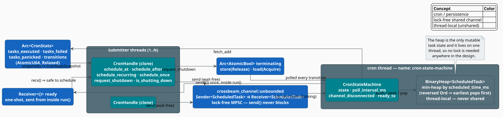
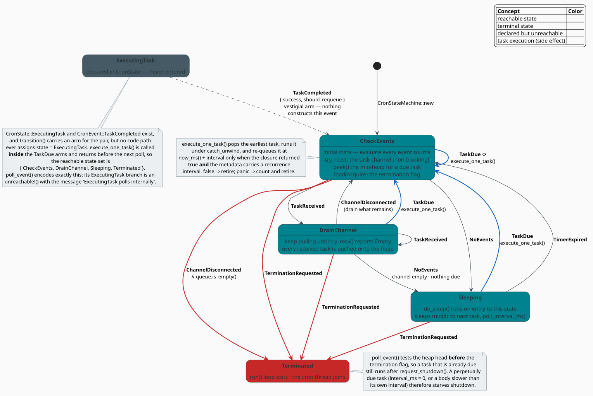

# Cron Manager: A Lock-Free Reactive Scheduler

The **cron manager** is libgrammstein's periodic-task scheduler. It exists because a multi-hour
Google Books import must checkpoint itself without ever pausing the importer, and it is built
so that *no thread in the system ever waits on a lock to schedule work*. Its design is a
**reactive state machine**: a single dedicated thread repeatedly senses an event and applies a
total transition function, and every cross-thread edge — task submission, shutdown signalling,
statistics — is an atomic or a lock-free channel.

This document specifies the state machine exactly as implemented, derives its timing bounds,
enumerates its lock-free guarantees, and records what the TLA+ model checks — including where
the model and the code deliberately differ.

> **Scope.** Source of truth: [`src/util/cron/mod.rs`](../../../src/util/cron/mod.rs) and its
> tests in [`src/util/cron/tests.rs`](../../../src/util/cron/tests.rs). The formal model lives
> in [`formal/tla/CronStateMachine.tla`](../../../formal/tla/CronStateMachine.tla). The only
> in-tree consumer is the Google Books importer
> ([`src/sources/google_books/importer/cron.rs`](../../../src/sources/google_books/importer/cron.rs)).
> For the surrounding concurrency design see [Threading Model](../../architecture/threading.md).

## When to reach for it

- Periodic checkpointing during a long-running import or training run.
- Scheduled maintenance (flush, compact, report) alongside a hot workload.
- Any timer-driven task where the submitting threads must never block.

The module is **not** feature-gated: `pub mod cron;` sits in
[`src/util/mod.rs`](../../../src/util/mod.rs) unconditionally, so it is available in every
build.

## Notation

| Symbol | Meaning |
|---|---|
| $`t_{\text{now}}`$ | the current Unix timestamp in milliseconds (`now_ms()`) |
| $`t_i`$ | the `scheduled_time_ms` of task $`i`$ |
| $`\Delta`$ | a recurring task's `interval_ms` |
| $`p`$ | the `poll_interval_ms` (default $`100`$) |
| $`Q`$ | the scheduler's task queue — a min-heap ordered by $`t_i`$ |
| $`t_{\text{head}}`$ | the deadline of $`Q`$'s earliest task |
| $`e`$ | the wall-clock execution time of a task's closure |
| $`\lambda`$ | the latency between an event occurring and the scheduler observing it |

**Acronyms.** *MPSC* — Multi-Producer, Single-Consumer; *FSM* — Finite State Machine; *TLA+* —
Temporal Logic of Actions (Lamport's specification language); *TLC* — the TLA+ model checker.

## Architecture

One dedicated thread (named `cron-state-machine`) owns the task queue. Any number of submitter
threads hold cloned `CronHandle`s. Every object shared between them is lock-free.



*Figure 1 — every edge crossing a thread boundary is a `crossbeam-channel`, an `AtomicBool`, or
an `AtomicU64`. The heap is never shared, so it needs no lock at all.*

The central design decision is visible in that figure: **the mutable task state is confined to
one thread.** A concurrent priority queue would be the obvious data structure and the wrong one
— it would demand locks or an elaborate lock-free heap. Instead, tasks cross the thread
boundary as *messages* on an MPSC channel, and the heap that orders them is thread-local. This
is the standard ownership trade: serialise access by construction rather than by mutual
exclusion.

## The state machine

`CronStateMachine::run` is a two-phase loop — **sense** (`poll_event`), then **act**
(`transition`) — until the state is `Terminated`:

```rust
pub fn run(&mut self) {
    if let Some(tx) = self.ready_tx.take() {
        let _ = tx.send(());          // readiness signalled from INSIDE the loop's thread
    }
    while self.state != CronState::Terminated {
        let event = self.poll_event();
        self.transition(event);
    }
}
```



*Figure 2 — the complete `(state, event) → state` relation. Blue edges execute a task as a side
effect; red edges terminate; the grey state is declared but unreachable.*

### States

```rust
pub enum CronState {
    CheckEvents,    // initial — evaluate every event source
    DrainChannel,   // pull tasks until the channel is empty
    ExecutingTask,  // declared; see the note below
    Sleeping,       // wait for the next task or the poll deadline
    Terminated,     // terminal — run() returns
}
```

| State | Role |
|---|---|
| `CheckEvents` | The initial state and the hub. Polls, in order: a due task, the termination flag, channel disconnection, a channel message, then a due task again. |
| `DrainChannel` | Entered on `TaskReceived`. Keeps calling `try_recv` so a burst of submissions is absorbed in one pass instead of one per loop iteration. |
| `Sleeping` | `do_sleep()` runs **on entry** to this state; the state is left on the very next poll. |
| `Terminated` | The loop condition fails and the thread returns. |
| `ExecutingTask` | **Never entered** — see immediately below. |

> **`ExecutingTask` is declared but unreachable.** `CronState::ExecutingTask` and
> `CronEvent::TaskCompleted` both exist, and `transition` even carries an arm for the pair, but
> **no code path assigns `state = ExecutingTask`, and nothing constructs a `TaskCompleted`.**
> Task execution is a *synchronous side effect* inside the three `TaskDue` arms:
> `execute_one_task()` is called and returns before the next poll. `poll_event` states the
> invariant outright — its `ExecutingTask` branch is
> `unreachable!("ExecutingTask polls internally")`. The reachable state set is therefore
>
> ```math
> \mathcal{S}_{\text{reach}} = \{\, \texttt{CheckEvents},\; \texttt{DrainChannel},\; \texttt{Sleeping},\; \texttt{Terminated} \,\}
> ```
>
> The two vestigial variants are retained because the TLA+ model *does* give execution its own
> state (see [Formal verification](#formal-verification)); they mark where the code would grow
> if execution ever became asynchronous.

### Events

```rust
pub enum CronEvent {
    TaskReceived,                                          // a task arrived on the channel
    TimerExpired,                                          // the sleep finished
    TaskDue,                                               // Q's head is past its deadline
    TaskCompleted { success: bool, should_requeue: bool }, // never constructed
    TerminationRequested,                                  // the AtomicBool is set
    ChannelDisconnected,                                   // every Sender was dropped
    NoEvents,                                              // nothing to do
}
```

### The transition relation

Complete, in priority order; this table *is* the code.

| Current state | Event | Next state | Side effect / note |
|---|---|---|---|
| *any* | `TerminationRequested` | `Terminated` | highest-priority arm |
| `CheckEvents` | `TaskReceived` | `DrainChannel` | the task was already pushed onto $`Q`$ |
| `CheckEvents` | `TaskDue` | `CheckEvents` | **`execute_one_task()`**, then re-check |
| `CheckEvents` | `NoEvents` | `Sleeping` | `do_sleep()` on entry |
| `CheckEvents` | `ChannelDisconnected` | `Terminated` if $`Q`$ is empty, else `CheckEvents` | drain before dying |
| `DrainChannel` | `TaskReceived` | `DrainChannel` | keep draining |
| `DrainChannel` | `TaskDue` | `CheckEvents` | **`execute_one_task()`** |
| `DrainChannel` | `NoEvents` | `Sleeping` | channel empty and nothing due |
| `DrainChannel` | `ChannelDisconnected` | `CheckEvents` | continue with what is queued |
| `Sleeping` | `TimerExpired` | `CheckEvents` | the ordinary wake-up |
| `Sleeping` | `TaskDue` | `CheckEvents` | **`execute_one_task()`** — became due while asleep |
| `ExecutingTask` | `TaskCompleted` | `CheckEvents` | *vestigial — unreachable* |
| *any other pair* | — | `CheckEvents` | logged at `warn!`, then re-check |

Two properties of `poll_event` deserve to be stated explicitly, because they are the source of
the scheduler's most surprising behaviours.

1. **Due tasks are polled before the termination flag.** The head of $`Q`$ is tested for
   $`t_{\text{head}} \leq t_{\text{now}}`$ *first*; only then is `terminating` loaded. This is
   deliberate: a checkpoint that came due while the scheduler slept still runs even though
   shutdown was requested in the meantime — you do not lose the last checkpoint.
2. **Consequently, a perpetually-due task starves shutdown.** If a recurring task has
   $`\Delta = 0`$, or if its body outlasts its own interval ($`e > \Delta`$), then the
   re-queued task is *already due* at the next poll, `TaskDue` fires forever, and the
   termination flag is never examined. `request_shutdown()` cannot stop such a task. Keep
   $`\Delta > e`$.

## Execution semantics

```rust
fn execute_one_task(&mut self) {
    let Some(mut task) = self.queue.pop() else { return };   // earliest deadline first
    let result = std::panic::catch_unwind(AssertUnwindSafe(|| (task.task)()));
    match result {
        Ok(true) => {
            self.stats.record_success();
            if let Some(interval) = task.metadata.recurrence_interval() {
                task.scheduled_time_ms = now_ms() + interval;   // re-queue, relative to *now*
                self.queue.push(task);
            }
        }
        Ok(false) => self.stats.record_failure(),   // retire the task
        Err(_)    => self.stats.record_panic(),     // retire the task; the scheduler survives
    }
}
```

The contract for a task closure `F: FnMut() -> bool + Send + 'static` follows directly:

| Closure outcome | Statistics | Re-queued? |
|---|---|---|
| returns `true` | `tasks_executed += 1` | **yes** — at $`t_{\text{now}} + \Delta`$, if it carries a recurrence interval |
| returns `false` | `tasks_executed += 1`, `tasks_failed += 1` | no — this is how a recurring task retires itself |
| panics | `tasks_executed += 1`, `tasks_panicked += 1` | no — the panic is caught and counted |

So `tasks_executed` counts **attempts**, and the three counters satisfy

```math
\texttt{tasks_executed} \;=\; \underbrace{\bigl(\texttt{tasks_executed} - \texttt{tasks_failed} - \texttt{tasks_panicked}\bigr)}_{\text{successes}} \;+\; \texttt{tasks_failed} \;+\; \texttt{tasks_panicked}
\tag{C1}
```

which `test_stats_snapshot` pins down: five tasks returning `true` and three returning `false`
yield `tasks_executed = 8`, `tasks_failed = 3`, `tasks_panicked = 0`.

**Re-queueing is relative, not absolute.** The next fire time is $`t_{\text{now}} + \Delta`$
measured *after* the task finishes — not $`t_i + \Delta`$. Period drift is therefore $`e`$ per
cycle: $`n`$ executions of a task costing $`e`$ occupy $`n(\Delta + e)`$ of wall clock rather
than $`n\Delta`$. For checkpointing this is exactly right (a slow checkpoint cannot queue up a
backlog of its own re-runs), but the scheduler is not a metronome and should not be used as
one.

## Timing

`do_sleep` runs on entry to `Sleeping` and sleeps

```math
s \;=\;
\begin{cases}
\min\bigl(t_{\text{head}} - t_{\text{now}},\; p\bigr) & \text{if } Q \neq \varnothing \;\wedge\; t_{\text{head}} > t_{\text{now}} \\
0 & \text{if } Q \neq \varnothing \;\wedge\; t_{\text{head}} \leq t_{\text{now}} \\
p & \text{if } Q = \varnothing
\end{cases}
\tag{C2}
```

Three bounds follow directly from $`(\mathrm{C2})`$:

- **Task-execution latency.** When $`Q`$ is non-empty the scheduler sleeps exactly until the
  head's deadline (capped at $`p`$, after which it simply re-evaluates). A queued task fires at
  $`t_i + \varepsilon`$ for OS scheduling jitter $`\varepsilon`$ — **the poll interval adds no
  latency to an already-queued task.**
- **Submission-detection latency.** A task submitted while the scheduler sleeps is not seen
  until that sleep ends, so $`\lambda_{\text{submit}} \leq p`$.
- **Shutdown latency.** `request_shutdown()` is likewise observed only at the next poll, so
  $`\lambda_{\text{shutdown}} \leq p + e`$ — the poll interval plus any task already running.

Choosing $`p`$ therefore trades idle wake-ups against shutdown responsiveness:

| Use case | Suggested $`p`$ | Rationale |
|---|---|---|
| Responsive shutdown (interactive, tests) | $`10`$–$`50`$ ms | the Google Books importer uses $`50`$ ms |
| Background tasks | $`100`$–$`500`$ ms | `DEFAULT_POLL_INTERVAL_MS` is $`100`$ |
| Battery- or power-sensitive | $`\geq 1000`$ ms | fewest wake-ups; shutdown may lag by a second |

## Lock-free guarantees

The design contains no `Mutex` and no `RwLock`.

| Component | Primitive | Progress guarantee | Memory ordering |
|---|---|---|---|
| Task submission | `crossbeam_channel::unbounded` (MPSC) | wait-free `send` | channel-internal |
| Termination flag | `AtomicBool` | lock-free | `Release` on store, `Acquire` on load |
| Statistics | `AtomicU64` × 4 | lock-free | `Relaxed` |
| Task queue | `BinaryHeap` | not shared | thread-local — no synchronisation at all |
| State variable | plain `enum` field | not shared | thread-local |

The `Release`/`Acquire` pair on `terminating` is the one place ordering matters: it guarantees
that everything a submitter wrote *before* calling `request_shutdown()` is visible to the cron
thread once it observes the flag. `Relaxed` suffices for the statistics because they are
monotone counters, read only for reporting — no other memory is published through them.

`BinaryHeap` is a max-heap, so `ScheduledTask`'s `Ord` is **reversed** to obtain a min-heap
keyed by deadline:

```rust
impl Ord for ScheduledTask {
    fn cmp(&self, other: &Self) -> Ordering {
        other.scheduled_time_ms.cmp(&self.scheduled_time_ms)   // reversed ⇒ earliest pops first
    }
}
```

Complexity is the textbook binary-heap result: `push` and `pop` cost
$`O(\log \lvert Q \rvert)`$, `peek` costs $`O(1)`$.

## Core types

```rust
pub type UnixTimestampMs = u64;
pub fn now_ms() -> UnixTimestampMs;      // SystemTime since UNIX_EPOCH, in milliseconds

pub struct ScheduledTask {
    pub scheduled_time_ms: UnixTimestampMs,
    pub metadata: TaskMetadata,
    pub task: Box<dyn FnMut() -> bool + Send>,
}

pub enum TaskMetadata {
    OneShot,                                    // name() == "one-shot"
    Recurring { interval_ms: u64 },             // name() == "recurring"
    Named { name: String, recurring_interval_ms: Option<u64> },
}

pub struct CronStats {                          // lock-free counters
    pub tasks_executed: AtomicU64,
    pub tasks_failed: AtomicU64,
    pub tasks_panicked: AtomicU64,
    pub transitions: AtomicU64,
}

#[derive(Debug, Clone, Copy)]
pub struct CronStatsSnapshot {                  // CronStats::snapshot() — plain, Copy
    pub tasks_executed: u64,
    pub tasks_failed: u64,
    pub tasks_panicked: u64,
    pub transitions: u64,
}
```

`TaskMetadata::recurrence_interval()` is the single predicate deciding recurrence: `None` for
`OneShot`, `Some(interval_ms)` for `Recurring`, and the inner `recurring_interval_ms` for
`Named`. `name()` supplies the string used in every log line.

`CronStateMachine` holds the state, the heap, the receiver, the poll interval, the termination
flag, a `channel_disconnected` latch, the stats, and `ready_tx: Option<Sender<()>>` — the
one-shot readiness sender, taken and fired at the top of `run()`. `transitions` is incremented
on *every* call to `transition`, so it counts loop iterations, not task executions.

`CronHandle` is `Clone` and holds only a `Sender<ScheduledTask>` and the `Arc<AtomicBool>`,
which is why cloning it is cheap and sharing it across threads is contention-free.

## API

### Spawning

```rust
pub fn spawn_cron(
    terminating: Arc<AtomicBool>,
) -> (CronHandle, JoinHandle<()>, Arc<CronStats>, Receiver<()>);

pub fn spawn_cron_with_interval(
    terminating: Arc<AtomicBool>,
    poll_interval_ms: u64,
) -> (CronHandle, JoinHandle<()>, Arc<CronStats>, Receiver<()>);
```

`spawn_cron` delegates to `spawn_cron_with_interval` with
`CronStateMachine::DEFAULT_POLL_INTERVAL_MS` ($`100`$ ms). Both return the same four values: a
cloneable handle, the thread's `JoinHandle`, the shared statistics, and a **readiness**
receiver.

### The readiness signal, and the race it closes

The `Receiver<()>` fires exactly once, from **inside** `run()` — after `ready_tx` is taken and
before the first poll. That placement is the entire point: a signal sent by `spawn_cron`
*before* the thread started would prove nothing about the event loop being live. Blocking on it
establishes a happens-before edge, so any task scheduled after `recv()` returns is guaranteed
to be seen by the loop.

```rust
let (handle, thread, stats, ready_rx) = spawn_cron(Arc::clone(&terminating));
ready_rx.recv().expect("cron thread failed to start");   // the loop is now live
handle.schedule_once(0, "my-task", || true);
```

Ignoring it (`let (handle, thread, stats, _ready) = …`) is safe whenever the task has a real
delay, because the unbounded channel buffers submissions regardless. The signal matters when a
test needs determinism — which is precisely why `test_panic_safety` awaits it.

### Scheduling

```rust
// Absolute deadline.
pub fn schedule_at<F>(&self, time_ms: UnixTimestampMs, metadata: TaskMetadata, task: F) -> bool
where F: FnMut() -> bool + Send + 'static;

// Relative deadline — now_ms() + delay_ms.
pub fn schedule_after<F>(&self, delay_ms: u64, metadata: TaskMetadata, task: F) -> bool
where F: FnMut() -> bool + Send + 'static;

// Named recurring: first fire after initial_delay_ms, then every interval_ms while it returns true.
pub fn schedule_recurring<F>(&self, initial_delay_ms: u64, interval_ms: u64, name: &str, task: F) -> bool
where F: FnMut() -> bool + Send + 'static;

// Named one-shot.
pub fn schedule_once<F>(&self, delay_ms: u64, name: &str, task: F) -> bool
where F: FnMut() -> bool + Send + 'static;
```

All four return `bool`: `true` when the task reached the channel, `false` when the channel is
disconnected (the scheduler is gone). **Check the return value** — a `false` means the task will
never run.

### Shutdown and statistics

```rust
pub fn request_shutdown(&self);                 // terminating.store(true, Release)
pub fn is_shutting_down(&self) -> bool;         // terminating.load(Acquire)
pub fn snapshot(&self) -> CronStatsSnapshot;    // on CronStats
```

`CronStateMachine` additionally exposes `pending_count()` and `current_state()` for tests and
debugging.

## Lifecycle and shutdown

There are exactly **two** ways the scheduler stops.

1. **Explicit termination.** `request_shutdown()` — or a store to the shared `AtomicBool` by
   anyone at all — sets the flag. The next poll that is not preempted by a due task returns
   `TerminationRequested`, and any state transitions straight to `Terminated`.
2. **Channel disconnection.** When every `CronHandle` clone is dropped, `try_recv` reports
   `Disconnected`. The scheduler keeps running until $`Q`$ drains — pending tasks still fire —
   and terminates once the queue is empty. `test_channel_disconnect_with_tasks` pins this down:
   a task scheduled $`100`$ ms out still executes after its handle is dropped.

   The corollary matters: a **recurring** task re-queues itself forever, so a disconnected
   channel with a live recurring task never drains and the thread never exits. Use the
   termination flag in that case.

Always `join()` the returned `JoinHandle` — it is the only way to know a final checkpoint
completed.

## Usage

### Recurring checkpoint — the shape the importer uses

```rust
use libgrammstein::util::cron::spawn_cron_with_interval;
use std::sync::atomic::{AtomicBool, AtomicU64, Ordering};
use std::sync::Arc;

let terminating = Arc::new(AtomicBool::new(false));
// A 50 ms poll ⇒ shutdown is observed within ~50 ms of the request.
let (handle, thread, stats, ready_rx) =
    spawn_cron_with_interval(Arc::clone(&terminating), 50);
ready_rx.recv().expect("cron thread failed to start");

let checkpoints = Arc::new(AtomicU64::new(0));
let counter = Arc::clone(&checkpoints);

// First fire after 30 s, then every 30 s, for as long as the closure returns true.
handle.schedule_recurring(30_000, 30_000, "periodic-checkpoint", move || {
    counter.fetch_add(1, Ordering::Relaxed);
    // Returning true keeps the task alive even when a checkpoint fails;
    // returning false would retire it permanently.
    true
});

// … run the import on this thread …

handle.request_shutdown();
thread.join().expect("cron thread panicked");

let snap = stats.snapshot();
println!(
    "{} checkpoints, {} failed, {} panicked",
    snap.tasks_executed, snap.tasks_failed, snap.tasks_panicked
);
```

### A self-retiring task

Returning `false` is the idiomatic way for a recurring task to stop itself — no external
signal, no cancellation token:

```rust
use libgrammstein::util::cron::spawn_cron;
use std::sync::atomic::{AtomicBool, AtomicU64, Ordering};
use std::sync::Arc;

let terminating = Arc::new(AtomicBool::new(false));
let (handle, thread, _stats, _ready) = spawn_cron(Arc::clone(&terminating));

let runs = Arc::new(AtomicU64::new(0));
let counter = Arc::clone(&runs);

handle.schedule_recurring(0, 100, "retire-after-5", move || {
    let count = counter.fetch_add(1, Ordering::Relaxed) + 1;
    count < 5                       // false on the 5th run ⇒ never re-queued
});

std::thread::sleep(std::time::Duration::from_secs(1));
handle.request_shutdown();
thread.join().expect("cron thread panicked");

assert_eq!(runs.load(Ordering::Relaxed), 5);
```

### Concurrent submission from many threads

`CronHandle: Clone`, and every `send` is wait-free, so submitters never contend:

```rust
use libgrammstein::util::cron::spawn_cron;
use std::sync::atomic::{AtomicBool, AtomicU64, Ordering};
use std::sync::Arc;

let terminating = Arc::new(AtomicBool::new(false));
let (handle, thread, stats, _ready) = spawn_cron(Arc::clone(&terminating));
let counter = Arc::new(AtomicU64::new(0));

let submitters: Vec<_> = (0..10)
    .map(|_| {
        let handle = handle.clone();          // cheap: a Sender plus an Arc
        let counter = Arc::clone(&counter);
        std::thread::spawn(move || {
            for _ in 0..100 {
                let counter = Arc::clone(&counter);
                handle.schedule_once(0, "concurrent", move || {
                    counter.fetch_add(1, Ordering::Relaxed);
                    true
                });
            }
        })
    })
    .collect();

for submitter in submitters {
    submitter.join().expect("submitter panicked");
}
std::thread::sleep(std::time::Duration::from_millis(500));

handle.request_shutdown();
thread.join().expect("cron thread panicked");

assert_eq!(counter.load(Ordering::Relaxed), 1000);              // 10 × 100
assert_eq!(stats.tasks_executed.load(Ordering::Relaxed), 1000);
```

## Error handling

| Situation | Behaviour |
|---|---|
| Task returns `false` | Logged at `warn!`; `tasks_failed` incremented; **not** re-queued. |
| Task panics | Caught by `catch_unwind`; logged at `error!`; `tasks_panicked` incremented; **not** re-queued; the scheduler and every other task are unaffected. |
| Channel disconnected | Drain $`Q`$, then terminate (see [Lifecycle](#lifecycle-and-shutdown)). |
| `schedule_*` returns `false` | The scheduler is gone; the task was **not** accepted. |
| System clock steps backwards | `now_ms()` calls `.expect("System time went backwards")` and panics on the *calling* thread. |

Panic isolation is what makes the scheduler safe to hand arbitrary closures: a panicking task
is caught, counted, and retired, and the next task runs normally (`test_panic_safety`).

## Testing

15 unit tests in [`src/util/cron/tests.rs`](../../../src/util/cron/tests.rs) cover the state
machine end to end.

| Test | Establishes |
|---|---|
| `test_state_transitions` | the initial state is `CheckEvents` |
| `test_termination_from_any_state` | a pre-set flag drives `run()` straight to `Terminated` |
| `test_concurrent_task_submission` | 10 threads × 100 tasks ⇒ exactly 1000 executions |
| `test_recurring_task` | a 50 ms recurring task fires 4–7 times in 275 ms |
| `test_recurring_task_stops_on_false` | returning `false` retires the task (exactly 3 runs) |
| `test_one_shot_task` | a one-shot runs exactly once |
| `test_panic_safety` | a panicking task neither kills the scheduler nor blocks the next task |
| `test_channel_disconnect_empty_queue` | dropping the handle with an empty queue terminates |
| `test_channel_disconnect_with_tasks` | a pending task still runs after the handle is dropped |
| `test_stats_snapshot` | 5 successes + 3 failures ⇒ `executed = 8`, `failed = 3` |
| `test_task_metadata` | `name()` and `recurrence_interval()` for all three variants |
| `test_task_ordering` | the reversed `Ord` yields min-heap order (100, 200, 300) |
| `test_execute_one_task_uses_earliest_due_task` | `execute_one_task` always pops the earliest |
| `test_handle_cloning` | cloned handles submit to the same scheduler |
| `test_shutdown_flag` | `request_shutdown` is observable through `is_shutting_down` |

```sh
cargo test --lib util::cron
```

## Performance

- **Memory.** `CronStats` is $`4 \times 8 = 32`$ bytes of atomics. Each `ScheduledTask` costs a
  boxed closure plus its metadata; $`\lvert Q \rvert`$ grows with the number of *pending* tasks,
  which for the checkpointing workload is $`1`$.
- **Idle cost.** With an empty queue the thread wakes every $`p`$ ms, performs one `try_recv`
  and one atomic load, and sleeps again — $`1000/p`$ wake-ups per second, i.e. $`10`$ s⁻¹ at
  the default poll interval.
- **Submission cost.** One wait-free channel send; no allocation beyond the boxed closure.
- **Scheduling cost.** $`O(\log \lvert Q \rvert)`$ per push and pop.

## Formal verification

The state machine is modelled in TLA+ [[1]](#references) and checked with TLC.

**Specification:** [`formal/tla/CronStateMachine.tla`](../../../formal/tla/CronStateMachine.tla)
· **Configuration:** [`formal/tla/CronStateMachine.cfg`](../../../formal/tla/CronStateMachine.cfg)

The model composes two processes — the **CronThread** (states `check_events`, `drain_channel`,
`sleeping`, `executing_task`, `terminated`) and a **TestThread** (spawn → wait-ready → schedule
→ request-shutdown) — under the constants `MaxTasks = 3` and `MaxTime = 100`.

> **Where the model and the code differ.** The TLA+ model gives task execution its **own state**
> (it asserts `cron_state' = ExecutingTask`), whereas the implementation collapses execution
> into a side effect of the `TaskDue` transition and never assigns that state
> ([above](#states)). The model is therefore a *safe over-approximation*: it admits an
> interleaving the code does not exhibit, so the safety properties proved of the model still
> hold of the code. It is **not** an exact bisimulation, and a reader comparing the two should
> expect that discrepancy.

### Safety invariants (checked by default)

| Invariant | Meaning |
|---|---|
| `TypeOK` | every variable stays within its declared domain |
| `Safety` | the composed safety conjunction |
| `ReadySignalSafety` | the ready signal is never received before it is sent |
| `PanicIsolation` | the panicked and successfully-executed task sets stay disjoint |
| `TaskIdConsistency` | task identifiers remain well formed |
| `TestCompletionRequiresExecution` | the test completes only after the normal task has run |
| `TestProgressRequiresExecution` | progress implies the corresponding execution happened |
| `TerminationRequiresRequest` | the cron thread terminates **only** if termination was requested |
| `NormalTaskWaitsForEarlierPanic` | ordering between a panicking task and a later normal one |

### Liveness properties (under fairness)

These are commented out in the `.cfg` by default; they require `SPECIFICATION FairSpec` and are
far slower to check.

| Property | Meaning |
|---|---|
| `TestEventuallyCompletes` | the test thread eventually reaches its done state |
| `CronEventuallyTerminates` | after a shutdown request, the scheduler eventually terminates |
| `NormalTaskExecutesAfterPanic` | a normal task still runs after an earlier task panicked |
| `ReadySignalEventuallyReceived` | the ready signal is eventually observed |

```sh
cd formal/tla
tlc CronStateMachine.cfg
# For liveness, first uncomment SPECIFICATION FairSpec and the PROPERTY lines.
```

`CronEventuallyTerminates` holds *in the model*, whose tasks always complete. The
implementation's starvation caveat — a perpetually-due task preempting the termination check,
[described above](#the-transition-relation) — lies outside the model's assumptions and is not
contradicted by it.

## References

1. L. Lamport (2002). *Specifying Systems: The TLA+ Language and Tools for Hardware and Software
   Engineers.* Addison-Wesley. ISBN 978-0-321-14306-8.
2. M. Herlihy & N. Shavit (2012). *The Art of Multiprocessor Programming*, revised first
   edition. Morgan Kaufmann.
   [doi:10.1016/C2011-0-06993-4](https://doi.org/10.1016/C2011-0-06993-4) — the
   wait-free/lock-free progress hierarchy used in
   [Lock-free guarantees](#lock-free-guarantees).
3. *crossbeam-channel* — lock-free MPSC channels for Rust.
   [github.com/crossbeam-rs/crossbeam](https://github.com/crossbeam-rs/crossbeam)

## See also

- [Threading Model](../../architecture/threading.md) — the crate-wide concurrency patterns
- [Data Flow](../../architecture/data-flow.md) — how data moves through the system
- [Corpus Streaming](../../components/corpus/streaming.md) — the Google Books import whose
  periodic checkpoints this scheduler drives
- [Google Books Import (CLI)](../../cli/import-google-books.md) — the command that runs it
